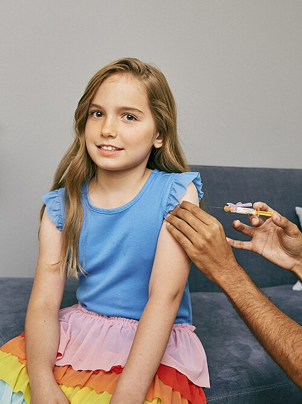
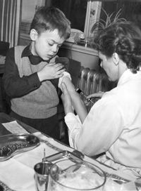

# EVENTOS ADVERSOS PÓS-VACINAÇÃO

Para entender Eventos Adversos Pós-Vacinação (EAPV), o primeiro passo é separar o joio do trigo: associação temporal não é, necessariamente, causalidade. Um EAPV é qualquer ocorrência médica indesejada que acontece após a vacinação, mas que não possui, obrigatoriamente, uma relação direta com o imunobiológico.

O sistema de vigilância brasileiro é robusto porque precisamos diferenciar o que é uma reação esperada do que é um erro de imunização ou uma coincidência. Como professor, vejo muitos alunos perderem questões por não saberem classificar a natureza do evento.

Os eventos podem ser divididos em cinco categorias principais segundo a Organização Mundial da Saúde e o Ministério da Saúde:

- Reação inerente ao produto (ex: febre após DTP).

- Reação devido a defeitos na qualidade do produto.

- Erro de imunização ou de técnica (ex: abscesso por agulha contaminada).

- Reação de ansiedade pós-vacinação (ex: síncope após HPV).

- Evento coincidente (o paciente teria o sintoma mesmo sem a vacina).

*Figura 1 - Administração de vacina por via intramuscular em membro superior. A técnica adequada de aplicação é fundamental para minimizar eventos adversos locais. Fonte: SELF Magazine, CC BY 2.0 | Wikimedia Commons*

## Classificação e Fisiopatologia dos Eventos Adversos

As reações vacinais podem ser locais ou sistêmicas. As reações locais são as mais comuns, como dor, eritema e edema. Elas ocorrem devido à resposta inflamatória aguda ao antígeno ou ao adjuvante (como o alumínio).

Já as reações sistêmicas, como febre e mialgia, refletem a produção de citocinas pirogênicas (IL-1, IL-6, TNF-alfa) durante a ativação do sistema imune inato. É o corpo "aprendendo" a reagir, mas de forma controlada.

### Reações de Hipersensibilidade (Alérgicas)

Aqui mora um perigo real e uma pegadinha clássica de prova. A anafilaxia é rara (1 a 2 casos por milhão de doses), mas é uma contraindicação absoluta para doses subsequentes daquela vacina específica.

Muitas vezes, o culpado não é o antígeno em si, mas componentes como gelatina, neomicina ou proteínas do ovo.
Cuidado: a alergia grave ao ovo (anafilaxia) era uma contraindicação clássica para a Tríplice Viral (SCR), mas as diretrizes atuais da Sociedade Brasileira de Pediatria (SBP) e do Programa Nacional de Imunizações (PNI) esclarecem que a maioria das crianças com alergia ao ovo pode ser vacinada com SCR em ambiente seguro, pois a quantidade de proteína de ovo é ínfima.

Diferente é a vacina da Febre Amarela e a Influenza, que possuem maior carga proteica de ovo e exigem protocolos de dessensibilização ou observação rigorosa em ambiente hospitalar se houver história de anafilaxia.

### Erros de Imunização (Eventos Programáticos)

Estes são evitáveis. Um erro comum é a aplicação inadequada, como injetar uma vacina subcutânea no músculo ou vice-versa. Isso pode gerar abscessos estéreis (frios), que ocorrem pela irritação tecidual causada pelo adjuvante fora do local correto.

Se o abscesso for quente (com sinais flogísticos intensos e pus), pensamos em contaminação bacteriana por falha na técnica de assepsia. A NR 32, que trata da segurança e saúde no trabalho em serviços de saúde, reforça a necessidade de capacitação contínua para evitar esses eventos.

## Vacina BCG: O Calcanhar de Aquiles das Complicações Locais

A BCG (Bacilo Calmette-Guérin) é uma vacina de bactérias vivas atenuadas (*Mycobacterium bovis*). O curso normal é a formação de uma pápula, que vira pústula, úlcera (4 a 7 mm) e, finalmente, a cicatriz vacinal em até 6 a 12 semanas.

### Complicações da BCG e Condutas

As bancas adoram cobrar a "BCGite". Vamos organizar as condutas:

- Abscesso subcutâneo frio e Linfadenopatia regional não supurada (até 3 cm): Conduta expectante. Não puncionar, não drenar.

- Linfadenite regional supurada ou Abscesso subcutâneo quente: Aqui o bicho pega. A conduta é Isoniazida na dose de 10 mg/kg/dia (máximo 300 mg) até a regressão da lesão.

- Úlcera com mais de 1 cm (que demora a cicatrizar): Também tratamos com Isoniazida.

- BCG disseminada: Ocorre em imunocomprometidos graves. É uma emergência médica e requer esquema terapêutico para tuberculose e investigação de imunodeficiência primária.

Importante: A ausência de cicatriz vacinal após a BCG não indica falta de proteção e, segundo a nota informativa do Ministério da Saúde de 2019, não há mais indicação de revacinar crianças que não apresentaram cicatriz. Guarde isso: não se revacina mais por falta de cicatriz.

## A Temida Vacina DPT e o Componente Pertussis

Se existe uma vacina campeã de questões sobre eventos adversos, é a DPT (Difteria, Tétano e Pertussis). O grande vilão é o componente *Pertussis* de células inteiras (DPTw).

### Eventos Adversos da DPTw

- Febre alta (> 39,5°C) e choro inconsolável (por mais de 3 horas): São reações comuns e não contraindicam doses futuras, mas servem de alerta.

- Episódio Hipotônico-Hiporresponsivo (EHH) ou Síndrome Hipotônico-Hiporresponsiva (SHH): Ocorre geralmente nas primeiras 48 horas. A criança fica pálida, flácida e não responde a estímulos. É um evento assustador para os pais, mas benigno e autolimitado, sem sequelas neurológicas.

- Convulsão: Geralmente febril e ocorre nas primeiras 72 horas.

- Encefalopatia: Ocorre nos primeiros 7 dias. É o evento mais grave e raro.

### Mudança de Conduta (O que cai na prova)

Preste muita atenção nesta tabela, pois ela define sua conduta no posto de saúde e na prova:

| Evento Adverso após DPTw | Conduta para as próximas doses |
| --- | --- |
| Febre alta ou choro inconsolável | Manter DPTw (pode usar analgésico profilático) |
| Episódio Hipotônico-Hiporresponsivo (EHH) | Substituir por DPTa (Acelular) |
| Convulsão (qualquer tipo) | Substituir por DPTa (Acelular) |
| Encefalopatia pós-vacinal | Contraindicação do componente Pertussis (usar DT) |

Percebeu a gradação? No EHH e na convulsão, trocamos a "célula inteira" pela "acelular" (DPTa), que é menos reatogênica. Na encefalopatia, o risco é alto demais, então retiramos o componente Pertussis completamente e fazemos apenas a Dupla Infantil (DT).

## Vacinas de Vírus Vivos e Imunocomprometidos

Vacinas como Sarampo, Rubéola, Caxumba (SCR), Varicela, Febre Amarela e Rotavírus utilizam vírus vivos atenuados. O princípio é simples: o vírus se replica no hospedeiro para gerar imunidade, mas não tem força para causar doença em pessoas hígidas.

### O Risco nos Imunocomprometidos

Em pacientes com imunodeficiência grave (HIV com CD4 baixo, neoplasias em quimioterapia, usuários de doses imunossupressoras de corticoides), essas vacinas podem causar a doença vacinal.

O que é "dose imunossupressora" de corticoide para a prova?
Em crianças: Prednisona ≥ 2 mg/kg/dia por mais de 14 dias.
Em adultos: Prednisona ≥ 20 mg/dia por mais de 14 dias.
Se o paciente usou menos tempo ou dose menor, não é considerado imunossuprimido para fins de contraindicação vacinal.

### Particularidades da SCR e Varicela

Na vacina Tríplice Viral (SCR), a febre é o evento sistêmico mais comum, ocorrendo geralmente entre o 5º e o 12º dia após a aplicação (período de incubação do vírus vacinal).

Um detalhe que o Dr. Will sempre reforça: o uso de AAS deve ser evitado por 6 semanas após a vacina de Varicela devido ao risco teórico de Síndrome de Reye, uma complicação hepática e neurológica grave.

Sobre a vacina do Rotavírus: o evento adverso histórico mais famoso foi a invaginação intestinal (intussuscepção). A primeira vacina (Rotashield) foi retirada do mercado por isso. As vacinas atuais têm um risco baixíssimo, mas a história de invaginação intestinal prévia ou malformação congênita do trato gastrointestinal não corrigida são contraindicações absolutas.

## Vacinação na Gestante: O que pode e o que não pode

A gestação é um estado de imunomodulação. A regra de ouro é: vacinas de vírus vivos ou bactérias vivas são contraindicadas (salvo situações de risco epidemiológico extremo avaliadas caso a caso).

### Vacinas Recomendadas (Seguras)

- Influenza: Em qualquer idade gestacional. Protege a mãe de complicações respiratórias e o feto via transplacentária.

- Hepatite B: Se a gestante não for vacinada ou tiver esquema incompleto.

- dTpa (Tríplice Bacteriana Acelular do tipo adulto): Esta é a estrela das provas. Deve ser feita a partir da 20ª semana de gestação em TODA gravidez.
Por que fazemos a dTpa na gestante? Para que ela produza anticorpos contra a Coqueluche (*Bordetella pertussis*) e os transfira para o feto. O objetivo não é proteger a mãe, mas garantir que o recém-nascido tenha anticorpos até que ele possa completar seu próprio esquema vacinal.

Se a gestante perdeu o prazo e não tomou a dTpa, ela deve receber uma dose no puerpério o mais precocemente possível (até 45 dias).

## Eventos Adversos Específicos e Novas Tecnologias

Com a pandemia de COVID-19, novos termos surgiram e já estão caindo em provas de residência. Um deles é a VITT (Trombocitopenia Trombótica Imune Induzida por Vacina).

A fisiopatologia da VITT é muito similar à HIT (Trombocitopenia Induzida por Heparina). O corpo produz anticorpos contra o Fator Plaquetário 4 (PF4), gerando ativação plaquetária intensa, tromboses em locais atípicos (como seios venosos cerebrais) e consumo de plaquetas (trombocitopenia). Foi associada principalmente às vacinas de vetor viral (AstraZeneca/Janssen).

### Vacina HPV e Síncope

A vacina contra o HPV (quadrivalente: tipos 6, 11, 16 e 18) é aplicada em adolescentes. O evento adverso mais comum nessa faixa etária não é uma reação ao componente da vacina, mas uma resposta psicogênica: a síncope vasovagal.
Por isso, a recomendação é manter o adolescente sentado e em observação por 15 a 20 minutos após a aplicação. No MedEvo, sempre lembramos que o HPV não cobre o subtipo 33, uma pegadinha comum de prova que lista vários subtipos.

## Profilaxias Pós-Exposição: Raiva e Tétano

Aqui o erro de conduta é fatal, tanto na vida quanto na prova.

### Profilaxia do Tétano

A conduta depende de dois fatores: o tipo de ferimento (limpo vs. contaminado) e o histórico vacinal do paciente.

| Histórico Vacinal | Ferimento Limpo | Ferimento Contaminado |
| --- | --- | --- |
| Incerto ou < 3 doses | Vacina (dT) | Vacina + Soro (SAT) ou Imunoglobulina (IGAT) |
| 3 doses ou mais (última < 5 anos) | Nada | Nada |
| 3 doses ou mais (última 5-10 anos) | Nada | Vacina (dT) |
| 3 doses ou mais (última > 10 anos) | Vacina (dT) | Vacina (dT) |

Cuidado: Ferimentos graves, sujos, com tecidos desvitalizados, por esmagamento ou queimaduras profundas são considerados de "alto risco" para tétano. Se o paciente tem esquema incompleto, ele PRECISA do soro ou da imunoglobulina.

### Profilaxia da Raiva

A raiva é 100% letal. A conduta depende do animal (cão/gato vs. animais silvestres) e do tipo de ferimento (leve vs. grave).
Ferimentos graves são aqueles em cabeça, face, pescoço, mãos e polpas digitais, ou ferimentos profundos/múltiplos.

Se um paciente é mordido por um cão suspeito na cabeça (ferimento grave), a conduta é imediata: Soro antirrábico + 5 doses de vacina (nos dias 0, 3, 7, 14 e 28). Se o animal puder ser observado por 10 dias e permanecer sadio, pode-se interromper o esquema.

*Figura 2 - Campanha de vacinação contra poliomielite na Suécia (1957). A vigilância dos eventos adversos pós-vacinação acompanha a história das campanhas de imunização em massa. Fonte: Ingemar Berling/Pressens Bild, Domínio Público | Wikimedia Commons*

## Vigilância Epidemiológica e Notificação

Nem todo EAPV precisa ser notificado imediatamente, mas eventos graves, inesperados ou que ocorrem em clusters (vários casos com o mesmo lote) devem ser reportados em até 24 horas.

A vigilância do Sarampo é um exemplo clássico. Com a reemergência do sarampo no Brasil, qualquer caso suspeito exige notificação imediata e bloqueio vacinal em até 72 horas para os contatos. A meta da OPAS para imunidade de rebanho é de 95%. Se a cobertura está em 85%, o cenário é de vulnerabilidade.

### O Papel do CRIE

O Centro de Referência para Imunobiológicos Especiais (CRIE) é o local para onde encaminhamos pacientes que precisam de vacinas que não estão no calendário básico do PNI ou que tiveram eventos adversos graves.
Exemplo: uma criança que teve EHH após a Pentavalente (DTPw + Hib + HepB) deve receber as próximas doses da Pertussis na forma acelular (DPTa), que é disponibilizada pelo CRIE.

## Diagnóstico Diferencial de Eventos Pós-Vacinais

É fundamental não rotular tudo como "culpa da vacina".

- Febre e Exantema após SCR: Pode ser reação vacinal (5-12 dias depois) ou pode ser sarampo selvagem se o paciente foi exposto antes da vacina ter tempo de agir.

- Abscesso pós-BCG: Se for quente e com febre, pense em infecção secundária. Se for frio e crônico, é reação ao bacilo.

- Dor em membros após vacina: Pode ser apenas reação local ou, em casos raros, Síndrome de Guillain-Barré (especialmente após Influenza, embora o risco pós-gripe seja muito maior que o pós-vacina).

### Exposição Ocupacional à Hepatite B

Imagine um profissional de saúde que sofre um acidente com agulha de um paciente HBsAg positivo.
Se o profissional tem 3 doses de vacina e Anti-HBs ≥ 10 mUI/ml: Ele está protegido. Nada a fazer.
Se o profissional não é vacinado ou tem Anti-HBs < 10: Ele deve receber a Imunoglobulina Humana Anti-Hepatite B (IGHAH) preferencialmente nas primeiras 24 horas (até 7 dias) e iniciar/completar o esquema vacinal.

## Pontos-Chave para Prova

- A associação temporal não confirma causalidade; o diagnóstico de EAPV exige exclusão de outras causas e plausibilidade biológica.

- EHH (Episódio Hipotônico-Hiporresponsivo) após DPTw: Conduta é trocar por DPTa nas próximas doses. Não é contraindicação absoluta para a vacina, apenas para o componente de células inteiras.

- Encefalopatia após DPTw: Contraindicação ABSOLUTA para o componente Pertussis (usar DT).

- BCG: Não se revacina mais crianças sem cicatriz vacinal.

- Linfadenite supurada pós-BCG: Tratamento com Isoniazida 10 mg/kg/dia até a cura.

- Vacinas de vírus vivos (SCR, Varicela, Febre Amarela): Contraindicadas em gestantes e imunodeprimidos graves.

- Febre na SCR: É o evento adverso mais comum e ocorre tipicamente entre o 5º e 12º dia.

- Alergia a ovo: Não contraindica SCR na maioria dos casos; exige cautela e ambiente hospitalar para Febre Amarela se a reação prévia foi anafilática.

- Vacina HPV: Principal evento em adolescentes é a síncope vasovagal (psicogênica).

- Vacina dTpa na gestante: Obrigatória a partir da 20ª semana em todas as gestações para proteção neonatal contra coqueluche.

- Invaginação intestinal: Contraindicação absoluta para a vacina do Rotavírus se houver história prévia.

- VITT: Fisiopatologia envolve anticorpos anti-PF4, similar à HIT.

- PPD (ou PT) ≥ 5 mm em vacinados com BCG: No Brasil, é interpretado como Infecção Latente por Tuberculose (ILTB), não apenas efeito da vacina.

- Meningococo B: O uso de antitérmico profilático (paracetamol) é recomendado e não interfere na imunogenicidade, reduzindo a alta incidência de febre nesta vacina específica.

- Erro comum: Achar que desnutrição contraindica vacina. Falso! Desnutrição não é contraindicação.

- AAS e Varicela: Suspender o salicilato por 6 semanas para evitar Síndrome de Reye. 💉

 Cópia offline para consulta pessoal.
 Fonte original:
 [https://www.medevo.com.br/material-apoio/ler/924d8719-6cb2-4ad3-9f14-772ef74af708](https://www.medevo.com.br/material-apoio/ler/924d8719-6cb2-4ad3-9f14-772ef74af708)
