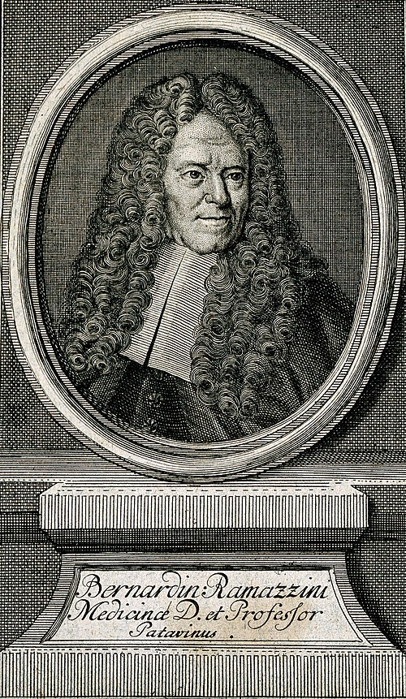
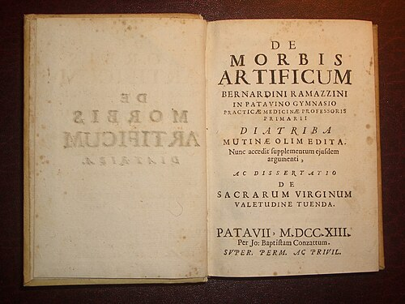

# EVOLUÇÃO HISTÓRICA DA SAÚDE DO TRABALHADOR: RAMAZZINI AOS DIAS ATUAIS

A compreensão da saúde do trabalhador não é um conceito estático, mas um processo cumulativo que reflete as mudanças sociais, políticas e econômicas da humanidade. Para a sua prova de residência, é fundamental entender que saímos de uma visão puramente biológica e individual (Medicina do Trabalho) para uma visão de determinação social e coletiva (Saúde do Trabalhador).

## A Antiguidade e os Primeiros Registros

Embora a medicina sistematizada do trabalho seja recente, a percepção de que o ambiente laboral adoece o homem remonta à Antiguidade. O foco das bancas aqui costuma ser em nomes específicos que estabeleceram os primeiros marcos de proteção.

### Plínio o Velho e o Primeiro EPI

No século I d.C., Plínio o Velho descreveu o uso de bexigas de carneiro por trabalhadores que manuseavam minas de cinábrio (sulfeto de mercúrio). O objetivo era evitar a inalação da poeira tóxica.

**Dica de Prova:** Se a questão mencionar o "primeiro Equipamento de Proteção Individual (EPI) descrito na história", a resposta é a bexiga de carneiro de Plínio o Velho. As bancas adoram essa curiosidade histórica para testar se você conhece as raízes da higiene ocupacional.

### Hipócrates e a Observação do Meio

Hipócrates, o pai da medicina, já associava doenças a fatores ambientais. Ele descreveu a intoxicação por chumbo (saturnismo) em mineiros. Note que, nesta época, o trabalho braçal era delegado a escravos, o que explica por que a medicina demorou séculos para formalizar o cuidado com essa população, a saúde do trabalhador não era uma prioridade para a elite intelectual.

*Figura 1 - Bernardino Ramazzini (1633-1714), considerado o Pai da Medicina do Trabalho. Sua obra seminal estabeleceu as bases da investigação das doenças ocupacionais. Fonte: Domínio Público | Wikimedia Commons*

## O Marco Divisor: Bernardino Ramazzini

Se existe um nome que você precisa levar para a prova, é Bernardino Ramazzini. No ano de 1700, ele publicou a obra "De Morbis Artificum Diatriba" (As Doenças dos Trabalhadores). Ramazzini é universalmente reconhecido como o "Pai da Medicina do Trabalho".

### A Pergunta de Ouro na Anamnese

Ramazzini percebeu que os médicos de sua época falhavam ao ignorar o contexto de vida do paciente. Ele propôs que, ao roteiro hipocrático de anamnese, fosse adicionada uma pergunta fundamental: "Et quam artem exerceat?" ou, em bom português, "Qual é a sua profissão?".

**Exemplo Clínico:** Imagine um paciente de 45 anos com quadro de tosse crônica e dispneia aos esforços. Se você focar apenas na ausculta e no RX, pode diagnosticar uma DPOC idiopática. Mas, ao aplicar o ensinamento de Ramazzini e descobrir que ele trabalhou 20 anos em uma fábrica de jateamento de areia, o diagnóstico muda para Silicose.

**Cuidado:** Muitos alunos acham que Ramazzini defendia a mudança do processo de trabalho. Na verdade, ele focava na descrição das doenças e na proteção individual. A visão de "Saúde do Trabalhador" como transformação social viria muito depois. Para Ramazzini, o foco era o diagnóstico clínico associado à ocupação.

*Figura 2 - Frontispício da edição definitiva (1713) de "De Morbis Artificum Diatriba" de Ramazzini. Esta obra catalogou sistematicamente as doenças de mais de 50 profissões. Fonte: Tspvmo44, CC BY-SA 4.0 | Wikimedia Commons*

## A Revolução Industrial e a Medicina do Trabalho

Com a Revolução Industrial na Inglaterra (século XVIII e XIX), o cenário mudou drasticamente. A migração em massa para as cidades, jornadas de 16 horas, trabalho infantil e ambientes insalubres geraram uma massa de trabalhadores doentes que ameaçava a produtividade das fábricas.

### O Surgimento da Medicina do Trabalho

Neste contexto, a Medicina do Trabalho nasce com um viés utilitarista. O médico era contratado pelo dono da fábrica para garantir que o trabalhador estivesse apto a produzir. O foco era o "reparo" da força de trabalho.

### Robert Baker e o Factory Act de 1833

Um marco legislativo fundamental foi o Factory Act de 1833. Robert Baker, um dos primeiros inspetores de fábrica, foi crucial para a implementação desta lei.

**Pontos-chave do Factory Act (1833):**

- Limitação da jornada de trabalho para crianças.

- Proibição do trabalho infantil noturno.

- Exigência de certificação médica para o trabalho.

As bancas cobram o Factory Act como o embrião da fiscalização pública sobre a saúde nos ambientes de trabalho. Foi a primeira vez que o Estado interveio na relação direta entre patrão e empregado em prol da saúde.

## Evolução dos Modelos: Da Medicina do Trabalho à Saúde do Trabalhador

Este é o ponto onde a maioria dos candidatos se confunde. Existem três modelos que coexistem, mas que possuem filosofias diferentes. Como sempre discutimos no MedEvo, entender a lógica por trás do conceito é melhor do que decorar a tabela.

### Tabela 1: Comparativo dos Modelos de Atenção

| Característica | Medicina do Trabalho | Saúde Ocupacional | Saúde do Trabalhador |
| --- | --- | --- | --- |
| **Foco** | Indivíduo e doença | Ambiente e riscos | Processo saúde-doença social |
| **Objetivo** | Aptidão para o trabalho | Higiene e segurança | Integralidade e participação |
| **Sujeito** | O trabalhador como objeto | O trabalhador como recurso | O trabalhador como sujeito |
| **Atuação** | Dentro da empresa | Multidisciplinar (Engenharia/Medicina) | Intersetorial e Transversal (SUS) |

### Saúde Ocupacional (Modelo OMS/OIT)

Após a Segunda Guerra Mundial, com a criação da OMS e da OIT, surgiu o conceito de Saúde Ocupacional. A ideia aqui é a "adaptação do trabalho ao homem". Não basta apenas tratar a doença; é preciso controlar os riscos químicos, físicos e biológicos do ambiente.

**Pegadinha de Prova:** A alternativa dirá que a Saúde Ocupacional foca na participação social do trabalhador. Errado! Quem foca na participação social e no saber operário é o modelo de **Saúde do Trabalhador**, consolidado no Brasil com o SUS.

## A Evolução da Saúde do Trabalhador no Brasil

A história brasileira é marcada pela evolução da Previdência Social. As bancas amam correlacionar a era política com o modelo de assistência.

### 1. Lei Eloy Chaves (1923) e as CAPs

A Lei Eloy Chaves é o marco inicial da previdência social no Brasil. Ela criou as Caixas de Aposentadorias e Pensões (CAPs).

**Característica das CAPs:** Eram organizadas por **empresa** (ex: CAP dos Ferroviários da Cia Paulista). O financiamento era bipartido (trabalhador e empresa), sem participação direta do Estado na gestão. Era um seguro social privado e restrito.

### 2. Era Vargas e os IAPs

Com a ascensão de Getúlio Vargas e a industrialização acelerada, o modelo mudou para os Institutos de Aposentadoria e Pensões (IAPs).

**Diferença Fundamental:** Os IAPs eram organizados por **categoria profissional** (ex: IAP dos Marítimos, IAP dos Comerciários) e eram autarquias federais. Aqui, o Estado assume o controle. O objetivo de Vargas era duplo: oferecer assistência médica previdenciária para acalmar o operariado urbano e usar os fundos das pensões para financiar a industrialização nacional.

### 3. Unificação: INPS e INAMPS

Em 1966 (Ditadura Militar), os IAPs foram unificados no INPS (Instituto Nacional de Previdência Social). A assistência médica foi separada posteriormente no INAMPS. O modelo era curativo, hospitalocêntrico e excludente (só tinha direito quem tinha carteira assinada).

## A Saúde do Trabalhador no SUS

Com a Constituição de 1988 e a Lei 8.080/90, a saúde deixa de ser um privilégio de quem contribui para a previdência e passa a ser um direito de todos. A Saúde do Trabalhador é incorporada ao campo de atuação do SUS.

### O Conceito de Saúde do Trabalhador no SUS

Diferente da Medicina do Trabalho, a Saúde do Trabalhador no SUS entende que o trabalho é um **determinante social da saúde**. O processo saúde-doença é construído socialmente.

**Princípios da Saúde do Trabalhador no SUS:**

- **Universalidade:** Atende o trabalhador formal, informal, autônomo e desempregado.

- **Integralidade:** Ações de promoção, prevenção, assistência e vigilância.

- **Participação Social:** O trabalhador deve participar do planejamento das ações de saúde.

- **Intersetorialidade:** Diálogo entre Saúde, Trabalho e Previdência.

### RENAST e CEREST

Para operacionalizar isso, foi criada a Rede Nacional de Atenção Integral à Saúde do Trabalhador (RENAST). O braço executor e técnico dessa rede são os Centros de Referência em Saúde do Trabalhador (CEREST, antigamente chamados de CRST).

**O que o CEREST faz (e o que ele NÃO faz):**

- **Faz:** Apoio matricial para a rede básica, vigilância de ambientes de trabalho, emissão de pareceres técnicos, capacitação de profissionais.

- **Não faz:** O CEREST não deve ser a "porta de entrada" para consultas assistenciais comuns. Ele é um centro de retaguarda técnica e vigilância.

### Tabela 2: Evolução da Previdência e Saúde no Brasil

| Período | Modelo | Organização | Público-Alvo |
| --- | --- | --- | --- |
| **1923 (Eloy Chaves)** | CAPs | Por Empresa | Ferroviários e setores específicos |
| **Anos 30 (Vargas)** | IAPs | Por Categoria Profissional | Trabalhadores urbanos sindicalizados |
| **1966 (Militar)** | INPS / INAMPS | Unificado | Trabalhadores com carteira assinada |
| **1988 (Atual)** | SUS | Descentralizado / Universal | Todos os cidadãos (incluindo informais) |

## Política Nacional de Saúde do Trabalhador e da Trabalhadora (PNST)

Instituída pela Portaria nº 1.823/2012, a PNST define as diretrizes para o setor. Para a prova, você deve saber que ela integra a Vigilância em Saúde do Trabalhador (VISAT) com as demais vigilâncias (epidemiológica, sanitária e ambiental).

### Objetivos da PNST:

- Fortalecer a Vigilância em Saúde do Trabalhador (VISAT).

- Promover a saúde e ambientes de trabalho seguros.

- Garantir a integralidade da assistência.

- Produzir informação e conhecimento (notificação de agravos).

**Erro Comum de Aluno:** Achar que a PNST só se aplica a empresas públicas. Ela define as diretrizes para todo o território nacional, visando todos os trabalhadores, independentemente da forma de inserção no mercado de trabalho.

## Vigilância em Saúde do Trabalhador (VISAT)

A VISAT é o componente do SUS que atua diretamente sobre os determinantes de saúde no trabalho. Ela não foca apenas no indivíduo doente, mas no processo de trabalho que gera o doente.

### Ações Transversais

A VISAT deve ser transversal. Isso significa que, se um médico na Unidade Básica de Saúde (UBS) atende vários casos de dermatite em trabalhadores de uma mesma marcenaria, ele deve acionar a vigilância para inspecionar o local. Isso é a aplicação prática da determinação social da saúde.

**Exemplo Clínico:** Um médico do PSF nota um aumento de casos de intoxicação por agrotóxicos em uma região rural. Segundo a PNST, a conduta não é apenas tratar o paciente com atropina/oximas, mas sim notificar o agravo no SINAN e articular uma ação de vigilância no território para avaliar como esses produtos estão sendo aplicados.

## A Importância da Notificação

Na Saúde do Trabalhador, a notificação é uma ferramenta de gestão. Existem agravos de notificação compulsória relacionados ao trabalho que caem com frequência:

- Acidente de trabalho grave (morte, mutilação ou em menores).

- Acidente com exposição a material biológico.

- Doenças profissionais (Silicose, PAIR, LER/DORT).

- Intoxicações exógenas.

**Dica do Dr. Will:** Lembre-se que a notificação no SINAN (Sistema de Informação de Agravos de Notificação) é um dever do profissional de saúde (público ou privado) e não se confunde com a CAT (Comunicação de Acidente de Trabalho), que é um documento previdenciário.

## Previdência Social e Saúde: O Nexo Técnico Epidemiológico (NTEP)

Embora o SUS cuide da saúde, a Previdência Social (INSS) cuida do benefício. Um conceito moderno que as bancas cobram é o NTEP.

O NTEP permite que o perito do INSS estabeleça o nexo entre a doença e o trabalho apenas cruzando o diagnóstico (CID) com a atividade da empresa (CNAE). Se há uma alta incidência estatística de depressão em bancários, o nexo é presumido. Isso inverte o ônus da prova: a empresa é que precisa provar que a doença NÃO foi causada pelo trabalho.

### Tabela 3: Diferenças entre CAT e Notificação SINAN

| Característica | CAT (Comunicação de Acidente de Trabalho) | Notificação SINAN (Saúde Pública) |
| --- | --- | --- |
| **Finalidade** | Previdenciária (benefícios, estabilidade) | Epidemiológica (planejamento de ações) |
| **Público** | Trabalhadores segurados pelo INSS (CLT) | Todos os trabalhadores (Universal) |
| **Quem emite** | Empresa (ou médico, sindicato, autoridade) | Profissional de saúde que prestou atendimento |
| **Prazo** | Até o primeiro dia útil seguinte ao acidente | Conforme a lista de agravos (imediata ou semanal) |

## Desafios Atuais: A Precarização e a "Uberização"

O modelo de Ramazzini e até o modelo de Vargas focavam no trabalhador industrial, com local fixo e jornada definida. Hoje, o desafio da Saúde do Trabalhador no SUS é alcançar o trabalhador de plataforma (Uber, iFood), o trabalhador doméstico e o setor informal.

A PNST reconhece que esses trabalhadores estão sob maior risco, pois não possuem a proteção dos SESMT (Serviços Especializados em Engenharia de Segurança e em Medicina do Trabalho) das empresas e muitas vezes negligenciam a própria saúde em busca de metas de produtividade impostas por algoritmos.

## Síntese da Evolução do Pensamento

Para fechar o raciocínio clínico-histórico, perceba a mudança de paradigma:

- **Fase de Plínio/Ramazzini:** Observação e descrição. O médico como observador curioso.

- **Fase da Revolução Industrial:** Controle e reparo. O médico como guardião da produtividade fabril.

- **Fase da Saúde Ocupacional:** Higiene e risco. O médico como parte de uma equipe técnica de segurança.

- **Fase da Saúde do Trabalhador (SUS):** Direito e transformação. O médico como agente de saúde pública que entende o trabalho como parte da vida social.

## Pontos-Chave para Prova

- **Bernardino Ramazzini:** Pai da Medicina do Trabalho, autor de *De Morbis Artificum Diatriba* (1700). Instituiu a pergunta "Qual a sua profissão?".

- **Plínio o Velho:** Descreveu o primeiro EPI (bexiga de carneiro) para proteção contra poeiras de mercúrio.

- **Factory Act (1833):** Marco inglês que limitou o trabalho infantil e exigiu exames médicos, sob influência de Robert Baker.

- **Lei Eloy Chaves (1923):** Marco inicial da previdência no Brasil. Criou as CAPs (por empresa).

- **IAPs (Era Vargas):** Institutos organizados por categoria profissional. Gestão estatal e uso dos fundos para industrialização.

- **Medicina do Trabalho vs. Saúde do Trabalhador:** A primeira é centrada na doença e na empresa; a segunda é centrada no sujeito, na integralidade e no SUS.

- **RENAST:** Rede Nacional de Atenção Integral à Saúde do Trabalhador. O CEREST é o seu centro de referência técnica.

- **PNST (2012):** Política Nacional que define o trabalho como determinante social da saúde e integra a vigilância (VISAT) ao SUS.

- **Universalidade no SUS:** A Saúde do Trabalhador no SUS atende inclusive trabalhadores informais e desempregados, diferente do modelo previdenciário (INSS).

- **Anamnese Ocupacional:** É obrigatória em qualquer atendimento clínico. Não perguntar a profissão é um erro técnico e histórico.

- **Notificação SINAN:** É compulsória para agravos relacionados ao trabalho (ex: acidente grave, intoxicação, PAIR, LER/DORT) e independe do vínculo empregatício.

- **CAT vs. SINAN:** A CAT é para o INSS (trabalhador formal); o SINAN é para o Ministério da Saúde (todos).

- **NTEP:** Nexo Técnico Epidemiológico. Presunção de nexo entre CID e CNAE pelo INSS.

- **Participação Social:** É diretriz da Saúde do Trabalhador no SUS. O trabalhador não é apenas objeto de cuidado, mas sujeito que opina sobre os riscos do seu ambiente.

- **Primeira Escolha em Vigilância:** Ações coletivas no ambiente de trabalho (proteção coletiva) sempre têm prioridade sobre o uso de EPI (proteção individual). 🛡️

 Cópia offline para consulta pessoal.
 Fonte original:
 [https://www.medevo.com.br/material-apoio/ler/c7e89e57-5a09-45b8-bc1f-79ff231455b4](https://www.medevo.com.br/material-apoio/ler/c7e89e57-5a09-45b8-bc1f-79ff231455b4)
