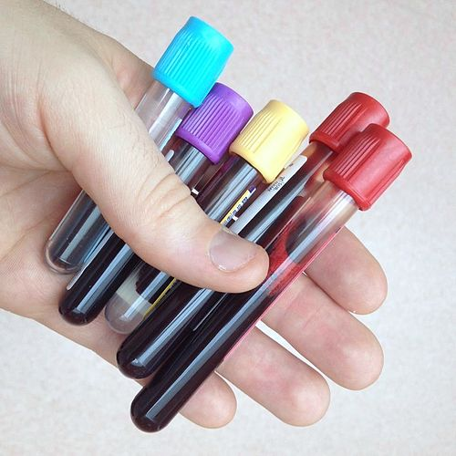

# EXAMES LABORATORIAIS DO PRÉ-NATAL

O pedido de exames no pré-natal não é uma mera formalidade burocrática. Para a prova de residência e para a sua vida no consultório, você precisa entender que cada item ali tem um "timing" biológico e uma razão epidemiológica. No Brasil, seguimos as diretrizes do Ministério da Saúde e da FEBRASGO, que buscam rastrear condições que, se não tratadas, aumentam drasticamente a morbimortalidade materna e perinatal.

Muitos alunos erram questões por decorarem valores de forma isolada. Aqui no MedEvo, sempre batemos na tecla: entenda a fisiologia da gestação para entender o porquê do exame. Por exemplo, por que a hemoglobina da gestante é mais baixa? Não é necessariamente falta de ferro, mas sim uma hemodiluição fisiológica. O volume plasmático aumenta cerca de 50%, enquanto a massa de hemácias aumenta apenas 20 a 30%. Se você entende isso, não se desespera com um HB de 11,5 g/dL.

*Figura 1 - Tubos de coleta de sangue a vácuo utilizados na rotina laboratorial do pré-natal. Cada cor de tampa corresponde a um tipo de anticoagulante e exame específico. Fonte: Tannim101, CC BY 3.0 | Wikimedia Commons*

## Rotina de Exames: O Calendário de Rastreamento

A divisão clássica dos exames ocorre por trimestres. O Ministério da Saúde preconiza uma bateria inicial na primeira consulta (idealmente no primeiro trimestre) e repetições estratégicas.

### Primeiro Trimestre (ou na primeira consulta)

Nesta fase, o objetivo é o diagnóstico precoce de infecções, anemias e distúrbios metabólicos pré-existentes.

- Hemograma completo.

- Tipagem sanguínea e Fator Rh.

- Coombs indireto (se a gestante for Rh negativo).

- Glicemia de jejum.

- VDRL (Sífilis).

- Anti-HIV.

- Sorologia para Toxoplasmose (IgG e IgM).

- HBsAg (Hepatite B).

- Urina tipo I (EAS) e Urocultura.

- Exame de fezes (opcional, dependendo da região).

- Eletroforese de hemoglobina (se houver suspeita ou risco étnico).

### Segundo Trimestre

O foco aqui muda para o metabolismo da glicose, pois é quando a resistência insulínica placentária atinge seu ápice.

- Teste Oral de Tolerância à Glicose (TOTG 75g), realizado entre 24 e 28 semanas.

- Coombs indireto (se Rh negativo e o primeiro foi negativo).

### Terceiro Trimestre

Repetimos os exames que podem ter tido soroconversão ou que precisam de vigilância perto do parto.

- Hemograma (para avaliar anemia e preparo para perdas sanguíneas no parto).

- Glicemia de jejum (se não houver diagnóstico de DMG).

- VDRL e Anti-HIV.

- HBsAg e Anti-HCV (este último conforme risco ou diretriz local).

- Repetição da Toxoplasmose (se a paciente era susceptível, ou seja, IgG e IgM negativos).

- Pesquisa de Estreptococo do Grupo B (GBS), entre 35 e 37 semanas.

*Figura 2 - Consulta de pré-natal com palpação abdominal. O acompanhamento gestacional inclui exames laboratoriais seriados para rastreio de condições de risco materno-fetal. Fonte: USAID, Domínio Público | Wikimedia Commons*

## Hematologia e Tipagem Sanguínea

A tipagem sanguínea é o primeiro passo para evitar a Doença Hemolítica Perinatal. Se a gestante é Rh positivo, encerramos o assunto. Mas, se ela for Rh negativo, o sinal de alerta acende.

### O Manejo da Gestante Rh Negativo

Se a paciente é Rh negativo, o próximo passo obrigatório é saber o tipo sanguíneo do parceiro. Se o parceiro também for Rh negativo, o feto será obrigatoriamente Rh negativo e não há risco. No entanto, as bancas costumam colocar o parceiro como Rh positivo ou desconhecido.

Nesse cenário, solicitamos o Coombs Indireto. Este exame detecta anticorpos anti-Rh no soro materno.

- **Coombs Indireto Negativo:** A gestante não está sensibilizada. Devemos repetir o exame mensalmente (ou trimestralmente, conforme a diretriz adotada, mas a prova costuma cobrar a vigilância mensal até a 28ª semana).

- **A Regra da 28ª Semana:** Se o Coombs continuar negativo, a recomendação é realizar a Imunoglobulina Anti-Rh (Anti-D) profilática na 28ª semana. Isso reduz drasticamente a chance de sensibilização no final da gestação e no parto.

- **Pós-parto:** Se o recém-nascido for Rh positivo, a mãe deve receber uma nova dose de Imunoglobulina em até 72 horas.

**Cuidado com a pegadinha:** Se a gestante for Rh negativo, mas apresentar o chamado "Du Positivo" (Rh variante), ela deve ser considerada Rh positivo para fins práticos. Isso significa que ela NÃO precisa de Coombs indireto e NÃO precisa de imunoglobulina.

### Anemia na Gestação

Como mencionei antes, a hemodiluição é fisiológica. Por isso, os critérios de anemia mudam. Segundo a OMS e o Ministério da Saúde:

- **Hb ≥ 11 g/dL:** Normal. Mantém-se apenas a suplementação profilática de ferro (40 a 60 mg de ferro elementar por dia, a partir da 20ª semana).

- **Hb entre 8 e 11 g/dL:** Anemia leve a moderada. Aqui, a conduta deixa de ser profilática e passa a ser tratamento (doses de 120 a 200 mg de ferro elementar/dia).

- **Hb < 8 g/dL:** Anemia grave. Requer investigação imediata e provável encaminhamento ao pré-natal de alto risco.

## Metabolismo da Glicose: O Pesadelo das Bancas

Este é, sem dúvida, o tema que mais gera confusão. O Dr. Will sempre lembra que as diretrizes brasileiras seguem critérios rigorosos para não deixar passar o Diabetes Mellitus Gestacional (DMG).

### Diagnóstico no Primeiro Trimestre

Na primeira consulta, pedimos a Glicemia de Jejum (GJ). O objetivo é identificar quem já era diabética antes de engravidar e quem já apresenta alterações precoces.

| Valor da Glicemia de Jejum (1º Tri) | Diagnóstico |
| --- | --- |
| < 92 mg/dL | Normal (mas precisará de TOTG no 2º tri) |
| 92 a 125 mg/dL | Diabetes Mellitus Gestacional (DMG) |
| ≥ 126 mg/dL | Diabetes Mellitus Pregresso (Overt Diabetes) |

**Por que 92?** Porque estudos mostraram que, a partir desse valor, os riscos de desfechos adversos (como macrossomia e pré-eclâmpsia) aumentam significativamente. Se a paciente tem uma glicemia casual ≥ 200 mg/dL com sintomas, ou uma HbA1c ≥ 6,5%, também fechamos o diagnóstico de Diabetes Pregresso.

### O TOTG 75g (24 a 28 semanas)

Se a GJ inicial foi normal (< 92), a gestante deve realizar o Teste Oral de Tolerância à Glicose com 75g de dextrosol. O diagnóstico de DMG é feito se APENAS UM valor estiver alterado:

- Jejum: ≥ 92 mg/dL

- 1 hora: ≥ 180 mg/dL

- 2 horas: ≥ 153 mg/dL

**Erro comum de prova:** Achar que precisa de dois valores alterados. Não! Apenas um valor igual ou superior aos limites já define DMG. Se o TOTG for totalmente normal, a paciente segue o pré-natal de baixo risco.

### Manejo Inicial do DMG

Uma vez diagnosticado o DMG (seja pela GJ de 95 no primeiro trimestre ou pelo TOTG alterado), a conduta inicial é SEMPRE não farmacológica: Medidas Educativas e de Estilo de Vida (MEV). Isso inclui dieta fracionada e atividade física (se não houver contraindicação obstétrica). Apenas se os níveis glicêmicos permanecerem alterados após 1 a 2 semanas de dieta é que iniciamos a insulinoterapia.

## Doenças Infectocontagiosas: O Rastreamento Sorológico

Aqui o examinador quer saber se você sabe interpretar os resultados e qual a conduta imediata para evitar a transmissão vertical.

### Sífilis: A Epidemia Silenciosa

O rastreamento é feito com testes não treponêmicos (VDRL ou RPR).

- **VDRL Reagente:** Sempre deve ser confirmado com um teste treponêmico (FTA-Abs ou Teste Rápido), a menos que o teste inicial já tenha sido um Teste Rápido treponêmico.

- **Tratamento:** A única droga considerada eficaz para tratar o feto é a Penicilina Benzatina. Qualquer outro tratamento (como ceftriaxone ou eritromicina) é considerado tratamento inadequado para fins de prevenção da sífilis congênita.

- **Parceiro:** Deve ser tratado simultaneamente. A falta de tratamento do parceiro, na visão clássica das provas, torna o tratamento da gestante inadequado.

### HIV na Gestação

O diagnóstico de HIV na gestante é uma emergência médica. Se o teste rápido for positivo, a conduta é iniciar a Terapia Antirretroviral (TARV) imediatamente, antes mesmo de esperar a carga viral ou CD4. O objetivo é tornar a carga viral indetectável o mais rápido possível para permitir o parto vaginal e reduzir a transmissão vertical a quase zero.

### Toxoplasmose: O Teste de Avidez

A interpretação da toxoplasmose é um clássico.

- **IgG negativo / IgM negativo:** Susceptível. Orientar medidas higienodietéticas (não comer carne crua, lavar bem vegetais, cuidado com fezes de gatos) e repetir sorologia mensal ou trimestralmente.

- **IgG positivo / IgM negativo:** Imunidade antiga. Não há risco para a gestação atual.

- **IgG negativo / IgM positivo:** Infecção aguda ou IgM residual/falso positivo. Iniciar Espiramicina imediatamente e repetir o IgG em 2 semanas para verificar a soroconversão.

- **IgG positivo / IgM positivo:** Infecção recente? Aqui entra o **Teste de Avidez da IgG**.

**O Teste de Avidez:** Só tem utilidade se realizado no primeiro trimestre (até 16 semanas).

- **Alta Avidez:** Infecção ocorreu há mais de 4 meses (antes da gestação). Pode suspender a medicação.

- **Baixa Avidez:** Infecção recente (possivelmente durante a gestação). Manter tratamento e investigar o feto (amniocentese com PCR para Toxo após 18 semanas).

### Hepatite B

O marcador de rastreio é o HBsAg.

- **HBsAg Positivo:** Indica infecção (crônica ou aguda). Deve-se solicitar HBeAg e carga viral para avaliar o risco de transmissão vertical. O recém-nascido deverá receber a vacina e a imunoglobulina (HBIG) nas primeiras 12 horas de vida.

- **HBsAg Negativo e Anti-HBs Negativo:** Paciente susceptível e não vacinada. A conduta é vacinar imediatamente (a vacina da Hepatite B é segura e recomendada na gestação).

## Infecção Urinária e Estreptococo

A fisiologia renal muda na gravidez: há dilatação dos ureteres e da pelve renal (pela progesterona e compressão mecânica), além de glicosúria fisiológica. Isso torna a urina um meio de cultura perfeito.

### Bacteriúria Assintomática

Diferente da população geral, na gestante, tratamos a bacteriúria assintomática (presença de > 100.000 UFC/mL de uma única bactéria em paciente sem sintomas). Por que tratamos? Porque 30 a 40% dessas gestantes evoluirão para Pielonefrite, o que aumenta o risco de trabalho de parto prematuro.

- **Conduta:** Tratar com antibiótico (conforme antibiograma) e repetir a urocultura após o tratamento para confirmar a cura.

### Estreptococo do Grupo B (GBS)

O rastreamento é feito com swab vaginal e anal entre 35 e 37 semanas.

- **Cultura Positiva:** Indicação de profilaxia intraparto com Penicilina Cristalina ou Ampicilina.

- **Quando NÃO precisa de rastreio (já tem indicação de profilaxia):**

- Gestante com urocultura positiva para GBS na gestação atual (mesmo que tratada).

- Gestante que já teve um filho anterior com sepse neonatal por GBS.

- **Quando NÃO fazemos profilaxia:** Cesárea eletiva (fora de trabalho de parto e com membranas íntegras), mesmo que a cultura seja positiva.

## Outros Exames e Situações Especiais

### Tireoide

O TSH não é um exame de rotina obrigatório pelo Ministério da Saúde para todas as gestantes, mas a FEBRASGO sugere o rastreamento universal ou em grupos de risco. Se o TSH estiver elevado (> 2,5 mUI/L no primeiro trimestre ou conforme laboratório), o tratamento de escolha é a Levotiroxina. O hipotireoidismo não tratado está ligado a perdas gestacionais e prejuízo no desenvolvimento cognitivo fetal.

### Citopatológico (Papanicolau)

A gestação não protege contra o câncer de colo uterino. Se a paciente estiver na idade de rastreio e com exames atrasados, o preventivo deve ser colhido normalmente. A única ressalva é evitar a coleta endocervical com a escovinha (usar apenas a espátula de Ayre) para evitar sangramentos que assustem a paciente, embora a segurança do procedimento seja bem documentada.

### Tabela Comparativa: Diagnóstico de Diabetes na Gestação

| Exame | Normal | DMG | Diabetes Pregresso |
| --- | --- | --- | --- |
| Glicemia Jejum (1º tri) | < 92 | 92 - 125 | ≥ 126 |
| TOTG 75g (Jejum) | < 92 | ≥ 92 | - |
| TOTG 75g (1h) | < 180 | ≥ 180 | - |
| TOTG 75g (2h) | < 153 | ≥ 153 | - |
| Glicemia Casual | - | - | ≥ 200 + sintomas |

### Tabela: Resumo de Condutas em Infecções

| Infecção | Rastreio | Conduta se Positivo |
| --- | --- | --- |
| Sífilis | VDRL | Penicilina Benzatina (dose conforme estágio) |
| HIV | Teste Rápido / ELISA | Iniciar TARV imediatamente |
| Toxoplasmose | IgG / IgM | Se IgM+: Espiramicina + Teste de Avidez |
| Hepatite B | HBsAg | Vacina + HBIG para o RN ao nascer |
| GBS | Swab (35-37 sem) | Penicilina Cristalina no trabalho de parto |

## Pontos-Chave para Prova 💡

- **Glicemia de Jejum entre 92 e 125 mg/dL** no primeiro trimestre é diagnóstico direto de Diabetes Mellitus Gestacional. Não precisa de TOTG para confirmar.

- **Glicemia de Jejum ≥ 126 mg/dL** ou HbA1c ≥ 6,5% no início da gravidez define Diabetes Mellitus Pregresso (Overt Diabetes).

- **Glicosúria isolada** na gestante é comum e não diagnostica diabetes, pois o limiar renal para glicose diminui e a TFG aumenta.

- **VDRL reagente** sempre exige confirmação com teste treponêmico antes de fechar diagnóstico, mas na gestante, muitas vezes iniciamos o tratamento com a primeira dose de Penicilina enquanto aguardamos o confirmatório para não perder tempo.

- **Tratamento da Sífilis:** Deve ser encerrado até 30 dias antes do parto para que o feto seja considerado tratado.

- **Coombs Indireto Negativo em mãe Rh-:** Repetir mensalmente. Se chegar na 28ª semana negativo, fazer Imunoglobulina Anti-D.

- **Mãe Rh- com parceiro Rh-:** Não há necessidade de vigilância com Coombs ou profilaxia.

- **Toxoplasmose IgM e IgG positivos no 1º trimestre:** Solicitar Teste de Avidez. Se alta avidez (>60%), a infecção é antiga e não há risco.

- **Bacteriúria Assintomática:** Sempre tratar na gestante para prevenir pielonefrite e prematuridade.

- **Rastreio de GBS:** Realizado entre 35 e 37 semanas. Se a paciente tiver indicação de cesárea eletiva com bolsa íntegra, a profilaxia não é necessária mesmo com swab positivo.

- **Anemia:** Hb < 11 g/dL. Se entre 8 e 11, tratar com 120-200mg de ferro elementar. Se < 8, investigar causas graves.

- **Hepatite B:** Se a gestante for HBsAg negativo e não vacinada, deve iniciar o esquema vacinal em qualquer idade gestacional.

- **HIV:** A carga viral deve ser solicitada para decidir a via de parto (se CV indetectável após 34 semanas, o parto pode ser vaginal).

- **Rubéola:** O rastreio visa identificar gestantes susceptíveis (IgG negativo) para vaciná-las no puerpério. A vacina é de vírus vivo atenuado e é contraindicada na gestação.

- **Citomegalovírus (CMV):** Não faz parte da rotina de rastreamento do Ministério da Saúde ou da OMS devido à falta de intervenções eficazes de rotina para prevenir a transmissão vertical.

 Cópia offline para consulta pessoal.
 Fonte original:
 [https://www.medevo.com.br/material-apoio/ler/55490409-41d1-48ff-af26-e13952afc7ff](https://www.medevo.com.br/material-apoio/ler/55490409-41d1-48ff-af26-e13952afc7ff)
