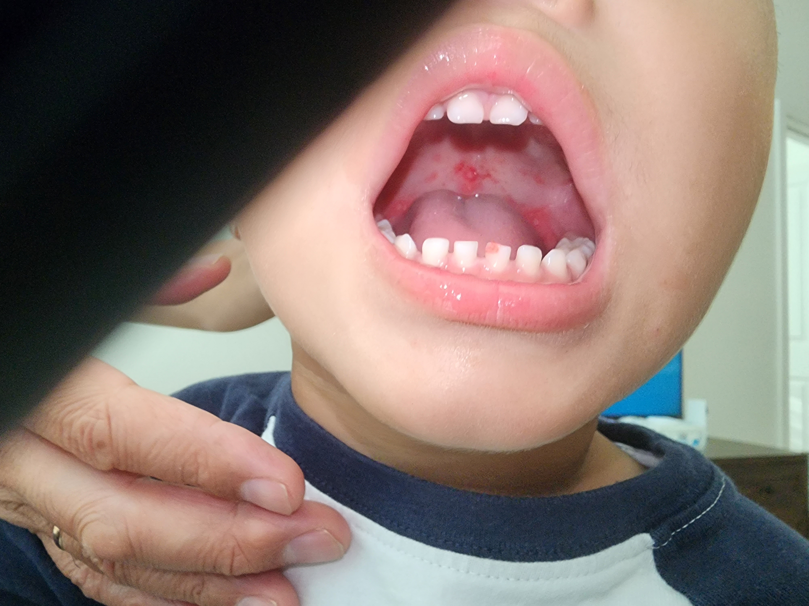

# FARINGOAMIGDALITES

Para começar nossa conversa, você precisa entender que a faringoamigdalite é um dos temas mais comuns tanto no pronto-socorro quanto nas provas de residência. O grande desafio aqui não é apenas dar um diagnóstico, mas sim saber diferenciar quem precisa de antibiótico e quem não precisa.

Muitos alunos erram por querer tratar todo "ponto de pus" com amoxicilina, mas, como veremos, a medicina baseada em evidências e as diretrizes da Sociedade Brasileira de Pediatria (SBP) e da Associação Brasileira de Otorrinolaringologia (ABORL-CCF) nos mostram que o buraco é mais embaixo.

## Etiologia e Fisiopatologia: O Porquê da Diferenciação

A imensa maioria das faringoamigdalites, cerca de 70% a 80% em adultos e 50% a 60% em crianças, tem origem viral. Estamos falando de Rinovírus, Coronavírus, Adenovírus, Influenza e o vírus Epstein-Barr.

Por que isso importa? Porque vírus não respondem a antibióticos. O uso indiscriminado gera resistência bacteriana e efeitos colaterais desnecessários.

Quando falamos de bactérias, o protagonista absoluto é o *Streptococcus pyogenes*, também conhecido como Estreptococo Beta-Hemolítico do Grupo A (EGA). Ele é o responsável por cerca de 15% a 30% dos casos em crianças e 5% a 15% em adultos.

Existem outras bactérias, como os grupos C e G, *Fusobacterium necrophorum* e *Arcanobacterium haemolyticum*, mas, para a sua prova, o foco é o *S. pyogenes*.

Por que focamos tanto no *S. pyogenes*? Não é apenas porque ele causa dor de garganta, mas sim pelas complicações não supurativas, especialmente a Febre Reumática. O tratamento antibiótico visa, primordialmente, erradicar a bactéria para evitar que o sistema imune do paciente crie anticorpos que ataquem o próprio coração, as articulações e o sistema nervoso central.

## Quadro Clínico: Separando o Joio do Trigo

Aqui é onde o examinador tenta te pegar. Ele vai descrever um paciente com dor de garganta e você precisa buscar as "pistas" que apontam para vírus ou bactéria.

### Faringite Viral

O quadro costuma ser insidioso. O paciente apresenta dor de garganta, mas ela vem acompanhada de "sintomas de resfriado": coriza, tosse, rouquidão, conjuntivite ou até diarreia.

Se você vir um paciente com vesículas em palato mole ou pilares amigdalinos, pense em Herpangina (Coxsackie A).

*Figura 1: Lesões vesiculares típicas de Herpangina no palato de uma criança.* Se houver linfadenopatia generalizada e esplenomegalia, pense em Mononucleose Infecciosa.

### Faringite Estreptocócica

Aqui o quadro é súbito. O paciente estava bem e, de repente, surge febre alta (acima de 38,5°C), dor de garganta intensa (odinofagia), cefaleia e náuseas.

No exame físico, você encontrará amígdalas eritematosas, muitas vezes com exsudato (o famoso pus), petéquias no palato (sinal muito sugestivo, mas não patognomônico) e adenopatia cervical anterior dolorosa.

*Figura 2: Aumento amigdaliano importante com exsudato purulento (faringoamigdalite estreptocócica).*

O detalhe de ouro: na faringite estreptocócica típica, NÃO há tosse, NÃO há coriza e NÃO há rouquidão. Se o enunciado mencionar tosse, a probabilidade de ser bacteriana despenca.

### Exemplo Clínico 1

Paciente de 8 anos chega ao pronto-atendimento com dor de garganta há 24 horas, febre de 39°C e dor abdominal. Ao exame, apresenta exsudato amigdaliano bilateral e linfonodos cervicais anteriores aumentados e dolorosos. Não apresenta tosse ou coriza.

Nesse cenário, a suspeita de faringite estreptocócica é altíssima. A dor abdominal em crianças é um sintoma reflexo comum na infecção por *S. pyogenes*.

## Diagnóstico: A Arte de Não Chutar

Como o exame físico sozinho falha em diferenciar vírus de bactéria em até 30% dos casos, utilizamos ferramentas para nos ajudar. A mais famosa é o Escore de Centor, modificado por McIsaac.

### Tabela 1: Escore de Centor Modificado (McIsaac)

| Critério | Pontuação |
| --- | --- |
| Febre aferida ou referida (> 38°C) | +1 |
| Ausência de tosse | +1 |
| Adenopatia cervical anterior dolorosa | +1 |
| Aumento ou exsudato amigdaliano | +1 |
| Idade: 3 a 14 anos | +1 |
| Idade: 15 a 44 anos | 0 |
| Idade: ≥ 45 anos | -1 |

**Interpretação do Escore:**

- 0 a 1 ponto: Risco muito baixo (<10%). Não testar, não tratar.

- 2 a 3 pontos: Risco intermediário (11 a 35%). Realizar teste rápido (RADT) ou cultura.

- 4 ou mais pontos: Risco alto (>50%). Considerar tratamento empírico ou testar.

Cuidado: as diretrizes mais recentes, como as da IDSA e da SBP, tendem a ser mais conservadoras. Elas sugerem que, sempre que possível, o diagnóstico deve ser confirmado por teste laboratorial antes de iniciar o antibiótico, especialmente em crianças.

### Teste Rápido de Antígeno (RADT)

É um exame de alta especificidade (95%), o que significa que, se vier positivo, você pode confiar e tratar. No entanto, sua sensibilidade varia de 70% a 90%.

Aqui mora uma pegadinha clássica de prova: se o teste rápido vier NEGATIVO em uma criança ou adolescente com alta suspeita clínica, você DEVE solicitar a cultura de orofaringe para confirmar.

Em adultos, devido ao baixo risco de febre reumática, as diretrizes da MedEvo e de sociedades internacionais permitem aceitar o teste rápido negativo sem necessidade de cultura, a menos que o paciente seja imunossuprimido ou tenha contato com pessoas de risco.

### Cultura de Orofaringe

É o **Padrão Ouro**. Tem sensibilidade de 90% a 95%. O problema é o tempo de resultado (24 a 48 horas). Na prática de prova, se perguntarem qual o exame mais acurado para o diagnóstico de faringite estreptocócica, a resposta é Cultura.

## Diagnósticos Diferenciais: Além do Óbvio

Nem tudo que tem pus é estreptococo. Você precisa estar atento a três grandes diferenciais que as bancas adoram:

-

**Mononucleose Infecciosa (EBV):** O paciente tem faringite com exsudato, mas também apresenta fadiga extrema, linfadenopatia generalizada (incluindo cadeia posterior) e esplenomegalia.

- *Dica de Prova:* Se você der Amoxicilina para um paciente com Mononucleose, ele desenvolverá um exantema maculopapular pruriginoso. Isso não é alergia à penicilina, é uma reação característica do vírus ao antibiótico.

-

**Angina de Vincent:** Uma infecção fuso-espiralar que causa úlceras cobertas por uma membrana cinzenta, geralmente associada a má higiene oral e gengivite. O hálito é fétido.

-

**Difteria:** Rara hoje em dia devido à vacinação, mas pode aparecer em provas. Caracteriza-se por uma pseudomembrana cinza-esverdeada que ultrapassa as amígdalas e, se você tentar remover, sangra. O paciente pode apresentar o "pescoço de touro" devido ao intenso edema linfonodal.

## Tratamento Farmacológico: A Escolha Certa

Aqui é onde o Dr. Will sempre reforça: menos é mais. O *Streptococcus pyogenes* continua sendo 100% sensível à penicilina. Não há relato de resistência. Portanto, não há justificativa para usar Amoxicilina com Clavulanato como primeira linha.

Por que não usamos Clavulanato? Porque o estreptococo não produz beta-lactamase. O clavulanato serve para inibir essa enzima em bactérias como *H. influenzae* ou *S. aureus*. Usá-lo na faringite estreptocócica é expor o paciente a mais diarreia e custos sem nenhum benefício clínico.

### Tabela 2: Opções de Tratamento de Primeira Escolha

| Droga | Dose (Adulto) | Dose (Criança) | Duração |
| --- | --- | --- | --- |
| Penicilina V Oral | 500 mg 2-3x/dia | 250 mg 2-3x/dia | 10 dias |
| Amoxicilina | 500 mg 2x/dia | 500 mg 1x/dia ou 40-50 mg/kg/dia | 10 dias |
| Penicilina Benzatina | 1.200.000 UI IM (dose única) | 600.000 UI (<27kg) ou 1.200.000 UI (>27kg) | Dose única |

**Por que 10 dias?**
Essa é uma pergunta clássica. O tratamento de 10 dias não é para curar a dor de garganta (que passaria em 3 a 5 dias mesmo sem remédio), mas sim para garantir a erradicação da bactéria e prevenir a Febre Reumática. A única exceção é a Penicilina Benzatina, que por ser de depósito, mantém níveis séricos por tempo prolongado com uma única picada.

### Pacientes Alérgicos à Penicilina

Se a alergia não for do tipo imediata (anafilaxia, angioedema ou furticária), podemos usar Cefalosporinas de 1ª geração, como a Cefalexina (dose infantil de 25-50 mg/kg/dia dividida em 4x a cada 6h, ou até 12h em algumas diretrizes recentes).

Se houver história de anafilaxia ou reação grave, a escolha recai sobre os Macrolídeos (Azitromicina ou Claritromicina) ou Clindamicina.

*Cuidado:* A resistência do estreptococo aos macrolídeos tem crescido no Brasil, chegando a 10-15%. Por isso, eles não são a primeira escolha para todos.

### Tabela 3: Tratamento em Alérgicos (Reação Grave)

| Droga | Dose (Adulto) | Duração |
| --- | --- | --- |
| Azitromicina | 500 mg 1x/dia | 5 dias |
| Claritromicina | 250 mg 2x/dia | 10 dias |
| Clindamicina | 300 mg 3x/dia | 10 dias |

## Falha Terapêutica e o Portador Crônico

Muitas vezes o paciente volta dizendo que o antibiótico não funcionou. Antes de trocar a medicação, pergunte sobre a adesão. Tomar amoxicilina por 10 dias é difícil. Se a adesão foi ruim, a Penicilina Benzatina é a solução.

Se o paciente realmente completou o tratamento e os sintomas voltaram, podemos considerar o uso de Amoxicilina-Clavulanato ou Cefalexina. Por que agora o Clavulanato entra? Porque outras bactérias na orofaringe que produzem beta-lactamase (copatógenos) podem estar "protegendo" o estreptococo do efeito da amoxicilina simples.

**O Portador Crônico:**
Cerca de 10% a 20% das crianças são portadoras crônicas de *S. pyogenes*. Elas têm a bactéria na garganta, mas não estão doentes por causa dela. Se essa criança pega um vírus, o teste rápido virá positivo (porque a bactéria está lá), mas o antibiótico não vai mudar nada.
*Regra de ouro:* Não tratamos portadores crônicos, exceto em situações muito específicas (surto de febre reumática na comunidade, histórico familiar de febre reumática ou se o paciente for causar pânico em ambientes fechados).

## Complicações Supurativas: Quando a Situação Complica

As complicações supurativas ocorrem por extensão direta da infecção. As duas mais cobradas são:

### 1. Abscesso Periamigdaliano

É a complicação supurativa mais comum. Ocorre quando a infecção atravessa a cápsula da amígdala e atinge o espaço periamigdaliano.

- **Quadro Clínico:** Odinofagia unilateral intensa, febre, "voz de batata quente" (abafada) e, o sinal mais importante para sua prova, o **TRISMO** (dificuldade de abrir a boca).

- **Exame Físico:** Desvio da úvula para o lado contralateral e abaulamento do palato mole ipsilateral.

*Figura 3: Abscesso periamigdaliano à direita, notando-se enorme abaulamento e desvio da úvula para a esquerda.*

- **Conduta:** Drenagem (aspiração por agulha ou incisão e drenagem) + Antibioticoterapia (geralmente Amoxicilina-Clavulanato ou Clindamicina para cobrir anaeróbios).

### 2. Abscesso Retrofaríngeo

Mais comum em crianças pequenas (abaixo de 5 anos), devido à presença de linfonodos retrofaríngeos que involuem com a idade.

- **Quadro Clínico:** Febre, torcicolo, recusa alimentar e estridor. O paciente prefere ficar com o pescoço em extensão.

- **Diagnóstico:** Radiografia de perfil do pescoço mostrando aumento do espaço pré-vertebral ou Tomografia de Pescoço com contraste (mais acurada).

- **Conduta:** Internação, antibiótico venoso e, se houver comprometimento de via aérea ou não melhora, drenagem cirúrgica.

## Complicações Não Supurativas: O Foco da Prevenção

Aqui falamos de doenças imunomediadas que ocorrem semanas após a infecção de garganta.

### Febre Reumática (FR)

Ocorre cerca de 2 a 3 semanas após a faringite. O tratamento da faringite estreptocócica em até 9 dias do início dos sintomas previne quase 100% dos casos de FR.
Lembre-se dos Critérios de Jones (Poliartrite migratória, Cardite, Coreia de Sydenham, Eritema Marginado e Nódulos Subcutâneos).

### Glomerulonefrite Difusa Aguda (GNPE)

Ocorre cerca de 1 a 2 semanas após a faringite (ou 3 semanas após infecção de pele).
*Atenção:* Diferente da Febre Reumática, o tratamento antibiótico da faringite **NÃO previne** a ocorrência da GNPE. O antibiótico apenas interrompe a cadeia de transmissão da cepa nefritogênica.

## Situações Especiais e Indicações de Amigdalectomia

Muitos pacientes (e pais) chegam ao consultório pedindo para operar. A diretriz da ABORL-CCF é clara quanto aos critérios de Paradise para indicação cirúrgica baseada em recorrência:

- 7 episódios no último ano; OU

- 5 episódios por ano nos últimos 2 anos; OU

- 3 episódios por ano nos últimos 3 anos.

Cada episódio deve ter sido documentado com pelo menos um dos seguintes: febre > 38°C, exsudato, adenopatia ou teste positivo para estreptococo.

Outras indicações incluem: abscesso periamigdaliano recorrente, suspeita de malignidade (assimetria amigdaliana importante) ou apneia obstrutiva do sono (hipertrofia grau III ou IV).

## Tratamento Não Farmacológico e Suporte

Não subestime o poder do sintomático. O paciente quer alívio da dor.

- **Analgésicos e Antipiréticos:** Dipirona (500mg a 1g até 4x/dia) ou Paracetamol.

- **Anti-inflamatórios (AINEs):** Ibuprofeno (400-600mg 3x/dia) ajuda muito na odinofagia. Use por apenas 3 a 5 dias.

- **Corticoides:** Uma dose única de Dexametasona (10mg para adultos ou 0,6mg/kg para crianças) pode ser usada em casos de dor muito intensa para acelerar o alívio dos sintomas, conforme sugerido por alguns protocolos de pronto-atendimento.

- **Hidratação:** Fundamental, especialmente em crianças que param de comer e beber por dor.

## Resumo da Estratégia Diagnóstica

Imagine que você está no seu plantão e chega um paciente com dor de garganta. O que passa na sua cabeça?

- **Tem sinais de gravidade?** (Estridor, sialorreia, trismo, desvio de úvula). Se sim, pense em complicações supurativas ou epiglotite.

- **Tem sinais virais claros?** (Tosse, coriza, conjuntivite). Se sim, sintomáticos e orientações.

- **É uma suspeita de estreptococo?** Aplique o Centor.

- Baixo risco: Sintomáticos.

- Risco moderado/alto: Teste rápido.

- Positivo: Penicilina ou Amoxicilina.

- Negativo: Se for criança, peça cultura. Se for adulto, pode parar a investigação.

Essa sistematização é o que diferencia o médico que sabe o que está fazendo daquele que apenas "segue o fluxo". Como sempre dizemos na MedEvo, o segredo da prova é entender o raciocínio clínico por trás da diretriz.

## Tabelas Comparativas de Diagnóstico Diferencial

### Tabela 4: Diagnóstico Diferencial das Faringites

| Patologia | Características Marcantes | Conduta Principal |
| --- | --- | --- |
| Estreptocócica | Início súbito, febre alta, petéquias no palato, sem tosse. | Penicilina Benzatina ou Amoxicilina. |
| Mononucleose | Fadiga, esplenomegalia, linfadenopatia posterior, rash com amoxicilina. | Suporte, evitar esportes de contato. |
| Herpangina | Vesículas e úlceras em palato posterior e úvula. | Sintomáticos e hidratação. |
| Abscesso Periamigdaliano | Trismo, desvio de úvula, voz abafada, dor unilateral. | Drenagem + Antibiótico. |
| Difteria | Pseudomembrana cinza que sangra ao toque, pescoço de touro. | Soro antidiftérico + Eritromicina/Penicilina. |

## Erros Comuns que Você Não Pode Cometer

- **Prescrever Amoxicilina-Clavulanato como primeira linha:** Já falamos, mas repito. É o erro número 1. O estreptococo é sensível à amoxicilina pura. Guarde o clavulanato para falhas ou complicações.

- **Tratar "placas" em paciente com tosse e coriza:** Placas de exsudato podem aparecer em infecções virais (como Adenovírus e EBV). O que define a bactéria é o conjunto da obra, principalmente a AUSÊNCIA de sintomas virais.

- **Fazer teste rápido em crianças menores de 3 anos:** A faringite estreptocócica é raríssima nessa faixa etária, e o risco de febre reumática é quase nulo. Nessa idade, a infecção estreptocócica costuma se manifestar como "estreptococose" (coriza persistente, febre baixa e adenopatia), não como faringite exsudativa.

- **Achar que o tratamento previne a GNPE:** Não caia nessa pegadinha. O antibiótico previne a Febre Reumática, mas a Glomerulonefrite Pós-Estreptocócica pode ocorrer mesmo com tratamento adequado.

## Pontos-Chave para Prova

- **Agente Etiológico:** *Streptococcus pyogenes* (Grupo A) é o principal alvo do tratamento.

- **Padrão Ouro:** Cultura de orofaringe.

- **Teste Rápido (RADT):** Alta especificidade. Se negativo em crianças, confirmar com cultura.

- **Critérios de Centor:** Usados para decidir quem testar. Ausência de tosse soma 1 ponto.

- **Tratamento de Escolha:** Penicilina V oral (10 dias), Amoxicilina (10 dias) ou Penicilina Benzatina (dose única).

- **Prevenção de Febre Reumática:** O antibiótico deve ser iniciado em até 9 dias do início dos sintomas.

- **Amoxicilina + Clavulanato:** NÃO é primeira escolha. Indicada em falhas terapêuticas ou abscessos.

- **Mononucleose:** Suspeitar se houver linfadenopatia posterior e esplenomegalia. Cuidado com o rash após amoxicilina.

- **Abscesso Periamigdaliano:** Trismo + Desvio de úvula. Requer drenagem.

- **Abscesso Retrofaríngeo:** Criança pequena, pescoço em extensão, aumento do espaço pré-vertebral no raio-x.

- **Indicação de Amigdalectomia:** Critérios de Paradise (7 episódios em 1 ano, etc.).

- **Glomerulonefrite (GNPE):** O tratamento da faringite NÃO previne essa complicação.

- **Alergia à Penicilina (Leve):** Pode usar Cefalosporina de 1ª geração (Cefalexina).

- **Alergia à Penicilina (Grave/Anafilaxia):** Usar Macrolídeos (Azitromicina) ou Clindamicina.

- **Portador Crônico:** Geralmente não se trata, pois não há risco de febre reumática ou transmissão.

- **Diferença Clínica Crucial:** Vírus causa tosse/coriza; Estreptococo NÃO causa sintomas respiratórios baixos.

- **Voz de "Batata Quente":** Sinal clássico de abscesso periamigdaliano ou epiglotite.

- **Petéquias no Palato:** Altamente sugestivas de infecção por *S. pyogenes* ou Mononucleose. 🩺

 Cópia offline para consulta pessoal.
 Fonte original:
 [https://www.medevo.com.br/material-apoio/ler/4b8e63ae-2eca-4873-9a72-4fc6d25d77ac](https://www.medevo.com.br/material-apoio/ler/4b8e63ae-2eca-4873-9a72-4fc6d25d77ac)
