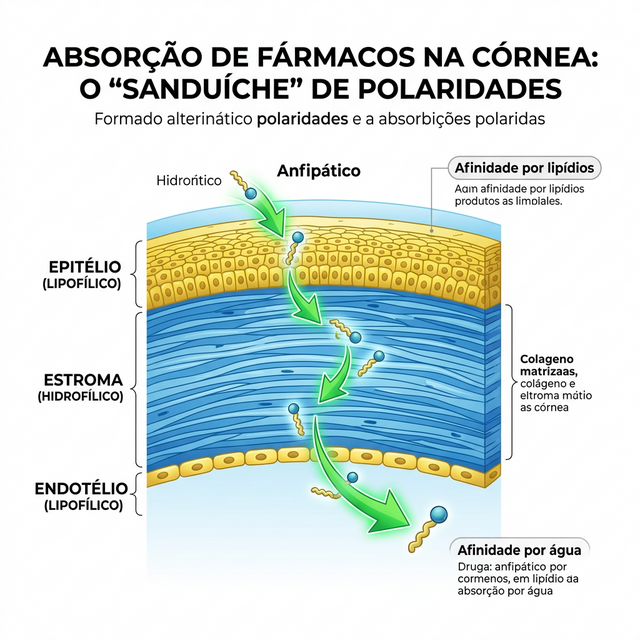
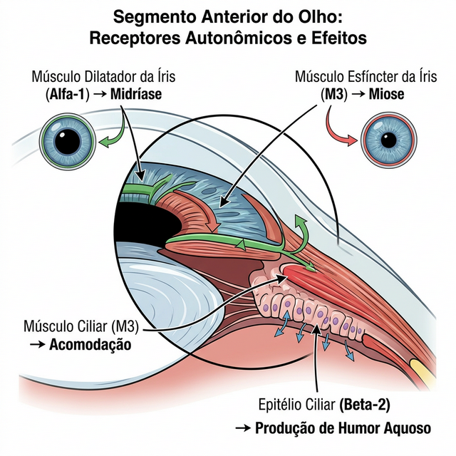
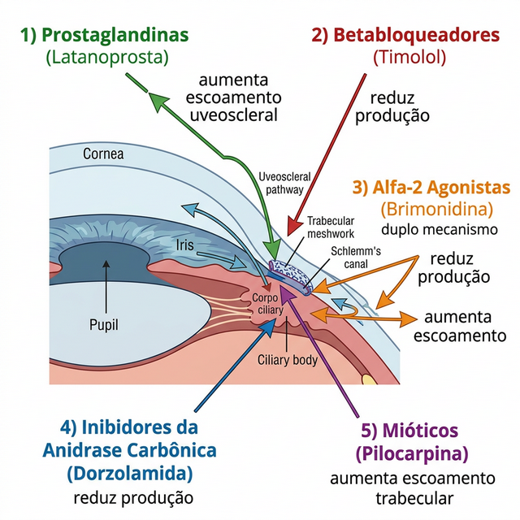
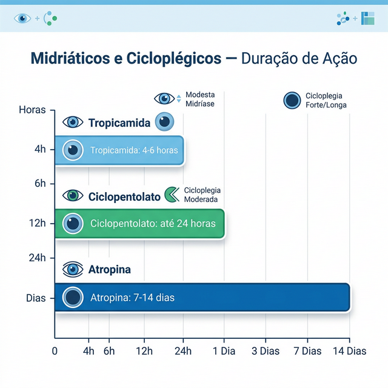
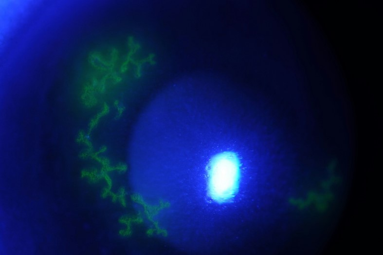

# FARMACOLOGIA OCULAR

Para entender a farmacologia ocular, você precisa primeiro esquecer a ideia de que o olho é apenas uma "caixa" onde pingamos colírios. O olho é um órgão com barreiras anatômicas e fisiológicas extremamente complexas. Se você não entender como a droga entra, como ela circula e como ela sai, você vai errar questões básicas de farmacocinética que as bancas adoram cobrar para diferenciar o aluno que decorou do aluno que entendeu.

Muitos alunos acreditam que, por ser uma aplicação tópica, o colírio não tem efeitos sistêmicos. Esse é o primeiro grande erro. A mucosa nasal, para onde o colírio drena através do ducto nasolacrimal, é altamente vascularizada e não possui o efeito de primeira passagem hepática. Isso significa que uma gota de Timolol pode ser equivalente a uma dose oral significativa em termos de efeitos colaterais sistêmicos.

## Farmacocinética Ocular: As Barreiras e a Absorção

A córnea é a principal via de entrada para drogas aplicadas topicamente. Mas ela não facilita a vida do fármaco. Pense na córnea como um "sanduíche" de polaridades. O epitélio corneano é lipofílico (rico em gordura), o estroma é hidrofílico (rico em água) e o endotélio é novamente lipofílico.

*Figura 1: A córnea como um "sanduíche" de polaridades. O epitélio e o endotélio são lipofílicos (amarelo), enquanto o estroma é hidrofílico (azul). Drogas anfifílicas cruzam todas as camadas.*

Por que isso importa? Porque, para uma droga atravessar a córnea e chegar à câmara anterior, ela precisa ter características anfifílicas, ou seja, ser capaz de se dissolver tanto em gordura quanto em água. Se a droga for puramente hidrofílica, ela para no epitélio. Se for puramente lipofílica, ela fica presa no estroma.

Aqui entra uma dica de prova clássica: a inflamação altera a permeabilidade das barreiras. Um olho inflamado, com o epitélio corneano lesado, absorve muito mais droga do que um olho íntegro. Isso pode ser bom para o tratamento, mas aumenta o risco de toxicidade.

Além da córnea, temos a conjuntiva e a esclera. Elas são muito mais permeáveis que a córnea, porém são altamente vascularizadas. O que acontece? A droga que entra por ali cai rapidamente na circulação sistêmica, diminuindo a biodisponibilidade intraocular. É por isso que, para atingir o segmento posterior (retina e vítreo), o colírio é quase sempre ineficaz.

### O Papel do Filme Lacrimal e do pH

O volume de uma gota de colírio comercial é de cerca de 25 a 50 microlitros. No entanto, o saco conjuntival comporta apenas cerca de 7 a 10 microlitros sem transbordar. Percebeu o problema? Mais da metade da gota é perdida instantaneamente por extravasamento na face ou drenagem pelo ducto nasolacrimal.

O pH do colírio também é fundamental. O olho tolera bem um pH entre 6,5 e 8,5. Se o colírio for muito ácido ou muito alcalino, ele induz o lacrimejamento reflexo. O Dr. Will sempre lembra nas discussões de caso: quanto mais o paciente lacrimeja após o colírio, menos droga fica em contato com a superfície ocular, pois o "washout" (lavagem) é imediato.

## Farmacologia do Sistema Nervoso Autônomo no Olho

Este é o coração da farmacologia ocular e o tema que mais gera confusão. Para dominar isso, você precisa visualizar os receptores no segmento anterior.

No músculo esfíncter da íris, temos receptores muscarínicos (M3). Quando estimulados (parassimpaticomiméticos), causam miose. No músculo dilatador da íris, temos receptores alfa-1 adrenérgicos. Quando estimulados (simpaticomiméticos), causam midríase.

No corpo ciliar, a história complica um pouco mais. O músculo ciliar possui receptores M3. A contração desse músculo (estimulação parassimpática) faz duas coisas: relaxa a zônula de Zinn (permitindo que o cristalino fique mais curvo para a acomodação) e traciona o esporão escleral, abrindo a malha trabecular e facilitando o escoamento do humor aquário.

*Figura 2: Receptores autonômicos no olho. Alfa-1 no dilatador (midríase), M3 no esfíncter (miose) e ciliar (acomodação), Beta-2 no epitélio ciliar (produção de humor aquoso).*

Já a produção do humor aquário é influenciada pelos receptores Beta-2 no epitélio ciliar não pigmentado. Estimular Beta-2 aumenta a produção; bloquear Beta-2 (com Timolol, por exemplo) diminui a produção.

### Tabela 1: Receptores e Efeitos Oculares

| Receptor | Localização | Efeito da Estimulação | Aplicação Clínica |
| --- | --- | --- | --- |
| Alfa-1 | Músculo dilatador da íris | Midríase | Fenilefrina (Exame de fundo de olho) |
| Alfa-2 | Corpo ciliar / Terminações nervosas | Redução da produção de humor aquário | Brimonidina (Glaucoma) |
| Beta-2 | Epitélio ciliar não pigmentado | Aumento da produção de humor aquário | Alvo de bloqueio (Timolol) |
| M3 | Músculo esfíncter da íris | Miose | Pilocarpina (Glaucoma de ângulo fechado) |
| M3 | Músculo ciliar | Acomodação e facilitação do escoamento | Pilocarpina / Cicloplégicos (bloqueio) |

## Drogas para o Tratamento do Glaucoma

O glaucoma é a área onde a farmacologia é mais cobrada. O objetivo é sempre reduzir a pressão intraocular (PIO), seja diminuindo a produção de humor aquário, seja aumentando o seu escoamento (pela via trabecular ou pela via uveoscleral).

### Análogos de Prostaglandinas (Latanoprosta, Travoprosta, Bimatoprosta)

Atualmente, são a primeira escolha para a maioria dos pacientes. Por quê? Porque possuem alta eficácia, posologia de apenas uma vez ao dia (melhora a adesão) e poucos efeitos colaterais sistêmicos.

O mecanismo de ação é o aumento do escoamento uveoscleral (a via "alternativa" de saída do humor aquário). Elas remodelam a matriz extracelular entre os feixes do músculo ciliar.

Cuidado com os efeitos colaterais locais, que são prato cheio para provas: hiperemia conjuntival (o olho fica vermelho), crescimento de cílios (hipertricose), escurecimento da íris (aumento da melanina nos melanócitos, não do número de melanócitos) e lipodistrofia periorbitária (o olho parece "encovado").

*Figura 3: Visão geral das 5 classes de drogas antiglaucomatosas. Prostaglandinas e mióticos aumentam o escoamento; betabloqueadores e inibidores da anidrase carbônica reduzem a produção; agonistas alfa-2 fazem ambos.*

### Betabloqueadores (Timolol)

Durante décadas foram o padrão-ouro. Eles agem bloqueando os receptores Beta-2 no corpo ciliar, reduzindo a produção do humor aquário.

Aqui reside a maior pegadinha de segurança: o Timolol é um betabloqueador não seletivo. Se cair na circulação sistêmica, ele bloqueia os receptores Beta-2 nos pulmões, causando broncoespasmo, e os receptores Beta-1 no coração, causando bradicardia e bloqueio atrioventricular.

Imagine o cenário: paciente idoso, asmático, chega à emergência com crise de sibilância. O médico clínico suspende a medicação oral, mas esquece de perguntar sobre o colírio de Timolol. O paciente não melhora porque o "gatilho" continua lá. Em provas, se o paciente tiver asma, DPOC grave ou bradicardia sinusal, o Timolol é contraindicação absoluta.

### Agonistas Alfa-2 Adrenérgicos (Brimonidina)

A Brimonidina tem um mecanismo duplo: ela reduz a produção de humor aquário e aumenta o escoamento uveoscleral. Além disso, discute-se seu potencial efeito neuroprotetor.

Erro clássico de prova: esquecer da contraindicação em crianças pequenas (menores de 2 a 6 anos). A Brimonidina atravessa a barreira hematoencefálica e pode causar depressão severa do Sistema Nervoso Central, levando a sonolência, hipotensão, hipotermia e até apneia. Em pediatria, Brimonidina é proibida.

### Inibidores da Anidrase Carbônica (Dorzolamida, Brinzolamida, Acetazolamida)

A anidrase carbônica é essencial para a produção de íons bicarbonato, que "puxam" a água para dentro do olho para formar o humor aquário. Ao inibir essa enzima, reduzimos a produção.

A Acetazolamida (Diamox) é a forma oral, usada em casos de urgência (crise de glaucoma agudo) ou quando os colírios não são suficientes. Seus efeitos colaterais sistêmicos são marcantes: parestesias (formigamento em mãos e pés), acidose metabólica, hipocalemia e gosto metálico na boca.

Lembre-se: como são derivados da sulfa, pacientes com alergia grave a sulfonamidas devem usar essas drogas com cautela (contraindicação relativa).

### Tabela 2: Comparativo de Drogas para Glaucoma

| Classe | Droga Exemplo | Mecanismo Principal | Efeito Colateral Marcante |
| --- | --- | --- | --- |
| Análogos de Prostaglandina | Latanoprosta | ↑ Escoamento Uveoscleral | Escurecimento da íris, cílios longos |
| Betabloqueadores | Timolol | ↓ Produção de Humor Aquário | Broncoespasmo, Bradicardia |
| Alfa-2 Agonistas | Brimonidina | ↓ Produção e ↑ Escoamento | Alergia folicular, Sonolência (SNC) |
| Inibidores da Anidrase Carbônica | Dorzolamida | ↓ Produção de Humor Aquário | Gosto amargo, Ardor ocular |
| Mióticos (Parassimpaticomiméticos) | Pilocarpina | ↑ Escoamento Trabecular | Miose, Dor supraciliar, Descolamento de retina |

## Midriáticos e Cicloplégicos

Para examinar o fundo de olho ou tratar inflamações intraoculares (uveítes), precisamos dilatar a pupila. Mas cuidado: midríase é apenas a dilatação da pupila. Cicloplegia é a paralisia do músculo ciliar (perda da acomodação).

### Simpaticomiméticos: Fenilefrina

A Fenilefrina age nos receptores Alfa-1 do músculo dilatador da íris. Ela causa midríase, mas **não** causa cicloplegia. O paciente continua conseguindo ler de perto, embora a luz incomode.

Dica de MedEvo: a Fenilefrina pode causar um aumento súbito da pressão arterial em pacientes suscetíveis ou recém-nascidos. Em provas, evite o uso de Fenilefrina 10% em cardiopatas graves e crianças pequenas; prefira a concentração de 2,5%.

### Parassimpaticolíticos (Anticolinérgicos): Atropina, Ciclopentolato, Tropicamida

Essas drogas bloqueiam os receptores M3. Elas causam tanto midríase quanto cicloplegia. A diferença fundamental entre elas é o tempo de ação, e isso cai muito em prova.

*Figura 4: Comparativo de duração dos cicloplégicos. A Atropina dura de 7 a 14 dias — nunca usá-la para exame de rotina!*

- **Tropicamida:** Início rápido (20-30 min) e duração curta (4-6 horas). Ideal para exame de fundo de olho de rotina.

- **Ciclopentolato:** Início em 30-60 min e duração de até 24 horas. É o padrão para refração (exame de grau) em crianças, pois tem um efeito cicloplégico mais potente que a tropicamida.

- **Atropina:** É a mais potente. O efeito pode durar de 7 a 14 dias. Não é usada para exames de rotina, mas sim para o tratamento de uveítes (para evitar sinéquias e aliviar a dor do espasmo ciliar) ou para penalização no tratamento da ambliopia.

Cuidado com a toxicidade atropínica (especialmente em crianças): "Vermelho como um beterraba, seco como um osso, cego como um morcego e louco como uma lebre" (rubor facial, boca seca, midríase/fotofobia e alucinações/agitação).

## Anti-inflamatórios Oculares

A inflamação ocular pode destruir tecidos nobres como a retina e a córnea em poucas horas. Por isso, o uso de corticoides é frequente, mas perigoso.

### Corticoides (Acetato de Prednisolona, Dexametasona, Fluorometolona)

Os corticoides são os anti-inflamatórios mais potentes. Eles inibem a fosfolipase A2, bloqueando toda a cascata do ácido araquidônico.

O Acetato de Prednisolona 1% é o padrão-ouro para inflamações intraoculares devido à sua excelente penetração na câmara anterior. Já a Fluorometolona e o Loteprednol são chamados de "soft steroids" (corticoides leves), pois têm menor probabilidade de causar o efeito colateral mais temido: o aumento da pressão intraocular.

Por que o corticoide aumenta a PIO? Porque ele induz mudanças na malha trabecular (acúmulo de glicosaminoglicanos), dificultando o escoamento do humor aquário. Cerca de 5 a 10% da população são "altos respondedores" e terão aumentos significativos da PIO com o uso prolongado. Outro efeito colateral clássico é a formação de catarata subcapsular posterior.

### Anti-inflamatórios Não Esteroidais - AINEs (Nepafenaco, Cetorolaco, Diclofenaco)

Os AINEs inibem a ciclooxigenase (COX). Na oftalmologia, são usados principalmente para prevenir o edema macular cistoide após a cirurgia de catarata e para controle da dor e inflamação pós-operatória.

Diferença importante: AINEs não causam aumento da PIO nem catarata. No entanto, o uso crônico e abusivo de AINEs tópicos pode causar ceratite ponteada e, em casos graves, "corneal melting" (derretimento corneano).

## Anti-infectivos Oculares

Aqui, o segredo é saber qual droga escolher para cada situação clínica.

### Antibióticos

Para conjuntivites bacterianas comuns, usamos antibióticos de amplo espectro como Tobramicina ou Cloranfenicol. No entanto, para úlceras de córnea bacterianas, precisamos de algo mais robusto.

As Fluoroquinolonas de 4ª geração (Moxifloxacino, Gatifloxacino) são as favoritas porque cobrem bem gram-positivos e gram-negativos e têm excelente penetração tecidual. Elas inibem a DNA-girase e a Topoisomerase IV.

Em casos de úlceras graves, o Dr. Will recomenda o uso de colírios fortificados (preparados magistralmente em farmácias de manipulação ou hospitais), como a combinação de Vancomicina (para gram-positivos, incluindo MRSA) e Ceftazidima ou Amicacina (para gram-negativos, incluindo Pseudomonas).

### Antivirais

O Aciclovir é o tratamento de escolha para a ceratite herpética (Herpes Simplex). Ele pode ser usado em pomada (embora não esteja mais disponível comercialmente no Brasil em algumas apresentações, ainda é citado em provas) ou via oral.

Atenção: Nunca, jamais use corticoide isolado em uma ceratite herpética epitelial ativa (dendrítica). O corticoide "alimenta" o vírus, transformando uma pequena lesão em uma úlcera geográfica devastadora.

### Antifúngicos

As infecções fúngicas oculares são difíceis de tratar. A Natamicina é o único antifúngico tópico comercialmente disponível em muitos lugares, sendo a primeira escolha para fungos filamentosos (comuns em traumas vegetais). Para leveduras (Candida), a Anfotericina B (preparada) é mais eficaz.

## Anestésicos Tópicos (Proparacaína, Tetracaína)

Os anestésicos locais bloqueiam os canais de sódio dependentes de voltagem, impedindo a condução nervosa. Eles são fundamentais para realizar exames como a tonometria de aplanação e para pequenos procedimentos.

Regra de ouro para a vida e para a prova: Nunca prescreva colírio anestésico para o paciente levar para casa. O uso repetido de anestésico é altamente tóxico para o epitélio corneano, inibe a cicatrização e pode levar a uma ceratite neurotrófica e perfuração ocular. O paciente sente um alívio imediato da dor, mas está "derretendo" a própria córnea.

## Corantes Oculares

Os corantes são ferramentas diagnósticas essenciais no exame físico oftalmológico.

-

**Fluoresceína Sódica:** É um corante vital que se deposita nos espaços intercelulares quando há quebra da integridade do epitélio. Sob luz azul de cobalto, ela brilha em verde. É usada para detectar erosões, úlceras e para o teste de Seidel (que detecta vazamento de humor aquário em perfurações).

*Figura 5: Fluoresceína na prática. Note o padrão dendrítico verde brilhante sob luz de cobalto — achado patognomônico de ceratite por Herpes Simplex. Nunca usar corticoide isolado nesta fase!*

-

**Rosa Bengala e Lisamina Verde:** Coram células mortas ou degeneradas e áreas sem mucina. São excelentes para o diagnóstico de Olho Seco severo. O Rosa Bengala causa muito ardor, por isso a Lisamina Verde tem sido preferida na prática clínica.

## Anti-VEGF (Ranibizumabe, Aflibercepte, Bevacizumabe)

Esta classe revolucionou a oftalmologia nos últimos 15 anos. O VEGF (Fator de Crescimento Endotelial Vascular) é o principal mediador da angiogênese e do aumento da permeabilidade vascular em doenças como a Degeneração Macular Relacionada à Idade (DMRI) forma úmida, a Retinopatia Diabética e as Oclusões Venosas da Retina.

Essas drogas são administradas via injeção intravítrea. O Bevacizumabe (Avastin) é usado "off-label" em larga escala devido ao seu custo muito inferior em comparação ao Ranibizumabe (Lucentis) e ao Aflibercepte (Eylea), apresentando eficácia semelhante em grandes estudos como o CATT.

## Situações Especiais e Toxicidade Sistêmica

Como mencionei no início, a absorção sistêmica via ducto nasolacrimal é o grande perigo. Para minimizar isso, ensinamos o paciente a fazer a oclusão do ponto lacrimal (pressionar o canto interno do olho) por 2 a 3 minutos após instilar o colírio.

### Gestantes e Lactantes

A regra geral é: evite qualquer medicação no primeiro trimestre. Se for estritamente necessário tratar glaucoma, a Brimonidina é considerada categoria B (segura em animais, sem estudos em humanos), mas deve ser suspensa antes do parto pelo risco de depressão respiratória no recém-nascido. Os análogos de prostaglandina podem induzir o parto (teoricamente), embora a dose sistêmica via colírio seja mínima.

### Idosos

Atenção redobrada com betabloqueadores (risco de quedas por bradicardia e hipotensão) e com a polifarmácia. Muitos idosos têm dificuldade em instilar o colírio devido à artrite ou tremores, o que leva ao uso excessivo ou à falta de tratamento.

### Tabela 3: Toxicidade Sistêmica de Drogas Oculares

| Droga | Efeito Sistêmico | População de Risco |
| --- | --- | --- |
| Timolol | Broncoespasmo, Bradicardia, Depressão | Asmáticos, Cardiopatas, Idosos |
| Brimonidina | Sonolência extrema, Apneia, Hipotensão | Crianças < 6 anos |
| Atropina | Taquicardia, Hipertermia, Confusão mental | Crianças, Idosos |
| Acetazolamida | Acidose, Hipocalemia, Parestesias | Renais crônicos, Alérgicos a sulfa |
| Fenilefrina | Crise Hipertensiva, Arritmias | Cardiopatas, Recém-nascidos |

## Conservantes: O Vilão Oculto

A maioria dos colírios multidose contém conservantes para evitar a contaminação bacteriana. O mais comum é o Cloreto de Benzalcônio (BAK).

O BAK é um detergente. Ele é excelente para matar bactérias, mas também é tóxico para as células da superfície ocular e para as células caliciformes (que produzem a camada de mucina da lágrima). Pacientes que usam múltiplos colírios para glaucoma por anos frequentemente desenvolvem uma doença da superfície ocular grave devido ao BAK. Sempre que possível, em casos de olho seco grave ou uso crônico, prefira colírios sem conservantes (apresentações em flaconetes de dose única).

## Pontos-Chave para Prova 💡

- **Barreira Corneana:** O epitélio é lipofílico, o estroma é hidrofílico. Drogas precisam ser anfifílicas para atravessar.

- **Absorção Sistêmica:** Ocorre principalmente pela mucosa nasal, pulando o efeito de primeira passagem hepática.

- **Timolol:** Contraindicação absoluta em asmáticos e pacientes com bloqueio AV de 2º ou 3º grau.

- **Brimonidina:** Contraindicação absoluta em crianças pequenas devido ao risco de depressão respiratória e coma.

- **Análogos de Prostaglandina:** Primeira escolha no glaucoma; agem no escoamento uveoscleral. Causam escurecimento da íris e crescimento de cílios.

- **Pilocarpina:** Causa miose e contração do músculo ciliar. Pode causar descolamento de retina em pacientes predispostos (miopes).

- **Atropina:** Anticolinérgico mais potente. Efeito dura até 14 dias. Cuidado com a síndrome anticolinérgica em crianças.

- **Fenilefrina:** Midriático puro (não causa cicloplegia). Cuidado com hipertensão sistêmica.

- **Corticoides:** Podem causar catarata subcapsular posterior e glaucoma secundário (por redução do escoamento trabecular).

- **Ceratite Herpética:** Nunca use corticoide na fase dendrítica (epitelial).

- **Anestésicos Tópicos:** Uso crônico causa ceratite neurotrófica e "melting" corneano. Nunca prescrever para uso domiciliar.

- **Acetazolamida (Oral):** Causa parestesias e acidose metabólica. Evitar em pacientes com insuficiência renal grave ou alergia a sulfa.

- **Fluoresceína:** Corante que indica perda de integridade do epitélio corneano.

- **Anti-VEGF:** Tratamento padrão para DMRI úmida e edema macular diabético; aplicado via intravítrea.

- **Oclusão do Ponto Lacrimal:** Técnica essencial para reduzir a absorção sistêmica de qualquer colírio.

- **Conservantes (BAK):** Principal causa de toxicidade da superfície ocular em usuários crônicos de colírios.

 Cópia offline para consulta pessoal.
 Fonte original:
 [https://www.medevo.com.br/material-apoio/ler/bca11d8b-de24-473a-99ed-686de69a5a83](https://www.medevo.com.br/material-apoio/ler/bca11d8b-de24-473a-99ed-686de69a5a83)
