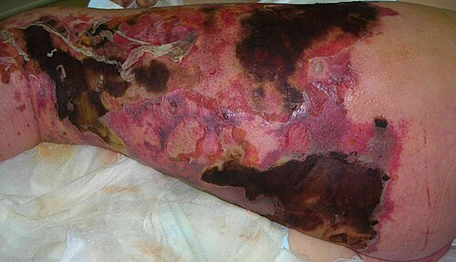
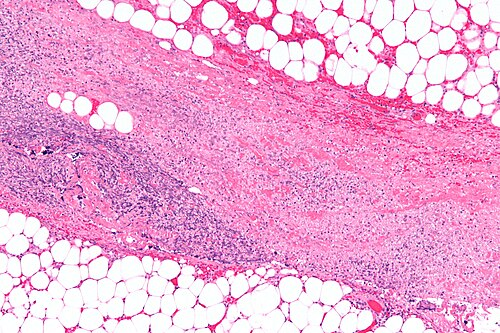

# FASCITE NECROSANTE E GANGRENA

Se você está aqui, é porque sabe que a Fascite Necrosante (FN) não é apenas uma "celulite que deu errado". É uma das emergências mais dramáticas da cirurgia e da infectologia. Nas provas de residência, o examinador não quer saber se você sabe prescrever um antibiótico; ele quer saber se você tem o "olhar clínico" para interromper uma progressão que pode matar o paciente em poucas horas.

Como seu professor, meu papel é te dar as ferramentas para que, diante de uma questão de prova — ou de um paciente no pronto-socorro —, você não hesite. Vamos entender o porquê de cada conduta.

## O Conceito Fundamental: Por que "Necrosante"?

A fascite necrosante é uma infecção profunda que se dissemina pela fáscia superficial e pelo tecido subcutâneo. O grande "pulo do gato" aqui é a fisiopatologia: as bactérias e suas toxinas causam uma **endarterite obliterante**.

Imagine os pequenos vasos que nutrem a pele passando através da fáscia. Quando a infecção atinge a fáscia, esses vasos trombosam. O resultado? A pele morre não porque a bactéria a "comeu" diretamente, mas porque o suprimento de sangue foi cortado. É por isso que, no início, a pele pode parecer apenas vermelha (como uma celulite), mas a dor é insuportável — o tecido profundo já está morrendo por isquemia.

## Classificação: O Quem é Quem das Bactérias

As bancas adoram cobrar a etiologia, e aqui a classificação em tipos é obrigatória para o seu resumo.

### Tipo I: A Polimicrobiana (A mais comum)

É a causa da famosa **Gangrena de Fournier**. Envolve uma mistura de aeróbios (como *E. coli* e *Klebsiella*) e anaeróbios (*Bacteroides*, *Clostridium*).

- **Onde cai:** Pacientes diabéticos, idosos ou com focos perianais/urinários.

- **Dica do Dr. Will:** Se a questão citar "gás nos tecidos" ou "crepitação" em um paciente diabético com infecção perineal, não perca tempo: é Tipo I.

### Tipo II: A Monomicrobiana (A "Bactéria Comedora de Carne")

Causada quase exclusivamente pelo *Streptococcus pyogenes* (Grupo A), às vezes associada ao *Staphylococcus aureus*.

- **Onde cai:** Pode ocorrer em pacientes jovens e previamente hígidos, muitas vezes após um trauma mínimo (um arranhão ou contusão).

- **Pérola de Prova:** É aqui que a **Clindamicina** brilha. Por que usamos Clindamicina se o *Streptococcus* é sensível à Penicilina? Porque a Clindamicina inibe a síntese proteica bacteriana, "desligando" a produção de exotoxinas que causam o choque tóxico.

### Tipo III: Gangrena Gasosa e Vibrio

Causada por *Clostridium perfringens* (após traumas penetrantes ou cirurgias) ou *Vibrio vulnificus* (exposição a águas marinhas ou frutos do mar).

| Tipo | Etiologia | Perfil do Paciente |
| --- | --- | --- |
| **Tipo I** | Polimicrobiana (Aeróbios + Anaeróbios) | Diabéticos, idosos, Fournier |
| **Tipo II** | Monomicrobiana (*S. pyogenes*) | Jovens, hígidos, pós-trauma minor |
| **Tipo III** | *Clostridium* ou *Vibrio* | Trauma penetrante ou água do mar |

## Quadro Clínico: O Diagnóstico é no Olhar (e no Tato)

Muitos alunos erram questões de FN porque esperam ver a pele preta e necrosada. **Cuidado:** a necrose de pele é um sinal TARDIO. Se você esperar a pele ficar preta para diagnosticar, o paciente provavelmente já estará em choque séptico.

### Sinais Precoces (O que te faz suspeitar)

- **Dor desproporcional ao achado físico:** A pele está apenas um pouco eritematosa, mas o paciente grita de dor ao menor toque. Isso acontece porque a infecção está "correndo" por baixo, na fáscia.

- **Edema além da borda do eritema:** O inchaço ultrapassa muito a área vermelha.

- **Progressão rápida:** Se você marcou a borda da infecção com uma caneta e, duas horas depois, ela avançou 3 cm, ligue o alerta vermelho.

### Sinais Tardios (O que confirma o desastre)

- **Bolhas hemorrágicas ou violáceas:** Indicam morte do tecido subcutâneo.

- **Crepitação:** Indica presença de gás produzido por anaeróbios (patognomônico de infecção necrotizante).

- **Anestesia cutânea:** A dor desaparece porque os nervos cutâneos foram destruídos pela necrose.

- **Sinais sistêmicos graves:** Febre alta, taquicardia, hipotensão e alteração do sensório (Sepse).

*Figura 1 - Fascite necrosante em membro inferior esquerdo no dia da admissão, evidenciando eritema extenso e áreas de necrose cutânea. A dor desproporcional aos achados cutâneos é um sinal de alerta clássico. Fonte: Smuszkiewicz et al., CC BY 2.0 | Wikimedia Commons*

## Diagnóstico: Além da Suspeita Clínica

O diagnóstico da fascite necrosante é primariamente **CLÍNICO**. Se a suspeita é alta, a conduta é cirúrgica imediata. Porém, para fins de prova e para casos duvidosos, existem ferramentas auxiliares.

### O Score LRINEC (Laboratory Risk Indicator for Necrotizing Fasciitis)

Este score utiliza exames laboratoriais simples para estratificar o risco. No MedEvo, sempre reforçamos que um score baixo não exclui FN se a clínica for soberana, mas um score alto é um "carimbo" de gravidade.

| Parâmetro Laboratorial | Valor | Pontos |
| --- | --- | --- |
| **Proteína C-Reativa (PCR)** | < 150 mg/L / ≥ 150 mg/L | 0 / 4 |
| **Leucócitos (mil/mm³)** | < 15 / 15-25 / > 25 | 0 / 1 / 2 |
| **Hemoglobina (g/dL)** | > 13,5 / 11-13,5 / < 11 | 0 / 1 / 2 |
| **Sódio (mEq/L)** | ≥ 135 / < 135 | 0 / 2 |
| **Creatinina (mg/dL)** | ≤ 1,6 / > 1,6 | 0 / 2 |
| **Glicemia (mg/dL)** | ≤ 180 / > 180 | 0 / 1 |

**Interpretação:**

- **Score ≤ 5:** Baixo risco (< 50%).

- **Score 6-7:** Risco intermediário (50-75%).

- **Score ≥ 8:** Alto risco (> 75%).

### Exames de Imagem

- **Radiografia simples:** Pode mostrar gás (enfisema subcutâneo). Se houver gás, o diagnóstico está feito. Se não houver, não exclui nada.

- **Tomografia Computadorizada (TC):** É o melhor exame de imagem. Mostra o espessamento da fáscia, coleções e gás que não aparece no raio-X.

- **Ressonância Magnética (RM):** Muito sensível, mas demora muito e o paciente geralmente está instável demais para ir para a máquina.

### O "Finger Test" (Teste do Dedo)

À beira do leito, sob anestesia local, faz-se uma pequena incisão até a fáscia. Se houver:

- Ausência de sangramento (isquemia).

- Saída de líquido serossanguinolento tipo "água de lavagem de carne" (*dishwater pus*).

- Ausência de resistência da fáscia à dissecção digital (o dedo passa fácil entre os tecidos).
**Diagnóstico confirmado: Chame o centro cirúrgico.**

## Diagnóstico Diferencial: Não confunda "Alhos com Bugalhos"

Esta é a zona preferida das pegadinhas de prova.

- **Erisipela:** Superficial, bordas bem nítidas e elevadas, geralmente causada por *Streptococcus*. O paciente está febril, mas raramente chocado de imediato.

- **Celulite:** Mais profunda que a erisipela, bordas mal definidas. A dor é condizente com o aspecto da pele.

- **Loxoscelismo (Aranha Marrom):** Causa a **placa marmórea** (áreas de palidez, cianose e eritema). Pode evoluir para necrose, mas a história epidemiológica e a evolução mais lenta (dias) ajudam a diferenciar.

- **Reação Hansênica Tipo II (Eritema Nodoso Hansênico):** Nódulos dolorosos, febre e artralgia em paciente com hanseníase multibacilar. A diferença é que as lesões são nodulares e múltiplas, não uma placa infecciosa em expansão rápida.

| Condição | Profundidade | Clínica Típica |
| --- | --- | --- |
| **Erisipela** | Derme superficial | Bordas nítidas, "casca de laranja" |
| **Celulite** | Derme profunda/Subcutâneo | Bordas imprecisas, dor moderada |
| **Fascite** | Fáscia profunda | Dor desproporcional, bolhas, sepse |

*Figura 2 - Microfotografia em aumento intermediário de fascite necrosante corada por H&E, demonstrando necrose tecidual e infiltrado inflamatório na fáscia. Fonte: Nephron, CC BY-SA 3.0 | Wikimedia Commons*

## Tratamento: O Tripé da Sobrevivência

Se você gravar apenas uma coisa desta aula, grave isto: **Antibiótico não cura fascite necrosante.** O tratamento é cirúrgico. O antibiótico serve apenas para "limpar o sangue" e evitar que a infecção se espalhe ainda mais enquanto você opera.

### 1. Desbridamento Cirúrgico (O mais importante)

Deve ser **precoce, amplo e radical**.

- Não adianta apenas drenar. Tem que remover todo o tecido desvitalizado até encontrar tecido que sangre.

- **Regra de ouro:** O paciente deve voltar ao centro cirúrgico em 24 horas para uma "revisão" (*second look*). Frequentemente, a necrose avança e novos desbridamentos são necessários.

### 2. Antibioticoterapia Empírica

Deve ser de amplo espectro e iniciada na primeira hora.

- **Esquema clássico (Fournier/Tipo I):** Piperacilina/Tazobactam + Vancomicina (se risco de MRSA) + Clindamicina.

- **Por que Clindamicina?** Repetindo para fixar: efeito antitoxina (inibe a produção de superantígenos pelo *Streptococcus* e *Staphylococcus*).

- **Alternativa:** Carbapenêmico (Meropenem) + Vancomicina + Clindamicina.

### 3. Suporte Hemodinâmico

Muitos desses pacientes chegam em Choque Séptico. Ressuscitação volêmica agressiva, drogas vasoativas se necessário e controle glicêmico rigoroso (lembre-se: a hiperglicemia "alimenta" a bactéria e paralisa o neutrófilo).

## Gangrena de Fournier: A "Queridinha" das Bancas

A Síndrome de Fournier é a fascite necrosante do períneo, escroto e parede abdominal.

- **Fatores de Risco:** Diabetes Mellitus (presente em até 70% dos casos), alcoolismo e focos infecciosos locais (abscesso perianal, infecção urinária).

- **Anatomia:** A infecção se dissemina pelas fáscias de **Buck** (pênis), **Dartos** (escroto), **Colles** (períneo) e **Scarpa** (parede abdominal).

- **Conduta Específica:** Além do desbridamento, pode ser necessária uma **colostomia de derivação** se houver contaminação fecal importante da ferida, ou uma **cistostomia** se a uretra estiver comprometida.

- **Curativo a Vácuo (Terapia por Pressão Negativa):** Excelente após o controle da infecção para acelerar a granulação e preparar para enxertia futura.

## Situações Especiais e Complicações

### Piomiosite

É a infecção bacteriana do músculo (diferente da fascite, que é da fáscia). O agente principal é o *S. aureus*. O diagnóstico é feito por RM ou TC mostrando abscessos intramusculares. O tratamento é drenagem + antibiótico (Oxacilina ou Vancomicina).

### Síndrome Compartimental

Em membros, o edema maciço da fascite pode aumentar a pressão intracompartimental. Se o pulso sumir ou a dor à extensão passiva for insuportável, a **fasciotomia** deve ser associada ao desbridamento.

### Oxigenoterapia Hiperbárica

Pode ser considerada como adjuvante, especialmente na gangrena gasosa clostridiana, mas **nunca** deve atrasar o desbridamento cirúrgico. A evidência é moderada, mas em provas pode aparecer como opção terapêutica complementar.

## Pontos-Chave para Prova 🎯

- **A dor desproporcional** é o sinal clínico precoce mais importante. Se a questão diz que a pele parece "normal" mas o paciente está morrendo de dor, marque Fascite Necrosante.

- **O tratamento definitivo é CIRÚRGICO.** Antibiótico sozinho é erro médico e erro de prova. O desbridamento deve ser precoce (< 24h).

- **Clindamicina** é adicionada ao esquema não apenas pelo espectro, mas pela sua capacidade de **inibir toxinas bacterianas**.

- **Gangrena de Fournier** é polimicrobiana (Tipo I). O principal fator de risco é o **Diabetes Mellitus**.

- **Crepitação e gás no raio-X** confirmam o diagnóstico, mas sua ausência não o exclui.

- **LRINEC Score ≥ 6** indica alta probabilidade de FN. Os componentes são: PCR, Leucócitos, Hemoglobina, Sódio, Creatinina e Glicose.

- **O "Finger Test"** positivo mostra o *dishwater pus* (pus tipo água de lavagem de carne) e falta de resistência tecidual.

- **Diferencial de Erisipela:** A erisipela tem bordas nítidas e é superficial. A fascite é profunda e "suja".

- **Loxoscelismo:** Procure pela "placa marmórea" e história de picada de aranha em ambientes domésticos/rurais.

- **Reação Tipo II da Hanseníase:** Nódulos dolorosos e febre em paciente já em tratamento ou com diagnóstico de hanseníase. Tratamento envolve Talidomida e Corticoides, não cirurgia.

- **Second Look:** É obrigatório retornar ao centro cirúrgico em 24-48h para reavaliar a necessidade de mais desbridamento.

- **O que NÃO fazer:** Não perca tempo pedindo Ressonância se o paciente está instável. Não espere a cultura para começar o antibiótico. Não faça apenas uma "drenagem simples".

 Cópia offline para consulta pessoal.
 Fonte original:
 [https://www.medevo.com.br/material-apoio/ler/f335d158-a329-4f07-852e-b9a3ffcd43a1](https://www.medevo.com.br/material-apoio/ler/f335d158-a329-4f07-852e-b9a3ffcd43a1)
