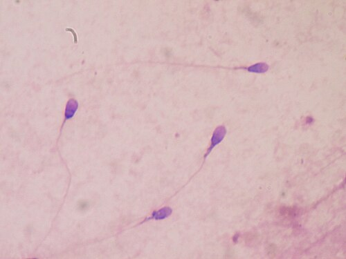
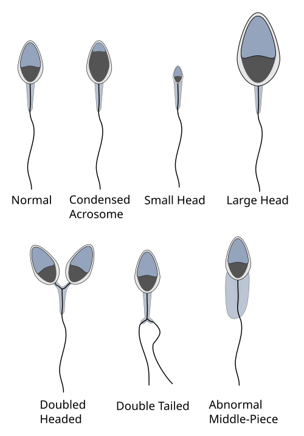

# FATOR MASCULINO

Para começar nossa conversa sobre infertilidade, precisamos quebrar um mito que ainda persiste em muitos consultórios e, infelizmente, na mente de alguns alunos: a ideia de que a investigação começa pela mulher. Na prática moderna e, principalmente, nas provas de residência, a investigação da infertilidade é **conjugal e simultânea**.

O fator masculino isolado é responsável por cerca de 30% dos casos de infertilidade, mas quando somamos aos casos onde ambos os parceiros apresentam alterações, o homem está envolvido em quase 50% das dificuldades de concepção. Portanto, se você ignorar o sêmen, estará ignorando metade do problema.

## Definição e Critérios Iniciais

Antes de pedirmos o primeiro exame, precisamos definir quem é o casal infértil. A definição clássica é a ausência de gravidez após **12 meses** de relações sexuais regulares (2 a 3 vezes por semana) sem o uso de métodos contraceptivos.

No entanto, o tempo é o nosso maior inimigo na reprodução assistida. Por isso, a FEBRASGO e as principais diretrizes recomendam reduzir esse prazo para **6 meses** se a mulher tiver 35 anos ou mais. Por que isso? Porque a reserva ovariana cai drasticamente após essa idade e não podemos nos dar ao luxo de esperar um ano inteiro para descobrir que o marido tem uma azoospermia, por exemplo.

Diferenciamos também a infertilidade em dois tipos:

- **Primária:** O casal nunca engravidou.

- **Secundária:** O casal já teve uma gestação anterior (independente do desfecho, seja parto a termo ou abortamento), mas agora não consegue conceber novamente.

*Figura 1 - Espermatozoides humanos corados para avaliação de qualidade seminal em microscopia óptica. O espermograma é o exame fundamental na investigação do fator masculino. Fonte: Bobjgalindo, CC BY-SA 4.0 | Wikimedia Commons*

## O Espermograma: A Pedra Angular

Se existe um exame que você precisa dominar para a prova de residência, é o espermograma. Ele é o exame inicial e o mais fundamental. Mas cuidado: um único espermograma alterado **não fecha diagnóstico**.

O sêmen é extremamente sensível a variações térmicas, estresse, episódios febris recentes e uso de medicamentos. Por isso, a regra de ouro é: se o primeiro resultado vier alterado, você deve solicitar uma **segunda amostra** com um intervalo de 1 a 2 semanas (algumas diretrizes sugerem até 3 meses, que é o tempo de um ciclo de espermatogênese, mas para provas, o intervalo de 15 dias é o mais citado).

### Condições para a Coleta

Para que o resultado seja confiável, o paciente deve respeitar uma abstinência sexual de **2 a 7 dias**.

- Se a abstinência for < 2 dias: O volume e a concentração podem vir falsamente baixos.

- Se a abstinência for > 7 dias: A motilidade diminui e o índice de espermatozoides mortos ou com DNA fragmentado aumenta.

### Valores de Referência (OMS 2010)

Embora exista uma atualização de 2021, a maioria das bancas de residência no Brasil ainda utiliza os critérios da **OMS 2010 (5ª edição)**. Decore estes números, eles são "carne de vaca" em provas:

| Parâmetro | Valor de Referência (Percentil 5) |
| --- | --- |
| Volume | ≥ 1,5 mL |
| pH | ≥ 7,2 |
| Concentração | ≥ 15 milhões/mL |
| Número Total (Concentração x Volume) | ≥ 39 milhões por ejaculado |
| Motilidade Total (Progressivos + Não progressivos) | ≥ 40% |
| Motilidade Progressiva (Tipo A + B) | ≥ 32% |
| Vitalidade (Vivos) | ≥ 58% |
| Morfologia Estrita (Kruger) | ≥ 4% |
| Leucócitos | < 1 milhão/mL |

### Nomenclatura Seminal

As bancas adoram usar os termos técnicos. Você precisa saber traduzi-los:

- **Normozoospermia:** Todos os parâmetros normais.

- **Oligozoospermia:** Baixa concentração de espermatozoides.

- **Astenozoospermia:** Baixa motilidade.

- **Teratozoospermia:** Baixa porcentagem de formas normais (morfologia alterada).

- **Azoospermia:** Ausência total de espermatozoides no ejaculado (após centrifugação).

- **Aspermia:** Ausência total de ejaculado (comum em casos de ejaculação retrógrada ou lesões medulares).

**Dica do Dr. Will:** Se a questão trouxer um paciente com "Oligoastenoteratozoospermia", não se assuste. Significa apenas que os três principais parâmetros (quantidade, movimento e forma) estão alterados. É o cenário típico do fator masculino grave.

## Avaliação Clínica e Exame Físico

Muitos ginecologistas esquecem que o homem também tem corpo. Na avaliação do fator masculino, o exame físico do escroto é obrigatório. O foco principal aqui é a busca pela **Varicocele**.

A varicocele é a dilatação anômala das veias do plexo pampiniforme. Ela é a causa **corrigível** mais comum de infertilidade masculina. Por que ela causa infertilidade? O refluxo venoso aumenta a temperatura escrotal (o testículo precisa estar cerca de 1 a 2 graus abaixo da temperatura corporal para produzir esperma de qualidade) e acumula metabólitos tóxicos da suprarrenal e dos rins.

### Classificação Clínica da Varicocele (Dubin & Amelar)

Esta classificação cai muito em prova porque define conduta:

- **Grau I (Leve):** Palpável apenas com a manobra de Valsalva.

- **Grau II (Moderada):** Palpável em repouso, mas não é visível através da pele escrotal.

- **Grau III (Grave):** Visível e palpável em repouso (o famoso "saco de minhocas").

**Atenção:** A varicocele é muito mais comum à esquerda (cerca de 80 a 90% dos casos). Isso ocorre por motivos anatômicos: a veia espermática esquerda deságua na veia renal esquerda em ângulo reto, enquanto a direita deságua na veia cava inferior em ângulo agudo, facilitando o fluxo. Se você encontrar uma varicocele isolada à direita, ligue o alerta para massas retroperitoneais ou tumores renais que possam estar comprimindo a veia.

## Investigação Complementar: Quando ir além do Espermograma?

Se o espermograma estiver normal, geralmente paramos por ali no homem. Mas, se houver alteração (especialmente oligozoospermia grave), precisamos investigar a causa.

### Avaliação Hormonal

Solicitamos FSH, LH, Testosterona Total e Prolactina.

- **FSH elevado + Testículos pequenos:** Sugere falência testicular primária (o cérebro está gritando para o testículo trabalhar, mas ele não responde).

- **FSH normal + Testículos de tamanho normal + Azoospermia:** Sugere causa obstrutiva (a fábrica funciona, mas a saída está bloqueada).

- **FSH baixo + LH baixo + Testosterona baixa:** Hipogonadismo hipogonadotrófico (o problema é no comando central, hipófise ou hipotálamo).

### Ultrassonografia com Doppler

O Doppler escrotal é excelente para confirmar a varicocele e medir o volume testicular (a atrofia testicular é um sinal de gravidade). O achado de **reversão de fluxo venoso** durante a manobra de Valsalva no Doppler é um forte preditor de que a cirurgia trará benefícios.

### Avaliação Genética

Este é um ponto que o MedEvo sempre destaca como "favorito das bancas exigentes". Quando solicitar Cariótipo e Pesquisa de Microdeleção do Cromossomo Y?

- **Indicação:** Pacientes com oligozoospermia grave (concentração < 5 milhões/mL) ou azoospermia não obstrutiva.

As alterações mais comuns são:

- **Síndrome de Klinefelter (47, XXY):** Causa mais comum de hipogonadismo hipergonadotrófico. O paciente costuma ter estatura elevada, ginecomastia e testículos muito pequenos e endurecidos.

- **Microdeleções da região AZF (Azoospermia Factor) no cromossomo Y:** Dependendo da região deletada (AZFa, AZFb ou AZFc), saberemos se ainda há chance de encontrar espermatozoides em uma biópsia testicular. Se a deleção for AZFa ou AZFb, o prognóstico é péssimo e geralmente não se encontra espermatozoides.

*Figura 2 - Representação esquemática das diferentes formas de espermatozoides: normal e alterações morfológicas (teratozoospermia). A morfologia estrita de Kruger é o critério utilizado na análise. Fonte: Xenzo, CC BY-SA 3.0 | Wikimedia Commons*

## Tratamento da Varicocele: Operar ou não?

Aqui está o maior erro dos alunos: achar que toda varicocele deve ser operada. **Não!** A cirurgia (varicocelectomia) tem indicações precisas.

**Critérios para indicação cirúrgica (deve ter os três):**

- Varicocele clinicamente palpável (Graus I, II ou III).

- Infertilidade conjugal comprovada (> 1 ano ou > 6 meses conforme idade).

- Espermograma alterado.

**Exceção:** Em adolescentes, operamos se houver evidência de **atrofia testicular** progressiva (diferença de volume > 20% entre os testículos), mesmo que ainda não tenham testado a fertilidade.

A técnica de escolha é a **varicocelectomia subinguinal microcirúrgica**. O uso do microscópio reduz drasticamente as complicações (como hidrocele e lesão da artéria testicular) e as taxas de recorrência.

## Opções de Reprodução Assistida no Fator Masculino

Quando o tratamento da causa base não é possível ou não resulta em gravidez após 6 a 12 meses da cirurgia, partimos para as Técnicas de Reprodução Assistida (TRA). A escolha da técnica depende da gravidade do fator masculino.

### 1. Inseminação Intrauterina (IIU) - Baixa Complexidade

Consiste em processar o sêmen em laboratório (capacitação espermática) e injetar os melhores espermatozoides diretamente dentro do útero.

- **Indicação:** Fator masculino leve a moderado.

- **Requisito fundamental:** O processamento seminal deve recuperar pelo menos **5 milhões** de espermatozoides móveis progressivos (alguns serviços aceitam até 2 a 3 milhões, mas 5 milhões é o número clássico de segurança). Além disso, as tubas uterinas da parceira devem estar pérvias.

### 2. Fertilização In Vitro (FIV) Clássica

Os óvulos e os espermatozoides são colocados em uma placa de cultura e a fertilização ocorre "naturalmente" (o espermatozoide tem que penetrar o óvulo sozinho). Hoje em dia, é pouco usada para fator masculino isolado.

### 3. Injeção Intracitoplasmática de Espermatozoides (ICSI) - Alta Complexidade

É a revolução do tratamento do fator masculino. Aqui, o embriologista escolhe um único espermatozoide morfologicamente normal e o injeta diretamente dentro do citoplasma do óvulo.

- **Indicação:** Fator masculino **grave** (oligozoospermia severa < 5 milhões/mL, asteno ou teratozoospermia severas), falha de fertilização em FIV anterior ou uso de espermatozoides coletados diretamente do testículo/epidídimo.

| Técnica | Complexidade | Principal Indicação Masculina | Requisito Seminal Mínimo |
| --- | --- | --- | --- |
| **IIU** | Baixa | Fator leve / moderado | > 5 milhões móveis pós-capacitação |
| **FIV Clássica** | Alta | Fator tubário (foco feminino) | Concentração e motilidade razoáveis |
| **ICSI** | Alta | Fator masculino grave / Azoospermia | Apenas um espermatozoide vivo por óvulo |

## Azoospermia: O Desafio Final

Quando o espermograma mostra zero espermatozoides, precisamos diferenciar se a fábrica está quebrada ou se o caminho está fechado.

### Azoospermia Obstrutiva

A espermatogênese é normal, mas há uma obstrução no sistema ductal (epidídimo, ducto deferente).

- **Causas:** Vasectomia (mais comum), sequelas de infecções (prostatite, epididimite), ou ausência congênita bilateral do ducto deferente (muito associada a mutações do gene da **Fibrose Cística - CFTR**).

- **Tratamento:** Punção de epidídimo (PESA) ou testículo (TESA) para coletar espermatozoides e realizar ICSI.

### Azoospermia Não-Obstrutiva

O problema é a produção.

- **Causas:** Genéticas (Klinefelter, microdeleções), criptorquidia bilateral não tratada, quimioterapia, radioterapia ou orquite por caxumba.

- **Tratamento:** Biópsia testicular (TESE ou Micro-TESE). Se encontrarmos focos de produção, fazemos ICSI. Se não, a opção é sêmen de doador.

## Situações Especiais e Pegadinhas de Prova

### O Papel da Idade Paterna

Diferente da mulher, o homem não tem uma "pausa" abrupta na produção (andropausa é um termo tecnicamente questionável, preferimos Distúrbio Androgênico do Envelhecimento Masculino - DAEM). No entanto, após os 45 a 50 anos, há um aumento da fragmentação do DNA espermático, o que eleva o risco de abortamento e de algumas doenças genéticas autossômicas dominantes (como a acondroplasia) e transtornos do neurodesenvolvimento (autismo) na prole.

### Estilo de Vida

Não subestime as orientações de mudança de estilo de vida (MEV). Elas caem em prova como medidas iniciais:

- **Tabagismo:** Reduz concentração e motilidade, além de aumentar danos ao DNA.

- **Obesidade:** O tecido adiposo converte testosterona em estradiol (via aromatase), inibindo o eixo HSH e prejudicando a espermatogênese.

- **Calor local:** Uso excessivo de saunas, banheiras quentes ou notebooks no colo.

- **Anabolizantes:** Erro clássico de pacientes jovens. O uso de testosterona exógena faz um feedback negativo potente na hipófise, zerando o FSH e o LH, o que leva à azoospermia. O tratamento aqui é suspender o uso e aguardar (muitas vezes a recuperação leva meses).

### Leucocitospermia

Se o espermograma vier com > 1 milhão de leucócitos/mL, suspeite de infecção subclínica (prostatite, uretrite). A conduta é solicitar cultura de sêmen e tratar com antibióticos se positivo, pois a infecção gera estresse oxidativo que prejudica os espermatozoides.

## Pontos-Chave para Prova

- **Definição de Infertilidade:** 12 meses em geral; 6 meses se mulher ≥ 35 anos.

- **Espermograma Inicial:** Sempre solicitar duas amostras com intervalo de 15 dias se a primeira estiver alterada.

- **Abstinência para Coleta:** 2 a 7 dias (nem mais, nem menos).

- **Critérios OMS 2010:** Concentração ≥ 15 milhões/mL; Motilidade Progressiva ≥ 32%; Morfologia de Kruger ≥ 4%.

- **Varicocele:** Causa tratável mais comum. Grau III é visível; Grau I só com Valsalva. Mais comum à esquerda.

- **Indicação de Varicocelectomia:** Clínica (palpável) + Infertilidade + Espermograma alterado.

- **Oligozoospermia Grave (< 5 milhões/mL):** Obrigatório solicitar Cariótipo e Microdeleção do Cromossomo Y.

- **Síndrome de Klinefelter:** 47, XXY. Testículos pequenos e duros, FSH alto, azoospermia.

- **Inseminação Intrauterina (IIU):** Baixa complexidade. Exige tubas pérvias e > 5 milhões de espermatozoides móveis após capacitação.

- **ICSI:** Tratamento de escolha para fator masculino grave ou azoospermia (após recuperação cirúrgica de espermatozoides).

- **Fibrose Cística:** Associada à ausência congênita bilateral dos ductos deferentes (azoospermia obstrutiva).

- **Uso de Testosterona:** Causa azoospermia por feedback negativo (causa frequente em provas com pacientes "marombeiros").

- **Morfologia de Kruger:** Avalia a forma do espermatozoide. Se < 4%, chamamos de Teratozoospermia.

- **Volume Seminal Baixo (< 1,5 mL):** Pensar em coleta incompleta, ejaculação retrógrada ou obstrução dos ductos ejaculatórios.

- **Primeira Escolha no Fator Masculino Severo:** ICSI (Injeção Intracitoplasmática de Espermatozoides).

- **O que NÃO fazer:** Não indicar cirurgia para varicocele subclínica (aquela vista apenas no ultrassom, mas não palpável). Isso não melhora a fertilidade.

- **O que NÃO fazer:** Não iniciar tratamento de infertilidade sem antes ter um espermograma em mãos, mesmo que a mulher tenha uma causa óbvia (como SOP).

 Cópia offline para consulta pessoal.
 Fonte original:
 [https://www.medevo.com.br/material-apoio/ler/47b5dfcc-e5b2-4e8d-8069-1793ca82e5c5](https://www.medevo.com.br/material-apoio/ler/47b5dfcc-e5b2-4e8d-8069-1793ca82e5c5)
