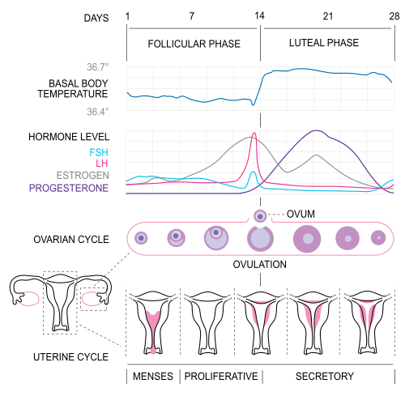
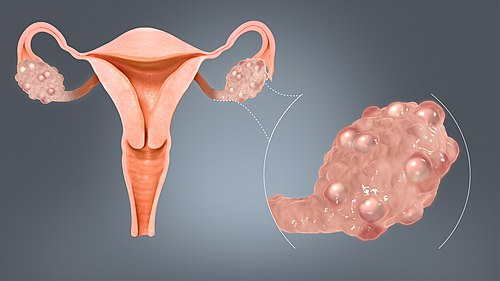

# FATOR OVULATÓRIO

O fator ovulatório é responsável por cerca de 30% a 40% dos casos de infertilidade feminina. Quando falamos de provas de residência, este é o tema "queridinho" da ginecologia endócrina, pois permite ao examinador cobrar desde a fisiologia do ciclo menstrual até tratamentos complexos de reprodução assistida.

Para entender o fator ovulatório, você não deve decorar algoritmos, mas sim compreender o eixo hipotálamo-hipófise-ovário (HHO). Se o eixo não conversa bem, a ovulação não acontece. E se não há ovócito, não há gravidez.

*Figura 1 - Diagrama do ciclo menstrual mostrando as variações hormonais (FSH, LH, estradiol, progesterona), o desenvolvimento folicular e as alterações endometriais ao longo das fases do ciclo. Fonte: Isometrik, CC BY-SA 3.0 | Wikimedia Commons*

## Fisiologia da Ovulação: O Porquê do Sucesso ou do Fracasso

A ovulação não é um evento isolado, mas o ápice de uma orquestra hormonal. No início do ciclo, o FSH (Hormônio Folículo Estimulante) recruta uma coorte de folículos. Um deles se torna o dominante, passando a produzir estradiol em larga escala.

O pulo do gato para as provas está aqui: o estradiol alto, por um período prolongado (cerca de 48 horas), exerce um feedback positivo no hipotálamo e na hipófise, gerando o pico de LH (Hormônio Luteinizante). A ovulação ocorre, tipicamente, 10 a 12 horas após o pico de LH e 24 a 36 horas após o pico de estradiol.

Se esse mecanismo falha, temos a anovulação. E por que isso importa? Porque sem a ruptura folicular, não se forma o corpo lúteo. Sem corpo lúteo, não temos progesterona. Sem progesterona, o endométrio não se torna secretor (preparado para a nidação) e permanece proliferativo.

Dica de prova: se uma questão trouxer uma biópsia de endométrio no 24º dia do ciclo mostrando "endométrio proliferativo", a banca está gritando para você que essa paciente não ovulou. O esperado para esse dia seria um endométrio secretor.

## Avaliação da Reserva Ovariana

Antes de tratar a anovulação, precisamos saber se ainda existem "ovos na cesta". A reserva ovariana reflete a quantidade e, indiretamente, a qualidade dos oócitos restantes.

A idade da mulher é o preditor isolado mais importante da fertilidade, mas não é o único. Mulheres jovens podem ter falência ovariana precoce (FOP), hoje tecnicamente chamada de Insuficiência Ovariana Primária (IOP).

### Marcadores de Reserva Ovariana

Atualmente, segundo a FEBRASGO, os dois melhores parâmetros para avaliar a reserva ovariana são:

-

**Hormônio Anti-Mülleriano (AMH):** Produzido pelas células da granulosa de folículos pré-antrais e antrais pequenos. A grande vantagem é que ele não varia significativamente ao longo do ciclo menstrual, podendo ser colhido em qualquer dia.

- Valores baixos (< 1,0 ng/mL) sugerem baixa reserva.

- Valores altos (> 3,5 - 5,0 ng/mL) sugerem alta reserva, comum na SOP, e alertam para o risco de Síndrome de Hiperestimulação Ovariana (SHO).

-

**Contagem de Folículos Antrais (CFA):** Realizada via ultrassonografia transvaginal, preferencialmente entre o 2º e o 5º dia do ciclo. Contamos folículos entre 2 e 10 mm.

- Uma contagem total (soma dos dois ovários) menor que 5 a 7 folículos indica reserva reduzida.

O FSH basal (colhido no 3º dia do ciclo) ainda é cobrado. Se estiver elevado (> 10-15 mUI/mL), indica que a hipófise está "gritando" para um ovário que já não responde bem. Porém, o FSH é um marcador tardio; quando ele sobe, a reserva já está muito comprometida.

## Diagnóstico da Ovulação: Como Confirmar?

Muitos alunos erram questões por acharem que o diagnóstico de ovulação exige exames caros. Na verdade, a clínica é soberana. Uma mulher com ciclos regulares (25 a 35 dias), com sintomas pré-menstruais (mastalgia, mudança de humor, retenção hídrica), muito provavelmente ovula.

### Métodos Laboratoriais e de Imagem

Para a propedêutica de infertilidade, usamos métodos mais objetivos:

- **Progesterona Sérica na Fase Lútea Média:** É o padrão-ouro laboratorial para confirmar ovulação. Deve ser dosada cerca de 7 dias antes da data prevista para a próxima menstruação (geralmente no 21º dia em um ciclo de 28).

- Valores > 3 ng/mL confirmam ovulação.

- Valores > 10 ng/mL são considerados ideais para suporte de uma possível gestação inicial.

- **Ultrassonografia Transvaginal Seriada:** É o método mais preciso para monitorar o crescimento folicular. Começamos por volta do 9º ou 10º dia do ciclo e repetimos a cada 2 dias. A ovulação é confirmada pelo desaparecimento do folículo dominante, aparecimento de líquido no fundo de saco de Douglas e formação do corpo lúteo.

- **Teste de LH Urinário:** Detecta o pico de LH na urina. Útil para o casal programar o coito, indicando que a ovulação deve ocorrer nas próximas 24 a 36 horas.

- **Temperatura Basal:** Método histórico e barato, mas pouco prático. A progesterona é termogênica, então a temperatura sobe cerca de 0,3 a 0,5 °C após a ovulação. O problema é que ela só avisa que a ovulação *já ocorreu*, perdendo a janela fértil.

| Método | Momento da Realização | O que indica? |
| --- | --- | --- |
| Progesterona Sérica | 21º dia (ou 7 dias antes da menstruação) | Confirma que houve ovulação (> 3 ng/mL) |
| USG Seriado | A partir do 9º-10º dia | Monitora crescimento e ruptura folicular |
| Teste de LH Urinário | Diário, próximo ao meio do ciclo | Prediz a ovulação iminente (em 24-36h) |
| Muco Cervical | Período periovulatório | Indica pico estrogênico (muco tipo clara de ovo) |

## Etiologias da Anovulação: A Classificação da OMS

Para facilitar o raciocínio clínico, a Organização Mundial da Saúde (OMS) divide as causas de anovulação em três grupos principais. Entender isso é fundamental para decidir o tratamento.

### Grupo I: Hipogonadismo Hipogonadotrófico (Falha Central)

Aqui, o problema está no "maestro" (hipotálamo ou hipófise). O FSH e o LH estão baixos, e consequentemente o estradiol também.

- **Causas:** Estresse extremo, perda de peso excessiva (anorexia), exercício físico extenuante (tríade da atleta), tumores hipofisários ou Síndrome de Kallmann.

- **Tratamento:** Como o ovário é normal mas não recebe estímulo, o tratamento de escolha são as gonadotrofinas (FSH e LH exógenos) ou bomba de GnRH. O clomifeno não funciona aqui porque ele depende de um eixo hipotálamo-hipófise íntegro.

### Grupo II: Disfunção Normogonadotrófica (Eixo Desregulado)

É o grupo mais comum nas provas e na vida real. O eixo funciona, mas de forma desequilibrada. O exemplo clássico é a **Síndrome dos Ovários Policísticos (SOP)**.

- **Perfil:** FSH e LH em níveis normais (ou LH levemente aumentado), mas sem o pico ovulatório.

- **Tratamento:** Indutores de ovulação, como o Citrato de Clomifeno ou Letrozol.

### Grupo III: Hipogonadismo Hipergonadotrófico (Falha Ovariana)

O problema é o "operário" (ovário). Os folículos acabaram ou não respondem. A hipófise tenta compensar aumentando desesperadamente o FSH e o LH.

- **Causas:** Insuficiência Ovariana Primária (IOP), menopausa, quimioterapia, radioterapia pélvica.

- **Tratamento:** Infelizmente, indutores de ovulação não funcionam. A solução para a infertilidade costuma ser a recepção de oócitos doados (ovodoação).

*Figura 2 - Representação de ovários policísticos com múltiplos pequenos cistos foliculares periféricos (aspecto de "colar de pérolas"). A SOP é a principal causa de anovulação crônica. Fonte: Scientific Animations, CC BY-SA 4.0 | Wikimedia Commons*

## Síndrome dos Ovários Policísticos (SOP) e Infertilidade

A SOP é a causa mais frequente de anovulação crônica. Para a prova, você deve dominar os **Critérios de Rotterdam (2003)**, que exigem 2 de 3 dos seguintes:

- **Oligo ou Anovulação:** Clinicamente manifestada como ciclos irregulares ou amenorreia.

- **Hiperandrogenismo:** Clínico (hirsutismo, acne, alopecia) ou laboratorial (testosterona elevada).

- **Morfologia de Ovários Policísticos ao USG:** Presença de 12 ou mais folículos (2-9 mm) em pelo menos um ovário OU volume ovariano > 10 cm³. *Nota: Diretrizes mais recentes sugerem > 20 folículos se o transdutor for de alta frequência, mas Rotterdam ainda é o padrão em provas.*

Cuidado com a pegadinha: a presença de "cistos" no ultrassom isoladamente NÃO faz diagnóstico de SOP. Da mesma forma, uma paciente pode ter SOP mesmo com ultrassom normal, desde que tenha anovulação e hiperandrogenismo. Como o Dr. Will sempre reforça nas discussões do MedEvo, a clínica é soberana no diagnóstico da SOP.

## Tratamento do Fator Ovulatório: Indução da Ovulação

O objetivo aqui é restaurar a ovulação mono-folicular (um único folículo) para evitar gestações múltiplas e complicações.

### 1. Citrato de Clomifeno (O Clássico)

É um Modulador Seletivo do Receptor de Estrogênio (SERM).

- **Mecanismo de Ação:** Ele se liga aos receptores de estrogênio no hipotálamo, bloqueando-os. O hipotálamo "acha" que os níveis de estrogênio estão baixos (feedback negativo falso) e responde aumentando a secreção de GnRH, que por sua vez aumenta o FSH e o LH. Esse aumento de FSH estimula o crescimento folicular.

- **Uso:** Geralmente 50 mg a 150 mg por dia, durante 5 dias, iniciando entre o 2º e o 5º dia do ciclo.

- **Efeito Colateral Importante:** Como é um antiestrogênico, ele pode "secar" o muco cervical e tornar o endométrio fino (atrófico), o que às vezes dificulta a gravidez mesmo com ovulação confirmada.

### 2. Letrozol (O Novo Padrão-Ouro para SOP)

É um inibidor da aromatase.

- **Mecanismo de Ação:** Impede a conversão de androgênios em estrogênios. Isso também reduz o feedback negativo no hipotálamo, aumentando o FSH.

- **Vantagem:** Não bloqueia os receptores de estrogênio no endométrio, mantendo-o mais receptivo. Estudos mostram taxas de nascidos vivos superiores ao clomifeno em pacientes com SOP e IMC elevado.

### 3. Gonadotrofinas (FSH recombinante)

Usadas quando os indutores orais falham (2ª linha) ou no Grupo I da OMS.

- **Risco:** Alto risco de gestação múltipla e de Síndrome de Hiperestimulação Ovariana (SHO). Exige monitoramento rigoroso com USG seriado.

### 4. Metformina

Não é um indutor de ovulação primário. Seu papel é tratar a resistência insulínica associada à SOP. Pode ajudar a restaurar a ovulação em algumas pacientes, mas raramente é usada sozinha para infertilidade.

| Medicamento | Mecanismo | Indicação Principal |
| --- | --- | --- |
| Citrato de Clomifeno | Bloqueio de receptor de estrogênio | Anovulação Grupo II (SOP) |
| Letrozol | Inibição da aromatase | SOP (especialmente se IMC alto) |
| Gonadotrofinas | Estímulo direto ao ovário | Grupo I ou falha de 1ª linha no Grupo II |
| Cabergolina | Agonista dopaminérgico | Hiperprolactinemia |

## Complicações do Tratamento

Ao "cutucar" o ovário com hormônios, podemos causar problemas graves.

### Síndrome de Hiperestimulação Ovariana (SHO)

É uma resposta excessiva aos indutores, mediada principalmente pelo aumento do VEGF (Fator de Crescimento Endotelial Vascular), que aumenta a permeabilidade capilar.

- **Quadro Clínico:** Ascite, derrame pleural, hemoconcentração, oligúria e risco de tromboembolismo.

- **Fatores de Risco:** Mulheres jovens, magras, com SOP ou AMH elevado (> 3,5 ng/mL).

- **Manejo:** Casos leves são ambulatoriais (hidratação, repouso). Casos graves exigem internação, controle hidroeletrolítico e profilaxia para trombose.

### Torção Ovariana

O ovário estimulado cresce muito (pode passar de 10 cm). Esse aumento de volume e peso predispõe à torção do pedículo vascular.

- **Cenário de Prova:** Paciente em indução de ovulação que apresenta dor pélvica aguda súbita, náuseas e sinais de irritação peritoneal. O diagnóstico é clínico + Doppler, e o tratamento é cirúrgico de urgência.

## Oncofertilidade: Preservando o Futuro

Este tema tem caído com frequência. Pacientes jovens que enfrentarão tratamentos gonadotóxicos (quimioterapia ou radioterapia) devem ser aconselhadas sobre preservação da fertilidade.

- **Criopreservação de Ovócitos:** É a técnica padrão. A paciente passa por uma estimulação ovariana rápida e os óvulos são coletados e congelados.

- **Criopreservação de Tecido Ovariano:** Ainda considerada experimental em alguns centros, mas indicada para meninas pré-púberes ou quando não há tempo para a estimulação ovariana.

- **Análogos do GnRH:** Podem ser usados durante a quimioterapia para tentar "colocar o ovário em repouso", mas a eficácia na preservação da fertilidade é menor que a criopreservação de oócitos.

Lembre-se da pérola clínica: uma dose de apenas 2Gy de radiação pélvica pode destruir 50% da reserva ovariana. O encaminhamento para o especialista em reprodução deve ser imediato após o diagnóstico do câncer.

## Situações Especiais e Diagnósticos Diferenciais

### Hiperprolactinemia

Sempre peça Prolactina na investigação de anovulação. A prolactina alta inibe os pulsos de GnRH. Se a paciente tem galactorreia ou apenas irregularidade menstrual, trate a causa base (geralmente com agonistas dopaminérgicos como a Cabergolina) antes de tentar induzir a ovulação.

### Disfunções Tireoidianas

Tanto o hipotireoidismo quanto o hipertireoidismo podem causar anovulação. O TSH deve fazer parte da rotina inicial. O hipotireoidismo aumenta o TRH, que pode estimular a prolactina, gerando um quadro misto.

### Infertilidade Sem Causa Aparente (ISCA)

Quando a propedêutica básica (fator ovulatório, tubário, uterino e masculino) é normal, chamamos de ISCA. O tratamento inicial para casais jovens com ISCA costuma ser a indução da ovulação com coito programado ou inseminação intrauterina, visando aumentar as chances mensais.

## Diagnóstico Diferencial de Dor Aguda na Indução

Se sua paciente está induzindo ovulação e chega com dor, você deve pensar em três coisas:

- **Ovulação (Dor do Meio):** Dor leve, fisiológica.

- **SHO:** Dor abdominal difusa, distensão, ascite.

- **Torção Ovariana:** Dor súbita, unilateral, lancinante.

- **Gravidez Ectópica:** Se ela já tiver passado da fase de ovulação. Lembre-se que a indução aumenta o risco de gestações múltiplas e, proporcionalmente, de ectópicas e gestações heterotópicas (uma dentro e outra fora do útero).

## Pontos-Chave para Prova 🎯

- **Progesterona no 21º dia:** O valor > 3 ng/mL confirma ovulação. É o teste mais simples para confirmar que o corpo lúteo se formou.

- **Endométrio Proliferativo tardio:** Se a biópsia no 24º dia mostrar padrão proliferativo, o ciclo foi anovulatório. O correto seria padrão secretor.

- **Citrato de Clomifeno:** Age no hipotálamo bloqueando receptores de estrogênio. É a primeira linha clássica para SOP (Grupo II da OMS).

- **Letrozol:** Inibidor da aromatase, superior ao clomifeno em pacientes com SOP e obesidade.

- **Reserva Ovariana:** Os melhores marcadores são o Hormônio Anti-Mülleriano (AMH) e a Contagem de Folículos Antrais (CFA).

- **FSH elevado + Amenorreia em < 40 anos:** Diagnóstico de Insuficiência Ovariana Primária (IOP). O tratamento para engravidar é ovodoação.

- **SOP e Rotterdam:** Precisa de 2 de 3 (Anovulação, Hiperandrogenismo, Imagem USG). A clínica (hirsutismo + irregularidade) já pode fechar o diagnóstico.

- **Risco de SHO:** Pacientes com AMH > 3,5 ng/mL ou muitos folículos antrais têm alto risco. O gatilho da síndrome é o uso do hCG para maturação folicular e o aumento do VEGF.

- **Pico de LH:** A ovulação ocorre 10-12h após o pico de LH. Os testes de farmácia detectam esse pico na urina.

- **Muco Cervical:** Sob influência do estrogênio (pré-ovulatório), ele é fluido, transparente e tem alta filância (estica). Sob progesterona, fica espesso e opaco.

- **Falha do Clomifeno:** Se não houver ovulação com doses crescentes (até 150mg), a próxima linha são as gonadotrofinas ou o Letrozol.

- **Oncofertilidade:** A criopreservação de oócitos deve ser oferecida antes do início da quimioterapia ou radioterapia.

- **Histeroscopia:** Avalia a cavidade uterina (pólipos, miomas, septos), mas NÃO serve para avaliar se a paciente ovula.

- **Gravidez de Localização Indeterminada:** Beta-hCG positivo, mas USG sem saco gestacional. Conduta: repetir Beta em 48h. Se não dobrar, suspeitar de ectópica ou aborto.

- **Idade Materna:** É o fator isolado que mais reduz a chance de sucesso em qualquer tratamento de infertilidade, incluindo a FIV.

 Cópia offline para consulta pessoal.
 Fonte original:
 [https://www.medevo.com.br/material-apoio/ler/4d4726e4-d9a2-4ca6-9ade-a98e1a5456d0](https://www.medevo.com.br/material-apoio/ler/4d4726e4-d9a2-4ca6-9ade-a98e1a5456d0)
