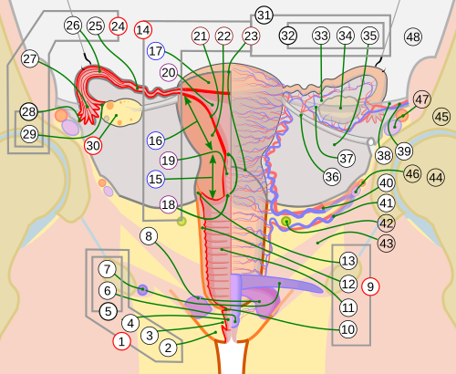
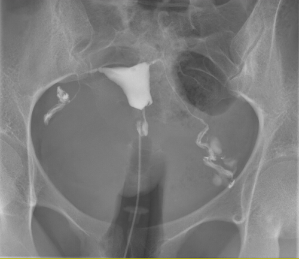

# FATOR TUBOPERITONEAL E UTERINO

A infertilidade conjugal é definida como a ausência de concepção após 12 meses de relações sexuais regulares e desprotegidas. No entanto, se a mulher tiver mais de 35 anos, esse prazo cai para 6 meses. Por que essa diferença? Porque a reserva ovariana não espera, e o tempo é o nosso maior inimigo na reprodução assistida. Quando olhamos para as causas femininas, o fator tuboperitoneal e o fator uterino ocupam um papel de destaque, sendo responsáveis por cerca de 35% a 40% dos casos.

*Figura 1 - Anatomia do sistema reprodutor feminino em corte frontal, demonstrando útero, tubas uterinas (com istmo, ampola, infundíbulo e fímbrias) e ovários. A integridade tubária é essencial para a fertilização natural. Fonte: Jmarchn, CC BY-SA 3.0 | Wikimedia Commons*

## Fator Tuboperitoneal: A Rodovia da Fertilização

Para que a gravidez ocorra naturalmente, a tuba uterina precisa estar funcional. Ela não é apenas um "cano" que liga o ovário ao útero. A tuba é um órgão dinâmico que capta o óvulo, serve de local para a fertilização (especificamente na ampola) e transporta o embrião até a cavidade uterina. Se essa rodovia estiver bloqueada ou com o asfalto (os cílios internos) destruído, a gestação não acontece ou, pior, acontece no lugar errado, gerando uma gravidez ectópica.

### Etiologia e Fisiopatologia

A principal causa de dano tubário no Brasil e no mundo é a Doença Inflamatória Pélvica (DIP). Aqui está o primeiro grande conceito de prova: a DIP é frequentemente causada por *Chlamydia trachomatis* e *Neisseria gonorrhoeae*.

A Clamídia é particularmente perigosa porque é silenciosa. Muitas pacientes têm quadros subclínicos, sem dor exuberante, mas a bactéria promove uma reação inflamatória crônica que destrói as fímbrias e causa aderências peritubárias. Como Dr. Will costuma enfatizar em suas discussões clínicas, "o que os olhos não veem, a tuba sente". O resultado final é a obstrução ou a formação de hidrossalpinge (tuba dilatada e cheia de líquido).

Outras causas importantes incluem:

- Endometriose: Causa aderências que distorcem a anatomia pélvica e podem obstruir as tubas.

- Cirurgias pélvicas prévias: Apendicite supurada ou cirurgias ginecológicas podem gerar bridas (aderências).

- Tuberculose Genital: Menos comum, mas clássica em provas. O sinal radiológico típico na histerossalpingografia é a "trompa em rosário" ou "em conta de contas".

### Diagnóstico do Fator Tubário

O exame inicial padrão-ouro para avaliar a permeabilidade tubária é a Histerossalpingografia (HSG).

**Dica de Ouro para a HSG:** O exame deve ser agendado na fase folicular precoce (entre o 5º e o 12º dia do ciclo). Por que? Primeiro, para garantir que a paciente não está grávida (o endométrio está fino e a menstruação acabou de cessar). Segundo, porque o endométrio fino facilita a visualização da cavidade e evita que restos hemáticos simulem obstrução.

Na HSG, buscamos a Prova de Cotte. Se o contraste extravasa para a cavidade peritoneal e se espalha, a Prova de Cotte é positiva, indicando que ao menos uma tuba é pérvia. Se o contraste fica retido na tuba, temos obstrução ou hidrossalpinge.

Cuidado com a pegadinha: a HSG avalia a anatomia interna (lúmen), mas não vê aderências externas. Para isso, o padrão-ouro absoluto (embora não seja o primeiro exame) é a Videolaparoscopia com Cromotubagem (injeção de azul de metileno pelo colo uterino para ver se sai pelas fímbrias).

### Tratamento do Fator Tubário

A conduta depende da gravidade.

- Obstrução distal leve/aderências: Pode-se tentar a salpingoplastia ou neosalpingostomia por laparoscopia.

- Obstrução bilateral irreversível ou hidrossalpinge grave: A conduta de escolha é a Fertilização in Vitro (FIV).

**Atenção:** Se a paciente tem hidrossalpinge e vai para FIV, você DEVE realizar a salpingectomia (retirada da tuba) antes da transferência dos embriões. O líquido da hidrossalpinge é embriotóxico e reduz as taxas de implantação em até 50%.

## Gravidez Ectópica: Quando o Caminho é Interrompido

A gravidez ectópica é a implantação do blastocisto fora da cavidade endometrial. É uma emergência ginecológica potencial e um tema onipresente em provas de residência.

### Fatores de Risco

O principal fator de risco isolado é a história de gravidez ectópica prévia. Outros fatores incluem:

- DIP prévia (sequela tubária).

- Cirurgia tubária (incluindo laqueadura, que se falhar, tem alto risco de ser ectópica).

- Tabagismo (altera a motilidade ciliar).

- Uso de DIU (o DIU não causa ectópica, ele previne muito bem a gestação tópica; se a paciente engravidar de DIU, a chance relativa de ser ectópica é maior).

- Técnicas de Reprodução Assistida (FIV).

### Quadro Clínico e Diagnóstico

A tríade clássica é: dor abdominal, atraso menstrual e sangramento vaginal. No exame físico, a dor à mobilização do colo uterino e a palpação de massa anexial são achados frequentes.

O diagnóstico baseia-se no binômio: Beta-hCG quantitativo + Ultrassonografia Transvaginal (USTV).
Aqui entra o conceito da Zona de Discriminação: com níveis de Beta-hCG entre 1.500 e 2.000 mUI/mL, é obrigatório visualizar um saco gestacional dentro do útero na USTV. Se o Beta está acima disso e o útero está vazio, a suspeita de ectópica é altíssima.

### Manejo da Gravidez Ectópica

| Conduta | Critérios de Indicação |
| --- | --- |
| **Expectante** | Paciente estável, Beta-hCG declinante (< 1.000 mUI/mL), massa < 3 cm, sem batimento cardíaco fetal. |
| **Medicamentosa (Metotrexato)** | Estabilidade hemodinâmica, Beta-hCG < 5.000 mUI/mL, massa < 3,5 a 4 cm, ausência de atividade cardíaca fetal, desejo de preservar a tuba. |
| **Cirúrgica (Salpingostomia)** | Estabilidade hemodinâmica, desejo de prole, tuba contralateral doente. (Cirurgia conservadora). |
| **Cirúrgica (Salpingectomia)** | Instabilidade hemodinâmica (rota), prole constituída, tuba muito danificada ou sangramento incontrolável. |

O Metotrexato (MTX) é um antagonista do ácido fólico que interrompe a divisão celular do trofoblasto. O acompanhamento é feito com Beta-hCG nos dias 4 e 7 após a dose. Espera-se uma queda de pelo menos 15% entre esses dias. Se não cair, pode-se repetir a dose ou partir para cirurgia.

**Sinais de Gravidez Ectópica Rota:** Dor súbita e intensa, sinal de Blumberg positivo (irritação peritoneal), instabilidade hemodinâmica (taquicardia, hipotensão), sinal de Proust (dor excruciante ao toque no fundo de saco posterior, o "grito de Douglas"). Nesses casos, a conduta é laparotomia imediata para controle do choque e salpingectomia.

*Figura 2 - Histerossalpingografia (HSG) normal de mulher de 30 anos, mostrando cavidade uterina de contornos regulares e tubas uterinas pérvias com extravasamento peritoneal bilateral. Fonte: Jmarchn, CC BY-SA 3.0 | Wikimedia Commons*

## Fator Uterino: O Berço da Gestação

O fator uterino pode impedir a implantação ou causar abortamentos de repetição. Na MedEvo, sempre lembramos que o útero precisa estar "limpo" e com formato adequado para receber o embrião.

### Malformações Müllerianas (Congênitas)

As malformações ocorrem por falhas na fusão ou na reabsorção do septo dos ductos de Müller.

- Útero Septado: É a malformação mais associada a resultados reprodutivos adversos (aborto de repetição). O contorno externo do fundo uterino é normal (plano ou convexo), mas há um septo fibroso interno. Tratamento: Metroplastia por Histeroscopia.

- Útero Bicorno: Falha parcial na fusão. O fundo uterino é chanfrado (côncavo). Geralmente não requer cirurgia, a menos que haja complicações obstétricas graves.

- Útero Didelfo: Falha total de fusão, resultando em dois colos e dois corpos uterinos.

**Diferenciação Crítica:** Para diferenciar útero septado de bicorno, a HSG não basta. O exame de escolha é a Ultrassonografia 3D ou a Ressonância Magnética, pois precisamos avaliar o contorno do fundo uterino.

### Patologias Adquiridas

#### Leiomiomas

Nem todo mioma causa infertilidade. A classificação da FIGO é essencial aqui:

- FIGO 0, 1 e 2 (Submucosos): Distorcem a cavidade endometrial. Devem ser retirados por miomectomia histeroscópica, pois prejudicam a implantação.

- FIGO 3 e 4 (Intramurais): Só são considerados causa de infertilidade se forem grandes (> 4-5 cm) ou se distorcerem a cavidade. Se forem pequenos (< 3 cm) e não abaularem o endométrio, são achados incidentais.

- FIGO 5, 6 e 7 (Subserosos): Não causam infertilidade.

#### Pólipos Endometriais

Funcionam como um "corpo estranho" ou geram inflamação local. A conduta em pacientes inférteis é a polipectomia por histeroscopia, independentemente do tamanho.

#### Síndrome de Asherman

São sinéquias (cicatrizes) dentro do útero, geralmente após curetagens vigorosas ou infecções (como a tuberculose). A paciente apresenta hipomenorreia ou amenorreia secundária e infertilidade. O diagnóstico e tratamento são feitos por histeroscopia.

## Endometriose e Infertilidade

A endometriose é uma causa multifatorial de infertilidade. Ela afeta o fator tuboperitoneal (aderências), o fator ovariano (endometriomas que destroem parênquima) e o fator peritoneal (citocinas inflamatórias que atrapalham a função espermática e a captação do óvulo).

Na videolaparoscopia, as lesões podem ser:

- Vermelhas (ativas, iniciais).

- Pretas ("queimadura de pólvora", cicatriciais).

- Brancas (fibrosas).

A presença de dor pélvica, dismenorreia intensa e dispareunia de profundidade em uma paciente infértil deve sempre levantar a suspeita de endometriose. O diagnóstico clínico-radiológico (USG com preparo intestinal ou RM) avançou muito, mas a laparoscopia continua sendo importante para estadiamento e tratamento cirúrgico.

## Investigação Prática da Infertilidade (Passo a Passo)

Quando o casal chega ao consultório, a investigação deve ser simultânea. Não se investiga apenas a mulher.

- Espermograma: Avalia o fator masculino. Se alterado, repetir em 3 meses.

- Avaliação da Ovulação: Dosagem de Progesterona na fase lútea média (21º dia em ciclos de 28 dias) e USG transvaginal seriada.

- Avaliação Tubária: Histerossalpingografia (HSG).

- Avaliação da Reserva Ovariana: Hormônio Antimülleriano (HAM) ou contagem de folículos antrais pela USG.

Se todos os exames acima forem normais, o diagnóstico é Infertilidade Sem Causa Aparente (ISCA). Nesses casos, o tratamento costuma ser empírico, começando com indução de ovulação e evoluindo para técnicas de reprodução assistida.

### Comparativo de Métodos de Imagem no Fator Uterino/Tubário

| Exame | Principal Indicação | Limitação |
| --- | --- | --- |
| **Histerossalpingografia** | Triagem de permeabilidade tubária e cavidade uterina. | Não vê aderências externas ou endometriose. |
| **USTV com Preparo Intestinal** | Mapeamento de endometriose profunda. | Dependente do examinador. |
| **Histeroscopia** | Padrão-ouro para patologia intracavitária (pólipo, mioma, sinéquia). | Não avalia as tubas (apenas os óstios). |
| **Laparoscopia** | Padrão-ouro para fator tuboperitoneal e endometriose. | Invasivo, requer anestesia geral. |
| **USG 3D** | Diferenciar malformações uterinas (Septado vs. Bicorno). | Disponibilidade limitada em alguns centros. |

## Pontos-Chave para Prova 🩺

- A principal causa de fator tuboperitoneal é a sequela de DIP (Clamídia e Gonococo).

- Prova de Cotte positiva na HSG = tubas pérvias. Prova de Cotte negativa = obstrução.

- Hidrossalpinge deve ser tratada com salpingectomia antes da FIV para aumentar as taxas de sucesso.

- Mioma submucoso (FIGO 0, 1, 2) sempre deve ser retirado na propedêutica de infertilidade.

- O útero septado é a malformação Mülleriana que mais causa aborto de repetição; o tratamento é a ressecção do septo por histeroscopia.

- A zona de discriminação do Beta-hCG para ver saco gestacional na USTV é de 1.500 a 2.000 mUI/mL.

- O local mais comum de gravidez ectópica é a ampola da tuba uterina (95%).

- Contraindicações ABSOLUTAS ao Metotrexato: Instabilidade hemodinâmica, amamentação, imunodeficiência, doença renal ou hepática grave, gestação tópica coexistente (heterotópica).

- O melhor preditor de sucesso do tratamento com MTX é o nível inicial de Beta-hCG (ideal < 5.000).

- "Trompa em rosário" na HSG sugere Tuberculose Genital.

- Na suspeita de gravidez ectópica rota com instabilidade, a conduta é cirurgia imediata (Laparotomia), não perca tempo com exames de imagem se o choque é óbvio.

- O tabagismo é fator de risco para ectópica, mas é "protetor" para Retocolite Ulcerativa (pegadinha clássica de clínica médica que cai em gineco).

- A biópsia de endométrio NÃO é mais usada rotineiramente para datar ovulação na propedêutica de infertilidade.

- Se a paciente tem obstrução tubária bilateral proximal confirmada, a conduta mais eficaz é a Fertilização in Vitro (FIV).

- O sinal de Proust (dor ao toque no fundo de saco) indica hemoperitônio.

- Erro comum: Achar que DIU causa DIP. O DIU aumenta o risco de infecção apenas nos primeiros 20 dias após a inserção (pela técnica de inserção), depois o risco é igual ao da população geral.

- O tratamento de escolha para Síndrome de Asherman é a lise de sinéquias por histeroscopia sob visão direta.

 Cópia offline para consulta pessoal.
 Fonte original:
 [https://www.medevo.com.br/material-apoio/ler/1007442c-121a-4e3b-a343-134fb64de432](https://www.medevo.com.br/material-apoio/ler/1007442c-121a-4e3b-a343-134fb64de432)
