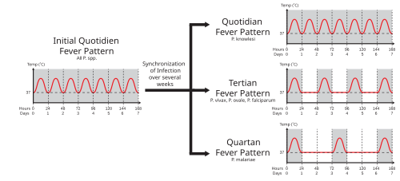

# FEBRE E SÍNDROMES FEBRIS

Para começar nosso estudo, precisamos alinhar um conceito que parece básico, mas que derruba muita gente em prova por excesso de confiança. A febre não é uma doença, é uma resposta biológica mediada pelo hipotálamo. Quando você atende um paciente com febre, seu cérebro deve funcionar como um filtro: isso é uma resposta inflamatória sistêmica, uma infecção localizada ou um erro do termostato central?

Nas provas de residência, o examinador não quer apenas que você saiba que 38,3°C é febre. Ele quer que você saiba por que o corticoide reduz a temperatura, por que a atelectasia causa febre no pós-operatório e por que você não deve dar fenitoína em uma crise convulsiva de um paciente com porfiria. Vamos construir esse raciocínio juntos.

*Figura 1 - Representação conceitual do mecanismo da febre: pirogênios exógenos estimulam a produção de citocinas (IL-1, IL-6, TNF-alfa) que atuam no hipotálamo elevando o set-point térmico. Fonte: Philip Newton, Domínio Público | Wikimedia Commons*

## Fisiopatologia e Termorregulação

O centro termorregulador fica no hipotálamo anterior. Imagine-o como o termostato de um ar-condicionado. Em condições normais, ele mantém a temperatura corporal entre 36,5°C e 37,5°C. Na febre, esse "set-point" é ajustado para cima.

### O mecanismo da febre

Tudo começa com os pirogênios. Temos os pirogênios exógenos, como as endotoxinas bacterianas (LPS), que estimulam as células de defesa (macrófagos, monócitos) a produzirem pirogênios endógenos. Os principais que você deve memorizar são a Interleucina-1 (IL-1), Interleucina-6 (IL-6) e o Fator de Necrose Tumoral alfa (TNF-alfa).

Essas citocinas viajam pela corrente sanguínea até o órgão vasculoso da lâmina terminal no hipotálamo. Lá, elas ativam a enzima Ciclo-oxigenase (COX), que converte o ácido araquidônico em Prostaglandina E2 (PGE2). É a PGE2 que efetivamente "gira o botão" do termostato para cima.

Aqui entra uma explicação importante que o Dr. Will sempre enfatiza nas aulas do MedEvo: por que usamos diferentes drogas?

- Anti-inflamatórios Não Esteroidais (AINHs) e Dipirona/Paracetamol: Inibem a COX, reduzindo a produção de PGE2.

- Corticosteroides (como a Prednisona): Eles agem "antes", bloqueando a transcrição das citocinas inflamatórias (IL-1, TNF). Por isso, o corticoide é um potente antitérmico, mas não por ação direta na COX, e sim por reduzir o estímulo inicial.

### Febre vs. Hipertermia

Este é um dos temas preferidos das bancas. A diferença não é a temperatura em si, mas o mecanismo.

Na Febre, o hipotálamo está funcionando perfeitamente, ele apenas decidiu que o corpo precisa ficar mais quente. O corpo então usa mecanismos como calafrios (para gerar calor) e vasoconstrição periférica (para conservar calor) para atingir esse novo alvo.

Na Hipertermia, o set-point hipotalâmico está normal, mas o corpo não consegue dissipar calor ou está produzindo calor em excesso de forma descontrolada. Exemplos clássicos: insolação, hipertermia maligna e síndrome neuroléptica maligna.

**Dica de Prova:** Se a questão descreve um paciente com temperatura muito alta, pele seca e que não responde a antitérmicos comuns, pense em hipertermia. Antitérmicos não funcionam na hipertermia porque o problema não é a PGE2 no hipotálamo.

| Característica | Febre | Hipertermia |
| --- | --- | --- |
| Set-point Hipotalâmico | Elevado | Normal |
| Mecanismo | Mediado por Citocinas/PGE2 | Falha na dissipação ou excesso de produção |
| Resposta a Antitérmicos | Sim | Não |
| Exemplos | Infecções, Autoimunes | Insolação, Hipertermia Maligna |

## Febre no Pós-Operatório

Se você vai prestar prova para áreas cirúrgicas ou clínica médica, este tópico é obrigatório. A febre pós-operatória é classificada pelo tempo de aparecimento.

### Febre Precoce (Primeiras 24 a 48 horas)

A causa soberana aqui é a atelectasia pulmonar. Muitos alunos erram achando que febre no primeiro dia é infecção de ferida operatória. Errado. A infecção bacteriana de ferida demora, no mínimo, 48 a 72 horas para se manifestar.

A atelectasia ocorre porque o paciente no pós-operatório tem dor ao respirar (respiração superficial), está sob efeito de anestésicos e muitas vezes é tabagista. Isso leva ao colapso alveolar e a uma resposta inflamatória local que gera febre. O tratamento não é antibiótico, é fisioterapia respiratória e analgesia para o paciente conseguir expandir o pulmão.

Outra causa imediata (nas primeiras horas) é a reação transfusional febril não hemolítica. Se o paciente recebeu hemácias e começou com febre logo em seguida, sem outros sinais de hemólise, essa é a principal suspeita.

### Febre Intermediária e Tardia

Após o terceiro dia, começamos a pensar em "Infection":

- Infecção do Trato Urinário (ITU): Especialmente se houve sondagem vesical.

- Pneumonia: Evolução da atelectasia não tratada.

- Infecção da Ferida Operatória: Geralmente após o 3º ao 5º dia.

- Trombose Venosa Profunda (TVP): Pode causar febre baixa.

Se o paciente mantém febre e íleo paralítico (o intestino não volta a funcionar) após uma cirurgia abdominal, suspeite de infecção intra-abdominal (abscessos).

*Figura 2 - Padrões de febre: contínua, intermitente, remitente e recorrente. O reconhecimento do padrão febril auxilia no diagnóstico diferencial de doenças infecciosas e inflamatórias. Fonte: Jack Edelbrock, CC BY-SA 4.0 | Wikimedia Commons*

## Febre de Origem Indeterminada (FOI)

A FOI, ou FOD (Febre de Origem Obscura), é um desafio diagnóstico clássico. Para ser FOI, não basta ter febre sem foco por dois dias. Existem critérios rígidos que você precisa decorar.

### Critérios Clássicos (Petersdorf e Beeson revisados)

- Temperatura ≥ 38,3°C em várias ocasiões.

- Duração da febre por mais de 3 semanas.

- Investigação de pelo menos 1 semana em ambiente hospitalar ou 3 consultas ambulatoriais sem diagnóstico.

**Pérola de Prova:** Quanto mais tempo dura uma FOI sem diagnóstico, menor a chance de ser uma infecção e maior a chance de ser uma doença neoplásica ou autoimune. Cerca de 10% a 30% dos casos de FOI permanecem sem diagnóstico mesmo após investigação exaustiva, e esses pacientes geralmente têm um bom prognóstico.

### Etiologias Principais

As causas de FOI dividem-se em quatro grandes grupos:

- Infecções (30-40%): Tuberculose extrapulmonar (miliar, ganglionar), abscessos abdominais ocultos, endocardite infecciosa (lembrar dos microrganismos do grupo HACEK: *Haemophilus, Aggregatibacter, Cardiobacterium, Eikenella, Kingella*).

- Neoplasias (20-30%): Linfomas e Carcinoma de Células Renais são os "campeões" de febre.

- Doenças Reumáticas/Autoimunes (10-20%): Doença de Still do adulto, Lúpus, Arterite de Células Gigantes (em idosos).

- Miscelânea: Febre induzida por drogas, tireoidite, DII (Doença de Crohn).

### Roteiro de Investigação

A investigação inicial deve ser sempre com exames de primeira linha, menos invasivos:

- Hemograma completo, VHS e PCR (marcadores de atividade inflamatória).

- Hemoculturas e Urocultura.

- Raio-X de tórax e Ultrassonografia de abdome total.

- TCT (Teste Cutâneo de Tuberculina) ou IGRA.

Se os exames iniciais forem negativos e o VHS/PCR estiverem muito elevados, o próximo passo pode incluir exames de imagem mais avançados, como Tomografia de Tórax/Abdome e, em casos selecionados, o PET-CT ou cintilografia com leucócitos marcados. Se houver linfonodomegalia persistente, a biópsia de linfonodo é o padrão-ouro para diagnóstico de linfomas ou TB ganglionar.

## Febre em Pediatria

Aqui o jogo muda um pouco. Na pediatria, falamos muito em Febre Sem Sinais de Localização (FSSL). É aquela criança que tem febre, mas você examina o ouvido, a garganta, o pulmão e o abdome, e está tudo normal.

### O Lactente Jovem (

| Condição | Dica de Ouro para Prova |
| --- | --- |
| Atelectasia | Febre nas primeiras 24-48h pós-op + tabagismo. |
| Reação Transfusional | Febre imediata durante ou logo após transfusão. |
| Hipertermia Maligna | Rigidez muscular + febre alta após succinilcolina. |
| Doença de Still | Febre diária + exantema salmão + artralgia. |
| Mononucleose/CMV | Febre + linfocitose atípica + faringite/esplenomegalia. |

## Exame Físico e Propedêutica

O exame físico deve ser minucioso. Procure por:

- Sopro cardíaco novo: Sugere Endocardite.

- Rigidez de nuca: Meningite.

- Linfonodomegalia: Linfoma, TB, Mononucleose, HIV.

- Sinais flogísticos em articulações: Artrite séptica ou Gota.

- Fundo de olho: Tubérculos de coroide podem sugerir TB miliar.

No laboratório, a Proteína C Reativa (PCR) é um marcador de fase aguda que sobe rápido (6-12h) e cai rápido após a resolução do estímulo. O VHS (Velocidade de Hemossedimentação) é mais lento para subir e para normalizar. Um VHS acima de 100 mm/h deve sempre acender o alerta para Neoplasia, TB ou Arterite de Células Gigantes.

## Pontos-Chave para Prova

- Febre no pós-operatório imediato (24-48h) é atelectasia até que se prove o contrário. O tratamento é fisioterapia respiratória.

- A diferença fundamental entre febre e hipertermia é o set-point hipotalâmico: elevado na febre, normal na hipertermia.

- Antitérmicos NÃO previnem convulsão febril em crianças. O objetivo é o conforto.

- Na Dengue, a fase crítica ocorre na defervescência (quando a febre some). É aqui que o hematócrito sobe e o choque pode ocorrer.

- FOI exige febre > 3 semanas e investigação inconclusiva após 1 semana hospitalar ou 3 consultas.

- Paciente com porfiria e convulsão: Use Propofol. Evite Fenitoína e Valproato (são contraindicações absolutas por serem porfirinogênicos).

- Reação transfusional febril não hemolítica é a causa mais comum de febre pós-transfusional imediata.

- TCT/PPD negativo não exclui TB em imunocomprometidos. O Infliximab aumenta muito o risco de reativação de TB.

- Hipertermia Maligna: O tratamento é imediato com interrupção dos gatilhos e administração de Dantrolene.

- Lactente < 28 dias com febre: Internação e triagem séptica completa são obrigatórias.

- Corticoide antenatal: Indicado entre 24 e 34+6 semanas para maturação pulmonar.

- Miocardite viral: Suspeitar em jovens com dor torácica, febre e troponina positiva com coronárias normais.

- Oseltamivir: Deve ser iniciado em até 48h para pacientes com fatores de risco para complicações de Influenza.

- SIRS: Definida por 2 ou mais critérios (Febre/Hipotermia, Taquicardia, Taquipneia, Leucocitose/Leucopenia).

- Erro clássico: Prescrever antibiótico para febre pós-op de 12 horas sem foco. Lembre-se da atelectasia!

- A prednisona reduz a febre por inibir a produção de citocinas (IL-1, TNF), não por ação direta na COX.

 Cópia offline para consulta pessoal.
 Fonte original:
 [https://www.medevo.com.br/material-apoio/ler/1527c7da-024c-4ab1-a6fb-5896029b846f](https://www.medevo.com.br/material-apoio/ler/1527c7da-024c-4ab1-a6fb-5896029b846f)
