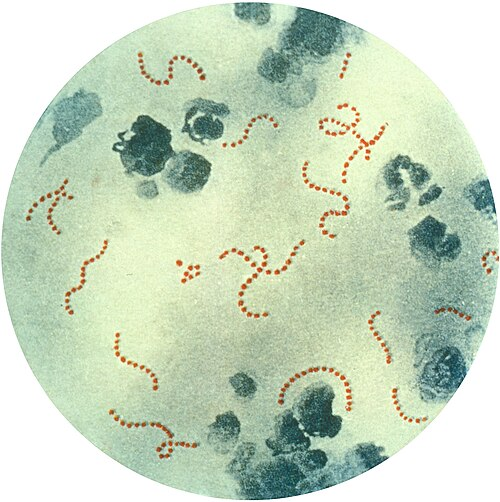
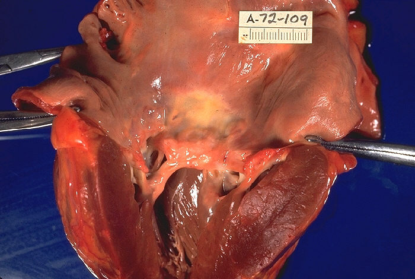

# FEBRE REUMÁTICA

A Febre Reumática (FR) não é uma infecção ativa, mas sim uma complicação tardia, de natureza autoimune, que surge após uma faringoamigdalite causada pelo Estreptococo beta-hemolítico do grupo A (Streptococcus pyogenes). Se você entender que o corpo "se confunde" ao tentar atacar a bactéria e acaba atacando os próprios tecidos, você já entendeu metade da disciplina.

Nas provas de residência, o examinador quer saber se você sabe identificar o paciente no meio de outros diagnósticos diferenciais (como Artrite Idiopática Juvenil ou Lúpus) e, principalmente, se você sabe prescrever a profilaxia corretamente para evitar que esse coração seja destruído.

*Figura 1 - Fotomicrografia de Streptococcus pyogenes (estreptococo beta-hemolítico do grupo A), corada por Pappenheim, em aumento de 900x. A proteína M de sua parede celular desencadeia o mimetismo molecular responsável pela febre reumática. Fonte: CDC, Domínio Público | Wikimedia Commons*

## O Porquê da Doença: Fisiopatologia e Etiologia

Por que algumas crianças têm dor de garganta e ficam bem, enquanto outras desenvolvem Febre Reumática? A resposta está no mimetismo molecular. O *Streptococcus pyogenes* possui em sua parede uma proteína chamada Proteína M. A estrutura dessa proteína é muito semelhante a moléculas do nosso corpo, como a miosina cardíaca, a laminina e componentes das articulações e do sistema nervoso central.

Quando o sistema imune de um indivíduo geneticamente predisposto cria anticorpos contra a Proteína M, esses anticorpos acabam "errando o alvo" e atacando o próprio hospedeiro. É por isso que a FR é uma doença multissistêmica.

Um detalhe fundamental que cai em prova: apenas a faringoamigdalite estreptocócica leva à Febre Reumática. Infecções cutâneas pelo mesmo estreptococo (como o impetigo) podem levar à Glomerulonefrite Difusa Aguda (GNPE), mas NUNCA à Febre Reumática. O motivo exato ainda é discutido, mas acredita-se que a resposta imune gerada na orofaringe seja qualitativamente diferente daquela gerada na pele.

## Diagnóstico: Os Critérios de Jones

O diagnóstico da Febre Reumática é clínico. Não existe um "exame de sangue para FR". Nós utilizamos os Critérios de Jones, que foram atualizados pela última vez em 2015 pela American Heart Association e adotados pela Sociedade Brasileira de Pediatria (SBP) e de Cardiologia (SBC).

Para o Brasil, que é considerado uma região de moderado/alto risco, os critérios são mais sensíveis. Guarde esta regra de ouro: para o diagnóstico do primeiro surto, você precisa de:

- 2 Critérios Maiores OU

- 1 Critério Maior + 2 Menores

E, obrigatoriamente, em ambos os casos, você precisa de evidência de infecção estreptocócica prévia.

### Critérios Maiores (População de Médio/Alto Risco - Brasil)

- **Cardite:** Pode ser clínica (sopro) ou subclínica (detectada apenas pelo ecocardiograma).

- **Artrite:** Aqui está uma mudança importante. Em populações de alto risco, tanto a Poliartrite quanto a Monoartrite ou a Poliartralgia podem ser consideradas critérios maiores.

- **Coreia de Sydenham:** Movimentos involuntários e labilidade emocional.

- **Eritema Marginado:** Lesões cutâneas com bordas avermelhadas e centro claro.

- **Nódulos Subcutâneos:** Firmes e indolores, geralmente sobre proeminências ósseas.

### Critérios Menores

- **Febre:** ≥ 38°C.

- **Artralgia:** (Se a artrite já foi usada como critério maior, você não pode usar a artralgia como menor).

- **Elevação de reagentes de fase aguda:** VHS ≥ 30 mm na primeira hora ou PCR ≥ 3,0 mg/dL.

- **Intervalo PR prolongado no ECG:** (Ajustado para a idade, a menos que a cardite já seja um critério maior).

### Evidência de Estreptococcia (Obrigatório)

Você prova que o paciente teve estreptococo através de:

- ASLO (Antiestreptolisina O) elevada ou em ascensão.

- Cultura de orofaringe positiva (raro, pois a FR demora a aparecer).

- Teste rápido (TRPS) positivo para Estreptococo do Grupo A.

- Escarlatina recente (é o diagnóstico clínico da infecção).

**Exceção importante:** A Coreia de Sydenham e a Cardite Insidiosa podem ser os únicos achados, aparecendo meses após a infecção. Nesses casos, a prova da estreptococcia pode ser dispensada porque os anticorpos já podem ter caído.

| Critério | Descrição na Febre Reumática | Dica de Prova |
| --- | --- | --- |
| **Artrite** | Migratória, grandes articulações, muito dolorosa. | Resposta dramática ao AAS em 24-48h. |
| **Cardite** | Pancardite (Endo, Mio e Pericárdio). | A insuficiência mitral é a lesão mais comum. |
| **Coreia** | Movimentos rápidos, pioram com estresse, somem no sono. | Pode ser a única manifestação (período de latência longo). |
| **Eritema** | Anular, não pruriginoso, migratório. | Raríssimo, mas quando aparece, "carimba" o diagnóstico. |

## Quadro Clínico Detalhado

### A Artrite Reumática

É a manifestação mais comum (presente em cerca de 75% dos casos). Ela tem uma característica clássica: é migratória. Começa no joelho, melhora em dois dias e pula para o tornozelo, depois para o cotovelo. Ela atinge grandes articulações.

Cuidado: se a dor articular for pequena ou se a articulação estiver apenas "inchadinha" sem muita dor, desconfie. A artrite da FR é extremamente dolorosa, a ponto de a criança não conseguir deambular. Se você der AAS ou anti-inflamatório, a dor desaparece como mágica. Se a dor persistir por muitos dias na mesma articulação após o uso de AAS, o diagnóstico provavelmente não é Febre Reumática.

### A Cardite Reumática

É a manifestação mais grave e a única que deixa sequelas crônicas. Ela ocorre em 40-50% dos casos. Na fase aguda, o que vemos é uma valvulite.

- **Insuficiência Mitral:** É a rainha da fase aguda. Você ouvirá um sopro holossistólico suave no foco mitral que irradia para a axila.

- **Insuficiência Aórtica:** É a segunda mais comum.

- **Estenose Mitral:** Cuidado aqui! A estenose mitral é uma lesão da fase CRÔNICA (sequela de anos de surtos). Se a prova descrever um sopro diastólico de estenose em uma criança no primeiro surto, desconfie de outra patologia ou de que o examinador está testando se você sabe essa diferença.

O ecocardiograma é mandatório em qualquer suspeita de FR, mesmo que você não ouça sopro. A "cardite subclínica" (alteração no eco sem sopro no exame físico) hoje é aceita como critério maior.

### Coreia de Sydenham

Ocorre mais em meninas e adolescentes. O período de latência é longo (até 6 meses após a faringite). A criança apresenta labilidade emocional (chora do nada), hipotonia e movimentos involuntários que cessam durante o sono.
Um sinal clássico no exame físico é o "sinal do ordenhador" (ao apertar a mão do examinador, a criança faz movimentos de contração e relaxamento irregulares).

### Manifestações Cutâneas

O Eritema Marginado e os Nódulos Subcutâneos são raros (menos de 3%), mas são muito específicos. Os nódulos são pequenos, indolores e firmes, geralmente associados a casos de cardite grave. Se a questão menciona nódulos, procure por um sopro cardíaco no enunciado.

## Exames Laboratoriais e Complementares

Como professor, vejo muitos alunos errando o ASLO. O ASLO isolado não faz diagnóstico de Febre Reumática. Ele apenas diz que a criança teve contato com o estreptococo. Cerca de 20% das crianças saudáveis podem ter ASLO elevado.

O que valorizamos é:

- **Título muito elevado:** Acima do limite superior da normalidade (geralmente > 200-400 UI/ml, dependendo do laboratório e da idade).

- **Ascensão de títulos:** Um aumento de duas vezes o valor inicial em exames colhidos com 2 semanas de intervalo.

Os reagentes de fase aguda (VHS e PCR) são fundamentais para monitorar a atividade da doença. Se o VHS está normalizando, a inflamação está cedendo.

## Diagnóstico Diferencial

Aqui é onde o Dr. Will sempre alerta: nem toda dor articular com febre é Febre Reumática.

- **Artrite Reativa Pós-Estreptocócica:** Ocorre logo após a infecção (diferente da FR que demora 2-3 semanas). A artrite é persistente, não migratória e não responde bem ao AAS. Não preenche critérios de Jones.

- **Artrite Idiopática Juvenil (AIJ):** A dor é crônica (mais de 6 semanas) e a rigidez matinal é marcante.

- **Lúpus Eritematoso Sistêmico (LES):** Pode cursar com artrite e febre, mas procure por citopenias (anemia, leucopenia), alteração renal (hematúria) e o clássico rash malar.

- **Leucemia Aguda:** A dor óssea pode simular artrite. Dica: se a criança tiver dor que a acorda à noite e o hemograma mostrar anemia ou plaquetopenia, pense em neoplasia.

*Figura 2 - Macroscopia de doença cardíaca reumática: espessamento grave da valva mitral, cordoalhas tendíneas espessadas e hipertrofia do ventrículo esquerdo. A cardite é a manifestação mais grave da febre reumática. Fonte: CDC/Dr. Edwin P. Ewing Jr., Domínio Público | Wikimedia Commons*

## Tratamento da Fase Aguda

O tratamento se divide em três pilares: erradicação da bactéria, controle da inflamação e controle dos sintomas neurológicos.

### 1. Erradicação do Estreptococo

Mesmo que a criança não tenha mais dor de garganta, você DEVE tratar o estreptococo para eliminar qualquer antígeno remanescente.

- **Penicilina G Benzatina:** Dose única.

- <20kg: 600.000 UI, IM.

-

> 20kg: 1.200.000 UI, IM.

- Se alérgico à penicilina: Eritromicina ou Azitromicina.

### 2. Tratamento da Artrite

O padrão-ouro é o **AAS (Ácido Acetilsalicílico)**.

- Dose: 60 a 100 mg/kg/dia, divididos em 4 doses.

- Mantemos por 1-2 semanas e depois fazemos o desmame.

- Lembre-se: o AAS é tão eficaz que se a dor não melhorar em 48h, você deve repensar o diagnóstico.

### 3. Tratamento da Cardite

Se houver cardite moderada ou grave (insuficiência cardíaca, cardiomegalia), o AAS não basta. Usamos **Corticosteroides**.

- **Prednisona:** 1 a 2 mg/kg/dia (máximo 60 mg/dia).

- Em casos muito graves, pode-se usar pulsoterapia com Metilprednisolona.

### 4. Tratamento da Coreia

O objetivo é acalmar os movimentos que interferem na vida da criança.

- Repouso em ambiente calmo.

- **Haloperidol** ou **Ácido Valproico** (este último tem sido muito preferido atualmente pela SBP devido ao menor perfil de efeitos colaterais extrapiramidais).

- Em casos refratários, pode-se usar corticoide ou imunoglobulina.

## Profilaxia: O Ponto Mais Cobrado em Provas

Aqui é onde você ganha a questão. Existem dois tipos de profilaxia: a primária e a secundária.

### Profilaxia Primária

É o tratamento da dor de garganta para EVITAR que o primeiro surto de FR aconteça.

- Deve ser feita em até **9 dias** do início dos sintomas da faringite.

- O tratamento de escolha é a Penicilina G Benzatina (dose única).

- Isso reduz drasticamente a incidência de FR na população.

### Profilaxia Secundária

É para quem JÁ TEVE Febre Reumática. O objetivo é evitar novos surtos, pois cada novo surto aumenta a chance de lesão valvar definitiva.

- **Droga de escolha:** Penicilina G Benzatina a cada **21 dias** (No Brasil, a recomendação é 21 dias, embora em alguns países se use 28 dias. Para sua prova de residência no Brasil: 21 dias!).

- A dose é a mesma do tratamento (600.000 ou 1.200.000 UI).

#### Duração da Profilaxia Secundária (Diretriz SBC/SBP)

Esta tabela deve estar tatuada na sua mente:

| Categoria Clínica | Duração da Profilaxia |
| --- | --- |
| **FR sem cardite prévia** | Até 21 anos ou 5 anos após o último surto (o que for maior). |
| **FR com cardite leve ou curada** | Até 25 anos ou 10 anos após o último surto (o que for maior). |
| **FR com lesão valvar residual moderada/grave** | Até os 40 anos ou por toda a vida. |
| **Após cirurgia valvar (troca de válvula)** | Por toda a vida. |

**Exemplo Clínico:** João teve FR aos 10 anos, com artrite e cardite leve que não deixou sequelas no eco após 1 ano. Quando ele pode parar a benzetacil?

- Regra: 25 anos ou 10 anos após o surto.

- 10 anos após o surto = 20 anos de idade.

- 25 anos de idade é maior.

- Resposta: Aos 25 anos.

### Profilaxia de Endocardite Infecciosa

Muitos alunos confundem. O paciente com sequela valvar reumática tem risco aumentado de Endocardite. Se ele for fazer um procedimento dentário que manipule gengiva ou região periapical, ele precisa de profilaxia para endocardite (geralmente Amoxicilina 2g, 1 hora antes).
**Atenção:** A Benzetacil que ele toma a cada 21 dias NÃO protege contra endocardite. São coisas diferentes!

## Resumo de Condutas e Metas

Ao atender uma suspeita de FR:

- **Estabilize:** Se houver insuficiência cardíaca (dispneia, hepatomegalia), trate com diuréticos (Furosemida) e restrição hídrica/salina.

- **Investigue:** Peça ECG, Ecocardiograma, ASLO, VHS e PCR.

- **Trate a infecção:** Penicilina Benzatina IM imediata.

- **Trate a inflamação:** AAS para artrite; Prednisona para cardite.

- **Notifique e Eduque:** Explique à família que a Benzetacil de 21 em 21 dias é o que vai salvar o coração da criança.

## Tabelas Comparativas para Diferenciação Rápida

### Diferença entre Artrite da FR e Artrite Pós-Estreptocócica (APRE)

| Característica | Febre Reumática (FR) | Artrite Pós-Estreptocócica (APRE) |
| --- | --- | --- |
| **Latência** | 2 a 4 semanas | 1 a 2 semanas (mais precoce) |
| **Padrão** | Migratória, grandes articulações | Persistente, pode ser pequena articulação |
| **Resposta ao AAS** | Dramática (24-48h) | Pobre ou lenta |
| **Risco de Cardite** | Alto | Baixo (mas requer vigilância) |
| **Critérios de Jones** | Preenche | Não preenche |

### Diagnóstico Diferencial de Sopro Sistólico na Infância

| Sopro | Causa Provável | Contexto Clínico |
| --- | --- | --- |
| **Holossistólico em foco mitral** | Insuficiência Mitral Reumática | Febre, artrite, ASLO alto. |
| **Sopro de Still (Inocente)** | Fisiológico | Criança saudável, som musical, muda com a posição. |
| **Sopro em maquinaria** | Persistência do Canal Arterial | Prematuros, sopro contínuo em região infraclavicular. |
| **Sopro ejetivo em foco pulmonar** | Comunicação Interatrial (CIA) | Desdobramento fixo de B2. |

## Pontos-Chave para Prova

- **Critérios de Jones:** No Brasil, monoartrite e poliartralgia valem como critério MAIOR em populações de risco.

- **Cardite Subclínica:** O achado de valvulite no ecocardiograma, mesmo sem sopro, conta como critério MAIOR.

- **O Estreptococo:** É sempre o *S. pyogenes* (Grupo A). Infecção de pele não causa FR, apenas faringite.

- **Tratamento da Artrite:** AAS é a primeira escolha. Se não responder, duvide do diagnóstico.

- **Tratamento da Coreia:** Haloperidol ou Ácido Valproico. O repouso é fundamental.

- **Profilaxia Secundária:** O intervalo padrão no Brasil é de 21 em 21 dias.

- **Duração da Profilaxia:** Memorize os marcos (21 anos, 25 anos, 40 anos). É a pergunta favorita das bancas.

- **Penicilina Benzatina:** É a única droga que comprovadamente reduz a incidência de cardiopatia reumática.

- **Sopro de Carey-Coombs:** É um sopro diastólico suave no foco mitral que ocorre na fase aguda da cardite por edema dos folhetos valvares (não confunda com a estenose mitral crônica).

- **Falso Negativo de ASLO:** Em 20% dos casos de FR, o ASLO pode estar normal. Se a suspeita for alta, peça outros anticorpos (anti-DNAse B) ou repita em 2 semanas.

- **O que NÃO fazer:** Não use corticoides para tratar apenas artrite. O corticoide é reservado para a cardite.

- **Pegadinha de Endocardite:** Paciente em uso de Benzetacil regular que apresenta febre e sopro novo: pense em Endocardite Infecciosa, pois a Benzetacil não previne contra outros germes da boca.

- **Valvulopatia Crônica:** A lesão mais comum da Febre Reumática crônica no mundo é a Estenose Mitral.

- **Labilidade Emocional:** Às vezes, o primeiro sinal da Coreia de Sydenham é a piora do rendimento escolar e da caligrafia.

Como sempre reforçamos no MedEvo, a Febre Reumática é uma doença da pobreza e da falta de acesso à saúde (profilaxia primária falha). Por isso, é um tema socialmente relevante e onipresente em provas de instituições públicas brasileiras. Dominar os Critérios de Jones e o tempo de profilaxia garante pontos preciosos na sua aprovação. 🩺

 Cópia offline para consulta pessoal.
 Fonte original:
 [https://www.medevo.com.br/material-apoio/ler/1fbc382b-4d06-4ded-8ffb-85fd7fb98eab](https://www.medevo.com.br/material-apoio/ler/1fbc382b-4d06-4ded-8ffb-85fd7fb98eab)
