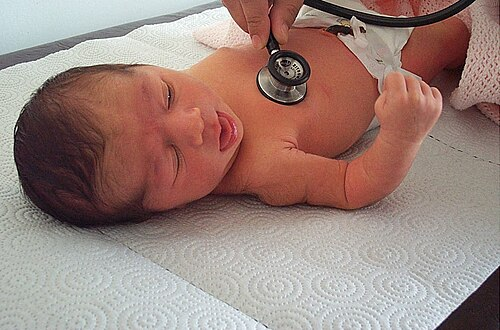
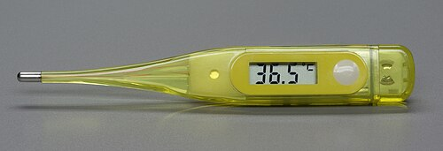

# FEBRE SEM FOCO DE 0 A 36 MESES

Febre sem foco, ou febre sem sinais localizatórios, é a febre em criança cuja história clínica e exame físico cuidadosos não identificam foco infeccioso evidente.

A definição de febre depende do método de aferição. Em recomendações recentes da SBP, considera-se febre temperatura axilar **≥ 37,5°C**. Já muitos protocolos de pronto-socorro e questões de prova usam **temperatura axilar ≥ 38°C** como ponto de corte operacional para investigação de febre sem foco. Na prática, a temperatura deve ser interpretada junto com idade, estado geral, vacinação, tempo de febre e sinais de gravidade.

O objetivo principal é identificar precocemente **infecção bacteriana grave**, especialmente sepse, meningite, infecção do trato urinário, pneumonia, artrite séptica e osteomielite.

*Figura 1 - Exame físico minucioso do recém-nascido, etapa crucial na avaliação de febre sem foco no lactente jovem. Fonte: Nevit Dilmen, CC BY-SA 3.0 | Wikimedia Commons*

## Avaliação inicial

A primeira pergunta não é “qual é a temperatura?”, mas sim: **a criança parece grave?**

Use o Triângulo de Avaliação Pediátrica:

- **Aparência:** tônus, interação, consolabilidade, olhar e choro.

- **Trabalho respiratório:** retrações, gemência, batimento de asa nasal, estridor.

- **Circulação cutânea:** palidez, cianose, pele moteada ou má perfusão.

Sinais de gravidade:

- aparência tóxica;

- letargia ou irritabilidade inconsolável;

- má perfusão, cianose ou sinais de choque;

- desconforto respiratório importante;

- alteração do nível de consciência;

- petéquias disseminadas ou púrpura;

- rigidez de nuca, fontanela abaulada ou sinais neurológicos.

Criança com sinais de gravidade deve ser conduzida como possível sepse, independentemente da idade:

- estabilização pelo ABCDE;

- acesso venoso ou intraósseo, se necessário;

- coleta de culturas quando possível, sem atrasar tratamento;

- antibioticoterapia empírica precoce;

- internação.

## Conduta por faixa etária

A idade é o principal determinante de risco. Quanto menor a criança, maior o risco de infecção bacteriana grave e menor a confiabilidade dos sinais clínicos.

## Recém-nascido: 0 a 28 dias

Todo recém-nascido com febre documentada ou relato confiável de febre deve ser considerado de alto risco.

Principais agentes:

- *Streptococcus agalactiae*;

- *Escherichia coli*;

- *Listeria monocytogenes*;

- outros Gram-negativos.

Conduta:

- internação;

- hemograma e marcadores inflamatórios, conforme disponibilidade;

- hemocultura;

- urina tipo 1 e urocultura por cateterismo vesical ou punção suprapúbica;

- punção lombar com análise e cultura do líquor;

- radiografia de tórax se houver sinais respiratórios;

- antibioticoterapia venosa empírica após culturas, sem atrasar em caso de instabilidade.

Esquemas usuais:

- **ampicilina + gentamicina**; ou

- **ampicilina + cefotaxima**, conforme protocolo local e suspeita clínica.

Evita-se ceftriaxona no período neonatal pelo risco de deslocamento da bilirrubina da albumina e complicações associadas ao uso em recém-nascidos.

## Lactente jovem: 29 a 90 dias

Nessa faixa, ainda há risco relevante de infecção bacteriana grave, mas alguns lactentes bem-aparentados podem ser manejados com observação rigorosa, desde que tenham baixo risco clínico, exames tranquilizadores e retorno garantido.

Critérios clínicos favoráveis:

- bom estado geral;

- nascido a termo;

- previamente hígido;

- sem doença crônica relevante;

- sem internação prolongada;

- sem antibioticoterapia recente;

- exame físico sem foco bacteriano evidente;

- cuidador confiável e possibilidade de reavaliação em 24 horas.

Exames geralmente considerados:

- hemograma;

- PCR e/ou procalcitonina, se disponíveis;

- hemocultura;

- urina tipo 1 e urocultura;

- líquor conforme idade, estado clínico, exames laboratoriais e protocolo local.

A **infecção do trato urinário é a principal infecção bacteriana nessa faixa**, por isso a investigação urinária é central.

Conduta prática:

| Situação | Conduta |
| --- | --- |
| Aparência tóxica ou instabilidade | Internação, investigação completa e antibioticoterapia venosa |
| Exames alterados ou sem garantia de retorno | Internação e antibioticoterapia conforme risco |
| Bom estado geral, baixo risco e exames tranquilizadores | Observação rigorosa, com retorno garantido em 24 horas |

A punção lombar é obrigatória se houver toxemia, instabilidade, sinais neurológicos, suspeita de meningite ou alteração laboratorial importante. Em lactentes bem-aparentados e de baixo risco, pode ser individualizada conforme idade e protocolo local.

## Criança de 3 a 36 meses

Nessa faixa, a maioria dos casos é viral. A vacinação contra *Haemophilus influenzae* tipo b e pneumococo reduziu muito a bacteremia oculta em crianças com esquema vacinal adequado.

A principal preocupação bacteriana passa a ser a **infecção do trato urinário**.

Investigue urina principalmente em:

- meninas menores de 24 meses;

- meninos menores de 6 meses;

- meninos não circuncidados menores de 12 meses;

- febre sem foco persistente por mais de 48 horas;

- febre alta sem explicação;

- história prévia de ITU ou malformação urinária;

- vômitos, dor abdominal, irritabilidade ou queda do estado geral sem foco claro.

Em criança de 3 a 36 meses, bem-aparentada, vacinada e sem sinais de gravidade, a conduta costuma ser observação clínica, sintomáticos e orientação de retorno.

Sinais que aumentam necessidade de investigação:

- temperatura elevada, especialmente ≥ 39°C;

- febre persistente por 48 a 72 horas;

- vacinação incompleta;

- queda do estado geral;

- petéquias ou púrpura;

- sinais respiratórios;

- dor abdominal;

- claudicação ou recusa de mobilizar membro;

- sinais urinários ou risco aumentado para ITU.

## Coleta de urina

Em crianças sem controle esfincteriano, a urocultura diagnóstica deve ser coletada por:

- cateterismo vesical; ou

- punção suprapúbica.

O saco coletor pode ser útil como triagem quando negativo, mas resultado positivo tem alta chance de contaminação. Não se deve iniciar antibiótico com base apenas em urocultura positiva de saco coletor sem confirmação por método adequado.

## Punção lombar

Indicações importantes:

- recém-nascido febril;

- aparência tóxica;

- instabilidade clínica;

- sinais neurológicos;

- suspeita de meningite;

- convulsão febril complexa;

- lactente pequeno com exame alterado, vacinação incompleta ou avaliação clínica pouco confiável.

Em lactentes, sinais clássicos de irritação meníngea podem estar ausentes. Meningite pode se manifestar apenas com irritabilidade, sonolência, recusa alimentar, gemência ou hipoatividade.

## Antitérmicos

O objetivo do antitérmico é aliviar desconforto, e não normalizar obrigatoriamente a temperatura.

| Medicamento | Dose habitual | Intervalo |
| --- | --- | --- |
| Paracetamol | 10 a 15 mg/kg/dose | 4 a 6 horas |
| Dipirona | 10 a 20 mg/kg/dose | 6 horas |
| Ibuprofeno | 5 a 10 mg/kg/dose | 6 a 8 horas |

Cuidados:

- evitar ibuprofeno em menores de 6 meses;

- evitar anti-inflamatórios em suspeita de dengue, desidratação, doença renal ou sangramento;

- não alternar antitérmicos rotineiramente, pois aumenta risco de erro de dose e toxicidade;

- antitérmicos não previnem convulsão febril.

*Figura 2 - Termômetro clínico digital, instrumento fundamental na avaliação de febre no lactente. Fonte: Berthold Werner, CC BY-SA 3.0 | Wikimedia Commons*

## Antibiótico empírico

A antibioticoterapia depende da idade, gravidade e suspeita clínica.

Condutas gerais:

- **0 a 28 dias:** internar, investigar e iniciar antibiótico venoso após culturas.

- **29 a 90 dias com alto risco:** internar, investigar e iniciar antibiótico venoso.

- **3 a 36 meses com aparência tóxica:** conduzir como sepse, internar e iniciar antibiótico venoso.

- **Suspeita de ITU em criança estável:** coletar urina adequadamente antes do antibiótico e tratar conforme idade, gravidade e possibilidade de via oral.

Em suspeita de meningite bacteriana, usar dose adequada para meningite conforme protocolo local.

## Convulsão febril

Ocorre tipicamente entre 6 meses e 5 anos, em criança neurologicamente normal, associada à febre e sem infecção do sistema nervoso central.

Convulsão febril simples:

- generalizada;

- duração menor que 15 minutos;

- não recorre em 24 horas;

- sem déficit neurológico focal.

Conduta: avaliar a causa da febre, orientar a família e não prescrever anticonvulsivante profilático de rotina.

Convulsão febril complexa:

- focal; ou

- duração maior que 15 minutos; ou

- recorrência em 24 horas; ou

- déficit neurológico pós-ictal.

Conduta: investigação individualizada, com maior atenção para meningite, distúrbios metabólicos e causas neurológicas.

## Diagnósticos que não podem passar despercebidos

- **Meningococcemia:** febre com petéquias ou púrpura, principalmente se disseminadas ou associadas a toxemia.

- **Dengue:** febre em área endêmica, mialgia, exantema, dor abdominal, vômitos, sangramentos ou sinais de alarme. Evitar AAS e anti-inflamatórios.

- **Pneumonia oculta:** considerar radiografia se febre alta, taquipneia, hipoxemia, ausculta alterada ou leucocitose importante.

- **Artrite séptica/osteomielite:** febre com claudicação, dor óssea, recusa de marcha ou pseudoparalisia.

- **Apendicite:** dor abdominal, vômitos, irritabilidade, defesa abdominal ou piora progressiva.

- **Doença de Kawasaki:** febre por 5 dias ou mais associada a conjuntivite não purulenta, alterações orais, exantema, adenopatia cervical ou alterações de extremidades.

## Situações especiais

**Febre após vacina:** pode ocorrer nas primeiras 24 a 48 horas, especialmente após vacinas inativadas. Se a criança estiver bem, pode ser observada. Persistência, toxemia ou sinais localizatórios exigem investigação.

**Hipertermia por excesso de roupa:** mais comum em recém-nascidos. Ao retirar excesso de agasalho e ajustar o ambiente, a temperatura deve normalizar. Se persistir, conduzir como febre verdadeira.

**Petéquias acima da linha dos mamilos:** podem ocorrer após tosse ou vômitos intensos. Petéquias generalizadas, púrpura ou alteração do estado geral sugerem doença invasiva e exigem avaliação imediata.

## Resumo prático por idade

| Idade | Principal preocupação | Conduta em bom estado geral |
| --- | --- | --- |
| 0 a 28 dias | Sepse e meningite | Internação, investigação completa e antibiótico venoso |
| 29 a 90 dias | ITU, bacteremia e meningite | Estratificar risco, colher urina/culturas e decidir internação conforme clínica e exames |
| 3 a 36 meses | ITU e, menos frequentemente, bacteremia oculta | Observar se vacinada e bem; investigar urina se risco ou febre persistente |

## Pontos-chave para prova

- Febre em criança deve ser interpretada conforme método de aferição, idade e contexto clínico.

- Temperatura axilar ≥ 37,5°C pode ser considerada febre em recomendações recentes da SBP.

- Muitos protocolos de febre sem foco usam axilar ≥ 38°C como ponto de corte operacional para investigação.

- Recém-nascido febril deve ser internado, investigado e tratado com antibiótico venoso.

- Ceftriaxona deve ser evitada no período neonatal.

- Em lactentes pequenos, meningite pode não ter rigidez de nuca.

- A ITU é a principal infecção bacteriana na febre sem foco após o período neonatal.

- Urocultura em lactente sem controle esfincteriano deve ser coletada por cateterismo ou punção suprapúbica.

- Criança toxemiada sempre segue via de sepse, independentemente da idade.

- Criança de 3 a 36 meses, bem, vacinada e sem sinais de gravidade pode ser observada com orientação de retorno.

- Antitérmico trata desconforto, não previne convulsão febril.

- Convulsão febril simples é benigna e não exige anticonvulsivante profilático.

- Febre com petéquias disseminadas ou púrpura é emergência até prova em contrário.

 Cópia offline para consulta pessoal.
 Fonte original:
 [https://www.medevo.com.br/material-apoio/ler/5b6bd892-8b97-4ed9-9a0a-03783bc2cc6c](https://www.medevo.com.br/material-apoio/ler/5b6bd892-8b97-4ed9-9a0a-03783bc2cc6c)
