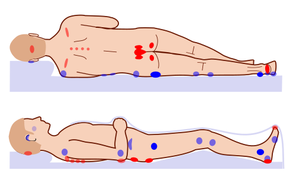

# FERIDAS COMPLEXAS E ÚLCERAS

Para começar nosso estudo, você precisa tirar da cabeça a ideia de que uma ferida complexa é apenas uma "ferida grande". Na prática cirúrgica e, principalmente, nas provas de residência, o conceito de **ferida complexa** envolve feridas que não cicatrizam espontaneamente no tempo esperado ou que apresentam exposição de estruturas nobres (osso, tendão, nervo, vasos ou próteses).

O grande desafio aqui não é apenas "fechar o buraco", mas entender por que ele não fecha e qual a melhor ferramenta da nossa caixa de ferramentas da Cirurgia Plástica para resolver o problema.

*Figura 1 - Diagrama das fases da cicatrização de feridas: inflamação, proliferação e remodelação. Fonte: Mikael Häggström, Domínio Público | Wikimedia Commons*

## A Escada Reconstrutiva: O Norte do Cirurgião

Antes de falarmos de doenças específicas, você precisa dominar a **Escada Reconstrutiva**. As bancas amam cobrar a sequência lógica de fechamento de feridas. O princípio básico é: use a técnica mais simples que resolva o problema com eficácia.

- **Fechamento por Segunda Intenção:** Deixamos a natureza agir (granulação e contração).

- **Sutura Primária (Primeira Intenção):** Aproximação direta das bordas.

- **Sutura Primária Retardada:** Esperamos alguns dias (limpeza da ferida) e depois fechamos.

- **Enxertos de Pele:** Transferência de tecido sem vascularização própria (depende do leito receptor).

- **Retalhos Locais:** Tecido com vascularização própria movido para uma área adjacente.

- **Retalhos à Distância/Livres:** Tecidos transferidos com anastomose microcirúrgica.

**Dica de Ouro do Dr. Will:** Se a ferida tem osso exposto **sem periósteo** ou tendão exposto **sem paratendão**, o enxerto NÃO vai "pegar". Por quê? Porque o enxerto é um "parasita" que precisa de um leito vascularizado para sobreviver (processo de embebição e inosculação). Nesses casos, você é obrigado a subir um degrau na escada e usar um **retalho muscular ou miocutâneo**.

## Lesões por Pressão (LPP)

Antigamente chamadas de úlceras de decúbito, o termo atual é Lesão por Pressão. A fisiopatologia é simples: pressão extrínseca > pressão de enchimento capilar (aprox. 32 mmHg) → isquemia tecidual → necrose.

### Estadiamento (Classificação NPUAP/EPUAP)

Este é o tópico mais cobrado em provas sobre este tema. Você precisa memorizar os estágios:

- **Estágio 1:** Pele íntegra com eritema que **não embranquece** à pressão. É o sinal de alerta.

- **Estágio 2:** Perda de espessura parcial da derme. Apresenta-se como uma úlcera rasa, leito rosado, sem esfacelo. Pode ser uma bolha íntegra ou rota.

- **Estágio 3:** Perda de espessura total. A gordura subcutânea pode estar visível, mas **osso, tendão e músculo NÃO estão expostos**. Pode haver esfacelo e descolamentos.

- **Estágio 4:** Perda total de tecido com **exposição de osso, tendão ou músculo**. Aqui o risco de osteomielite é altíssimo.

- **Não Estadiável:** A base da ferida está coberta por esfacelo (amarelo, verde, marrom) ou escara (preta). Você não consegue ver a profundidade real, por isso não pode estadiar até que seja desbridada.

- **Lesão por Pressão Tecidual Profunda:** Área localizada de cor púrpura ou castanha, pele íntegra ou bolha de sangue, devido a dano no tecido mole subjacente.

**Tabela 1: Resumo do Estadiamento de LPP**

| Estágio | Achado Clínico Principal | Estruturas Expostas |
| --- | --- | --- |
| **I** | Eritema que não embranquece | Nenhuma (pele íntegra) |
| **II** | Úlcera rasa ou bolha | Derme parcial |
| **III** | Gordura visível | Tecido subcutâneo |
| **IV** | Osso, tendão ou músculo visíveis | Estruturas profundas |
| **Não Estadiável** | Coberta por necrose/esfacelo | Indeterminada |

### Localizações Críticas e Conduta

A localização depende da posição do paciente.

- **Decúbito Dorsal:** Sacro (mais comum geral) e calcâneo.

- **Decúbito Lateral:** Trocânter maior (muito comum em provas).

- **Sentado (Cadeirantes):** Túber isquiático.

**Cenário Clínico:** Paciente cadeirante com úlcera isquiática profunda. Qual a conduta?
Primeiro, estabilização clínica e desbridamento de tecidos desvitalizados. Para o fechamento definitivo, geralmente usamos **retalhos musculares ou miocutâneos** (como o do músculo glúteo máximo ou isquiotibiais). O músculo oferece preenchimento para o "espaço morto" e uma nova almofada vascularizada para a proeminência óssea.

**Cuidado com a Pegadinha:** Se um paciente com LPP infectada apresenta febre e sinais de sepse, a conduta inicial é estabilização e desbridamento. Mas, se mesmo após o desbridamento o paciente continua séptico, a MedEvo ensina: investigue outros focos! É muito comum o aluno achar que a culpa é sempre da ferida, mas o paciente acamado faz muita ITU e pneumonia.

## Úlcera de Marjolin: A Malignização das Cicatrizes

Este nome cai com uma frequência impressionante. A Úlcera de Marjolin é a degeneração maligna de uma ferida crônica ou cicatriz instável.

- **Onde ocorre?** Cicatrizes de queimaduras antigas (mais comum), osteomielite crônica, fístulas crônicas ou úlceras por pressão de longa data.

- **Qual o tipo de câncer?** Na imensa maioria das vezes (cerca de 75-90%), é um **Carcinoma de Células Escamosas (CEC)**, também chamado de carcinoma espinocelular.

- **Quando suspeitar?** Uma cicatriz de queimadura de 20 anos atrás que começou a ulcerar, sangrar, ter odor fétido ou crescer vegetantemente.

- **Conduta:** Biópsia incisional das bordas e do centro da lesão.

**Dica de Prova:** A alternativa vai tentar te convencer que é um Carcinoma Basocelular (CBC) por ser pele. Não caia nessa! Em feridas crônicas e cicatrizes, o rei é o **CEC**.

*Figura 2 - Pontos de pressão corporal em decúbito dorsal (vermelho) e lateral (azul), áreas de risco para formação de úlceras. Fonte: Jmarchn, CC BY-SA 3.0 | Wikimedia Commons*

## Terapia por Pressão Negativa (TPN) - O "Vácuo"

A TPN revolucionou o tratamento de feridas complexas. Ela funciona aplicando uma pressão subatmosférica (geralmente entre -75 a -125 mmHg) através de uma esponja de poliuretano selada.

**Por que funciona?**

- **Macrodeformação:** Aproxima as bordas da ferida (contração).

- **Microdeformação:** Estira as células, estimulando a mitose e formação de tecido de granulação.

- **Remoção de Exsudato:** Reduz o edema local e a carga bacteriana.

**Contraindicações (Obrigatório decorar para a prova):**

- **Absolutas:** Tecido necrótico/escara não desbridada (o vácuo não desbrida!), malignidade no leito da ferida (pode estimular o crescimento tumoral), osteomielite não tratada e vasos sanguíneos ou órgãos expostos (risco de hemorragia grave).

- **Fístulas entéricas não exploradas:** Se for uma fístula de alto débito, o vácuo vai apenas "sugar" todo o conteúdo intestinal, piorando o distúrbio hidroeletrolítico.

**Tabela 2: Terapia por Pressão Negativa (TPN)**

| Indicações | Contraindicações Absolutas |
| --- | --- |
| Feridas agudas e traumáticas | Malignidade no leito da ferida |
| Deiscências cirúrgicas | Vasos ou órgãos expostos |
| Mediastinite pós-esternotomia | Osteomielite não tratada |
| Preparo de leito para enxerto | Tecido necrótico/escara presente |
| Úlceras diabéticas e por pressão | Fístulas entéricas não exploradas |

## Oxigenoterapia Hiperbárica (OHB)

A OHB consiste na inalação de oxigênio a 100% em uma câmara pressurizada a um nível superior à pressão atmosférica (geralmente 2 a 3 ATA).

**Mecanismo:** Aumenta a quantidade de oxigênio dissolvido no plasma (Lei de Henry). Isso ajuda a combater bactérias anaeróbias, reduz o edema por vasoconstrição reflexa e estimula a angiogênese e a atividade fibroblástica em tecidos isquêmicos.

**Indicações clássicas:** Pé diabético infectado, osteomielite refratária, lesões por radiação (radiodermite/cistite actínica), gangrena gasosa e síndrome de Fournier.

**Complicações e Contraindicações:**

- **Complicação mais comum:** Barotrauma do ouvido médio (devido à dificuldade de equalizar a pressão na tuba auditiva).

- **Contraindicação Absoluta:** Pneumotórax não tratado (a mudança de pressão pode transformar um pneumotórax simples em hipertensivo).

- **Drogas Proibidas:** Pacientes em uso de **Bleomicina** (risco de fibrose pulmonar grave), Doxorrubicina, Dissulfiram ou Cisplatina.

## Reconstrução de Membros Inferiores

Aqui a anatomia manda na conduta. Dividimos a perna em terços para decidir o retalho:

- **Terço Superior:** Geralmente usamos o retalho do músculo **Gastrocnêmio** (cabeça medial ou lateral).

- **Terço Médio:** O músculo de escolha é o **Sóleo**.

- **Terço Inferior:** Esta é a zona crítica. Há pouco tecido muscular disponível. Frequentemente exige **retalhos microcirúrgicos** (livres) ou retalhos fasciocutâneos de fluxo retrógrado (como o sural).

**Pé Diabético:** Se o paciente chega com um flegmão (infecção profunda) e sinais de toxicidade, mas tem pulsos palpáveis, a prioridade é o **desbridamento cirúrgico urgente**. Não perca tempo com exames de imagem sofisticados se há pus sob pressão. O controle do foco infeccioso é o primeiro passo para salvar o membro.

## Mediastinite Pós-Esternotomia

Uma complicação temida da cirurgia cardíaca. O paciente apresenta dor retroesternal, febre e instabilidade do esterno após a cirurgia.

- **Tratamento:** Desbridamento, lavagem exaustiva e, para cobertura, o padrão-ouro é o uso de **retalhos de músculo Peitoral Maior** ou, em casos mais complexos, o retalho de **Omento** (levado do abdome para o tórax). O vácuo (TPN) também é uma excelente ponte para o tratamento definitivo aqui.

## Dermatoses Vulvares e Prurido

Um tema que aparece misturado com cirurgia plástica e ginecologia é o **Líquen Simples Crônico**.

- **Quadro:** Prurido vulvar crônico intenso que leva ao ciclo "coceira-trauma-coceira".

- **Exame físico:** **Liquenificação** (espessamento da pele com acentuação dos sulcos), escoriações e hiperpigmentação.

- **Diagnóstico Diferencial:** Líquen Escleroso (que causa atrofia e "pele em papel de cigarro"). No Líquen Simples Crônico, a pele está MAIS GROSSA, não mais fina.

## Diagnóstico Diferencial de Úlceras de Membros Inferiores

Nem toda úlcera na perna é cirúrgica de imediato. Você precisa diferenciar a etiologia para não errar o tratamento.

**Tabela 3: Diferencial de Úlceras Vasculares**

| Característica | Úlcera Venosa | Úlcera Arterial |
| --- | --- | --- |
| **Localização** | Maléolo medial | Pontas dos dedos, maléolo lateral |
| **Dor** | Leve a moderada, melhora com elevação | Intensa, piora com elevação |
| **Pulsos** | Presentes | Diminuídos ou ausentes |
| **Aspecto** | Bordas irregulares, fundo granulado | Bordas "em saca-bocado", pálida |
| **Tratamento Base** | Compressão elástica (Bota de Unna) | Revascularização |

**Atenção:** A compressão terapêutica é o padrão-ouro para úlceras venosas, mas é **contraindicada** se o paciente tiver doença arterial obstrutiva periférica (DAOP) grave associada (Índice Tornozelo-Braquial < 0.5).

## Pontos-Chave para Prova

- **Úlcera de Marjolin:** É um Carcinoma de Células Escamosas (CEC) que surge em cicatrizes crônicas (queimaduras, osteomielite). Biópsia é obrigatória.

- **LPP Estágio IV:** Exposição de osso, tendão ou músculo. Risco iminente de osteomielite.

- **LPP Estágio III:** Vai até o subcutâneo (gordura), mas não expõe estruturas nobres.

- **Exposição Óssea sem Periósteo:** Exige retalho (preferencialmente muscular), pois o enxerto não sobrevive sobre osso cortical "nu".

- **TPN Contraindicação:** Malignidade, vasos expostos, osteomielite não tratada e necrose não desbridada.

- **TPN e Fístula:** Contraindicação absoluta em fístulas entéricas de alto débito não exploradas.

- **OHB Complicação:** Barotrauma de ouvido médio é a mais comum.

- **OHB Contraindicação Absoluta:** Pneumotórax não tratado.

- **OHB e Drogas:** Proibido usar com Bleomicina (toxicidade pulmonar).

- **Pé Diabético Infectado:** Desbridamento cirúrgico urgente é a prioridade para controle de foco.

- **Retalho para Terço Médio da Perna:** Músculo Sóleo.

- **Retalho para Terço Superior da Perna:** Músculo Gastrocnêmio.

- **Líquen Simples Crônico:** Prurido + Liquenificação (pele grossa). Diferente do Líquen Escleroso (pele fina/atrófica).

- **Escada Reconstrutiva:** Sempre do mais simples para o mais complexo, a menos que a ferida exija (ex: osso exposto já pula para retalho).

- **Decúbito Lateral:** O local mais comum de LPP é o trocânter maior.

- **Cadeirante:** O local mais comum de LPP é a tuberosidade isquiática.

- **Sepse em LPP:** Se o desbridamento não resolveu a febre, procure outro foco (ITU/Pneumonia).

Este material resume os pontos de maior incidência e as pegadinhas que as bancas costumam utilizar. Ao ler uma questão sobre feridas, identifique primeiro se há exposição de estruturas nobres e se há sinais de malignização. Isso definirá 90% das suas condutas.

 Cópia offline para consulta pessoal.
 Fonte original:
 [https://www.medevo.com.br/material-apoio/ler/91a15273-a788-45c3-a6c0-b7d282ef0266](https://www.medevo.com.br/material-apoio/ler/91a15273-a788-45c3-a6c0-b7d282ef0266)
