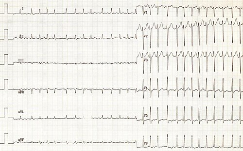
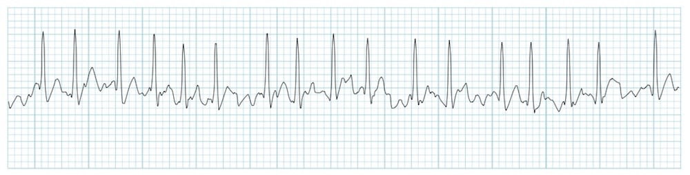

# FIBRILAÇÃO ATRIAL: ESTRATIFICAÇÃO E ANTICOAGULAÇÃO

A fibrilação atrial (FA) é a arritmia sustentada mais comum da prática clínica e representa importante causa de morbimortalidade por fenômenos tromboembólicos, especialmente acidente vascular cerebral isquêmico. A palpitação pode motivar a consulta, mas a prevenção de embolia sistêmica é um dos objetivos centrais do manejo.

A abordagem prática deve priorizar diagnóstico eletrocardiográfico, classificação clínica, avaliação de instabilidade, estratificação tromboembólica e escolha segura da estratégia anticoagulante.

> **Referência principal:** Este material foi atualizado com base na **Diretriz Brasileira de Fibrilação Atrial – 2025** (SBC/SOBRAC), publicada nos Arq Bras Cardiol. 2025;122(9):e20250618.

## Definição e Critérios Diagnósticos

A FA é uma taquiarritmia supraventricular caracterizada por ativação atrial desorganizada, com perda da contração atrial efetiva. No eletrocardiograma (ECG), devem ser observadas três características fundamentais:

- Intervalos R-R irregularmente irregulares (salvo se houver bloqueio atrioventricular total).

- Ausência de ondas P distintas.

- Presença de ondas "f" (fibrilatórias) com frequências entre 300 e 600 bpm.

*Figura 2 - ECG esquemático de fibrilação atrial, com intervalos R-R irregularmente irregulares e ausência de ondas P definidas.*

**Cuidado com o tempo:** Para fins de diagnóstico clínico e inclusão em diretrizes, um episódio de FA deve durar pelo menos 30 segundos no traçado eletrocardiográfico (seja no ECG de repouso ou no Holter). Menos que isso, muitas vezes classificamos como "salvas" ou episódios curtos que ainda não preenchem critérios para a conduta de anticoagulação plena.

## Epidemiologia e Fisiopatologia do Risco

A prevalência da FA aumenta exponencialmente com a idade. Embora a incidência seja maior em homens, o risco ao longo da vida é praticamente igual entre os sexos. Por quê? Porque as mulheres vivem mais, e a longevidade é o principal fator de risco para o remodelamento atrial.

## O Mecanismo da Trombogênese

Por que a FA causa AVC? Lembre-se da Tríade de Virchow:

- **Estase Sanguínea:** O átrio não contrai, ele "treme". O sangue fica parado, especialmente no apêndice atrial esquerdo (AAE).

- **Lesão Endotelial:** A própria arritmia e as comorbidades (HAS, DM) geram inflamação e lesão no endocárdio atrial.

- **Hipercoagulabilidade:** Há uma ativação sistêmica da cascata de coagulação.

O cérebro é o órgão mais afetado pelos êmbolos originados no átrio esquerdo. Um erro clássico de prova é achar que a FA causa mais embolia periférica para membros; na verdade, o AVC cardioembólico é a complicação mais temida e frequente.

## Classificação Clínica da FA (Diretriz Brasileira 2025)

A classificação foi atualizada pela SBC 2025 e divide a FA em dois eixos: por apresentação e por duração.

### Quanto à Apresentação

| Tipo | Definição |
| --- | --- |
| **FA Clínica** | FA sintomática ou assintomática, registrada em ECG de 12 derivações ou ECG de ritmo com derivação única ≥ 30 segundos. |
| **FA Subclínica** | Indivíduos assintomáticos com detecção de ritmo atrial acelerado (frequência ≥ 175 bpm) em dispositivo cardíaco eletrônico implantável (DCEI). |

### Quanto à Duração

| Classificação | Definição |
| --- | --- |
| **Paroxística** | FA com menos de 7 dias de duração (independentemente da forma de reversão). |
| **Persistente** | FA com mais de 7 dias e menos de 1 ano de duração. |
| **Persistente de Longa Duração** | FA com mais de 1 ano de duração. |
| **Permanente** | FA na qual o médico e o paciente chegaram à decisão de não tentar reestabelecer o ritmo sinusal. |
| **FA Pós-ablação** | Paciente submetido à ablação por cateter ou cirúrgica que evolui sem recorrência da arritmia. |

> **Termos abandonados pela SBC 2025:** Os termos **"FA isolada/solitária"**, **"FA valvar e não valvar"** e **"FA crônica"** estão em desuso. A recomendação atual é especificar diretamente a condição do paciente (ex: FA com estenose mitral moderada a grave, FA com prótese mecânica).

> **Dica de Prova:** A FA paroxística tem o MESMO risco embólico que a FA permanente. Não caia na pegadinha de achar que, por ser "só de vez em quando", o paciente não precisa de anticoagulante. Se o CHA₂DS₂-VA for ≥ 2, a anticoagulação é perene.

## Estratificação de Risco Tromboembólico e Anticoagulação — Diretriz Brasileira 2025

A diretriz de 2025 adota o **CHA₂DS₂-VA**, anteriormente denominado CHA₂DS₂-VASc. A principal mudança é a **retirada do sexo feminino** como ponto isolado, por ser considerado modificador de risco e não fator independente suficiente para indicar anticoagulação. A pontuação máxima passa a ser **8 pontos**.

### Componentes do CHA₂DS₂-VA

| Sigla | Componente | Pontos |
| --- | --- | --- |
| **C** | Insuficiência cardíaca congestiva ou disfunção ventricular esquerda | 1 |
| **H** | Hipertensão arterial | 1 |
| **A₂** | Idade ≥ 75 anos | **2** |
| **D** | Diabetes mellitus | 1 |
| **S₂** | AVC, AIT ou embolia sistêmica prévios | **2** |
| **V** | Doença vascular (IAM prévio, doença arterial periférica ou placa aórtica) | 1 |
| **A** | Idade 65–74 anos | 1 |

### Quando Anticoagular?

| CHA2DS2-VA | Conduta recomendada |
| --- | --- |
| 0 | Baixo risco. Não há indicação de terapia antitrombótica. |
| 1 | Anticoagulação pode ser instituída após decisão individualizada, considerando benefício clínico, risco de sangramento, forma/carga da FA e preferência do paciente. |
| ≥ 2 | Anticoagulação oral recomendada. |

A anticoagulação oral é recomendada independentemente do escore em algumas condições de risco particularmente elevado, como miocardiopatia hipertrófica, amiloidose cardíaca e hipertireoidismo associado à FA, conforme avaliação clínica.

### Escolha do Anticoagulante

Na **FA não valvar**, os **ACOD** são preferíveis aos antagonistas da vitamina K, pela redução de AVC/embolia sistêmica, sangramento intracraniano e mortalidade em comparação à varfarina nos grandes estudos e metanálises. A varfarina permanece indicada em **prótese valvar mecânica** e **estenose mitral moderada a grave**, especialmente reumática.

| Anticoagulante | Dose padrão | Ajuste principal descrito na diretriz |
| --- | --- | --- |
| Dabigatrana | 150 mg 2x/dia | 110 mg 2x/dia em idade ≥ 80 anos, uso de verapamil ou risco aumentado de sangramento |
| Rivaroxabana | 20 mg 1x/dia | 15 mg 1x/dia se ClCr 15–49 mL/min |
| Apixabana | 5 mg 2x/dia | 2,5 mg 2x/dia se pelo menos 2 critérios: idade ≥ 80 anos, peso ≤ 60 kg, creatinina ≥ 1,5 mg/dL |
| Edoxabana | 60 mg 1x/dia | 30 mg 1x/dia se TFG 15–50 mL/min, peso ≤ 60 kg ou uso de dronedarona/ciclosporina/eritromicina/cetoconazol |

A escolha deve considerar função renal, idade, fragilidade, risco de sangramento gastrointestinal, interações medicamentosas, adesão, posologia e custo. A função renal deve ser monitorada periodicamente; quanto menor o clearance de creatinina, maior a frequência de reavaliação.

### HAS-BLED e Risco de Sangramento

O HAS-BLED auxilia a identificar fatores modificáveis de sangramento. Pontuação ≥ 3 indica alto risco, mas **não contraindica anticoagulação**. Deve motivar correção de fatores modificáveis: pressão sistólica > 160 mmHg, uso de AINEs/antiagregantes sem indicação, álcool excessivo, INR lábil, anemia, disfunção renal/hepática e dose inadequada de ACOD.

### Antiagregantes Plaquetários

AAS ou dupla antiagregação **não devem ser usados isoladamente** para prevenir tromboembolismo na FA. Quando houver doença coronariana ou intervenção percutânea recente, a associação entre anticoagulante e antiagregante deve ser individualizada e pelo menor tempo possível, preferindo clopidogrel quando necessário.

## Manejo da FA na Emergência

A primeira pergunta é sempre hemodinâmica. Instabilidade atribuível à FA exige cardioversão elétrica sincronizada imediata, sem aguardar exames extensos.

### Instabilidade Hemodinâmica

Critérios práticos: hipotensão, choque, dor torácica isquêmica, edema agudo de pulmão, rebaixamento do nível de consciência ou sinais de hipoperfusão. A conduta é **cardioversão elétrica sincronizada imediata**. A diretriz recomenda introduzir anticoagulação o mais rápido possível, considerando risco tromboembólico e contraindicações.

### Paciente Estável: Regra das 24 Horas para Cardioversão

A diretriz brasileira de 2025 usa **24 horas** como ponto de corte prático para decisão pré-cardioversão.

| Cenário | Conduta |
| --- | --- |
| FA < 24 horas e baixo risco | Cardioversão pode ser realizada após anticoagulação periprocedimento com ACOD, heparina EV ou enoxaparina, conforme contexto. |
| FA 12–24 horas com risco elevado | Tratar como duração > 24 horas quando houver alto risco embólico, valvopatia relevante, evento embólico prévio ou CHA2DS2-VA elevado. |
| FA ≥ 24 horas ou tempo desconhecido | Anticoagular por 3 semanas antes da cardioversão ou realizar ecocardiograma transesofágico para excluir trombo. |
| Trombo em átrio/apêndice atrial esquerdo | Anticoagulação por pelo menos 3 semanas antes de nova tentativa de cardioversão. |
| Pós-cardioversão | Anticoagulação por pelo menos 4 semanas em todos os pacientes; manutenção indefinida se CHA2DS2-VA ≥ 2. |

Se varfarina for usada antes da cardioversão, as 3 semanas contam a partir do primeiro INR terapêutico. Com ACOD, é essencial confirmar adesão; se houver dúvida, considerar ecocardiograma transesofágico.

### Controle Agudo da Frequência

Em paciente estável com resposta ventricular elevada, controlar a frequência e investigar gatilhos: infecção, anemia, sangramento, dor, desidratação, hipertireoidismo, broncoespasmo, álcool e uso de estimulantes.

| Situação | Opções |
| --- | --- |
| Função sistólica preservada | Betabloqueador ou bloqueador de canal de cálcio não diidropiridínico, quando disponível e sem contraindicação |
| FEVE < 40% ou insuficiência cardíaca descompensada | Evitar verapamil/diltiazem; considerar betabloqueador com cautela, digoxina e, em situações selecionadas, amiodarona |
| Controle insuficiente | Associar digoxina; amiodarona EV é alternativa posterior em casos selecionados |
| Adjuvante | Sulfato de magnésio EV pode auxiliar no controle agudo da resposta ventricular |

## Controle de Frequência vs. Controle de Ritmo

A diretriz de 2025 valoriza o **controle precoce do ritmo**. Estudos como EAST-AFNET 4 e metanálises recentes sugerem redução de mortalidade, AVC isquêmico e hospitalização por insuficiência cardíaca quando a estratégia de ritmo é adotada precocemente em pacientes apropriados. Isso não elimina o controle de frequência, mas muda a lógica: não manter FA apenas por conveniência quando há boa chance de ritmo sinusal e benefício clínico.

### Controle de Frequência

O controle de frequência é aceitável em pacientes assintomáticos, muito idosos, com baixa probabilidade de manutenção do ritmo sinusal ou quando a estratégia de ritmo não é desejada/viável. O alvo clássico é FC de repouso < 80 bpm; controle mais leniente, com FC < 110 bpm, pode ser aceito em pacientes assintomáticos e sem deterioração ventricular.

| Classe | Uso prático | Cuidados |
| --- | --- | --- |
| Betabloqueadores | Primeira escolha frequente; úteis em DAC, pós-IAM e IC compensada | Bradicardia, broncoespasmo, fadiga; escolher agentes adequados na ICFEr |
| Verapamil/diltiazem | Opção se FEVE preservada, especialmente quando betabloqueador não é tolerado | Contraindicados se FEVE < 40% ou IC descompensada |
| Digoxina | Adjuvante, especialmente em IC e repouso | Menos eficaz no esforço; atenção à função renal e toxicidade |
| Amiodarona | Reserva para situações selecionadas | Toxicidade tireoidiana, pulmonar, hepática e interações |

### Controle de Ritmo

O controle de ritmo é preferencial quando há sintomas, FA recente, idade menor, átrio pouco dilatado, taquicardiomiopatia, insuficiência cardíaca, alto risco tromboembólico, dificuldade de controlar frequência ou preferência informada do paciente.

| Fármaco | Papel | Contraindicações/cuidados |
| --- | --- | --- |
| Propafenona | Reversão/manutenção em coração estruturalmente normal; pode ser usada em estratégia “pill-in-the-pocket” após teste supervisionado | Evitar em DAC, cardiopatia estrutural, disfunção ventricular ou hipertrofia importante; usar bloqueador nodal antes para evitar flutter 1:1 |
| Amiodarona | Mais eficaz; útil em cardiopatia estrutural e ICFEr | Evitar uso crônico desnecessário; monitorar tireoide, fígado, pulmão, olhos e interações |
| Sotalol | Manutenção em casos selecionados | Monitorar QT, potássio e função renal; evitar em ICFEr e ClCr reduzido relevante |

A anticoagulação é definida pelo risco tromboembólico, não pelo sucesso aparente do controle de ritmo. Paciente de alto risco mantém anticoagulação mesmo em ritmo sinusal ou após ablação, salvo decisão especializada muito bem fundamentada.

## Ablação por Cateter na FA — Diretriz Brasileira 2025

A ablação por cateter, baseada principalmente no isolamento das veias pulmonares, tem maior eficácia que antiarrítmicos para manutenção do ritmo sinusal em pacientes selecionados. A decisão deve incluir sintomas, tipo de FA, tamanho do átrio esquerdo, comorbidades, experiência do centro e preferência do paciente.

### Indicações Principais

| Cenário | Recomendação prática |
| --- | --- |
| FA paroxística ou persistente sintomática, refratária/intolerante a antiarrítmico classe I ou III | Ablação recomendada |
| FA sintomática refratária/intolerante a betabloqueador | Ablação pode ser considerada |
| FA paroxística sintomática como primeira linha por preferência do paciente | Deve ser considerada |
| FA persistente sintomática como primeira linha por preferência do paciente | Pode ser considerada |
| Suspeita de taquicardiomiopatia em ICFEr | Ablação recomendada como primeira linha, independentemente de sintomas |
| ICFEr selecionada | Ablação deve ser considerada para reduzir hospitalização por IC e possivelmente mortalidade |
| Pausas prolongadas após término de FA paroxística | Pode evitar implante de marca-passo em casos selecionados |

### Anticoagulação no Periprocedimento

Em pacientes com fatores de risco tromboembólicos, iniciar anticoagulação pelo menos 3 semanas antes da ablação ou excluir trombo por ecocardiograma transesofágico/angiotomografia. Em quem já usa AVK ou ACOD, a diretriz recomenda **não suspender** a anticoagulação oral antes da ablação. Após o procedimento, manter anticoagulação por pelo menos 2 meses em todos; depois, a continuidade depende do risco tromboembólico, não apenas da ausência de recorrência.

### Segurança e Limitações

A ablação é mais efetiva na FA paroxística do que na persistente de longa duração. Recorrências tardias podem ocorrer e alguns pacientes necessitam nova sessão. Complicações relevantes são incomuns em centros experientes, mas incluem tamponamento, AVC, complicações vasculares, estenose de veias pulmonares, lesão esofágica e fístula atrioesofágica rara e grave.

## FA Subclínica — Diretriz Brasileira 2025

FA subclínica corresponde a episódios assintomáticos, geralmente detectados por dispositivos cardíacos eletrônicos implantáveis, monitores implantáveis ou vestíveis. Em dispositivos implantáveis, costuma-se considerar ritmo atrial acelerado com frequência ≥ 175 bpm e duração suficiente para reduzir artefatos; o contexto clínico e a validação do traçado são fundamentais.

O risco de AVC na FA subclínica parece menor que na FA clínica, e o benefício da anticoagulação não é uniforme. Estudos recentes trouxeram resultados complementares: NOAH-AFNET 6 não demonstrou benefício claro com edoxabana e mostrou aumento de sangramento; ARTESiA demonstrou redução de AVC/embolia sistêmica com apixabana em comparação à aspirina, com aumento de sangramento maior, em geral manejável clinicamente.

**Conduta prática:** anticoagulação com apixabana ou edoxabana **pode ser considerada** em FA subclínica após decisão compartilhada, ponderando duração/carga dos episódios, CHA2DS2-VA, risco hemorrágico, preferência do paciente e possibilidade de progressão para FA clínica. Se a anticoagulação não for iniciada, é recomendável monitorização cuidadosa, pois parte dos pacientes progride para episódios > 24 horas ou FA clínica.

## Situações Especiais

### Síndrome do Coração Pós-Feriado

Episódios de FA podem ocorrer após ingesta alcoólica excessiva, privação de sono e estresse adrenérgico. A reversão espontânea é comum, mas a avaliação de risco tromboembólico e a orientação para redução de álcool continuam necessárias.

### FA Valvar

A distinção prática mais importante é terapêutica: **varfarina** é o anticoagulante indicado em estenose mitral moderada a grave, sobretudo reumática, e em próteses mecânicas. ACOD podem ser usados em muitas outras valvopatias, como regurgitação mitral, doença aórtica degenerativa, bioprótese e pós-TAVI quando houver indicação individualizada.

### Doença Renal Crônica

A função renal deve ser calculada antes da prescrição e reavaliada periodicamente. Em doença renal avançada não dialítica, a apixabana tem perfil favorável em dados disponíveis, mas a decisão deve ser individualizada. Em diálise ou ClCr < 15 mL/min, o benefício líquido da anticoagulação é incerto e requer avaliação especializada.

### Sangramento e Antídotos dos ACOD

Sangramento leve geralmente exige suspensão temporária e medidas locais. Sangramento grave requer identificar sítio, horário da última dose, função renal, hemoglobina, plaquetas e necessidade de reversão. Idarucizumabe reverte dabigatrana; andexanet alfa reverte inibidores do fator Xa quando disponível. Concentrado de complexo protrombínico pode ser considerado quando não houver resposta ou disponibilidade de antídoto específico.

## Tabelas Comparativas para Revisão Rápida

### Escolha do Anticoagulante

| Cenário | Preferência |
| --- | --- |
| FA não valvar com indicação de anticoagulação | ACOD preferencialmente |
| Estenose mitral moderada/grave reumática | Varfarina, INR-alvo 2,0–3,0 |
| Prótese valvar mecânica | Varfarina |
| Alto risco de sangramento gastrointestinal | Considerar apixabana |
| Disfunção renal não dialítica | Individualizar; apixabana frequentemente favorecida |
| Bioprótese mitral com FA | Rivaroxabana é alternativa com evidência brasileira (RIVER) |
| Síndrome coronariana crônica sem ICP recente | Anticoagulante isolado em geral é suficiente |

### Cardioversão: Regra Prática 2025

| Duração/risco | Pré-cardioversão | Pós-cardioversão |
| --- | --- | --- |
| < 24 h e baixo risco | Anticoagulação periprocedimento | 4 semanas para todos; depois conforme CHA2DS2-VA |
| ≥ 24 h ou desconhecida | 3 semanas de anticoagulação ou ETE sem trombo | 4 semanas para todos; indefinida se CHA2DS2-VA ≥ 2 |
| Trombo em ETE | Anticoagular pelo menos 3 semanas antes | Reavaliar estratégia; manter conforme risco |
| Instabilidade hemodinâmica | Cardioversão imediata | Anticoagular assim que possível |

### Controle de Frequência na Emergência

| Perfil | Opção inicial | Evitar/atenção |
| --- | --- | --- |
| FEVE preservada | Betabloqueador ou verapamil/diltiazem | Hipotensão e bradicardia |
| FEVE reduzida/IC descompensada | Betabloqueador com cautela, digoxina, amiodarona selecionada | Verapamil/diltiazem |
| Broncoespasmo importante | Verapamil/diltiazem se FEVE preservada | Betabloqueador não seletivo |
| DRC avançada | Ajustar doses; cuidado com digoxina e ACOD | Toxicidade e sangramento |

### Cardioversão Química

| Droga | Uso | Cuidados |
| --- | --- | --- |
| Propafenona | FA recente em coração estruturalmente normal; “pill-in-the-pocket” após teste supervisionado | Evitar em DAC, IC, hipertrofia importante; usar bloqueador nodal antes |
| Amiodarona | Opção se cardiopatia estrutural ou ICFEr | Toxicidade e reversão aguda menos rápida que cardioversão elétrica |
| Sotalol | Manutenção, não reversão aguda | QT, função renal, ICFEr |

## Pontos-Chave para Prova

- **Diagnóstico:** ECG com R-R irregular e ausência de onda P por pelo menos 30 segundos.

- **CHA₂DS₂-VA (SBC 2025):** Escore sem o componente sexo. Pontuação máxima de 8. Idade ≥ 75 e AVC prévio valem **2 pontos**. Os demais valem 1.

- **Indicação de Anticoagulação (SBC 2025):** CHA₂DS₂-VA ≥ 2 (Classe I, A). CHA₂DS₂-VA = 1 (Classe IIa, B — considerar). CHA₂DS₂-VA = 0 (não anticoagular).

- **Condições valvares:** Estenose Mitral Mod/Grave ou Prótese Mecânica → **SÓ Varfarina**. Prótese biológica → ACOD é opção.

- **ACOD vs. Varfarina:** ACOD são preferíveis em pacientes elegíveis (Classe I, A — SBC 2025).

- **HAS-BLED:** Não contraindica anticoagulação. Serve para tratar o que está fazendo o paciente sangrar.

- **Regra das 24 horas (SBC 2025):** FA ≥ 24h ou tempo desconhecido exige 3 semanas de anticoagulação antes da cardioversão OU ETE para excluir trombo.

- **Pós-Cardioversão:** SEMPRE anticoagular por pelo menos 4 semanas, independente do CHA₂DS₂-VA.

- **Instabilidade:** Hipotensão, dor torácica, EAP ou síncope = CVE Sincronizada imediata (200 J bifásico).

- **Controle de Frequência:** Alvo de FC < 110 bpm é aceitável se assintomático e com função ventricular preservada.

- **Antiplaquetários na FA:** Classe III (NÃO indicados). AAS não substitui anticoagulação.

- **Ablação como 1ª linha (SBC 2025):** FA paroxística sintomática por escolha do paciente (Classe I, B). FA com ICFEr/taquicardiomiopatia (Classe I, B).

- **FA subclínica:** Anticoagulação com edoxabana ou apixabana pode ser considerada (IIa, B).

- **Contraindicação dos ACOD:** Prótese valvar mecânica e estenose mitral moderada a grave.

- **Inibidor da Trombina:** Apenas a Dabigatrana. Os outros ("Xabanas") são inibidores do fator Xa.

- **Antídoto da Dabigatrana:** Idarucizumabe.

- **Antídoto dos inibidores do Xa:** Andexanete alfa.

- **RNI Alvo:** 2,0 a 3,0 para a imensa maioria dos pacientes em uso de Varfarina (>70% do tempo em faixa).

Na revisão do tema, o ponto central é que risco hemorrágico elevado exige mitigação de fatores modificáveis e acompanhamento próximo, mas não deve ser usado isoladamente para negar anticoagulação quando o risco tromboembólico é alto. A decisão deve ser individualizada, documentada e compartilhada.

 Cópia offline para consulta pessoal.
 Fonte original:
 [https://www.medevo.com.br/material-apoio/ler/69668d15-2c91-4ebe-b8f3-4d439819cdc8](https://www.medevo.com.br/material-apoio/ler/69668d15-2c91-4ebe-b8f3-4d439819cdc8)
