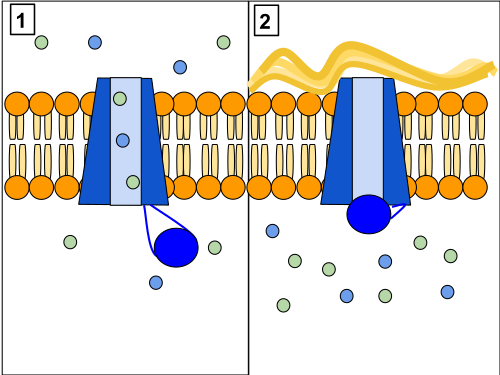
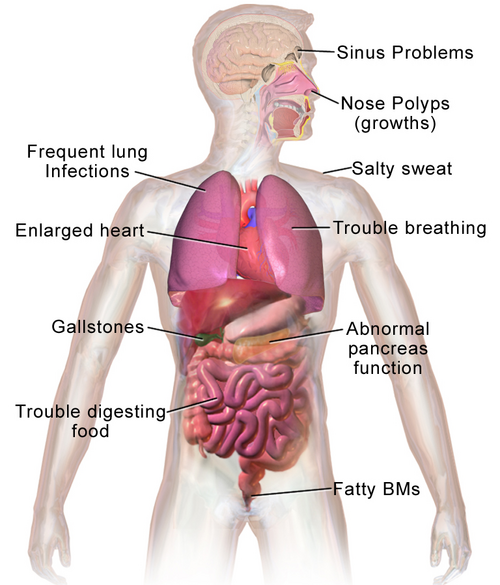

# FIBROSE CÍSTICA

A Fibrose Cística (FC), ou mucoviscidose, é aquela doença que você, como futuro residente, não pode apenas "conhecer". Você precisa dominar a sua lógica. Por que? Porque ela é a doença genética autossômica recessiva letal mais comum em populações brancas e, nas provas, ela é o protótipo da doença multissistêmica.

Se você entender que o problema central é um "defeito no cano" que transporta cloro, todo o resto, da esteatorreia à bronquiectasia, fará sentido. Vamos construir esse raciocínio juntos.

*Figura 1 - Proteína CFTR: painel 1 mostra o canal funcionante com fluxo normal de íons cloro; painel 2 mostra o canal defeituoso com acúmulo de muco. Fonte: Lbudd14, CC BY-SA 3.0 | Wikimedia Commons*

## A Fisiopatologia: O Problema é o Canal

Para entender a Fibrose Cística, você deve focar no gene CFTR (Cystic Fibrosis Transmembrane Conductance Regulator), localizado no braço longo do cromossomo 7. Esse gene codifica uma proteína que funciona como um canal de cloro nas membranas das células epiteliais.

Quando esse canal não funciona, o cloro não sai da célula. Por uma questão de equilíbrio eletroquímico e osmótico, o sódio e a água também não seguem o caminho normal para o lúmen das glândulas. O resultado? As secreções exócrinas tornam-se extremamente espessas, viscosas e desidratadas.

É esse muco "seco" e grudento que obstrui os ductos pancreáticos, os brônquios e o lúmen intestinal. No suor, o mecanismo é o inverso: o canal deveria reabsorver o cloro do suor primário. Como ele falha, o cloro (e o sódio) se acumula na pele. Daí vem o famoso "beijo salgado" que as mães relatam.

### A Genética e a Mutação F508del

A herança é autossômica recessiva. Isso significa que, para ter a doença, a criança precisa receber um alelo mutado do pai e outro da mãe (alelos em trans). Se a prova perguntar sobre o risco de recorrência para um casal que já tem um filho com FC, a resposta é sempre 25%.

A mutação mais famosa é a F508del. Cuidado aqui: as bancas adoram dizer que é uma mutação de ponto ou troca de bases. Na verdade, é uma deleção de três nucleotídeos que resulta na perda do aminoácido fenilalanina na posição 508. Isso faz com que a proteína CFTR seja mal processada e nem chegue à membrana celular (defeito de classe II).

## Triagem Neonatal: O Caminho do Diagnóstico

No Brasil, a triagem neonatal (Teste do Pezinho) para FC é obrigatória e fundamental. O marcador utilizado é a IRT (Tripsina Imunorreativa).

Por que a IRT aumenta? Como o muco obstrui os ductos pancreáticos ainda no útero, as enzimas pro-enzimas (como o tripsinogênio) não conseguem chegar ao intestino e "vazam" para a corrente sanguínea.

O protocolo brasileiro segue o fluxo IRT + IRT:

- Primeira amostra (3º ao 5º dia de vida): Se IRT > 70 ng/mL (valor de corte comum, mas pode variar por estado), o teste é positivo.

- Segunda amostra: Deve ser colhida até, no máximo, 30 dias de vida. Se o segundo IRT continuar alterado, o diagnóstico não está fechado, mas a criança deve ser encaminhada imediatamente para o Teste do Suor.

Dica de prova: Se a criança já tem mais de 30 dias de vida, o IRT perde a validade diagnóstica porque os níveis caem naturalmente. Nesse caso, se houver suspeita clínica, partimos direto para o Teste do Suor.

## O Padrão-Ouro: Teste do Suor

Este é o exame que confirma a doença. Ele utiliza a iontoforese com pilocarpina para estimular a sudorese. Para ser válido, o exame precisa de uma quantidade mínima de suor (geralmente 75mg ou 15 microlitros).

Tabela 1: Interpretação do Cloro no Suor (Diretriz Brasileira)

| Valor de Cloreto (mmol/L) | Interpretação | Conduta |
| --- | --- | --- |
| < 30 | Improvável | Investigar outras causas |
| 30 a 59 | Intermediário (Zona Cinzenta) | Repetir teste ou Estudo Genético |
| ≥ 60 | Diagnóstico Confirmado | Iniciar tratamento especializado |

Atenção: Um único teste de 60 mmol/L não basta. A recomendação é ter dois testes alterados ou um teste alterado associado a duas mutações conhecidas ou quadro clínico clássico. Como o Dr. Will sempre reforça em suas discussões no MedEvo, o diagnóstico clínico não deve ser atrasado por burocracias se o suor estiver claramente alterado.

*Figura 2 - Representação do acúmulo de muco espesso nas vias aéreas na Fibrose Cística, levando a obstrução brônquica e infecções recorrentes. Fonte: BruceBlaus/Blausen.com, CC BY 3.0 | Wikimedia Commons*

## Manifestações Clínicas: O Paciente Multissistêmico

### O Trato Gastrointestinal e a Nutrição

A primeira manifestação da FC pode ocorrer logo ao nascimento: o Íleo Meconial. Cerca de 15 a 20% dos recém-nascidos com FC apresentam essa obstrução intestinal por mecônio espesso. Lembre-se da pérola: 99% dos casos de íleo meconial são causados por Fibrose Cística. Se aparecer na prova um RN com distensão abdominal e vômitos biliosos que não eliminou mecônio nas primeiras 48h, pense em FC.

A Insuficiência Pancreática Exócrina atinge 85 a 90% dos pacientes. O muco bloqueia a saída de lípase, amilase e proteases. O resultado é a má absorção de gorduras, gerando:

- Esteatorreia (fezes volumosas, brilhantes, fétidas e que boiam no vaso).

- Desnutrição proteico-calórica grave.

- Deficiência de vitaminas lipossolúveis (A, D, E, K).

Um detalhe que as bancas amam: embora o pâncreas exócrino sofra cedo, o pâncreas endócrino demora mais. O Diabetes relacionado à Fibrose Cística costuma aparecer na adolescência ou vida adulta. Outro ponto: a insuficiência pancreática paradoxalmente "protege" contra pancreatites recorrentes, pois o órgão acaba sofrendo fibrose e atrofia precocemente.

### O Trato Respiratório: Onde a Mortalidade Mora

O pulmão do paciente com FC é histologicamente normal ao nascimento, mas o "clearance" mucociliar é defeituoso. O muco parado vira um banquete para bactérias.

A sequência clássica de colonização é:

- *Staphylococcus aureus* e *Haemophilus influenzae* (na infância precoce).

- *Pseudomonas aeruginosa* (o grande vilão). Uma vez que a Pseudomonas coloniza e forma biofilme (fenótipo mucoide), a erradicação é quase impossível.

- *Burkholderia cepacia*: Um marcador de pior prognóstico e rápida queda da função pulmonar.

Com o tempo, as infecções de repetição causam bronquiectasias (dilatações irreversíveis dos brônquios). No exame físico, você encontrará tosse produtiva crônica, estertores crepitantes, sibilos e, em casos avançados, baqueteamento digital (hipocratismo digital).

Cuidado: Se a prova descrever um paciente com FC que apresenta piora súbita, aumento de IgE, eosinofilia e novos infiltrados no RX, não pense apenas em pneumonia bacteriana. Pense em Aspergilose Broncopulmonar Alérgica (ABPA). O tratamento aqui não é antibiótico, é corticoide sistêmico e antifúngico (Itraconazol).

### Outras Manifestações Importantes

- Seios da Face: Pansinusopatia é quase universal. Pólipos nasais em crianças são um sinal de alerta vermelho para Fibrose Cística.

- Aparelho Reprodutor: 98% dos homens são estéreis por Azoospermia Obstrutiva (ausência congênita bilateral dos ductos deferentes). Eles produzem espermatozoides, mas eles não saem. As mulheres têm a fertilidade reduzida pelo muco cervical espesso, mas podem engravidar.

- Suor: Em dias quentes ou episódios de febre, esses pacientes perdem muito sal, podendo evoluir com desidratação hiponatrêmica e hipoclorêmica com alcalose metabólica (Síndrome de Pseudo-Bartter).

## Diagnóstico Diferencial: Não Confunda!

A principal confusão em provas é com a Discinesia Ciliar Primária (DCP).

Tabela 2: Fibrose Cística vs. Discinesia Ciliar Primária

| Característica | Fibrose Cística | Discinesia Ciliar Primária |
| --- | --- | --- |
| Teste do Suor | Alterado (≥ 60) | Normal |
| Pâncreas | Insuficiência frequente | Geralmente normal |
| Situs Inversus | Não ocorre | Ocorre em 50% (Síndrome de Kartagener) |
| Teste da Sacarina | Alterado (mas não é o padrão) | Alterado (usado para triagem) |
| Otite Média | Menos comum | Muito frequente e precoce |

Outro diferencial é a Asma. Muitos pacientes com FC são diagnosticados erroneamente como asmáticos porque sibilam. A dica é: se o "asmático" tem baqueteamento digital, desnutrição ou pneumonia de repetição com imagem radiológica que não limpa, pare tudo e peça um teste do suor.

## Tratamento: A Abordagem Multidisciplinar

O tratamento não foca na cura (ainda), mas em retardar a progressão da doença.

### Manejo Nutricional

O paciente com FC precisa de uma dieta hipercalórica (120 a 150% das recomendações para a idade) e hiperproteica.

- Enzimas Pancreáticas: Devem ser tomadas em todas as refeições e lanches. A dose é ajustada pela quantidade de gordura ingerida ou pelo peso (geralmente 500 a 2.500 unidades de lípase/kg por refeição).

- Vitaminas Lipossolúveis: Suplementação vitalícia de A, D, E e K.

- Sal: Suplementação de sódio, especialmente em lactentes e em climas tropicais como o Brasil (1 a 4 mEq/kg/dia).

### Manejo Pulmonar

O objetivo é a "toilette brônquica" (limpeza do muco).

- Fisioterapia Respiratória: Essencial, realizada pelo menos duas vezes ao dia.

- DNase Humana Recombinante (Dornase alfa): Inalada. Ela "quebra" o DNA dos neutrófilos mortos que deixam o muco espesso.

- Salina Hipertônica (7%): Ajuda a hidratar a secreção por osmose.

- Antibióticos Inalatórios: Tobramicina ou Colistina são usados de forma crônica para pacientes colonizados por *Pseudomonas* para reduzir a carga bacteriana.

### Tratamento das Exacerbações

Quando o paciente tem aumento da tosse, mudança na cor do escarro ou perda de peso, tratamos como exacerbação.

- Se leve: Antibióticos orais com cobertura para *S. aureus* e *P. aeruginosa* (ex: Ciprofloxacino).

- Se grave: Internação e antibioticoterapia intravenosa em doses elevadas (o clearance de drogas na FC é maior). Geralmente usamos uma combinação de dois fármacos anti-pseudomonas com mecanismos diferentes (ex: Ceftazidima + Amicacina).

## Moduladores do CFTR: A Nova Era

Recentemente, surgiram drogas que agem diretamente na proteína defeituosa, como o Ivacaftor, Lumacaftor e o Elexacaftor. Eles são indicados conforme a mutação específica do paciente. O Ivacaftor, por exemplo, é um "potencializador" que abre o canal de cloro em mutações de classe III (defeito de abertura). Isso mudou drasticamente o prognóstico, mas o custo ainda é um desafio no SUS.

## Situações de Emergência e Complicações

Se um jovem com FC chegar ao pronto-socorro com dor torácica súbita e dispneia, você deve pensar imediatamente em Pneumotórax. A ruptura de bolhas subpleurais é comum devido às bronquiectasias.

Outra emergência é a Hemoptise Maciça. O processo inflamatório crônico leva à hipertrofia das artérias brônquicas (que estão sob pressão sistêmica). Se o sangramento for > 240ml em 24h, a conduta de escolha é a embolização das artérias brônquicas por radiologia intervencionista.

## Pontos-Chave para Prova

- Diagnóstico: IRT (triagem) -> Teste do Suor (confirmação). Cloro ≥ 60 mmol/L em duas amostras.

- Genética: Autossômica recessiva, gene CFTR, cromossomo 7. Mutação F508del (deleção de 3 nucleotídeos).

- Íleo Meconial: 99% de chance de ser Fibrose Cística. Ocorre em 15-20% dos pacientes.

- Tríade Clássica: Doença pulmonar obstrutiva crônica + Insuficiência pancreática exócrina + Cloro elevado no suor.

- Microbiologia: *S. aureus* (inicial), *P. aeruginosa* (crônico/vilão), *B. cepacia* (pior prognóstico).

- Nutrição: Dieta hipercalórica + Enzimas pancreáticas + Vitaminas A, D, E, K.

- Pólipo Nasal: Em criança, é Fibrose Cística até que se prove o contrário.

- Fertilidade: Homens são estéreis (azoospermia obstrutiva); mulheres têm fertilidade reduzida.

- ABPA: Suspeitar se houver sibilância persistente, IgE muito alta e eosinofilia. Tratar com corticoide.

- Erro Comum: Achar que o teste genético negativo exclui a doença. Existem mais de 2.000 mutações; os painéis testam apenas as mais comuns. O teste do suor é soberano.

- Contraindicação Absoluta: Não se deve postergar o tratamento de insuficiência pancreática esperando confirmação genética se o quadro clínico e o suor forem sugestivos.

- Primeira Escolha na Exacerbação por Pseudomonas: Beta-lactâmico anti-pseudomonas (ex: Ceftazidima) + Aminoglicosídeo (ex: Amicacina ou Tobramicina).

- Diferencial de Pneumonia Recorrente: Se houver infiltrados migratórios que somem sem antibiótico, considere Parasitoses (Síndrome de Loeffler). Se houver baqueteamento e esteatorreia, é FC.

- Triagem Neonatal: O segundo IRT deve ser feito obrigatoriamente até os 30 dias de vida. Se passar disso, vai direto para o teste do suor.

- Sialorreia em FC: Não é comum da doença. Se aparecer em paciente neurológico com pneumonia aspirativa, o tratamento para reduzir saliva pode ser atropina oral.

- Baqueteamento Digital: É sinal de doença pulmonar crônica supurativa (FC, Bronquiectasias), NÃO ocorre na asma isolada. 🩺

 Cópia offline para consulta pessoal.
 Fonte original:
 [https://www.medevo.com.br/material-apoio/ler/cb950ff6-8237-4b63-8cc8-334764306f3e](https://www.medevo.com.br/material-apoio/ler/cb950ff6-8237-4b63-8cc8-334764306f3e)
