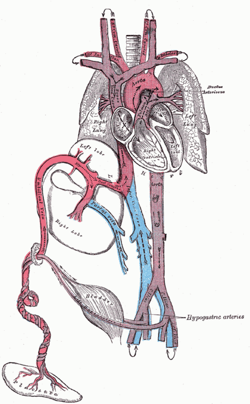
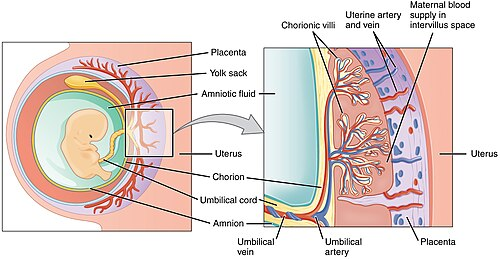

# FISIOLOGIA DOS SISTEMAS FETAIS

Para entender a fisiologia fetal, você precisa mudar sua chave mental. O feto não é um "adulto pequeno". Ele vive em um ambiente de hipóxia relativa, imerso em líquido, e depende de um órgão externo para quase tudo: a placenta. Se você entender que a placenta faz o papel de pulmão, rim, intestino e glândula endócrina, o resto da fisiologia se torna lógico.

Nas provas de residência, o examinador quer saber se você entende como o feto sobrevive nesse ambiente e, principalmente, como ele sobrevive à transição brutal do nascimento. Vamos dissecar cada sistema com foco no que realmente cai.

*Figura 1 - Circulação fetal mostrando os três shunts: ducto venoso, forame oval e ducto arterioso, que permitem a distribuição preferencial de sangue oxigenado. Fonte: Henry Vandyke Carter, Domínio Público | Wikimedia Commons*

## Sistema Cardiovascular e Hemodinâmica Fetal

Este é o tópico campeão de questões. A circulação fetal é desenhada para priorizar dois órgãos: cérebro e coração. Para isso, o feto utiliza três desvios (shunts) estratégicos.

### Os Três Shunts Fetais

Diferente de nós, o feto tem as circulações direita e esquerda funcionando em paralelo, e não em série.

- **Ducto Venoso:** O sangue oxigenado chega pela veia umbilical (lembre-se: 1 veia traz o "limpo", 2 artérias levam o "sujo"). Cerca de 50% desse sangue passa pelo fígado, mas a outra metade atalha pelo ducto venoso direto para a veia cava inferior. **Por que isso importa?** Para que o sangue mais oxigenado não perca tempo sendo filtrado pelo fígado e chegue logo ao coração.

- **Forame Oval:** Quando esse sangue da veia cava inferior chega no átrio direito, ele é direcionado por uma prega (válvula de Eustáquio) diretamente para o átrio esquerdo através do forame oval. Daqui, ele vai para o ventrículo esquerdo e sobe para o cérebro e coronárias.

- **Ducto Arterioso (Canal Arterial):** O sangue que acaba caindo no ventrículo direito e vai para a artéria pulmonar encontra uma barreira: os pulmões estão colapsados e cheios de líquido, gerando uma Resistência Vascular Pulmonar (RVP) altíssima. O sangue, que não é bobo, prefere o caminho de menor resistência: o canal arterial, que joga o sangue direto na aorta descendente.

**Dica de prova do Dr. Will:** As bancas adoram perguntar sobre a saturação de oxigênio. O sangue com maior PO2 no feto está na **veia umbilical** e, após entrar no coração, é direcionado para a **circunferência cefálica**. O sangue com menor PO2 é o que retorna pelas artérias umbilicais.

### Hemoglobina Fetal (HbF)

Como o feto vive em um ambiente de baixa pressão de oxigênio (PO2 de aproximadamente 30 mmHg na veia umbilical), ele precisa de uma estratégia para "sequestrar" o oxigênio da mãe. A HbF tem uma afinidade pelo oxigênio muito maior que a HbA (adulta). Isso desloca a curva de dissociação da hemoglobina para a esquerda.

Além disso, o feto tem um hematócrito mais alto (em torno de 50 a 60%). É o que chamamos de policitemia fisiológica do feto, garantindo que, mesmo com pouco oxigênio disponível, o conteúdo total de O2 transportado seja adequado.

*Figura 2 - Estrutura da placenta mostrando as vilosidades coriônicas e a interface entre circulação materna e fetal, órgão central na fisiologia fetal. Fonte: OpenStax College, CC BY 3.0 | Wikimedia Commons*

## Sistema Respiratório e Surfactante

O pulmão fetal não faz troca gasosa, mas ele não está parado. Ele produz líquido pulmonar, que é essencial para a expansão das vias aéreas e o desenvolvimento alveolar.

### Desenvolvimento Pulmonar

As fases do desenvolvimento caem com frequência, especialmente associadas à viabilidade neonatal:

- **Pseudoglandular (5-17 semanas):** Formação dos brônquios terminais.

- **Canalicular (16-25 semanas):** Aqui a mágica começa. Surgem os bronquíolos respiratórios e os ductos alveares. É o limite da viabilidade, pois começam a aparecer os pneumócitos.

- **Sacular (24 semanas até o termo):** Formação dos sacos terminais.

- **Alveolar (tardio até a infância):** Amadurecimento dos alvéolos propriamente ditos.

### O Surfactante

Produzido pelos **Pneumócitos tipo II**, o surfactante reduz a tensão superficial nos alvéolos, impedindo que eles colapsem na expiração. O principal componente é a **Dipalmitoilfosfatidilcolina (DPPC)**, também conhecida como lecitina.

**Erro clássico de prova:** Achar que o surfactante só começa a ser produzido no termo. Ele começa a ser produzido por volta da 24ª-26ª semana, mas em quantidade suficiente para evitar o colapso apenas após a 34ª-35ª semana. É por isso que usamos corticoides antenatais em ameaças de parto prematuro nessa janela.

## Sistema Gastrointestinal e Metabolismo

O feto começa a deglutir líquido amniótico (LA) por volta da 12ª semana. Isso é fundamental por dois motivos: treina o trato gastrointestinal e ajuda a regular o volume de LA.

### Motilidade e Mecônio

A motilidade gastrointestinal no feto é reduzida. Isso se deve em parte à imaturidade do sistema nervoso entérico e à influência da progesterona (que relaxa musculatura lisa). O conteúdo intestinal fetal é o **mecônio** (água, restos celulares, lanugo e secreções biliares).

Em condições fisiológicas, o feto não evacua. A eliminação de mecônio intraútero é um sinal clássico de alerta para **sofrimento fetal agudo**. A hipóxia causa relaxamento do esfíncter anal e aumento do peristaltismo.

### Metabolismo da Glicose

O feto é um "parasita" de glicose. Ele não faz gliconeogênese significativa; ele recebe tudo da mãe por **difusão facilitada** via transportadores **GLUT1**.

Aqui entra o papel do **HPL (Hormônio Lactogênio Placentário)**. Ele é o "vilão" da resistência insulínica materna. O HPL aumenta na gestação para garantir que a glicose da mãe não entre nas células dela, sobrando mais para o feto. Se a mãe não consegue compensar isso com mais insulina, temos o Diabetes Gestacional.

**Cenário Clínico:** Se o feto recebe muita glicose (mãe diabética), ele responde com **hiperinsulinismo**. Como a insulina é um potente hormônio de crescimento (semelhante ao IGF-1), esse feto desenvolve **macrossomia**. O problema é que, ao nascer, o suprimento de glicose corta, mas a insulina continua alta, levando à hipoglicemia neonatal severa.

## Sistema Renal e Líquido Amniótico

A partir do segundo trimestre, o principal componente do líquido amniótico é a **urina fetal**. O feto urina um volume enorme (cerca de 500-1000 ml/dia no termo), e essa urina é hipotônica.

### Dinâmica do Líquido Amniótico (LA)

- **Produção:** Principalmente urina fetal e, em menor escala, secreção pulmonar.

- **Reabsorção:** Principalmente deglutição fetal e via intramembranosa (pela placenta/cordão).

Se o feto não urina (ex: agenesia renal ou obstrução uretral), temos **oligodrâmnio**. Se o feto não deglute (ex: atresia de esôfago ou anencefalia), temos **polidrâmnio**.

**Dica de Anatomia:** O ureter cruza a artéria uterina em uma relação descrita como "água sob a ponte". Em cirurgias ginecológicas ou cesáreas complicadas, esse é o ponto onde o ureter corre maior risco de ligadura acidental.

## A Transição Neonatal: O Momento Crítico

Muitas questões focam no que acontece nos primeiros segundos de vida. A transição é marcada por dois eventos principais: o clampeamento do cordão e a primeira respiração.

### Tabela 1: Mudanças na Transição Neonatal

| Estrutura | No Feto | No Recém-Nascido | Causa da Mudança |
| --- | --- | --- | --- |
| **Resistência Vascular Pulmonar (RVP)** | Alta (pulmão colapsado) | Baixa | Expansão pulmonar e O2 |
| **Resistência Vascular Sistêmica (RVS)** | Baixa (circuito placentário) | Alta | Clampeamento do cordão |
| **Forame Oval** | Aberto (Shunt D -> E) | Fechado | ↑ Pressão no Átrio Esquerdo |
| **Canal Arterial** | Aberto (Shunt P -> Aorta) | Fechado (Funcional) | ↑ O2 e ↓ Prostaglandinas |
| **Ducto Venoso** | Aberto | Fechado | Interrupção do fluxo umbilical |

### O Fechamento dos Shunts

- **Forame Oval:** Com a primeira respiração, a RVP cai drasticamente. O sangue flui para os pulmões e volta em grande volume para o átrio esquerdo. A pressão no átrio esquerdo supera a do direito, empurrando a válvula do forame oval contra o septo. O fechamento é imediato e funcional.

- **Canal Arterial:** O fechamento é mediado pelo aumento da PO2 arterial e pela queda dos níveis de Prostaglandina E2 (que vinha da placenta).

- **Pérola de Prova:** Em prematuros, o canal arterial muitas vezes não fecha (PCA). O quadro clássico é o RN com sopro em maquinaria, pulsos em martelo d'água e precórdio hiperdinâmico. O tratamento pode envolver inibidores da ciclooxigenase (Indometacina ou Ibuprofeno).

- **O inverso também cai:** Em certas cardiopatias congênitas (ducto-dependentes), precisamos manter o canal aberto usando **Prostaglandina E1 (Alprostadil)**.

## Adaptações Hematológicas e Vitamina K

O feto vive em um estado de relativa deficiência de fatores de coagulação dependentes de vitamina K (II, VII, IX e X). A placenta não transporta bem a vitamina K e a flora intestinal fetal (que produz a vitamina) é inexistente.

Por isso, todo recém-nascido **deve** receber vitamina K intramuscular ao nascer para prevenir a **Doença Hemorrágica do Recém-Nascido**. Isso é uma conduta de rotina baseada na fisiologia da imaturidade hepática e ausência de colonização bacteriana.

## Fisiologia da Placenta: A Interface

A placenta não é apenas um filtro; ela é um órgão metabolicamente ativo. No MedEvo, sempre reforçamos que a transferência de substâncias segue regras rígidas que as bancas amam:

### Tabela 2: Mecanismos de Transporte Placentário

| Mecanismo | Substâncias | Observação |
| --- | --- | --- |
| **Difusão Simples** | Oxigênio, CO2, Água, Eletrólitos | Segue o gradiente de concentração. |
| **Difusão Facilitada** | Glicose (GLUT1) | Não gasta ATP, mas usa transportador. |
| **Transporte Ativo** | Aminoácidos, Cálcio, Ferro, Vitaminas | Gasta ATP. Feto tem níveis maiores que a mãe. |
| **Pinocitose** | Imunoglobulinas (IgG) | Garante a imunidade passiva inicial. |

**Cuidado:** Apenas a **IgG** atravessa a placenta. IgM e IgA não passam. Se você encontrar IgM positivo no sangue do cordão, isso indica infecção congênita (o feto produziu em resposta a um patógeno).

## Adaptações Maternas Relacionadas ao Feto

Para manter essa "máquina" fetal funcionando, o corpo da mãe sofre alterações profundas. Entender a fisiologia materna ajuda a entender a fetal.

- **Hemodinâmica:** O débito cardíaco aumenta 30-50%. A resistência vascular periférica (RVP) **diminui** por ação da progesterona e óxido nítrico. Isso explica por que a pressão arterial cai no primeiro e segundo trimestres.

- **Hematologia:** O volume plasmático aumenta mais (45%) do que a massa de hemácias (20-30%). Resultado: **Hemodiluição fisiológica**. Um hematócrito de 33% em uma gestante é normal, não é anemia ferropriva necessariamente.

- **Sistema Urinário:** Aumento da taxa de filtração glomerular (TFG) em 50%. Isso faz com que os níveis de ureia e creatinina na gestante sejam **menores** que na mulher não grávida. Uma creatinina de 0.9 mg/dL, que é normal para você, pode ser sinal de disfunção renal em uma gestante.

- **Gastrointestinal:** A progesterona relaxa o esfíncter esofágico inferior (causando pirose) e diminui o peristaltismo (causando constipação e aumentando o risco de cálculos biliares por estase).

## Desenvolvimento Cardíaco Embrionário

O coração é o primeiro órgão funcional. Por volta da 4ª semana, o tubo cardíaco começa a sofrer o "looping". Se esse dobramento for para o lado errado, temos dextrocardia.

As malformações cardíacas congênitas muitas vezes ocorrem entre a 5ª e 8ª semana, período de septação das câmaras. É aqui que o uso de teratógenos ou infecções (como rubéola) causa o maior estrago.

### Tabela 3: Remanescentes da Circulação Fetal

| Estrutura Fetal | Remanescente Pós-Natal |
| --- | --- |
| Veia Umbilical | Ligamento Teres (Redondo) do Fígado |
| Ducto Venoso | Ligamento Venoso |
| Forame Oval | Fossa Oval |
| Canal Arterial | Ligamento Arterioso |
| Artérias Umbilicais | Ligamentos Umbilicais Mediais |

## Teoria de Barker (DOHaD)

Um conceito moderno que tem aparecido em provas de alto nível é a **Origem Desenvolvimentista da Saúde e da Doença (DOHaD)**. A ideia é que o ambiente intrauterino (insultos, desnutrição, estresse) "programa" o feto para doenças na vida adulta, como hipertensão, diabetes e obesidade. Um feto que sofre restrição de crescimento intrauterino (RCIU) desenvolve um "fenótipo poupador", tornando-se muito eficiente em estocar energia, o que o predispõe à síndrome metabólica mais tarde.

## Pontos-Chave para Prova 🎯

- **Shunts Fetais:** Ducto venoso (pula fígado), Forame oval (AD -> AE), Canal arterial (pula pulmão).

- **Gases no Cordão:** A veia umbilical tem a maior PO2; as artérias umbilicais têm a menor PO2 e maior PCO2.

- **HbF:** Maior afinidade pelo O2, desvia a curva para a esquerda, essencial para a vida em "hipóxia".

- **Surfactante:** Produzido por pneumócitos tipo II; principal componente é a Lecitina (DPPC).

- **Líquido Amniótico:** No 2º e 3º trimestres, a urina fetal é a principal fonte. Oligodrâmnio sugere problema renal; Polidrâmnio sugere problema digestivo ou neurológico.

- **Transporte Placentário:** Glicose é difusão facilitada; Aminoácidos e Cálcio são transporte ativo; IgG é pinocitose.

- **HPL:** Principal hormônio da resistência insulínica materna para garantir glicose ao feto.

- **Transição:** O fechamento do forame oval é por pressão (AE > AD); o do canal arterial é por O2 e queda de prostaglandinas.

- **Vitamina K:** O feto é deficiente ao nascer; reposição IM é obrigatória para evitar doença hemorrágica.

- **Sopro Diastólico na Gestante:** SEMPRE patológico. O sistólico pode ser fisiológico pelo aumento do débito cardíaco.

- **Creatinina na Gestante:** Valores "normais" de laboratório (ex: 1.0) podem indicar insuficiência renal na gravidez devido ao aumento fisiológico da TFG.

- **Clampeamento do Cordão:** O clampeamento tardio (1-3 min) aumenta as reservas de ferro do RN, mas pode aumentar o risco de icterícia neonatal.

- **Progesterona:** A "mãe" da gravidez. Relaxa tudo (útero, vasos, ureteres, esfíncter esofágico, intestino).

- **Artérias Umbilicais:** São ramos das artérias ilíacas internas (hipogástricas).

- **Primeira Respiração:** O estímulo principal é a combinação de frio, luz, tato e a breve hipóxia/hipercapnia do parto, que ativa o centro respiratório bulbar.

- **Ducto Venoso:** Se fecha e vira o ligamento venoso. Sua persistência é rara, mas grave.

- **Macrossomia:** Resultado do hiperinsulinismo fetal em resposta à hiperglicemia materna. Insulina funciona como hormônio de crescimento.

- **O que NÃO fazer:** Nunca ignore um mecônio espesso no líquido amniótico; é sinal de que a fisiologia de repouso intestinal foi quebrada por estresse.

 Cópia offline para consulta pessoal.
 Fonte original:
 [https://www.medevo.com.br/material-apoio/ler/afdd4306-c826-4437-8cb3-0dd974be14ee](https://www.medevo.com.br/material-apoio/ler/afdd4306-c826-4437-8cb3-0dd974be14ee)
