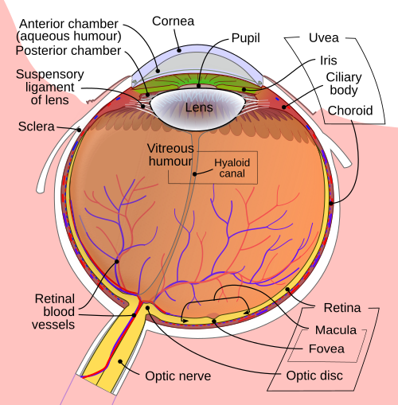
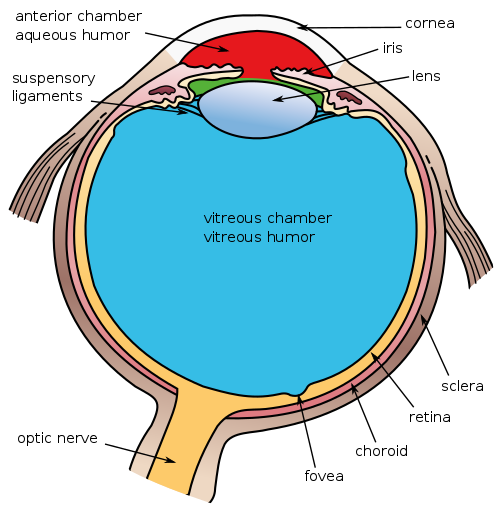

# FISIOLOGIA OCULAR

Para entender a oftalmologia de verdade, você precisa parar de ver o olho como uma câmera fotográfica estática e passar a enxergá-lo como um sistema dinâmico de equilíbrio hidrostático, bioquímico e elétrico. Se você dominar a fisiologia, as patologias deixam de ser nomes para decorar e passam a ser consequências lógicas de um sistema que falhou.

*Figura 1 - Corte horizontal do olho humano mostrando as principais estruturas: córnea, cristalino, retina, nervo óptico e câmaras oculares. Fonte: Rhcastilhos/Jmarchn, CC BY-SA 3.0 | Wikimedia Commons*

## Filme Lacrimal: A Primeira Lente do Olho

Muitos alunos ignoram o filme lacrimal, achando que ele serve apenas para lubrificar. Erro grave. O filme lacrimal é a primeira interface refrativa do olho. Se ele está instável, a visão fica embaçada, independentemente de quão boa seja a lente do óculos do paciente.

O filme lacrimal é composto classicamente por três camadas, embora hoje saibamos que elas se misturam em um gradiente. A camada mais externa é a lipídica, produzida pelas glândulas de Meibomius. Sua função é reduzir a evaporação da lágrima. Se o paciente tem blefarite, ele perde essa proteção e desenvolve olho seco evaporativo.

A camada intermediária é a aquosa, a mais espessa, produzida pela glândula lacrimal principal e pelas glândulas acessórias de Krause e Wolfring. Ela transporta oxigênio e nutrientes para a córnea, que é avascular. Por fim, temos a camada de mucina, produzida pelas células caliciformes (goblet cells) da conjuntiva, que torna a superfície da córnea hidrofílica, permitindo que a lágrima se espalhe uniformemente.

**Dica de Prova:** As bancas adoram confundir as glândulas. Lembre-se que Krause e Wolfring são acessórias e responsáveis pela secreção basal. A glândula lacrimal principal responde mais aos estímulos reflexos (choro, corpo estranho).

## Córnea: O Milagre da Transparência

Por que a córnea é transparente e a esclera, feita do mesmo colágeno, é branca? A resposta está na organização e na hidratação. Na córnea, as fibrilas de colágeno tipo I têm diâmetro uniforme e estão organizadas em lamelas paralelas, com um espaçamento menor que o comprimento de onda da luz visível. Isso causa uma interferência destrutiva da luz dispersa, permitindo que o feixe principal passe sem desvios. É a Teoria de Maurice.

Mas essa organização depende de um estado de detumescência, ou seja, a córnea precisa estar "desidratada" (com cerca de 78% de água). Se a água entra demais, as fibrilas se afastam e a córnea fica opaca. Quem mantém esse equilíbrio é o endotélio, a camada mais interna da córnea.

O endotélio possui bombas de Na+/K+ ATPase que jogam íons ativamente para a câmara anterior, puxando a água para fora do estroma por osmose. O detalhe cruel: as células endoteliais humanas não se regeneram. Nós nascemos com cerca de 3.000 a 4.000 células/mm² e as perdemos ao longo da vida.

**Exemplo Clínico:** Imagine um paciente de 70 anos submetido a uma cirurgia de catarata prolongada. O trauma cirúrgico reduz a contagem endotelial. Se o número cair abaixo de 500 a 800 células/mm², a bomba não dá mais conta, a córnea incha e temos o edema corneano crônico (ceratopatia bolhosa).

### Metabolismo Corneano

A córnea retira seu oxigênio principalmente da atmosfera (através do filme lacrimal) e seus nutrientes do humor aquoso. Em condições de hipóxia, como no uso prolongado de lentes de contato de baixa permeabilidade, a córnea passa a fazer metabolismo anaeróbico. Isso gera lactato, que se acumula no estroma, aumenta a pressão osmótica e atrai água, causando edema.

| Camada da Córnea | Características Fisiológicas |
| --- | --- |
| Epitélio | Barreira hidrofóbica, alta capacidade de regeneração (mitose). |
| Estroma | 90% da espessura, colágeno organizado, precisa estar desidratado. |
| Endotélio | Monocamada, não regenera, rico em bombas Na+/K+ ATPase. |

*Figura 2 - Diagrama das três câmaras internas do olho: câmara anterior, câmara posterior e câmara vítrea, fundamentais para a dinâmica do humor aquoso. Fonte: Holly Fischer/Pixelsquid, CC BY 3.0 | Wikimedia Commons*

## Humor Aquoso e Pressão Intraocular (PIO)

O humor aquoso não serve apenas para dar volume ao olho. Ele é o substituto do sangue para as estruturas avasculares (córnea e cristalino). Sua produção ocorre nos processos ciliares do corpo ciliar, através de três mecanismos: difusão, ultrafiltração e, o mais importante para provas, secreção ativa.

A secreção ativa é mediada pela enzima anidrase carbônica e por receptores beta-adrenérgicos. É por isso que usamos inibidores da anidrase carbônica (acetazolamida) e betabloqueadores (timolol) para tratar o glaucoma. Eles agem na "torneira", diminuindo a produção.

A drenagem do aquoso segue duas vias principais:

- Via Trabecular (Convencional): O aquoso passa pela malha trabecular, canal de Schlemm e veias episclerais. Responde por cerca de 80-90% da drenagem. É uma via dependente de pressão.

- Via Uveoescleral (Não-convencional): O aquoso passa entre os feixes do músculo ciliar para o espaço supracoroidal. Responde por 10-20% da drenagem e é independente de pressão.

**Dica de Prova:** Os análogos de prostaglandina (como a latanoprosta), que são a primeira escolha no tratamento do glaucoma de ângulo aberto, agem aumentando a drenagem pela via uveoescleral. Como dizemos no MedEvo, eles "abrem uma nova saída" para o líquido.

## Cristalino e Acomodação

O cristalino é uma lente biconvexa, avascular e transparente. Sua principal característica fisiológica é a capacidade de mudar de forma para focar objetos de perto, processo chamado de acomodação.

Aqui está o ponto onde 90% dos alunos erram em provas de fisiologia: o mecanismo da acomodação de Helmholtz.

- Para ver de PERTO: O músculo ciliar se CONTRAI. Ao contrair, o diâmetro do anel do corpo ciliar diminui, o que RELAXA as fibras da zônula de Zinn. Com a zônula relaxada, o cristalino, que é elástico, assume sua forma natural mais arredondada (maior poder dióptrico).

- Para ver de LONGE: O músculo ciliar RELAXA, o anel se expande, ESTICA a zônula e o cristalino fica plano.

Com a idade, o cristalino perde elasticidade e o músculo ciliar perde eficiência. É a presbiopia. O paciente não consegue mais "arredondar" o cristalino para perto.

**Pegadinha de Prova:** A alternativa vai dizer que para ver de perto o músculo ciliar relaxa. Não caia nessa. Lembre-se: contração = esforço = visão de perto.

## Retina e Fototransdução

A retina é onde a mágica da transformação da luz em impulso elétrico acontece. Esse processo é a fototransdução.

Os fotorreceptores são os cones (visão de cores e detalhes, concentrados na fóvea) e os bastonetes (visão noturna e periférica, mais sensíveis à luz). Ambos contêm pigmentos visuais que consistem em uma proteína (opsina) ligada a um cromóforo (11-cis-retinal, derivado da Vitamina A).

Quando um fóton atinge o 11-cis-retinal, ele se isomeriza para all-trans-retinal. Essa mudança de forma ativa a opsina, que ativa uma proteína G chamada transducina. A transducina ativa a fosfodiesterase, que reduz os níveis de cGMP na célula.

Aqui está a contraintuição da fisiologia retiniana: no escuro, os fotorreceptores estão DESPOLARIZADOS (liberando glutamato). Quando a luz incide, ocorre o fechamento dos canais de sódio e a célula se HIPERPOLARIZA. Portanto, a luz gera um sinal de "menos" liberação de neurotransmissor.

### O Ciclo Visual e o EPR

O Epitélio Pigmentar da Retina (EPR) é o herói anônimo da visão. Ele fica logo atrás dos fotorreceptores e tem funções vitais:

- Absorção de luz dispersa (evita o ofuscamento).

- Transporte de nutrientes da coroide para a retina.

- Fagocitose dos discos externos dos fotorreceptores (reciclagem).

- Regeneração do 11-cis-retinal (o ciclo visual).

Se o EPR falha, como na Degeneração Macular Relacionada à Idade (DMRI), os fotorreceptores morrem porque "passam fome" e ficam soterrados em seus próprios resíduos (drusas).

| Característica | Cones | Bastonetes |
| --- | --- | --- |
| Sensibilidade | Baixa (precisa de muita luz) | Alta (visão escotópica) |
| Acuidade | Alta (fóvea) | Baixa |
| Cores | Sim (Azul, Verde, Vermelho) | Não |
| Quantidade | ~6 milhões | ~120 milhões |

## Fisiologia Pupilar e Reflexos

A pupila controla a entrada de luz e aumenta a profundidade de foco. O diâmetro pupilar é um equilíbrio entre o sistema parassimpático (miose) e o simpático (midríase).

- Miose (Parassimpático): O estímulo parte da retina, vai pelo nervo óptico (NC II), chega ao pré-tecto no mesencéfalo, vai para o núcleo de Edinger-Westphal de AMBOS os lados e retorna pelo nervo oculomotor (NC III) até o músculo esfíncter da íris.

- Midríase (Simpático): Via longa de três neurônios. Começa no hipotálamo, desce até a medula espinhal (C8-T2, centro ciliospinhal de Budge), sobe pela cadeia ganglionar cervical até o gânglio cervical superior e segue os vasos sanguíneos até o músculo dilatador da íris.

**Dica do Dr. Will:** O fato de o estímulo de um olho ir para os dois núcleos de Edinger-Westphal explica o reflexo consensual. Se eu ilumino o olho direito e o esquerdo não contrai, o problema está na via eferente (NC III) do esquerdo ou na via aferente (NC II) do direito.

Para diferenciar, usamos o teste do balanço da luz (swinging flashlight test). Se ao passar a luz do olho sadio para o doente a pupila deste último parece dilatar em vez de contrair, temos um Defeito Pupilar Aferente Relativo (DPAR) ou Pupila de Marcus Gunn. Isso é sinal patognomônico de lesão grave do nervo óptico ou da retina.

## Motilidade Ocular: Leis de Inervação

A movimentação dos olhos é coordenada por seis músculos extraoculares em cada olho, regidos por duas leis fundamentais que caem em toda prova de residência:

- Lei de Sherrington (Inervação Recíproca): Aplica-se a UM OLHO. Quando um músculo contrai (agonista), seu antagonista no mesmo olho relaxa na mesma proporção. Exemplo: para o reto lateral direito contrair, o reto medial direito tem que relaxar.

- Lei de Hering (Correspondência de Inervação): Aplica-se aos DOIS OLHOS. A inervação enviada aos músculos que realizam o mesmo movimento (músculos sinergistas ou "yoke muscles") é igual e simultânea. Exemplo: se eu olho para a direita, o reto lateral direito e o reto medial esquerdo recebem a mesma carga elétrica.

**Exemplo Clínico:** Em uma paralisia de NC VI à direita, o paciente não consegue abduzir o olho direito. Pela Lei de Hering, se ele tentar olhar para a direita com o olho paralisado, o cérebro enviará uma carga enorme de estímulo, que também chegará ao reto medial esquerdo (sadio), causando um desvio muito maior no olho esquerdo (desvio secundário > desvio primário).

## Fisiologia da Visão de Cores

A visão de cores é baseada na teoria tricromática. Temos três tipos de cones, cada um com uma opsina sensível a um comprimento de onda diferente:

- Cones S (Short): Azul.

- Cones M (Medium): Verde.

- Cones L (Long): Vermelho.

O daltonismo mais comum é a deficiência de percepção do verde (deuteranomalia) ou vermelho (protanomalia), ambos de herança ligada ao X. Por isso, é muito mais comum em homens.

## Pontos-Chave para Prova 💡

- A córnea é mantida transparente pela organização das fibrilas de colágeno e pelo estado de detumescência mantido pela bomba de Na+/K+ ATPase do endotélio.

- O valor normal da pressão intraocular (PIO) varia de 10 a 21 mmHg, mas o diagnóstico de glaucoma depende de lesão do nervo óptico, não apenas do valor da PIO.

- A produção do humor aquoso ocorre nos processos ciliares por secreção ativa (principal), ultrafiltração e difusão.

- A via de drenagem uveoescleral é independente da pressão intraocular e é o alvo principal dos análogos de prostaglandina.

- Na acomodação para perto: Músculo ciliar contrai -> Zônula relaxa -> Cristalino aumenta seu poder dióptrico (fica mais curvo).

- A fototransdução causa HIPERPOLARIZAÇÃO dos fotorreceptores e redução da liberação de glutamato.

- O Epitélio Pigmentar da Retina (EPR) é responsável pela regeneração do 11-cis-retinal e fagocitose dos discos dos fotorreceptores.

- A Pupila de Marcus Gunn (DPAR) indica lesão da via aferente (Nervo Óptico) e é testada pelo swinging flashlight test.

- A Lei de Sherrington rege o relaxamento do antagonista no mesmo olho; a Lei de Hering rege a inervação igual para músculos sinergistas em ambos os olhos.

- A camada lipídica do filme lacrimal (glândulas de Meibomius) evita a evaporação; a camada de mucina (células caliciformes) permite a adesão da lágrima à córnea.

- Contraindicação absoluta ao uso de corticoides tópicos sem vigilância: suspeita de ceratite por Herpes Simplex (risco de perfuração) ou glaucoma cortisônico prévio.

- O metabolismo da córnea é predominantemente anaeróbico em condições de baixa oxigenação, levando ao edema por acúmulo de lactato.

- A fóvea contém apenas cones, garantindo a máxima acuidade visual e visão de cores, mas é "cega" em condições de baixíssima luminosidade (onde os bastonetes periféricos dominam).

- Erro comum: achar que o cristalino é a estrutura com maior poder refrativo do olho. Falso. A interface ar-filme lacrimal/córnea possui cerca de 43 dioptrias, enquanto o cristalino possui cerca de 15 a 20 dioptrias.

- O reflexo fotomotor tem via aferente pelo NC II e via eferente pelo NC III. O reflexo de piscada (corneano) tem via aferente pelo NC V (V1) e eferente pelo NC VII.

 Cópia offline para consulta pessoal.
 Fonte original:
 [https://www.medevo.com.br/material-apoio/ler/816eb5ac-f349-4319-a351-86611c22ba68](https://www.medevo.com.br/material-apoio/ler/816eb5ac-f349-4319-a351-86611c22ba68)
