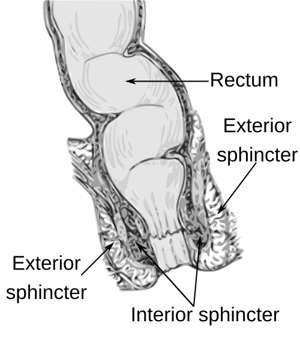
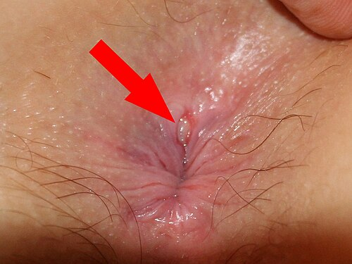

# FISSURA ANAL

A fissura anal é, sem dúvida, uma das causas mais comuns de consulta no consultório do coloproctologista e um tema onipresente em provas de residência. Para entender a fissura, você não deve pensar nela apenas como um "corte" no ânus. Se fosse apenas um corte, cicatrizaria sozinho em poucos dias, como um corte no dedo. O que transforma uma simples laceração em uma patologia crônica e extremamente dolorosa é um fenômeno fisiopatológico que as bancas amam: a **hipertonia do esfíncter anal interno**.

*Figura 1 - Anatomia do canal anorretal com esfíncteres interno e externo, estruturas fundamentais na fisiopatologia da fissura anal. Fonte: Waterced, CC BY-SA 4.0 | Wikimedia Commons*

## Anatomia e Fisiopatologia: O Ciclo Vicioso

Para entender o tratamento, você precisa entender por que a fissura não cicatriza. O canal anal é revestido pelo anoderma, uma pele altamente sensível e ricamente inervada. Abaixo dele, temos o esfíncter anal interno (EAI), que é um músculo liso, de contração involuntária.

O mecanismo clássico começa com um trauma local, geralmente a passagem de fezes endurecidas (constipação) ou, menos comum, episódios de diarreia explosiva. Esse trauma gera uma úlcera linear. A dor causada por essa úlcera desencadeia um reflexo de espasmo do esfíncter anal interno.

Aqui está o "pulo do gato" que o Dr. Will sempre enfatiza nas discussões do MedEvo: o EAI em espasmo comprime os pequenos vasos sanguíneos que irrigam o anoderma. A comissura posterior do canal anal já possui, naturalmente, uma irrigação sanguínea mais precária (isquemia fisiológica relativa). Com a hipertonia, essa região fica isquêmica. Sem sangue, não há cicatrização. Sem cicatrização, a dor persiste. A dor gera mais espasmo. Está formado o **ciclo vicioso da fissura anal**.

**Por que a localização é quase sempre na linha média posterior (90-95%)?**
Existem duas razões principais:

- **Anatômica:** As fibras do esfíncter externo divergem na região posterior, deixando o anoderma menos suportado.

- **Vascular:** Como mencionado, a perfusão sanguínea na linha média posterior é significativamente menor do que nos outros quadrantes do canal anal.

**Cuidado:** Se você encontrar uma fissura lateral ou múltiplas fissuras em um paciente, "ligue o radar". Isso não é o habitual. Nesses casos, devemos investigar causas secundárias como Doença de Crohn, Sífilis, Tuberculose anal, HIV ou Carcinoma anal.

## Classificação: Aguda vs. Crônica

Diferenciar uma fissura aguda de uma crônica é fundamental, pois a conduta muda completamente. A diretriz da Sociedade Brasileira de Coloproctologia (SBCP) utiliza o tempo e as características morfológicas para essa distinção.

### Fissura Anal Aguda

É aquela com menos de 6 a 8 semanas de evolução. Ao exame, parece um corte recente, "limpo", com bordos finos e fundo avermelhado. O tratamento aqui é quase 100% clínico, focado em quebrar o ciclo de constipação.

### Fissura Anal Crônica

É aquela que persiste por mais de 8 semanas. Aqui, o processo inflamatório crônico gera alterações anatômicas cicatriciais. É onde encontramos a famosa **Tríade de Brodie**, um achado clássico de prova:

- **Plicoma Sentinela:** Uma dobra de pele externa, na base da fissura, formada pelo edema e fibrose crônica. Muitos pacientes acham que é uma hemorroida, mas o plicoma é fixo e indolor ao toque (a dor vem da fissura acima dele).

- **Úlcera com fibras do esfíncter anal interno expostas:** No fundo da fissura, você consegue ver as fibras musculares esbranquiçadas e transversais do EAI.

- **Papila Anal Hipertrófica:** Uma projeção fibroepitelial para dentro do canal anal, no topo da fissura (na linha pectínea).

| Característica | Fissura Aguda | Fissura Crônica |
| --- | --- | --- |
| **Tempo** | < 6-8 semanas | > 8 semanas |
| **Bordos** | Delgados, lisos | Elevados, fibróticos |
| **Fundo** | Vermelho (recente) | Fibras do EAI visíveis (branco) |
| **Plicoma Sentinela** | Ausente | Presente |
| **Papila Hipertrófica** | Ausente | Presente |

## Quadro Clínico e Exame Físico

O sintoma cardeal é a **dor anal intensa associada à evacuação**. O paciente descreve como se estivesse "passando cacos de vidro" ou "uma faca".
A dor tem um padrão bifásico: dói muito na hora de passar as fezes, dá uma leve aliviada e depois volta como uma queimação ou latejamento que pode durar horas. Isso acontece devido ao espasmo prolongado do esfíncter após o estímulo da evacuação.

O sangramento (hematoquezia) é comum, mas geralmente é de pequena monta — apenas um risco de sangue vivo no papel higiênico ou sobre as fezes. Se o sangramento for volumoso e indolor, pense em Doença Hemorroidária Interna, não em fissura.

**Como examinar?**
Com muita delicadeza. O paciente com fissura tem pavor do exame físico.

- **Inspeção:** Afaste as nádegas suavemente. Na maioria das vezes, a fissura ou o plicoma sentinela já serão visíveis.

- **Toque Retal:** **Evite o toque retal na fase aguda** se a dor for impeditiva. O diagnóstico é clínico e visual. Forçar o toque causa um sofrimento desnecessário e aumenta o espasmo. Se for essencial para descartar abscesso (quando há febre ou abaulamento), pode ser feito sob anestesia ou após melhora inicial com tratamento clínico.

*Figura 2 - Fissura anal visível ao exame proctológico, tipicamente localizada na comissura posterior do canal anal. Fonte: Bernardo Gui, Domínio Público | Wikimedia Commons*

## Diagnóstico Diferencial

Nem toda ferida no ânus é fissura anal idiopática. As bancas adoram colocar um paciente com "fissura lateral" para testar se você sabe investigar as causas secundárias.

| Patologia | Dica Clínica para Diferencial |
| --- | --- |
| **Doença de Crohn** | Fissuras múltiplas, laterais, indolores ou com fístulas associadas. |
| **Sífilis (Cancro)** | Úlcera única ou "em espelho" (beijando), geralmente menos dolorosa que a fissura comum. |
| **Câncer Anal (CEC)** | Lesão vegetante, bordos evertidos, endurecida, sangramento persistente. |
| **Abscesso Anal** | Dor contínua (não apenas ao evacuar), febre, sinais flogísticos locais (edema, calor). |
| **Hemorroida Trombosada** | Nódulo violáceo, doloroso, de início súbito, sem relação direta com a úlcera linear. |

**Exemplo Clínico:** Paciente masculino, 28 anos, apresenta três fissuras anais (uma posterior e duas laterais), pouco dolorosas, associadas a episódios de diarreia crônica e perda de peso.
*O que você marca na prova?* Investigar Doença de Crohn através de colonoscopia com biópsias. Fissura "atípica" exige investigação.

## Tratamento Clínico (Conservador)

O tratamento inicial de **toda** fissura anal, seja aguda ou crônica, deve ser clínico. O objetivo é duplo: amaciar as fezes e relaxar o esfíncter anal interno (esfincterotomia química).

### 1. Medidas Higienodietéticas (O básico que cai em prova)

- **Fibras:** 25 a 30g por dia (Psyllium, farelo de trigo ou dieta rica em vegetais).

- **Água:** Mínimo de 2 litros/dia. Sem água, a fibra vira um "tijolo" e piora a fissura.

- **Banhos de Assento:** Água morna (não quente), 3 a 4 vezes ao dia, por 10-15 minutos.

- *Por que funciona?* O calor úmido promove o relaxamento reflexo do esfíncter anal interno, reduzindo a pressão e melhorando a dor. É um potente relaxante muscular natural.

### 2. Esfincterotomia Química (Farmacoterapia)

Se as medidas dietéticas não resolverem em 2 semanas, ou se a fissura for crônica, associamos medicamentos tópicos que reduzem a pressão do EAI.

- **Nitratos Tópicos (Nitroglicerina 0,2% a 0,4%):** Agem como doadores de óxido nítrico, relaxando a musculatura lisa.

- **Efeito Colateral Clássico:** Cefaleia (em até 20-30% dos pacientes) devido à absorção sistêmica e vasodilatação. Isso leva a altas taxas de abandono do tratamento.

- **Bloqueadores de Canal de Cálcio (Diltiazem 2% ou Nifedipina 0,2% - Tópicos):** Atualmente são a **primeira escolha** em muitos serviços e diretrizes brasileiras.

- **Vantagem:** Eficácia similar aos nitratos, mas com muito menos efeitos colaterais (cefaleia é rara). Podem causar prurido anal leve.

- **Toxina Botulínica:** Injetada diretamente no esfíncter anal interno. Bloqueia a liberação de acetilcolina, causando paralisia temporária do músculo por 3 a 4 meses.

- **Indicação:** Pacientes que falharam ao tratamento tópico, mas que têm alto risco cirúrgico ou medo de incontinência definitiva.

- **Efeito Adverso:** Incontinência fecal ou de flatos **temporária** (geralmente resolve quando o efeito da toxina passa).

## Tratamento Cirúrgico

Quando indicar cirurgia? Segundo a SBCP, a cirurgia está indicada na **Fissura Anal Crônica refratária** ao tratamento clínico bem conduzido (geralmente após 6-8 semanas de terapia tópica sem sucesso).

O padrão-ouro absoluto é a **Esfincterotomia Lateral Interna (ELI)**.

### A Técnica: Esfincterotomia Lateral Interna (ELI)

Consiste na secção parcial das fibras do esfíncter anal interno.

- **Por que lateral?** Para não mexer na área da fissura (que está na linha média) e evitar deformidades em "buraco de fechadura" (keyhole deformity), que causariam escape fecal.

- **Por que interna?** Porque o problema é a hipertonia do músculo liso (EAI). O esfíncter externo (estriado) deve ser preservado.

- **Extensão:** Geralmente secciona-se o esfíncter até a altura da linha pectínea ou até o limite proximal da fissura.

**Resultados:** A ELI tem taxas de cura superiores a 95%. É extremamente eficaz porque resolve a causa base (a hipertonia) de forma definitiva.

**Complicação mais temida:** Incontinência anal. Embora a taxa de incontinência para fezes sólidas seja baixa (< 1-2%), a perda de controle para flatos ou escape de muco (soiling) pode ocorrer em até 10% dos casos. Por isso, em pacientes com risco prévio de incontinência (mulheres multíparas com lesão esfincteriana oculta, idosos, pacientes com cirurgias anais prévias), devemos ser muito cautelosos com a cirurgia.

### Outras Técnicas

- **Fissurectomia:** Retirada da fissura e dos tecidos fibróticos (plicoma e papila). Raramente feita isoladamente, pois não trata a hipertonia.

- **Anoplastia (Retalhos cutâneos):** Indicada em fissuras com pressão de repouso normal (fissuras "isquêmicas" sem hipertonia), onde cortar o esfíncter não faria sentido e aumentaria o risco de incontinência.

## Situações Especiais

### Gestantes e Pós-parto

O parto vaginal é a causa mais comum de lesão do esfíncter anal, podendo levar à incontinência futura. Durante a gestação, a constipação é frequente. O tratamento deve ser estritamente conservador (fibras e banho de assento). A cirurgia deve ser evitada ao máximo no período periparto.

### Fissura Anal e Doença de Crohn

**Cuidado aqui!** Nunca faça esfincterotomia em um paciente com Crohn sem extrema necessidade. O risco de não cicatrização da ferida cirúrgica e evolução para uma fístula complexa ou destruição do aparelho esfincteriano é altíssimo. O tratamento aqui é o da doença de base (imunossupressores, biológicos).

### Câncer Anal (Protocolo Nigro)

Embora o tema seja fissura, as bancas adoram misturar o diagnóstico diferencial. Se a biópsia de uma "fissura suspeita" vier como Carcinoma Espinocelular (CEC) de canal anal:

- O tratamento **não é cirúrgico** inicialmente.

- O padrão é o **Protocolo Nigro**: Quimioterapia (5-FU + Mitomicina C) + Radioterapia. A cirurgia (Amputação Abdominoperineal de Resgate) fica reservada apenas para falha do tratamento ou recidiva.

## Resumo do Fluxograma Terapêutico

- **Fissura Aguda:** Dieta rica em fibras + Hidratação + Banho de assento morno. (Sucesso > 90%).

- **Fissura Crônica (Inicial):** Medidas higienodietéticas + Bloqueador de Canal de Cálcio tópico (Diltiazem 2%) por 6 a 8 semanas.

- **Fissura Crônica Refratária:** Considerar Toxina Botulínica (se risco de incontinência) ou **Esfincterotomia Lateral Interna (Padrão-ouro)**.

| Medicamento | Dose/Uso | Mecanismo | Principal Efeito Colateral |
| --- | --- | --- | --- |
| **Fibras (Psyllium)** | 5-10g 2-3x/dia | Formador de bolo fecal | Flatulência, distensão |
| **Diltiazem 2%** | Tópico 2-3x/dia | Bloqueia canais de Ca no EAI | Prurido anal |
| **Nitroglicerina 0,4%** | Tópico 2x/dia | Doador de Óxido Nítrico | Cefaleia intensa |
| **Toxina Botulínica** | 20-50 UI (Injeção) | Bloqueio de Acetilcolina | Incontinência temporária |

## Pontos-Chave para Prova

- **Localização clássica:** Linha média posterior (90%). Se lateral, investigar causas secundárias (Crohn, HIV, Sífilis).

- **Tríade de Brodie (Crônica):** Plicoma sentinela + Fissura (com fibras do EAI expostas) + Papila hipertrófica.

- **Fisiopatologia:** O evento central é a **hipertonia do esfíncter anal interno**, que causa isquemia e impede a cicatrização.

- **Sintoma:** Dor "em estilhaços de vidro" durante e após a evacuação, com sangramento vivo escasso.

- **Tratamento Inicial:** Sempre clínico (fibras, banho de assento e pomadas relaxantes).

- **Esfincterotomia Química:** Diltiazem ou Nifedipina tópicos são preferidos aos nitratos devido à menor incidência de cefaleia.

- **Padrão-ouro Cirúrgico:** Esfincterotomia Lateral Interna (ELI) parcial.

- **O que NÃO fazer:** Não realizar toque retal forçado se a dor for intensa; não indicar cirurgia como primeira linha; não fazer ELI em pacientes com Doença de Crohn ativa.

- **Toxina Botulínica:** É uma alternativa à cirurgia, mas o efeito adverso mais comum é a incontinência fecal temporária.

- **Câncer Anal:** Se a lesão for um CEC < 5cm, o tratamento é Quimiorradioterapia (Nigro), não cirurgia.

- **Diagnóstico Diferencial:** Sangramento indolor = Hemorroidas; Dor contínua + Febre = Abscesso; Fissura lateral indolor = Crohn/Sífilis.

- **Fator de Risco para Incontinência Pós-ELI:** Mulheres multíparas (lesão oculta de parto anterior) e idosos.

- **Tempo para cronicidade:** Geralmente definido como 6 a 8 semanas.

- **Mecanismo do Banho de Assento:** Relaxamento reflexo do esfíncter anal interno pelo calor (termoterapia).

- **Contraindicação Absoluta de ELI:** Incontinência anal prévia grave ou destruição esfincteriana.

- **Pegadinha de Prova:** A alternativa dirá que a fissura é causada por diarreia crônica. Embora possa ocorrer, a causa principal e mais cobrada é a **constipação** (fezes endurecidas).

- **Lembrete MedEvo:** A esfincterotomia é **sempre do esfíncter interno**. Cortar o externo é erro médico e causa incontinência grave.

 Cópia offline para consulta pessoal.
 Fonte original:
 [https://www.medevo.com.br/material-apoio/ler/dd5b766a-ec46-40be-ad20-6a4c81beeb69](https://www.medevo.com.br/material-apoio/ler/dd5b766a-ec46-40be-ad20-6a4c81beeb69)
