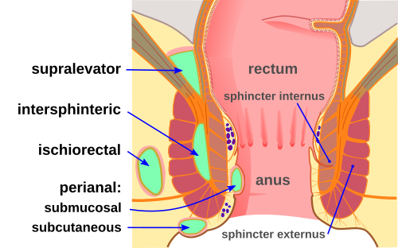
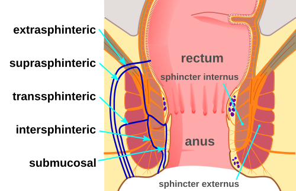

# FÍSTULAS E ABSCESSOS ANORRETAIS

Para entender as fístulas e abscessos, você precisa visualizar a anatomia anorretal não como um simples tubo, mas como um sistema de camadas e espaços. Se você compreender onde a infecção começa e por onde ela viaja, você nunca mais vai precisar decorar classificações; você vai deduzi-las.

## Anatomia Aplicada: Onde Tudo Começa

A chave de tudo está na **Linha Denteada** (ou pectínea). É aqui que desembocam as glândulas anais de Chiari, localizadas no plano interesfincteriano.

Imagine o canal anal como um sanduíche de músculos:

- **Esfíncter Anal Interno (EAI):** É a continuação da musculatura lisa do reto. É involuntário. Se você cortá-lo, o paciente ainda mantém certa continência, mas perde o ajuste fino.

- **Espaço Interesfincteriano:** É o "recheio" do sanduíche. É aqui que as glândulas moram.

- **Esfíncter Anal Externo (EAE):** É músculo estriado, voluntário. É o que segura o "aperto" final. Se você lesar este músculo significativamente, o paciente terá incontinência fecal grave.

A **Teoria Criptoglandular** explica 90% dos casos: uma cripta anal obstrui, a glândula secreta e não tem para onde sair, o muco infecta e vira um abscesso. O abscesso é a fase aguda; a fístula é a fase crônica (o "túnel" que sobrou após a drenagem).

*Figura 1 - Classificação anatômica dos abscessos anorretais: perianal, isquiorretal, interesfincteriano e supraelevador. Fonte: McortNGHH, CC BY-SA 4.0 | Wikimedia Commons*

## Abscessos Anorretais: A Urgência Cirúrgica

O abscesso anorretal é uma das poucas urgências reais na proctologia. O diagnóstico é **clínico**. Se o paciente tem dor anal intensa, pulsátil, que piora ao sentar ou evacuar, e você vê um abaulamento ou sente uma área endurecida, o diagnóstico está feito.

### Classificação dos Abscessos por Localização

A localização do abscesso depende de para onde o pus "decidiu" correr a partir do espaço interesfincteriano:

- **Perianal (60%):** O mais comum. O pus desce e aponta na borda anal. É superficial e fácil de diagnosticar.

- **Isquiorretal (20-25%):** O pus atravessa o esfíncter externo e cai na fossa isquiorretal. São abscessos grandes, profundos, que podem nem apresentar vermelhidão na pele inicialmente, mas causam muita dor profunda.

- **Interesfincteriano (5%):** O pus fica preso entre os dois músculos. O exame externo pode ser normal, mas o toque retal revela uma massa abaulando a parede do canal anal.

- **Supraelevador (4%):** O mais traiçoeiro. O pus sobe para cima do músculo levantador do ânus.

**Dica de Prova do Dr. Will:** Se a questão descreve um abscesso supraelevador, cuidado! Ele pode ser originado de uma doença intra-abdominal, como diverticulite aguda ou apendicite pélvica. Sempre exclua causas abdominais antes de assumir que é apenas "proctológico".

### Manejo do Abscesso: "Ubi pus, ibi evacua"

Aqui está o erro que faz o aluno rodar na prova e o médico errar no plantão: **esperar a flutuação**.

Em abscessos perianais, não se espera "amadurecer". Abscesso diagnosticado é abscesso drenado imediatamente. Se você esperar, o pus pode se espalhar pelos espaços profundos, levando à Síndrome de Fournier (fasciite necrotizante).

**Tabela 1: Resumo do Manejo de Abscessos**

| Tipo de Abscesso | Diagnóstico Principal | Conduta Imediata |
| --- | --- | --- |
| Perianal | Inspeção/Palpação | Drenagem sob anestesia local ou sedação |
| Isquiorretal | Toque Retal/Abaulamento | Drenagem ampla em Centro Cirúrgico |
| Interesfincteriano | Toque Retal (massa dolorosa) | Drenagem interna (pelo canal anal) |
| Supraelevador | RM ou TC de Pelve | Investigar causa abdominal + Drenagem |

**Antibioticoterapia:** Não é para todo mundo! A drenagem é o tratamento definitivo. Reservamos ATB (geralmente Ciprofloxacino + Metronidazol ou Amoxicilina + Clavulanato) para:

- Pacientes diabéticos ou imunossuprimidos.

- Sinais de celulite extensa ou sepse.

- Valvulopatias (risco de endocardite).

- Pacientes com próteses ortopédicas/valvulares.

*Figura 2 - Diagrama de fístula anal mostrando o trajeto entre o orifício interno (cripta anal) e o orifício externo na pele perianal. Fonte: McortNGHH, CC BY-SA 4.0 | Wikimedia Commons*

## Fístulas Anorretais: A Sequela Crônica

Cerca de 30% a 50% dos abscessos evoluirão para uma fístula anal. A fístula é um trajeto epitelizado que comunica o **orifício interno** (na linha denteada) com o **orifício externo** (na pele perianal).

O quadro clínico clássico é o paciente que drenou um abscesso há 2 meses e agora reclama de uma "espinha" que nunca cicatriza e fica saindo secreção purulenta ou serossanguinolenta que suja a roupa íntima.

### A Regra de Goodsall-Salmon (Ouro em Provas)

Esta regra ajuda a predizer o trajeto da fístula baseando-se na localização do orifício externo. Imagine o ânus como um relógio, com o paciente em posição de litotomia. Trace uma linha transversal dividindo o ânus em metade anterior e posterior.

- **Orifício Externo Anterior:** O trajeto costuma ser **reto** até a linha denteada.

- **Orifício Externo Posterior:** O trajeto costuma ser **curvo**, buscando a linha média posterior (6 horas).

- **A Exceção:** Se o orifício externo estiver na metade anterior, mas a **mais de 3 cm** da borda anal, ele ignora a regra e faz um trajeto curvo para a linha média posterior.

**Por que isso importa?** Porque se o cirurgião não achar o orifício interno, a fístula vai recidivar. A regra de Goodsall é o mapa da mina.

### Classificação de Parks (A Anatomia no Comando)

Esta é a classificação que as bancas amam. Ela define a fístula pela sua relação com os esfíncteres.

- **Interesfincteriana (70%):** A mais comum. O trajeto passa apenas entre os esfíncteres interno e externo. É uma fístula "baixa" e simples.

- **Transesfincteriana (25%):** O trajeto atravessa o esfíncter anal externo. Se atravessar a parte alta do músculo, é complexa; se for a parte baixa, é simples.

- **Supraesfincteriana (4%):** O trajeto sobe pelo espaço interesfincteriano, passa por cima do músculo levantador do ânus e desce para a pele.

- **Extraesfincteriana (1%):** O trajeto vai do reto para a pele, passando totalmente por fora do aparelho esfincteriano. Geralmente causada por trauma, Doença de Crohn ou iatrogenia.

**Tabela 2: Classificação de Parks e Complexidade**

| Tipo (Parks) | Frequência | Relação com Esfíncter Externo | Complexidade |
| --- | --- | --- | --- |
| Interesfincteriana | 70% | Não atravessa | Simples |
| Transesfincteriana | 25% | Atravessa o corpo do músculo | Variável |
| Supraesfincteriana | 4% | Passa por cima do levantador | Complexa |
| Extraesfincteriana | 1% | Totalmente externa | Complexa |

## Diagnóstico e Exames Complementares

Na maioria das vezes, o diagnóstico é clínico. No consultório, usamos o **estilete de fístula** (com cuidado para não criar um trajeto falso) ou a injeção de água oxigenada/azul de metileno pelo orifício externo para ver onde sai o líquido no canal anal.

**Quando pedir exames de imagem?**
Não peça RM para uma fístula interesfincteriana simples. Guarde a **Ressonância Magnética de Pelve** (padrão-ouro) para:

- Fístulas recorrentes (já operadas que voltaram).

- Suspeita de trajetos complexos ou em ferradura.

- Doença de Crohn.

- Dúvida na localização do orifício interno.

O ultrassom endoanal também é uma excelente opção, mas depende muito do examinador.

## Tratamento Cirúrgico: O Equilíbrio Delicado

O objetivo é um só: curar a fístula sem deixar o paciente incontinente. No MedEvo, sempre reforçamos que a escolha da técnica depende de quanto músculo está envolvido.

### 1. Fistulotomia e Fistulectomia

É o "abrir a fístula". Você passa um estilete pelo trajeto e corta o tecido por cima.

- **Fistulotomia:** Apenas abre o trajeto.

- **Fistulectomia:** Retira todo o trajeto (gera uma ferida maior e mais lenta para cicatrizar).

- **Indicação:** Fístulas simples (interesfincterianas ou transesfincterianas baixas) que envolvam menos de 30% do esfíncter externo.

### 2. Sedenho (Seton)

É um fio (de seda, algodão ou silicone) passado pelo trajeto da fístula.

- **Sedenho de Corte:** Apertado periodicamente para cortar o músculo lentamente. Enquanto corta, a fibrose segura o músculo, evitando a incontinência. (Caindo em desuso pelo desconforto).

- **Sedenho de Drenagem:** Mantido frouxo apenas para evitar que a pele feche e forme um novo abscesso. Essencial na **Doença de Crohn**.

### 3. Técnicas de Preservação Esfincteriana

Para fístulas complexas onde não podemos cortar o músculo:

- **LIFT (Ligation of Intersphincteric Fistula Tract):** Amarra-se o trajeto no espaço entre os esfíncteres. Sucesso de ~70%.

- **Retalho de Avanço Mucoso:** "Tapa-se" o orifício interno com um retalho de mucosa do reto.

- **Plug de Colágeno ou Cola de Fibrina:** Tenta-se selar o trajeto. Baixa taxa de sucesso, mas risco zero de incontinência.

- **VAAFT:** Tratamento de fístula assistido por vídeo.

## Situações Especiais e Pegadinhas de Prova

### Doença de Crohn Perianal

Esta é a favorita das bancas. A fístula no Crohn é diferente: ela é "fria", muitas vezes indolor, com trajetos múltiplos e cianóticos.

- **Regra de Ouro:** NUNCA faça fistulotomia em paciente com Crohn e reto inflamado. O risco de a ferida não cicatrizar e o paciente acabar com uma proctectomia (perder o reto) é altíssimo.

- **Tratamento:** Sedenho de drenagem + Terapia Biológica (Infliximabe/Adalimumabe). O objetivo é controle de sintomas, não necessariamente a cura anatômica.

### Síndrome de Fournier

É a fasciite necrotizante do períneo. É uma emergência cirúrgica extrema.

- **Clínica:** Dor desproporcional ao achado físico inicial, crepitação à palpação (gás no tecido), sinais de sepse.

- **Conduta:** Debridamento cirúrgico agressivo e imediato + Antibioticoterapia de amplo espectro. Não espere exames de imagem se a suspeita for alta.

### Hidradenite Supurativa

Muitas vezes confundida com fístulas múltiplas. A diferença é que a hidradenite é uma doença das glândulas apócrinas da pele. Não há comunicação com o canal anal (não tem orifício interno).

### Cisto Pilonidal

Ocorre na região sacrococcígea (o "rego" do bumbum), geralmente por pelos encravados. Pode formar abscessos, mas a localização é bem acima do ânus, o que o diferencia dos abscessos anorretais.

## Diagnóstico Diferencial de Dor Anal

Imagine um paciente de 40 anos com dor anal súbita. O que pode ser?

**Tabela 3: Diferenciando a Dor Anal**

| Patologia | Características da Dor | Achado ao Exame Físico |
| --- | --- | --- |
| **Abscesso Anal** | Constante, pulsátil, piora ao sentar | Abaulamento, calor, rubor, febre |
| **Fissura Anal** | "Caco de vidro" ao evacuar, dura horas | Corte na linha média (geralmente posterior) |
| **Hemorroida Trombosada** | Súbita, após esforço ou constipação | Nódulo arroxeado, tenso e doloroso na borda |
| **Proctalgia Fugaz** | Espasmo súbito, dura minutos, some do nada | Exame físico normal |

**Dica sobre Hemorroida Trombosada:** Se o paciente chegar com < 72h de dor, você pode fazer a excisão do trombo (procedimento simples). Se tiver > 72h, a dor já está melhorando e o trombo está organizando; a conduta passa a ser conservadora (banhos de assento e analgésicos).

## Pontos-Chave para Prova

- **Abscesso Anorretal:** O tratamento é drenagem imediata. Não se espera flutuação. ATB é adjuvante, não substituto.

- **Fisiopatologia:** A maioria é criptoglandular (infecção nas glândulas da linha denteada).

- **Fístula mais comum:** Interesfincteriana (Parks tipo 1).

- **Regra de Goodsall:** Orifícios posteriores = trajeto curvo para a linha média posterior. Orifícios anteriores = trajeto reto.

- **Exceção de Goodsall:** Orifício anterior a > 3 cm da borda anal = trajeto curvo para a linha média posterior.

- **Doença de Crohn:** Evitar cirurgias agressivas (fistulotomias). Preferir sedenho de drenagem e biológicos.

- **Incontinência:** O maior risco cirúrgico é a lesão do Esfíncter Anal Externo.

- **Abscesso Supraelevador:** Sempre suspeitar de foco intra-abdominal (diverticulite/apendicite).

- **Síndrome de Fournier:** Emergência! Debridamento imediato. O sinal clássico é a crepitação (gás).

- **RM de Pelve:** Exame de escolha para fístulas complexas, recorrentes ou Crohn.

- **Complicação pós-operatória mais comum:** Retenção urinária (devido ao reflexo doloroso e anestesia).

- **Fístula de alto débito:** Definida como > 500 mL/24h (mais comum em fístulas enterocutâneas, mas pode cair como conceito geral).

- **O que NÃO fazer:** Não fazer fistulotomia em fístulas que envolvam muito músculo ou em pacientes com Crohn ativo.

- **Anatomia Vascular:** Artéria retal superior (ramo da Mesentérica Inferior), Artéria retal média (ramo da Ilíaca Interna), Artéria retal inferior (ramo da Pudenda Interna).

- **Inervação:** Esfíncter externo é inervado pelo nervo pudendo (somático - voluntário). Esfíncter interno é autonômico.

Ao revisar este material, foque em entender o trajeto do pus. Se você sabe onde ele está, você sabe como drenar e como classificar a fístula que virá depois. Domine a Regra de Goodsall e a Classificação de Parks, pois elas representam 80% das questões de fístula em qualquer prova de residência.

 Cópia offline para consulta pessoal.
 Fonte original:
 [https://www.medevo.com.br/material-apoio/ler/4f66524b-4d5d-4f62-8abd-b83eb832176e](https://www.medevo.com.br/material-apoio/ler/4f66524b-4d5d-4f62-8abd-b83eb832176e)
