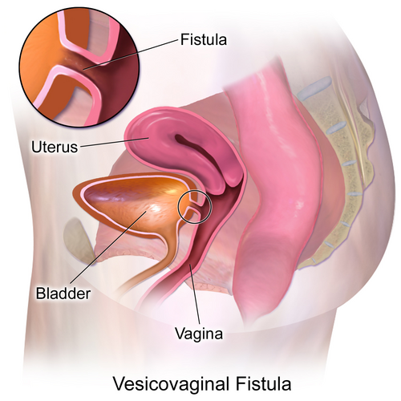
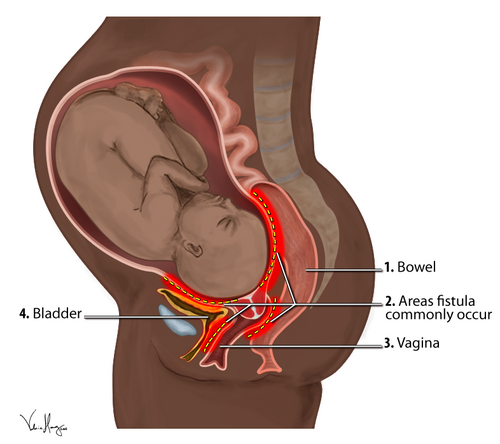

# FÍSTULAS UROGENITAIS

As fístulas urogenitais representam uma das condições mais devastadoras para a qualidade de vida da mulher. Como professor, vejo muitos alunos focarem apenas na técnica cirúrgica, mas o que as bancas de residência realmente cobram é o raciocínio diagnóstico diferencial, especialmente no pós-operatório. Entender a anatomia e o mecanismo de lesão é o que separa quem decora de quem realmente aprende.

*Figura 1 - Fístula vesicovaginal: comunicação anormal entre a bexiga e a vagina, a forma mais comum de fístula urogenital. Fonte: BruceBlaus, CC BY-SA 4.0 | Wikimedia Commons*

## Etiologia e Fisiopatologia: O Porquê do Trajeto Anômalo

Uma fístula é, por definição, uma comunicação anormal entre dois órgãos epitelizados. No sistema urogenital feminino, as mais comuns ocorrem entre a bexiga e a vagina (vesicovaginal) ou entre o ureter e a vagina (ureterovaginal).

A causa da fístula varia drasticamente conforme o contexto socioeconômico, e isso é um prato cheio para questões de prova. Em países desenvolvidos, cerca de 75% a 80% das fístulas urinárias são iatrogênicas, decorrentes de cirurgias ginecológicas pélvicas, sendo a histerectomia total abdominal a grande vilã.

Já em países subdesenvolvidos ou em áreas com assistência obstétrica precária, a principal causa é o trabalho de parto prolongado e obstruído. Aqui, o mecanismo não é o corte acidental, mas a necrose por pressão. A cabeça fetal comprime a bexiga e a uretra contra a sínfise púbica por horas, gerando isquemia tecidual, necrose e posterior queda da escara, geralmente entre o 3º e o 10º dia pós-parto.

### O Papel da Cirurgia e da Radioterapia

Nas cirurgias, a lesão pode ser direta (corte ou clampeamento) ou indireta (isquemia por desvascularização ou cauterização excessiva). A radioterapia para câncer de colo uterino é outra causa importante, gerando uma endarterite obliterante crônica. Fístulas actínicas são as mais difíceis de tratar, pois o tecido ao redor está "doente" e sem vitalidade para cicatrizar.

Cuidado com uma pegadinha de prova: embora a endometriose possa infiltrar o septo retovaginal ou a bexiga, ela raramente é a causa primária de uma fístula espontânea. Se a questão mencionar fístula e endometriose, geralmente a fístula foi complicação da cirurgia para tratar a endometriose, e não da doença em si.

## Anatomia Aplicada: Onde o Perigo se Esconde

Para entender as fístulas ureterovaginais, você precisa visualizar o trajeto do ureter na pelve. O ponto crítico, que o Dr. Will sempre enfatiza em suas discussões anatômicas, é a relação com a artéria uterina.

O ureter passa "por baixo" da artéria uterina, o famoso conceito de "água sob a ponte" (a água é o ureter, a ponte é a artéria). Durante uma histerectomia, ao realizar a ligadura dos vasos uterinos, o ureter está a apenas 1 a 2 cm do colo uterino. Se o cirurgião não realizar uma dissecção cuidadosa ou se houver sangramento que exija clampeamento às cegas, o ureter pode ser ligado, cortado ou sofrer lesão térmica.

Outro ponto de risco é o infundíbulo pélvico (ligamento suspensor do ovário), onde o ureter cruza os vasos ilíacos. Lembre-se: o ureter cruza a artéria ilíaca comum ou a ilíaca externa logo após a bifurcação da ilíaca comum. Conhecer essa relação é fundamental para identificar lesões em cirurgias de anexos.

## Fístulas Urinárias: O Desafio Diagnóstico

O quadro clínico clássico é a perda urinária contínua pela vagina. Mas atenção: nem toda perda urinária pós-operatória é fístula. O diagnóstico diferencial inclui incontinência urinária de esforço (que pode ter piorado ou surgido após a cirurgia) e urgência miccional.

### Fístula Vesicovaginal (FVV) vs. Ureterovaginal (FUV)

Esta é a distinção mais cobrada em provas. Vamos analisar a lógica:

- **Fístula Vesicovaginal:** A comunicação é entre a bexiga e a vagina. Como a bexiga é o reservatório, a urina escapa continuamente. A paciente geralmente não consegue urinar espontaneamente porque a bexiga não enche.

- **Fístula Ureterovaginal Unilateral:** O ureter de um lado está ligado à vagina, mas o outro ureter continua drenando normalmente para a bexiga. Resultado: a paciente apresenta perda urinária contínua (pela fístula), mas mantém micções normais (pela urina que vem do rim íntegro).

**Tabela 1: Diferenciação Clínica e Laboratorial**

| Característica | Fístula Vesicovaginal (FVV) | Fístula Ureterovaginal (FUV) |
| --- | --- | --- |
| **Perda Urinária** | Contínua | Contínua |
| **Micção Espontânea** | Geralmente ausente/mínima | Presente e normal |
| **Teste do Azul de Metileno** | Positivo (corante sai na vagina) | Negativo (corante fica na bexiga) |
| **Teste de Indigo Carmim (IV)** | Positivo na vagina | Positivo na vagina |
| **Urografia Excretora** | Geralmente normal | Hidronefrose ou extravasamento |

### O Teste do Azul de Metileno (Teste do Tampão)

Este é o exame padrão-ouro à beira do leito. Você coloca um tampão vaginal (ou gaze) e instila azul de metileno na bexiga através de uma sonda de Foley.

- Se o tampão sair azul: Fístula Vesicovaginal.

- Se o tampão sair molhado, mas "limpo" (cor de urina, sem o azul): Fístula Ureterovaginal.

Para confirmar a fístula ureteral nesse caso, você pode administrar Indigo Carmim por via endovenosa. Como o Indigo Carmim é filtrado pelos rins, ele corará a urina que vem do ureter lesado, e o tampão sairá azul/corado mesmo com a bexiga cheia de azul de metileno (que não passou para a vagina).

*Figura 2 - Locais de ocorrência das fístulas obstétricas: comunicações anômalas entre bexiga, vagina e intestino. Fonte: VHenryArt, CC BY-SA 4.0 | Wikimedia Commons*

## Diagnóstico por Imagem e Cistoscopia

Após a suspeita clínica, precisamos localizar a lesão com precisão.

- **Cistoscopia:** Essencial para localizar o orifício fistuloso na bexiga, avaliar a distância em relação aos meatos ureterais e verificar a saúde do tecido perilesional. Em casos de Síndrome da Bexiga Dolorosa (Cistite Intersticial), a cistoscopia pode revelar as Úlceras de Hunner, que são áreas de sangramento submucoso, mas isso é um diagnóstico diferencial de dor, não de fístula.

- **Urografia Excretora ou Tomografia com Fase Excretora (Uro-TC):** São fundamentais para avaliar a integridade dos ureteres. Se uma paciente pós-histerectomia apresenta dor lombar, febre e hidronefrose unilateral, suspeite imediatamente de pinçamento ou ligadura ureteral.

- **Cistouretrografia Miccional:** Útil para fístulas complexas ou quando há suspeita de refluxo vesicoureteral (RVU) associado. Lembre-se que o RVU crônico leva a pielonefrites de repetição e cicatrizes renais, podendo evoluir para insuficiência renal crônica.

## Fístulas Digestivas: Crohn e Trauma Obstétrico

As fístulas que comunicam o trato digestivo com a vagina ou bexiga têm etiologias específicas que você deve memorizar.

### Fístula Retovaginal

Em mulheres jovens, a causa número um é o trauma obstétrico (laceração perineal de 3º ou 4º grau não corrigida adequadamente ou que infectou). Em pacientes com múltiplas fístulas perianais, abscessos recorrentes, diarreia crônica e dor abdominal, a Doença de Crohn é a hipótese obrigatória.

A Doença de Crohn pode gerar fístulas complexas e epitelizadas. Um conceito importante do MedEvo: fístulas epitelizadas têm um trajeto revestido por epitélio, o que impede o fechamento espontâneo. Já fístulas de trajeto curto e não epitelizadas têm maior chance de cura com tratamento conservador.

### Fístula Colovesical

A tríade clássica é: Pneumatúria (ar na urina), Fecalúria (fezes na urina) e Infecções Urinárias de Repetição por germes entéricos. A causa mais comum é a Diverticulite Complicada. O processo inflamatório do cólon sigmoide "gruda" na cúpula vesical e perfura.

## Manejo e Tratamento: Quando e Como Operar?

O tratamento das fístulas urogenitais não é uma emergência cirúrgica, exceto em casos de obstrução ureteral com infecção (pielonefrite obstrutiva), onde a descompressão imediata com nefrostomia ou cateter duplo J é mandatória.

### Tratamento Conservador

Pode ser tentado em fístulas vesicovaginais muito pequenas (menores que 0,5 cm) e diagnosticadas precocemente (nas primeiras 48 horas). Consiste em cateterismo vesical prolongado (sonda de Foley) por 2 a 4 semanas, na esperança de que o trajeto feche por segunda intenção. Fístulas digestivas cervicais de baixo débito (como as que drenam saliva) também têm boa resposta ao manejo conservador.

### Tratamento Cirúrgico

Para a maioria das fístulas estabelecidas, a cirurgia é o caminho. O segredo é o "timing". Não se opera tecido inflamado, infectado ou isquêmico. Geralmente, aguarda-se de 3 a 6 meses após a lesão inicial para que a inflamação ceda e a vascularização melhore.

Os princípios básicos da correção cirúrgica (Técnica de Martius e outros) incluem:

- Excisão do trajeto fistuloso (embora alguns autores defendam apenas a técnica de sobreposição).

- Mobilização adequada dos tecidos para permitir sutura sem tensão.

- Interposição de tecido saudável e bem vascularizado (como o retalho de gordura do grande lábio, conhecido como Retalho de Martius).

- Drenagem urinária contínua no pós-operatório para evitar distensão da linha de sutura.

### Lesão Ureteral Intraoperatória

Se você perceber que ligou ou cortou o ureter durante a cirurgia, o tratamento é imediato:

- **Lesão no terço distal:** Ureteroneocistostomia (reimplante do ureter na bexiga).

- **Lesão no terço médio/superior:** Uretero-ureterostomia (anastomose término-terminal sobre um cateter duplo J).

Se a lesão só for percebida dias depois e houver ureterohidronefrose com febre, a conduta é estabilizar a paciente, drenar o rim (nefrostomia) e programar a correção definitiva meses depois.

## Situações Especiais e Complicações Fetais

Em contextos de obstetrícia extrema, onde o feto já está morto e há uma distocia de ombro grave impossibilitando o parto vaginal, podem ser realizadas manobras destrutivas fetais para salvar a mãe. A clidotomia (seccionamento da clavícula fetal) é um exemplo. Embora raras hoje, essas manobras e o próprio trabalho de parto prolongado são os precursores das fístulas por necrose de pressão que discutimos.

No trauma pélvico (fraturas de pelve), a lesão de uretra posterior (membranosa) é uma preocupação. Os sinais clássicos são uretrorragia (sangue no meato), hematoma perineal e bexigoma. Nesses casos, a sondagem vesical é contraindicada antes da realização de uma uretrografia retrógrada para avaliar a integridade da uretra.

**Tabela 2: Resumo de Condutas por Tipo de Fístula**

| Tipo de Fístula | Causa Principal | Exame Chave | Conduta Inicial |
| --- | --- | --- | --- |
| **Vesicovaginal** | Histerectomia (Países Desenv.) | Azul de Metileno | Sonda de Foley ou Cirurgia tardia |
| **Ureterovaginal** | Histerectomia / Wertheim-Meigs | Urografia Excretora | Cateter Duplo J ou Reimplante |
| **Colovesical** | Diverticulite | Tomografia / Enema | Ressecção do cólon + fechamento bexiga |
| **Retovaginal** | Trauma Obstétrico / Crohn | Exame Físico / Colonoscopia | Dieta/Medicamentoso (Crohn) ou Cirurgia |

*Figura 2 - Locais de ocorrência das fístulas obstétricas: comunicações anômalas entre bexiga, vagina e intestino. Fonte: VHenryArt, CC BY-SA 4.0 | Wikimedia Commons*

## Diagnóstico Diferencial de Perda Líquida Vaginal

Muitas vezes, a paciente chega com queixa de "vagina úmida" após uma cirurgia. O médico deve ser sistemático.

- **Incontinência Urinária de Esforço:** Perda aos esforços (tosse, riso). Teste do esforço positivo.

- **Incontinência por Urgência:** Perda precedida de desejo miccional súbito.

- **Linfocisto ou Seroma:** Acúmulo de fluido linfático pós-linfadenectomia (comum em cirurgias oncológicas como Wertheim-Meigs) que pode drenar pela cúpula vaginal. O líquido terá características de linfa, não de urina (dosagem de creatinina no líquido vaginal ajuda: se for igual à sérica, é linfa; se for muito superior, é urina).

- **Fístula Urinária:** Perda contínua, independente de esforço, geralmente surgindo 7 a 14 dias após a cirurgia.

Erro clássico de prova: achar que toda perda urinária pós-histerectomia é fístula vesicovaginal. Se a paciente opera um câncer de colo (Wertheim-Meigs), a dissecção ureteral é extensa. A fístula ureterovaginal torna-se muito provável devido à desvascularização do ureter.

## Pontos-Chave para Prova

- **Causa mais comum no Brasil (geral):** Iatrogenia cirúrgica (Histerectomia).

- **Causa mais comum em países subdesenvolvidos:** Trabalho de parto prolongado (necrose por pressão).

- **Fístula Ureterovaginal Unilateral:** Perda contínua de urina + Micções normais.

- **Teste do Azul de Metileno:** Se positivo na vagina, a fístula é VESICAL. Se negativo mas a vagina está úmida, a fístula é URETERAL.

- **Urografia Excretora:** Exame de escolha inicial para suspeita de fístula ureterovaginal ou lesão ureteral pós-operatória.

- **Pneumatúria e Fecalúria:** Patognomônico de fístula colovesical (causa principal: diverticulite).

- **Doença de Crohn:** Suspeitar em casos de fístulas perianais ou retovaginais complexas, recidivantes e associadas a sintomas intestinais.

- **Anatomia:** O ureter passa posterior (por baixo) à artéria uterina.

- **Tratamento de Lesão Ureteral Distal:** Ureteroneocistostomia (reimplante).

- **Timing Cirúrgico:** Geralmente 3 a 6 meses após a lesão para garantir tecidos sadios.

- **Úlcera de Hunner:** Achado de cistoscopia na Cistite Intersticial, não é fístula.

- **Clidotomia:** Manobra destrutiva fetal (seccionamento da clavícula) para distocia de ombro em feto morto.

- **Trauma Pélvico + Uretrorragia:** Suspeitar de lesão de uretra membranosa; não passar sonda de Foley antes de uretrografia.

- **Fístula Vesicouterina (Síndrome de Youssef):** Causa menúria (saída de sangue menstrual pela urina) e amenorreia aparente.

- **Contraindicação Absoluta:** Não realizar correção cirúrgica de fístula em vigência de infecção urinária ativa ou processo inflamatório agudo intenso.

- **Primeira Escolha em Obstrução Ureteral Febril:** Nefrostomia percutânea de urgência. 🩺

 Cópia offline para consulta pessoal.
 Fonte original:
 [https://www.medevo.com.br/material-apoio/ler/bcfc3ad1-0be4-427e-9f8d-654eae2a34e2](https://www.medevo.com.br/material-apoio/ler/bcfc3ad1-0be4-427e-9f8d-654eae2a34e2)
