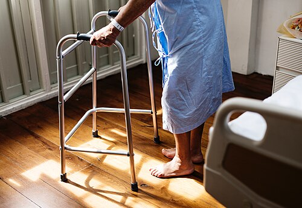

# FRAGILIDADE E SARCOPENIA

Para entender a saúde do idoso em provas de residência, é necessário mudar o foco exclusivo da doença e valorizar a **capacidade funcional**. No idoso, o que define o prognóstico não é se ele tem hipertensão ou diabetes, mas sim se ele consegue amarrar o próprio sapato ou gerenciar suas finanças.

A fragilidade e a sarcopenia são os pilares que sustentam essa funcionalidade. Se o músculo falha (sarcopenia), o idoso perde a reserva para lidar com estressores (fragilidade). É um efeito dominó que leva ao desfecho que toda banca adora cobrar: a perda da autonomia e da independência.

A imagem a seguir ilustra exatamente esse cenário — uma idosa utilizando andador para manter sua mobilidade, demonstrando como a fragilidade impacta diretamente a independência funcional:

*Figura 1 - Idosa utilizando andador para sustentar a deambulação: a fragilidade leva progressivamente à perda da independência funcional, tornando o idoso dependente de dispositivos auxiliares e, eventualmente, de cuidadores. Fonte: Rawpixel, CC0 (Domínio Público) | Wikimedia Commons*

## O Conceito de Funcionalidade e a Transição Epidemiológica

Antes de entrarmos nos critérios, entenda o contexto. O Brasil vive um envelhecimento populacional acelerado. Isso traz o conceito de **compressão de morbidade**, que é o objetivo ideal da geriatria: postergar o início das doenças crônicas e da incapacidade para o finalzinho da vida, reduzindo o tempo que o idoso passa dependente.

Muitos alunos erram questões por não diferenciarem dois conceitos básicos:

- **Autonomia:** É a capacidade de decisão, de autogoverno. Está ligada ao cognitivo.

- **Independência:** É a capacidade de execução, de realizar a tarefa sozinho. Está ligada ao motor/funcional.

Um idoso com Alzheimer inicial pode ter independência física (consegue andar e se vestir), mas já perdeu a autonomia (não consegue mais decidir sobre seu tratamento ou finanças). Já um idoso com sequela grave de AVC pode ter autonomia preservada (decide tudo), mas é totalmente dependente fisicamente.

O esquema abaixo substitui a imagem de atrofia muscular por uma representação textual legível do raciocínio clínico:

Músculo preservado
força adequada + massa muscular suficiente + marcha estável
 │
 ▼
Envelhecimento, inflamação crônica, desuso, baixa ingestão proteica
 │
 ▼
Sarcopenia
queda de força → perda de massa → pior desempenho físico
 │
 ▼
Fragilidade
menor reserva funcional + maior risco de quedas, internação e dependência

*Esquema autoral — A sarcopenia começa pela perda de força e evolui com perda de massa e pior desempenho. Esse processo reduz a reserva funcional e facilita a transição para fragilidade.*

## Sarcopenia: A Falência Muscular

A sarcopenia não é apenas "ter pouco músculo". É uma síndrome muscular generalizada e progressiva. Por que o idoso perde músculo? Com o envelhecimento fisiológico (senescência), há um aumento da gordura corporal, redução da massa magra e redução da água intracelular.

Mas a sarcopenia vai além da fisiologia. Ela envolve inflamação crônica (o chamado *inflammaging*), redução de hormônios anabólicos (testosterona, GH) e a **resistência anabólica**, onde o músculo do idoso não responde tão bem ao estímulo da proteína e do exercício quanto o de um jovem.

### Critérios Diagnósticos (EWGSOP2)

O Consenso Europeu de Sarcopenia (EWGSOP2) é referência importante. A mudança central é: **a força passou a ter maior peso diagnóstico que a massa muscular**.

A classificação segue este fluxo:

- **Provável Sarcopenia:** Força muscular reduzida.

- **Sarcopenia Confirmada:** Força reduzida + Baixa quantidade ou qualidade muscular.

- **Sarcopenia Grave:** Força reduzida + Baixa quantidade/qualidade + Baixo desempenho físico.

#### Valores de Referência mais cobrados:

| Parâmetro | Ferramenta | Ponto de Corte (Homens) | Ponto de Corte (Mulheres) |
| --- | --- | --- | --- |
| **Força** | Dinamometria (Preensão Manual) | < 27 kg | < 16 kg |
| **Força** | Sentar e Levantar (5 vezes) | > 15 segundos | > 15 segundos |
| **Massa** | Apêndice (Massa Muscular Esquelética) | < 20 kg | < 15 kg |
| **Desempenho** | Velocidade de Marcha | ≤ 0,8 m/s | ≤ 0,8 m/s |

**Ponto de prova:** o **Teste de Sentar e Levantar da Cadeira de 30 segundos** avalia força e resistência dos membros inferiores, sendo bom preditor de risco de quedas.

## Fragilidade: A Síndrome da Vulnerabilidade

A fragilidade é um estado de vulnerabilidade biológica. Imagine dois idosos de 80 anos que pegam uma pneumonia. O idoso "robusto" toma antibiótico e volta ao normal. O idoso "frágil" toma o mesmo antibiótico, mas desenvolve delirium, para de comer, perde força, cai, quebra o fêmur e nunca mais volta a andar.

A fragilidade é a perda da homeostase. O idoso está no limite; qualquer estresse mínimo o empurra para o abismo da dependência.

### O Fenótipo de Fried

Este é o modelo mais cobrado em provas. Fried descreveu um ciclo de fragilidade baseado em 5 critérios objetivos:

- **Perda de peso não intencional:** > 4,5 kg ou > 5% do peso corporal no último ano.

- **Exaustão (Fadiga):** Autorrelato de que "tudo o que fazia exigia grande esforço".

- **Baixa força de preensão manual:** Medida por dinamômetro (ajustada por sexo e IMC).

- **Baixa velocidade de marcha:** Tempo para percorrer 4,6 metros (ajustada por sexo e altura).

- **Baixo nível de atividade física:** Medido pelo gasto calórico semanal.

**Classificação de Fried:**

- **0 critérios:** Idoso Robusto.

- **1 a 2 critérios:** Idoso Pré-frágil.

- **3 ou mais critérios:** Idoso Frágil.

**Pegadinha de prova:** A banca pode tentar confundir fragilidade com comorbidade ou incapacidade. Lembre-se: fragilidade é um **estado de risco**, não é sinônimo de estar doente. Um idoso pode ser frágil sem ter uma doença crônica descompensada no momento.

### O Índice de Vulnerabilidade Clínico-Funcional (IVCF-20)

Na Atenção Primária à Saúde (APS) no Brasil, utilizamos muito o IVCF-20, presente na Caderneta de Saúde da Pessoa Idosa. Ele é um questionário de 20 questões que rastreia: idade, autopercepção da saúde, AVDs, cognição, humor, mobilidade, comunicação e comorbidades.

- Pontuação > 15 indica alta vulnerabilidade (idoso frágil).

- É uma ferramenta de rastreio oportunista essencial para o planejamento do cuidado individualizado.

## Avaliação Geriátrica Ampla (AGA)

A AGA é o "padrão-ouro" da avaliação do idoso. Ela não é um exame físico comum; é uma abordagem multidimensional que inclui a parte física, mental, social e funcional. A AGA deve ser realizada sempre que houver suspeita de declínio funcional ou em idosos frágeis.

### Avaliação Funcional

As escalas de funcionalidade são muito cobradas. A diferença entre AVD e AIVD deve estar clara.

-

**Atividades Básicas de Vida Diária (AVD) - Escala de Katz:**

- Avalia o autocuidado (o "núcleo duro" da sobrevivência).

- Itens: Banho, vestir-se, higiene pessoal, transferência, continência e alimentação.

- A perda segue uma ordem inversa ao desenvolvimento infantil (o idoso para de tomar banho sozinho antes de parar de comer sozinho).

-

**Atividades Instrumentais de Vida Diária (AIVD) - Escala de Lawton e Brody:**

- Avalia a capacidade do idoso de viver sozinho na comunidade. São atividades mais complexas.

- Itens: Usar telefone, fazer compras, preparar refeições, arrumar a casa, lavar roupa, usar transporte, gerenciar medicamentos e gerenciar finanças.

- **Pérola Clínica:** As AIVDs são as primeiras a serem perdidas no comprometimento cognitivo leve ou demência inicial. Se o idoso tem um MEEM de 25 (aparentemente normal), mas a família diz que ele não consegue mais cuidar do dinheiro, abra o olho para demência.

### Avaliação Cognitiva e de Humor

- **Mini Exame do Estado Mental (MEEM):** Ferramenta de rastreio cognitivo. O ponto de corte varia com a escolaridade (analfabetos: 20; 1 a 4 anos: 25; 5 a 8 anos: 26; > 9 anos: 28 - valores podem variar levemente conforme a referência, mas a lógica da escolaridade é a regra).

- **Escala de Depressão Geriátrica (GDS-15):** Rastreia sintomas depressivos. Lembre-se que a depressão no idoso é atípica: muitas queixas somáticas, fadiga e "pseudodemência" (queixas cognitivas que melhoram com o tratamento da depressão).

## Fisiopatologia: O Porquê da Fragilidade

Por que o idoso entra nesse ciclo? Existe uma tríade de alterações:

- **Sarcopenia:** Perda de massa e força (motor).

- **Disfunção Neuroendócrina:** Queda de hormônios sexuais e DHEA, aumento do cortisol.

- **Disfunção Imunológica:** Estado pró-inflamatório crônico (aumento de IL-6 e TNF-alfa).

Isso gera um balanço energético negativo. O idoso come menos (anorexia do envelhecimento), gasta menos energia porque se move menos, e o pouco que come não vira músculo devido à resistência anabólica. O resultado é a queda da taxa metabólica basal e a exaustão.

## Diagnóstico Diferencial e Manifestações Atípicas

No idoso, as doenças não leem o livro-texto. A "regra de ouro" da geriatria é: qualquer doença aguda (infecção, infarto, desidratação) pode se manifestar como uma das **Síndromes Geriátricas** (os "Is" da Geriatria):

- **I**nstabilidade postural (quedas).

- **I**mobilidade.

- **I**ncontinência (urinária/fecal).

- **I**nsuficiência cognitiva (delirium/demência).

- **I**atrogenia (polifarmácia).

**Exemplo Clínico:** Uma idosa de 82 anos, frágil, apresenta-se com confusão mental súbita e duas quedas em 24 horas. Ela não tem febre nem tosse. O que investigar? **Infecção Urinária (ITU)**. No idoso frágil, a queda e o delirium costumam ser os únicos sinais de infecção.

## Manejo Terapêutico: O que realmente funciona?

Se a prova perguntar qual a intervenção mais efetiva para um idoso frágil ou sarcopênico, a resposta é uma só: **Exercício Físico Resistido (Musculação)**.

### Tratamento Não-Farmacológico

-

**Exercício Físico:**

- Deve ser multicomponente (força, equilíbrio e aeróbico).

- O foco principal é o **treinamento de resistência** (peso).

- Frequência: Pelo menos 2 a 3 vezes por semana.

- Intensidade: Progressiva, visando ganho de força e potência.

-

**Nutrição:**

- Aporte proteico: 1,2 a 1,5 g de proteína por kg de peso/dia. (Em jovens é 0,8g/kg).

- Por que tanto? Para vencer a resistência anabólica.

- Vitamina D: Repor apenas se houver deficiência (< 30 ng/mL em idosos de risco). A meta é manter níveis adequados para saúde óssea e muscular.

-

**Prevenção de Quedas:**

- Revisão da polifarmácia (retirar benzodiazepínicos, anti-hipertensivos em excesso).

- Adaptação ambiental (retirar tapetes, melhorar iluminação, barras no banheiro).

- Corte correto das unhas e calçados adequados.

### Tratamento Farmacológico e Iatrogenia

**Cuidado:** Não existe "pílula para sarcopenia". Testosterona e GH não são recomendados rotineiramente devido aos efeitos colaterais (risco cardiovascular, câncer de próstata).

O foco aqui é a **Prevenção Quaternária**: evitar o excesso de intervenções médicas e a cascata de prescrição.

- **Polifarmácia:** Uso de 5 ou mais medicamentos. No idoso, isso aumenta drasticamente o risco de quedas e interações medicamentosas.

- **Desprescrição:** É uma conduta ativa. Se o idoso tem demência avançada e polifarmácia, o foco deve ser o conforto. Estatinas e rastreios oncológicos agressivos perdem o sentido se a expectativa de vida é curta.

| Situação Clínica | Conduta de Primeira Escolha |
| --- | --- |
| Sarcopenia Confirmada | Exercício resistido + Aporte proteico (1.2-1.5g/kg) |
| Incontinência de Esforço | Treinamento do assoalho pélvico (Fisioterapia) |
| Delirium Agudo | Identificar e tratar a causa base (ex: infecção, dor) |
| Depressão no Idoso | ISRS (Sertralina/Escitalopram) em dose baixa e titulação lenta |
| Risco de Quedas | Exercício multicomponente + Revisão de medicação |

## Situações Especiais e Terminalidade

### O Papel do Cuidador

Muitas questões focam no **Apoio Psicossocial ao Cuidador**. O cuidador informal (geralmente a esposa ou filha) tem alto risco de depressão e exaustão. A **Escala de Zarit** é usada para avaliar essa sobrecarga. Se o cuidador adoece, o idoso é institucionalizado.

### Cuidados Paliativos

Em idosos com fragilidade extrema ou demência avançada (que não reconhecem familiares, restritos ao leito, disfagia grave), a gastrostomia (GTT) deve ser evitada. A diretriz sugere que a GTT não previne pneumonia por aspiração nem aumenta a sobrevida nesses casos. O foco deve ser o conforto e a alimentação assistida por prazer.

### Violência contra o Idoso

Suspeita de negligência ou abuso (hematomas em várias fases de cicatrização, desidratação inexplicada, higiene precária) exige **notificação compulsória**. A situação deve ser notificada à Vigilância Epidemiológica e comunicada ao Ministério Público, autoridade policial ou Conselho do Idoso.

## Fatores de Risco para Quedas

As quedas são o evento sentinela da fragilidade. Elas se dividem em:

- **Fatores Intrínsecos:** Idade avançada, sexo feminino, história prévia de quedas, sarcopenia, déficit visual/auditivo, tontura, polifarmácia.

- **Fatores Extrínsecos:** Iluminação ruim, tapetes soltos, calçados inadequados, degraus sem corrimão.

**Ponto de prova:** queda da própria altura com fratura de fêmur é fratura por fragilidade. A conduta inclui investigar osteoporose com densitometria óssea e iniciar tratamento quando indicado, além de corrigir vitamina D e cálcio se necessário.

## Pontos-Chave para Prova

- **Sarcopenia (EWGSOP2):** O diagnóstico começa pela **força** (Dinamometria: H < 27kg, M < 16kg). Massa muscular confirma, velocidade de marcha define gravidade.

- **Fragilidade (Fried):** 5 critérios (Perda de peso, exaustão, força, marcha, atividade física). ≥ 3 é frágil.

- **AVD vs AIVD:** Lawton (Instrumentais - ex: finanças) é mais complexo e perde primeiro. Katz (Básicas - ex: banho) é o último a ser perdido.

- **Velocidade de Marcha:** O ponto de corte clássico para risco de desfechos adversos é **≤ 0,8 m/s**.

- **Exercício Resistido:** É a intervenção isolada mais eficaz para reverter pré-fragilidade e tratar sarcopenia.

- **Aporte Proteico:** Idosos precisam de mais proteína que jovens (1,2 a 1,5 g/kg/dia) para combater a resistência anabólica.

- **Polifarmácia:** Uso de ≥ 5 fármacos. Sempre revisar medicações em caso de quedas ou declínio cognitivo.

- **Delirium:** É a manifestação clínica mais comum de doenças agudas no idoso frágil.

- **Prevenção Quaternária:** Evitar iatrogenia. No idoso muito idoso (> 80 anos), metas de PA e Glicemia (DM2) são mais flexíveis para evitar hipotensão e hipoglicemia.

- **Notificação de Violência:** É compulsória em caso de suspeita. Não precisa de confirmação para notificar.

- **GTT na Demência Avançada:** Contraindicada pela maioria das diretrizes geriátricas; não melhora sobrevida e aumenta desconforto.

- **Vitamina D:** Meta para idosos frágeis/risco de quedas é manter acima de 30 ng/mL.

- **Escala de Zarit:** Avalia sobrecarga do cuidador. Fundamental na abordagem familiar.

- **IVCF-20:** Principal ferramenta de rastreio de fragilidade na Atenção Primária brasileira.

- **Corte de Unhas:** Deve ser feito de forma quadrada para evitar onicocriptose e infecções que podem levar à imobilidade.

- **Vacinação:** Influenza é anual e obrigatória para reduzir complicações respiratórias e descompensação de fragilidade. 💡

 Cópia offline para consulta pessoal.
 Fonte original:
 [https://www.medevo.com.br/material-apoio/ler/aa691964-a50b-4438-83f2-65be6daef83b](https://www.medevo.com.br/material-apoio/ler/aa691964-a50b-4438-83f2-65be6daef83b)
