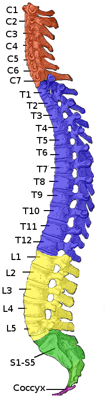
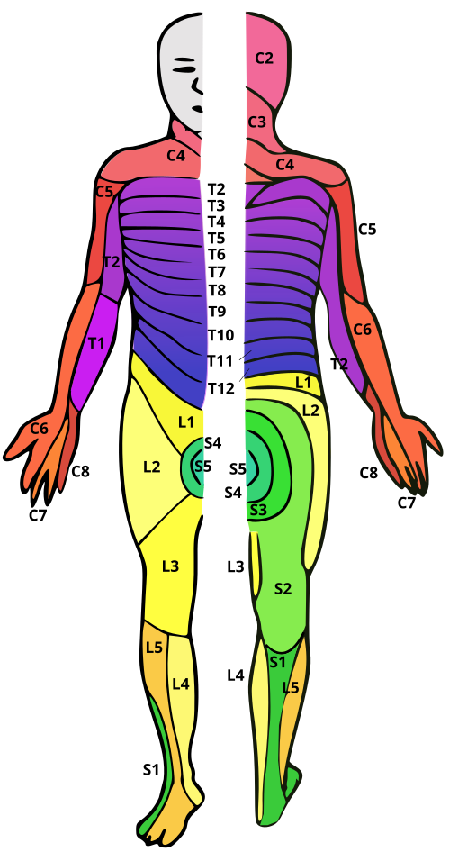

# FRATURAS DA COLUNA

Para entender fraturas da coluna, você precisa parar de ver a vértebra como um osso isolado e passar a vê-la como parte de um sistema de proteção e suporte. Nas provas de residência, o examinador não quer apenas que você saiba o nome da fratura; ele quer saber se você consegue identificar se aquela coluna vai "aguentar o tranco" (estabilidade) ou se o paciente corre o risco de nunca mais andar (déficit neurológico).

*Figura 1 - Coluna vertebral com destaque para as regiões cervical, torácica, lombar e sacral. Identificar o segmento afetado é fundamental no manejo das fraturas. Fonte: Henry Vandyke Carter, Domínio Público | Wikimedia Commons*

## Anatomia Funcional e o Exame Neurológico: A Base de Tudo

Antes de falarmos de osso quebrado, precisamos falar do que passa por dentro dele. A maioria das questões de prova sobre coluna foca no exame físico. Por quê? Porque no trauma, o tempo é neurônio.

### Miótomos e Dermatômos: O Mapa da Mina

Você precisa decorar os níveis críticos. Se o paciente chega com um trauma e não consegue fazer determinado movimento, você já sabe onde está a lesão antes mesmo do RX.

- **L4:** Responsável pela extensão do joelho. O reflexo é o **patelar**.

- **L5:** É a queridinha das bancas. Responsável pela **dorsiflexão do pé** (levantar a ponta do pé) e do hálux.

- **Dica de Prova:** Se o paciente tem dificuldade para a **marcha sobre os calcanhares**, a lesão é em L5.

- **Cuidado:** L5 não tem um reflexo tendinoso exuberante para testarmos, por isso focamos na força da dorsiflexão.

- **S1:** Responsável pela flexão plantar.

- **Dica de Prova:** Dificuldade para **andar na ponta dos pés**? A raiz comprometida é S1. O reflexo aqui é o **aquileu**.

### Radiculopatia vs. Mielopatia

Muitos alunos confundem isso.

- **Radiculopatia:** É a compressão da raiz (ex: Hérnia de disco L4-L5 comprimindo L5). O sintoma é periférico, segue o dermátomo, geralmente unilateral.

- **Mielopatia:** É a compressão da medula. Aqui o buraco é mais embaixo (ou melhor, mais em cima). Você verá sinais de liberação piramidal: hiperreflexia, Babinski positivo e espasticidade.

**Exemplo Clínico:** Um paciente com hérnia de disco L4-L5 terá dor irradiada para a face lateral da perna e dorso do pé, com fraqueza para levantar o dedão (L5), mas os reflexos patelar (L4) e aquileu (S1) estarão **preservados**. Se a alternativa disser que o reflexo aquileu está abolido em uma hérnia L4-L5, ela está errada!

## Trauma Raquimedular (TRM) e Choques

No pronto-socorro, você encontrará dois tipos de "choque" que confundem todo mundo. Como o Dr. Will sempre reforça em nossas mentorias na MedEvo: "Choque neurogênico é hemodinâmica; choque medular é reflexo".

### Choque Neurogênico

Ocorre em lesões acima de T6. Há uma perda do tônus simpático.

- **O que você vê:** Hipotensão + **Bradicardia**.

- **Por que isso cai?** Porque no choque hipovolêmico (o mais comum no trauma), o paciente está hipotenso mas **taquicárdico**. Se o paciente está chocado e o coração não acelerou para compensar, pense em choque neurogênico.

### Choque Medular

Não é um choque circulatório, é um estado de "atordoamento" da medula.

- **O que você vê:** Arreflexia total e paralisia flácida abaixo do nível da lesão.

- **Como saber se acabou?** O retorno do **reflexo bulbocavernoso** marca o fim do choque medular. Só podemos definir o prognóstico neurológico definitivo após o fim do choque medular.

| Característica | Choque Neurogênico | Choque Medular |
| --- | --- | --- |
| **Definição** | Perda do tônus simpático (hemodinâmico) | Estado fisiológico de depressão medular (elétrico) |
| **Pressão Arterial** | Hipotensão | Pode estar normal |
| **Frequência Cardíaca** | Bradicardia | Normal |
| **Reflexos** | Podem estar presentes | Ausentes (Arreflexia) |
| **Duração** | Dias a semanas | 24 a 48 horas |

*Figura 2 - Dermátomos humanos: territórios cutâneos inervados por cada raiz nervosa espinhal, ferramenta essencial para localizar o nível da lesão medular. Fonte: Ralf Stephan, Domínio Público | Wikimedia Commons*

## Fraturas da Coluna Cervical

A coluna cervical é a parte mais móvel e, por isso, a mais vulnerável. Vamos focar em C2 (Áxis), que é recordista de questões.

### Fratura do Áxis (C2)

Existem dois tipos principais que você deve dominar:

- **Fratura do Processo Odontoide:** É a mais comum de C2. O mecanismo geralmente é flexão ou extensão forçada.

- **Fratura do Enforcado (Hangman's Fracture):** Também chamada de espondilolistese traumática de C2.

- **Mecanismo:** Hiperextensão e distração (clássico em acidentes de carro onde o queixo bate no painel).

- **Anatomia:** Ocorre a fratura da **pars interarticularis** de C2.

- **Pérola de Prova:** Apesar do nome assustador, ela costuma ter um **bom prognóstico neurológico**. Por quê? Porque o canal vertebral nesse nível é largo e a fratura acaba "alargando" o espaço, diminuindo a chance de compressão medular direta.

### Estabilidade Cervical

Sempre que atender um trauma, a imobilização rígida é mandatória até que a lesão seja excluída. A avaliação secundária no trauma é o momento de palpar a linha média posterior da coluna. Se houver dor ou "degrau", a imobilização continua e partimos para imagem.

## Fraturas Toracolombar

A transição toracolombar (T10 a L2) é onde ocorre a maioria das fraturas. É o ponto de encontro entre a coluna torácica rígida (pelas costelas) e a coluna lombar móvel.

### Mecanismos de Trauma

- **Queda de altura em ortostase:** O paciente cai de pé. Isso gera uma carga axial.

- **O que procurar:** Além da coluna toracolombar (fratura em explosão), procure fraturas de calcâneo, platô tibial e quadril. Se a prova te der um paciente que caiu de um muro e quebrou o calcanhar, você **deve** pedir RX de coluna.

### Classificação AO (Simplificada para Prova)

A classificação AO divide as lesões pelo mecanismo:

- **Tipo A (Compressão):** A vértebra é "esmagada". Se for só a parte anterior, é encunhamento. Se for o corpo todo, é explosão.

- **Tipo B (Distração):** A coluna é "esticada", geralmente rompendo os ligamentos posteriores (ex: lesão do cinto de segurança).

- **Tipo C (Translação/Rotação):** É o pior cenário. Uma vértebra "escorrega" sobre a outra. Altíssima instabilidade e risco neurológico.

### TLICS (Thoracolumbar Injury Classification and Severity Score)

As bancas amam o TLICS porque ele define a conduta (Cirurgia vs. Conservador). Ele avalia três pontos:

- Mecanismo da fratura.

- Integridade do Complexo Ligamentar Posterior (CLP).

- Status neurológico.

**Regra de Ouro:**

- Score ≤ 3: Tratamento conservador.

- Score = 4: Critério do cirurgião.

- Score ≥ 5: Tratamento cirúrgico.

## Patologias Infecciosas e Inflamatórias: O "Mal de Pott" e Outras

Nem toda fratura é traumática. Algumas são patológicas.

### Tuberculose Vertebral (Mal de Pott)

A tuberculose extrapulmonar adora a coluna, especialmente a transição toracolombar.

- **Quadro Clínico:** Dor dorsolombar crônica + febre vespertina + emagrecimento + sudorese noturna (sintomas constitucionais).

- **Imagem:** Destruição do corpo vertebral e do disco (espondilodiscite). Pode formar o "abscesso frio" (coleção paravertebral sem sinais inflamatórios agudos).

- **Dica de Prova:** Se o RX mostra destruição vertebral em paciente com história de tosse crônica ou emagrecimento, marque Mal de Pott sem medo.

### Espondilite Anquilosante

Paciente jovem, sexo masculino, com dor lombar de caráter **inflamatório** (piora com o repouso, melhora com exercício) e rigidez matinal.

- **Achado clássico:** Sacroileíte bilateral no RX ou RM.

- **Testes:** Gaenslen e Patrick (FABER) são usados para avaliar a articulação sacroilíaca. Se positivos, sugerem sacroileíte.

## O Trauma Pélvico e Acetabular

Embora tecnicamente não sejam "coluna", as lesões de bacia estão intimamente ligadas e caem no mesmo bloco de questões.

### Instabilidade Hemodinâmica

Fratura de bacia no politraumatizado é sinônimo de sangramento retroperitoneal.

- **Conduta Inicial:** Fechamento da bacia com lençol ou cinta pélvica (ao nível dos trocanteres maiores, não na crista ilíaca!).

- **Sinal de Instabilidade Mecânica:** Avulsão do processo transverso de L5 no RX. Se você vir isso, saiba que a energia do trauma foi alta o suficiente para arrancar um pedaço do osso através dos ligamentos, indicando que o anel pélvico está instável.

### Complicações

- **Imediatas:** Hemorragia, lesão de uretra (comum em fraturas em "livro aberto"), lesão nervosa.

- **Tardias:** Pseudoartrose (falha na consolidação), dor crônica, disfunção sexual.

## Diagnóstico por Imagem: O que pedir?

Muitos alunos erram por não saber a indicação correta de cada exame.

- **Radiografia (RX):** É o rastreio inicial. Bom para ver alinhamento e fraturas grosseiras.

- **Tomografia Computadorizada (TC):** O padrão-ouro para avaliar a **parte óssea**. Se você quer ver se a fratura é em explosão ou se há fragmento ósseo no canal, a TC é o exame.

- **Ressonância Magnética (RM):** Insuperável para **partes moles**.

- **Quando pedir:** Suspeita de lesão medular, hérnia de disco, lesão ligamentar ou para ver o "edema" ósseo em fraturas ocultas. Se o paciente tem déficit neurológico mas a TC é normal, a RM é obrigatória.

| Exame | Melhor para... | Limitação |
| --- | --- | --- |
| **RX** | Triagem rápida, alinhamento global | Baixa sensibilidade para fraturas pequenas |
| **TC** | Detalhe ósseo, planejamento cirúrgico | Não avalia bem medula e ligamentos |
| **RM** | Medula, nervos, discos, ligamentos | Demorado, caro, contraindicado em metais ferromagnéticos |

## Manejo e Complicações Pós-Cirúrgicas

A segurança do paciente é tema recorrente. A Lista de Verificação de Segurança Cirúrgica da OMS (Checklist) deve ser seguida. O "Time Out" ocorre **antes da incisão** e inclui a confirmação da esterilização dos materiais e a identificação correta do nível vertebral (um erro clássico em cirurgia de coluna é operar o nível errado).

### Síndrome Compartimental

Pode ocorrer após traumas de membros inferiores associados ou após reparos vasculares (lesão de artéria femoral, por exemplo).

- **Sinais:** Dor desproporcional ao trauma, parestesia, dor à extensão passiva dos dedos.

- **Conduta:** Fasciotomia imediata. Não espere o pulso sumir, pois o pulso é o último sinal a desaparecer.

### Pseudoartrose

É a falha da consolidação óssea após 6 meses. Na coluna, isso gera dor crônica e falha do material de síntese (os parafusos quebram ou soltam). É uma complicação tardia importante em fraturas acetabulares e de coluna.

## Diferenciais Abdominais no Trauma

Aqui entra a famosa **Classificação Kaiser para Apendicite**. Você pode se perguntar: "O que isso tem a ver com coluna?". No trauma de alta energia, o paciente pode ter uma apendicite traumática ou, mais comum, uma dor abdominal que mascara uma fratura de coluna (ou vice-versa).

A Classificação Kaiser ajuda a decidir entre manejo clínico (antibiótico) ou cirúrgico em casos de apendicite. Lembre-se: em um paciente com TRM, a sensibilidade abdominal pode estar abolida, tornando o diagnóstico de abdome agudo (como apendicite complicada) um desafio clínico enorme, dependendo quase exclusivamente da imagem e de sinais indiretos como leucocitose e febre.

## Pontos-Chave para Prova 💡

- **L5 é a chave:** Fraqueza na dorsiflexão do pé e dificuldade de marcha sobre os calcanhares. Reflexos patelar e aquileu estão normais.

- **S1 e o Salto Alto:** Dificuldade de andar na ponta dos pés e abolição do reflexo aquileu.

- **Fratura do Enforcado (C2):** Fratura da pars interarticularis. Mecanismo de hiperextensão. Geralmente sem déficit neurológico grave.

- **Choque Neurogênico:** Hipotensão + Bradicardia. Trata-se com vasopressores e, às vezes, atropina.

- **Choque Medular:** Arreflexia transitória. O fim é marcado pelo retorno do reflexo bulbocavernoso.

- **Mal de Pott:** Tuberculose na coluna. Pega o disco e o corpo vertebral. Transição toracolombar é o local preferido.

- **Queda de Altura:** Sempre investigar o "eixo do trauma": Calcâneo → Platô Tibial → Fêmur/Quadril → Coluna Toracolombar.

- **Sinal de Instabilidade na Pelve:** Avulsão do processo transverso de L5. Indica lesão ligamentar grave do anel pélvico.

- **Hérnia de Disco L4-L5:** Comprime a raiz de L5.

- **Hérnia de Disco L5-S1:** Comprime a raiz de S1.

- **RM:** É o melhor exame para ver tecidos moles, medula e sofrimento neural.

- **Instabilidade Hemodinâmica no Trauma Pélvico:** Primeiro passo é a estabilização mecânica (cinta/lençol) para reduzir o volume pélvico e promover o tamponamento.

- **Diferencial de Dor Lombar:** Jovem com dor que melhora com exercício e sacroileíte bilateral = Espondilite Anquilosante.

- **Mielopatia Cervical:** Procure por sinais de trato longo (Babinski, Hoffman, hiperreflexia).

- **ERRO CLÁSSICO:** Achar que todo paciente com fratura de coluna tem déficit neurológico. A maioria das fraturas por compressão (Tipo A) em idosos osteoporóticos é estável e sem déficit.

- **NÃO FAZER:** Nunca use corticoides em altas doses (Protocolo NASCIS) para TRM. As diretrizes atuais (como a da AO Spine e o ATLS) não recomendam mais o uso rotineiro devido ao alto risco de infecção e complicações sem benefício neurológico comprovado.

Este material resume os pontos de maior incidência. Ao revisar, foque em entender a mecânica do trauma e a correlação neuroanatômica. Se você souber o que L5 faz e o que C2 representa, já está na frente de 80% dos candidatos.

 Cópia offline para consulta pessoal.
 Fonte original:
 [https://www.medevo.com.br/material-apoio/ler/8ce46d7b-f336-48ca-9f99-5e03a848a879](https://www.medevo.com.br/material-apoio/ler/8ce46d7b-f336-48ca-9f99-5e03a848a879)
