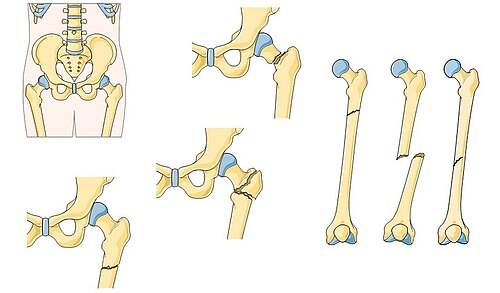
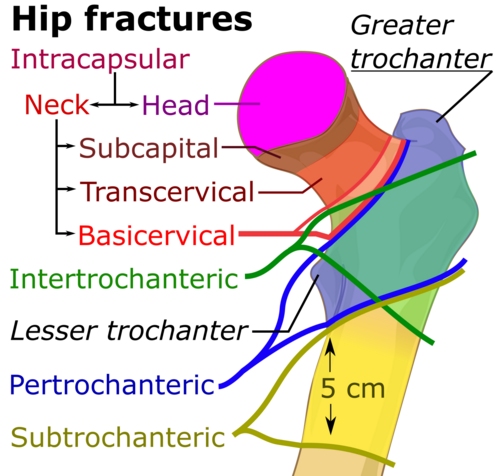

# FRATURAS DE MEMBROS INFERIORES

No atendimento ao trauma de membros inferiores, o primeiro erro que vejo muitos alunos cometerem é focar na deformidade da perna antes de olhar para o paciente como um todo. Lembre-se: o osso não mata, mas a hemorragia e as complicações sistêmicas associadas à fratura, sim. Seguindo o protocolo ATLS, as fraturas de membros entram na avaliação secundária, após a estabilização do ABCDE. A exceção? O trauma pélvico com instabilidade hemodinâmica, que tratamos no "C" (Circulação).

*Figura 1 - Locais mais frequentes de fraturas femorais: colo, região trocantérica, diáfise e região supracondiliana. Fonte: Servier Medical Art, CC BY-SA 3.0 | Wikimedia Commons*

## Trauma Pélvico: O Desafio da Estabilidade

O trauma pélvico é uma das lesões mais graves na ortopedia de urgência devido ao alto potencial de sangramento retroperitoneal. Quando falamos em prova, a banca quer saber se você sabe diferenciar uma bacia estável de uma instável e como estancá-la.

### Fisiopatologia e Mecanismos

A pelve é um anel ósseo. Para que ocorra um deslocamento significativo (instabilidade), o anel precisa romper em dois ou mais pontos.

- **Compressão Anteroposterior (Livro Aberto):** Comum em colisões frontais ou atropelamentos. Ocorre a diástase da sínfise púbica e lesão dos ligamentos sacroilíacos anteriores. É a que mais aumenta o volume pélvico, gerando espaço para grandes hematomas.

- **Compressão Lateral:** É o mecanismo mais comum (ex: colisão lateral automotiva). Causa fraturas dos ramos púbicos e do sacro. Geralmente é mais estável que o "livro aberto", mas pode causar lesões viscerais.

- **Cisalhamento Vertical:** Quedas de grande altura. Há ruptura completa de todos os ligamentos de um lado da pelve (sacroilíacos anteriores e posteriores). É a forma mais instável.

**Dica de Prova:** A instabilidade vertical é definida pela ruptura dos ligamentos sacroilíacos posteriores. Se a questão mencionar "deslocamento cranial de um hemianel", marque instabilidade vertical.

### Manejo Inicial e Controle de Hemorragia

Em um paciente com suspeita de fratura de pelve e choque, a prioridade é reduzir o volume pélvico para promover o tamponamento.

- **Estabilização Temporária:** Uso de lençol ou cinta pélvica. **Cuidado:** O lençol deve ser posicionado na altura dos **trocânteres maiores**, não na crista ilíaca. Posicionar errado é um erro clássico que não comprime o que precisa ser comprimido.

- **Origem do Sangramento:** Em 80-90% dos casos, a hemorragia é do **plexo venoso pélvico** ou das superfícies ósseas fraturadas. Apenas 10-20% é arterial (geralmente artéria ilíaca interna ou glútea).

- **Conduta na Instabilidade Persistente:** Se o lençol/cinta não estabilizar o choque, o próximo passo é o fixador externo imediato ou o tamponamento pré-peritoneal. Se houver suspeita de sangramento arterial (blush na TC), indica-se a angioembolização.

| Tipo de Lesão | Estabilidade | Mecanismo Comum | Conduta Inicial |
| --- | --- | --- | --- |
| Compressão Lateral | Geralmente Estável | Colisão lateral | Analgesia / Observação |
| Livro Aberto (APC) | Instável (Rotacional) | Colisão frontal | Cinta pélvica / Fixador |
| Cisalhamento Vertical | Instável (Global) | Queda de altura | Fixador externo / Tração |

*Figura 2 - Classificação das fraturas do fêmur proximal: colo femoral, transtrocanterianas e subtrocanterianas. Fonte: Mikael Häggström, CC0 | Wikimedia Commons*

## Fraturas do Fêmur Proximal: O Cotidiano do Idoso

Aqui está o tema que mais cai em provas de residência. Você precisa saber diferenciar a fratura do **colo do fêmur** da fratura **transtrocantérica**. Por que? Porque o tratamento e as complicações são completamente diferentes.

### Fratura do Colo do Fêmur (Intracapsular)

O colo do fêmur está dentro da cápsula articular. O suprimento sanguíneo da cabeça femoral (artérias circunflexas) depende da integridade desse colo.

- **O Problema:** Se a fratura desviar, os vasos rompem. O risco de necrose avascular (osteonecrose) e de não consolidação (pseudoartrose) é altíssimo.

- **Classificação de Garden:**

- Garden I: Incompleta ou impactada em valgo.

- Garden II: Completa, mas sem desvio.

- Garden III: Completa, com desvio parcial.

- Garden IV: Completa, com desvio total (perda de contato cortical).

**Decisão Terapêutica:**
Em idosos ativos com Garden III ou IV (desviadas), não tentamos fixar o osso. Por que? Porque a chance de a cabeça do fêmur "morrer" é enorme. Fazemos **Artroplastia Total de Quadril (ATQ)** ou Hemiartroplastia. Em jovens, a preservação da cabeça é prioridade absoluta, então tentamos a redução e fixação com parafusos, independentemente do Garden.

### Fratura Transtrocantérica (Extracapsular)

Ocorre entre o grande e o pequeno trocânter. Esta região é muito bem vascularizada.

- **O Quadro Clínico:** É o mesmo da fratura de colo — encurtamento do membro e **rotação lateral**. Por que roda para fora? Porque o músculo iliopsoas e os glúteos puxam o fragmento distal.

- **Tratamento:** Como a vascularização é boa, o osso consolida bem. O tratamento é quase sempre a fixação com material de síntese (DHS - Parafuso Deslizante de Quadril ou Haste Cefalomedular).

**Pegadinha de Prova:** A questão descreve um idoso com queda da própria altura, dor inguinal e membro em rotação externa. Se a radiografia mostrar fratura na linha entre os trocânteres, é transtrocantérica. Se for logo abaixo da cabeça, é colo.

## Fraturas de Ossos Longos e Complicações Sistêmicas

As fraturas de fêmur (diáfise) e tíbia são marcadores de trauma de alta energia. No Dr. Will, sempre reforçamos: fratura de osso longo é um evento inflamatório sistêmico.

### Síndrome da Embolia Gordurosa (SEG)

Ocorre quando gotículas de gordura da medula óssea caem na circulação após uma fratura de osso longo ou pelve.

- **A Tríade Clássica:**

- Alterações respiratórias (hipoxemia, dispneia).

- Alterações neurológicas (confusão mental, agitação).

- Petéquias (geralmente em conjuntiva, axilas e pescoço).

- **Diagnóstico:** É clínico. A tríade + febre e taquicardia em um paciente com fratura de fêmur há 24-72 horas é o cenário típico.

- **Cuidado:** Embora a SEG seja uma complicação grave, em termos de declaração de óbito, a causa básica é o **trauma original** (a fratura).

### Síndrome Compartimental Aguda

Esta é uma emergência ortopédica real. Ocorre o aumento da pressão dentro de um compartimento osteofascial, reduzindo a perfusão capilar. É mais comum na perna (tíbia).

- **Sinal mais precoce:** Dor desproporcional à lesão, que piora com o estiramento passivo dos dedos.

- **Sinais tardios (Os 5 Ps):** Dor (Pain), Palidez, Parestesia, Paralisia e Ausência de Pulso.

- **Erro Crítico:** Esperar o pulso sumir para diagnosticar. Se o pulso sumiu, o membro já está perdido. O diagnóstico é clínico!

- **Conduta:** Se o paciente estiver com gesso, a primeira conduta é a **retirada imediata do gesso**. Se não resolver, a conduta definitiva é a **fasciotomia**.

## Fraturas Expostas: O Protocolo de Gustilo-Anderson

Qualquer fratura com solução de continuidade da pele é uma fratura exposta até que se prove o contrário. O tempo para o desbridamento e a antibioticoterapia são os fatores que mais influenciam o risco de infecção.

### Classificação de Gustilo-Anderson

- **Tipo I:** Ferida < 1 cm, limpa, baixa energia, de dentro para fora.

- **Tipo II:** Ferida entre 1 e 10 cm, moderada contaminação, dano tecidual moderado.

- **Tipo III:** Alta energia, grande dano de partes moles ou alta contaminação (terra, água, zona rural).

- **IIIa:** Cobertura óssea adequada apesar da laceração.

- **IIIb:** Necessita de retalho ou enxerto para cobrir o osso (periósteo arrancado).

- **IIIc:** Lesão arterial que exige reparo.

**Dica MedEvo:** Fraturas cominutivas (vários fragmentos) ou por projétil de arma de fogo são automaticamente classificadas como **Tipo III**, independentemente do tamanho da ferida na pele.

### Antibioticoterapia

- **Gustilo I e II:** Cefalosporina de 1ª geração (Cefazolina).

- **Gustilo III:** Cefazolina + Aminoglicosídeo (Gentamicina).

- **Contaminação Rural/Solo:** Adicionar Penicilina para cobrir anaeróbios (Clostridium).

| Grau Gustilo | Tamanho da Ferida | Energia / Dano Tecidual | Antibiótico Escolha |
| --- | --- | --- | --- |
| I | < 1 cm | Baixa / Mínimo | Cefazolina |
| II | 1 - 10 cm | Moderada | Cefazolina |
| IIIa | > 10 cm | Alta / Cominutiva | Cefazolina + Gentamicina |
| IIIb | > 10 cm | Perda de cobertura (osso exposto) | Cefazolina + Gentamicina |
| IIIc | Qualquer | Lesão Arterial | Cefazolina + Gentamicina |

## Joelho e Tornozelo: Detalhes que Decidem Questões

### Anatomia Radiográfica e Lesões do Joelho

Na radiografia de perfil do joelho, você deve identificar o fêmur e a tíbia como ossos principais. A patela está conectada superiormente pelo tendão do quadríceps e inferiormente pelo ligamento patelar.

- **Fratura de Segond:** É uma pequena avulsão óssea no platô tibial lateral. Por que ela cai tanto? Porque ela é **patognomônica de ruptura do Ligamento Cruzado Anterior (LCA)**. Viu Segond no RX? O LCA rompeu.

- **Bursite Pré-patelar:** Inflamação da bursa à frente da patela, comum em quem trabalha de joelhos ou após esforços repetitivos. Apresenta dor, calor e inchaço localizado.

### Tornozelo e Pé

- **Fratura de Calcâneo:** Geralmente por queda de altura (compressão axial).

- **A Conexão Obrigatória:** Todo paciente com fratura de calcâneo ou tornozelo por queda de altura **DEVE** ter sua coluna vertebral investigada (especialmente a transição toracolombar). A energia do impacto sobe pelo esqueleto axial.

- **Inervação do Hálux:** A sensibilidade cutânea do primeiro espaço interdigital (entre o 1º e 2º dedos) e a dorsiflexão do hálux dependem do **nervo fibular profundo**. O déficit de dorsiflexão do pé como um todo (pé caído) indica lesão do **nervo fibular comum**.

## Ortopedia Pediátrica: O que o Generalista Precisa Saber

Crianças não são adultos pequenos. O osso é mais elástico e o periósteo é mais espesso.

- **Fratura em Galho Verde:** Ruptura incompleta da cortical. O osso "dobra" e quebra apenas de um lado.

- **Epifisiólise da Cabeça do Fêmur (ECF):** Ocorre tipicamente em adolescentes (10-15 anos), frequentemente obesos. O colo do fêmur "escorrega" para cima e para frente em relação à epífise. O paciente apresenta dor no quadril ou **dor referida no joelho** e claudicação.

- **Doença de Legg-Calvé-Perthes:** Necrose avascular idiopática da cabeça do fêmur em crianças menores (4-8 anos). O quadro é de dor insidiosa e limitação de rotação interna.

**Diferencial de Dor no Quadril na Criança:**

- < 3 anos: Artrite Séptica (Emergência!).

- 4-8 anos: Legg-Calvé-Perthes ou Sinovite Transitória.

- 10-15 anos: Epifisiólise (ECF).

## Tumores Ósseos e Diagnósticos Diferenciais

Muitas vezes, uma fratura ocorre em um osso já fragilizado por uma lesão prévia (fratura patológica).

- **Encondroma:** Tumor benigno de cartilagem hialina, muito comum na metáfise de ossos longos. Geralmente é um achado incidental. Se for assintomático, a conduta é apenas acompanhamento.

- **Osteocondroma:** O tumor ósseo benigno mais comum. É uma "exostose" (crescimento para fora do osso). Também requer apenas acompanhamento se não causar sintomas compressivos.

- **Osteossarcoma:** Tumor maligno mais comum na infância/adolescência. Dor óssea persistente que não melhora com repouso ou AINEs deve sempre acender o alerta para neoplasia, especialmente em jovens.

## Consolidação e Reparo Ósseo

A biologia da fratura é um tema clássico de fisiopatologia.

- **Consolidação Primária (Direta):** Ocorre quando há estabilidade absoluta (ex: placa e parafusos com compressão). **Não há formação de calo ósseo**. Os osteoclastos e osteoblastos trabalham diretamente na fenda da fratura.

- **Consolidação Secundária (Indireta):** Ocorre quando há estabilidade relativa (ex: gesso, haste intramedular, fixador externo). Passa pelas fases de inflamação, calo mole, calo duro e remodelação. **Há formação de calo ósseo visível no RX**.

## Pontos-Chave para Prova 🎯

- **Fratura de Colo de Fêmur no Idoso:** Garden III e IV tratamos com Artroplastia (ATQ). Garden I e II tratamos com fixação (parafusos).

- **Fratura Transtrocantérica:** Sempre fixação (DHS ou Haste), pois tem boa vascularização.

- **Síndrome Compartimental:** Diagnóstico clínico (dor ao estiramento passivo). Primeira conduta: abrir gesso. Conduta definitiva: fasciotomia.

- **Embolia Gordurosa:** Tríade (Respiratório + Neurológico + Petéquias). Comum em fraturas de fêmur após 24h.

- **Trauma Pélvico:** Estabilização inicial com lençol nos **trocânteres maiores**. Sangramento é majoritariamente venoso.

- **Queda de Altura:** Fraturou calcâneo? É **obrigatório** pedir RX/TC de coluna toracolombar.

- **Fratura Exposta:** Antibiótico na primeira hora. Gustilo I (Cefazolina), Gustilo III (Cefazolina + Gentamicina).

- **Nervo Fibular Comum:** Lesão causa "pé caído" (perda da dorsiflexão).

- **Fratura de Segond:** Patognomônica de lesão do LCA.

- **Epifisiólise (ECF):** Adolescente obeso com dor no quadril ou joelho.

- **MESS (Mangled Extremity Severity Score):** Score para decidir amputação vs. salvamento. MESS ≥ 7-10 sugere amputação.

- **Luxação Posterior de Quadril:** Membro em "banhista envergonhado" (flexão, adução e rotação interna). É uma emergência (risco de necrose da cabeça).

- **Bisfosfonatos:** Uso prolongado pode causar fraturas atípicas de fêmur (transversas, com bico cortical). Conduta: suspender a droga.

- **Contraindicação Absoluta:** Nunca realizar redução de fratura sem antes avaliar o status neurovascular distal.

- **Erro que Reprova:** Tentar reduzir uma fratura de pelve instável manualmente (manobra de compressão/distração repetida) — isso rompe coágulos e aumenta o sangramento. Faça o exame físico uma única vez e de forma suave.

 Cópia offline para consulta pessoal.
 Fonte original:
 [https://www.medevo.com.br/material-apoio/ler/6f99110b-54c7-468e-9dba-8f238e8e0803](https://www.medevo.com.br/material-apoio/ler/6f99110b-54c7-468e-9dba-8f238e8e0803)
