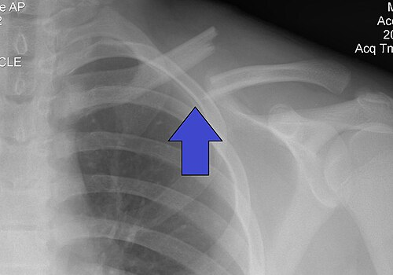
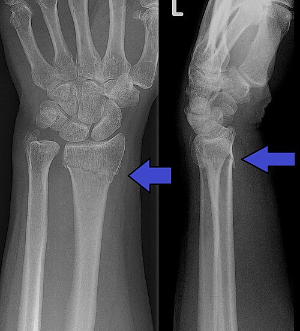

# FRATURAS DE MEMBROS SUPERIORES

Para entender as fraturas de membros superiores, você precisa parar de tentar decorar nomes de epônimos e começar a visualizar a anatomia funcional. O braço não é apenas um conjunto de ossos; é uma cadeia cinética projetada para posicionar a mão no espaço. Se a fratura quebra essa cadeia, a função da mão está comprometida.

Nas provas de residência, as bancas não querem apenas que você saiba o nome da fratura. Elas querem saber se você reconhece uma urgência neurovascular e se sabe quando operar ou tratar de forma conservadora. Vamos dissecar os principais segmentos, do ombro ao punho.

*Figura 1 - Radiografia demonstrando fratura de clavícula esquerda. Fonte: Majorkev, CC BY 3.0 | Wikimedia Commons*

## Fraturas de Clavícula

A clavícula é o único "suporte" ósseo que conecta o membro superior ao esqueleto axial. É um osso em formato de "S" itálico, e sua anatomia dita onde ela quebra.

### Epidemiologia e Mecanismo

Cerca de 80% a 85% das fraturas de clavícula ocorrem no **terço médio (diáfise)**. Por que ali? Porque é o ponto de transição entre as curvaturas e onde o osso é mais fino e carece de reforços ligamentares (como os ligamentos coracoclaviculares no terço distal). O mecanismo clássico é a queda sobre o ombro (trauma direto).

### Tratamento: O grande dilema

Antigamente, dizia-se que "toda clavícula consolida". Hoje, o Dr. Will e a literatura moderna (como as diretrizes da SBOT) mostram que não é bem assim.

- **Tratamento Conservador:** Indicado para a grande maioria das fraturas do terço médio sem desvio ou com desvio mínimo. Usamos a tipóia simples ou o imobilizador em "8". O prognóstico costuma ser excelente.

- **Tratamento Cirúrgico:** Aqui mora a questão de prova. Quando operar?

- Fratura exposta (óbvio).

- Iminência de exposição (a pele está "tenda", prestes a romper).

- Lesão neurovascular associada.

- **Encurtamento > 2 cm:** Este é o número mágico. Se a clavícula encurta muito, a biomecânica da cintura escapular muda, gerando fadiga muscular e dor crônica.

- Ombro flutuante (fratura de clavícula + fratura do colo da escápula).

**Dica de Prova:** Se a questão mostrar uma mulher jovem, preocupada com a estética de um "calinho ósseo", lembre-se: o tratamento conservador frequentemente deixa uma proeminência óssea, mas a cirurgia deixa uma cicatriz. A indicação cirúrgica deve ser funcional, não estética.

## Fraturas do Úmero

Aqui o jogo fica sério, pois o úmero é vizinho de nervos muito importantes.

### Fratura da Diáfise do Úmero

O mecanismo costuma ser trauma direto ou forças de torção. O que você **precisa** checar imediatamente? O **Nervo Radial**.

O nervo radial corre no sulco do nervo radial, diretamente sobre o osso, no terço médio/distal. Se o paciente chega com a famosa **"mão caída" (wrist drop)** e perda de sensibilidade no dorso do primeiro espaço interdigital, o diagnóstico é neuropraxia do radial.

- **Tratamento:** A maioria das fraturas de diáfise de úmero é de tratamento **conservador** com gesso pendente ou órtese funcional (Sarmiento).

- **Por que não operamos tudo?** Porque o úmero tolera bem desvios: até 20° de angulação anterior e 30° de varo/valgo. O braço não suporta carga como a perna, então a consolidação viciosa leve não impede a função.

- **Indicação de RAFI (Redução Aberta e Fixação Interna):** Fraturas bilaterais, cotovelo flutuante ou falha no tratamento conservador.

### Fratura Supracondiliana do Úmero (O pesadelo da Pediatria)

Esta é a fratura de cotovelo mais comum em crianças (geralmente < 10 anos). O mecanismo é a queda com o braço em extensão.

**Classificação de Gartland (Cai muito!):**

| Tipo | Descrição | Conduta |
| --- | --- | --- |
| I | Sem desvio | Gesso braquiopalmar |
| II | Desviada, mas com a cortical posterior íntegra | Redução fechada + Fios de Kirschner |
| III | Desvio total (sem contato cortical) | **Urgência Cirúrgica** (Redução + Fios) |

**Por que é uma urgência?** O risco de lesão da artéria braquial e do nervo mediano (especificamente o **nervo interósseo anterior**) é altíssimo. Se você vir uma criança que não consegue fazer o sinal de "OK" com os dedos (flexão da falange distal do polegar e indicador), suspeite de lesão do interósseo anterior.

**Complicação Temida:** Síndrome Compartimental e a consequente Contratura Isquêmica de Volkmann. Se o paciente tem dor desproporcional à lesão e dor à extensão passiva dos dedos, corra para o centro cirúrgico.

## Fraturas do Antebraço (Rádio e Ulna)

No adulto, o antebraço funciona como uma articulação complexa (pronossupinação). Imagine o rádio e a ulna como as duas hastes de um alicate. Se uma entorta, o alicate não fecha.

### O conceito de Estabilidade Absoluta

Diferente do úmero, as fraturas de rádio e ulna no adulto exigem **redução anatômica perfeita**. Qualquer milímetro de desvio altera a rotação do braço. Por isso, a regra é: **Tratamento Cirúrgico (RAFI)** com placa e parafusos para gerar estabilidade absoluta (compressão interfragmentária).

### Fraturas-Luxações (Nomes que você precisa saber)

- **Monteggia:** Fratura da ulna (proximal) + Luxação da cabeça do rádio. (Mnemonic: **M**onteggia - **U**lna).

- **Galeazzi:** Fratura do rádio (distal) + Luxação da articulação radioulnar distal. (Mnemonic: **G**aleazzi - **R**ádio).

**Erro clássico:** Olhar apenas para a fratura no RX e esquecer de olhar a articulação acima e abaixo. Se a ulna quebrou, a cabeça do rádio pode ter saído do lugar.

*Figura 2 - Radiografia mostrando fratura de Colles do rádio distal com fratura associada do estiloide ulnar. Fonte: Lucien Monfils, CC BY-SA 3.0 | Wikimedia Commons*

## Fraturas do Rádio Distal

Aqui entramos no terreno da osteoporose. A paciente clássica é a mulher pós-menopausa que cai da própria altura.

### Fratura de Colles

É a mais comum. O desvio é **dorsal** (deformidade em "garfo"). Ocorre por queda com o punho em extensão.

- **Tratamento:** Se o desvio for aceitável, redução fechada e gesso. Se houver instabilidade (cominução dorsal, angulação > 20°), cirurgia.

### Fratura de Barton

Cuidado aqui! A Barton é uma fratura **intra-articular** com subluxação do carpo. Ela ocorre por um mecanismo de cisalhamento. Como envolve a superfície articular, o risco de artrose pós-traumática é enorme e o tratamento é quase sempre cirúrgico.

**Complicação tardia do Rádio Distal:** A rigidez articular é a mais comum após RAFI. Outra pegadinha de prova é a ruptura tardia do tendão extensor longo do polegar (por atrito no calo ósseo).

## Fraturas do Escafoide

O escafoide é o osso mais importante da fileira proximal do carpo e o que mais quebra.

### O problema da vascularização retrógrada

O sangue entra no escafoide pela sua parte distal e flui para a proximal. Se a fratura ocorre na **cintura (terço médio)** ou no polo proximal, a parte de cima do osso fica sem sangue.

- **Resultado:** Alto risco de **Necrose Avascular** e Pseudoartrose.

### Diagnóstico

Paciente com dor na **tabaqueira anatômica** após queda.

- **Pérola Clínica:** Se o RX inicial for normal, mas a dor persistir, você **não** libera o paciente. Você imobiliza e repete o RX em 10-14 dias ou pede uma Ressonância/Tomografia. O RX inicial falha em detectar até 20% dessas fraturas.

## Patologias de Partes Moles e LER/DORT

Nem toda dor no membro superior é fratura. As provas de residência amam misturar ortopedia com medicina do trabalho.

### Tenossinovite de De Quervain

É a inflamação do **primeiro compartimento dorsal** do punho, que contém os tendões do **Abdutor Longo do Polegar (ALP)** e **Extensor Curto do Polegar (ECP)**.

- **Teste de Finkelstein:** O paciente flete o polegar, fecha a mão sobre ele e faz um desvio ulnar. Se doer na face radial, é positivo.

- **Contexto:** Muito comum em mães de recém-nascidos (movimento de pegar o bebê) e trabalhadores que fazem movimentos repetitivos com o polegar.

### Síndrome do Túnel do Carpo (STC)

Compressão do **nervo mediano** sob o ligamento carpal transverso.

- **Clínica:** Parestesia (formigamento) nos 3 primeiros dedos e metade radial do 4º. A dor piora à noite (o paciente acorda chacoalhando as mãos - sinal do sacudir).

- **Testes:** Phalen (flexão dos punhos) e Tinel (percussão sobre o nervo).

### Epicondilites

- **Lateral (Cotovelo de Tenista):** Afeta a origem dos extensores, principalmente o **Extensor Radial Curto do Carpo**. Dor à extensão resistida do punho.

- **Medial (Cotovelo de Golfista):** Afeta os flexores e o pronador redondo. Pode vir acompanhada de compressão do nervo ulnar (**Síndrome do Túnel Cubital**), causando parestesia no 4º e 5º dedos.

## Medicina do Trabalho e Legislação

Como professor, vejo muitos alunos errarem questões simples por desconhecerem a burocracia médica.

- **Nexo Causal:** Para ser considerada doença ocupacional (DORT), deve haver relação entre a atividade e a patologia. Epicondilite lateral em digitador? Pode ser. Epicondilite lateral em quem não usa os braços? Provavelmente não.

- **Notificação SINAN:** Doenças relacionadas ao trabalho são de notificação compulsória.

- **Acidente de Trajeto:** É considerado acidente de trabalho. **Porém**, se o trabalhador fizer um "desvio de rota" para fins pessoais (ir ao banco, passar no mercado), o nexo é descaracterizado.

- **Pata de Corvo (Vago):** Uma curiosidade anatômica que cai em provas de cirurgia geral: os ramos terminais do nervo vago na pequena curvatura gástrica (nervo de Latarjet) formam a "pata de corvo". Na vagotomia superseletiva, preservamos esses ramos para manter a função motora do antro e piloro, cortando apenas a inervação ácida.

## Tabelas Comparativas para Revisão Rápida

### Tabela 1: Nervos do Membro Superior e Déficits

| Nervo | Local de Lesão Comum | Sinal Clínico Típico |
| --- | --- | --- |
| **Radial** | Diáfise do Úmero | Mão Caída (Wrist Drop) |
| **Mediano** | Túnel do Carpo / Supracondiliana | Parestesia 1º-3º dedos / Perda do "OK" |
| **Ulnar** | Epicôndilo Medial (Cotovelo) | Garra Ulnar / Parestesia 4º-5º dedos |
| **Axilar** | Luxação de Ombro | Perda de sensibilidade no deltoide |

### Tabela 2: Diagnóstico Diferencial de Dor no Punho Radial

| Patologia | Local da Dor | Teste Chave |
| --- | --- | --- |
| **De Quervain** | Estiloide do Rádio | Finkelstein (+) |
| **Fratura Escafoide** | Tabaqueira Anatômica | Dor à compressão axial do polegar |
| **Artrite Trapézio-Metacarpal** | Base do Polegar | Teste da Moagem (Grind Test) |
| **STC** | Face Volar do Punho | Phalen e Tinel (+) |

### Tabela 3: Classificação de Gartland (Supracondiliana Úmero)

| Grau | Desvio | Estabilidade | Conduta |
| --- | --- | --- | --- |
| **I** | Mínimo/Nenhum | Estável | Gesso |
| **II** | Angulação (Cortical Post. íntegra) | Instável | Redução + Fios |
| **III** | Desvio Total | Muito Instável | Cirurgia Urgente |

## Osteoporose e Fraturas por Fragilidade

No MedEvo, sempre enfatizamos: uma fratura de rádio distal em idoso não é apenas um osso quebrado, é um sinal de alerta.

- **Definição:** Fratura por fragilidade é aquela que ocorre com trauma de baixa energia (queda da própria altura).

- **Locais mais comuns:** Vértebras (mais comum total, muitas vezes assintomática), Colo do Fêmur e Rádio Distal.

- **Diagnóstico:** Densitometria Óssea (T-score ≤ -2,5 DP).

- **Tratamento:** Além da fratura, tratar a causa base com Cálcio, Vitamina D e Bisfosfonatos (como Alendronato).

**Cuidado:** O **Metotrexato** é a droga de escolha para Artrite Reumatoide, mas seu uso crônico pode interferir no metabolismo ósseo. Em provas, se o paciente usa MTX e tem dor articular, pense em atividade da doença; se tem dor óssea súbita, pense em fratura por insuficiência.

## Situações Especiais e Pegadinhas

### Doença de Kienböck

É a necrose avascular do **semilunar**. O paciente queixa-se de dor crônica no centro do punho, sem trauma agudo evidente. No RX, o semilunar aparece mais branco (esclerótico) e pode colapsar.

### Ruptura do Tendão do Bíceps

- **Proximal (Cabo Longo):** Ocorre em idosos por degeneração. Gera o "Sinal do Popeye" (o ventre muscular desce). O tratamento é quase sempre conservador, pois a perda de força é mínima (o cabo curto e o braquial compensam).

- **Distal (Inserção no Rádio):** Ocorre em jovens após esforço súbito. Gera perda importante de força de **supinação**. O tratamento costuma ser cirúrgico.

### Síndrome de Ellis-van Creveld

Uma síndrome genética rara que cai em provas de genética/pediatria associada à ortopedia. Caracteriza-se por polidactilia, displasia ectodérmica e, no carpo, a **fusão dos ossos capitato e hamato**.

## Tratamento Farmacológico na Ortopedia

- **Dor Aguda:** Analgésicos simples e AINEs (curto prazo).

- **Osteoma Osteoide:** Um tumor benigno que causa dor noturna intensa que **melhora dramaticamente com Aspirina ou AINEs**. Se a questão der essa dica, não erre!

- **Artrite Psoriásica:** Se o paciente tem dor em "dedo em salsicha" (dactilite) e lesões de pele, o tratamento de primeira linha são os DMARDs, como o **Metotrexato**.

## Pontos-Chave para Prova

- **Fratura de Clavícula:** 80% no terço médio. Operar se encurtamento > 2 cm ou lesão neurovascular.

- **Nervo Radial:** Lesado em fraturas de diáfise de úmero. Causa "mão caída".

- **Nervo Interósseo Anterior:** Ramo do mediano, mais lesado na supracondiliana do úmero em crianças. Teste do "OK".

- **Gartland III:** É urgência cirúrgica pelo risco de isquemia de Volkmann.

- **Escafoide:** Vascularização retrógrada. Dor na tabaqueira anatômica = imobilizar mesmo com RX normal.

- **De Quervain:** Tenossinovite do 1º compartimento (ALP e ECP). Finkelstein positivo.

- **Síndrome do Túnel do Carpo:** Compressão do mediano. Parestesia nos 3 primeiros dedos, piora noturna.

- **Monteggia:** Fratura da Ulna + Luxação da cabeça do Rádio.

- **Galeazzi:** Fratura do Rádio + Luxação da articulação radioulnar distal.

- **Estabilidade Absoluta:** Necessária em fraturas de antebraço de adultos para permitir pronossupinação.

- **Osteoporose:** Fratura de rádio distal em idosas é sinal de alerta para tratamento sistêmico.

- **Acidente de Trabalho:** Desvio de rota para fins pessoais descaracteriza acidente de trajeto.

- **SINAN:** Notificação compulsória para doenças ocupacionais (LER/DORT).

- **Epicondilite Lateral:** Principal músculo é o extensor radial curto do carpo.

- **Necrose Avascular:** Comum no escafoide (polo proximal) e no semilunar (Kienböck).

- **Contraindicação Absoluta:** Nunca realizar redução incruenta em fraturas expostas com grave contaminação sem antes realizar desbridamento cirúrgico.

- **Erro a evitar:** Não diagnosticar Síndrome Compartimental por confiar apenas na presença de pulsos (o pulso é o último a sumir).

 Cópia offline para consulta pessoal.
 Fonte original:
 [https://www.medevo.com.br/material-apoio/ler/7448aaa5-f535-4c4f-9f6a-3514f1fe47a0](https://www.medevo.com.br/material-apoio/ler/7448aaa5-f535-4c4f-9f6a-3514f1fe47a0)
