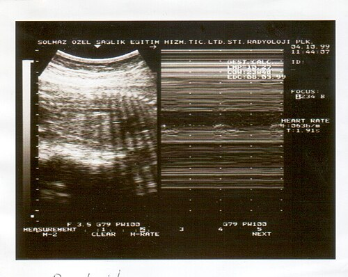

# FUNDAMENTOS DA VITALIDADE FETAL

Para entender vitalidade fetal, você precisa parar de decorar nomes de exames e começar a entender a fisiologia da hipóxia. O feto não "morre de repente" na maioria das vezes, ele percorre um caminho de adaptação. Quando a oferta de oxigênio cai, o organismo fetal prioriza órgãos nobres (cérebro, coração e adrenais) em detrimento de órgãos periféricos (rins, pulmões, intestino e pele). É essa redistribuição hemodinâmica que nós rastreamos nos exames.

Nas provas de residência, o examinador quer saber se você sabe identificar o momento exato de interromper a gestação. Se você tirar cedo demais, entrega um prematuro com doença da membrana hialina. Se tirar tarde demais, entrega um feto com paralisia cerebral ou óbito. O equilíbrio está em entender os marcadores agudos e crônicos.

*Figura 1 - Aparelho de cardiotocografia (CTG) utilizado para monitorização da frequência cardíaca fetal e contrações uterinas. Fonte: Eliran t, CC BY-SA 4.0 | Wikimedia Commons*

## O Conceito de Hipóxia Fetal: Aguda vs. Crônica

A hipóxia fetal pode ser dividida em dois grandes cenários que as bancas adoram misturar para te confundir.

A hipóxia aguda é aquela que acontece em minutos ou horas. Pense no descolamento prematuro de placenta (DPP) ou no prolapso de cordão. Aqui, não dá tempo de o líquido amniótico diminuir ou de o feto parar de crescer. O marcador principal será a Cardiotocografia (CTG) alterada ou a perda de movimentos fetais súbita.

Já a hipóxia crônica é o cenário da insuficiência placentária, comum na pré-eclâmpsia e no Restrição de Crescimento Intrauterino (RCIU). Aqui, o feto vai se adaptando. Ele para de urinar para economizar sangue (gerando oligoidrâmnia), ele para de crescer e ele redireciona o fluxo sanguíneo (centralização).

## Avaliação Clínica: O Mobilograma

Muitos alunos desprezam o mobilograma por acharem "subjetivo", mas ele é o primeiro sinal de alerta. O feto que não recebe oxigênio suficiente economiza energia. E como ele economiza? Parando de se mexer.

A recomendação da FEBRASGO é orientar a paciente a observar os movimentos após as refeições. O valor de corte clássico para suspeita de comprometimento é menos de 6 movimentos em 1 hora ou menos de 10 movimentos em 2 horas.

Dica de prova: Se a questão diz que a paciente refere diminuição da movimentação fetal, o seu primeiro passo nunca é o parto imediato. O primeiro passo é a avaliação da vitalidade com métodos biofísicos (CTG ou PBF).

## Cardiotocografia (CTG): A Janela do Sistema Nervoso Central

A CTG avalia o bem-estar fetal através da frequência cardíaca fetal (FCF) e sua relação com as contrações uterinas e movimentos. É um exame de alta sensibilidade, mas baixa especificidade. Ou seja: se estiver normal, o feto está muito provavelmente bem. Se estiver alterada, ele pode estar mal ou pode ser apenas um falso-positivo (sono fetal, por exemplo).

Os parâmetros que você deve analisar são:

- **Linha de base:** O normal é entre 110 e 160 bpm.

- **Variabilidade:** É o parâmetro mais importante para avaliar a reserva de oxigênio no SNC. O normal (moderada) é entre 6 e 25 bpm. Se a variabilidade está reduzida (< 5 bpm), o feto pode estar em acidose ou em sono profundo.

- **Acelerações:** Presença de 2 ou mais acelerações (aumento de 15 bpm por 15 segundos) em 20 minutos define um traçado reativo.

- **Desacelerações (DIPs):** Aqui é onde a maioria dos alunos erra.

### Tipos de Desacelerações e seus Significados

- **DIP I (Precoce ou Cefálica):** Ocorre junto com a contração. É causada pela compressão do cabeçote fetal, gerando reflexo vagal. É fisiológica. Não indica hipóxia.

- **DIP II (Tardia):** Ocorre após o pico da contração. É o sinal clássico de insuficiência uteroplacentária. O feto já está no limite e a contração corta o pouco oxigênio que restava. É um sinal grave.

- **DIP III (Variável):** Não tem relação fixa com a contração. Causada por compressão de cordão. Se tiver "ombros" (pequenas acelerações antes e depois), costuma ser benigna. Se for persistente e sem ombros, indica risco.

| Categoria | Descrição | Conduta |
| --- | --- | --- |
| **Categoria I** | Normal: Linha de base 110-160, variabilidade moderada, sem DIP II ou III. | Acompanhamento de rotina. |
| **Categoria II** | Indeterminada: Taquicardia, variabilidade mínima, DIPs variáveis ocasionais. | Vigilância rigorosa e reavaliação. |
| **Categoria III** | Anormal: Variabilidade ausente + DIP II recorrente, DIP III recorrente ou bradicardia. | Resolução imediata da gestação. |

Como o Dr. Will sempre reforça em suas discussões de caso no MedEvo, uma CTG Categoria III em uma gestação a termo é indicação de parto, mas antes de correr para a cesárea, avalie se há causas reversíveis (hipotensão materna, hiperestimulação uterina).

*Figura 2 - Ultrassonografia fetal em modo M para avaliação de movimentos respiratórios fetais, componente do perfil biofísico fetal. Fonte: Nevit Dilmen, CC BY-SA 3.0 | Wikimedia Commons*

## Perfil Biofísico Fetal (PBF)

O PBF combina a CTG com a ultrassonografia para avaliar 5 parâmetros. Cada parâmetro vale 2 pontos (se normal) ou 0 (se alterado).

Os parâmetros são:

- Cardiotocografia (Reatividade).

- Movimentos Respiratórios Fetais.

- Movimentos Corporais Fetais.

- Tônus Fetal.

- Volume de Líquido Amniótico (ILA).

A lógica do PBF é a "cascata da hipóxia". Os centros neurológicos que controlam esses parâmetros surgem em momentos diferentes do desenvolvimento e possuem sensibilidades diferentes à acidose. O primeiro a sumir na hipóxia aguda é a reatividade da CTG e os movimentos respiratórios. O último a sumir é o tônus fetal.

O Líquido Amniótico é o "marcador crônico". Se o ILA está baixo (ILA < 5 cm ou maior bolsão vertical < 2 cm), significa que o feto está sofrendo há dias ou semanas, desviando sangue dos rins para o cérebro, o que diminui a produção de urina.

Erro clássico de prova: Achar que PBF 6/10 com ILA normal é pior que PBF 8/10 com ILA reduzido. Na verdade, o ILA reduzido (mesmo com os outros pontos normais) indica um processo crônico instalado que exige atenção imediata, muitas vezes a interrupção se a viabilidade permitir.

## Dopplerfluxometria: A Hemodinâmica em Tempo Real

O Doppler é o "padrão-ouro" para o seguimento do feto com restrição de crescimento ou em gestações de alto risco (pré-eclâmpsia). Ele não é indicado para gestações de baixo risco (risco habitual), pois não reduz mortalidade nesse grupo.

### 1. Artérias Uterinas

Avaliam a circulação materna. Elas refletem como foi a invasão trofoblástica. Se houver alta resistência ou presença de entalhe protodiastólico após 24-26 semanas, há um risco aumentado de pré-eclâmpsia e RCIU. Cuidado: elas avaliam o risco da doença aparecer, não a vitalidade do feto diretamente.

### 2. Artéria Umbilical

Avalia a placenta. O normal é que a placenta seja um órgão de baixa resistência para o sangue fluir fácil. Conforme a placenta "envelhece" ou adoece, a resistência aumenta.

- **Diástole Zero:** O sangue para de fluir na diástole. Indica que > 70% da placenta está comprometida.

- **Diástole Reversa:** O sangue volta para o feto na diástole. É um sinal de pré-óbito.

### 3. Artéria Cerebral Média (ACM)

Avalia a adaptação fetal. O feto em hipóxia faz vasodilatação cerebral para proteger o cérebro. Isso é chamado de **Centralização Fetal**.
No Doppler, veremos uma queda na resistência da ACM (o sangue entra mais fácil no cérebro).
Dica de prova: A centralização é um mecanismo de defesa, não é indicação de parto imediato por si só, mas indica que o feto está em estresse.

### 4. Ducto Venoso

Este é o parâmetro de "decisão final" no feto prematuro grave. Ele avalia a função cardíaca fetal. O sangue que chega pela veia umbilical passa pelo ducto venoso para atingir o átrio direito.
O parâmetro crítico é a **Onda A**. A onda A representa a contração atrial.

- **Onda A negativa ou ausente:** Indica que o coração não consegue mais bombear o sangue para frente; há uma falência cardíaca iminente e acidose grave. É indicação de interrupção imediata, mesmo em prematuros extremos, pois o risco de óbito intrauterino é altíssimo.

| Vaso | O que avalia | Alteração Crítica |
| --- | --- | --- |
| **Artéria Umbilical** | Placenta | Diástole Zero/Reversa |
| **Artéria Cerebral Média** | Adaptação (SNC) | Centralização (IP baixo) ou VPS > 1,5 MoM (Anemia) |
| **Ducto Venoso** | Coração/Acidose | Onda A negativa ou ausente |

## Isoimunização Rh e a Artéria Cerebral Média

Aqui está uma aplicação específica do Doppler que cai em toda prova. Na isoimunização Rh, o anticorpo materno destrói as hemácias fetais, causando anemia.
O feto anêmico tem o sangue mais "fino" (menos viscoso) e o coração bate mais rápido para compensar.
O diagnóstico de anemia fetal não é mais feito por amniocentese (Gráfico de Liley), mas sim pelo Doppler da **Velocidade Sistólica Máxima (VPS) da ACM**.

Se a VPS ACM for **> 1,5 MoM** (múltiplos do mediano), a probabilidade de anemia fetal grave é altíssima.
Conduta: Se > 1,5 MoM e idade gestacional < 34-35 semanas, indica-se cordocentese para diagnóstico e possível transfusão intrauterina. Se estiver perto do termo, antecipa-se o parto.

## Vitalidade no Pós-Natal Imediato: Reanimação e Triagem

A vitalidade não termina no nascimento. O neonatologista assume o bastão.

### Reanimação Neonatal

A regra de ouro da reanimação neonatal da SBP é: a **Frequência Cardíaca (FC)** é o parâmetro mais importante.
Se o RN não respira ou está em apneia/gasping após os passos iniciais (aquecer, posicionar, aspirar se necessário, secar), a conduta é Ventilação por Pressão Positiva (VPP) nos primeiros 60 segundos (o "Golden Minute").

Se a FC permanecer < 60 bpm após VPP adequada, iniciamos compressões torácicas. A dose de adrenalina é reservada para quando a FC continua < 60 bpm mesmo após VPP e massagem cardíaca.

### Teste do Coraçãozinho (Oximetria de Pulso)

É o rastreio para cardiopatias congênitas críticas (aquelas que dependem do canal arterial). Deve ser feito entre 24 e 48 horas de vida, em RN > 34 semanas.

- **Onde medir:** Mão direita (pré-ductal) e qualquer um dos pés (pós-ductal).

- **Normal:** SatO2 ≥ 95% em ambos E diferença < 3% entre eles.

- **Alterado:** SatO2 < 95% ou diferença ≥ 3%.

- **Conduta no alterado:** Repetir em 1 hora. Se persistir alterado, realizar Ecocardiograma em até 24 horas.

## Situações Especiais e Pegadinhas de Prova

### 1. Corticoterapia Antenatal

Indicada entre 24 e 34 semanas para maturação pulmonar (Betametasona ou Dexametasona).
Efeito colateral importante: O corticoide causa uma **hiperglicemia transitória** na mãe (cuidado com diabéticas) e pode causar uma diminuição transitória da variabilidade na CTG e dos movimentos fetais por 24-48h. Não confunda isso com sofrimento fetal!

### 2. Indometacina

Usada como tocolítico (para parar o trabalho de parto prematuro).
Contraindicação: Não usar após 32 semanas, pois causa o fechamento prematuro do canal arterial e pode levar à Hipertensão Pulmonar Persistente do RN (HPPN) e oligoidrâmnia.

### 3. Síndrome de Aspiração Meconial

Se o RN nasce deprimido e com líquido meconial, a diretriz atual da SBP recomenda: se o RN não tem ritmo respiratório regular ou tônus muscular diminuído, leve para a mesa de reanimação e inicie a VPP. A aspiração traqueal sob laringoscopia direta não é mais feita de rotina em todos os casos de mecônio, apenas se houver obstrução de via aérea evidente.

### 4. Diagnóstico de Abortamento Inviável

A banca vai te dar medidas de ultrassom e perguntar se é aborto retido. Memorize os critérios de inviabilidade:

- Comprimento Cabeça-Nádegas (CCN) ≥ 7 mm sem batimentos cardíacos fetais (BCF).

- Diâmetro Médio do Saco Gestacional (SG) ≥ 25 mm sem embrião.

- Ausência de embrião com BCF ≥ 2 semanas após um USG que mostrou SG sem vesícula vitelínica.

## Estratégias de Resolução de Questões

Ao ler uma questão de vitalidade, siga este fluxograma mental:

- **Qual a idade gestacional?** Se for 24 semanas, tentamos salvar o feto com tudo. Se for 22 semanas, estamos no limite da viabilidade (individualizar). Se for 37 semanas, qualquer alteração grave de vitalidade é parto.

- **O problema é agudo ou crônico?** Se a paciente parou de sentir o feto hoje, pense em CTG. Se o feto vem crescendo pouco há 1 mês, pense em Doppler.

- **O Doppler da Umbilical tem diástole zero ou reversa?** Se sim, o feto está em risco. Olhe o Ducto Venoso. Se a Onda A estiver negativa, não espere mais nada, interrompa (via de regra, cesárea).

- **A questão fala em anemia ou isoimunização?** Esqueça a diástole da umbilical. Procure a Velocidade Sistólica Máxima da Cerebral Média.

Lembre-se do que discutimos no MedEvo: a Medicina Fetal é a arte de gerenciar riscos. O Doppler nos diz "como" o feto está, mas a idade gestacional nos diz "o que" podemos fazer por ele.

## Pontos-Chave para Prova

- **Parâmetro mais importante da CTG:** Variabilidade (reflete oxigenação do SNC).

- **DIP II (Tardia):** Sempre patológica, indica insuficiência uteroplacentária.

- **DIP III (Variável):** Indica compressão de cordão; torna-se preocupante se perder os "ombros" ou for persistente.

- **Perfil Biofísico Fetal (PBF):** O ILA é o marcador de hipóxia crônica; tônus é o último parâmetro a sumir na hipóxia aguda.

- **Doppler de Artéria Umbilical:** Avalia a placenta. Diástole reversa é sinal de gravidade extrema.

- **Doppler de Artéria Cerebral Média:** IP baixo indica centralização (vasodilatação de proteção). VPS > 1,5 MoM indica anemia fetal.

- **Doppler de Ducto Venoso:** Onda A negativa ou ausente indica falência cardíaca e acidose; é o marcador para interrupção no prematuro extremo.

- **Teste do Coraçãozinho:** Alterado se SatO2 < 95% ou diferença ≥ 3% entre mão direita e pé. Repetir em 1h antes de pedir ECO.

- **Reanimação Neonatal:** O parâmetro que guia toda a conduta é a Frequência Cardíaca.

- **Corticoterapia:** Indicada de 24 a 34 semanas. Pode reduzir a variabilidade da CTG transitoriamente.

- **Oligoidrâmnia:** ILA < 5 cm ou maior bolsão vertical < 2 cm. No PBF, indica sofrimento crônico.

- **Hipotermia Terapêutica:** Indicada para RN ≥ 35 semanas com asfixia perinatal (Apgar baixo, pH < 7) e encefalopatia, iniciada nas primeiras 6 horas de vida.

- **Erro a evitar:** Não interrompa a gestação apenas por centralização fetal (Doppler de ACM alterado) se o Doppler de umbilical e ducto venoso estiverem normais e o feto for muito prematuro. A centralização é um mecanismo compensatório.

- **Contraindicação Absoluta:** Indometacina após 32 semanas (risco de fechamento do canal arterial).

- **Valores de Aborto Retido:** CCN ≥ 7mm sem BCF ou Saco Gestacional ≥ 25mm sem embrião. 🩺

 Cópia offline para consulta pessoal.
 Fonte original:
 [https://www.medevo.com.br/material-apoio/ler/52b479dd-9a31-4554-8ae5-e27c40d3401b](https://www.medevo.com.br/material-apoio/ler/52b479dd-9a31-4554-8ae5-e27c40d3401b)
