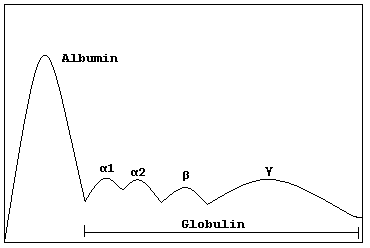
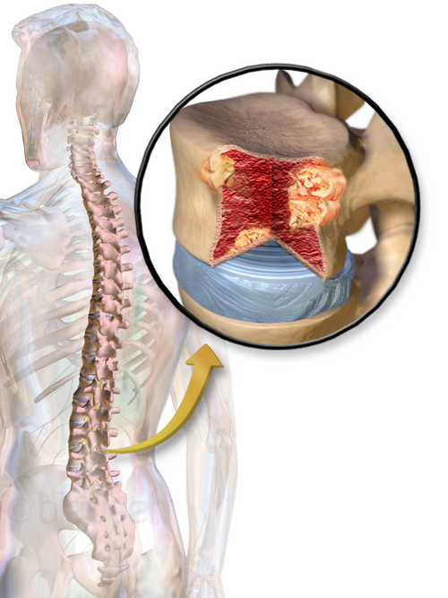

# GAMOPATIAS MONOCLONAIS

Para entender as gamopatias monoclonais, você precisa primeiro visualizar o que acontece na medula óssea. Imagine o plasmócito, aquela célula que deveria ser nossa fábrica de anticorpos (imunoglobulinas) para nos defender. Nas gamopatias, um único clone de plasmócito "decide" se multiplicar de forma descontrolada.

Como esse clone é idêntico, ele produz exatamente a mesma proteína — o que chamamos de **Componente Monoclonal (Proteína M)**. O grande segredo para a prova e para a vida prática é entender que a doença não é apenas a presença dessa proteína, mas sim o que esse "exército de clones" faz com o resto do corpo.

*Figura 1 - Esquema da eletroforese de proteínas séricas mostrando o padrão de bandas proteicas, exame fundamental para identificação do componente monoclonal (Proteína M). Fonte: Jfdwolff, Domínio Público | Wikimedia Commons*

## Fisiopatologia: O "Porquê" das Manifestações

Por que o paciente com Mieloma Múltiplo (MM) tem anemia? Por que o osso quebra? Se você entender a base, não precisará decorar os critérios CRAB.

O plasmócito neoplásico não apenas ocupa espaço na medula (causando anemia por infiltração), mas ele altera todo o microambiente ósseo. Ele secreta citocinas que estimulam o **osteoclasto** (que destrói osso) e inibem o **osteoblasto** (que forma osso).

É por isso que, no Mieloma, a lesão é puramente lítica. Guarde isso: o Mieloma "come" o osso e não deixa o corpo reagir para consertar. Isso explica por que a **Cintilografia Óssea**, que depende da reação osteoblástica para "brilhar", costuma ser normal ou falsamente negativa no Mieloma. Se a banca colocar um idoso com dor óssea e cintilografia normal, não descarte Mieloma!

Além disso, essas células produzem cadeias leves de imunoglobulinas (Kappa ou Lambda). Quando produzidas em excesso, elas sobrecarregam o rim. Elas são filtradas pelo glomérulo e precipitam nos túbulos distais, formando cilindros que causam a "Nefropatia por Cilindros" ou **Rim do Mieloma**.

## Abordagem Diagnóstica: O Caminho das Pedras

Quando suspeitar? O cenário clássico de prova é o idoso com dor lombar persistente, anemia e uma velocidade de hemossedimentação (VHS) muito elevada.

### Eletroforese de Proteínas (EPS)

Este é o exame de triagem. Normalmente, temos uma base larga na região das gamaglobulinas (policlonal). No Mieloma, vemos um **pico agudo e estreito**, o famoso "pico monoclonal".

**Cuidado com a pegadinha:** Cerca de 15-20% dos pacientes com Mieloma produzem *apenas* cadeias leves. Como essas cadeias são pequenas, elas passam pelo rim e não se acumulam no sangue o suficiente para formar um pico visível na EPS. Nesses casos, a EPS pode vir normal! É aqui que entra a importância da **Imunofixação** (mais sensível) e da dosagem de **Cadeias Leves Livres Séricas**.

### Avaliação da Medula Óssea

Para fechar o diagnóstico, precisamos quantificar esses plasmócitos.

- **Mielograma (Aspirado):** Ótimo para ver a morfologia.

- **Biópsia de Medula (BMO):** Fundamental para avaliar a celularidade real e a infiltração focal.

Segundo as diretrizes da ABHH (Associação Brasileira de Hematologia, Hemoterapia e Terapia Celular), o diagnóstico de Mieloma Múltiplo exige a presença de ≥ 10% de plasmócitos clonais na medula óssea (ou plasmocitoma comprovado por biópsia) MAIS a presença de lesão de órgão-alvo (CRAB) ou biomarcadores de malignidade (SLiM).

## Classificação das Gamopatias

Nem todo pico monoclonal é Mieloma. Como o **MedEvo** sempre reforça, a diferenciação entre as entidades é o que mais cai em provas de residência.

### 1. Gamopatia Monoclonal de Significado Indeterminado (GMSI)

É o achado mais comum em idosos (cerca de 3% da população > 50 anos). O paciente é **assintomático**.

- Proteína M < 3 g/dL.

- Plasmócitos na medula < 10%.

- **AUSÊNCIA** de critérios CRAB (sem anemia, sem lesão renal, sem hipercalcemia, sem lesões ósseas).

- Conduta: Observação. O risco de progressão para Mieloma é de apenas 1% ao ano. Não se faz quimioterapia para GMSI!

### 2. Mieloma Múltiplo Indolente (Smoldering Myeloma)

É o meio do caminho. O paciente ainda é assintomático, mas a carga de doença é maior.

- Proteína M ≥ 3 g/dL OU Plasmócitos na medula entre 10% e 60%.

- **AUSÊNCIA** de critérios CRAB.

- Conduta: Geralmente observação rigorosa, embora alguns casos de alto risco já comecem a ser discutidos para tratamento precoce em protocolos específicos.

### 3. Mieloma Múltiplo (MM)

Aqui a doença "mostrou os dentes". O diagnóstico requer Plasmócitos ≥ 10% + um dos critérios abaixo:

**Tabela 1: Critérios de Definição de Mieloma (CRAB e SLiM)**

| Critério | Descrição |
| --- | --- |
| **C** (Cálcio) | Hipercalcemia (> 11 mg/dL ou > 1 mg/dL acima do limite superior) |
| **R** (Renal) | Insuficiência Renal (Creatinina > 2 mg/dL ou ClCr < 40 mL/min) |
| **A** (Anemia) | Hemoglobina < 10 g/dL ou > 2 g/dL abaixo do limite inferior |
| **B** (Bone) | ≥ 1 lesão lítica no RX, TC ou RM |
| **S** (Sixty) | Plasmócitos na medula ≥ 60% (Biomarcador de progressão iminente) |
| **Li** (Light chain) | Relação de cadeias leves livres envolvida/não envolvida ≥ 100 |
| **M** (MRI) | > 1 lesão focal (≥ 5mm) na Ressonância Magnética |

**Dica de Professor:** Se o paciente tem 65% de plasmócitos, mas não tem anemia nem dor óssea, ele JÁ É Mieloma Múltiplo pelo critério "S" do SLiM. Antigamente esperávamos o osso quebrar para tratar; hoje, se o biomarcador diz que vai quebrar em breve, já tratamos.

## O Quadro Clínico e suas "Pérolas"

### Dor Óssea e Lesões Líticas

A dor costuma ser mecânica (piora com movimento) e localiza-se principalmente no esqueleto axial (coluna e costelas).
**Erro clássico:** Pedir cintilografia óssea. O correto é o **Inventário Ósseo** (Série Radiográfica) ou, preferencialmente hoje, a **TC de baixa dose de corpo inteiro**.

### Insuficiência Renal

O "Rim do Mieloma" é causado pela precipitação de cadeias leves.

- **Atenção:** A proteinúria do Mieloma é composta por cadeias leves (Proteína de Bence-Jones). O "dipstick" (fita de urina) comum só detecta albumina. Portanto, o paciente pode ter uma proteinúria maciça na urina de 24h e um exame de fita negativo. Isso é uma dica de ouro para a prova!

- **O que evitar:** AINEs! O uso de anti-inflamatórios em um idoso com dor óssea e Mieloma latente é a receita para o desastre renal.

### Infecções Recorrentes

O paciente com MM tem muitos anticorpos, mas são todos iguais e inúteis (monoclonais). Ele sofre de **hipogamaglobulinemia funcional**.

- As infecções por germes encapsulados (*S. pneumoniae*, *H. influenzae*) são a principal causa de morte.

### Fenômeno de Rouleaux

Devido ao excesso de proteínas no sangue, as hemácias perdem sua carga de repulsão e começam a se empilhar como "moedas". Isso é visível no esfregaço de sangue periférico e explica o VHS estratosférico (frequentemente > 100 mm/h).

*Figura 2 - Ilustração do mieloma múltiplo mostrando plasmócitos neoplásicos infiltrando a medula óssea e causando destruição osteolítica. Fonte: Blausen Medical Communications, CC BY 3.0 | Wikimedia Commons*

## Diagnóstico Diferencial: Não confunda!

### Macroglobulinemia de Waldenström

Aqui o clone não é um plasmócito puro, mas uma célula linfoplasmocitária.

- A proteína produzida é **IgM** (uma molécula gigante, um pentâmero).

- **Clínica:** O IgM alto deixa o sangue viscoso. O paciente tem cefaleia, turvação visual, sangramentos e parestesias (Síndrome de Hiperviscosidade).

- **Diferença do MM:** Na Waldenström, é raro ter lesão lítica ou insuficiência renal. O foco é a infiltração de medula, baço e linfonodos (organomegalia).

### Amiloidose AL (Primária)

As cadeias leves se dobram de forma errada e formam fibras amiloides que se depositam nos tecidos.

- **Sinais Patognomônicos:** Macroglossia (língua grande com marcas de dentes) e Equimose Periorbitária ("olhos de guaxinim" após esforço ou tosse).

- **Coração:** Miocardiopatia restritiva (insuficiência cardíaca com fração de ejeção preservada, mas paredes espessadas).

- **Rim:** Síndrome nefrótica (diferente do MM, onde a lesão é tubular).

- **Diagnóstico:** Biópsia de gordura abdominal ou glândula salivar com coloração **Vermelho do Congo** (mostra birrefringência verde-maçã sob luz polarizada).

### Síndrome POEMS

Uma variante rara que as bancas amam por causa da sigla:

- **P**olineuropatia (geralmente o sintoma principal).

- **O**rganomegalia (hepatoesplenomegalia).

- **E**ndocrinopatia (hipotireoidismo, diabetes, hipogonadismo).

- **M**onoclonal (Proteína M).

- **S**kin (Alterações cutâneas/hipertricose).

- **Diferencial importante:** No POEMS, as lesões ósseas são **OSTEOSCLERÓTICAS** (brancas/densas no RX), ao contrário das lesões líticas do MM clássico.

**Tabela 2: Diferencial das Gamopatias Monoclonais**

| Doença | Proteína Principal | Lesão Óssea | Característica Marcante |
| --- | --- | --- | --- |
| **Mieloma Múltiplo** | IgG ou IgA | Lítica | CRAB, Plasmócitos > 10% |
| **Waldenström** | IgM | Rara | Hiperviscosidade, Adenomegalia |
| **Amiloidose AL** | Cadeia Leve | Ausente | Macroglossia, Síndrome Nefrótica |
| **POEMS** | IgG ou IgA | Esclerótica | Polineuropatia, VEGF elevado |

## Tratamento do Mieloma Múltiplo

O tratamento evoluiu muito. Como diz o **Dr. Will**, hoje não falamos apenas em paliar, mas em buscar respostas profundas. A primeira pergunta que o hematologista faz é: **"Este paciente é elegível ao Transplante de Medula Óssea (TMO) Autólogo?"**

### Pacientes Elegíveis ao TMO (Geralmente

| Estádio | Critérios |
| --- | --- |
| **ISS I** | Beta-2 microglobulina < 3,5 mg/L E Albumina ≥ 3,5 g/dL |
| **ISS II** | Nem I, nem III |
| **ISS III** | Beta-2 microglobulina ≥ 5,5 mg/L |

**Por que a Beta-2 microglobulina?** Ela reflete a massa tumoral e a função renal. Quanto maior, pior o prognóstico. Já a albumina baixa reflete um estado inflamatório sistêmico causado pelas citocinas do mieloma (como a IL-6).

## Situações Especiais e Pegadinhas de Prova

- **Pseudo-hiponatremia:** O excesso de proteína no sangue ocupa espaço no volume plasmático total. O sódio está normal na fase aquosa, mas o aparelho do laboratório lê um valor baixo. Se o paciente está bem e tem hiperproteinemia, desconfie de pseudo-hiponatremia.

- **Ânion Gap Baixo:** Como a proteína M (IgG) tem carga líquida positiva (cátion), ela "consome" o ânion gap. Um ânion gap muito baixo ou até negativo em um paciente com dor óssea é um sinal indireto de Mieloma.

- **Inibidores de Proteassoma (Bortezomibe):** Podem causar disfunção cardiovascular. O proteassoma é responsável por "limpar" proteínas mal dobradas no cardiomiócito. Se você bloqueia o lixeiro, a célula cardíaca sofre.

- **Venetoclax:** É uma droga nova, mas que já aparece em provas de alto nível. Ela funciona muito bem no Mieloma que tem a **translocação t(11;14)**, pois esses pacientes expressam muito a proteína BCL-2.

## Pontos-Chave para Prova 🎓

- **Mieloma Múltiplo = CRAB:** Cálcio (>11), Renal (Cr >2), Anemia (Hb <10), Bone (Lesão lítica).

- **Diagnóstico:** Requer ≥ 10% de plasmócitos clonais na medula óssea.

- **GMSI:** Proteína M < 3g/dL, Plasmócitos < 10% e SEM CRAB. Apenas observa.

- **Mieloma Indolente:** Proteína M > 3g/dL ou Plasmócitos 10-60%, mas SEM CRAB.

- **Cintilografia Óssea:** NÃO deve ser usada para rastreio de lesões no Mieloma (baixa sensibilidade). O correto é Inventário Ósseo ou TC de baixa dose.

- **Rim do Mieloma:** Nefropatia por cilindros de cadeias leves. Dipstick de urina costuma ser negativo para proteína (pois só vê albumina).

- **VHS:** Frequentemente > 100 mm/h devido ao fenômeno de Rouleaux.

- **Prognóstico (ISS):** Os dois marcadores fundamentais são **Beta-2 microglobulina** e **Albumina**.

- **Amiloidose AL:** Suspeite se houver macroglossia, síndrome nefrótica e insuficiência cardíaca restritiva. Diagnóstico com Vermelho do Congo.

- **Macroglobulinemia de Waldenström:** Doença de IgM. Causa hiperviscosidade (cefaleia, turvação visual). Raramente causa lesão óssea.

- **Síndrome POEMS:** Lesões ósseas são **OSTEOSCLERÓTICAS**. Associada a polineuropatia e organomegalia.

- **Causa de Morte:** Infecções bacterianas (pneumococo) são a principal causa de óbito no MM.

- **O que NÃO fazer:** Nunca prescreva AINEs para um paciente com suspeita de Mieloma Múltiplo devido ao alto risco de precipitar insuficiência renal aguda.

- **Tratamento de escolha para jovens:** Indução seguida de Transplante Autólogo de Medula Óssea.

 Cópia offline para consulta pessoal.
 Fonte original:
 [https://www.medevo.com.br/material-apoio/ler/76f949b3-9ae6-4583-bf52-4b757952e752](https://www.medevo.com.br/material-apoio/ler/76f949b3-9ae6-4583-bf52-4b757952e752)
