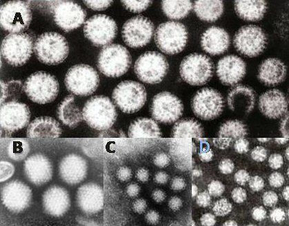

# GASTROENTERITES

Gastroenterite, em pediatria, não deve ser reduzida a “apenas diarreia”. O ponto clínico central é a capacidade da criança de manter a homeostase hidroeletrolítica. A diarreia é um sintoma; a gastroenterite é a síndrome inflamatória ou infecciosa que a causa.

A definição clássica da Organização Mundial da Saúde (OMS) é a ocorrência de três ou mais evacuações amolecidas ou líquidas em 24 horas. Em lactentes pequenos, também é essencial valorizar aumento da frequência ou mudança da consistência em relação ao padrão habitual da criança.

*Figura 1 - Micrografias eletrônicas dos principais vírus causadores de gastroenterite: A) Rotavírus, B) Adenovírus, C) Norovírus e D) Astrovírus, em magnificação de aproximadamente 200.000x. Fonte: Dr. Graham Beards, CC BY 3.0 | Wikimedia Commons*

## Fisiopatologia: O Porquê da Desidratação

A criança desidrata rapidamente por maior superfície corporal em relação ao peso, menor reserva hídrica relativa e dependência de cuidadores para oferta de líquidos. Lactentes e crianças pequenas, portanto, devem ser avaliados precocemente quanto a sinais de desidratação.

Três mecanismos principais explicam a apresentação clínica:

- **Diarreia Osmótica:** Ocorre quando há solutos não absorvidos no lúmen intestinal que "puxam" água. O exemplo clássico é a deficiência secundária de lactase após uma agressão viral. A lactose não absorvida fermenta, gera gases e atrai água.

- **Diarreia Secretora:** Aqui, o enterócito é estimulado a secretar eletrólitos (especialmente Cloro) para o lúmen, e a água segue o gradiente. A toxina do *Vibrio cholerae* é o modelo perfeito disso. Ela não destrói a mucosa, ela apenas "abre a torneira".

- **Diarreia Invasiva (Disenteria):** Há destruição da mucosa. O patógeno invade o epitélio, causando inflamação, exsudação de muco, sangue e pus. É aqui que entram a *Shigella* e a *Salmonella*.

O co-transportador sódio-glicose (SGLT1) costuma permanecer funcional mesmo na diarreia aguda. Essa é a base fisiológica do Soro de Reidratação Oral (SRO): a glicose favorece a absorção de sódio pelo enterócito, e a água acompanha o gradiente osmótico. A composição do SRO, portanto, não busca “dar energia”, mas otimizar a absorção intestinal de água e eletrólitos.

## Etiologia e Epidemiologia

No Brasil, a causa viral ainda domina, mas o perfil mudou com a vacinação.

### Vírus

O **Rotavírus** foi uma das principais causas de internação por diarreia grave em crianças pequenas. É transmitido por via fecal-oral, resiste no ambiente e costuma causar diarreia aquosa, vômitos e febre. A vacina oral contra rotavírus humano reduziu expressivamente formas graves e hospitalizações. Conforme a Nota Técnica nº 193/2024-CGICI/DPNI/SVSA/MS, a rotina prioritária permanece com 1ª dose aos 2 meses e 2ª dose aos 4 meses; para ampliar a oportunidade de proteção em crianças não vacinadas no momento ideal, a 1ª dose pode ser administrada de 1 mês e 15 dias até 11 meses e 29 dias, e a 2ª dose de 3 meses e 15 dias até 23 meses e 29 dias, respeitando intervalo mínimo de 30 dias entre doses. A contraindicação segue incluindo história prévia de invaginação intestinal e condições específicas de imunodeficiência ou doença gastrointestinal relevante.

| Vacina rotavírus humano | Rotina prioritária | Janela ampliada conforme NT 193/2024 |
| --- | --- | --- |
| 1ª dose | 2 meses | De 1 mês e 15 dias até 11 meses e 29 dias |
| 2ª dose | 4 meses | De 3 meses e 15 dias até 23 meses e 29 dias |
| Intervalo mínimo | — | 30 dias entre doses |

O **Norovírus** hoje é a principal causa de surtos em creches e escolas. Ele é extremamente infectante e causa muitos vômitos, muitas vezes mimetizando uma intoxicação alimentar.

### Bactérias

Pontos clássicos de diferenciação etiológica:

- **Shigella:** causa frequente de disenteria com sangue e muco. A neurotoxina pode cursar com **convulsão afebril**; a associação “diarreia com sangue + convulsão” favorece *Shigella*.

- **Salmonella:** Comum após ingestão de ovos ou contato com répteis. O risco aqui é a bacteremia, especialmente em menores de 3 meses ou imunocomprometidos.

- **Escherichia coli entero-hemorrágica (EHEC - O157:H7):** causa disenteria e está associada à **Síndrome Hemolítico-Urêmica (SHU)**. Na suspeita de EHEC, **antibiótico deve ser evitado**, pois pode aumentar liberação de toxina Shiga e risco de SHU.

- **Campylobacter jejuni:** Frequentemente associada à Síndrome de Guillain-Barré semanas após o quadro intestinal.

### Parasitas

Não subestime os vermes. Em áreas com saneamento precário, eles são protagonistas.

- **Giardia lamblia:** Causa diarreia crônica, esteatorreia (fezes gordurosas que flutuam) e má absorção. O trofozoíta "tapeta" o duodeno, impedindo a absorção de nutrientes.

- **Entamoeba histolytica:** Causa disenteria amebiana e pode evoluir com abscesso hepático (dor em hipocôndrio direito + febre).

## Avaliação do Estado de Hidratação

A classificação do estado de hidratação deve seguir critérios clínicos do Ministério da Saúde e da Sociedade Brasileira de Pediatria (SBP).

| Sinal/Sintoma | Sem Desidratação | Desidratação (Leve/Mod) | Desidratação Grave |
| --- | --- | --- | --- |
| Condição | Alerta, ativo | Irritado, sedento | Letárgico, comatoso |
| Olhos | Normais | Fundos (encovados) | Muito fundos |
| Sede | Bebe normal | Bebe avidamente | Não consegue beber |
| Sinal da Prega | Desaparece rápido | Desaparece lentamente | Muito lento (> 2 seg) |
| Pulso | Cheio | Rápido, fraco | Muito fraco ou ausente |
| **Conduta** | **Plano A** | **Plano B** | **Plano C** |

**Erro comum de aluno:** Achar que precisa de todos os sinais para classificar. Se a criança tiver dois ou mais sinais de uma coluna, ela já entra naquela classificação. Se tiver sinais mistos, sempre classifique pela maior gravidade.

## Manejo Terapêutico: Planos A, B e C

### Plano A: Tratamento Domiciliar

Para a criança que tem diarreia, mas não está desidratada. O objetivo é prevenir a desidratação.

- **Aumento da oferta de líquidos:** SRO após cada evacuação (50-100ml para <2 anos; 100-200ml para >2 anos).

- **Manter alimentação habitual:** Não se faz dieta restritiva. O intestino precisa de nutrientes para se recuperar. Se a criança mama, mantenha o aleitamento materno exclusivo.

- **Zinco:** Recomendação do Ministério da Saúde para todas as crianças com diarreia aguda. Dose: 10mg/dia para <6 meses e 20mg/dia para >6 meses, por 10 a 14 dias. O zinco reduz a duração do episódio e previne novos episódios nos meses seguintes.

- **Sinais de alerta:** Ensinar a mãe quando voltar (vômitos repetidos, sangue nas fezes, recusa alimentar, febre alta).

### Plano B: Terapia de Reidratação Oral (TRO) no Serviço de Saúde

Para a criança desidratada, mas que ainda consegue beber.

- **Quantidade:** 50 a 100 ml/kg de SRO em um período de 4 a 6 horas.

- Não se usa sonda nasogástrica (SNG) de rotina, a menos que a criança vomite muito (mais de 4 vezes em 1 hora).

- Se houver melhora (desaparecimento dos sinais de desidratação), passa para o Plano A. Se piorar ou não melhorar, vai para o Plano C.

### Plano C: Reidratação Venosa

Para desidratação grave ou choque.
Segundo o Ministério da Saúde (Diretriz atualizada):

- **Fase de Expansão (Menores de 5 anos):**

- Soro Fisiológico 0,9%: 20 ml/kg.

- Em lactentes, pode-se fazer em 30 minutos. Repetir se necessário até a estabilização hemodinâmica.

- **Fase de Manutenção e Reposição (Regra de Holliday-Segar):**

- Até 10 kg: 100 ml/kg.

- 10 a 20 kg: 1000 ml + 50 ml/kg para cada kg acima de 10.

- Acima de 20 kg: 1500 ml + 20 ml/kg para cada kg acima de 20.

**Cuidado:** A regra de Holliday-Segar é para manutenção. Na fase aguda do choque, o foco é volume rápido (cristaloide).

## Uso de Antibióticos e Medicamentos Adjuvantes

Aqui é onde muitos alunos perdem pontos por quererem "tratar demais".

- **Antidiarreicos (Loperamida):** **CONTRAINDICADOS** em pediatria. Podem causar íleo paralítico, distensão abdominal e mascarar a perda de volume no lúmen, além de favorecer a translocação bacteriana e megacólon tóxico.

- **Antieméticos:** A Ondansetrona (0,15 mg/kg dose única) pode ser considerada se os vômitos estiverem impedindo a TRO, mas não é rotina para todos.

- **Probióticos:** Podem reduzir o tempo de diarreia em cerca de 24 horas, mas não são essenciais para o tratamento.

**Quando usar Antibiótico?**
Apenas em situações específicas:

- **Shigellose:** Se houver comprometimento do estado geral ou em surtos. Primeira escolha: Ciprofloxacina (15 mg/kg 12/12h por 3 dias) ou Ceftriaxona.

- **Cólera:** Azitromicina (dose única) ou Doxiciclina.

- **Salmonelose em grupos de risco:** Menores de 3 meses, imunodeprimidos ou anemia falciforme (risco de osteomielite).

- **Amebíase e Giardíase:** Metronidazol (15 mg/kg/dia para Giardia; 30-50 mg/kg/dia para Ameba) ou Tinidazol/Nitazoxanida.

## Parasitoses Intestinais: Diagnóstico e Tratamento Essenciais

Parasitoses intestinais são frequentes em áreas com saneamento insuficiente e devem ser reconhecidas por padrão clínico, complicações e tratamento específico.

### Helmintos (Vermes)

- **Ascaris lumbricoides:** O mais comum. Pode causar obstrução intestinal (bolo de áscaris). Tratamento: Albendazol (400mg dose única) ou Mebendazol. Se houver obstrução, **albendazol deve ser evitado inicialmente**; piperazina associada a óleo mineral pode ser utilizada para paralisar os helmintos antes da eliminação, reduzindo risco de piora da obstrução.

- **Ancilostomíase (Amarelão):** *Ancylostoma duodenale* ou *Necator americanus*. Causam anemia ferropriva grave porque o verme "morde" a mucosa e suga sangue.

- **Strongyloides stercoralis:** O perigo aqui é a autoinfestação. Em pacientes imunossuprimidos (especialmente em uso de corticoides), pode causar a Síndrome de Hiperinfestação. Tratamento de escolha: **Ivermectina**.

- **Enterobius vermicularis (Oxiuríase):** O sintoma clássico é o **prurido anal noturno**. A fêmea migra para a região perianal à noite para botar ovos. Pode causar vulvovaginite em meninas. Diagnóstico: Fita gomada (Método de Graham). Tratamento: albendazol, com repetição em 2 semanas para cobrir ovos eclodidos. Contatos domiciliares devem ser tratados quando indicado.

- **Trichuris trichiura (Tricuríase):** em infestações maciças, pode causar **prolapso retal**, especialmente em crianças desnutridas com diarreia crônica.

### Síndrome de Löffler

Alguns vermes fazem o ciclo pulmonar (Ciclo de Loss). A mnemônica clássica é **NASA**:

- **N**ecator americanus

- **A**ncylostoma duodenale

- **S**trongyloides stercoralis

- **A**scaris lumbricoides

O quadro clínico inclui tosse seca, febre baixa, infiltrados pulmonares migratórios na radiografia e **eosinofilia importante**. Pneumonia que não melhora com antibiótico associada a eosinofilia deve levantar suspeita de síndrome de Löffler.

### Cestódeos (Tênias)

- **Tenia saginata (boi) e Tenia solium (porco):** Ingestão de carne mal cozida com cisticercos gera a teníase (verme adulto no intestino).

- **Cisticercose:** Ocorre quando o humano ingere os **ovos** da *T. solium* (fecal-oral). O humano faz o papel do porco e desenvolve cisticercos nos tecidos (cérebro, músculos).

*Figura 2 - Paciente recebendo solução de reidratação oral (SRO), tratamento fundamental na desidratação por gastroenterite. Fonte: CDC, Domínio Público | Wikimedia Commons*

## Diagnóstico Diferencial e Complicações

Nem todo quadro com evacuações alteradas representa gastroenterite infecciosa.

### Intussuscepção Intestinal

É a invaginação de um segmento do intestino em outro. Ocorre tipicamente entre 3 meses e 2 anos.

- **Tríade clássica:** Dor abdominal súbita (cólica paroxística), vômitos e fezes em "geleia de framboesa" (muco com sangue).

- Ao exame: Massa palpável em "salsicha" no abdome.

- Diagnóstico/Tratamento: Ultrassom abdominal e redução por enema (salino ou aéreo).

### Síndrome Hemolítico-Urêmica (SHU)

Geralmente ocorre 5-7 dias após uma diarreia por EHEC ou *Shigella*.

- **Tríade:** Anemia hemolítica microangiopática (esquizócitos no sangue periférico), Trombocitopenia (plaquetas baixas) e Insuficiência Renal Aguda (oligúria e aumento de escórias).

- **Manejo:** Suporte, diálise se necessário. **Evitar antibióticos e antiplaquetários.**

### Colite Pseudomembranosa

Suspeitar em crianças que usaram antibióticos de largo espectro (Clindamicina, Cefalosporinas) e desenvolveram diarreia com muco e sangue. Causada pela toxina do *Clostridioides difficile*. Tratamento: Vancomicina oral ou Metronidazol.

## Tabelas Comparativas para Revisão Rápida

### Tabela 1: Diferenciando os Agentes Bacterianos

| Agente | Característica Marcante | Complicação Temida |
| --- | --- | --- |
| *Shigella* | Disenteria + Febre alta | Convulsão Afebril / SHU |
| *Salmonella* | Ovos/Répteis/Aves | Bacteremia / Osteomielite |
| *E. coli* (EHEC) | Carne mal passada / Sem febre | SHU (Principal causa) |
| *Campylobacter* | Diarreia prolongada | Síndrome de Guillain-Barré |
| *V. cholerae* | Água de arroz / Sem dor | Choque hipovolêmico rápido |

### Tabela 2: Tratamento das Parasitoses

| Parasita | Droga de Escolha | Observação |
| --- | --- | --- |
| *Ascaris* | Albendazol 400mg dose única | Cuidado com obstrução |
| *Strongyloides* | Ivermectina 200mcg/kg (2 dias) | Risco em usuários de corticoide |
| *Giardia* | Metronidazol ou Tinidazol | Diarreia gordurosa |
| *Enterobius* | Albendazol (repetir em 14 dias) | Prurido anal noturno |
| *Schistosoma* | Praziquantel | Hepatomegalia / Hipertensão portal |

## Pontos-Chave

- **Definição de Diarreia:** ≥ 3 evacuações líquidas/amolecidas em 24h.

- **SRO:** O componente mais importante para a absorção de água é a Glicose (via SGLT1).

- **Zinco:** Obrigatório no tratamento da diarreia aguda no Brasil (10-14 dias).

- **Plano B:** 50-100 ml/kg de SRO em 4-6 horas. Não se usa venosa aqui.

- **Plano C:** Expansão com SF 0,9% 20 ml/kg.

- **Contraindicação Absoluta:** Nunca usar Loperamida ou similares em crianças com diarreia.

- **Shigella:** Pense em convulsão afebril.

- **EHEC (O157:H7):** Antibiótico é contraindicado pelo risco de SHU.

- **Síndrome de Löffler:** Tosse + Eosinofilia + Infiltrado Pulmonar (NASA).

- **Enterobíase:** Prurido anal noturno. Diagnóstico por fita gomada, não por EPF comum.

- **Tricuríase:** Prolapso retal em crianças desnutridas.

- **Vacina rotavírus humano:** vacina oral de vírus vivo atenuado. Rotina prioritária: 1ª dose aos 2 meses e 2ª dose aos 4 meses. Conforme Nota Técnica nº 193/2024-CGICI/DPNI/SVSA/MS, pode-se aplicar D1 de 1 mês e 15 dias até 11 meses e 29 dias e D2 de 3 meses e 15 dias até 23 meses e 29 dias, com intervalo mínimo de 30 dias.

- **Hepatite A:** Transmissão fecal-oral. O marcador de fase aguda é o Anti-HAV IgM.

- **Intussuscepção:** Fezes em geleia de framboesa e dor abdominal em cólica.

- **Cólera:** Notificação compulsória imediata. Diarreia em "água de arroz".

- **SHU:** tríade de anemia hemolítica microangiopática, plaquetopenia e insuficiência renal aguda.

 Cópia offline para consulta pessoal.
 Fonte original:
 [https://www.medevo.com.br/material-apoio/ler/76ee199a-9c78-4abc-b52f-f09e92be767f](https://www.medevo.com.br/material-apoio/ler/76ee199a-9c78-4abc-b52f-f09e92be767f)
