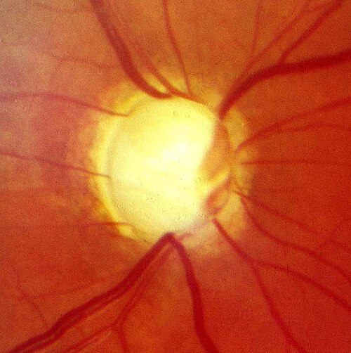

# GLAUCOMA

Para entender glaucoma, a primeira coisa que você precisa fazer é esquecer a definição simplista de "pressão alta no olho". Se você levar apenas isso para a prova, vai errar questões sobre glaucoma de pressão normal ou sobre hipertensão ocular isolada.

O glaucoma é uma **neuropatia óptica progressiva** caracterizada por alterações típicas na camada de fibras nervosas da retina e no disco óptico (a papila), com repercussão correspondente no campo visual. A Pressão Intraocular (PIO) elevada é o principal fator de risco, mas não é o único e, tecnicamente, não faz parte da definição da doença.

*Figura 1 - Fotografia clínica de glaucoma agudo de ângulo fechado, mostrando hiperemia conjuntival e pupila em meia-midríase devido à elevação súbita da pressão intraocular por bloqueio da malha trabecular pela íris. Fonte: Jonathan Trobe, CC BY 3.0 | Wikimedia Commons*

## Fisiopatologia: O Caminho do Humor Aquoso

Por que o olho "enche"? Imagine o olho como uma pia com a torneira aberta e o ralo funcionando. O "humor aquoso" é produzido nos processos ciliares (corpo ciliar), passa pela pupila para a câmara anterior e é drenado, em sua maior parte (cerca de 80-90%), pela malha trabecular (via convencional) até o canal de Schlemm. O restante sai pela via uveoescleral.

O glaucoma acontece quando o "ralo" entope ou a "porta" para o ralo fecha.

- No **Glaucoma de Ângulo Aberto**, o acesso ao ralo está livre, mas o ralo (malha trabecular) está "entupido" ou resistente.

- No **Glaucoma de Ângulo Fechado**, a própria íris encosta na córnea e fecha o acesso ao ralo.

Aqui entra uma dica do MedEvo: as bancas amam cobrar a anatomia aplicada. Se o paciente é hipermétrope, o olho dele é "curto", tudo é apertado lá dentro, o que predispõe ao fechamento do ângulo. Se ele é míope, o olho é longo, o que está mais associado ao glaucoma de ângulo aberto.

## Glaucoma Primário de Ângulo Aberto (GPAA)

Este é o tipo mais comum e o mais perigoso para o paciente, pois é o "ladrão silencioso da visão". O paciente não sente dor, o olho não fica vermelho e a perda visual começa pela periferia. Quando ele percebe que está enxergando mal, já perdeu 80% das fibras nervosas.

### Fatores de Risco

- **Idade avançada:** O risco aumenta exponencialmente após os 40 anos.

- **Raça:** Mais comum e agressivo em negros.

- **História Familiar:** Ter um parente de primeiro grau com glaucoma aumenta muito o risco.

- **Miopia:** Olhos míopes têm maior predisposição ao GPAA.

- **PIO elevada:** É o único fator que conseguimos modificar.

### O Exame Físico e a Escavação da Papila

Quando você olha o fundo de olho de um paciente, você vê o disco óptico (papila). No centro dele, existe uma depressão natural chamada **escavação**.

No glaucoma, as fibras nervosas morrem e a escavação aumenta.

- **O que cai na prova:** Escavação maior que 0,5 (ou 50% do diâmetro do disco) ou assimetria entre os dois olhos maior que 0,2 é suspeito.

- **Sinal de Notch:** É uma perda localizada da rima neural, geralmente nos polos superior ou inferior.

- **Hemorragia de Drance:** Uma hemorragia em chama de vela na borda do disco, sinal de progressão da doença.

## Glaucoma Agudo de Ângulo Fechado (GAAF)

Esta é a estrela das provas de emergência. Aqui não há silêncio; há drama. O ângulo fecha subitamente, a PIO sobe de 10-20 mmHg para 50-70 mmHg em minutos.

### O Cenário Típico

Paciente idoso, muitas vezes hipermétrope, que estava em um ambiente com pouca luz (cinema) ou usou alguma medicação que causou **midríase**.

**Por que a midríase?** Quando a pupila dilata, a íris se "amontoa" na periferia, bloqueando a malha trabecular.

### Medicamentos Perigosos (Pegadinha de Prova)

As bancas adoram perguntar quais drogas podem desencadear uma crise. Guarde estas classes:

- **Anticolinérgicos:** Atropina, escopolamina (Buscopan).

- **Antidepressivos Tricíclicos (ADTs):** Amitriptilina (tem efeito anticolinérgico).

- **Simpaticomiméticos:** Adrenalina, descongestionantes nasais.

- **Inibidores Seletivos da Recaptação de Serotonina (ISRS):** Podem causar midríase leve, mas o risco é real em pacientes predispostos.

### Quadro Clínico do Glaucoma Agudo

- Dor ocular súbita e lancinante (o paciente diz que parece uma facada).

- Cefaleia ipsilateral intensa (muitas vezes confundida com enxaqueca).

- **Sintomas Vagais:** Náuseas e vômitos intensos (cuidado: o aluno desatento acha que é um quadro abdominal e esquece de olhar o olho).

- Visão de "halos coloridos" ao redor das luzes (devido ao edema de córnea).

- Olho muito vermelho (hiperemia ciliar).

- **Pupila em médio-midríase fixa:** Ela não reage à luz e fica "parada" no meio do caminho.

- Córnea "embaçada" ou "leitosa" (edema de córnea).

- Ao toque, o globo ocular está endurecido ("olho de pedra").

### Tabela 1: Diagnóstico Diferencial do Olho Vermelho com Dor

| Característica | Glaucoma Agudo | Uveíte Anterior | Conjuntivite |
| --- | --- | --- | --- |
| **Dor** | Intensa / Lancinante | Moderada / Fotofobia | Sensação de areia |
| **Pupila** | Médio-midríase fixa | Miose (pupila pequena) | Normal |
| **Acuidade Visual** | Muito reduzida | Reduzida | Normal |
| **PIO** | Muito elevada | Geralmente baixa ou normal | Normal |
| **Secreção** | Ausente (lacrimejamento apenas) | Ausente | Mucopurulenta ou aquosa |

## Manejo de Emergência no Glaucoma Agudo

Se você estiver no plantão e chegar esse paciente, o objetivo é um só: baixar a pressão IMEDIATAMENTE para salvar o nervo óptico. Não espere o oftalmologista chegar para começar as medidas sistêmicas se o diagnóstico for claro.

- **Agentes Osmóticos:** Manitol IV (1-2g/kg). Ele "puxa" a água de dentro do olho para o sangue.

- *Cuidado:* Contraindicado em insuficiência cardíaca grave ou edema agudo de pulmão.

- **Inibidores da Anidrase Carbônica:** Acetazolamida (Diamox) 250mg, 2 comprimidos VO de imediato. Reduz a produção de humor aquoso.

- **Betabloqueadores Tópicos:** Timolol 0,5% colírio. Reduz a produção.

- *Cuidado:* Contraindicado em asmáticos e pacientes com BAV de 2º ou 3º grau.

- **Agonistas Alfa-2 Adrenérgicos:** Brimonidina colírio.

- **Mióticos:** Pilocarpina 1% ou 2%.

- *Pérola Clínica:* A pilocarpina só funciona quando a PIO baixar de 40 mmHg, porque acima disso o esfíncter da íris está isquêmico e não responde. Ela serve para "puxar" a íris para longe do ângulo.

**Tratamento Definitivo:** Iridotomia Periférica a Laser (YAG Laser). Faz-se um "furo" na íris para criar uma via alternativa para o líquido. **Importante:** Deve-se fazer no olho afetado E no olho contralateral (profilático), pois a anatomia é semelhante e o outro olho corre risco iminente.

## Glaucoma Congênito Primário

Este é o diagnóstico que você não pode comer bola na pediatria. Ocorre por uma malformação no ângulo (membrana de Barkan) que impede a drenagem desde o nascimento ou primeiros meses.

### A Tríade Clássica

- **Epífora (Lacrimejamento excessivo).**

- **Fotofobia (A criança não consegue abrir o olho na luz).**

- **Blefarospasmo (Contração das pálpebras).**

**O sinal patognomônico:** **Buftalmo** ("olho de boi"). Como a esclera da criança é elástica, o aumento da pressão faz o olho crescer de tamanho. Se você vir um bebê com "olhos grandes e lindos", mas que lacrimejam muito, suspeite de glaucoma. O edema de córnea pode deixar o olho azulado ou esbranquiçado.

O tratamento do glaucoma congênito é **cirúrgico** (Goniotomia ou Trabeculotomia). Diferente do adulto, o colírio aqui é apenas uma ponte para a cirurgia.

*Figura 2 - Fundoscopia mostrando disco óptico com escavação aumentada (aumento da relação escavação/disco) em glaucoma avançado. Fonte: Snoop, CC BY-SA 3.0 | Wikimedia Commons*

## Diagnóstico e Exames Complementares

Para o GPAA (o crônico), o diagnóstico é um quebra-cabeça. Segundo a Diretriz Brasileira de Glaucoma (CBO/SBG), precisamos de:

- **Tonometria de Aplanação (Goldmann):** É o padrão-ouro. A PIO média é 15-16 mmHg. Acima de 21 mmHg é considerado estatisticamente elevado, mas lembre-se: existem pessoas com 25 mmHg sem lesão (Hipertensos Oculares) e pessoas com 12 mmHg com lesão (Glaucoma de Pressão Normal).

- **Gonioscopia:** Essencial para diferenciar ângulo aberto de fechado. Se você não fizer gonioscopia, não diagnosticou o tipo de glaucoma.

- **Fundoscopia / Retinografia:** Avaliar a escavação e a rima neural.

- **Paquimetria:** Mede a espessura da córnea. Córneas muito finas subestimam a pressão real (a pressão medida é menor que a real). Córneas grossas superestimam.

- **Campo Visual Computadorizado (Perimetria):** Avalia a função. O dano clássico é o **escotoma arqueado** ou o degrau nasal.

- **OCT (Tomografia de Coerência Óptica):** Mede a espessura da camada de fibras nervosas. É excelente para diagnóstico precoce, antes mesmo de alterar o campo visual.

## Tratamento Farmacológico Crônico

No GPAA, começamos geralmente com monoterapia. O objetivo é reduzir a PIO em pelo menos 20-30% do valor basal.

### Tabela 2: Classes de Medicamentos para Glaucoma

| Classe | Exemplos | Mecanismo | Principais Efeitos Colaterais / Contraindicações |
| --- | --- | --- | --- |
| **Análogos de Prostaglandina** | Latanoprosta, Travoprosta | Aumenta saída Uveoescleral | **Primeira escolha.** Crescimento de cílios, escurecimento da íris, hiperemia conjuntival. |
| **Betabloqueadores** | Timolol | Reduz produção de humor aquoso | **Contraindicado:** Asma, DPOC grave, Bradicardia, BAV. |
| **Alfa-2 Agonistas** | Brimonidina | Reduz produção e aumenta saída | Alergia ocular frequente. Cuidado em crianças (depressão do SNC). |
| **Inibidores da Anidrase Carbônica** | Dorzolamida (tópico), Acetazolamida (VO) | Reduz produção | Gosto metálico, parestesias (se VO), acidose metabólica (se VO). |
| **Mióticos** | Pilocarpina | Aumenta saída trabecular | Miose, dor supraciliar, risco de descolamento de retina. |

**Dica do Dr. Will:** Se a prova trouxer um paciente idoso com insuficiência cardíaca ou asma, risque o Timolol das opções. Se o paciente quer o tratamento mais potente e com menos efeitos colaterais sistêmicos, a primeira escolha são as Prostaglandinas (posologia de 1x ao dia, o que ajuda na adesão).

## Diabetes e o Olho: Não confunda as doenças

As bancas misturam Glaucoma com Retinopatia Diabética. Vamos organizar:

- **Retinopatia Diabética:** É uma doença vascular da retina. Causa perda visual por edema macular ou hemorragia vítrea.

- **Glaucoma Neovascular:** É uma complicação do diabetes grave. A isquemia da retina faz crescer vasos novos (neovasos) na íris (rubeosis iridis) que "entopem" o ângulo. É um glaucoma secundário, de difícil tratamento e prognóstico ruim.

**Rastreamento:** Todo diabético tipo 2 deve fazer exame oftalmológico ao diagnóstico. O tipo 1, após 5 anos do diagnóstico. O objetivo é detectar retinopatia, mas a medida da PIO faz parte do exame de rotina.

## Situações Especiais e Pegadinhas

### Glaucoma de Pressão Normal (GPN)

O paciente tem escavação aumentada e perda de campo visual, mas a PIO está sempre abaixo de 21 mmHg. Está muito associado a fenômenos vasculares, como enxaqueca e Síndrome de Raynaud. O tratamento também é baixar a PIO, mas para níveis bem baixos (ex: 10-12 mmHg).

### Hipertensão Ocular

O paciente tem PIO > 21 mmHg, mas o nervo óptico é normal e o campo visual também. Nem todo mundo precisa de colírio. Tratamos se houver outros fatores de risco (córnea fina, escavação suspeita, história familiar forte).

### Uso de Corticoides

O uso crônico de corticoides (seja colírio, pomada, oral ou inalatório) pode aumentar a PIO em pacientes suscetíveis ("corticorresponsivos"). Sempre que um paciente usar corticoide por muito tempo, a PIO deve ser monitorada.

### Tabela 3: Metas Terapêuticas e Seguimento

| Estágio do Glaucoma | Meta de Redução da PIO | Exames de Seguimento |
| --- | --- | --- |
| **Leve** | Redução de 20-25% | Campo visual e OCT a cada 6-12 meses |
| **Moderado** | Redução de 30% | Campo visual e OCT a cada 6 meses |
| **Avançado** | PIO alvo < 12-14 mmHg | Campo visual a cada 3-4 meses |

## Pontos-Chave para Prova 👁️

- **Definição:** Neuropatia óptica progressiva com alteração de disco óptico e campo visual. PIO elevada é fator de risco, não definição.

- **Glaucoma Agudo (GAAF):** Emergência! Dor intensa, náuseas, vômitos, pupila em médio-midríase fixa e edema de córnea.

- **Tratamento Imediato GAAF:** Manitol IV, Acetazolamida VO, Timolol tópico. Pilocarpina após baixar a PIO.

- **Iridotomia a Laser:** Tratamento definitivo para o ângulo fechado. Deve ser feito em AMBOS os olhos.

- **GPAA:** Assintomático, perda de visão periférica, aumento da escavação da papila (> 0,5).

- **Fatores de Risco GPAA:** Idade, raça negra, história familiar, miopia.

- **Fatores de Risco GAAF:** Idade, sexo feminino, hipermetropia, raça asiática.

- **Betabloqueadores (Timolol):** Contraindicados em asmáticos, DPOC e bradicárdicos.

- **Análogos de Prostaglandina:** Primeira escolha no GPAA. Aumentam a drenagem uveoescleral.

- **Glaucoma Congênito:** Tríade (epífora, fotofobia, blefarospasmo) + Buftalmo. Tratamento é cirúrgico.

- **Antidepressivos Tricíclicos e Anticolinérgicos:** Podem desencadear crise de glaucoma agudo por causarem midríase.

- **Escavação da Papila:** O aumento da escavação vertical é um sinal precoce de perda de fibras nervosas.

- **Campo Visual:** O defeito clássico é o escotoma arqueado que respeita a linha média horizontal.

- **Diabetes:** Causa glaucoma neovascular (secundário) devido à isquemia retiniana crônica.

- **Miopia vs. Hipermetropia:** Míope tem mais risco de ângulo aberto; Hipermetrópe tem mais risco de ângulo fechado.

- **O que NÃO fazer:** Nunca dilatar a pupila de um paciente com câmara anterior rasa (ângulo estreito) sem antes realizar gonioscopia.

- **Manitol:** Cuidado com idosos e cardiopatas (risco de sobrecarga volêmica e edema pulmonar).

- **Acetazolamida:** Pode causar hipocalemia e parestesias. É um derivado das sulfonamidas (cuidado com alérgicos a sulfa).

 Cópia offline para consulta pessoal.
 Fonte original:
 [https://www.medevo.com.br/material-apoio/ler/fb226af2-ca3f-4c76-a169-77034c774b40](https://www.medevo.com.br/material-apoio/ler/fb226af2-ca3f-4c76-a169-77034c774b40)
