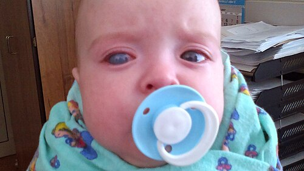
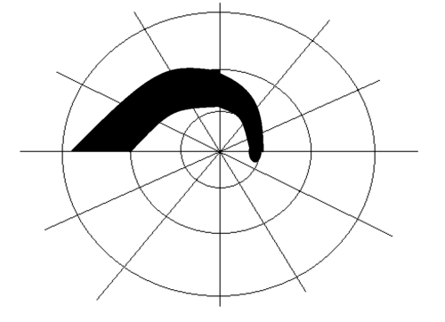

# GLAUCOMAS SECUNDÁRIOS E CONGÊNITOS

Para entender os glaucomas secundários e congênitos, você precisa primeiro abandonar a ideia de que o glaucoma é uma doença única. No glaucoma primário de ângulo aberto, lidamos com um processo degenerativo e silencioso. Já nos secundários, existe sempre um "vilão" identificável, uma causa subjacente que obstrui a drenagem do humor aquoso.

O segredo para acertar questões de prova sobre esse tema é identificar o mecanismo de obstrução. Se você entender por que o humor aquoso não está saindo, a conduta e o diagnóstico tornam-se lógicos. Como costumo dizer nas aulas do MedEvo, o olho é um sistema hidráulico, se a pressão subiu, ou a torneira abriu demais (raro) ou o ralo entupiu.

*Figura 1 - Buftalmo (hidroftalmo) em criança com glaucoma congênito, demonstrando aumento do globo ocular devido à elevação crônica da pressão intraocular. Fonte: Michalgoback, CC BY-SA 4.0 | Wikimedia Commons*

## Glaucoma Congênito Primário (GCP)

O Glaucoma Congênito Primário é uma emergência oftalmológica pediátrica. Ele ocorre devido a uma malformação isolada do ângulo da câmara anterior, conhecida como disgenesia trabecular. Aqui, o humor aquoso encontra uma resistência mecânica logo na "saída", devido à falha no desenvolvimento embrionário do tecido uveal.

Diferente do adulto, o olho da criança é elástico. Por isso, o aumento da pressão intraocular (PIO) causa uma distensão de todos os tecidos oculares. É o que chamamos de buftalmo, o "olho de boi".

### Fisiopatologia e Quadro Clínico

A teoria mais aceita é a de Barkan, que sugere a presença de uma membrana (Membrana de Barkan) recobrindo o trabéculo. Na verdade, o que vemos é uma inserção alta da íris, que mascara as estruturas do ângulo.

A tríade clássica que você deve memorizar para a prova é:

- Epífora (lacrimejamento excessivo)

- Fotofobia (sensibilidade à luz)

- Blefaroespasmo (contração involuntária das pálpebras)

Por que a criança tem fotofobia? Porque o aumento da PIO causa edema de córnea e estiramento das fibras nervosas. Quando a córnea estica demais, ocorrem rupturas na membrana de Descemet, chamadas de Estrias de Haab. Cuidado: as Estrias de Haab são horizontais ou curvilíneas e indicam que a PIO esteve muito alta no passado ou no presente.

### Diagnóstico e Valores de Referência

O diagnóstico é clínico e, muitas vezes, exige exame sob narcose (anestesia). Isso porque a pressão da criança muda com o choro e com o tipo de anestésico usado. O Halotano, por exemplo, baixa a PIO, enquanto a Cetamina pode elevá-la.

Os critérios diagnósticos incluem:

- PIO > 21 mmHg (medida com tonômetro de Perkins ou Goldmann).

- Diâmetro corneano aumentado: No recém-nascido, o normal é até 10,5 mm. Se for > 12 mm no primeiro ano de vida, suspeite fortemente de glaucoma.

- Escavação do disco óptico: Diferente do adulto, a escavação no bebê pode regredir se a PIO for controlada rapidamente.

- Edema de córnea e buftalmo.

### Tratamento do Glaucoma Congênito

Aqui está a primeira grande diferença para o glaucoma do adulto: o tratamento do Glaucoma Congênito Primário é eminentemente CIRÚRGICO. Não perca tempo tentando controlar apenas com colírios. O colírio é apenas uma ponte até a cirurgia.

A escolha da técnica depende da transparência da córnea:

- Córnea Transparente: Goniotomia. O cirurgião entra na câmara anterior e faz uma incisão no trabéculo sob visualização direta.

- Córnea Opaca: Trabeculotomia. Como não se enxerga o ângulo por dentro, o cirurgião acessa o Canal de Schlemm por fora e "rompe" a parede interna para a câmara anterior.

Se essas falharem, partimos para a Trabeculectomia (TREC) ou implantes de drenagem, embora os resultados em crianças sejam piores devido à cicatrização exuberante.

## Glaucomas Secundários de Ângulo Aberto

Nos glaucomas secundários de ângulo aberto, o ângulo está "visível" na gonioscopia, mas o trabéculo está obstruído por algum material ou sofreu uma alteração funcional.

### Síndrome de Pseudoesfoliação (PEX)

Este é o glaucoma secundário de ângulo aberto mais comum no mundo. É uma doença sistêmica onde um material fibrilar esbranquiçado se deposita em várias estruturas do corpo, mas principalmente no olho.

O que cai na prova:

- Depósitos esbranquiçados na borda pupilar e na cápsula anterior do cristalino (com aspecto de "alvo").

- Dispersão de pigmento no ângulo (Linha de Sampaolesi, uma linha pigmentada anterior à linha de Schwalbe).

- Fragilidade zonular: O material de esfoliação enfraquece os ligamentos que seguram o cristalino. Isso torna a cirurgia de catarata muito mais perigosa nesses pacientes.

O tratamento segue a linha do glaucoma primário, mas a PIO costuma ser mais alta e de difícil controle. A trabeculoplastia a laser (SLT) funciona muito bem aqui porque o ângulo é bem pigmentado.

### Síndrome de Dispersão Pigmentar (SDP)

Ao contrário da pseudoesfoliação, o glaucoma pigmentar atinge pacientes jovens, homens e míopes. O mecanismo é mecânico: a íris tem uma configuração côncava e "raspa" nas zônulas do cristalino, liberando pigmento na câmara anterior.

Sinais clássicos:

- Fuso de Krukenberg: Depósito de pigmento vertical no endotélio corneano.

- Defeitos de transiluminação iriana (em "roda de carroça").

- Ângulo muito hiperpigmentado (3+/4+ em todos os quadrantes).

Dica do Dr. Will: O paciente pode relatar crises de embaçamento visual e dor após exercícios físicos ou dilatação pupilar. Por que? Porque o movimento da íris libera uma "tempestade" de pigmento que entope o trabéculo subitamente.

### Glaucoma Induzido por Corticoide

Este é o exemplo clássico de iatrogenia que as bancas adoram. O corticoide (especialmente o tópico) aumenta a resistência ao escoamento do humor aquoso ao alterar a matriz extracelular do trabéculo.

Cerca de 5% a 10% da população são "altos respondedores", desenvolvendo aumentos severos da PIO após 2 a 4 semanas de uso.

- Conduta: Suspender o corticoide. Na maioria das vezes, a PIO volta ao normal. Se não voltar, tratamos como glaucoma de ângulo aberto.

- Lembre-se: Corticoide sistêmico também pode aumentar a PIO, mas o efeito é muito mais comum e intenso com o uso tópico ou periocular.

## Glaucomas Secundários de Ângulo Fechado

Aqui o problema é o fechamento do ângulo, impedindo o acesso do humor aquoso ao trabéculo.

*Figura 2 - Registro de campimetria de Goldmann mostrando escotoma arqueado superior, padrão clássico de perda de campo visual no glaucoma. Fonte: RobertB3009, CC BY-SA 4.0 | Wikimedia Commons*

## Glaucoma Neovascular (GNV)

Este é um dos glaucomas mais graves e temidos. Ele não nasce do nada; ele é o estágio final de uma isquemia retiniana grave. As duas causas principais são a Retinopatia Diabética Proliferativa e a Oclusão da Veia Central da Retina (OVCR).

Fisiopatologia: A retina isquêmica libera fatores angiogênicos (como o VEGF). Esse VEGF viaja para o segmento anterior e estimula o crescimento de novos vasos (rubeosis iridis) na íris e no ângulo. Esses vasos vêm acompanhados de uma membrana fibrovascular que se contrai, "puxando" a íris e fechando o ângulo (sinéquias anteriores periféricas).

Tratamento:

- Tratar a causa base: Panfotocoagulação da retina para diminuir a demanda de oxigênio e a produção de VEGF.

- Anti-VEGF intravítreo: Ajuda a regredir os vasos rapidamente, mas não remove a fibrose já instalada.

- Controle da PIO: Frequentemente requer cirurgia (implantes de drenagem são preferíveis à TREC aqui).

### Glaucomas Facogênicos (Relacionados ao Cristalino)

O cristalino pode causar glaucoma de várias formas. Entender a diferença entre elas é fundamental para a prova.

| Tipo | Mecanismo | Quadro Clínico |
| --- | --- | --- |
| **Facomórfico** | Cristalino aumenta de tamanho (catarata madura) e empurra a íris, causando bloqueio pupilar. | Ângulo fechado agudo, câmara anterior rasa. |
| **Facolítico** | Proteínas do cristalino vazam através da cápsula de uma catarata hipermadura. | Ângulo aberto, proteínas e macrófagos obstruem o trabéculo. |
| **Partícula Cristalínica** | Restos de cristalino após trauma ou cirurgia obstruem o trabéculo. | Ângulo aberto, história de manipulação cirúrgica. |

No glaucoma facomórfico, o tratamento definitivo é a extração da catarata. No facolítico, você precisa lavar a câmara anterior e remover o cristalino.

### Glaucoma por Recessão Angular

Este é um glaucoma secundário que surge após um trauma ocular contuso. O trauma causa um rasgo entre os músculos longitudinal e circular do corpo ciliar.

- Na gonioscopia: Você verá uma faixa do corpo ciliar muito larga (mais profunda que o normal).

- Pegadinha de prova: O glaucoma pode não aparecer na hora do trauma. Ele pode surgir meses ou ANOS depois, devido à cicatrização do trabéculo lesado. Sempre pergunte sobre traumas antigos em pacientes com glaucoma unilateral.

## Diagnóstico Diferencial de Córnea Grande na Infância

Nem tudo que parece glaucoma congênito é glaucoma. As bancas exploram muito isso.

| Patologia | Características Diferenciais |
| --- | --- |
| **Megalocórnea** | Córnea grande (>13mm), mas PIO normal, sem edema e sem escavação. Geralmente ligada ao X. |
| **Miopia Axial Alta** | Olho grande, mas a córnea costuma ter curvatura e diâmetro normais. |
| **Trauma de Parto (Fórceps)** | Pode causar rupturas na Descemet, mas as estrias são VERTICAIS (no glaucoma são horizontais/Haab). |
| **Ceratogone** | Córnea em forma de cone, mas sem aumento da PIO. |

## Tratamento Farmacológico nos Secundários

As classes de colírios são as mesmas do glaucoma primário, mas existem contraindicações específicas que você precisa dominar.

-

**Análogos de Prostaglandinas (Latanoprosta, Travoprosta):**

- Primeira escolha na maioria.

- EVITAR no Glaucoma Uveítico (podem exacerbar a inflamação) e no Glaucoma Neovascular em fase inflamatória.

-

**Betabloqueadores (Timolol 0,5%):**

- Contraindicação absoluta: Asma brônquica, DPOC grave, bradicardia sinusal, bloqueio atrioventricular de 2º ou 3º graus.

- Dose: 1 gota 12/12h.

-

**Alfa-agonistas (Brimonidina 0,2%):**

- Contraindicação absoluta: Crianças menores de 2 anos (causa depressão severa do SNC e apneia). No MedEvo, sempre reforçamos: Brimonidina em bebê, nem pensar!

-

**Inibidores da Anidrase Carbônica (Dorzolamida 2%, Acetazolamida VO):**

- A Acetazolamida (Diamox) é excelente para crises agudas, mas cuidado com pacientes alérgicos a sulfa e com insuficiência renal.

## Situações Especiais e Complicações

### Glaucoma e Gestação

Este é um terreno difícil. Segundo a Diretriz Brasileira de Glaucoma, devemos evitar medicamentos no primeiro trimestre.

- Se necessário: O Brimonidina é categoria B (considerado o mais seguro na gestação), mas deve ser SUSPENSO antes do parto pelo risco de depressão central no recém-nascido.

- O Timolol deve ter a oclusão do ponto lacrimal feita rigorosamente para evitar absorção sistêmica.

### Glaucoma Maligno (Síndrome do Desvio do Fluxo do Aquoso)

Ocorre geralmente após cirurgia ocular em olhos com ângulo estreito. O humor aquoso é desviado para trás, para dentro do vítreo, empurrando todo o diafragma íris-cristalino para frente.

- Clínica: Câmara anterior uniformemente rasa e PIO alta.

- Tratamento: Cicloplégicos (Atropina) para "puxar" o cristalino para trás, supressores do aquoso e, se necessário, vitrectomia. Nunca use mióticos (Pilocarpina) aqui, pois eles pioram o quadro.

## Metas Terapêuticas e Seguimento

No glaucoma secundário, a meta é a estabilização do dano funcional (campo visual) e estrutural (OCT e retinografia).

- Se o dano é leve: Meta de PIO < 18 mmHg.

- Se o dano é grave: Meta de PIO < 12-14 mmHg.

No caso do glaucoma congênito, o seguimento deve ser vitalício. Mesmo que a cirurgia inicial funcione, essas crianças podem desenvolver falência do trabéculo décadas depois. O exame de refração é crucial, pois o buftalmo gera uma miopia axial importante e o edema de córnea pode causar astigmatismo irregular e ambliopia.

## Pontos-Chave para Prova

- **Glaucoma Congênito Primário:** O tratamento é cirúrgico. Goniotomia se córnea clara, Trabeculotomia se córnea opaca.

- **Tríade do Congênito:** Epífora, fotofobia e blefaroespasmo.

- **Diâmetro Corneano:** Suspeite de glaucoma se > 12 mm no primeiro ano de vida.

- **Estrias de Haab:** Rupturas na membrana de Descemet, horizontais ou curvilíneas (diferente do trauma por fórceps, que são verticais).

- **Glaucoma Pigmentar:** Homem, jovem, míope, íris côncava, fuso de Krukenberg e defeitos de transiluminação.

- **Pseudoesfoliação:** Idoso, material esbranquiçado na pupila, fragilidade zonular (risco na cirurgia de catarata).

- **Glaucoma Neovascular:** Causado por isquemia (Diabetes, OVCR). Tratar a retina (Panfotocoagulação) é fundamental.

- **Glaucoma Facolítico:** Proteínas do cristalino obstruem o trabéculo (ângulo aberto).

- **Glaucoma Facomórfico:** Cristalino inchado causa bloqueio pupilar (ângulo fechado).

- **Brimonidina:** Contraindicação absoluta em crianças menores de 2 anos (risco de morte por depressão respiratória).

- **Betabloqueadores:** Contraindicação absoluta em asmáticos e cardiopatas com bloqueio.

- **Recessão Angular:** História de trauma contuso, faixa do corpo ciliar alargada na gonioscopia. Pode ser tardio.

- **Glaucoma por Corticoide:** Mecanismo de aumento da resistência trabecular. Suspender a droga é o primeiro passo.

- **Síndrome de Posner-Schlossman:** Crises recorrentes de PIO muito alta com inflamação mínima (poucas células na câmara anterior).

- **Glaucoma Maligno:** Câmara rasa após cirurgia. Tratar com atropina, nunca pilocarpina.

- **Megalocórnea:** Diagnóstico diferencial do congênito; córnea grande mas sem outras alterações e PIO normal. 💡

 Cópia offline para consulta pessoal.
 Fonte original:
 [https://www.medevo.com.br/material-apoio/ler/ec851b7d-15d8-46c2-9507-4718da12ee61](https://www.medevo.com.br/material-apoio/ler/ec851b7d-15d8-46c2-9507-4718da12ee61)
