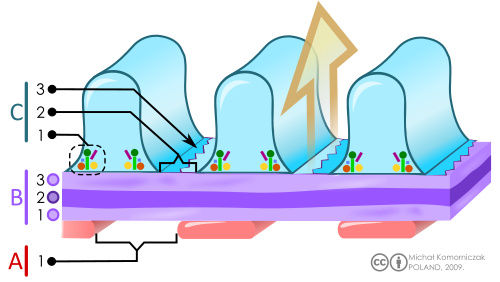
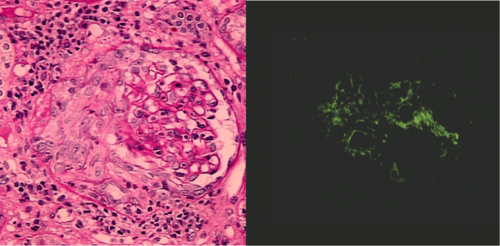

# GLOMERULONEFRITE PÓS-ESTREPTOCÓCICA: DIAGNÓSTICO E CONDUTA

Para entender a Glomerulonefrite Pós-Estreptocócica (GNPE), você precisa primeiro dominar o conceito de Síndrome Nefrítica. Na prática clínica e nas provas de residência, a GNPE é o protótipo, o modelo perfeito dessa síndrome. Quando falamos em síndrome nefrítica, estamos descrevendo um conjunto de sinais e sintomas que surgem devido a um processo inflamatório agudo nos glomérulos.

Imagine o glomérulo como um filtro extremamente sofisticado. Quando esse filtro inflama subitamente, ele "entope" e, ao mesmo tempo, deixa passar o que não deveria. O resultado é a tétrade clássica que você verá em quase todas as questões: hematúria, hipertensão arterial, edema e oligúria. Se o paciente é uma criança entre 2 e 12 anos com esse quadro, sua primeira hipótese deve ser GNPE até que se prove o contrário.

*Figura 1 - Esquema da barreira de filtração glomerular mostrando: A) Células endoteliais com fenestras; B) Membrana basal glomerular; C) Podócitos com fendas de filtração. A lesão desta barreira por imunocomplexos é o mecanismo central da GNPE. Fonte: Michał Komorniczak, CC BY-SA 3.0 | Wikimedia Commons*

## Fisiopatologia: O Porquê da Doença

A GNPE não é uma infecção direta do rim pelo estreptococo. Isso é um erro comum de alunos iniciantes. O rim não está "infectado", ele está sofrendo uma reação imunológica. O agente etiológico é o *Streptococcus pyogenes* (Estreptococo beta-hemolítico do grupo A). Mas não é qualquer um, são as chamadas cepas nefritogênicas, identificadas pela proteína M da parede bacteriana.

O processo ocorre por deposição de imunocomplexos. O corpo produz anticorpos contra antígenos estreptocócicos (como a proteinase piogênica exotoxina B). Esses complexos antígeno-anticorpo viajam pelo sangue e ficam presos na membrana basal glomerular. Uma vez ali, eles ativam a via alternativa do sistema complemento.

É aqui que entra uma informação de ouro para sua prova: a ativação do complemento gera quimiotaxia de neutrófilos e inflamação local. Como a via ativada é a alternativa, o consumo de C3 é intenso, enquanto o C4 costuma estar normal. Guarde isso: GNPE cursa com C3 baixo e C4 normal. Se o C4 estiver baixo, abra o olho para Lúpus Eritematoso Sistêmico.

Essa inflamação reduz a Taxa de Filtração Glomerular (TFG). Se o rim filtra menos, o corpo retém sódio e água. É essa expansão volêmica que causa a hipertensão e o edema. Não é uma hipertensão por excesso de renina, é por puro excesso de volume. Por isso, como veremos adiante, o tratamento foca em tirar esse excesso.

## O Período de Latência: A Chave do Diagnóstico

Uma das pegadinhas mais frequentes em provas envolve o tempo entre a infecção e o aparecimento dos sintomas renais. Se um paciente tem dor de garganta hoje e amanhã acorda com urina escura, isso NÃO é GNPE. O sistema imune precisa de tempo para fabricar os imunocomplexos e depositá-los no rim.

| Tipo de Infecção | Período de Latência Médio | Exemplo Clínico |
| --- | --- | --- |
| Faringoamigdalite | 1 a 3 semanas (média 10 dias) | "Doutor, ele teve febre e dor de garganta há 15 dias" |
| Piodermite (Impetigo) | 3 a 6 semanas (média 21 dias) | "Ele teve feridas com crostas melicéricas nas pernas há um mês" |

Se a hematúria aparece junto com a infecção respiratória (em menos de 5 dias), pense em Doença de Berger (Nefropatia por IgA). O Dr. Will sempre reforça nas discussões do MedEvo: Berger é "curto circuito", a hematúria é concomitante à infecção. GNPE exige paciência do sistema imune, exige latência.

## Quadro Clínico: A Apresentação Típica

O paciente clássico é um escolar que chega ao pronto-socorro com "urina cor de Coca-Cola" ou "cor de guaraná". Isso é a hematúria macroscópica, presente em cerca de 30% a 50% dos casos. Nos outros, a hematúria é microscópica, mas quase sempre está lá.

O edema costuma ser periorbitário, pior pela manhã, podendo evoluir para edema de membros inferiores e, em casos graves, anasarca. A hipertensão arterial está presente em até 80% dos casos e é a principal causa de complicações agudas na infância, como a encefalopatia hipertensiva.

A oligúria (volume urinário < 1 ml/kg/h em crianças ou < 400 ml/dia em adolescentes) é comum na fase inicial e sinaliza uma queda importante da função renal. No entanto, a maioria dos pacientes mantém um débito urinário limítrofe.

### Sinais de Alerta e Gravidade

Fique atento ao exame físico para sinais de congestão volêmica sistêmica:

- Estertoração crepitante pulmonar (Edema Agudo de Pulmão).

- Turgência jugular e hepatomegalia dolorosa (Insuficiência Cardíaca Congestiva por sobrecarga).

- Cefaleia intensa, vômitos em jato, rebaixamento do nível de consciência ou convulsões (Encefalopatia Hipertensiva).

*Figura 2 - Histopatologia de glomerulonefrite crescêntica: A) Coloração PAS mostrando formação de crescente celular circunferencial; B) Imunofluorescência com depósito de C3 em região mesangial. Fonte: Koya et al., CC BY 2.0 | Wikimedia Commons*

## Diagnóstico Laboratorial: Confirmando a Suspeita

Para fechar o diagnóstico de GNPE, você precisa de três pilares: Síndrome Nefrítica + Evidência de Infecção Estreptocócica + Queda do Complemento (C3).

### 1. Urina tipo 1 (Sumário de Urina)

Você encontrará hematúria (obrigatória). O achado patognomônico de sangramento glomerular é o cilindro hemático. Além disso, o dismorfismo eritrocitário (hemácias com formas alteradas, como os acantócitos) confirma que o sangue veio do glomérulo e não das vias urinárias baixas. A proteinúria costuma estar presente, mas geralmente em faixa não nefrótica (abaixo de 50 mg/kg/dia).

### 2. Evidência de Infecção Estreptocócica

Aqui as bancas adoram testar se você sabe qual exame pedir para cada sítio de infecção:

- **ASLO (Antiestreptolisina O):** Eleva-se em 80% a 90% dos casos após faringite. Porém, na piodermite, a ASLO frequentemente é normal porque os lipídios da pele inativam a estreptolisina O.

- **Anti-DNAse B:** É o melhor marcador para infecções de pele (piodermites). Se a questão fala de um menino com crostas nas pernas, procure a Anti-DNAse B.

- **Cultura (Swab):** Raramente é positiva, pois a infecção já passou quando a GNPE aparece.

### 3. Sistema Complemento

O C3 e a CH50 estarão baixos em mais de 90% dos pacientes. O C4 costuma ser normal. Esta é a "âncora" do diagnóstico. Se o C3 estiver normal desde o início, você deve questionar o diagnóstico de GNPE e pensar em outras causas de síndrome nefrítica.

| Exame | Comportamento na GNPE | Observação Importante |
| --- | --- | --- |
| C3 (Complemento) | Baixo | Deve normalizar em até 8 semanas |
| C4 (Complemento) | Normal | Se baixo, pensar em Lúpus ou Crioglobulinemia |
| ASLO | Elevada (principalmente na faringite) | Pode estar normal em infecções de pele |
| Creatinina | Normal ou Elevada | Depende do grau de insuficiência renal aguda |
| Hematúria | Presente (com dismorfismo) | Pode durar até 1 a 2 anos (microscópica) |

*Figura 2 - Histopatologia de glomerulonefrite crescêntica: A) Coloração PAS mostrando formação de crescente celular circunferencial; B) Imunofluorescência com depósito de C3 em região mesangial. Fonte: Koya et al., CC BY 2.0 | Wikimedia Commons*

## Diagnóstico Diferencial: Não Confunda!

Este é o ponto onde muitos alunos perdem questões por falta de atenção aos detalhes. O principal diferencial é a Nefropatia por IgA (Doença de Berger).

**Diferenças fundamentais:**

- **Berger:** Não tem período de latência (hematúria "sinfaringítica"), o complemento é NORMAL e os episódios de hematúria são recorrentes.

- **GNPE:** Tem latência de semanas, o complemento é BAIXO e geralmente é um episódio único.

Outro diferencial importante é a Glomerulonefrite Membranoproliferativa. A apresentação inicial é idêntica à GNPE, mas o complemento C3 permanece baixo por mais de 8 semanas. Por isso, a persistência da hipocomplementemia é uma indicação clássica de biópsia renal.

## Quando Indicar Biópsia Renal?

A GNPE é uma doença de diagnóstico clínico-laboratorial. Na maioria das vezes, não biopsiamos. No entanto, se o quadro fugir do "script" esperado, a biópsia torna-se obrigatória para descartar doenças mais graves, como a Glomerulonefrite Rapidamente Progressiva (GNRP).

As indicações de biópsia (decore estas, pois caem muito) são:

- Anúria ou insuficiência renal aguda grave/prolongada.

- Complemento (C3) normal no início do quadro.

- Complemento (C3) que permanece baixo após 8 semanas.

- Proteinúria em faixa nefrótica por mais de 4 semanas.

- Hematúria macroscópica persistente por mais de 4 semanas.

- Evidência de doença sistêmica (ex: rash malar, artrite, sugerindo Lúpus).

Na biópsia da GNPE, a microscopia óptica mostra uma Glomerulonefrite Difusa Aguda (proliferação de células mesangiais e endoteliais). Na imunofluorescência, vemos depósitos granulares de IgG e C3. Mas o que as bancas amam é a microscopia eletrônica: os famosos "humps" ou "gibas" (depósitos subepiteliais em forma de corcova).

## Tratamento e Manejo Clínico

O tratamento da GNPE é eminentemente de suporte. Não existe uma droga que "cure" a inflamação glomerular mais rápido. O objetivo é manejar as complicações da sobrecarga hídrica até que o rim recupere sua função espontaneamente.

### 1. Medidas Gerais e Dieta

O paciente deve ficar em repouso relativo na fase aguda. A dieta é o ponto crucial:

- **Restrição de Sódio:** Dieta hipossódica rigorosa (2g de sal por dia ou menos).

- **Restrição Hídrica:** Se houver oligúria ou edema importante, limitamos a oferta de líquidos. Uma regra prática é calcular as perdas insensíveis (400-600 ml/m²/dia) mais o volume da diurese do dia anterior.

### 2. Manejo da Hipertensão e Edema

O diurético de escolha é a **Furosemida**. Por que não usamos Enalapril ou Losartana como primeira linha? Porque esses pacientes frequentemente têm queda da TFG e risco de hipercalemia. Os IECA/BRA podem piorar a função renal e aumentar ainda mais o potássio em um rim que já não está filtrando bem.

A Furosemida (dose de 1 a 4 mg/kg/dia, via oral ou IV) ataca a causa da hipertensão: o excesso de volume. Se a pressão continuar alta mesmo com diurético, usamos vasodilatadores diretos, como a Hidralazina, ou bloqueadores de canais de cálcio, como o Nifedipino.

Em casos de emergência hipertensiva (encefalopatia), o tratamento deve ser feito em UTI com Nitroprussiato de Sódio IV.

### 3. Antibioticoterapia

Muitos alunos erram achando que a Penicilina trata a GNPE. Cuidado: o antibiótico NÃO melhora a glomerulonefrite e NÃO previne o aparecimento da GNPE (diferente da Febre Reumática, onde o ATB previne a doença).

Então, por que prescrevemos Penicilina Benzatina (ou Amoxicilina)?

- Para erradicar o estreptococo da orofaringe ou da pele do paciente.

- Para evitar a disseminação de cepas nefritogênicas para outras pessoas (saúde pública).

- Só deve ser feita se houver evidência de que a infecção ainda está ativa ou se não foi tratada previamente.

### 4. Indicações de Internação

Nem toda GNPE precisa de hospital. Casos leves, com pressão controlada e boa diurese, podem ser seguidos ambulatorialmente com retornos frequentes. No entanto, interne se houver:

- Hipertensão arterial grave ou sintomática.

- Sinais de congestão volêmica (edema agudo de pulmão, ICC).

- Insuficiência renal aguda significativa (elevação importante de ureia e creatinina).

- Oligúria importante ou anúria.

## Complicações e Prognóstico

A complicação mais temida é a Encefalopatia Hipertensiva. O Dr. Will sempre lembra: se uma criança com GNPE apresentar uma convulsão, a primeira coisa a fazer é medir a pressão arterial, não é pedir tomografia. Outra complicação grave é o Edema Agudo de Pulmão por hipervolemia.

O prognóstico da GNPE na infância é excelente. Mais de 95% das crianças se recuperam completamente sem sequelas a longo prazo. A melhora segue uma cronologia esperada que você deve conhecer para orientar os pais:

- **Diurese:** Aumenta em 1 a 2 semanas (o paciente "desincha").

- **Complemento (C3):** Normaliza em até 8 semanas.

- **Hematúria macroscópica:** Desaparece em poucas semanas.

- **Proteinúria:** Pode durar de 3 a 6 meses.

- **Hematúria microscópica:** Pode persistir por 1 a 2 anos. Isso não significa que a criança está doente, é apenas a "cicatriz" do processo inflamatório.

## Resumo do Manejo da Hipertensão na GNPE

| Gravidade | Conduta Inicial | Fármaco de Escolha |
| --- | --- | --- |
| Leve a Moderada | Restrição de sódio + Diurético | Furosemida (1-2 mg/kg/dose) |
| Persistente | Adicionar Vasodilatador | Hidralazina ou Nifedipino |
| Emergência (Encefalopatia) | Internação em UTI | Nitroprussiato de Sódio IV |

Lembre-se: o uso de diuréticos na GNPE é tão eficaz que, muitas vezes, a pressão normaliza assim que o paciente começa a urinar. A perda de peso nos primeiros dias de internação é o melhor sinal de que o tratamento está funcionando.

## Situações Especiais e Pegadinhas

**O paciente com ASLO negativo:**
Se o quadro clínico é muito sugestivo, mas a ASLO veio negativa, lembre-se da piodermite. Peça a Anti-DNAse B ou o Estreptozyme (um teste que avalia vários anticorpos simultaneamente). Não descarte GNPE apenas com uma ASLO negativa se houve infecção de pele.

**O "falso" diagnóstico de GNPE no adulto:**
Embora ocorra em adultos, o prognóstico neles é muito pior. Cerca de 50% dos adultos podem evoluir com perda crônica de função renal. Nas provas de pediatria, foque no prognóstico bom.

**O papel do repouso:**
Antigamente, deixava-se a criança semanas na cama. Hoje sabemos que o repouso deve ser apenas na fase aguda, enquanto houver hipertensão e edema importante. Assim que a volemia estabiliza, a criança pode voltar às atividades progressivamente.

## Pontos-Chave para Prova

- **Definição:** Síndrome nefrítica (hematúria, edema, HAS, oligúria) após infecção estreptocócica.

- **Latência:** 1-3 semanas após faringite; 3-6 semanas após piodermite. Essencial para diferenciar de Berger.

- **Complemento:** C3 baixo e C4 normal. O C3 DEVE normalizar em 8 semanas. Se não normalizar, biópsia!

- **Marcadores:** ASLO para garganta; Anti-DNAse B para pele.

- **Patognomônico na Biópsia:** "Humps" ou "Gibas" na microscopia eletrônica.

- **Tratamento Inicial:** Restrição hídrica, dieta hipossódica e Furosemida.

- **Antibiótico:** Penicilina Benzatina serve para erradicar a cepa e evitar transmissão, não trata a inflamação renal atual nem previne a GNPE.

- **Indicação de Biópsia (Regra dos 8):** C3 baixo por mais de 8 semanas é a principal indicação.

- **Diferencial Berger:** Hematúria recorrente, sem latência, complemento normal.

- **Diferencial Lúpus:** Consome C3 e C4, presença de sintomas sistêmicos (rash, artrite).

- **Complicação Aguda:** Encefalopatia hipertensiva e Edema Agudo de Pulmão.

- **Prognóstico:** Excelente em crianças (>95% cura). Hematúria micro pode durar 2 anos.

- **O que NÃO fazer:** Não use Corticoides ou Imunossupressores na GNPE clássica. O tratamento é apenas suporte.

- **Cuidado com IECA:** Evite na fase aguda se houver hipercalemia ou oligúria importante.

- **Valor de Referência:** Proteinúria nefrótica é > 50 mg/kg/dia ou relação Proteína/Creatinina urinária > 2. Na GNPE, a proteinúria costuma ser subnefrótica.

- **Hematúria Glomerular:** Confirmada por cilindros hemáticos e dismorfismo eritrocitário (> 5% de acantócitos/codócitos).

- **Internação:** Indicada se houver sinais de gravidade (HAS grave, congestão, IRA). Casos leves podem ser ambulatoriais.

Ao revisar este tema para sua prova, foque sempre na tríade: **Latência + C3 baixo + Furosemida**. Com esses três pilares, você resolve a grande maioria das questões sobre GNPE. O MedEvo e o Dr. Will reforçam que a clareza sobre o tempo de evolução e o comportamento do complemento são os divisores de águas entre o aluno que decora e o médico que entende a nefrologia pediátrica.

 Cópia offline para consulta pessoal.
 Fonte original:
 [https://www.medevo.com.br/material-apoio/ler/11d26029-5b95-40c2-bbd4-372cc4022d6c](https://www.medevo.com.br/material-apoio/ler/11d26029-5b95-40c2-bbd4-372cc4022d6c)
