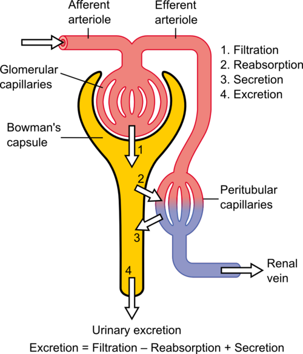
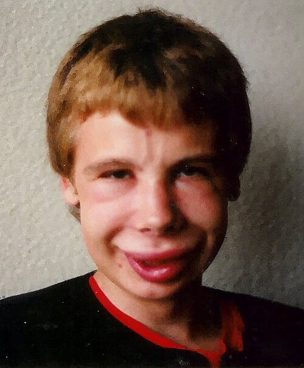

# GLOMERULOPATIAS

Para entender as glomerulopatias, você precisa parar de tentar decorar nomes difíceis e começar a visualizar o que está acontecendo dentro do glomérulo. Imagine o glomérulo como um filtro de café extremamente sofisticado: se o filtro “rasga”, passam proteínas e hemácias; se o filtro inflama e “entope”, a filtração cai, o paciente retém sal e água, faz hipertensão, oligúria e edema.

Nas provas de residência, o examinador geralmente quer saber se você consegue separar quatro grandes padrões:

- **Síndrome nefrítica**: inflamação glomerular.

- **Síndrome nefrótica**: aumento da permeabilidade à proteína.

- **Glomerulonefrite rapidamente progressiva**: perda acelerada da função renal, geralmente com crescentes.

- **Glomerulopatias secundárias**: diabetes, lúpus, infecções, vasculites, drogas e neoplasias.

A lógica é simples: primeiro reconheça o padrão sindrômico, depois use idade, complemento, tempo de aparecimento, associação clínica e achado de biópsia para chegar ao diagnóstico.

*Figura 1 - Esquema da fisiologia do néfron mostrando os processos de filtração glomerular, reabsorção e secreção tubular. Fonte: Madhero88, CC BY 3.0 | Wikimedia Commons*

### A Barreira de Filtração e a Fisiopatologia

A barreira de filtração glomerular é formada por três camadas principais:

- **Endotélio fenestrado**.

- **Membrana basal glomerular**.

- **Podócitos**, com seus processos podocitários.

Em condições normais, a albumina quase não passa pela barreira porque existe uma combinação de **seleção por tamanho** e **seleção por carga elétrica**. A albumina tem carga negativa, e a barreira glomerular também é negativamente carregada, o que dificulta sua passagem.

Quando ocorre uma glomerulopatia, o problema pode ser:

- **Inflamatório**: dano capilar, proliferação celular, hemácias na urina, queda da TFG.

- **Podocitário/permeabilidade**: perda da barreira seletiva, proteinúria maciça, edema e hipoalbuminemia.

- **Imunológico sistêmico**: imunocomplexos, complemento, ANCA, anti-MBG, lúpus, infecções.

- **Metabólico/hemodinâmico**: diabetes, obesidade, hiperfiltração, hipertensão intraglomerular.

**Dica do Dr. Will:**
Se a questão falar em **apagamento ou fusão dos processos podocitários** na microscopia eletrônica, pense em doenças podocitárias, principalmente **Doença de Lesões Mínimas** e **GESF**. Isso explica proteinúria importante mesmo quando a microscopia óptica parece normal ou pouco alterada.

As diretrizes KDIGO organizam as glomerulopatias justamente por padrões clínicos, histológicos e resposta terapêutica, incluindo IgA, nefropatia membranosa, lesões mínimas, GESF, GNMP, lúpus e vasculites. ([KDIGO](https://kdigo.org/wp-content/uploads/2017/02/KDIGO-Glomerular-Diseases-Guideline-2021-English.pdf))

## Síndrome Nefrítica

Aqui o problema central é **inflamação glomerular**.

O glomérulo fica infiltrado por células inflamatórias e/ou imunocomplexos. Isso reduz a filtração, causa lesão da parede capilar e permite a passagem de hemácias para a urina.

### Quadro Clínico Clássico

A tríade clássica é:

**Hematúria glomerular + Hipertensão + Edema**

Outros achados frequentes:

- Oligúria.

- Aumento de ureia e creatinina.

- Proteinúria geralmente subnefrótica.

- Cilindros hemáticos.

- Hemácias dismórficas.

- Edema facial, principalmente periorbitário e matinal.

- Urina escura, em “chá”, “coca-cola” ou “lavado de carne”.

O edema na síndrome nefrítica ocorre principalmente por **retenção renal de sódio e água**, e não por hipoalbuminemia intensa como na síndrome nefrótica.

### Glomerulonefrite Pós-Estreptocócica — GNPE

É o protótipo da síndrome nefrítica na infância.

O cenário clássico de prova é:

> Criança, geralmente pré-escolar ou escolar, que teve faringite ou impetigo/piodermite algumas semanas antes e agora aparece com edema facial, hipertensão, oligúria e urina cor de coca-cola.

### Detalhe Mais Importante: Período de Latência

A GNPE **não aparece ao mesmo tempo** da infecção. Ela surge depois de um intervalo.

| Infecção prévia | Latência típica |
| --- | --- |
| Faringite estreptocócica | 1 a 2 semanas |
| Piodermite/impetigo | 2 a 3 semanas |

**Pegadinha clássica:**
Se a hematúria aparece junto com a infecção de vias aéreas superiores, sem período de latência, pense em **Nefropatia por IgA**, não em GNPE.

### Diagnóstico Laboratorial

Os principais achados são:

-

**Evidência de infecção estreptocócica recente**

- ASLO: mais associado à faringite.

- Anti-DNAse B: mais útil em piodermite/impetigo.

-

**Consumo de complemento**

- C3 baixo.

- C4 geralmente normal.

- C3 costuma normalizar em 6 a 8 semanas.

Se o C3 permanece baixo após 8 semanas, ou se houver evolução atípica, deve-se pensar em outro diagnóstico, como lúpus, GN membranoproliferativa ou glomerulonefrite C3. A normalização do C3 em 6 a 8 semanas e a indicação de investigar diagnósticos alternativos quando isso não ocorre são pontos clássicos em referências clínicas de GN pós-infecciosa. ([NCBI](https://www.ncbi.nlm.nih.gov/books/NBK538255/))

### Tratamento

O tratamento é principalmente **suporte**:

- Restrição de sal.

- Restrição hídrica se houver edema, hipertensão ou oligúria.

- Diurético de alça, como furosemida, se congestão/edema/hipertensão.

- Controle da pressão arterial.

- Diálise em casos graves com hipervolemia, hipercalemia ou uremia importante.

O antibiótico, geralmente penicilina ou equivalente, serve para erradicar o estreptococo e reduzir transmissão, mas **não reverte imediatamente a glomerulonefrite já instalada**.

### Achado de Biópsia

Na microscopia eletrônica, o achado clássico são os depósitos subepiteliais em “corcovas”:

**Humps subepiteliais**

Na prática, a biópsia não é necessária na maioria dos casos típicos de GNPE em crianças. Deve ser considerada se houver:

- Complemento normal desde o início.

- C3 persistentemente baixo além de 8 semanas.

- Insuficiência renal grave ou progressiva.

- Proteinúria nefrótica persistente.

- Ausência de evidência de infecção estreptocócica.

- Quadro sistêmico sugerindo lúpus ou vasculite.

### Nefropatia por IgA — Doença de Berger

É a glomerulopatia primária mais comum no mundo.

O quadro típico é:

> Hematúria macroscópica recorrente que ocorre junto ou poucos dias após infecção de vias aéreas superiores.

Essa é a chamada **hematúria sinfaringítica**.

### Como Diferenciar de GNPE?

| Característica | GNPE | Nefropatia por IgA |
| --- | --- | --- |
| Relação com IVAS | Depois de 1 a 2 semanas | Junto ou até poucos dias depois |
| Complemento | C3 baixo | C3 normal |
| Recorrência | Geralmente episódio único | Recorrente |
| Idade comum | Crianças | Crianças, adolescentes e adultos jovens |
| Imunofluorescência | C3 e IgG granular | Depósito mesangial de IgA |

### Manifestações

Pode aparecer como:

- Hematúria macroscópica recorrente.

- Micro-hematúria persistente.

- Proteinúria leve a moderada.

- Síndrome nefrítica.

- Mais raramente, síndrome nefrótica ou GNRP.

### Pegadinha: Vasculite por IgA

Se o enunciado trouxer:

- Púrpura palpável em membros inferiores.

- Dor abdominal.

- Artralgia ou artrite.

- Hematúria/proteinúria.

Pense em **Vasculite por IgA**, antiga Púrpura de Henoch-Schönlein.

A nefropatia é semelhante à Berger, mas o quadro é sistêmico.

*Figura 2 - Edema facial periorbital, manifestação clínica característica da síndrome nefrótica, resultante da hipoalbuminemia e redução da pressão oncótica. Fonte: CharlesPicavet, Domínio Público | Wikimedia Commons*

## Síndrome Nefrótica

Na síndrome nefrótica, o glomérulo não está necessariamente inflamado. O problema principal é que ele ficou **permeável demais à proteína**, especialmente à albumina.

### Critérios Diagnósticos

Os critérios clássicos são:

| Critério | Valor típico |
| --- | --- |
| Proteinúria maciça em adultos | > 3,5 g/24h |
| Proteinúria maciça em crianças | > 50 mg/kg/dia ou relação proteína/creatinina elevada |
| Hipoalbuminemia | Geralmente < 3,0 g/dL |
| Edema | Frequente, podendo evoluir para anasarca |
| Hiperlipidemia | Comum |
| Lipidúria | Corpos graxos ovalados / cilindros gordurosos |

### Por que o paciente nefrótico incha?

Existem duas explicações principais:

#### 1. Teoria Underfill

A perda urinária de albumina reduz a pressão oncótica plasmática. O líquido sai do vaso para o interstício, reduz o volume arterial efetivo e ativa:

- Sistema renina-angiotensina-aldosterona.

- Sistema nervoso simpático.

- ADH.

Resultado: retenção de sódio e água.

#### 2. Teoria Overfill

Há retenção primária de sódio pelo rim, especialmente no túbulo coletor, independentemente da hipoalbuminemia.

Na prática, as duas podem coexistir.

## Principais Causas de Síndrome Nefrótica

### 1. Doença de Lesões Mínimas — DLM

É a principal causa de síndrome nefrótica em crianças, especialmente entre 1 e 10 anos.

### Pistas de Prova

- Criança com edema importante.

- Proteinúria maciça.

- Albumina baixa.

- Complemento normal.

- Sem hematúria importante.

- Função renal geralmente preservada.

- Boa resposta a corticoide.

### Achados

| Método | Achado |
| --- | --- |
| Microscopia óptica | Normal ou quase normal |
| Imunofluorescência | Negativa |
| Microscopia eletrônica | Apagamento difuso dos processos podocitários |

### Associações

- Linfoma de Hodgkin.

- AINEs.

- Infecções virais.

- Atopia.

### Conduta

Em criança com síndrome nefrótica pura e quadro típico, geralmente **não se faz biópsia de início**. Faz-se tratamento com corticoide e observa-se a resposta.

**Dica do Dr. Will:**
Criança + síndrome nefrótica pura + complemento normal + resposta dramática ao corticoide = Doença de Lesões Mínimas até prova em contrário.

### 2. Glomeruloesclerose Segmentar e Focal — GESF

A GESF é uma das causas mais importantes de síndrome nefrótica em adultos e também pode ocorrer em crianças. O nome descreve o padrão histológico:

- **Segmentar**: acomete parte do glomérulo.

- **Focal**: acomete alguns glomérulos, não todos.

- **Esclerose**: cicatriz/fibrose glomerular.

### Tipos

#### Primária

Geralmente causa síndrome nefrótica mais franca, com proteinúria intensa e lesão podocitária.

#### Secundária

Associada a hiperfiltração ou agressões específicas:

- Obesidade.

- Redução de massa renal.

- Refluxo vesicoureteral.

- HIV.

- Heroína.

- Anemia falciforme.

- Hipertensão adaptativa.

- Nefropatia por refluxo.

### Pistas de Prova

- Adulto jovem com síndrome nefrótica.

- Proteinúria importante.

- Complemento normal.

- Pode ter hipertensão e perda progressiva da função renal.

- Maior chance de resistência a corticoide do que DLM.

### HIVAN

A nefropatia associada ao HIV é classicamente uma variante colapsante da GESF, com evolução rápida para insuficiência renal, especialmente se o HIV não estiver controlado.

### 3. Nefropatia Membranosa

É uma causa clássica de síndrome nefrótica em adultos.

O problema está no depósito de imunocomplexos na região subepitelial da membrana basal glomerular, levando ao espessamento da parede capilar.

### Pistas de Prova

- Adulto com síndrome nefrótica.

- Complemento geralmente normal.

- Alto risco de trombose.

- Pode estar associada a neoplasias, infecções ou drogas.

- Anti-PLA2R positivo sugere forma primária.

### Associações Secundárias

- Hepatite B.

- Neoplasias sólidas: pulmão, cólon, mama, estômago.

- Lúpus, especialmente classe V.

- Captopril.

- Penicilamina.

- Sais de ouro.

- AINEs.

### Achados

| Método | Achado |
| --- | --- |
| Microscopia óptica | Espessamento difuso da membrana basal |
| Imunofluorescência | Depósito granular de IgG e C3 |
| Prata metenamina | Spike and dome |
| Sorologia | Anti-PLA2R em muitos casos primários |

### Complicação Clássica

A nefropatia membranosa é a glomerulopatia mais lembrada em prova quando o assunto é:

**Trombose de veia renal**

Suspeite se houver:

- Dor lombar súbita.

- Hematúria macroscópica.

- Piora abrupta da função renal.

- Síndrome nefrótica importante.

### 4. Glomerulonefrite Membranoproliferativa — GNMP

A GNMP é uma “ponte” entre síndrome nefrítica e nefrótica.

O paciente pode ter:

- Proteinúria importante.

- Hematúria.

- Hipertensão.

- Queda da função renal.

- Consumo de complemento.

### Associações Clássicas

- Hepatite C.

- Crioglobulinemia.

- Hepatite B.

- Endocardite.

- Doenças autoimunes.

- Gamopatias monoclonais.

- Alterações da via alternativa do complemento.

### Achado de Biópsia

O achado clássico é o aspecto de:

**Duplo contorno da membrana basal glomerular**

Também chamado de padrão em “trilho de trem”.

## Como Diferenciar as Principais Glomerulopatias

### Tabela 1 — Nefrítica vs. Nefrótica

| Característica | Síndrome Nefrítica | Síndrome Nefrótica |
| --- | --- | --- |
| Mecanismo | Inflamação glomerular | Aumento da permeabilidade |
| Início | Mais abrupto | Mais insidioso |
| Edema | Leve a moderado, facial | Intenso, anasarca |
| Hipertensão | Muito comum | Variável |
| Hematúria | Importante | Ausente ou discreta |
| Cilindros hemáticos | Frequentes | Não é o padrão |
| Proteinúria | Geralmente < 3,5 g/dia | > 3,5 g/dia |
| Complemento | Pode estar baixo | Geralmente normal, depende da causa |
| Exemplo clássico | GNPE | DLM, GESF, membranosa |

### Tabela 2 — Diagnóstico Diferencial pelo Complemento

| Complemento baixo | Complemento normal |
| --- | --- |
| GNPE | Nefropatia por IgA |
| Nefrite lúpica | Doença de Lesões Mínimas |
| GN membranoproliferativa | GESF |
| Crioglobulinemia | Nefropatia membranosa primária |
| Endocardite infecciosa | Vasculites ANCA-associadas |
| Glomerulopatia C3 | Síndrome de Alport |
| Shunt nephritis | Anti-MBG/Goodpasture |

**Dica de prova:**
C3 baixo é uma pista muito forte para ativação do complemento. Na GNPE, espera-se que normalize em 6 a 8 semanas. Se não normalizar, pense em outra coisa.

### Tabela 3 — Diferenciação das Glomerulopatias Mais Cobradas

| Doença | Síndrome típica | Complemento | Idade/pista | Achado clássico |
| --- | --- | --- | --- | --- |
| GNPE | Nefrítica | C3 baixo, C4 normal | Criança após faringite/impetigo com latência | Humps subepiteliais |
| Nefropatia por IgA | Hematúria recorrente/nefrítica | Normal | Hematúria junto com IVAS | Depósito mesangial de IgA |
| Vasculite por IgA | Nefrite + púrpura | Normal | Púrpura, dor abdominal, artralgia | IgA mesangial |
| Lesões Mínimas | Nefrótica | Normal | Criança, resposta a corticoide | Apagamento podocitário |
| GESF | Nefrótica | Normal | Adulto, HIV, obesidade, hiperfiltração | Esclerose segmentar e focal |
| Membranosa | Nefrótica | Normal | Adulto, trombose, neoplasia | Spike and dome, anti-PLA2R |
| GNMP | Mista | Baixo | Hepatite C, crioglobulinemia | Duplo contorno |
| Lúpus | Variável | C3 e C4 baixos | Mulher jovem, anti-dsDNA | Full house na IF |
| Anti-MBG | GNRP | Normal | Rim + pulmão | IF linear |
| ANCA | GNRP | Normal | Vasculite sistêmica | Pauci-imune |

## Glomerulonefrite Rapidamente Progressiva — GNRP

A GNRP é uma emergência nefrológica.

O quadro típico é:

- Síndrome nefrítica.

- Perda rápida da função renal em dias a semanas.

- Hematúria glomerular.

- Proteinúria variável.

- Cilindros hemáticos.

- Biópsia com crescentes em muitos glomérulos.

### O que são crescentes?

São proliferações celulares no espaço de Bowman, formadas por células epiteliais parietais, fibrina, macrófagos e células inflamatórias.

Na prática, crescentes significam lesão glomerular grave.

### Classificação pela Imunofluorescência

| Tipo | Mecanismo | IF | Exemplos |
| --- | --- | --- | --- |
| Tipo I | Anti-MBG | Linear | Goodpasture |
| Tipo II | Imunocomplexos | Granular | Lúpus, GNPE, IgA |
| Tipo III | Pauci-imune | Pouco ou nenhum depósito | Vasculites ANCA |

### Tipo I — Anti-MBG / Goodpasture

O paciente forma anticorpos contra a membrana basal glomerular.

Se houver hemorragia alveolar associada, temos a **Síndrome de Goodpasture**.

Pistas:

- Hemoptise.

- Dispneia.

- Infiltrado pulmonar.

- Hematúria.

- Insuficiência renal rápida.

- Anti-MBG positivo.

- Imunofluorescência linear.

### Tipo III — Pauci-imune / ANCA

Associada às vasculites ANCA:

- Granulomatose com poliangiite.

- Poliangiite microscópica.

- Granulomatose eosinofílica com poliangiite.

Pistas:

- Sinusite crônica.

- Otite.

- Hemoptise.

- Mononeurite múltipla.

- Púrpura.

- Lesão renal rapidamente progressiva.

- ANCA positivo.

### Conduta Geral

GNRP não é para “acompanhar de longe”. Em geral, exige avaliação urgente com nefrologia, biópsia renal quando possível e imunossupressão.

Tratamentos usados conforme a causa:

- Pulsoterapia com metilprednisolona.

- Corticoide oral.

- Ciclofosfamida ou rituximabe.

- Plasmaférese em situações selecionadas, especialmente anti-MBG e alguns quadros com hemorragia alveolar.

## Glomerulopatias Secundárias Importantes

### Nefropatia Diabética

É uma das principais causas de doença renal crônica e terapia renal substitutiva.

A fisiopatologia envolve:

- Hiperfiltração glomerular.

- Hipertensão intraglomerular.

- Expansão mesangial.

- Espessamento da membrana basal.

- Lesão podocitária.

- Albuminúria progressiva.

### Fases Clássicas

| Fase | Achado |
| --- | --- |
| Hiperfiltração | TFG aumentada no início |
| Albuminúria moderadamente aumentada | 30 a 300 mg/g ou mg/dia |
| Albuminúria severamente aumentada | > 300 mg/g ou mg/dia |
| Queda progressiva da TFG | DRC estabelecida |

### Quando Desconfiar que NÃO é Nefropatia Diabética?

Nem todo diabético com proteinúria tem nefropatia diabética.

Suspeite de outra glomerulopatia se houver:

- Hematúria dismórfica importante.

- Cilindros hemáticos.

- Proteinúria de início muito abrupto.

- Queda rápida da função renal.

- Ausência de retinopatia diabética, especialmente no DM1.

- Complemento baixo.

- Sinais sistêmicos: rash, artrite, púrpura, febre, neuropatia.

- Duração curta de diabetes antes da proteinúria importante.

### Tratamento

A base é reduzir risco cardiovascular e progressão renal:

- Controle pressórico.

- Controle glicêmico individualizado.

- IECA ou BRA em pacientes com hipertensão e albuminúria.

- Inibidor de SGLT2 em diabéticos tipo 2 com DRC, quando elegível.

- Estatina conforme risco cardiovascular.

- Redução de sal.

- Cessação de tabagismo.

- Controle de peso.

Os consensos KDIGO/ADA reforçam o uso de IECA/BRA em diabetes com hipertensão e albuminúria, além da importância dos inibidores de SGLT2 em pacientes com diabetes tipo 2 e doença renal crônica, independentemente do efeito glicêmico isolado. ([KDIGO](https://kdigo.org/wp-content/uploads/2023/03/KDIGO-2022-Diabetes-Guideline-Quick-Reference-Guide.pdf))

**Correção importante:**
IECA/BRA reduzem a pressão intraglomerular principalmente por dilatação da arteríola eferente. Já os inibidores de SGLT2 aumentam a entrega de sódio à mácula densa, restaurando o feedback túbulo-glomerular e promovendo vasoconstrição relativa da arteríola aferente.

### Nefrite Lúpica

O lúpus pode causar vários padrões de lesão renal, mas a forma mais importante para prova é a proliferativa.

### Pistas Clínicas

- Mulher jovem.

- Artralgia.

- Rash malar.

- Fotossensibilidade.

- Úlceras orais.

- Serosite.

- Citopenias.

- Proteinúria.

- Hematúria.

- Cilindros celulares.

### Laboratório

- FAN positivo.

- Anti-dsDNA associado à atividade renal.

- C3 e C4 baixos.

- Proteinúria.

- Hematúria.

- Cilindros hemáticos ou granulosos.

### Classes Mais Cobradas

| Classe | Padrão | Comentário |
| --- | --- | --- |
| I | Mesangial mínima | Geralmente leve |
| II | Proliferativa mesangial | Hematúria/proteinúria leves |
| III | Proliferativa focal | Pode ser grave |
| IV | Proliferativa difusa | Mais grave e muito cobrada |
| V | Membranosa | Síndrome nefrótica |
| VI | Esclerosante avançada | Doença crônica |

### Achado Clássico

Na imunofluorescência, a nefrite lúpica pode apresentar padrão **full house**:

- IgG.

- IgA.

- IgM.

- C3.

- C1q.

### Tratamento

Depende da classe e da gravidade. Em classes proliferativas, costuma envolver:

- Corticoide.

- Micofenolato ou ciclofosfamida na indução.

- Terapia de manutenção com micofenolato ou azatioprina em muitos casos.

- Controle rigoroso de PA e proteinúria.

### Síndrome de Alport

É uma causa hereditária de hematúria glomerular.

### Pistas de Prova

- Hematúria persistente desde a infância.

- História familiar.

- Perda auditiva neurossensorial.

- Alterações oculares.

- Homens mais afetados na forma ligada ao X.

O defeito envolve colágeno tipo IV da membrana basal.

### Doença da Membrana Basal Fina

Também chamada de hematúria familiar benigna.

Pistas:

- Hematúria microscópica persistente.

- Função renal normal.

- Proteinúria ausente ou mínima.

- História familiar de hematúria.

- Prognóstico geralmente bom.

## Complicações da Síndrome Nefrótica

O problema da síndrome nefrótica não é apenas o edema. Três complicações são muito cobradas:

### 1. Tromboembolismo

O paciente perde proteínas anticoagulantes pela urina, como:

- Antitrombina III.

- Proteína C.

- Proteína S.

Ao mesmo tempo, o fígado aumenta a produção de fatores pró-coagulantes.

Consequências:

- Trombose venosa profunda.

- Embolia pulmonar.

- Trombose de veia renal.

- Eventos arteriais, menos comuns.

A trombose de veia renal é classicamente associada à **nefropatia membranosa**.

### 2. Infecções

O paciente perde imunoglobulinas e fatores do complemento na urina.

Agente clássico:

**Streptococcus pneumoniae**

Complicações possíveis:

- Celulite.

- Pneumonia.

- Sepse.

- Peritonite bacteriana espontânea, especialmente em crianças com ascite nefrótica.

### 3. Dislipidemia

O fígado aumenta a síntese de lipoproteínas como resposta à hipoalbuminemia.

Achados:

- Hipercolesterolemia.

- Hipertrigliceridemia.

- Lipidúria.

- Corpos graxos ovalados.

## Diagnóstico: Quando Biopsiar?

A biópsia renal é o padrão-ouro para várias glomerulopatias, mas não é feita em todo paciente.

### Situações em que a biópsia costuma ser indicada

- Adulto com síndrome nefrótica sem causa óbvia.

- Síndrome nefrítica com evolução atípica.

- Suspeita de GNRP.

- C3 baixo persistente além de 8 semanas.

- Proteinúria nefrótica persistente após quadro de GNPE.

- Hematúria glomerular com perda de função renal.

- Suspeita de nefrite lúpica.

- Diabético com sinais de doença renal não diabética.

- Proteinúria persistente inexplicada.

- Queda rápida da TFG sem causa definida.

### Situações em que a biópsia pode ser evitada inicialmente

- Criança com síndrome nefrótica pura típica, sugerindo lesões mínimas.

- GNPE típica com evolução favorável.

- Nefropatia diabética clássica, com longa duração de diabetes, retinopatia e evolução gradual.

- Doença renal crônica avançada com rins pequenos e cicatriciais, quando o resultado não mudaria a conduta.

### Contraindicações ou Situações de Alto Risco

Mais correto do que chamar todas de absolutas é separar assim:

#### Contraindicações importantes

- Distúrbio de coagulação não corrigido.

- Hipertensão grave não controlada.

- Infecção ativa no local da punção.

- Pielonefrite ou infecção renal ativa.

- Incapacidade de colaboração quando não há sedação/controle adequado.

#### Contraindicações relativas

- Rim único.

- Rins pequenos e hiperecogênicos, sugerindo cronicidade.

- Obesidade grave.

- Anemia grave.

- Uso recente de anticoagulantes ou antiagregantes.

- Malformações renais.

- Cistos renais múltiplos.

## Síndrome Hemolítico-Urêmica — SHU

Embora seja uma microangiopatia trombótica, a SHU aparece muito em questões de nefrologia e glomerulopatias.

### Tríade Clássica

- Insuficiência renal aguda.

- Trombocitopenia.

- Anemia hemolítica microangiopática.

O achado laboratorial clássico é:

**Esquizócitos no sangue periférico**

### SHU Típica

O cenário mais clássico é:

> Criança com diarreia sanguinolenta por E. coli produtora de toxina Shiga, especialmente O157:H7, que depois evolui com palidez, petéquias, oligúria e piora renal.

### Tratamento

O tratamento é suporte:

- Hidratação cuidadosa.

- Correção de distúrbios eletrolíticos.

- Controle de PA.

- Transfusão se necessário.

- Diálise se indicação.

- Evitar antimotilidade.

Em infecção por E. coli produtora de toxina Shiga, o CDC orienta não usar antibióticos, pois podem aumentar o risco de SHU. ([CDC](https://www.cdc.gov/ecoli/treatment/index.html))

### SHU Atípica

A SHU atípica ocorre por desregulação da via alternativa do complemento.

Pontos importantes:

- Pode ser recorrente.

- Pode ter história familiar.

- Não depende de diarreia por E. coli.

- Pode ser tratada com bloqueio do complemento, como eculizumabe, em cenários selecionados.

## Tratamento Não Farmacológico e Metas Gerais

Para pacientes com glomerulopatia e proteinúria, algumas medidas são quase sempre importantes.

### Restrição de Sal

Objetivo prático:

- Menos de 2 g de sódio por dia.

- Aproximadamente até 5 g de sal de cozinha por dia.

Ajuda a controlar:

- Edema.

- Hipertensão.

- Proteinúria.

- Resposta aos diuréticos.

### Proteína na Dieta

Não se deve orientar dieta hiperproteica, porque pode piorar hiperfiltração e proteinúria.

Em geral, usa-se ingestão moderada:

- Aproximadamente 0,8 g/kg/dia em DRC, individualizando conforme estado nutricional.

- Evitar restrição severa sem acompanhamento nutricional.

### Controle de Pressão

Meta comum em pacientes com proteinúria:

- Geralmente < 130/80 mmHg, individualizando por idade, tolerância, comorbidades e risco de queda/hipotensão.

### Redução de Proteinúria

A proteinúria não é só um marcador: ela também contribui para progressão da lesão renal.

Objetivos:

- Reduzir ao máximo possível.

- Idealmente < 0,5 a 1,0 g/dia em muitas glomerulopatias, quando factível.

- Usar bloqueio do SRAA quando indicado.

- Considerar iSGLT2 quando indicado.

- Controlar sal, PA e peso.

## Como Resolver Questão de Glomerulopatia

Use este passo a passo:

### Passo 1 — É nefrítica ou nefrótica?

#### Nefrítica

Pense se houver:

- Hematúria.

- Cilindros hemáticos.

- Hipertensão.

- Oligúria.

- Edema facial.

- Creatinina subindo.

#### Nefrótica

Pense se houver:

- Proteinúria maciça.

- Hipoalbuminemia.

- Anasarca.

- Hiperlipidemia.

- Lipidúria.

### Passo 2 — O complemento está baixo?

#### C3 baixo

Pense em:

- GNPE.

- Lúpus.

- GNMP.

- Crioglobulinemia.

- Endocardite.

- Glomerulopatia C3.

#### C3 normal

Pense em:

- IgA.

- Lesões mínimas.

- GESF.

- Membranosa primária.

- ANCA.

- Anti-MBG.

- Alport.

### Passo 3 — Qual é o gatilho?

| Gatilho | Diagnóstico provável |
| --- | --- |
| Faringite 1-2 semanas antes | GNPE |
| Impetigo 2-3 semanas antes | GNPE |
| Hematúria junto com IVAS | Nefropatia por IgA |
| Púrpura + dor abdominal + artralgia | Vasculite por IgA |
| Criança com anasarca e urina sem sangue | Lesões mínimas |
| Adulto com neoplasia ou trombose | Membranosa |
| HIV/obesidade/heroína | GESF |
| Hepatite C + crioglobulinas | GNMP |
| Hemoptise + glomerulonefrite | Goodpasture ou ANCA |
| Diabetes longo + retinopatia | Nefropatia diabética |
| Lúpus + C3/C4 baixos | Nefrite lúpica |

## Pontos-Chave para Prova 💡

- **GNPE:** síndrome nefrítica após período de latência. C3 baixo, C4 geralmente normal, normaliza em 6 a 8 semanas.

- **GNPE pós-faringite:** latência de 1 a 2 semanas.

- **GNPE pós-impetigo/piodermite:** latência de 2 a 3 semanas.

- **GNPE na biópsia:** humps subepiteliais.

- **Nefropatia por IgA:** hematúria junto com IVAS, sem latência; complemento normal.

- **Vasculite por IgA:** púrpura palpável + dor abdominal + artralgia + acometimento renal.

- **Lesões Mínimas:** criança com síndrome nefrótica pura, complemento normal e excelente resposta a corticoide.

- **GESF:** síndrome nefrótica em adulto; associada a HIV, obesidade, hiperfiltração e redução de massa renal.

- **Nefropatia membranosa:** adulto com síndrome nefrótica, anti-PLA2R, risco de trombose de veia renal e associação com neoplasias.

- **GNMP:** quadro misto nefrítico-nefrótico, complemento baixo, hepatite C e crioglobulinemia.

- **Nefrite lúpica:** C3 e C4 baixos, anti-dsDNA, padrão full house.

- **Goodpasture:** hemorragia alveolar + glomerulonefrite + anti-MBG.

- **ANCA:** GNRP pauci-imune, com sintomas sistêmicos de vasculite.

- **Cilindros hemáticos:** fortemente sugestivos de sangramento glomerular.

- **Cilindros hialinos:** podem aparecer em desidratação, febre, exercício e uso de diurético; não indicam obrigatoriamente doença glomerular.

- **Eosinofilúria:** pense em nefrite intersticial aguda, especialmente por drogas como penicilinas, AINEs, sulfas e inibidores de bomba de prótons.

- **Não usar corticoide na GNPE típica.**

- **Não biopsiar criança com síndrome nefrótica pura típica logo de início.**

- **Não usar antibiótico em diarreia por E. coli produtora de toxina Shiga quando houver suspeita de STEC.**

- **Eculizumabe:** pode ser usado na SHU atípica por desregulação do complemento.

- **Albumina EV na síndrome nefrótica:** reservar para casos selecionados, como edema grave/refratário com hipovolemia efetiva ou instabilidade, geralmente associada a diurético de alça e monitorização. O uso indiscriminado pode causar congestão e edema pulmonar.

## Resumo Final

A forma mais rápida de acertar questões de glomerulopatia é seguir esta ordem:

- **Nefrítica ou nefrótica?**

- **Complemento baixo ou normal?**

- **Tem infecção recente? Teve latência?**

- **Tem doença sistêmica?**

- **Tem associação clássica: HIV, obesidade, neoplasia, hepatite, lúpus, ANCA, anti-MBG?**

- **Qual achado de biópsia a banca quer?**

Se você dominar esses seis passos, a maioria das questões deixa de ser decoreba e vira reconhecimento de padrão.

 Cópia offline para consulta pessoal.
 Fonte original:
 [https://www.medevo.com.br/material-apoio/ler/2702a5d8-9e43-48c5-9f54-8db2f0ff5c68](https://www.medevo.com.br/material-apoio/ler/2702a5d8-9e43-48c5-9f54-8db2f0ff5c68)
