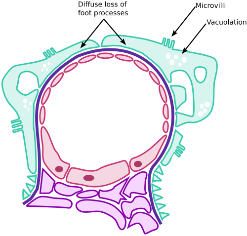
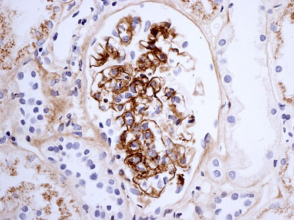

# GLOMERULOPATIAS

Para entender as glomerulopatias na pediatria, você precisa primeiro visualizar o glomérulo como uma peneira altamente sofisticada. Quando essa peneira estraga, ou ela entope (gerando queda da filtração e acúmulo de escórias) ou ela esburaca (deixando passar o que deveria ficar, como proteínas e hemácias). Na prova de residência, o examinador quer saber se você consegue identificar qual tipo de "defeito" a criança tem e, principalmente, se você sabe manejar as complicações agudas.

*Figura 1 - Esquema das alterações na doença por lesão mínima (DLM): fusão dos processos podocitários observada à microscopia eletrônica, principal causa de síndrome nefrótica na infância. Fonte: M.Komorniczak/Huckfinne, CC BY-SA 3.0 | Wikimedia Commons*

## A Barreira de Filtração e a Lógica das Síndromes

O glomérulo é composto pelo endotélio fenestrado, pela membrana basal glomerular e pelos podócitos. Se a agressão é predominantemente inflamatória, com recrutamento de células de defesa, temos a Síndrome Nefrítica. Se a agressão é estrutural, alterando a carga elétrica ou os poros da barreira (especialmente nos podócitos), temos a Síndrome Nefrótica.

Muitos alunos confundem os conceitos porque tentam decorar listas. Pense no seguinte: na inflamação (nefrítica), o glomérulo "incha". Se ele incha, o sangue passa com dificuldade. O resultado? Oligúria e hipertensão. Já na síndrome nefrótica, o glomérulo não está necessariamente "entupido", mas sim "aberto". A perda massiva de proteína é o que dita toda a clínica.

## Síndrome Nefrítica (Glomerulonefrite Difusa Aguda - GNDA)

A GNDA é o protótipo da síndrome nefrítica na infância. O cenário clássico de prova é aquela criança que teve uma infecção de pele ou garganta e, semanas depois, aparece com a tríade: hematúria, edema e hipertensão arterial.

### Fisiopatologia: O Porquê dos Sintomas

A deposição de imunocomplexos no glomérulo ativa a cascata do complemento. Isso gera uma resposta inflamatória que reduz a Taxa de Filtração Glomerular (TFG). Como o rim filtra menos, o corpo retém sódio e água. É essa retenção hidrossalina que causa o edema e a hipertensão, e não apenas a perda de proteínas (que aqui é leve).

### Glomerulonefrite Pós-Estreptocócica (GNPE)

É a causa mais comum de GNDA. O agente é o *Streptococcus pyogenes* (Grupo A de Lancefield), mas atenção: apenas as cepas nefritogênicas causam o quadro.

- **O Período de Latência:** Isso cai muito. Se a infecção foi na faringe, a nefrite surge 1 a 3 semanas depois. Se foi na pele (impétigo), demora mais: 2 a 6 semanas. Se a hematúria aparecer junto com a dor de garganta, mude seu diagnóstico para Doença de Berger (Nefropatia por IgA).

- **Diagnóstico Laboratorial:**

- **Hematúria:** É obrigatória. Pode ser macroscópica (cor de chá ou coca-cola) ou microscópica. O achado de cilindros eritrocitários e dismorfismo eritrocitário (presença de acantócitos) confirma que o sangue vem do glomérulo, não da bexiga.

- **Complemento:** O C3 e o CH50 estão baixos em 90% dos casos. O C4 costuma ser normal. Se o C3 não normalizar em 8 semanas, você deve desconfiar de outra doença, como a Glomerulonefrite Membranoproliferativa.

- **Evidência de Infecção Estreptocócica:** ASLO (mais sensível na faringite) ou Anti-DNAse B (mais sensível na piodermite).

### Manejo da GNDA

O tratamento é basicamente suporte. Não usamos corticoide na GNPE clássica.

- **Restrição Hídrica e Dietética:** Restrição de sódio é fundamental.

- **Diuréticos:** A Furosemida é a droga de escolha porque atua na causa da hipertensão (hipervolemia).

- **Antibióticos:** A Penicilina serve para erradicar a cepa nefritogênica da comunidade e da criança, mas não cura a nefrite que já está instalada.

Cuidado: a principal complicação aguda que mata ou deixa sequelas é a Encefalopatia Hipertensiva. Se a criança com GNDA começar com cefaleia intensa ou convulsão, a prioridade é o controle pressórico agressivo.

## Síndrome Nefrótica

Aqui o buraco é mais embaixo, literalmente. A definição é bioquímica: proteinúria maciça. Na pediatria, definimos como perda urinária de proteína > 40 mg/m²/hora ou uma relação proteína/creatinina urinária > 2.

### A Doença de Lesões Mínimas (DLM)

Responsável por cerca de 80% dos casos em crianças. O nome "lesões mínimas" vem do fato de que, na microscopia óptica comum, o rim parece normal. Só vemos a fusão dos processos podocitários na microscopia eletrônica.

### Fisiopatologia do Edema Nefrótico

Diferente da nefrite, aqui o edema ocorre pela queda da pressão oncótica. A criança perde tanta albumina na urina que o líquido "foge" do vaso para o interstício. Isso gera hipovolemia intravascular, o que ativa o sistema renina-angiotensina-aldosterona, piorando a retenção de sódio.

Como o Dr. Will sempre reforça em suas discussões no MedEvo, o paciente nefrótico é um "edemaciado seco" por dentro do vaso. Por isso, dar diurético venoso de forma impensada pode causar insuficiência renal pré-renal por choque hipovolêmico.

### Quadro Clínico e Complicações

O edema é insidioso, começando em pálpebras (pior de manhã) e progredindo para membros inferiores e ascite.

- **Infecções:** O nefrótico perde imunoglobulinas e fatores do complemento na urina. A complicação infecciosa clássica é a Peritonite Bacteriana Primária (PBP) pelo *Streptococcus pneumoniae*. Se a criança nefrótica chegar com dor abdominal e febre, você deve investigar PBP imediatamente.

- **Fenômenos Tromboembólicos:** Há perda de antitrombina III e aumento da agregação plaquetária. A trombose de veia renal é uma suspeita importante se houver dor lombar e hematúria súbita.

### Tratamento da Síndrome Nefrótica

A primeira linha é a Corticoterapia (Prednisona 60 mg/m²/dia). A maioria das crianças com DLM responde bem.

- **Definições de Resposta:**

- Corticossensível: Urina limpa de proteínas em até 4 semanas.

- Corticorresistente: Não responde após 8 semanas de tratamento. Aqui a biópsia renal torna-se obrigatória para afastar GESF (Glomeruloesclerose Segmentar e Focal).

## Diagnóstico Diferencial: Quando a Biópsia é Necessária?

Na pediatria, evitamos a biópsia renal sempre que o quadro é "de livro". No entanto, as bancas adoram cobrar as exceções.

| Indicação de Biópsia na Síndrome Nefrótica | Indicação de Biópsia na Síndrome Nefrítica |
| --- | --- |
| Idade < 1 ano ou > 10 anos | Complemento (C3) normal desde o início |
| Hematúria macroscópica persistente | Complemento que não normaliza após 8 semanas |
| Hipertensão arterial persistente | Insuficiência renal grave ou progressiva |
| Hipocomplementemia (C3 baixo) | Sinais de doença sistêmica (Lúpus, PHS) |
| Corticorresistência | Proteinúria nefrótica persistente (> 4 semanas) |

*Figura 2 - Imunofluorescência mostrando depósito mesangial de IgA, padrão diagnóstico da nefropatia por IgA (Doença de Berger) e da nefrite de Henoch-Schönlein. Fonte: Karamadoukis et al., CC BY 2.0 | Wikimedia Commons*

## Nefropatia por IgA (Doença de Berger)

Esta é a glomerulopatia primária mais comum no mundo. A dica de ouro para a prova é a hematúria macroscópica recorrente que ocorre **durante** um quadro infeccioso (geralmente respiratório ou gastrointestinal). Não há período de latência.

Diferente da GNPE, o complemento (C3 e C4) na Doença de Berger é **normal**. O prognóstico na infância costuma ser bom, mas em adultos pode evoluir para doença renal crônica. O tratamento envolve o uso de IECA ou BRA para reduzir a proteinúria e proteger o rim, e em casos graves, corticoides.

## Púrpura de Henoch-Schönlein (Vasculite por IgA)

A PHS é uma vasculite de pequenos vasos que frequentemente envolve o rim. Imagine a Doença de Berger, mas com manifestações sistêmicas.

- **Tétrada Clássica:** Púrpura palpável (principalmente em membros inferiores e nádegas), artralgia/artrite, dor abdominal e comprometimento renal.

- **O Rim na PHS:** A hematúria é o achado mais comum. O tratamento da parte renal é semelhante ao da Berger. O uso de corticoide ajuda na dor abdominal e na artrite, mas há controvérsia se ele previne a progressão da doença renal.

## Síndrome de Alport

Se a questão mencionar um menino com hematúria glomerular, perda auditiva neurossensorial e alterações oculares (lenticone), não pense duas vezes: Síndrome de Alport. É uma doença hereditária ligada ao cromossomo X (na maioria dos casos) causada por um defeito no colágeno tipo IV da membrana basal. O quadro evolui invariavelmente para doença renal crônica na vida adulta jovem.

## Hipertensão Arterial na Infância

A hipertensão em pediatria é quase sempre secundária, e a causa renal é a número um. Diferente dos adultos, não usamos valores fixos como 140/90 mmHg para todos.

### Definição e Medida

A PA deve ser avaliada em toda criança acima de 3 anos (ou antes, se houver fatores de risco como prematuridade ou cardiopatia).

- **Técnica:** O manguito deve ter uma largura de bolsa correspondente a 40% da circunferência do braço e um comprimento que cubra 80 a 100% dessa circunferência.

- **Classificação (Diretriz Brasileira de Hipertensão):**

- **PA Normal:** < Percentil 90 (P90).

- **PA Elevada (antiga pré-hipertensão):** P90 até < P95.

- **Hipertensão Estágio 1:** P95 até P95 + 12 mmHg.

- **Hipertensão Estágio 2:** > P95 + 12 mmHg.

Para adolescentes acima de 13 anos, os valores se aproximam dos adultos: PA elevada é 120-129/<80 mmHg e Hipertensão Estágio 1 é ≥ 130/80 mmHg.

### Investigação e Tratamento

Se a PA estiver elevada, a primeira conduta é repetir a medida em mais duas ocasiões. Se confirmada a hipertensão, iniciamos a investigação de causas secundárias (USG de rins e vias urinárias, função renal, eletrólitos).

- **Tratamento Não Farmacológico:** Redução de sal e atividade física (pelo menos 60 minutos de atividade moderada a vigorosa diariamente).

- **Tratamento Farmacológico:** Indicado se houver hipertensão estágio 2, hipertensão sintomática, lesão de órgão-alvo ou falha nas medidas de estilo de vida. IECA e BRA são excelentes opções, mas lembre-se: são contraindicados em adolescentes femininas em idade fértil sem contracepção segura devido ao risco de teratogenicidade.

## Lesão Renal Aguda (LRA) em Pediatria

A LRA é definida pela queda súbita da TFG. Na pediatria, usamos o critério pRIFLE, que se baseia no clearance de creatinina e no débito urinário.

### Classificação pRIFLE

- **Risk (Risco):** Queda de 25% no clearance ou débito urinário < 0,5 ml/kg/h por 8h.

- **Injury (Lesão):** Queda de 50% no clearance ou débito urinário < 0,5 ml/kg/h por 16h.

- **Failure (Falha):** Queda de 75% no clearance ou débito urinário < 0,3 ml/kg/h por 24h ou anúria por 12h.

- **Loss (Perda):** LRA persistente por > 4 semanas.

- **End-stage (Estágio Terminal):** Doença renal terminal (> 3 meses).

### Causas e Manejo

A causa pré-renal (desidratação, choque) é a mais comum. O tratamento foca na restauração da volemia.

- **Cuidado com a Furosemida:** Ela não "cura" a LRA nem previne a diálise. Ela serve apenas para manejar a sobrecarga de volume.

- **Indicações de Diálise de Urgência:**

- Hipercalemia refratária (K > 6,5 mEq/L com alterações no ECG).

- Sobrecarga hídrica com edema agudo de pulmão ou hipertensão grave.

- Acidose metabólica grave (pH < 7,1) refratária.

- Uremia sintomática (pericardite, encefalopatia).

## Doença Renal Crônica (DRC) na Pediatria

A DRC em crianças tem particularidades fundamentais, especialmente no que diz respeito ao crescimento.

### Avaliação da Função Renal: Fórmula de Schwartz

Para estimar a TFG em crianças, usamos a fórmula de Schwartz atualizada:
**TFG (ml/min/1,73m²) = 0,413 x Estatura (cm) / Creatinina sérica (mg/dl)**

### Complicações da DRC

- **Anemia:** É normocítica e normocrômica, causada principalmente pela deficiência de eritropoietina. O tratamento envolve reposição de ferro e eritropoietina humana recombinante.

- **Distúrbio Mineral e Ósseo:** O rim não consegue excretar fósforo (hiperfosfatemia) e não ativa a Vitamina D (hipocalcemia). Isso estimula o PTH, gerando o Hiperparatireoidismo Secundário. O alvo do PTH na DRC estágio V é entre 200-300 pg/ml para garantir uma remodelação óssea adequada.

- **Déficit Estatural:** É multifatorial (acidose, anemia, resistência ao GH). O uso de GH recombinante pode ser indicado se a criança não estiver crescendo apesar do controle metabólico.

## Tumores Renais: O Temido Tumor de Wilms

O Nefroblastoma (Tumor de Wilms) é o tumor renal maligno mais comum da infância. O pico de incidência é entre 2 e 5 anos.

### Apresentação Clínica

O quadro clássico é uma massa abdominal lisa, firme e indolor que **não ultrapassa a linha média**. Diferente do Neuroblastoma, que é uma massa endurecida, irregular e que frequentemente cruza a linha média.

- **Sintomas Associados:** Hipertensão arterial (por compressão da artéria renal e ativação da renina) e hematúria (em 25% dos casos).

- **Atenção:** A palpação abdominal deve ser feita com extrema cautela. A ruptura da cápsula tumoral durante o exame físico pode causar disseminação peritoneal do tumor (estadiamento III automático).

### Diagnóstico e Tratamento

O primeiro exame é a Ultrassonografia de abdome, seguida de Tomografia para estadiamento. O tratamento envolve nefrectomia e quimioterapia. O prognóstico costuma ser excelente, com taxas de cura superiores a 90% em estágios iniciais.

## Distúrbios Tubulares e Outras Condições

### Síndrome de Fanconi

É uma disfunção global do túbulo proximal. A criança perde tudo na urina: glicose (glicosúria normoglicêmica), aminoácidos, fosfato, bicarbonato e potássio. O quadro clínico inclui raquitismo dependente de fosfato e atraso no crescimento. Pode ser causada por drogas como a Ifosfamida.

### Acidose Tubular Renal (ATR)

- **ATR Tipo 2 (Proximal):** Defeito na reabsorção de bicarbonato. Associada à Síndrome de Fanconi.

- **ATR Tipo 1 (Distal):** Defeito na secreção de íons H+. Causa hipocalemia grave e nefrolitíase/nefrocalcinose.

- **ATR Tipo 4 (Hipercalêmica):** Associada à resistência ou deficiência de aldosterona.

### Urolitíase na Infância

A principal causa de cálculos em crianças é a hipercalciúria idiopática. Se houver infecção por germes produtores de urease (*Proteus*, *Klebsiella*), pense em cálculos de estruvita (coraliformes).

## Tabelas Comparativas para Revisão Rápida

### Tabela 1: Síndrome Nefrítica vs. Síndrome Nefrótica

| Característica | Síndrome Nefrítica (GNDA) | Síndrome Nefrótica (DLM) |
| --- | --- | --- |
| Início | Abrupto | Insidioso |
| Edema | Leve a moderado (volemia ↑) | Intenso/Anasarca (volemia ↓) |
| Hipertensão | Comum e importante | Incomum |
| Proteinúria | Leve a moderada | Maciça (> 40 mg/m²/h) |
| Hematúria | Presente (dismórfica) | Ausente ou microscópica |
| Complemento (C3) | Baixo (na GNPE) | Normal |
| Principal Causa | Pós-estreptocócica | Lesões Mínimas |

### Tabela 2: Diagnóstico Diferencial de Massas Abdominais Renais

| Característica | Tumor de Wilms | Neuroblastoma |
| --- | --- | --- |
| Idade média | 2 a 5 anos | < 2 anos |
| Localização | Rim | Adrenal ou Cadeia Simpática |
| Linha Média | Não costuma cruzar | Frequentemente cruza |
| Consistência | Lisa e firme | Irregular e endurecida |
| Marcadores | Ausentes | Catecolaminas urinárias (VMA/HVA) |
| Calcificações | Raras | Comuns na TC |

### Tabela 3: Hipocomplementemia (C3 Baixo) nas Glomerulopatias

| C3 Baixo por até 8 semanas | C3 Baixo por > 8 semanas | C3 Sempre Normal |
| --- | --- | --- |
| GNPE | GN Membranoproliferativa | Nefropatia por IgA (Berger) |
| Nefrite Lúpica (fase ativa) | Nefrite Lúpica persistente | Púrpura de Henoch-Schönlein |
| Endocardite Infecciosa | | Doença de Lesões Mínimas |

## Pontos-Chave para Prova

- **Critério de Proteinúria Nefrótica:** > 40 mg/m²/hora ou relação P/C > 2 em amostra isolada.

- **GNPE:** Período de latência é a chave. Faringite (1-3 semanas), Piodermite (2-6 semanas). C3 baixo que normaliza em 8 semanas.

- **Hematúria Glomerular:** Definida por dismorfismo eritrocitário (> 5% de acantócitos) e cilindros hemáticos.

- **Síndrome Nefrótica e Infecção:** A principal causa de óbito é a Peritonite Bacteriana Primária por Pneumococo.

- **Tratamento da DLM:** Corticoide (Prednisona) é a primeira escolha. Biópsia só se houver sinais de atipia ou resistência.

- **Nefropatia por IgA:** Hematúria macroscópica recorrente concomitante a infecções respiratórias. Complemento normal.

- **Tumor de Wilms:** Massa abdominal lisa que não cruza a linha média. **NÃO palpar vigorosamente** pelo risco de ruptura.

- **Hipertensão Pediátrica:** PA ≥ P95 para idade, sexo e estatura. A causa renal é a principal etiologia secundária.

- **Fórmula de Schwartz:** 0,413 × Estatura / Creatinina. Memorize o 0,413.

- **LRA Pré-renal:** A causa mais comum é a desidratação. O sódio urinário costuma ser baixo (< 20 mEq/L) e a densidade urinária alta.

- **Contraindicação de IECA:** Gestantes e adolescentes em idade fértil sem contracepção (teratogênico).

- **Cálculos Renais:** A hipercalciúria idiopática é a causa metabólica mais frequente em crianças.

- **Anemia na DRC:** É por deficiência de eritropoietina. Alvo de hemoglobina geralmente entre 10 e 12 g/dl.

- **O que NÃO fazer:** Não use diuréticos de alça como primeira linha na Síndrome Nefrótica se houver sinais de hipovolemia (risco de choque e trombose).

- **Pegadinha de Prova:** A alternativa dirá que toda criança com hematúria precisa de biópsia. Falso. A maioria das hematúrias isoladas e assintomáticas é benigna ou idiopática.

- **Pérola Clínica:** Criança com edema periorbitário matutino que melhora ao longo do dia? Pense em Síndrome Nefrótica ou Nefrítica, não em alergia.

 Cópia offline para consulta pessoal.
 Fonte original:
 [https://www.medevo.com.br/material-apoio/ler/7cd4f250-1a22-4250-a4dc-ccde4e0631eb](https://www.medevo.com.br/material-apoio/ler/7cd4f250-1a22-4250-a4dc-ccde4e0631eb)
