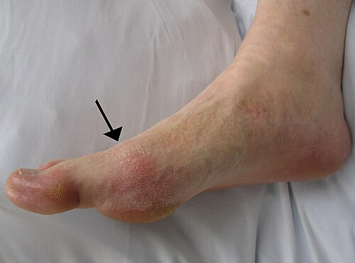

# GOTA E DOENÇAS POR CRISTAIS

Para entender a gota, você precisa parar de enxergá-la apenas como "ácido úrico alto". Se fosse assim, todo paciente com hiperuricemia teria artrite, o que não é verdade. A gota é uma doença inflamatória sistêmica. O cristal de urato monossódico (UMS) funciona como um "perigo molecular" que ativa o inflamassoma NLRP3, desencadeando uma tempestade de interleucina-1 (IL-1).

É por isso que o paciente tem febre e mal-estar durante a crise: não é só a articulação que está sofrendo, é o sistema imune inato reagindo a um corpo estranho.

*Figura 1 - Artrite gotosa aguda (podagra) na primeira articulação metatarsofalangeana, com eritema e edema característicos da crise de gota. Fonte: James Heilman, MD, CC BY-SA 3.0 | Wikimedia Commons*

## Fisiopatologia e Metabolismo das Purinas

O ácido úrico é o produto final do metabolismo das purinas (adenina e guanina). Nós, humanos, perdemos a enzima uricase ao longo da evolução. Sem ela, não transformamos o ácido úrico em alantoína (que é solúvel). Resultado: vivemos no limite da solubilidade.

O limite de solubilidade do urato no plasma, a 37°C, é de aproximadamente 6,8 mg/dL. Acima disso, temos a hiperuricemia. Mas por que alguns cristalizam e outros não? Porque a temperatura e o pH influenciam. É por isso que a gota adora o hálux (dedão do pé): é a articulação mais fria e periférica do corpo, facilitando a precipitação do cristal.

### Por que o ácido úrico sobe?

Em 90% dos casos, o problema é a **hipoexcreção renal**. O rim não consegue jogar fora o que deveria. Apenas 10% dos pacientes são "superprodutores" (geralmente por defeitos enzimáticos raros ou alta renovação celular, como em linfomas).

**Dica de prova MedEvo:** As bancas amam associar a gota a medicamentos. Os diuréticos tiazídicos (hidroclorotiazida) e de alça (furosemida) competem com o ácido úrico pelo transportador no túbulo renal. Se o diurético sai, o ácido úrico fica. Se o seu paciente hipertenso começa com crises de gota, olhe a receita dele.

## Quadro Clínico: A Anatomia da Crise

A história clássica que você vai encontrar na prova é: homem, meia-idade, obeso, hipertenso, que após um churrasco com regado a álcool (cerveja é rica em guanosina, uma purina!), acorda de madrugada com uma dor lancinante no hálux.

### As Fases da Doença

- **Hiperuricemia Assintomática:** O ácido úrico está alto, mas não há cristais gerando inflamação. **Regra de ouro:** Não se trata hiperuricemia assintomática com remédios, salvo raríssimas exceções (ácido úrico > 10-12 mg/dL ou pré-quimioterapia para evitar síndrome de lise tumoral).

- **Artrite Gotosa Aguda:** Início súbito, dor máxima em menos de 24h. A articulação fica quente, vermelha e inchada. O sinal da tecla pode estar presente se houver derrame articular.

- **Período Intercrítico:** O paciente fica totalmente sem sintomas entre as crises. Mas cuidado: se não tratarmos a causa base, os períodos sem dor ficam cada vez mais curtos.

- **Gota Tofácea Crônica:** Após anos de mau controle, o urato se deposita nos tecidos moles, formando os **tofos**. Eles podem surgir em orelhas, cotovelos (bolsa olecraniana) e tendão de Aquiles. O tofo não dói, mas pode ulcerar e sair uma secreção esbranquiçada "em pasta de dente".

**Exemplo Clínico:** Paciente de 65 anos, DRC estágio 3, chega com dor súbita no joelho. Ele já teve isso no hálux há 2 anos. Ao exame: joelho globoso, eritematoso. Você deve pensar em Gota, mas a sua obrigação como médico é excluir Artrite Séptica.

## Diagnóstico: O Padrão-Ouro e as Armadilhas

Se a questão te der a opção de fazer uma **artrocentese com análise do líquido sinovial**, essa é a resposta. Não aceite diagnóstico presuntivo se houver possibilidade de punção.

### Análise do Líquido Sinovial

Na gota, o líquido é do tipo **inflamatório** (amarelado, turvo, baixa viscosidade).

- **Leucócitos:** Geralmente entre 2.000 e 50.000/mm³.

- **Predomínio:** Polimorfonucleares (neutrófilos) > 50-75%.

- **Microscopia de luz polarizada:** É aqui que você ganha a questão. Você verá cristais em formato de **agulhas** com **birrefringência negativa forte**.

**Cuidado com a pegadinha:** "O ácido úrico sérico estava normal, então não é gota". **ERRO!** Em até 30% das crises agudas, o ácido úrico sérico pode estar normal ou até baixo. Por quê? Porque o ácido úrico é um reagente de fase negativa (cai no estresse) e porque ele está "saindo" do sangue e "entrando" na articulação para formar cristais.

## Diagnóstico Diferencial (Tabela 1)

| Característica | Gota | Artrite Séptica | Pseudogota (CPPD) |
| --- | --- | --- | --- |
| **Cristal** | Urato Monossódico (Agulha, Birref. Negativa) | Ausente | Pirofosfato de Cálcio (Romboide, Birref. Positiva) |
| **Líquido Sinovial** | Inflamatório (2k-50k leucos) | Purulento (>50k leucos, >90% PMN) | Inflamatório |
| **Gram/Cultura** | Negativos | Positivos (frequentemente S. aureus) | Negativos |
| **RX** | Erosões em "saca-bocado" (fase tardia) | Destruição articular rápida | Condrocalcinose (calcificação da cartilagem) |

## Tratamento da Crise Aguda

O objetivo aqui é apagar o incêndio. **Evite a regra absoluta de que "nunca se inicia alopurinol durante a crise".** A conduta clássica de prova era não iniciar urato-redutor em plena crise aguda, mas diretrizes mais recentes, como a do ACR, admitem iniciar ou manter alopurinol durante a crise desde que exista indicação clara de terapia redutora de urato e cobertura anti-inflamatória adequada.

Em resumo: **se o paciente já usava alopurinol, mantém; se há indicação de iniciar terapia redutora de urato, é aceitável iniciar durante a crise com anti-inflamatório associado; o erro é tratar essa decisão como dogma absoluto.** Para provas antigas, ainda vale atenção ao perfil da banca e à referência usada no enunciado.

### Opções de Primeira Linha (Escolha conforme o paciente)

- **AINEs:** São excelentes para pacientes jovens e sem comorbidades. Ex: Naproxeno 500mg 12/12h ou Indometacina 50mg 8/8h.

- *Contraindicação:* DRC (insuficiência renal), úlcera péptica ativa, insuficiência cardíaca grave.

- **Colchicina:** Age inibindo a quimiotaxia dos neutrófilos.

- *Dose atual (Diretriz SBR):* 0,5mg (ou 0,6mg) seguido de 0,5mg após 1 hora. Depois, mantém 0,5mg 1 a 2x ao dia até a resolução. Esqueça aquela conduta antiga de dar colchicina até o paciente ter diarreia; isso é tóxico e ultrapassado.

- **Corticosteroides:** A salvação para o paciente com contraindicação a AINE e Colchicina (como o idoso com rim ruim).

- *Dose:* Prednisona 20-35mg/dia por 3 a 5 dias, com desmame rápido.

- *Intra-articular:* Se for apenas uma articulação (monoartrite), a infiltração com triancinolona é uma opção fantástica e segura.

## Tratamento de Longo Prazo (Terapia Hipouricemiante)

Passada a crise (geralmente 2 semanas depois), é hora de evitar que ela volte.

### Quem precisa tratar o ácido úrico?

Segundo a Sociedade Brasileira de Reumatologia (SBR), as indicações são:

- 2 ou mais crises de gota por ano.

- Presença de tofos.

- Erosões radiográficas.

- Nefrolitíase por ácido úrico.

### O Alopurinol

É um inibidor da xantina oxidase. Ele diminui a **produção** de ácido úrico.

- **Dose inicial:** Comece baixo! 100mg/dia (ou 50mg se DRC).

- **Ajuste:** Aumente a cada 2-4 semanas até atingir a **meta**.

- **Meta terapêutica:** Ácido úrico < 6,0 mg/dL para todos. Se o paciente tiver tofos, a meta é mais agressiva: < 5,0 mg/dL.

**Pérola de Prova:** Ao iniciar o Alopurinol, você DEVE fazer profilaxia de crise com Colchicina (0,5mg/dia) por 3 a 6 meses. Isso evita que a oscilação do ácido úrico desencadeie novas dores.

### Medidas Não-Farmacológicas (MEV)

Não adianta só dar remédio. O paciente precisa de números:

- **Dieta:** Reduzir carne vermelha e frutos do mar. Evitar frutose (refrigerantes e sucos industrializados), pois a frutose acelera a degradação de ATP em purinas.

- **Álcool:** O pior é a cerveja. O vinho parece ser o mais neutro, mas a moderação é a regra.

- **Peso:** Perda de peso gradual. Dietas de restrição calórica extrema podem causar cetose, que inibe a excreção de ácido úrico e piora a gota.

- **Hidratação:** > 2 litros de água por dia para evitar cálculos renais.

## Doença por Depósito de Pirofosfato de Cálcio (Pseudogota)

Se a gota é a doença do hálux do homem, a pseudogota é a doença do **joelho da idosa**.
Aqui, o cristal não é de urato, mas de **pirofosfato de cálcio di-hidratado (CPPD)**.

### O que você precisa saber para a prova:

- **Fator Desencadeante:** Frequentemente ocorre após um estresse metabólico, como uma cirurgia ortopédica (troca de prótese) ou uma doença aguda grave.

- **Associações Metabólicas:** Se você vir um paciente jovem com pseudogota, procure por: **Hiperparatiroidismo**, **Hipomagnesemia** e, principalmente, **Hemocromatose**.

- *Dica MedEvo:* Artropatia que acomete a 2ª e 3ª metacarpofalangeanas com osteófitos em "gancho" + condrocalcinose = Hemocromatose.

- **Radiografia:** O sinal clássico é a **condrocalcinose** (uma linha branca calcificada no meio da cartilagem hialina ou fibrocartilagem, como no menisco do joelho ou ligamento triangular do carpo).

- **Líquido Sinovial:** Cristais romboides (formato de envelope/tijolo) com **birrefringência positiva fraca**.

O tratamento da crise de pseudogota é idêntico ao da gota: AINEs, Colchicina ou Corticoide. Não existe um "Alopurinol" para a pseudogota; tratamos apenas as crises e as doenças de base.

## Diagnóstico Diferencial de Artrite Aguda (Tabela 2)

| Suspeita Clínica | Pista na Questão | Conduta Imediata |
| --- | --- | --- |
| **Artrite Séptica** | Febre alta, calafrios, porta de entrada (úlcera), leucocitose importante. | Artrocentese + Antibiótico IV imediato. |
| **Gota** | Podagra, hiperuricemia prévia, uso de tiazídicos, birrefringência negativa. | Artrocentese + AINE/Colchicina. |
| **Artrite Gonocócica** | Jovem, sexualmente ativo, tenossinovite, lesões cutâneas (pústulas). | Cultura de secreções + Ceftriaxone. |
| **Osteoartrite** | Dor mecânica (piora ao andar), idoso, nódulos de Heberden e Bouchard. | Analgesia + Fisioterapia. |

## Situações Especiais e Comorbidades

### Gota e Doença Renal Crônica (DRC)

Este é o cenário favorito das bancas porque limita suas opções.

- **Não use AINE.**

- **Cuidado com a Colchicina:** Em pacientes com ClCr < 30 ml/min, a dose deve ser muito reduzida e o uso prolongado é evitado pelo risco de neuromiopatia.

- **Corticosteroides** são os queridinhos aqui.

### Gota e Risco Cardiovascular

A gota não anda sozinha. Ela faz parte da síndrome metabólica. Pacientes com gota têm maior risco de Infarto Agudo do Miocárdio (IAM) e Acidente Vascular Cerebral (AVC). Curiosamente, a **Losartana** (anti-hipertensivo) tem um leve efeito uricosúrico (ajuda a eliminar ácido úrico), sendo uma ótima escolha para o gotoso hipertenso. Por outro lado, evite o AAS em doses baixas se possível, embora o benefício cardiovascular do AAS geralmente supere o risco de aumentar o ácido úrico.

## Resumo de Condutas Farmacológicas (Tabela 3)

| Medicamento | Indicação | Dose Típica | Observação Importante |
| --- | --- | --- | --- |
| **Colchicina** | Crise aguda / Profilaxia | 0,5mg 1h após 0,5mg (Crise) | Reduzir dose se ClCr < 30. |
| **Naproxeno** | Crise aguda | 500mg 12/12h | Evitar em idosos e DRC. |
| **Prednisona** | Crise aguda | 20-35mg/dia | Opção segura na insuficiência renal. |
| **Alopurinol** | Manutenção | 100-300mg/dia (até 800mg) | Iniciar após a crise passar. |
| **Febuxostate** | Manutenção | 40-80mg/dia | Segunda linha se intolerância ao Alopurinol. |

## Pontos-Chave para Prova

- **Padrão-Ouro:** Identificação de cristais de urato monossódico no líquido sinovial (birrefringência negativa).

- **Artrite Séptica:** É o principal diagnóstico diferencial. Na dúvida, puncione e trate como infecção até vir o resultado da cultura.

- **Ácido Úrico na Crise:** Pode estar normal. Não use o valor sérico para excluir gota aguda.

- **Alopurinol na Crise:** NÃO inicie e NÃO suspenda. Se o paciente já tomava, mantém. Se não tomava, espera 2 semanas.

- **Meta do Ácido Úrico:** < 6,0 mg/dL (ou < 5,0 mg/dL se gota tofácea).

- **Profilaxia:** Sempre que iniciar Alopurinol, associe Colchicina 0,5mg/dia por 3-6 meses para evitar crises de rebote.

- **Diuréticos:** Tiazídicos e Furosemida aumentam o ácido úrico. Losartana e Bloqueadores de Canal de Cálcio ajudam a baixar.

- **Pseudogota:** Cristais de pirofosfato de cálcio, birrefringência positiva, condrocalcinose no RX.

- **Hemocromatose:** Suspeite se houver pseudogota em mãos (2ª e 3ª MCF) associada a diabetes e "bronzeamento" da pele.

- **Contraindicação Absoluta de AINE:** Insuficiência renal grave, úlcera péptica ativa, sangramento gastrointestinal.

- **Líquido Sinovial não-inflamatório:** < 2.000 leucócitos/mm³ (pense em Osteoartrite).

- **Tofos:** São depósitos de cristais. Se houver tofo, o tratamento hipouricemiante é obrigatório.

- **Radiografia na Gota:** Erosões em "saca-bocado" com bordos escleróticos e "sinal da borda pendente" (achados tardios).

- **Álcool e Dieta:** Cerveja e frutose são os grandes vilões. Carne vermelha e frutos do mar devem ser limitados.

- **AAS:** Em doses baixas (75-100mg) pode aumentar levemente o ácido úrico, mas não deve ser suspenso se houver indicação cardiovascular clara.

Lembre-se: a prova vai tentar te convencer a tratar o ácido úrico alto de um paciente sem sintomas ou a começar Alopurinol no meio de uma crise de dor. Não caia nessa. O tratamento da gota é dividido em "apagar o fogo" (crise) e "limpar o terreno" (manutenção).

 Cópia offline para consulta pessoal.
 Fonte original:
 [https://www.medevo.com.br/material-apoio/ler/81a74516-b939-4501-a10a-5ce1c432d3dd](https://www.medevo.com.br/material-apoio/ler/81a74516-b939-4501-a10a-5ce1c432d3dd)
