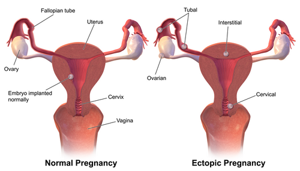
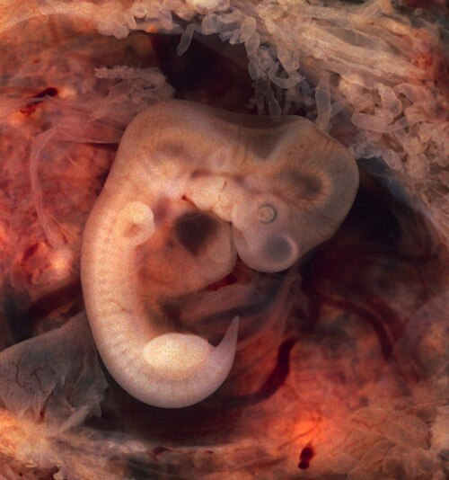

# GRAVIDEZ ECTÓPICA

A gravidez ectópica é aquela em que o blastocisto se implanta fora da cavidade uterina. Para você que está se preparando para a residência, este é um dos temas mais "quentes" da Obstetrícia. Por quê? Porque é a principal causa de morte materna no primeiro trimestre. Se você não diagnosticar rápido, a paciente pode chocar na sua frente.

Nas provas, o examinador quer saber se você sabe identificar os fatores de risco, se sabe manejar o binômio Beta-hCG/Ultrassonografia e, principalmente, se sabe escolher o tratamento correto (expectante, clínico ou cirúrgico).

*Figura 1 - Ilustração das possíveis localizações da gravidez ectópica, com destaque para a implantação tubária (ampola, istmo e fímbrias), que representa 95% dos casos. Fonte: BruceBlaus, CC BY-SA 4.0 | Wikimedia Commons*

## Fisiopatologia e Localizações

Por que o ovo se implanta no lugar errado? O transporte do óvulo fertilizado depende da integridade dos cílios da tuba e da contratilidade da musculatura tubária. Qualquer coisa que cause cicatriz ou inflamação ali vai "atrasar" a viagem do embrião. Se ele demora a chegar no útero, ele acaba se implantando onde estiver quando chegar a hora da nidação.

A localização mais comum, disparada, é a **tuba uterina (95%)**. Dentro da tuba, temos uma hierarquia que cai muito em prova:

- **Ampola (70-80%)**: É o local mais frequente.

- **Ístmo (12%)**.

- **Fímbrias (11%)**.

- **Intersticial/Cornual (2-4%)**: Cuidado aqui! Como essa região é muito vascularizada e tem uma camada muscular mais grossa, a ruptura demora mais a acontecer, mas quando acontece, o sangramento é catastrófico.

Existem ainda localizações extratubárias (ovário, colo uterino, cicatriz de cesárea e cavidade abdominal), que são raras, mas com alta morbidade.

## Epidemiologia e Fatores de Risco

Aqui está o "filé mignon" das questões de múltipla escolha. As bancas amam perguntar o que predispõe à ectópica. O conceito chave é: **lesão tubária prévia**.

### O Principal Fator de Risco

A **Doença Inflamatória Pélvica (DIPA)** é o fator de risco mais importante. A infecção (geralmente por Clamídia ou Gonococo) destrói os cílios da tuba e cria aderências. Se a questão citar "história de corrimento fétido, dor pélvica crônica ou dispareunia", ligue o alerta para ectópica.

### Outros Fatores Relevantes

- **Gravidez ectópica prévia**: Quem teve uma, tem 15% de chance de ter outra. Se teve duas, o risco sobe para 25%.

- **Cirurgia tubária prévia**: Laqueadura (sim, se falhar, a chance de ser ectópica é alta) ou reanastomose.

- **Tabagismo**: A nicotina altera a motilidade ciliar. É um fator dose-dependente.

- **Reprodução Assistida (FIV)**: Aumenta o risco de gestação heterotópica (uma dentro e outra fora do útero).

- **DIU**: Cuidado com a pegadinha! O DIU é um excelente método e previne gravidez (inclusive a ectópica). Porém, **se** a paciente engravidar usando DIU, a chance de essa gravidez ser ectópica é proporcionalmente maior do que em quem não usa nada.

| Fator de Risco | Nível de Risco |
| --- | --- |
| Ectópica prévia | Alto |
| Cirurgia tubária | Alto |
| DIPA / Salpingite | Moderado |
| Tabagismo | Moderado |
| Infertilidade / FIV | Moderado |
| Idade avançada | Leve |

## Quadro Clínico: A Tríade Clássica

Muitos alunos erram questões por esperarem o quadro completo. A tríade clássica é: **Atraso menstrual + Dor abdominal + Sangramento vaginal**.

No entanto, essa tríade só aparece em cerca de 50% dos casos. O sangramento costuma ser em pequena quantidade e escurecido ("borra de café"). A dor é o sintoma mais constante, geralmente unilateral no início.

### Sinais de Gravidez Ectópica Rota (Emergência!)

Se a tuba rompeu, o quadro vira um **Abdome Agudo Hemorrágico**. Você encontrará:

- **Sinal de Proust (Grito de Douglas)**: Dor intensa à mobilização do colo uterino e ao toque do fundo de saco posterior.

- **Sinal de Laffon**: Dor referida no ombro (irritação do nervo frênico pelo hemoperitônio).

- **Sinal de Cullen**: Equimose periumbilical (raro, indica sangue livre na cavidade).

- **Instabilidade Hemodinâmica**: Taquicardia, hipotensão e síncope.

**Dica do Dr. Will**: Se a questão descreve uma gestante de primeiro trimestre com dor súbita e desmaio (síncope), não perca tempo. É ectópica rota até que se prove o contrário.

## O Diagnóstico: O Binômio de Ouro

Para diagnosticar uma ectópica íntegra, você precisa de dois exames: **Beta-hCG quantitativo** e **Ultrassonografia Transvaginal (USTV)**.

### 1. A Zona de Discriminação

Este é o valor de Beta-hCG a partir do qual a USG **obrigatoriamente** deve mostrar um saco gestacional dentro do útero.

- Tradicionalmente, usava-se 1.500 a 2.000 mUI/mL.

- **Segundo a FEBRASGO (2021)**, para evitar diagnósticos falsos e interrupções de gravidezes tópicas viáveis, o valor de segurança adotado é de **3.500 mUI/mL**.

**Como interpretar na prova?**

- Beta-hCG > 3.500 + Útero vazio na USG = Gravidez Ectópica (ou gestação múltipla/abortamento).

- Beta-hCG < 3.500 + Útero vazio = **Gravidez de Localização Indeterminada (GLI)**. Aqui você não faz nada além de repetir o Beta em 48 horas.

### 2. A Curva do Beta-hCG

Em uma gestação normal, o Beta-hCG deve subir pelo menos 35% a 50% em 48 horas (a regra antiga de "dobrar" caiu por terra, mas a maioria sobe bem).

- Na ectópica: O Beta sobe de forma "preguiçosa" (platô ou subida lenta) ou cai de forma lenta.

- No abortamento: O Beta cai rapidamente.

### 3. Achados Ultrassonográficos

- **Sinal do Anel Tubário**: Uma massa anexial com halo hiperecogênico.

- **Massa anexial complexa**: O achado mais comum.

- **Líquido livre em fundo de saco**: Sugere sangramento (pode ser apenas do trofoblasto ou de uma ruptura).

- **Reação de Arias-Stella**: Alteração endometrial que pode simular restos ovulares, mas é apenas efeito hormonal da gravidez ectópica no endométrio.

*Figura 2 - Fotografia macroscópica de tuba uterina aberta revelando gravidez ectópica tubária com embrião de 10mm (7ª semana gestacional), cercado por vilosidades coriônicas. Fonte: Ed Uthman, MD, Domínio Público | Wikimedia Commons*

## Diagnóstico Diferencial

Não ache que toda dor no primeiro trimestre é ectópica. No MedEvo, sempre reforçamos que você deve olhar para o colo uterino e para a estabilidade da paciente.

| Diagnóstico | Dor | Sangramento | Colo Uterino | USG |
| --- | --- | --- | --- | --- |
| **Ectópica** | Unilateral / Intensa | Escasso / Escuro | Fechado (dor à mobilização) | Útero vazio / Massa anexial |
| **Ameaça de Aborto** | Cólica leve | Variável | Fechado | Saco gestacional tópico |
| **Aborto em curso** | Cólica forte | Intenso / Coágulos | Aberto | Restos ou saco baixo |
| **Cisto de Corpo Lúteo Roto** | Súbita | Ausente | Fechado | Líquido livre / Beta negativo |
| **Apendicite** | QID / Migratória | Ausente | Fechado | Apêndice espessado / Beta negativo |

## Tratamento: Onde a Prova te Testa

A escolha do tratamento depende de três pilares: **Estabilidade hemodinâmica**, **Desejo de fertilidade futura** e **Viabilidade da ectópica**.

### 1. Tratamento Cirúrgico

É a conduta padrão.

- **Laparotomia (Cirurgia aberta)**: Indicada se a paciente estiver **instável hemodinamicamente** (choque, ectópica rota). A técnica é a **Salpingectomia Radical** (retira a tuba).

- **Laparoscopia (Padrão-ouro na estabilidade)**: Indicada se a paciente estiver estável.

- **Salpingostomia (Conservadora)**: Abre a tuba, retira o embrião e deixa cicatrizar. Indicada se a paciente quer engravidar e a tuba contralateral é doente ou ausente. *Risco: Persistência de tecido trofoblástico (exige seguimento com Beta-hCG).*

- **Salpingectomia (Radical)**: Retira a tuba. Indicada se a prole já está constituída ou se a tuba está muito danificada.

### 2. Tratamento Clínico (Metotrexato - MTX)

O Metotrexato é um antagonista do ácido fólico que interrompe a divisão celular do trofoblasto.

**Critérios de Indicação (Decore isso!):**

- Estabilidade hemodinâmica.

- Saco gestacional < 3,5 cm (alguns protocolos aceitam até 4 cm).

- Beta-hCG inicial < 5.000 mUI/mL (melhor preditor de sucesso).

- Ausência de atividade cardíaca fetal (BCF negativo).

- Desejo de preservação tubária.

- Função renal e hepática normais (MTX é hepatotóxico e nefrotóxico).

**Esquema de Dose Única:**

- Dose: **50 mg/m² IM**.

- Seguimento: Dosar Beta-hCG nos dias **0, 4 e 7**.

- Sucesso: Queda do Beta-hCG **> 15% entre o dia 4 e o dia 7**.

- Se cair < 15%: Pode-se fazer uma segunda dose de MTX ou partir para cirurgia.

- Após o dia 7: Dosar Beta semanalmente até negativar (< 5 mUI/mL).

**Cuidado**: Durante o tratamento com MTX, a paciente deve evitar sol (risco de dermatite), álcool, relações sexuais e alimentos com ácido fólico (folhas verdes). Além disso, deve-se aguardar **3 meses** para uma nova gestação.

### 3. Conduta Expectante

Sim, é possível apenas observar. Mas os critérios são muito restritos:

- Paciente assintomática e estável.

- Beta-hCG inicial baixo (< 1.500 ou 2.000) e **em declínio**.

- Massa anexial pequena ou não visualizada.

- Seguimento rigoroso com Beta-hCG 2x por semana.

## Situações Especiais

### Gravidez Intersticial (Cornual)

Ocorre na porção da tuba que atravessa a parede miometrial. É perigosa porque o útero "protege" a gravidez por mais tempo, permitindo que ela cresça e o Beta-hCG suba muito (ex: 20.000). Quando rompe, o sangramento é profuso. O tratamento geralmente exige múltiplas doses de MTX ou cirurgia (ressecção cornual).

### Gravidez Heterotópica

É a coexistência de uma gravidez tópica (dentro do útero) e uma ectópica. Muito comum em pacientes de FIV. O desafio aqui é tratar a ectópica sem prejudicar o embrião tópico. O tratamento costuma ser cirúrgico (salpingectomia por laparoscopia) ou injeção local de Cloreto de Potássio (KCl) na ectópica. **Nunca use MTX se houver um embrião viável intraútero!**

### Gravidez Cervical

Implantação no colo do útero. O sinal clássico na USG é o "sinal da ampulheta" (útero em cima, colo dilatado embaixo). O risco é a hemorragia maciça se você tentar uma curetagem achando que é aborto. O tratamento preferencial é MTX sistêmico ou local.

## Pontos-Chave para Prova

- **Local mais comum**: Ampola da tuba uterina.

- **Local mais perigoso**: Porção intersticial (risco de choque hemorrágico grave).

- **Principal fator de risco**: DIPA (lesão ciliar).

- **Zona de Discriminação**: Beta-hCG > 3.500 mUI/mL sem saco gestacional intraútero na USTV = Ectópica até prova em contrário (FEBRASGO 2021).

- **Curva de Beta-hCG**: Subida < 35-50% em 48h sugere gestação inviável (ectópica ou aborto).

- **Tratamento Clínico (MTX)**: Ideal se Beta < 5.000, massa < 3,5 cm e BCF negativo.

- **Seguimento do MTX**: O que importa é a queda > 15% entre o **4º e o 7º dia**.

- **Instabilidade Hemodinâmica**: Conduta é **Laparotomia Exploradora** imediata. Não peça USG se a paciente está chocada e o Beta é positivo!

- **Sinal de Laffon**: Dor no ombro por irritação do nervo frênico (hemoperitônio).

- **Sinal de Proust**: Grito de Douglas (dor ao tocar o fundo de saco).

- **DIU e Ectópica**: O DIU não causa ectópica, mas se a paciente engravidar com ele, a chance de ser ectópica é maior.

- **Pós-Salpingostomia**: Obrigatório seguir com Beta-hCG semanal para descartar persistência trofoblástica.

- **Tipo de Sangramento**: Geralmente escuro, escasso e intermitente.

- **O que NÃO fazer**: Não fazer curetagem em paciente com Beta-hCG subindo e útero vazio sem antes ter certeza de que não é uma gestação tópica inicial (abaixo da zona de discriminação).

- **Dica de Ouro**: Se a questão der uma paciente estável, com Beta de 3.000 e USG com útero vazio, a conduta é **repetir o Beta em 48h** (Gravidez de Localização Indeterminada).

Este material cobre o que há de mais essencial e o que as bancas mais cobram. Lembre-se: na dúvida diagnóstica em paciente estável, o tempo é seu aliado (Beta seriado). Na instabilidade, o tempo é seu inimigo (sala de cirurgia).

 Cópia offline para consulta pessoal.
 Fonte original:
 [https://www.medevo.com.br/material-apoio/ler/b030a420-e3f9-45a5-81d7-0e84a78684ea](https://www.medevo.com.br/material-apoio/ler/b030a420-e3f9-45a5-81d7-0e84a78684ea)
