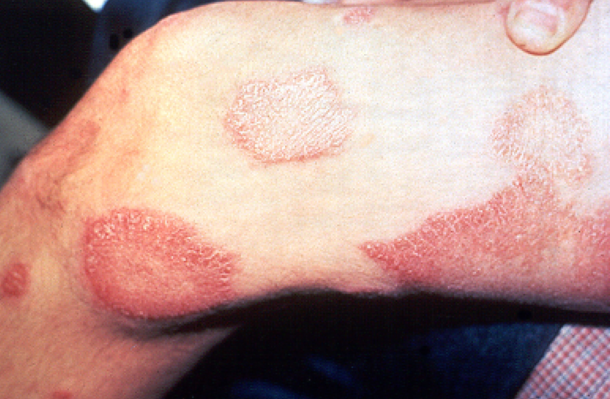
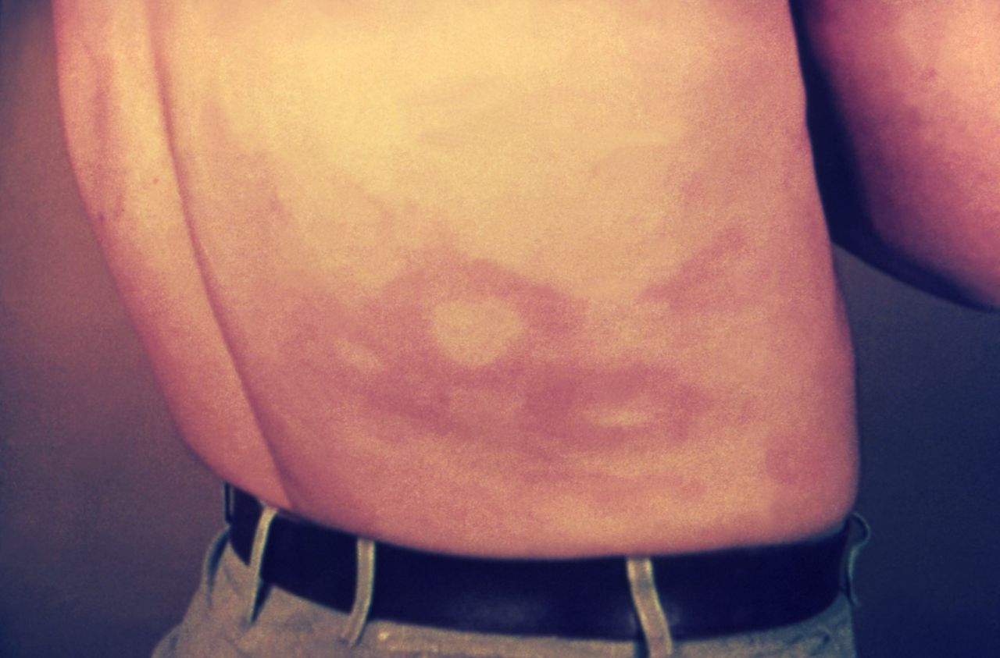
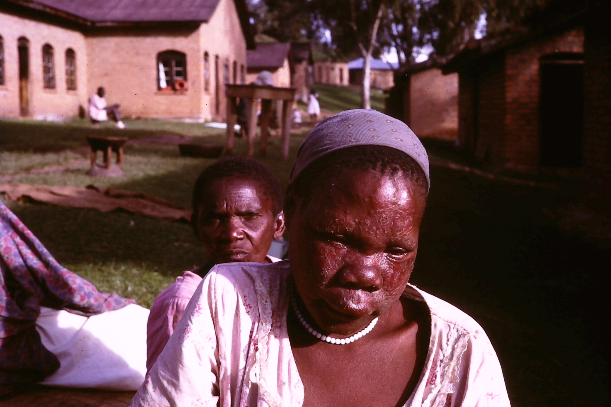
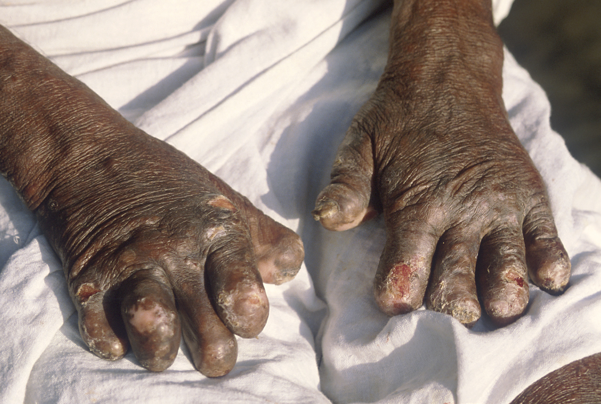
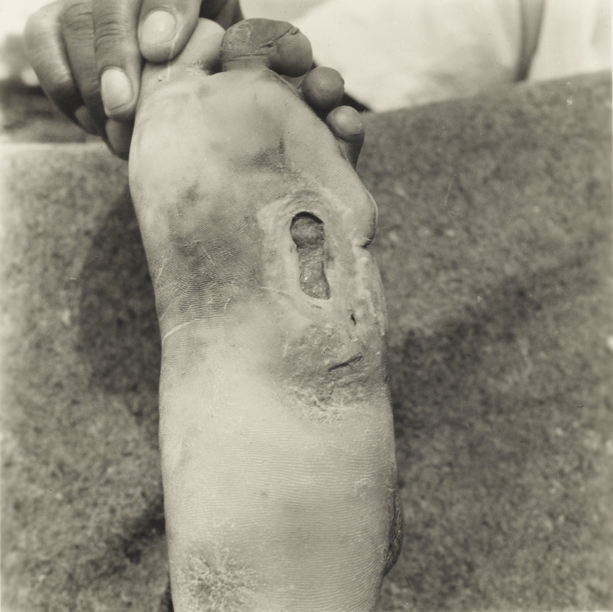

# HANSENÍASE

A hanseníase é uma doença infecciosa crônica causada pelo *Mycobacterium leprae*, bacilo álcool-ácido resistente com tropismo por pele e nervos periféricos, especialmente células de Schwann. Por isso, a hanseníase deve ser entendida como uma neuropatia periférica infecciosa com manifestações cutâneas.

O diagnóstico precoce evita incapacidades físicas, estigma e transmissão. No Brasil, a doença segue relevante em provas e na prática clínica por sua alta carga epidemiológica e pela necessidade de manejo na Atenção Primária.

## Transmissão

A transmissão ocorre principalmente por vias aéreas superiores, por contato próximo e prolongado com pessoa com hanseníase multibacilar sem tratamento.

Pontos importantes:

- não há transmissão relevante por toque, abraços, objetos ou fômites;

- pacientes paucibacilares transmitem pouco ou não transmitem;

- após início adequado da poliquimioterapia, a transmissibilidade cai rapidamente;

- isolamento social não é indicado.

## Fisiopatologia e formas clínicas

A apresentação clínica depende da resposta imune do hospedeiro.

- **Boa imunidade celular:** limita a multiplicação bacilar, gerando formas paucibacilares, com poucas lesões e baciloscopia geralmente negativa.

- **Falha da imunidade celular:** permite alta carga bacilar, gerando formas multibacilares, com lesões numerosas, infiltração difusa e baciloscopia positiva.

- **Formas dimorfas:** são imunologicamente instáveis e têm maior risco de reações hansênicas.

### Classificação clínica

| Forma | Características principais |
| --- | --- |
| **Indeterminada** | Mancha hipocrômica, mal definida, com alteração sensitiva discreta, especialmente térmica. Mais comum no início da doença. |
| **Tuberculoide** | Uma ou poucas placas bem delimitadas, hipoestésicas ou anestésicas, com bordas elevadas e acometimento neural localizado. |
| **Dimorfa** | Lesões variadas, assimétricas, por vezes foveolares, com bordas internas mais nítidas e externas imprecisas. Maior risco de reação tipo 1. |
| **Virchowiana** | Infiltração difusa, múltiplas lesões, madarose, hansenomas, fácies leonina e baciloscopia positiva. |

### Referência visual

#### Hanseníase tuberculoide

*Figura 1: Placa bem delimitada, compatível com forma tuberculoide.*

#### Hanseníase multibacilar

*Figura 2: Lesões múltiplas e extensas, típicas de formas multibacilares.*

#### Fácies leonina

*Figura 3: Infiltração facial difusa, madarose e hansenomas na forma virchowiana avançada.*

## Classificação operacional

É a classificação usada para definir o tratamento.

- **Paucibacilar (PB):** até 5 lesões de pele e baciloscopia negativa, quando disponível.

- **Multibacilar (MB):** mais de 5 lesões de pele ou baciloscopia positiva ou acometimento de mais de um tronco nervoso.

A baciloscopia positiva classifica o caso como multibacilar, independentemente do número de lesões.

## Quadro clínico

A suspeita deve surgir diante de lesões de pele com alteração de sensibilidade ou sinais de neuropatia periférica.

Achados comuns:

- manchas hipocrômicas, eritematosas ou acastanhadas;

- placas infiltradas ou bem delimitadas;

- redução ou perda de pelos e sudorese na lesão;

- hipoestesia ou anestesia;

- espessamento, dor ou choque à palpação de nervos periféricos;

- perda de força, garras, pé caído, mão caída ou lagoftalmo;

- úlceras plantares por perda de sensibilidade.

A perda sensitiva costuma seguir a sequência:

- térmica;

- dolorosa;

- tátil.

A sensibilidade térmica costuma ser a primeira a se alterar.

## Avaliação neurológica simplificada

A avaliação neurológica é obrigatória no diagnóstico, durante o tratamento, nas reações e na alta. Deve incluir inspeção, teste de sensibilidade, força muscular e palpação de nervos.

Nervos mais cobrados:

- **ulnar:** garra ulnar, atrofia de interósseos, alteração sensitiva em 4º e 5º dedos;

- **mediano:** perda da oposição do polegar;

- **radial:** mão caída;

- **fibular comum:** pé caído;

- **tibial posterior:** perda de sensibilidade plantar e mal perfurante plantar;

- **facial:** lagoftalmo;

- **trigêmeo:** redução da sensibilidade corneana.

### Deformidades neurais

#### Mão em garra

*Figura 4: Deformidades em mãos por neuropatia hansênica.*

#### Mal perfurante plantar

*Figura 5: Úlcera plantar trófica por perda de sensibilidade protetora.*

## Diagnóstico

O diagnóstico é principalmente clínico. A hanseníase é confirmada quando há pelo menos um dos sinais cardinais:

- lesão de pele com alteração de sensibilidade térmica, dolorosa ou tátil;

- espessamento de nervo periférico associado a alteração sensitiva, motora ou autonômica;

- presença de *M. leprae* em baciloscopia de raspado intradérmico ou exame histopatológico.

A baciloscopia tem alta especificidade, mas sensibilidade limitada. Portanto, baciloscopia negativa não exclui hanseníase. Sua principal utilidade é auxiliar a classificação operacional, pois resultado positivo define doença multibacilar.

Exames como biópsia, eletroneuromiografia, sorologia anti-PGL-I e qPCR podem ajudar em casos difíceis, especialmente na hanseníase neural pura ou em apresentações atípicas, mas não substituem a avaliação clínica.

## Tratamento

O tratamento no SUS é feito com poliquimioterapia única (PQT-U), composta por:

- rifampicina;

- dapsona;

- clofazimina.

Todos os pacientes recebem as três drogas. O que muda é o número de doses supervisionadas e o tempo máximo para completá-las.

| Classificação | Duração prevista | Prazo máximo para completar |
| --- | --- | --- |
| **Paucibacilar** | 6 doses mensais supervisionadas | Até 9 meses |
| **Multibacilar** | 12 doses mensais supervisionadas | Até 18 meses |

### Esquema adulto

| Medicamento | Dose supervisionada mensal | Dose autoadministrada diária |
| --- | --- | --- |
| **Rifampicina** | 600 mg | Não há |
| **Dapsona** | 100 mg | 100 mg/dia |
| **Clofazimina** | 300 mg | 50 mg/dia |

A alta por cura é dada após completar o número de doses indicado, e não pelo desaparecimento completo das lesões, que pode demorar.

### Efeitos adversos importantes

- **Rifampicina:** urina e secreções alaranjadas, hepatotoxicidade e interações medicamentosas.

- **Dapsona:** anemia hemolítica, metemoglobinemia e síndrome de hipersensibilidade à dapsona.

- **Clofazimina:** hiperpigmentação cutânea, ressecamento da pele e ictiose.

Orientar previamente sobre efeitos esperados melhora a adesão e reduz abandono.

## Reações hansênicas

Reações hansênicas são episódios inflamatórios agudos. Podem ocorrer antes, durante ou após o tratamento. Não significam, isoladamente, falha terapêutica.

A regra mais importante: **não suspender a PQT durante reação hansênica**.

### Reação tipo 1, ou reação reversa

Mais comum nas formas dimorfas. Decorre de aumento da resposta imune celular.

Manifestações:

- piora inflamatória de lesões antigas;

- lesões mais eritematosas, edemaciadas e dolorosas;

- neurite aguda;

- perda sensitiva ou motora súbita.

Tratamento:

- prednisona, geralmente 1 a 2 mg/kg/dia, com redução gradual conforme resposta;

- proteção neural e acompanhamento funcional.

Neurite aguda é emergência, pois pode causar incapacidade permanente.

### Reação tipo 2, ou eritema nodoso hansênico

Mais comum em formas multibacilares, especialmente virchowiana. Relaciona-se a imunocomplexos.

Manifestações:

- nódulos subcutâneos eritematosos e dolorosos;

- febre, mal-estar e artralgia;

- neurite, orquiepididimite, iridociclite ou glomerulonefrite em casos graves.

Tratamento:

- talidomida é opção de escolha em pacientes elegíveis;

- corticosteroide é indicado quando há neurite, comprometimento sistêmico importante ou contraindicação à talidomida;

- clofazimina pode ser usada em casos recorrentes ou crônicos.

A talidomida é altamente teratogênica e é contraindicada na gestação. Seu uso exige controle rigoroso conforme normas sanitárias.

### Comparação entre reações

| Característica | Reação tipo 1 | Reação tipo 2 |
| --- | --- | --- |
| Forma associada | Dimorfa | Multibacilar, especialmente virchowiana |
| Mecanismo | Imunidade celular | Imunocomplexos |
| Pele | Lesões antigas inflamam | Nódulos novos e dolorosos |
| Sintomas sistêmicos | Menos comuns | Frequentes |
| Neurite | Muito comum | Pode ocorrer |
| Tratamento principal | Corticosteroide | Talidomida, se elegível; corticosteroide em situações específicas |

## Contatos e BCG

Todo contato domiciliar ou social próximo e prolongado deve ser avaliado com **exame dermatoneurológico**. O objetivo é encontrar caso ativo cedo, interromper transmissão e prevenir incapacidades.

### Conduta prática nos contatos

- **Examinar pele e nervos periféricos** de contatos domiciliares e sociais próximos.

- **Investigar sintomas e sinais cardinais**: mancha com alteração de sensibilidade, espessamento neural com déficit sensitivo/motor/autonômico ou baciloscopia/histopatologia positiva.

- **Tratar como caso de hanseníase** se houver diagnóstico, em vez de fazer profilaxia.

- **Orientar retorno** se surgirem manchas, dormência, dor neural, perda de força, úlcera plantar ou alteração ocular.

- **Aplicar BCG conforme cicatriz vacinal**, depois de excluir hanseníase ativa.

### BCG em contatos

A BCG pode reduzir o risco de adoecimento e é indicada conforme cicatriz vacinal, após exclusão de hanseníase ativa:

- sem cicatriz: 1 dose;

- 1 cicatriz: 1 dose;

- 2 cicatrizes: não aplicar dose adicional.

### Rifampicina em dose única: cuidado com material desatualizado

A rifampicina em dose única para profilaxia pós-exposição já foi discutida e avaliada para contatos de hanseníase, mas **não deve ser ensinada como rotina atual do SUS**. A CONITEC recomendou a exclusão dessa estratégia da rede pública, considerando benefício insuficiente no cenário avaliado e preocupação com resistência à rifampicina, fármaco central do tratamento da hanseníase.

Para prova e prática no Brasil, o eixo atual é: **examinar contatos, excluir doença ativa, aplicar BCG quando indicada e manter vigilância clínica**. Se o contato já tiver sinais de hanseníase, a conduta é diagnóstico e tratamento com PQT-U, não dose única de rifampicina.

## Situações especiais

### Crianças

Hanseníase em menores de 15 anos indica transmissão recente e ativa na comunidade, geralmente relacionada a contato próximo com caso multibacilar não tratado. O tratamento segue PQT-U com doses ajustadas por peso.

### Gestação e lactação

Hanseníase não é indicação de interrupção da gestação nem da amamentação. A PQT-U pode ser usada. O puerpério exige atenção pelo maior risco de reações hansênicas.

Talidomida é contraindicada na gestação.

### HIV

A hanseníase não é considerada doença oportunista clássica do HIV. Após início de terapia antirretroviral, pode ocorrer síndrome inflamatória de reconstituição imune, geralmente como reação tipo 1.

### Hanseníase neural pura

Apresenta acometimento neural sem lesões cutâneas evidentes. Pode cursar com dor neural, espessamento de nervos, perda sensitiva ou motora.

A investigação pode incluir eletroneuromiografia, exames de imagem de nervo, biópsia em casos selecionados e testes moleculares quando disponíveis.

## Grau de incapacidade física

O grau de incapacidade física deve ser avaliado no diagnóstico e na alta.

| Grau | Critério |
| --- | --- |
| **GIF 0** | Sem alteração sensitiva ou motora em olhos, mãos e pés. |
| **GIF 1** | Perda ou diminuição de sensibilidade, sem deformidade visível. |
| **GIF 2** | Deformidade ou incapacidade visível, como garra, pé caído, mão caída, lagoftalmo, úlcera trófica, reabsorção óssea ou atrofia muscular. |

A classificação final considera o pior segmento avaliado.

## Fenômeno de Lúcio

É uma reação rara e grave, associada à hanseníase virchowiana difusa. Cursa com lesões purpúricas, bolhas hemorrágicas, necrose cutânea e ulcerações extensas.

Deve ser suspeitado diante de necrose cutânea extensa em paciente com hanseníase multibacilar difusa. O manejo exige suporte clínico intensivo, tratamento de infecção secundária quando presente, cuidados locais e manutenção do tratamento específico.

## Diagnósticos diferenciais

O principal diferencial é a alteração de sensibilidade. Lesões hipocrômicas ou eritematosas com sensibilidade preservada devem levantar outras hipóteses.

Principais diferenciais:

- pitiríase versicolor;

- pitiríase alba;

- vitiligo;

- dermatofitoses;

- eczema;

- morfeia;

- neuropatias periféricas de outras causas.

## Pontos-chave

- Hanseníase é neuropatia periférica infecciosa com manifestações cutâneas.

- O diagnóstico é clínico na maioria dos casos.

- Um sinal cardinal é suficiente para confirmar o diagnóstico.

- Baciloscopia negativa não exclui hanseníase.

- Baciloscopia positiva classifica o caso como multibacilar.

- PB: até 5 lesões e baciloscopia negativa, se disponível.

- MB: mais de 5 lesões, baciloscopia positiva ou mais de um tronco nervoso acometido.

- A perda sensitiva costuma seguir a ordem: térmica, dolorosa e tátil.

- PQT-U usa rifampicina, dapsona e clofazimina para PB e MB.

- PB: 6 doses mensais, podendo completar em até 9 meses.

- MB: 12 doses mensais, podendo completar em até 18 meses.

- Não suspender PQT durante reações hansênicas.

- Reação tipo 1: lesões antigas inflamam e neurite é comum; tratar com corticosteroide.

- Reação tipo 2: nódulos dolorosos e sintomas sistêmicos; talidomida é opção de escolha em pacientes elegíveis.

- Talidomida é teratogênica e contraindicada na gestação.

- Neurite aguda é emergência médica.

- Contatos devem ser examinados, receber BCG conforme cicatriz vacinal quando indicado e manter vigilância clínica; rifampicina em dose única não deve ser ensinada como rotina atual do SUS.

- Hanseníase em menor de 15 anos sugere transmissão ativa.

- Alta por cura depende do número de doses, não do desaparecimento completo das manchas.

- GIF 1 é perda de sensibilidade sem deformidade; GIF 2 é deformidade ou incapacidade visível.

 Cópia offline para consulta pessoal.
 Fonte original:
 [https://www.medevo.com.br/material-apoio/ler/e4d175a0-6a18-41bd-9883-b4e22432abbd](https://www.medevo.com.br/material-apoio/ler/e4d175a0-6a18-41bd-9883-b4e22432abbd)
