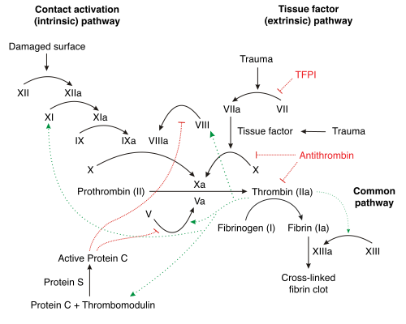
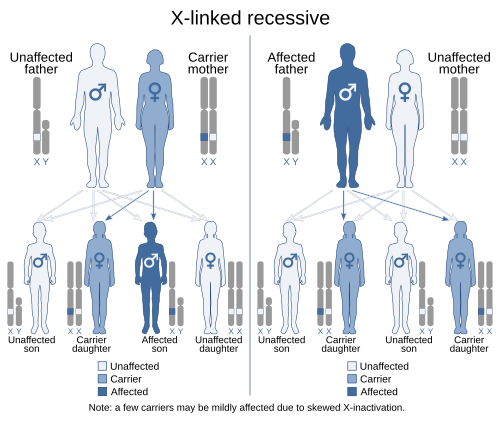

# HEMOFILIA E COAGULOPATIAS

Para entender as coagulopatias na pediatria, você precisa primeiro organizar sua mente em dois grandes grupos de problemas: os de hemostasia primária (plaquetas e vasos) e os de hemostasia secundária (fatores de coagulação). Nas provas de residência, quando falamos de Hemofilia e Deficiência de Vitamina K, estamos mergulhados na hemostasia secundária.

O que isso significa na prática clínica? Significa que o sangramento não é aquele "em pontinho" (petéquias) que vemos nas púrpuras. Aqui, o buraco é mais embaixo. O sangramento é profundo, em articulações (hemartroses) ou grandes hematomas musculares. Se você entender essa diferença fundamental, já elimina metade das alternativas erradas em uma questão de caso clínico.

*Figura 1 - Cascata de coagulação detalhada mostrando as vias intrínseca (fatores XII, XI, IX, VIII → TTPA), extrínseca (fator VII → TAP) e via comum (X, V, II, I). Fonte: Joe D, CC BY-SA 3.0 | Wikimedia Commons*

## Fisiopatologia da Coagulação: O "Porquê" dos Exames

Muitos alunos decoram a cascata de coagulação e esquecem para que ela serve. No dia a dia do Dr. Will e na sua prova, a cascata serve para interpretar o Coagulograma.

A via intrínseca é avaliada pelo TTPA (Tempo de Tromboplastina Parcial Ativada). Os fatores envolvidos são o XII, XI, IX e VIII. Guarde isso: se o TTPA está prolongado e o resto está normal, o problema está em um desses quatro. As hemofilias A (Fator VIII) e B (Fator IX) moram aqui.

A via extrínseca é avaliada pelo TAP (Tempo de Protrombina), também expresso pelo INR. O principal fator aqui é o VII. Como o Fator VII tem a meia-vida mais curta de todos, ele é o primeiro a "cair" quando falta Vitamina K ou quando o fígado para de funcionar.

A via comum envolve os fatores X, V, II (Protrombina) e I (Fibrinogênio). Se o problema for aqui, tanto o TAP quanto o TTPA estarão alterados.

## Hemofilias: A e B

As hemofilias são doenças hereditárias resultantes da deficiência de fatores de coagulação. A Hemofilia A é a deficiência do Fator VIII (80% dos casos), enquanto a Hemofilia B é a deficiência do Fator IX (20% dos casos).

*Figura 2 - Herança recessiva ligada ao cromossomo X: mãe portadora transmite o gene para 50% dos filhos (afetados) e 50% das filhas (portadoras). Fonte: SUM1/Domaina/Kashmiri, CC BY-SA 4.0 | Wikimedia Commons*

### Herança Genética e Epidemiologia

Aqui reside uma pegadinha clássica de aconselhamento genético: a herança é recessiva ligada ao cromossomo X. Isso significa que a doença afeta quase exclusivamente homens, enquanto as mulheres são portadoras.

Se um pai tem hemofilia e a mãe é normal, todos os filhos homens serão saudáveis (pois recebem o Y do pai), mas todas as filhas serão portadoras obrigatórias (pois recebem o único X do pai). Se a banca colocar uma menina sangrando, pense em Doença de von Willebrand ou outras coagulopatias, raramente hemofilia, a menos que haja uma desativação extrema do cromossomo X (Lyonização) ou Turner (45,X).

### Classificação de Gravidade

A gravidade da hemofilia não depende do sintoma, mas sim do nível de atividade residual do fator no plasma. Esta tabela é fundamental para definir quem faz profilaxia.

| Classificação | Nível de Fator VIII ou IX | Clínica Típica |
| --- | --- | --- |
| Grave | < 1% | Sangramentos espontâneos frequentes, hemartroses graves. |
| Moderada | 1% a 5% | Sangramentos após traumas leves ou cirurgias. |
| Leve | > 5% a < 40% | Sangramentos apenas após grandes traumas ou cirurgias. |

### Quadro Clínico: A Hemartrose

O sinal patognomônico da hemofilia na infância é a hemartrose. Imagine o cenário: um lactente de 10 a 12 meses, que começou a engatinhar ou dar os primeiros passos, apresenta um joelho edemaciado, quente e doloroso após um trauma banal.

Diferente de uma artrite séptica, na hemartrose o início é súbito e muitas vezes não há febre sistêmica, embora a articulação possa estar quente. Com o tempo, sangramentos repetidos na mesma articulação (articulação-alvo) levam à destruição da cartilagem e hipertrofia sinovial, resultando em artropatia hemofílica crônica.

Além das articulações, os hematomas musculares são comuns. Cuidado especial com o músculo Psoas: um hematoma ali pode mimetizar uma apendicite ou causar compressão do nervo femoral.

### Diagnóstico Laboratorial

O passo a passo diagnóstico que as bancas amam:

- Triagem: TTPA prolongado com TAP e Plaquetas normais.

- Teste de Mistura: Você mistura o plasma do paciente com plasma normal (1:1). Se o TTPA normalizar, falta fator. Se não normalizar, o paciente tem um inibidor (anticorpo). Na hemofilia inicial, o teste de mistura normaliza.

- Dosagem de Fatores: Confirma se é Fator VIII (Hemofilia A) ou Fator IX (Hemofilia B).

Erro comum: Achar que o Tempo de Sangramento (TS) está alterado na hemofilia. Não está! O TS avalia plaquetas. Na hemofilia, as plaquetas funcionam perfeitamente, o problema é a rede de fibrina que não se forma para segurar o tampão.

## Manejo Terapêutico da Hemofilia

O tratamento baseia-se na reposição do fator deficiente. No Brasil, o Ministério da Saúde fornece os concentrados de fator liofilizado.

### Tratamento de Episódios Agudos

Em caso de sangramento agudo, a regra de ouro é: trate primeiro, pergunte depois. Se um hemofílico chega com trauma craniano, você não espera a Tomografia. Você prescreve o Fator VIII ou IX imediatamente para atingir 100% de atividade e só então leva o paciente para o exame de imagem.

Cálculo de dose (Hemofilia A):
Cada 1 UI/kg de Fator VIII eleva em 2% o nível plasmático.
Dose = (Nível desejado menos Nível atual) x Peso / 2.
Na prática, para atingir 100%, usamos 50 UI/kg de Fator VIII.

Cálculo de dose (Hemofilia B):
Cada 1 UI/kg de Fator IX eleva em 1% o nível plasmático.
Dose = (Nível desejado menos Nível atual) x Peso.
Para atingir 100%, usamos 100 UI/kg de Fator IX.

### Metas de Nível de Fator

| Tipo de Sangramento | Meta de Nível de Fator |
| --- | --- |
| Hemartrose inicial / Hematoma muscular | 30% a 50% |
| Hemorragia Digestiva / Hematúria | 50% |
| Trauma Craniano / Cirurgia de Grande Porte | 80% a 100% |

### Profilaxia

Atualmente, o padrão ouro para hemofilia grave é a profilaxia primária. Isso significa dar o fator regularmente (ex: 3 vezes por semana para Fator VIII) para manter o nível basal sempre acima de 1%, transformando um hemofílico grave em um "moderado" e evitando a artropatia.

### Complicações: O Pesadelo dos Inibidores

Cerca de 20% a 30% dos pacientes com Hemofilia A grave desenvolvem inibidores (anticorpos IgG contra o Fator VIII). Isso acontece geralmente nas primeiras 20 a 50 exposições ao fator.

Como suspeitar? O paciente sangra, você repõe o fator na dose correta e ele continua sangrando. O TTPA não corrige no teste de mistura. Nesses casos, usamos agentes de desvio (bypassing agents) como o Complexo Protrombínico Parcialmente Ativado ou o Fator VIIa recombinante, que "pulam" a etapa do Fator VIII na cascata.

## Deficiência de Vitamina K e Doença Hemorrágica do RN

A Vitamina K é um cofator essencial para a gama-carboxilação dos fatores II, VII, IX e X, além das proteínas C e S. Sem essa carboxilação, os fatores são produzidos pelo fígado, mas não funcionam (são chamados de PIVKAs, Proteins Induced by Vitamin K Absence).

### Por que o Recém-Nascido é Vulnerável?

O RN é o alvo perfeito para essa deficiência por quatro motivos:

- Passagem placentária de Vitamina K é muito pobre.

- O intestino do RN é estéril ao nascimento (não há bactérias para sintetizar Vit K2).

- O leite materno é pobre em Vitamina K.

- O fígado neonatal é imaturo na produção de fatores.

### Classificação Clínica

A Doença Hemorrágica do Recém-Nascido (atualmente chamada de Sangramento por Deficiência de Vitamina K - SDVK) é dividida pelo tempo de aparecimento:

- Precoce (primeiras 24h): Geralmente associada ao uso materno de drogas que interferem na Vitamina K (anticonvulsivantes como fenitoína, ou tuberculostáticos como rifampicina).

- Clássica (2º ao 7º dia): Ocorre em RNs que não receberam profilaxia. Manifesta-se com sangramento gastrointestinal, umbilical ou cutâneo.

- Tardia (2 semanas a 6 meses): É a mais perigosa. Frequentemente associada à malabsorção (fibrose cística, atresia de vias biliares) ou uso prolongado de antibióticos. O grande risco aqui é a Hemorragia Intracraniana (até 50% dos casos).

### Diagnóstico e Conduta

O laboratório mostra um TAP (INR) muito prolongado. O TTPA também pode estar alterado, mas o TAP é mais sensível. As plaquetas são normais (diferenciando de CIVD ou sepse).

A prevenção é obrigatória: 1 mg de Vitamina K1 por via intramuscular ao nascimento para todos os RNs. Se a família recusar a via IM, pode-se considerar a via oral (2 mg ao nascimento, repetindo com 4 a 7 dias e 4 a 6 semanas), mas a absorção é menos confiável.

Se o RN já está sangrando, a conduta é Vitamina K1 (Fitomenadiona) 1 mg por via endovenosa. Em sangramentos graves com risco de vida, repõe-se o Complexo Protrombínico ou Plasma Fresco Congelado para repor os fatores prontos imediatamente, pois a Vitamina K demora algumas horas para agir no fígado.

## Hipertensão Portal e Sangramento Varicoso na Pediatria

Embora não seja uma "coagulopatia" primária, o manejo do sangramento varicoso aparece frequentemente junto com este tema devido ao choque hemorrágico e ao uso de drogas específicas.

Na pediatria, a causa mais comum de hipertensão portal pré-hepática é a trombose de veia porta (muitas vezes sequela de cateterismo umbilical no período neonatal). A criança é previamente hígida, tem esplenomegalia e, de repente, apresenta uma hematêmese maciça.

### Manejo do Sangramento Agudo

- Estabilização Hemodinâmica: Acesso venoso calibroso e expansão com cristaloides. Cuidado: não hiper-expandir, pois o aumento da pressão hidrostática pode piorar o sangramento das varizes.

- Octreotida ou Somatostatina: Estas drogas promovem vasoconstrição esplâncnica seletiva. Isso reduz o fluxo de sangue para o sistema porta e, consequentemente, diminui a pressão dentro das varizes esofágicas. É a droga de escolha na emergência pediátrica.

- Endoscopia Digestiva Alta: Deve ser realizada após a estabilização para ligadura elástica ou escleroterapia.

- Antibioticoprofilaxia: Mesmo em crianças, o uso de ceftriaxona ou amoxicilina-clavulanato reduz a translocação bacteriana e a mortalidade.

Lembre-se da pérola clínica: em crianças, a hipotensão é um sinal tardio de choque. Quando a pressão cai, a criança já perdeu mais de 30% a 40% da volemia. Valorize a taquicardia e o tempo de enchimento capilar lentificado.

## Diagnóstico Diferencial das Coagulopatias

Para não errar na prova, você precisa comparar os perfis laboratoriais. No MedEvo, sempre reforçamos que o padrão de exames é o seu mapa.

| Patologia | TAP | TTPA | Plaquetas | TS | Comentário |
| --- | --- | --- | --- | --- | --- |
| Hemofilia A ou B | Normal | Aumentado | Normal | Normal | Sangramento articular/muscular. |
| Deficiência Vit. K | Aumentado | Aumentado* | Normal | Normal | *TTPA aumenta nos casos graves. |
| D. von Willebrand | Normal | Aumentado* | Normal | Aumentado | *TTPA aumenta se Fator VIII estiver baixo. |
| Púrpura (PTI) | Normal | Normal | Baixas | Aumentado | Sangramento cutâneo-mucoso (petéquias). |
| Insuf. Hepática | Aumentado | Aumentado | Baixas* | Normal | *Esplenomegalia/Hipertensão portal. |
| CIVD | Aumentado | Aumentado | Baixas | Aumentado | Paciente grave, séptico, consome tudo. |

## Teste de Mistura: O Divisor de Águas

Se a banca te der um TTPA prolongado, ela quer saber se você sabe diferenciar deficiência de fator de presença de inibidor.

Você pega o plasma do paciente (que tem o problema) e mistura com plasma de uma pessoa normal (que tem todos os fatores).

- Se o TTPA normalizar: O plasma normal "emprestou" o fator que faltava. Diagnóstico: Deficiência de Fator (Hemofilia).

- Se o TTPA continuar prolongado: O plasma do paciente tem um "veneno" (anticorpo inibidor) que destruiu o fator que o plasma normal tentou emprestar. Diagnóstico: Presença de Inibidor.

Isso é fundamental porque o tratamento muda completamente. No inibidor, dar mais fator é como "jogar gasolina no fogo" em termos de custo e ineficácia, sendo necessário usar os agentes de desvio.

## Situações Especiais e Pegadinhas

### O Trauma Craniano no Hemofílico

Esta é a questão que mais reprova. O enunciado dirá: "Criança com Hemofilia A grave caiu do sofá, bateu a cabeça, está acordada e sem sinais neurológicos. Qual a conduta?".
A alternativa errada que todos marcam: "Observar e realizar TC de crânio".
A alternativa correta: "Administrar Fator VIII para meta de 100% imediatamente e depois realizar TC".
Por que? Porque o sangramento intracraniano pode ser lento e fatal. O tempo que você gasta levando a criança para a radiologia e esperando o laudo é o tempo que ela precisa para formar um hematoma expansivo.

### Hematoma em Lactente: Hemofilia ou Maus-tratos?

Sempre que um lactente que ainda não deambula aparece com hematomas, a suspeita de maus-tratos (Síndrome de Silverman) deve ser levantada. No entanto, a hemofilia é o principal diagnóstico diferencial médico. O coagulograma é o exame que separa esses dois mundos. Se o TTPA vier prolongado, a causa é bioquímica, não traumática por agressão.

### Vacinação no Hemofílico

Hemofílicos podem e devem ser vacinados. A pegadinha é a via de administração. Deve-se preferir a via subcutânea sempre que possível. Se a via intramuscular for obrigatória (como na maioria das vacinas do PNI), deve-se usar a agulha de menor calibre possível e aplicar pressão firme no local por pelo menos 5 a 10 minutos, sem massagear. Em alguns casos de hemofilia grave, faz-se uma dose de fator antes da vacina.

## Farmacologia Aplicada: Octreotida e Vasopressina

No manejo da hipertensão portal pediátrica, a Octreotida é um análogo sintético da somatostatina com meia-vida mais longa. Ela inibe a liberação de glucagon, que é um potente vasodilatador esplâncnico. Ao inibir o glucagon, os vasos que levam sangue para o sistema porta se contraem, diminuindo a pressão nas varizes.

Dose de ataque: 1 a 2 mcg/kg EV.
Manutenção: 1 a 2 mcg/kg/hora em infusão contínua.

A vasopressina caiu em desuso devido aos efeitos colaterais sistêmicos (isquemia coronariana e mesentérica), sendo a Octreotida muito mais segura na pediatria.

## Pontos-Chave para Prova

- Hemofilia A: Deficiência de Fator VIII. Herança recessiva ligada ao X (afeta homens).

- Hemofilia B: Deficiência de Fator IX. Clinicamente idêntica à Hemofilia A.

- Laboratório da Hemofilia: TTPA prolongado que corrige com teste de mistura; TAP e Plaquetas normais.

- Hemartrose: Sangramento articular, principal manifestação clínica. Ocorre quando a criança começa a se mobilizar.

- Trauma Craniano no Hemofílico: Fator (100%) primeiro, TC depois. Nunca inverta essa ordem.

- Inibidores: Suspeitar quando o paciente não responde à reposição de fator. Teste de mistura não corrige.

- Doença Hemorrágica do RN (SDVK): Causa é a deficiência de Vitamina K. TAP é o exame mais alterado.

- Profilaxia de SDVK: 1 mg de Vitamina K1 IM ao nascimento. Fundamental em partos domiciliares.

- SDVK Tardia: Ocorre até os 6 meses, grande risco de hemorragia intracraniana. Associada a colestase.

- Tratamento de SDVK com sangramento: Vitamina K1 EV + Complexo Protrombínico (se grave).

- Hipertensão Portal Pediátrica: Trombose de veia porta é causa comum. Octreotida é a droga de escolha no sangramento.

- Octreotida: Age causando vasoconstrição esplâncnica (reduz fluxo portal).

- Contraindicação Absoluta na Hemofilia: Uso de AAS (Aspirina) e outros anti-inflamatórios que inibem a função plaquetária, pois agravam o risco de sangramento.

- Meta de Fator VIII em Cirurgias: Manter próximo a 100% no pré-operatório imediato e acima de 50% nos dias seguintes.

- Articulação-alvo: Aquela que sangrou 3 ou mais vezes num período de 6 meses. Requer sinovectomia ou intensificação da profilaxia.

- Diagnóstico Diferencial de TTPA Prolongado: Hemofilias, Doença de von Willebrand (tipo 2N ou 3), Deficiência de Fator XI, e presença de Anticoagulante Lúpico (este último causa trombose in vivo, mas prolonga o TTPA in vitro). 🩺

 Cópia offline para consulta pessoal.
 Fonte original:
 [https://www.medevo.com.br/material-apoio/ler/77e33ab4-d325-40e2-88cc-19977a19f3de](https://www.medevo.com.br/material-apoio/ler/77e33ab4-d325-40e2-88cc-19977a19f3de)
