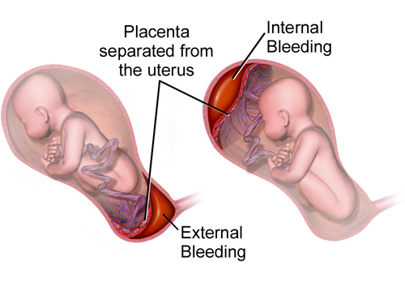
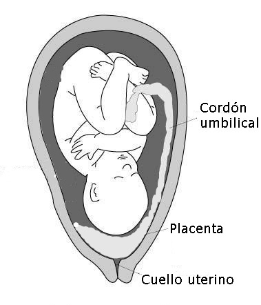

# HEMORRAGIA DA SEGUNDA METADE

Para entender as hemorragias da segunda metade da gestação, você precisa primeiro organizar sua mente. Imagine que você está no plantão e chega uma gestante sangrando. O relógio está correndo. Você não tem tempo de ler um tratado de obstetrícia. Você precisa de um diagnóstico diferencial rápido e preciso.

Tradicionalmente, definimos as hemorragias da segunda metade como aquelas que ocorrem após a 20ª ou 22ª semana de gestação. O grande desafio aqui é que, ao contrário do primeiro trimestre, onde o foco é muitas vezes a viabilidade embrionária, aqui temos dois pacientes em risco crítico: a mãe, que pode chocar em minutos, e o feto, que depende inteiramente da integridade placentária para sobreviver.

As três grandes causas que você deve ter na ponta da língua são: Descolamento Prematuro de Placenta (DPP), Placenta Prévia (PP) e Rotura Uterina. Correndo por fora, mas caindo muito em prova, temos a Vasa Prévia e a Rotura de Seio Marginal. Vamos dissecar cada uma delas com o olhar de quem quer que você acerte a questão e salve a paciente.

*Figura 1 - Ilustração do descolamento prematuro de placenta (DPP) mostrando a separação da placenta da parede uterina com formação de hematoma retroplacentário. Fonte: BruceBlaus, CC BY 3.0 | Wikimedia Commons*

## Descolamento Prematuro de Placenta (DPP)

O DPP é o "vilão" das provas de residência. É a separação da placenta da parede uterina antes do nascimento do feto. Por que isso é tão grave? Porque a placenta é o pulmão do feto. Se ela descola, o feto para de "respirar". Além disso, o útero vira uma fonte de hemorragia maciça.

### Fisiopatologia e Fatores de Risco

O mecanismo básico é a ruptura de vasos maternos na decídua basal. O sangue se acumula, forma um hematoma e separa a placenta do útero.

O principal fator de risco, e isso despenca em prova, é a **Hipertensão** (seja pré-eclâmpsia ou hipertensão crônica). Cerca de 50% dos casos de DPP grave estão associados a estados hipertensivos.

Outros fatores cruciais:

- Trauma abdominal (acidentes automobilísticos, violência doméstica).

- Tabagismo e uso de cocaína (causam vasoconstrição e lesão vascular).

- Idade materna avançada e multiparidade.

- RPMO (Ruptura Prematura de Membranas Ovulares) com descompressão súbita do útero (ex: polidrâmnio que rompe rápido).

- Trombofilias (como o Fator V de Leiden).

### Quadro Clínico: O Diagnóstico é Clínico!

Se a prova te der um ultrassom (USG) normal, não descarte DPP. O USG tem baixa sensibilidade para DPP (cerca de 25 a 50%). O diagnóstico é baseado na tríade clássica:

- **Dor abdominal súbita e intensa:** O útero dói porque o sangue está infiltrando o miométrio.

- **Sangramento vaginal escuro:** Em 80% dos casos. Em 20%, o sangramento é **oculto** (o sangue fica retido atrás da placenta).

- **Hipertonia uterina (Útero lenhoso):** O útero não relaxa. Ao palpar, ele parece uma tábua.

Além disso, você encontrará sofrimento fetal agudo (bradicardia ou centralização) e, em casos graves, instabilidade hemodinâmica materna. Como diz o Dr. Will, "se o útero está duro e a paciente está com dor, o diagnóstico é DPP até que se prove o contrário".

### Classificação de Sher

As bancas adoram a classificação de Sher para graduar a gravidade:

- **Grau 1:** Diagnóstico retrospectivo (visto no pós-parto). Mãe e feto bem.

- **Grau 2:** Feto vivo, mas com sinais de sofrimento. Hipertonia uterina presente.

- **Grau 3:** Óbito fetal.

- **3A:** Sem coagulopatia.

- **3B:** Com coagulopatia (CIVD).

### Conduta no DPP: O tempo é útero (e vida)

A conduta depende de dois fatores: viabilidade fetal e estabilidade materna.

- **Feto Vivo e Viável:** A conduta é a via de parto mais rápida. Na imensa maioria das vezes, isso significa **Cesariana de Emergência**.

- *Exceção:* Se o parto vaginal for iminente (expulsivo), você pode tentar o parto vaginal, mas isso é raro em prova.

- **Feto Morto:** Aqui o objetivo é salvar a mãe. Se a mãe estiver estável, preferimos o **Parto Vaginal**. Por quê? Porque uma cesariana em uma paciente com risco de coagulopatia é um convite ao sangramento incontrolável.

- *Atenção:* Mesmo no feto morto, se a mãe estiver instável ou o parto vaginal demorar (previsão > 6h), a cesariana pode ser necessária após estabilização.

**A Amniotomia é obrigatória no DPP?** Sim! Assim que você diagnostica o DPP e decide a conduta, você deve romper a bolsa. Por que fazemos isso?

- Reduz a pressão intrauterina (melhora a perfusão placentária do que restou).

- Diminui a infiltração de tromboplastina na circulação materna (reduz risco de CIVD).

- Acelera o trabalho de parto.

### Complicações do DPP

A mais famosa é o **Útero de Couvelaire** (Apoplexia Uteroplacentária). O sangue infiltra tanto o miométrio que as fibras musculares perdem a capacidade de contrair. O útero fica arroxeado/azulado. No pós-parto, isso gera atonia uterina grave.
Tratamento do Couvelaire: Massagem, ocitocina, misoprostol, sutura de B-Lynch e, em último caso, histerectomia.

Outra complicação grave é a **CIVD** (Coagulação Intravascular Disseminada). O descolamento libera fatores teciduais que consomem os fatores de coagulação da mãe. Se o sangue da paciente não coagula no tubo de ensaio (Teste de Weiner), você está diante de uma CIVD.

*Figura 2 - Ilustração dos tipos de inserção placentária baixa e placenta prévia, mostrando as diferentes relações entre a placenta e o orifício cervical interno. Fonte: Sigrid de Rooij/Bobjgalindo, CC BY 3.0 | Wikimedia Commons*

## Placenta Prévia (PP)

Diferente do DPP, a Placenta Prévia é uma doença de "instalação lenta". É a placenta que resolveu se implantar no segmento inferior do útero, cobrindo ou ficando muito perto do orifício interno do colo (OIC).

### Classificação Atual (FEBRASGO)

Esqueça aquelas classificações antigas de "parcial, marginal, total". Hoje, simplificamos para facilitar a conduta:

- **Placenta Prévia:** Cobre o orifício interno do colo.

- **Placenta de Inserção Baixa:** A borda da placenta está a menos de 2 cm do orifício interno, mas não o cobre.

### Fatores de Risco

O principal é a **Cicatriz Uterina Prévia** (Cesarianas anteriores ou curetagens). O ovo busca um lugar vascularizado para se implantar; se o fundo do útero está "esburacado" por cicatrizes, ele desce para o segmento inferior.
Outros: Tabagismo, gemelaridade (placenta maior), idade avançada e multiparidade.

### Quadro Clínico: O "P" de Placenta Prévia

Lembre-se dos "Ps" da Placenta Prévia para não confundir com DPP:

- **P**ainless (Indolor).

- **P**ure red (Vermelho rutilante/vivo).

- **P**redictable (Episódios recorrentes que pioram com o tempo).

- **P**ost-20 weeks (Segunda metade).

- **P**alpation normal (Útero normotônico, feto geralmente em situação anômala).

Dica de ouro: **NUNCA faça toque vaginal** em uma gestante com sangramento na segunda metade sem antes saber onde está a placenta. Se você tocar uma placenta prévia, pode causar uma hemorragia fatal. O diagnóstico é confirmado pelo **Ultrassom Transvaginal** (sim, é seguro e mais preciso que o abdominal).

### Conduta na Placenta Prévia

Aqui, a pressa depende do sangramento, não necessariamente do feto (diferente do DPP).

- **Sangramento Intenso/Instabilidade:** Interrupção imediata (Cesariana), independente da idade gestacional.

- **Estável e Pré-termo (< 37 semanas):** Conduta conservadora. Internação, repouso, corticoides para maturidade pulmonar e vigilância. O objetivo é chegar perto das 36-37 semanas.

- **Estável a Termo:** Interrupção.

- Se for PP (cobrindo o colo): Cesariana.

- Se for Inserção Baixa (> 10mm do colo): Pode-se tentar parto vaginal, mas com cautela extrema.

### Complicação Temida: Acretismo Placentário

Se a paciente tem cesárea prévia e placenta prévia, você DEVE investigar acretismo. É quando a placenta "gruda" demais no útero, podendo invadir o miométrio (acreta), a serosa (increta) ou órgãos vizinhos como a bexiga (percreta). Isso é uma emergência cirúrgica que muitas vezes termina em histerectomia.

## Tabela Comparativa: DPP vs. Placenta Prévia

| Característica | Descolamento Prematuro (DPP) | Placenta Prévia (PP) |
| --- | --- | --- |
| **Início** | Súbito | Gradual |
| **Dor Abdominal** | Intensa / Contínua | Ausente (Indolor) |
| **Tipo de Sangue** | Escuro (com coágulos) | Vermelho Rutilante (Vivo) |
| **Tônus Uterino** | Hipertonia (Útero de madeira) | Normotonia (Útero relaxado) |
| **Sofrimento Fetal** | Frequente e precoce | Raro (só se houver choque) |
| **Fator de Risco** | Hipertensão, Trauma, Cocaína | Cicatriz prévia, Idade |
| **Diagnóstico** | Clínico | Ultrassonográfico |
| **Toque Vaginal** | Pode ser feito (se necessário) | **PROIBIDO** |

## Rotura Uterina

A rotura uterina é um evento catastrófico. Ocorre mais comumente durante o trabalho de parto em pacientes com cicatrizes uterinas (cesáreas anteriores).

### Sinais de Iminência (Síndrome de Bandl-Frommel)

A prova vai descrever um trabalho de parto que não progride, com muita dor.

- **Sinal de Bandl:** Um anel se forma separando o corpo do segmento inferior do útero (útero em "ampulheta").

- **Sinal de Frommel:** Os ligamentos redondos ficam tensos e palpáveis (parecem cordas de violão).

### Sinais de Rotura Consumada

Quando o útero rompe, a dor pode ter um alívio súbito seguido de uma dor peritoneal intensa.

- **Sinal de Clark:** Enfisema subcutâneo (crepitação à palpação abdominal).

- **Sinal de Reasens:** Subida da apresentação fetal (o bebê estava "encaixado" e agora subiu porque saiu do útero para a cavidade abdominal).

- **Sinal de Laffont:** Dor referida no ombro (irritação do nervo frênico pelo sangue no abdome).

**Conduta:** Laparotomia imediata. Se o útero tiver condições, faz-se a sutura (colorrafia). Se o dano for extenso ou houver sangramento incontrolável, histerectomia.

## Vasa Prévia

Este é o diagnóstico "cult" das provas. É raro, mas a mortalidade fetal é de quase 100% se não diagnosticado. Ocorre quando vasos fetais (desprotegidos por cordão ou placenta) passam sobre o orifício interno do colo, abaixo da apresentação.

**O cenário clássico de prova:**
A gestante está em trabalho de parto, as membranas rompem (amniotomia ou espontânea) e, IMEDIATAMENTE, ocorre um sangramento vermelho vivo seguido de uma bradicardia fetal fulminante.
Por que isso acontece? Porque o sangue que está saindo é **sangue do feto**. O feto tem pouco volume; perder 100ml para ele é um choque hipovolêmico fatal.

**Fatores de risco:** Inserção velamentosa do cordão, placenta sucenturiada (um lobo extra da placenta).
**Conduta:** Se diagnosticado no pré-natal (Doppler), cesariana eletiva com 34-36 semanas. Se ocorrer durante o parto, cesariana de extrema urgência (embora o prognóstico fetal seja ruim).

## Rotura de Seio Marginal

É o diagnóstico de exclusão. A placenta está no lugar certo (não é prévia) e não há hipertonia ou sofrimento fetal (não é DPP). É um sangramento indolor, vermelho vivo, geralmente periparto.
O diagnóstico é retrospectivo, pela visualização de um coágulo na borda da placenta. A conduta é expectante na maioria das vezes, pois o sangramento costuma ser autolimitado e não afeta o feto.

## Manejo da Estabilização Hemorrágica

Em qualquer hemorragia grave, você segue o protocolo de choque:

- **Acesso Venoso:** Dois acessos calibrosos (Jelco 14 ou 16).

- **Cristaloides:** Ringer Lactato ou Soro Fisiológico (cuidado para não hemodiluir demais).

- **Hemotransfusão:** Se instabilidade persistente. Considere o protocolo de transfusão maciça (1:1:1 - Concentrado de hemácias, plasma e plaquetas).

- **Ácido Tranexâmico:** Segundo o estudo WOMAN, deve ser feito o mais rápido possível (preferencialmente nas primeiras 3 horas) em casos de hemorragia pós-parto, mas sua lógica se estende para o controle de sangramentos graves periparto.

No MedEvo, sempre reforçamos: em obstetrícia, a volemia da gestante é aumentada. Quando ela começa a mostrar sinais de choque (taquicardia, hipotensão), ela já perdeu cerca de 30% do volume sanguíneo. Não espere a pressão cair para agir!

## Situações Especiais e Pegadinhas

### Óbito Fetal e Coagulação

Se o feto morre e fica retido (como no DPP Grau 3), há risco de liberação de tromboplastina. Se a mãe estiver estável, você pode aguardar o parto vaginal, mas deve monitorar o fibrinogênio e o coagulograma semanalmente. Se o fibrinogênio cair abaixo de 150-200 mg/dL, a intervenção é necessária.

### Aloimunização Rh

Toda gestante Rh negativo com sangramento na segunda metade DEVE receber a Imunoglobulina Anti-D (300 mcg) para prevenir a sensibilização, a menos que o pai seja comprovadamente Rh negativo ou a paciente já esteja sensibilizada (Coombs Indireto positivo). A dose padrão protege contra até 30 mL de sangue fetal na circulação materna.

### Trauma na Gestante

Lembre-se da prioridade: estabilizar a mãe primeiro. O útero gravídico comprime a veia cava inferior quando a paciente está em decúbito dorsal, reduzindo o retorno venoso. Sempre desloque o útero para a esquerda ou incline a prancha em 15-30 graus durante a reanimação. Se houver trauma torácico com sinais de pneumotórax hipertensivo, a descompressão torácica é imediata.

## Pontos-Chave para Prova

- **DPP:** Diagnóstico clínico. Hipertonia + Dor + Sangramento escuro. Principal causa: Hipertensão.

- **Amniotomia no DPP:** Sempre indicada para reduzir pressão e acelerar o parto.

- **Placenta Prévia:** Indolor + Vermelho vivo + Recurrente. Toque vaginal é **contraindicação absoluta**.

- **USG na PP:** O transvaginal é o padrão-ouro e é seguro.

- **Vasa Prévia:** Sangramento imediato após rotura de membranas + Sofrimento fetal agudo.

- **Rotura Uterina:** Sinais de Bandl (anel) e Frommel (ligamentos) indicam iminência. Sinal de Reasens (subida da apresentação) indica rotura consumada.

- **Útero de Couvelaire:** Complicação do DPP por infiltração hemática. Causa atonia uterina no pós-parto.

- **Sher 3B:** DPP com óbito fetal e coagulopatia (CIVD).

- **Via de parto no DPP com feto vivo:** Cesariana de emergência (regra geral).

- **Via de parto no DPP com feto morto:** Preferencialmente vaginal, se estabilidade materna.

- **Fator de risco para Acretismo:** Placenta prévia sobre cicatriz de cesárea anterior.

- **Dose Anti-D:** 10 mcg para cada 1 mL de sangue fetal (ou 300 mcg dose padrão).

- **Sinal de Laffont:** Dor no ombro por hemoperitônio (comum na rotura uterina ou ectópica rota).

- **Sinal de Clark:** Crepitação abdominal (enfisema) na rotura uterina.

- **Conduta na PP estável e pré-termo:** Conservadora (corticoides, repouso, vigilância).

- **Causa mais comum de CIVD na obstetrícia:** Descolamento Prematuro de Placenta.

- **O que NÃO fazer na suspeita de PP:** Toque vaginal ou esforço físico.

- **Meta de Fibrinogênio na hemorragia:** Manter acima de 200 mg/dL. 💡

 Cópia offline para consulta pessoal.
 Fonte original:
 [https://www.medevo.com.br/material-apoio/ler/c772ae2d-e4aa-42d7-a75a-e5128e5b19c3](https://www.medevo.com.br/material-apoio/ler/c772ae2d-e4aa-42d7-a75a-e5128e5b19c3)
