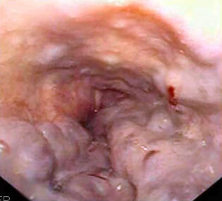

# HEMORRAGIA DIGESTIVA ALTA

A Hemorragia Digestiva Alta (HDA) é definida como o sangramento que ocorre acima do ângulo de Treitz (flexura duodenojejunal). Para a sua prova de residência, entenda que o divisor de águas aqui não é apenas a anatomia, mas a conduta. O manejo muda drasticamente se o sangramento for de origem varicosa (hipertensão portal) ou não varicosa (úlcera péptica, principalmente).

*Figura 1 - Endoscopia digestiva alta mostrando úlcera gástrica com vaso visível, principal causa de hemorragia digestiva alta não varicosa. Fonte: Samir, CC BY-SA 3.0 | Wikimedia Commons*

## Abordagem Inicial e Estabilização Hemodinâmica

Antes de pensar em endoscopia, você precisa manter o paciente vivo. O erro mais comum em questões de prova é o examinador colocar um paciente chocado e a primeira alternativa ser "solicitar endoscopia digestiva alta (EDA) imediata". Errado.

O manejo inicial segue a lógica do "ABC":

- **A (Vias Aéreas):** Proteção de via aérea se houver hematêmese maciça ou rebaixamento do nível de consciência. O risco de broncoaspiração é real e fatal.

- **B (Respiração):** Suplementação de oxigênio se necessário.

- **C (Circulação):** Dois acessos venosos periféricos de grosso calibre (calibre 14 ou 16). Esqueça o acesso central na emergência; o fluxo é maior em cateteres curtos e calibrosos (Lei de Poiseuille).

### A Meta da Ressuscitação Volêmica

Aqui entra uma "pérola" que o Dr. Will sempre enfatiza: a estratégia deve ser **restritiva**. Em pacientes com HDA, transfundir demais aumenta a pressão portal e pode piorar o sangramento, especialmente se for varicoso.

- **Cristaloides:** Use com parcimônia para manter estabilidade hemodinâmica.

- **Transfusão de Hemácias:** A meta de Hemoglobina (Hb) para a maioria dos pacientes é entre **7 e 9 g/dL**.

- **Exceção:** Pacientes com comorbidades cardiovasculares graves (ex: insuficiência coronariana ativa) podem precisar de metas mais altas (Hb > 9 g/dL).

**Cuidado:** O hematócrito e a hemoglobina iniciais podem não refletir a real perda sanguínea em um sangramento agudo, pois a hemodiluição leva tempo para ocorrer. Não espere a Hb cair para começar a ressuscitação se o paciente tiver sinais de choque (hipotensão postural é o sinal mais sensível de hipovolemia precoce).

## Estratificação de Risco

Nem todo paciente com HDA precisa ficar internado. As bancas adoram cobrar o **Escore de Glasgow-Blatchford**. Ele é usado *antes* da endoscopia para decidir quem pode ser manejado ambulatorialmente.

| Parâmetro | Escore de Glasgow-Blatchford |
| --- | --- |
| **Ureia, Hb, PAS** | Pontua conforme o nível de alteração |
| **Outros** | FC ≥ 100, Melena, Síncope, Doença Hepática ou Cardíaca |

**Dica de Prova:** Se o escore for **0**, o risco de intervenção ou morte é baixíssimo. Esse paciente pode receber alta com segurança para investigação ambulatorial. Se for ≥ 1, internação e EDA.

## Hemorragia Digestiva Alta Não Varicosa

A causa mais comum de HDA no mundo (cerca de 50% dos casos) é a **Úlcera Péptica**. O uso de AINEs, AAS e a infecção pelo *H. pylori* são os principais vilões.

### Classificação de Forrest

Se você vai decorar uma única tabela para a prova de Gastroenterologia, que seja esta. Ela estratifica o risco de ressangramento e dita a conduta endoscópica.

| Forrest | Aspecto da Úlcera | Risco de Ressangramento | Conduta Endoscópica |
| --- | --- | --- | --- |
| **Ia** | Sangramento arterial em jato | Altíssimo (até 90%) | Tratamento Obrigatório |
| **Ib** | Sangramento em porejamento (babação) | Alto (até 30%) | Tratamento Obrigatório |
| **IIa** | Vaso visível não sangrante | Alto (até 50%) | Tratamento Obrigatório |
| **IIb** | Coágulo aderido | Intermediário (20-30%) | Considerar remoção/tratamento |
| **IIc** | Hematina na base (fundo negro) | Baixo (< 10%) | Não tratar (apenas IBP) |
| **III** | Base clara (limpa) | Muito baixo (< 5%) | Não tratar (apenas IBP) |

**Por que tratamos o Forrest IIa?** Porque aquele vaso visível é uma sentinela. Ele não está sangrando agora, mas a chance de ele "abrir o bico" nas próximas horas é enorme.

**O que é o tratamento endoscópico duplo?** Em úlceras de alto risco (Ia a IIb), a recomendação é combinar dois métodos: geralmente injeção de adrenalina (para causar vasoconstrição e tamponamento) + um método térmico (eletrocoagulação) ou mecânico (clipe). **Nunca use adrenalina isoladamente**, pois ela reduz o sangramento temporariamente mas não previne o ressangramento definitivo.

### Terapia Farmacológica na Úlcera

O Inibidor de Bomba de Prótons (IBP) é obrigatório. O pH gástrico acima de 6.0 é essencial para a estabilidade do coágulo e agregação plaquetária.

- **Dose:** Omeprazol 80mg em bólus seguido de infusão contínua (8mg/h) por 72 horas (em casos de alto risco). Atualmente, doses intermitentes (ex: 40mg 12/12h) também são aceitas por algumas diretrizes, mas o bólus inicial em provas ainda é muito cobrado.

### Quando a Cirurgia é Indicada?

Hoje a cirurgia é a exceção. Indicamos quando:

- Falha do tratamento endoscópico (geralmente após duas tentativas).

- Hemorragia maciça com choque refratário.

- Úlceras gigantes (> 2-3 cm) que têm maior chance de falha endoscópica.

- Sangramento recorrente que ameaça a vida.

**Anatomia na Prova:** Se a úlcera for na parede posterior do bulbo duodenal, o vaso culpado é a **artéria gastroduodenal**. Se for na pequena curvatura gástrica, é a **artéria gástrica esquerda**.

## Hemorragia Digestiva Alta Varicosa

Aqui o cenário muda. O paciente geralmente é cirrótico e o sangramento é dramático. A mortalidade é muito superior à da úlcera péptica.

### O Manejo "Tríade" do Sangramento Varicoso

Se o paciente tem cirrose ou suspeita de hipertensão portal e chega sangrando, você deve iniciar três coisas IMEDIATAMENTE (antes da EDA):

- **Drogas Vasoativas Esplâncnicas:** Terlipressina (primeira escolha por reduzir mortalidade), Octreotide ou Somatostatina. Elas causam vasoconstrição da artéria mesentérica, reduzindo o fluxo para o sistema porta e, consequentemente, a pressão dentro das varizes.

- **Antibioticoprofilaxia:** Todo cirrótico que sangra deve receber ATB. Por quê? Porque o sangramento predispõe à translocação bacteriana e Peritonite Bacteriana Espontânea (PBE). O ATB reduz ressangramento e mortalidade.

- **Escolha:** Ceftriaxone 1g/dia (especialmente em Child B e C) ou Norfloxacino 400mg 12/12h.

- **Endoscopia Digestiva Alta:** Deve ser feita preferencialmente nas primeiras 12 horas. O tratamento de escolha é a **Ligadura Elástica**. A escleroterapia é reservada para quando a ligadura é tecnicamente impossível.

### E se o sangramento não parar?

Se a terapia medicamentosa + endoscopia falharem:

- **Balão de Sengstaken-Blakemore:** É uma medida de **ponte**. Não pode ficar mais de 24h pelo risco de necrose esofágica. Serve para estabilizar o paciente até o tratamento definitivo.

- **TIPS (Shunt Portossistêmico Intra-hepático Transjugular):** É a comunicação entre a veia hepática e a veia porta. Reduz a pressão portal drasticamente. Indicado em sangramentos refratários ou como "TIPS precoce" em pacientes de altíssimo risco (Child C ou Child B com sangramento ativo).

### Profilaxia de Varizes (O que cai muito!)

- **Primária (nunca sangrou):**

- Varizes pequenas com "red spots" (sinais vermelhos) ou em pacientes Child B/C: Betabloqueador (Propranolol/Nadolol) OU Ligadura.

- Varizes médias/grandes: Betabloqueador OU Ligadura.

- **Secundária (já sangrou):**

- **Combinação Obrigatória:** Betabloqueador + Ligadura Elástica.

**Erro clássico:** Nunca use betabloqueador na fase AGUDA do sangramento. Ele impede a resposta taquicárdica compensatória ao choque. Ele entra apenas após a estabilização (geralmente após o 6º dia).

## Outras Causas Importantes (As "Pegadinhas" de Prova)

### Laceração de Mallory-Weiss

É uma laceração longitudinal da mucosa na junção esofagogástrica após vômitos vigorosos ou tosse intensa. Comum em etilistas e gestantes.

- **Quadro:** Vômitos alimentares seguidos de hematêmese.

- **Conduta:** Na maioria das vezes (80-90%), o sangramento para espontaneamente. O tratamento é suporte e IBP. EDA se o sangramento persistir.

### Lesão de Dieulafoy

Uma arteríola submucosa de calibre persistente que erode a mucosa.

- **Localização clássica:** Pequena curvatura gástrica, perto da cárdia.

- **Característica:** Sangramento arterial maciço, intermitente, em um paciente sem história de dispepsia ou cirrose. A EDA pode ser normal se o vaso não estiver sangrando no momento.

### Síndrome de Boerhaave

Não é apenas uma laceração, é a **ruptura transmural** do esôfago.

- **Tríade de Mackler:** Vômitos, dor torácica retroesternal e enfisema subcutâneo.

- **Diagnóstico:** Esofagograma com contraste hidrossolúvel ou TC de tórax. É uma emergência cirúrgica!

### Hemobilia

Sangramento através das vias biliares para o duodeno.

- **Tríade de Sandblom:** Dor em hipocôndrio direito, icterícia e hemorragia digestiva.

- **Causa:** Geralmente trauma hepático (mesmo que ocorrido semanas antes) ou procedimentos biliares (CPRE, biópsia hepática).

### Ectasia Vascular Antral Gástrica (GAVE)

Também conhecida como "Estômago em Melancia". São estrias avermelhadas no antro gástrico. Comum em pacientes com cirrose ou doenças autoimunes (esclerodermia). Causa anemia ferropriva crônica por perda oculta.

*Figura 2 - Endoscopia digestiva alta mostrando varizes esofágicas com sinais de risco (red wale spots), indicando alto risco de sangramento por hipertensão portal. Fonte: Samir, Domínio Público | Wikimedia Commons*

## Diagnóstico Diferencial e Exames Complementares

Se o paciente tem hematêmese, a origem é alta. Mas e se ele tiver **hematoquezia** (sangue vivo pelo reto)?
No MedEvo, sempre ensinamos: hematoquezia com instabilidade hemodinâmica deve ser considerada HDA até que se prove o contrário. O trânsito intestinal acelerado pelo sangue (que é catártico) não dá tempo para a formação de melena.

**Passagem de Sonda Nasogástrica (SNG):** Não é mais obrigatória e nem prediz com 100% de certeza se o sangramento parou. Um aspirado limpo não exclui HDA (o sangramento pode ser duodenal e o piloro estar fechado). Use apenas se houver dúvida diagnóstica ou para limpar o estômago antes da EDA em sangramentos maciços.

| Condição | Dica de Ouro para a Questão |
| --- | --- |
| **Úlcera de Curling** | Paciente Grande Queimado |
| **Úlcera de Cushing** | Paciente com Trauma Cranioencefálico (TCE) ou tumor de SNC |
| **Fístula Aorto-Entérica** | Paciente com prótese de aorta abdominal e HDA sentinela |
| **Esôfago Negro** | Isquemia esofágica em pacientes críticos/chocados |

## Resumo de Condutas Farmacológicas

- **IBP (Omeprazol):** 80mg EV (bólus) + 8mg/h (infusão). Indicado para todos até que se defina a causa.

- **Terlipressina:** 2mg EV a cada 4 horas (nos primeiros 2 dias). Droga de escolha na HDA varicosa.

- **Ceftriaxone:** 1g EV 1x ao dia. Profilaxia de PBE no cirrótico que sangra.

- **Eritromicina (ou Metoclopramida):** Pode ser usada 30-60 min antes da EDA para esvaziamento gástrico (pró-cinético), melhorando a visualização do endoscopista.

## Pontos-Chave para Prova 💡

- **Estabilização primeiro:** Acesso calibroso e volume antes da endoscopia.

- **Transfusão restritiva:** Meta de Hb 7-9 g/dL para quase todos.

- **Forrest Ia, Ib e IIa:** Sempre exigem tratamento endoscópico (dupla terapia).

- **Forrest IIc e III:** Apenas IBP, sem intervenção endoscópica. Alta precoce se possível.

- **HDA Varicosa:** Tríade = Droga vasoativa + ATB profilático + Ligadura elástica.

- **Antibiótico no Cirrótico:** É obrigatório, mesmo que não haja ascite, para reduzir mortalidade e ressangramento.

- **Sinal de Jobert:** Desaparecimento da macicez hepática (pneumoperitônio). Se presente na HDA, indica úlcera perfurada (abdome agudo).

- **Dieulafoy:** Sangramento arterial em jato sem úlcera visível, geralmente perto da cárdia.

- **Mallory-Weiss:** Laceração de mucosa pós-vômitos; conduta é geralmente conservadora.

- **Betabloqueador na Cirrose:** Nunca inicie no sangramento agudo. É para profilaxia primária ou secundária (após estabilização).

- **Hematoquezia + Choque:** Pense em HDA maciça (sangue é irritante e acelera o trânsito).

- **TIPS:** Indicado na falha da endoscopia + drogas vasoativas no sangramento varicoso.

- **Úlcera Duodenal Posterior:** Sangra pela artéria gastroduodenal.

- **Úlcera Gástrica de Pequena Curvatura:** Sangra pela artéria gástrica esquerda.

- **Contraindicação Absoluta ao Betabloqueador:** Asma grave ou bloqueios atrioventriculares de alto grau.

- **Glasgow-Blatchford = 0:** Pode ir para casa e fazer EDA ambulatorial.

- **Principal causa de morte na HDA varicosa:** Infecção e falência múltipla de órgãos, não apenas o choque hipovolêmico.

 Cópia offline para consulta pessoal.
 Fonte original:
 [https://www.medevo.com.br/material-apoio/ler/2335a3fd-8cff-44ff-87a2-516f09fbeaff](https://www.medevo.com.br/material-apoio/ler/2335a3fd-8cff-44ff-87a2-516f09fbeaff)
