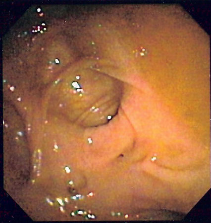
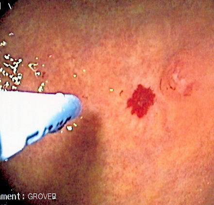

# HEMORRAGIA DIGESTIVA BAIXA: ABORDAGEM E ESTRATIFICAÇÃO

Para começar nosso estudo, você precisa entender que a Hemorragia Digestiva Baixa (HDB) mudou de definição nos últimos anos, mas para a sua prova de residência, ainda seguimos a divisão clássica baseada na anatomia. A HDB é aquela que ocorre **abaixo do ângulo de Treitz** (flexura duodenojejunal).

No entanto, aqui vai o primeiro "pulo do gato" que o Dr. Will sempre reforça: na prática clínica e nas questões mais modernas, dividimos o sangramento em três: Alto (acima do Treitz), Médio (intestino delgado) e Baixo (cólon e reto). Por que isso importa? Porque 95% das hemorragias que se originam abaixo do Treitz vêm do cólon. O intestino delgado é a "caixa preta" da gastroenterologia e responde por uma minoria dos casos.

*Figura 1 - Imagem endoscópica mostrando divertículos no cólon, principal causa de hemorragia digestiva baixa em adultos e idosos. Fonte: Samir, CC BY-SA 3.0 | Wikimedia Commons*

## Estabilização Inicial: O ABCDE que salva a prova

Antes de pensar em diagnóstico, você precisa estabilizar o paciente. Se a questão de prova te der um paciente com taquicardia, hipotensão ou alteração do nível de consciência, a resposta NUNCA será "solicitar colonoscopia". A resposta será **estabilização hemodinâmica**.

Por que fazemos isso? Porque a HDB maciça pode levar ao choque hipovolêmico rapidamente. O manejo inicial segue o protocolo de ressuscitação:

- **Acesso venoso:** Dois acessos periféricos de grosso calibre (14G ou 16G).

- **Reposição volêmica:** Cristaloides (Ringer Lactato ou Soro Fisiológico). Cuidado para não hiper-hidratar idosos com insuficiência cardíaca.

- **Avaliação de hemoderivados:** Se o paciente mantém instabilidade após 2L de cristaloide, ou se a hemoglobina (Hb) estiver abaixo de 7 g/dL (ou abaixo de 9 g/dL em cardiopatas), iniciamos a transfusão.

**Erro clássico de prova:** O aluno vê um sangramento vivo pelo ânus (hematoquezia) e já marca "colonoscopia". Lembre-se: em 10% a 15% dos casos de hematoquezia com instabilidade hemodinâmica, a fonte é, na verdade, uma **Hemorragia Digestiva Alta (HDA) maciça**. O sangue passa tão rápido pelo trato gastrointestinal que não sofre ação das bactérias (que o tornariam melena). Portanto, se o paciente está instável, a primeira conduta diagnóstica após estabilizar costuma ser uma Endoscopia Digestiva Alta (EDA) para excluir fonte alta.

## Diferenciando os Termos: Hematochezia, Enterorragia e Melena

Muitos alunos confundem a semiologia, e as bancas adoram isso.

- **Hematoquezia:** Sangue vivo ou rutilante que recobre as fezes ou aparece isolado. Sugere origem no cólon esquerdo, reto ou ânus.

- **Enterorragia:** Sangue vivo em grande quantidade, geralmente com coágulos, indicando um sangramento mais volumoso, podendo vir do cólon direito ou até de uma HDA maciça.

- **Melena:** Fezes pretas, em "borra de café", fétidas. Indica sangue digerido. Geralmente é HDA, mas pode ser intestino delgado ou cólon direito (se o trânsito for lento).

## Etiologia: Quem está sangrando?

A causa da HDB varia drasticamente com a idade. Se você ignorar a idade do paciente no enunciado, vai errar a questão.

### 1. Doença Diverticular dos Cólons (DDC)

É a causa **mais comum** de HDB maciça em adultos e idosos (> 60 anos).

- **O Porquê:** O divertículo é uma herniação da mucosa através da camada muscular, justamente onde os vasos retos penetram na parede colônica. Com o tempo, esse vaso reto fica exposto e "esticado" sobre a cúpula do divertículo, sofrendo erosão e rompimento.

- **A Pegadinha:** Embora os divertículos sejam mais comuns no cólon esquerdo (sigmoide), os divertículos que **mais sangram** são os do **cólon direito**. Além disso, a diverticulite (inflamação) raramente sangra de forma maciça. O sangramento diverticular costuma ser indolor e súbito.

### 2. Angiodisplasias

São malformações vasculares (ectasias) que ocorrem com o envelhecimento.

- **Localização:** Predominantemente no **cólon direito e ceco**.

- **Perfil:** Sangramento crônico, intermitente, muitas vezes causando anemia ferropriva em idosos.

- **Associação clássica (Síndrome de Heyde):** Angiodisplasia de cólon + Estenose Aórtica. A estenose aórtica consome o fator de von Willebrand, facilitando o sangramento dessas lesões.

### 3. Neoplasias Colorretais

Raramente causam hemorragia maciça. O quadro típico é de sangramento oculto, anemia crônica e alteração do hábito intestinal.

- **Dica de Prova:** Idoso com anemia ferropriva e dor abdominal inespecífica, cuja EDA é normal? A próxima conduta é **colonoscopia** para afastar câncer de cólon direito.

### 4. Colite Isquêmica

Ocorre geralmente em idosos com fatores de risco cardiovascular ou após episódios de hipotensão (ex: maratona, cirurgia cardíaca).

- **Fisiopatologia:** Ocorre hipofluxo nas "zonas de transição" vascular, como o **Ponto de Griffiths** (flexura esplênica - transição entre artéria mesentérica superior e inferior) e o **Ponto de Sudeck** (transição retossigmoide).

- **Quadro Clínico:** Dor abdominal súbita, geralmente em flanco esquerdo, seguida de diarreia sanguinolenta em 24h.

### 5. Causas Anorretais

São as causas mais comuns em pacientes **jovens (< 50 anos)**.

- **Hemorroidas:** Sangramento vivo, indolor, que ocorre ao final da evacuação (pinga no vaso ou suja o papel).

- **Fissura Anal:** Dor intensa ao evacuar ("parece que estou parindo um caco de vidro") associada a pouco sangue vivo no papel higiênico.

| Causa | Perfil do Paciente | Características do Sangramento |
| --- | --- | --- |
| **Diverticulose** | Idoso (>60 anos) | Maciço, indolor, para espontaneamente em 80% |
| **Angiodisplasia** | Idoso (>70 anos) | Intermitente, venoso, cólon direito |
| **Câncer de Cólon** | >50 anos | Crônico, oculto, perda de peso, anemia |
| **Colite Isquêmica** | Idoso vascular | Dor abdominal prévia + diarreia sanguinolenta |
| **Hemorroidas** | Qualquer idade | Sangue vivo no papel, sem dor (se não trombosada) |
| **Divertículo de Meckel** | Criança/Jovem | Sangramento indolor, volumoso (causa mais comum em <2 anos) |

## Exame Físico e Proctológico: Não pule etapas

Em uma prova de residência, se o examinador te der um caso de HDB e perguntar o próximo passo no exame físico, a resposta é **Toque Retal e Anoscopia**.
O toque retal pode identificar:

- Tumores retais baixos.

- Presença de melena ou hematoquezia (confirmando a queixa).

- Hemorroidas internas prolapsadas.

**Cuidado:** Hemorroidas internas não são palpáveis ao toque retal, a menos que estejam trombosadas ou muito prolapsadas. Para vê-las, precisamos da anoscopia.

## Estratificação de Risco

Nem todo paciente com HDB precisa ficar internado. A tendência moderna, defendida por diretrizes internacionais e cada vez mais cobrada no Brasil, é o uso de escores. O mais validado é o **Escore de Oakland**.

Ele avalia: Idade, sexo, internações prévias por HDB, frequência cardíaca, pressão arterial sistólica, hemoglobina e toque retal.

- **Pontuação ≤ 8:** Baixo risco. Pode-se considerar alta hospitalar com investigação ambulatorial rápida.

- **Pontuação > 8:** Internação hospitalar.

*Figura 2 - Imagem endoscópica de angiodisplasia colônica sendo tratada com coagulação por plasma de argônio (APC), uma das principais causas de HDB em idosos. Fonte: Samir, CC BY-SA 3.0 | Wikimedia Commons*

## Investigação Diagnóstica: A Ordem dos Fatores Altera o Produto

Aqui é onde a maioria dos alunos se perde. Vamos organizar o pensamento conforme a estabilidade do paciente.

### Paciente Estável

- **Colonoscopia:** É o exame de escolha. Deve ser realizada preferencialmente nas primeiras 24h após o preparo de cólon. Sim, mesmo sangrando, o paciente precisa tomar o preparo (manitol ou polietilenoglicol) via oral ou por sonda nasogástrica. O sangue é um péssimo contraste; sem limpar o cólon, o endoscopista não enxerga nada.

- **Angiotomografia (Angio-TC):** Ganhou muito espaço. É rápida, não invade e detecta sangramentos a partir de **0,3 a 0,5 mL/min**. É excelente para localizar o ponto do sangramento antes de uma angiografia ou cirurgia.

### Paciente Instável

- **Estabilização Hemodinâmica** (Sempre!).

- **Excluir HDA:** Passagem de sonda nasogástrica (se vier bile sem sangue, reduz chance de HDA, mas não exclui 100%) ou, preferencialmente, **EDA**.

- Se a EDA for negativa e o paciente continuar instável:

- **Arteriografia Mesentérica:** É diagnóstica e terapêutica (pode fazer embolização ou injetar vasopressina). Requer sangramento ativo de **0,5 a 1,0 mL/min**.

- **Cintilografia com Hemácias Marcadas:** É o exame mais sensível (detecta 0,1 mL/min), mas não localiza bem o ponto exato (mostra apenas a área) e não permite tratamento. Na prática de prova, serve para "sangramentos intermitentes de difícil localização".

**Erro Comum:** Achar que a colonoscopia é contraindicada na HDB. Pelo contrário, ela é o padrão-ouro. A contraindicação clássica da colonoscopia é na **Diverticulite Aguda** (fase inflamatória), pelo risco de perfuração. No sangramento diverticular (sem inflamação), ela pode ser feita após o preparo.

## Tratamento e Conduta

A maioria dos sangramentos de HDB (cerca de 80%) para espontaneamente apenas com repouso e suporte. Para os outros 20%, temos:

### Tratamento Endoscópico

Durante a colonoscopia, se o foco for achado, podemos usar:

- Injeção de adrenalina (hemostasia química).

- Eletrocoagulação ou Plasma de Argônio (especialmente para angiodisplasias e colite actínica).

- Clipes metálicos (excelentes para sangramento diverticular e pós-polipectomia).

### Tratamento Radiológico (Arteriografia)

Se a endoscopia falhar ou o paciente estiver instável demais para o preparo, a embolização superseletiva é uma excelente opção. O risco é a isquemia do segmento intestinal correspondente.

### Tratamento Cirúrgico

A cirurgia é o último recurso. As indicações são:

- Instabilidade hemodinâmica persistente apesar da ressuscitação agressiva.

- Falha das técnicas endoscópicas e radiológicas.

- Necessidade de transfusão de mais de 4-6 bolsas de sangue em 24h.

**A técnica:** Se o local do sangramento foi identificado (pela Angio-TC ou Arteriografia), faz-se a **colectomia segmentar**. Se o paciente está chocando e não sabemos onde sangra, a conduta é a **Colectomia Subtotal com ileoproctoanastomose**. Nunca faça uma colectomia "às cegas" baseada apenas em suposições, pois o risco de ressecar o lado errado e o paciente continuar sangrando é alto.

## Situações Especiais que Caem em Prova

### Divertículo de Meckel

Lembre-se dele em crianças ou adultos jovens com HDB maciça e indolor. É um remanescente do **ducto onfalomesentérico**. O diagnóstico é feito pela **Cintilografia com Pertecnetato** (que marca a mucosa gástrica ectópica presente no divertículo).

### Colite Actínica

Paciente com história de radioterapia prévia (geralmente para câncer de próstata ou colo de útero) que apresenta sangramento retal crônico. O tratamento de escolha é a aplicação de **Plasma de Argônio**.

### Sangramento Pós-Polipectomia

Pode ocorrer imediatamente ou até 2 semanas após o procedimento (sangramento tardio pela queda da escara). É uma das complicações mais comuns da colonoscopia, junto com a perfuração.

### Doença Inflamatória Intestinal (DII)

Retocolite Ulcerativa (RCU) causa diarreia sanguinolenta crônica com muco e tenesmo. Na fase aguda grave, pode haver HDB volumosa. O diagnóstico é clínico + colonoscopia com biópsia.

## Tabelas Comparativas para Fixação

### Tabela 1: Métodos de Imagem na HDB Ativa

| Método | Sensibilidade (Fluxo) | Vantagem | Desvantagem |
| --- | --- | --- | --- |
| **Angio-TC** | 0,3 - 0,5 mL/min | Rápida, disponível, localiza o ponto | Não é terapêutica, usa contraste iodado |
| **Arteriografia** | 0,5 - 1,0 mL/min | **Terapêutica** (Embolização) | Invasiva, risco de isquemia e lesão renal |
| **Cintilografia** | 0,1 mL/min | **Mais sensível** | Não localiza bem, não é terapêutica |

### Tabela 2: Classificação de Hemorroidas Internas (Goligher)

| Grau | Descrição | Conduta Inicial |
| --- | --- | --- |
| **I** | Sem prolapso, apenas sangramento | Dieta rica em fibras, higiene anal (sem papel) |
| **II** | Prolapso com redução espontânea | Fibras / Ligadura elástica se refratário |
| **III** | Prolapso que exige redução manual | Ligadura elástica ou Cirurgia |
| **IV** | Prolapso irredutível | **Cirurgia (Hemorroidectomia)** |

### Tabela 3: Diagnóstico Diferencial de Dor Abdominal e Sangramento

| Quadro Clínico | Principal Suspeita |
| --- | --- |
| Dor em FIE + Febre + Sem Sangramento Maciço | Diverticulite Aguda |
| Dor Abdominal Súbita + Sangue após 24h | Colite Isquêmica |
| Dor Anal Intensa ao evacuar + Sangue no papel | Fissura Anal |
| Indolor + Sangramento Maciço em Idoso | Diverticulose |
| Indolor + Sangramento Maciço em Criança | Divertículo de Meckel |

## O "Porquê" das Condutas: Entendendo a Lógica

Como o MedEvo sempre ensina, a medicina tem lógica. Por que usamos **fibra** na doença diverticular assintomática? Para aumentar o volume fecal e diminuir a pressão intraluminal, evitando a formação de novos divertículos. No entanto, na **Diverticulite Aguda**, fazemos o oposto: repouso intestinal (dieta líquida ou jejum) para não "atritar" a área inflamada.

Por que a **ligadura elástica** é contraindicada em imunodeprimidos? Porque o tecido necrosado pela ligadura pode se tornar um foco de sepse fulminante (gangrena de Fournier). Nesses pacientes, preferimos tratamentos mais conservadores ou cirurgia formal com cobertura antibiótica.

Por que a **colonoscopia** deve ser feita em 6 semanas após uma diverticulite? Para excluir câncer de cólon que pode ter sido "mascarado" pela inflamação na TC inicial. Nunca esqueça esse prazo; as bancas amam.

## Pontos-Chave para Prova

- **Causa mais comum de HDB maciça no idoso:** Doença Diverticular (Diverticulose).

- **Causa mais comum de HDB no jovem:** Doenças anorretais (Hemorroidas/Fissuras).

- **Local que mais sangra na diverticulose:** Cólon Direito.

- **Local mais comum de diverticulite:** Cólon Esquerdo (Sigmoide).

- **Primeira conduta no paciente instável:** Estabilização hemodinâmica (ABCDE).

- **HDB maciça + Instabilidade:** Sempre considerar HDA (fazer EDA).

- **Fluxo para Arteriografia:** 0,5 a 1,0 mL/min.

- **Fluxo para Cintilografia:** 0,1 mL/min (mais sensível).

- **Padrão-ouro para Diverticulite:** Tomografia de abdome com contraste (NUNCA colonoscopia ou enema na fase aguda).

- **Tríade da Fissura Anal Crônica:** Úlcera (fissura), Plicoma sentinela e Papila hipertrófica.

- **Colite Isquêmica:** Suspeitar em idoso com dor abdominal seguida de hematoquezia; áreas de Griffith e Sudeck são as mais afetadas.

- **Angiodisplasias:** Principal causa de sangramento obscuro (intestino delgado) no idoso.

- **Hemorroida Grau IV:** Prolapso permanente e irredutível; tratamento é cirúrgico.

- **Contraindicação Absoluta de Ligadura Elástica:** Pacientes imunocomprometidos ou com distúrbios de coagulação graves.

- **Cirurgia de Urgência na HDB:** Indicada se falha endoscópica/radiológica ou necessidade de > 6 bolsas de sangue.

- **Colectomia "às cegas":** Deve ser evitada; se necessária, prefere-se a Colectomia Subtotal. 🩺

 Cópia offline para consulta pessoal.
 Fonte original:
 [https://www.medevo.com.br/material-apoio/ler/ece43a7e-5f96-41df-b7aa-9b92b913d771](https://www.medevo.com.br/material-apoio/ler/ece43a7e-5f96-41df-b7aa-9b92b913d771)
