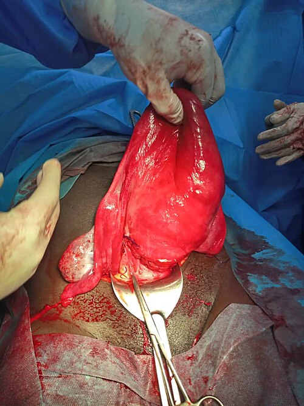
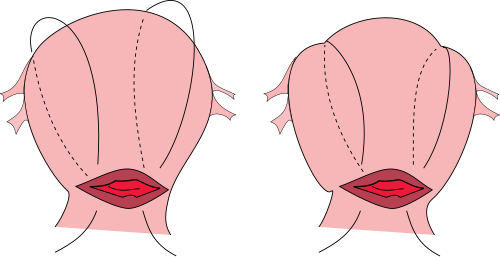

# HEMORRAGIA PÓS-PARTO

A Hemorragia Pós-parto (HPP) não é apenas um tema de prova, é a situação que vai testar sua calma no centro obstétrico. Para as bancas de residência, o foco mudou nos últimos anos. Se antes ficávamos presos apenas ao volume de sangue perdido, hoje o foco é a estabilidade hemodinâmica e a agilidade no diagnóstico.

No Brasil, a principal causa de morte materna ainda é a hipertensão (pré-eclâmpsia e eclâmpsia), mas a HPP ocupa o segundo lugar e é considerada a maior causa de morte materna evitável no mundo. Quando você encontrar uma questão sobre mortalidade materna, lembre-se: cerca de 80% dos óbitos são por causas obstétricas diretas, ou seja, complicações que poderiam ter sido manejadas.

*Figura 1 - Fotografia intraoperatória de um útero atônico sendo comprimido entre os dedos do cirurgião. A atonia uterina é a principal causa de hemorragia pós-parto, responsável por cerca de 70% dos casos. Fonte: Princess of Ara, CC BY-SA 4.0 | Wikimedia Commons*

## Definição e o Novo Olhar Clínico

Esqueça aquela ideia antiga de tentar adivinhar se caiu 450 ml ou 550 ml de sangue no chão. A definição clássica ainda cai em prova: perda sanguínea superior a 500 ml após parto vaginal ou superior a 1.000 ml após cesariana. No entanto, a definição mais moderna e prática, adotada pela FEBRASGO e pelo Ministério da Saúde, é: qualquer perda sanguínea que tenha o potencial de causar instabilidade hemodinâmica.

Por que essa mudança é importante? Porque a gestante tem uma adaptação fisiológica fantástica. Ela aumenta o volume plasmático em quase 50% durante a gestação. Isso significa que ela pode perder muito sangue antes de apresentar queda na pressão arterial. Quando a pressão cai, ela já está em choque grave.

Aqui entra o conceito do Índice de Choque (IC), um dado prático que deve ser calculado cedo. O IC é a divisão da Frequência Cardíaca (FC) pela Pressão Arterial Sistólica (PAS).

- **IC = FC / PAS**

- **Valor normal:** entre 0,7 e 0,9.

- **IC > 0,9:** Indica gravidade e necessidade de intervenção imediata, mesmo que a paciente pareça bem.

Se uma paciente tem FC de 100 e PAS de 100, o IC é 1,0. Ela está chocada, mesmo com uma pressão "normal" de 100 mmHg. Não espere a hipotensão para agir.

## A Etiologia e a Regra dos 4 Ts

Para organizar o raciocínio na hora do desespero (ou da prova), usamos a mnemônica dos 4 Ts. As bancas amam cobrar a frequência e os fatores de risco de cada um.

### 1. Tônus (Atonia Uterina)

É a causa mais comum, responsável por cerca de 70 a 80% dos casos de HPP. O útero é um músculo que precisa se contrair para "dar um nó" nos vasos sanguíneos onde a placenta estava inserida (as ligaduras vivas de Pinard). Se ele não contrai, o sangramento é massivo.

Os principais fatores de risco envolvem a sobredistensão uterina. Pense comigo: se o músculo esticou demais, ele terá dificuldade para voltar. Por isso, gestação gemelar, polidramnia e macrossomia fetal são campeões em provas. Outros fatores incluem o trabalho de parto prolongado (exaustão muscular), corioamnionite (infecção que impede a contração) e o uso de relaxantes uterinos, como o Sulfato de Magnésio.

**Cuidado:** O Sulfato de Magnésio é um tocolítico. Se a paciente estava usando para neuroproteção ou profilaxia de eclâmpsia, o risco de atonia aumenta drasticamente.

### 2. Trauma (Lacerações e Inversão)

Representa cerca de 20% dos casos. Aqui o útero costuma estar contraído e duro, mas a paciente continua sangrando. Se o útero está firme e há sangramento ativo, você DEVE revisar o canal de parto. Procure por lacerações de colo, vagina ou períneo.

Um evento grave aqui é a Inversão Uterina. Geralmente causada por uma tração excessiva do cordão umbilical antes da dequitação placentária (secundamento). O fundo do útero "entra" para dentro da cavidade, podendo até sair pela vulva. O diagnóstico é clínico: desaparecimento do globo de segurança de Pinard e uma massa palpável na vagina.

### 3. Tecido (Retenção Placentária)

Ocorre em cerca de 10% dos casos. Restos de placenta ou coágulos impedem que o útero se contraia completamente. Fatores de risco incluem cirurgias uterinas prévias e placenta de inserção anômala (acretismo). Se a placenta não sai em 30 minutos (ou 15 minutos com manejo ativo), suspeitamos de retenção.

### 4. Trombina (Coagulopatias)

É a causa mais rara (1%), mas pode ser a mais letal. Pode ser primária (como a Doença de Von Willebrand) ou secundária a eventos como o Descolamento Prematuro de Placenta (DPP), que consome fatores de coagulação e gera uma Coagulação Intravascular Disseminada (CIVD).

| T (Causa) | Frequência | Principal Fator de Risco | Achado no Exame Físico |
| --- | --- | --- | --- |
| **Tônus** | 70-80% | Sobredistensão (Gemelar, Macrossomia) | Útero amolecido, acima da cicatriz umbilical |
| **Trauma** | 20% | Parto instrumentado, lacerações | Útero contraído + sangramento ativo |
| **Tecido** | 10% | Cirurgia prévia, acretismo | Placenta incompleta ou demora na saída |
| **Trombina** | 1% | DPP, Pré-eclâmpsia grave | Sangue que não coagula, petéquias |

## Prevenção: O Manejo Ativo do Terceiro Período

Se você quer evitar a HPP, você deve fazer o manejo ativo do secundamento em TODAS as pacientes. Isso reduz o risco de hemorragia em 60%. Segundo a OMS e a FEBRASGO, os pilares são:

- **Ocitocina:** 10 UI, via Intramuscular (IM), logo após o desprendimento do ombro fetal ou nascimento. É a droga de escolha universal.

- **Tração controlada do cordão:** Realizada com a manobra de Brandt-Andrews (uma mão pressiona o útero para cima enquanto a outra traciona suavemente o cordão).

- **Massagem uterina:** Avaliar o tônus uterino a cada 15 minutos nas primeiras duas horas.

**Atenção em prova:** O clampeamento oportuno do cordão (esperar de 1 a 3 minutos) é recomendado para o bem do bebê, mas não aumenta o risco de HPP se o restante do manejo for feito corretamente.

*Figura 2 - Representação esquemática da sutura de B-Lynch (sutura de compressão uterina), técnica cirúrgica utilizada no manejo da atonia uterina refratária ao tratamento medicamentoso. Fonte: Niels Olson, CC BY-SA 3.0 | Wikimedia Commons*

## Manejo da Atonia Uterina: O Protocolo de Resgate

A paciente começou a sangrar e o útero está amolecido. O que fazer? O ponto operacional é que o tratamento deve ser simultâneo, não sequencial. Enquanto a equipe pede ajuda, já inicia massagem uterina, acessos venosos, reposição volêmica e medicação.

### Passo 1: Estabilização e Massagem

Inicie a Massagem Uterina Bimanual (Manobra de Hamilton). Uma mão vai por dentro da vagina fazendo pressão contra o fundo do útero, e a outra mão por fora, pelo abdome, comprime o útero contra a mão interna. Ao mesmo tempo, garanta dois acessos venosos calibrosos (Jelco 14 ou 16) e inicie a reposição volêmica com cristaloides aquecidos.

### Passo 2: Uterotônicos Farmacológicos

Aqui as bancas cobram as doses e as contraindicações. Siga esta ordem lógica:

- **Ocitocina:** 5 UI em bolus lento (pode causar hipotensão se for rápido demais) + 20-40 UI em soro para manutenção.

- **Metilergometrina (Ergotrate):** 0,2 mg IM. **CONTRAINDICAÇÃO ABSOLUTA:** Pacientes hipertensas ou com pré-eclâmpsia. Pode causar crise hipertensiva grave.

- **Misoprostol:** 800 a 1.000 mcg. A via retal é muito citada em provas por ter menos efeitos colaterais sistêmicos e ser rápida quando a paciente está sangrando por via vaginal.

- **Ácido Tranexâmico (Transamin):** 1g EV. Deve ser administrado nas primeiras 3 horas do sangramento. Ele não contrai o útero, ele impede a fibrinólise (ajuda a manter o coágulo que se formou).

### Passo 3: Medidas Não Cirúrgicas

Se as drogas falharem, o próximo passo é o Balão de Tamponamento Intrauterino (Balão de Bakri ou o artesanal de Condom). Ele exerce pressão interna contra as paredes do útero. Se o balão funcionar, ele fica por 12 a 24 horas. Se o sangramento continuar através do balão (teste do balão negativo), o destino é o centro cirúrgico.

### Passo 4: Manejo Cirúrgico

Começamos pelas técnicas conservadoras:

- **Suturas de Compressão (B-Lynch):** O útero é "embrulhado" com fios para ser mantido comprimido.

- **Desarterialização:** Ligadura das artérias uterinas e, se necessário, das artérias ilíacas internas (hipogástricas).

- **Histerectomia de Urgência:** É a última medida. Não espere a paciente entrar em CIVD para decidir pela histerectomia. Se nada funcionou, retire o útero para salvar a vida da mulher.

| Medicamento | Dose | Via | Contraindicação |
| --- | --- | --- | --- |
| **Ocitocina** | 5 UI (bolus lento) + 20-40 UI (infusão) | EV | Hipersensibilidade |
| **Metilergometrina** | 0,2 mg | IM | Hipertensão, Pré-eclâmpsia |
| **Misoprostol** | 800 - 1000 mcg | Retal / Oral | Poucas (evitar se asma grave) |
| **Ácido Tranexâmico** | 1 g | EV | Tromboembolismo ativo |

## Situações Especiais e Diagnósticos Diferenciais

### Inversão Uterina

Se você se deparar com um choque neurogênico (bradicardia e hipotensão) logo após o parto, pense em inversão uterina. O tratamento imediato é a Manobra de Johnson: reposicionamento manual do útero. Você empurra o fundo do útero de volta para o lugar com a palma da mão. Se não conseguir, pode ser necessário usar relaxantes uterinos (como halogenados ou nitroglicerina) para relaxar o anel de constrição e depois tentar novamente. Só depois de reposicionado é que você usa uterotônicos.

### Rotura Uterina

Mais comum em pacientes com cicatrizes uterinas prévias (cesáreas anteriores). O quadro clássico em prova é: dor abdominal súbita, interrupção das contrações, subida da apresentação fetal (o bebê "sobe" e fica difícil de palpar pelo toque) e sangramento vaginal. O tratamento é laparotomia imediata.

### Útero de Couvelaire (Apoplexia Uteroplacentária)

Ocorre no Descolamento Prematuro de Placenta (DPP). O sangue infiltra o miométrio, deixando o útero com aspecto arroxeado e sem capacidade de contração. Isso causa uma atonia uterina grave. O tratamento inicial é clínico, mas o risco de histerectomia é alto.

### Síndrome de Sheehan

É uma complicação tardia da HPP grave. Ocorre necrose isquêmica da hipófise devido ao choque hipovolêmico. A paciente evolui com pan-hipopituitarismo. O primeiro sinal clínico costuma ser a agalactia (ausência de leite) no puerpério imediato, seguido de amenorreia e sinais de hipotireoidismo/insuficiência adrenal.

## Reposição Volêmica e Manejo da Coagulopatia

A ressuscitação deve ser rápida, mas controlada. Em HPP, o erro não é apenas atrasar volume; também é insistir em cristaloide enquanto a paciente precisa de hemocomponentes. O objetivo inicial é ganhar perfusão sem diluir fatores de coagulação.

### Como calcular a reposição inicial com Ringer lactato

Use o **Ringer lactato aquecido** como cristaloide isotônico inicial quando houver instabilidade, enquanto a causa do sangramento é tratada e a equipe prepara hemoderivados se necessário.

O cálculo prático é por **bolus + reavaliação**, não por uma fórmula fixa única:

- **Comece com 250 a 500 mL de Ringer lactato aquecido em infusão rápida.**

- **Reavalie após cada bolus:** frequência cardíaca, pressão sistólica, índice de choque, perfusão periférica, nível de consciência, diurese e sangramento ativo.

- **Se a paciente continuar instável, repita bolus de 500 mL.**

- **Evite ultrapassar 1.500 mL na fase inicial** antes de reavaliar agressivamente a necessidade de hemotransfusão, controle cirúrgico/intervencionista ou protocolo de transfusão maciça.

Exemplo de prova: puérpera com HPP, FC 120 bpm e PAS 90 mmHg. O índice de choque é **120 / 90 = 1,33**, indicando gravidade. A conduta é iniciar dois acessos calibrosos, administrar **500 mL de Ringer lactato aquecido**, reavaliar, repetir até o limite inicial se necessário e, se mantiver instabilidade ou perda importante, acionar hemocomponentes. Em uma paciente de 70 kg, 1.500 mL corresponde a cerca de **21 mL/kg**, mas a decisão não deve depender só do peso: depende da resposta clínica e do sangramento em curso.

Guarde a lógica: **cristaloide compra tempo; hemocomponente corrige perda sanguínea importante e coagulopatia**.

A ressuscitação deve ser agressiva, mas equilibrada. O uso excessivo de cristaloide pode levar à tríade da morte: hipotermia, acidose e coagulopatia.

Se a paciente perdeu muito sangue (Choque Classe III ou IV), iniciamos o Protocolo de Transfusão Maciça. A meta é manter:

- Hemoglobina > 7-9 g/dL.

- Plaquetas > 50.000/mm³.

- Fibrinogênio > 150-200 mg/dL (o fibrinogênio é o primeiro fator a cair na hemorragia obstétrica).

- INR < 1,5.

Muitas questões de prova focam no hemograma inicial. Lembre-se: no sangramento agudo, o hematócrito e a hemoglobina demoram a cair porque houve perda de sangue total. O diagnóstico de choque é clínico (FC, PA, perfusão periférica, nível de consciência), não laboratorial.

## Pontos-Chave para Prova

- **Definição de Ouro:** Perda > 500ml (vaginal) ou > 1000ml (cesárea) OU qualquer perda com instabilidade hemodinâmica.

- **Índice de Choque:** FC / PAS. Se > 0,9, a situação é grave. É um preditor de necessidade de transfusão mais fiel que a pressão arterial isolada.

- **Atonia Uterina:** Causa mais comum (70-80%). Útero amolecido e acima da cicatriz umbilical.

- **Manejo Ativo do 3º Período:** Ocitocina 10 UI IM é a medida preventiva mais importante para todas as parturientes.

- **Sequência de Uterotônicos:** Ocitocina → Metilergometrina (se não for hipertensa) → Misoprostol.

- **Ácido Tranexâmico:** Deve ser feito em até 3 horas do início do sangramento em dose de 1g EV.

- **Contraindicação Absoluta:** Metilergometrina (Ergotrate) NUNCA deve ser usada em hipertensas ou cardiopatas.

- **Sulfato de Magnésio:** É fator de risco para atonia por ser relaxante muscular. Não deve ser usado no tratamento da HPP.

- **Inversão Uterina:** Manobra de Johnson imediata. Não espere para tentar reposicionar.

- **Laceração de Canal:** Suspeitar sempre que o útero estiver bem contraído, mas o sangramento persistir.

- **Morte Materna Tardia:** Ocorre entre 42 dias e 1 ano após o parto. HPP costuma causar morte materna direta e precoce.

- **Fibrinogênio:** É o melhor marcador laboratorial de gravidade na hemorragia obstétrica. Valores < 200 mg/dL indicam alto risco de evolução para CIVD.

- **Manobra de Hamilton:** É a compressão bimanual do útero, medida inicial fundamental na atonia.

- **Histerectomia:** Na HPP, a atonia uterina é a principal indicação de histerectomia puerperal de urgência.

- **Erros Comuns:** Esperar o resultado do hemograma para transfundir ou esperar a pressão cair para diagnosticar choque.

- **Atenção em prova:** A alternativa dirá que a primeira conduta na inversão uterina é ocitocina. Falso! Primeiro reposiciona (Johnson), depois contrai.

- **Acesso Venoso:** Sempre dois acessos calibrosos. O manejo da HPP exige volume e rapidez.

 Cópia offline para consulta pessoal.
 Fonte original:
 [https://www.medevo.com.br/material-apoio/ler/f83813a0-58ca-40ea-bcd3-6669bcffa8ec](https://www.medevo.com.br/material-apoio/ler/f83813a0-58ca-40ea-bcd3-6669bcffa8ec)
