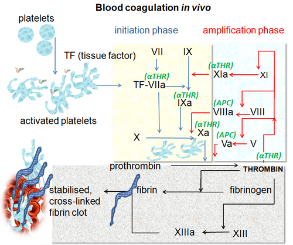
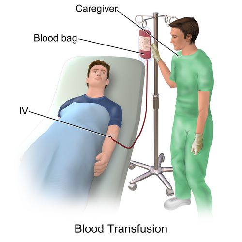

# HEMOSTASIA E HEMOTERAPIA NO PACIENTE CIRÚRGICO

## Fisiologia da Hemostasia: O que você realmente precisa saber

Para entender por que um paciente sangra ou por que prescrevemos determinado hemocomponente, você precisa visualizar a hemostasia como um processo dinâmico, e não como uma cascata estática de um livro de bioquímica.

O primeiro mecanismo que ocorre após uma lesão vascular é a **constrição vascular** (ou vasoconstrição). Isso é uma "pergunta de rodapé" que vira e mexe aparece em provas: qual o primeiro evento? É a contração do vaso para reduzir o fluxo sanguíneo local. Só depois disso é que as plaquetas e os fatores de coagulação entram em cena de forma robusta.

### Hemostasia Primária: O Tampão Plaquetário

Aqui o protagonista é a plaqueta. O processo envolve adesão, ativação e agregação.

- **Adesão:** A plaqueta gruda no colágeno subendotelial através do Fator de von Willebrand (FvW).

- **Ativação e Agregação:** As plaquetas mudam de forma e expõem receptores (como a GP IIb/IIIa) para se ligarem umas às outras via fibrinogênio.

**Dica de prova do Dr. Will:** Se o paciente usa AAS, ele tem uma inibição irreversível da ciclo-oxigenase plaquetária. Isso significa que aquela plaqueta específica está "inutilizada" para o resto da vida dela (7 a 10 dias). Em cirurgias de urgência, não adianta esperar; se houver risco de sangramento, a conduta é reservar ou transfundir plaquetas para repor a função.

*Figura 1 - Diagrama da cascata de coagulação in vivo, mostrando as vias intrínseca e extrínseca convergindo na via comum com formação de fibrina, processo fundamental para a hemostasia secundária. Fonte: Dr Graham Beards, CC BY-SA 3.0 | Wikimedia Commons*

### Hemostasia Secundária: A Cascata de Coagulação

Esqueça aquela decoreba infinita. Foque no que o laboratório te mostra:

- **Via Extrínseca (Avaliada pelo TP/RNI):** Envolve o Fator VII. É a via "rápida". O TP é o melhor exame para avaliar a função de síntese do fígado e o efeito dos anticoagulantes cumarínicos (Varfarina).

- **Via Intrínseca (Avaliada pelo TTPA):** Envolve os fatores VIII, IX, XI e XII. É aqui que a Heparina não fracionada atua.

- **Via Comum:** Onde as duas se encontram (Fatores X, V, II - Protrombina e I - Fibrinogênio).

### Hemostasia Terciária: Fibrinólise

O coágulo não pode ficar lá para sempre. A plasmina degrada a fibrina. Se esse processo for exagerado, temos a **hiperfibrinólise**. Guarde este nome, pois no trauma grave, o uso do Ácido Tranexâmico serve justamente para frear essa lise precoce do coágulo.

## Avaliação Pré-Operatória da Hemostasia

Muitos alunos erram ao achar que todo paciente precisa de um "coagulograma completo". A diretriz é clara: a **história clínica** é o melhor preditor de sangramento. Se o paciente extraiu um dente e não sangrou, ou se operou a amígdala sem intercorrências, o risco é baixo.

### Exames Laboratoriais: Quando pedir?

Pedimos para cirurgias de médio/grande porte ou se a história for positiva.

- **Plaquetas:** Valor normal é 150.000 a 450.000/mm³.

- **TP (Tempo de Protrombina):** Avalia via extrínseca.

- **TTPA (Tempo de Tromboplastina Parcial Ativada):** Avalia via intrínseca.

**Cuidado com a Insuficiência Renal Crônica (IRC):** Este é um cenário clássico de prova. O paciente com uremia tem plaquetas em número normal, mas elas **não funcionam direito**. A uremia causa disfunção da adesão e agregação plaquetária. Se esse paciente for operar e estiver sangrando, a conduta pode incluir Desmopressina (DDAVP), que estimula a liberação de FvW e Fator VIII.

### Manejo de Medicamentos no Perioperatório

Esta tabela resume o que as bancas mais cobram sobre a suspensão de fármacos:

| Medicamento | Conduta Padrão | Comentário do Professor |
| --- | --- | --- |
| **AAS (Prevenção Secundária)** | Manter na maioria das cirurgias | Suspender 7-10 dias apenas em neurocirurgia ou RTU de próstata |
| **Clopidogrel** | Suspender 5 dias antes | Alto risco de sangramento intraoperatório |
| **Varfarina** | Suspender 5 dias antes | Iniciar "ponte" com Heparina se alto risco trombótico (ex: prótese valvar mecânica) |
| **AINEs comuns** | Suspender 1 a 3 dias | Inibição reversível da plaqueta |
| **Novos Anticoagulantes (DOACs)** | Suspender 24-48h | Depende da função renal do paciente |

*Figura 2 - Ilustração do processo de transfusão sanguínea, mostrando a bolsa de hemocomponente conectada ao acesso venoso do paciente. A hemoterapia é componente essencial do manejo do paciente cirúrgico com coagulopatia. Fonte: BruceBlaus, CC BY 3.0 | Wikimedia Commons*

## Hemoterapia: Hemocomponentes e Gatilhos Transfusionais

Transfundir não é isento de riscos. Hoje, a tendência é a estratégia **restritiva**. No MedEvo, sempre reforçamos: trate o paciente, não o exame laboratorial.

### 1. Concentrado de Hemácias (CH)

- **Indicação:** Aumentar a capacidade de transporte de oxigênio.

- **Gatilho (Hb < 7 g/dL):** Para a maioria dos pacientes estáveis.

- **Gatilho (Hb < 10 g/dL):** Pode ser considerado em pacientes com doença cardiovascular grave ou sintomas claros de hipóxia (taquicardia, hipotensão, dispneia).

- **Rendimento:** 1 unidade de CH aumenta a Hb em cerca de 1 g/dL e o Hto em 3% em um adulto de 70kg.

### 2. Concentrado de Plaquetas

Aqui as bancas adoram números. Memorize:

- **Profilático (paciente estável):** Transfundir se < 10.000/mm³.

- **Profilático (com febre ou infecção):** Transfundir se < 20.000/mm³.

- **Cirurgias de grande porte:** Manter > 50.000/mm³.

- **Neurocirurgia ou Cirurgia Oftalmológica:** Manter > 100.000/mm³.

### 3. Plasma Fresco Congelado (PFC)

O PFC contém todos os fatores de coagulação.

- **Indicação:** Sangramento ativo com RNI > 1,5 ou antes de procedimentos invasivos se RNI > 1,5.

- **Erro comum:** Usar PFC para expansão volêmica. Isso é proibido e cai em prova como conduta errada.

- **Erro comum 2:** Achar que PFC reverte Heparina. Não reverte! Quem reverte Heparina é a **Protamina** (1mg para cada 100 UI de heparina).

### 4. Crioprecipitado

É o "concentrado do plasma". Rico em **Fibrinogênio**, Fator VIII e Fator de von Willebrand.

- **Indicação principal:** Hipofibrinogenemia (Fibrinogênio < 100 mg/dL) com sangramento ativo.

## Transfusão Maciça e Coagulopatia no Trauma

A **Transfusão Maciça (PTM)** é definida como a necessidade de > 10 unidades de CH em 24 horas ou > 4 unidades em 1 hora.

No trauma, enfrentamos a **Tríade Letal**: Hipotermia, Acidose e Coagulopatia. Se o paciente está hipotérmico, as enzimas da cascata de coagulação simplesmente não funcionam, não importa quanto fator você dê.

### Protocolo de Transfusão Maciça (Razão 1:1:1)

A tendência moderna é repor o sangue perdido de forma balanceada: 1 CH para 1 PFC para 1 Concentrado de Plaquetas. Isso evita a **trombocitopenia dilucional** e a diluição dos fatores de coagulação que ocorreria se usássemos apenas cristaloides e hemácias.

**Complicações da Transfusão Maciça:**

- **Hipocalcemia:** O citrato usado para conservar as bolsas de sangue se liga ao cálcio do paciente (quelante). Isso pode causar arritmias e piorar a coagulopatia.

- **Hipercalemia:** O sangue estocado sofre lise de hemácias, liberando potássio.

- **Hipotermia:** Sangue gelado vindo da geladeira piora a tríade letal.

## Reações Transfusionais: O Pesadelo do Cirurgião

Se o paciente começar a apresentar qualquer sintoma durante a transfusão, a primeira conduta é sempre a mesma: **INTERROMPER A TRANSFUSÃO IMEDIATAMENTE** e manter o acesso venoso com salina.

### Principais Reações Agudas

| Reação | Clínica Típica | Conduta |
| --- | --- | --- |
| **Hemolítica Aguda** | Febre, dor lombar, urina escura (hemoglobinúria), hipotensão | Parar, hidratar, checar tipagem, suporte intensivo |
| **Febril Não Hemolítica (RTFNH)** | Aumento de > 1°C na temperatura, calafrios | Parar, dar antitérmico (Petidina para calafrios) |
| **Alérgica/Urticariforme** | Prurido, placas eritematosas | Anti-histamínicos. Se leve, pode-se considerar reiniciar |
| **TRALI (Lesão Pulmonar)** | Edema pulmonar não cardiogênico, hipóxia súbita | Suporte ventilatório, oxigênio |
| **TACO (Sobrecarga Volêmica)** | Dispneia, estertores, turgência jugular, hipertensão | Diuréticos (Furosemida), oxigênio |

**Dica de Ouro:** Para prevenir a Doença do Enxerto Contra o Hospedeiro Transfusional (TR-GVHD) em pacientes imunossuprimidos, devemos usar hemocomponentes **irradiados**. Para prevenir a RTFNH em quem já teve várias reações, usamos hemocomponentes **leucodepletados**.

## Monitorização Viscoelástica: TEG e ROTEM

Em provas de residência mais modernas, o uso da Tromboelastografia (TEG) ou Tromboelastometria (ROTEM) tem caído com frequência. Eles avaliam a formação do coágulo em tempo real à beira do leito.

- **Tempo R (TEG) / CT (ROTEM):** Tempo para começar a formar o coágulo. Se prolongado → Falta fator de coagulação (dar PFC).

- **Ângulo Alfa:** Velocidade de formação do coágulo (polimerização da fibrina). Se baixo → Dar fibrinogênio/crioprecipitado.

- **Amplitude Máxima (MA / MCF):** Força do coágulo. Depende de plaquetas. Se baixo → Dar plaquetas.

- **Lise (LY30):** Se o coágulo está sumindo rápido demais → Hiperfibrinólise (dar Ácido Tranexâmico).

## Aspectos Éticos e Legais na Hemoterapia

Este é um tema quente, especialmente sobre a **Recusa de Transfusão por Testemunhas de Jeová**.

- **Paciente Adulto e Capaz:** Se não houver risco iminente de morte, a autonomia do paciente deve ser respeitada.

- **Risco Iminente de Morte:** O médico **DEVE** transfundir, mesmo contra a vontade do paciente ou da família. O Código de Ética Médica prioriza a vida sobre a autonomia em situações de emergência extrema.

- **Menores de Idade:** Mesmo que os pais recusem, se houver risco de morte ou dano grave, o médico tem o dever legal e ético de realizar a transfusão. O princípio da beneficência e a proteção integral da criança prevalecem.

**Checklist de Segurança Cirúrgica:** A confirmação da reserva de sangue deve ser feita no momento do "Time Out", antes da indução anestésica. É uma etapa crítica para evitar desastres intraoperatórios.

## Situações Clínicas Específicas

### O Paciente Cirrótico (Child-Pugh C)

O fígado produz quase todos os fatores de coagulação. O cirrótico tem um equilíbrio precário: ele sangra por falta de fatores, mas também pode ter trombose por falta de proteínas anticoagulantes naturais (Proteína C e S). A plaquetopenia nesses pacientes costuma ser por hiperesplenismo (sequestro). Só transfundimos plaquetas se < 50.000/mm³ em cirurgias de grande porte.

### A Fratura Pélvica "Open Book"

É uma causa clássica de choque hemorrágico maciço. O volume da pelve aumenta drasticamente, permitindo um sangramento venoso e arterial oculto imenso. O manejo envolve estabilização da pelve (lençol ou fixador externo) e ativação imediata do protocolo de transfusão maciça.

### Tromboembolismo Pulmonar (TEP) no Pós-Operatório

Imagine um paciente que operou o fêmur e, no 3º dia, apresenta dispneia súbita e taquicardia. O diagnóstico padrão-ouro é a Angio-TC de tórax. Se o paciente estiver instável (PCR ou choque), a conduta pode ser a trombólise, mas lembre-se: o pós-operatório recente é uma contraindicação relativa/absoluta dependendo do tempo e do tipo de cirurgia.

## Pontos-Chave para Prova 🩺

- **Primeiro mecanismo da hemostasia:** Vasoconstrição local.

- **Gatilho transfusional padrão:** Hb < 7 g/dL para pacientes hígidos e estáveis.

- **Plaquetopenia na IRC:** O número pode estar normal, mas a função está alterada pela uremia.

- **Reversão da Heparina:** Protamina (1mg : 100 UI).

- **Reversão da Varfarina:** Vitamina K (lenta) ou Complexo Protrombínico/PFC (rápida).

- **Tríade Letal do Trauma:** Hipotermia, Acidose, Coagulopatia.

- **Transfusão Maciça:** Risco de Hipocalcemia (por causa do citrato) e Hipercalemia (lise celular).

- **Conduta na Reação Transfusional:** Parar a transfusão imediatamente.

- **Testemunha de Jeová:** Transfundir se houver risco iminente de morte, independente da recusa.

- **Menor de idade:** Transfundir sempre que necessário para salvar a vida, mesmo com recusa dos pais.

- **Crioprecipitado:** É a escolha para repor Fibrinogênio (< 100 mg/dL).

- **Ácido Tranexâmico:** Deve ser usado precocemente no trauma com sangramento ativo (idealmente < 3h).

- **Plaquetas para cirurgia:** Alvo > 50.000/mm³ na maioria; > 100.000/mm³ em SNC e olhos.

- **Pneumotórax iatrogênico:** Se você vai puncionar um acesso venoso central, nunca faça do lado oposto a um pneumotórax/hemotórax já existente.

- **Doença de von Willebrand:** Coagulopatia congênita mais comum; tratar com DDAVP ou concentrado de FvW.

- **Checklist da OMS:** A reserva de sangue deve ser conferida antes da indução anestésica.

- **Acesso Radial:** Em síndromes coronarianas, reduz sangramento e mortalidade comparado ao femoral.

- **Febre e Calafrios:** Suspeitar de Reação Febril Não Hemolítica; tratar calafrios com Petidina.

 Cópia offline para consulta pessoal.
 Fonte original:
 [https://www.medevo.com.br/material-apoio/ler/ac8e99e9-4b0c-403f-9a71-d183b0ee3417](https://www.medevo.com.br/material-apoio/ler/ac8e99e9-4b0c-403f-9a71-d183b0ee3417)
