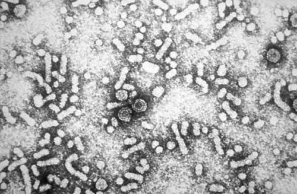
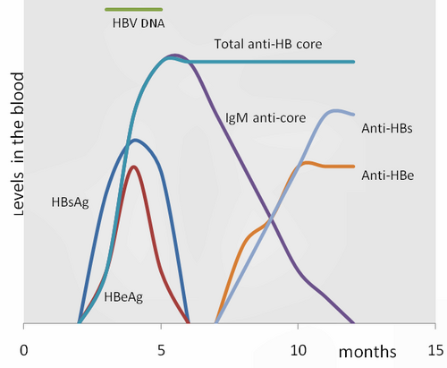

# HEPATITES B E C NA GESTAÇÃO: VIA DE PARTO E IMUNOPROFILAXIA DO RN

Para entender hepatites na gestação, você precisa primeiro desaprender um vício: parar de achar que toda infecção de transmissão vertical se comporta como o HIV. Nas provas de residência, as bancas adoram explorar justamente as diferenças entre o manejo do HIV e das Hepatites B (VHB) e C (VHC). Enquanto no HIV a via de parto e a amamentação são pontos críticos de intervenção proibitiva, nas hepatites o jogo é outro.

O foco aqui é a prevenção da transmissão vertical (TV), que no caso da Hepatite B é extremamente eficaz se fizermos o básico bem feito, e na Hepatite C é um desafio por falta de intervenções farmacológicas seguras durante a gravidez.

*Figura 1 - Micrografia eletrônica revelando partículas de Dane (vírions) do vírus da Hepatite B (HBV), com diâmetro de 42nm. A transmissão vertical do HBV é a principal preocupação na gestação, prevenível com imunoprofilaxia adequada. Fonte: CDC, Domínio Público | Wikimedia Commons*

## Hepatite B: O Alfabeto dos Marcadores e a Estratégia de Bloqueio

A Hepatite B é o tema "queridinho" das bancas porque exige que o aluno saiba interpretar a sorologia. Se você não domina os marcadores, você erra a conduta. Vamos simplificar isso agora.

### Interpretando os Marcadores (Sem Decoreba)

O HBsAg é o "RG" do vírus. Se ele está presente, o vírus está no corpo (infecção aguda ou crônica). O Anti-HBs é o "anticorpo da vitória", indicando imunidade. Mas cuidado: você só é considerado imune de verdade se o Anti-HBs for maior que 10 mUI/mL.

O Anti-HBc é o marcador que nos diz se houve contato real com o vírus.

- **Anti-HBc Total positivo + Anti-HBs positivo:** O paciente teve a doença e se curou (imunidade natural).

- **Anti-HBc Total negativo + Anti-HBs positivo:** O paciente foi vacinado (imunidade vacinal).

- **Anti-HBc IgM:** Indica infecção aguda (ocorrida nos últimos 6 meses).

Nas provas, como destaca o Dr. Will em suas revisões no MedEvo, a pegadinha clássica é confundir a imunidade vacinal com a cura natural. Lembre-se: a vacina só contém a proteína de superfície (HBs), por isso o vacinado nunca terá Anti-HBc positivo.

### O Papel do HBeAg e da Carga Viral

O HBeAg é o marcador de replicação viral. Pense nele como o "termômetro de infectividade". Se a gestante é HBeAg positivo, o risco de transmissão vertical sem profilaxia chega a 90%. Se for HBeAg negativo, esse risco cai para cerca de 10 a 20%.

Por que isso importa? Porque a transmissão vertical do VHB ocorre majoritariamente no momento do parto (contato com sangue e secreções vaginais). A transmissão transplacentária é rara. Portanto, quanto mais vírus circulando (carga viral alta), maior a chance de falha da imunoprofilaxia do recém-nascido (RN).

### Manejo da Gestante HBsAg Positiva

Toda gestante deve ser rastreada para HBsAg na primeira consulta do pré-natal e no terceiro trimestre. Se o HBsAg for positivo, o próximo passo é solicitar o HBeAg e a Carga Viral (HBV-DNA).

Segundo o Protocolo Clínico e Diretrizes Terapêuticas (PCDT) do Ministério da Saúde, o tratamento com **Tenofovir (TDF) 300 mg/dia** está indicado para gestantes com:

- Carga viral (HBV-DNA) > 200.000 UI/mL;

- Ou HBeAg positivo (quando a carga viral não estiver disponível).

O objetivo aqui não é curar a mãe, mas sim "baixar a poeira" viral para que, no momento do parto, o RN não seja bombardeado por uma carga infectante insustentável. O tratamento deve ser iniciado preferencialmente na **28ª semana de gestação** e mantido até 30 dias após o parto (ou conforme indicação de tratamento materno crônico).

## Via de Parto e Amamentação na Hepatite B

Aqui está o maior erro dos alunos: achar que HBsAg positivo indica cesárea. **A via de parto é de indicação estritamente obstétrica.**

Não existe evidência de que a cesárea reduza a transmissão vertical do VHB em comparação ao parto vaginal, desde que a imunoprofilaxia do RN seja realizada corretamente. O que devemos evitar são procedimentos invasivos desnecessários, como fórceps de alívio ou monitorização interna do feto, que podem aumentar o contato sanguíneo.

Quanto à amamentação, ela está **liberada**, mesmo em mães HBeAg positivas ou com carga viral alta, desde que o RN receba a profilaxia adequada nas primeiras horas de vida. O vírus é encontrado no leite, mas a transmissão por essa via é desprezível frente ao benefício da imunização passiva e ativa imediata.

## Imunoprofilaxia do Recém-Nascido: O Combo de Ouro

Se a mãe é HBsAg positiva, o RN precisa de proteção imediata. Não podemos esperar o sistema imune dele reagir sozinho. Precisamos de um ataque em duas frentes:

- **Vacina contra Hepatite B:** Imunização ativa. Deve ser feita nas primeiras 12 horas de vida (preferencialmente).

- **Imunoglobulina Humana Anti-Hepatite B (IGHAHB):** Imunização passiva. Também nas primeiras 12 horas de vida, em local de aplicação diferente da vacina (membros diferentes).

**Atenção à regra dos 7 dias:** Se por algum motivo a IGHAHB não foi feita nas primeiras 12 horas, ela ainda pode ser administrada até o 7º dia de vida. Passou disso, a eficácia cai drasticamente.

### O Caso do RN Prematuro ou de Baixo Peso

Se o RN pesa menos de 2.000g ou tem menos de 33 semanas de gestação, o esquema vacinal muda. Como o sistema imune é muito imaturo, a dose de vacina ao nascimento (dose zero) não é contada para o esquema principal. Esse bebê fará um esquema de **4 doses** (0, 1, 2 e 6 meses). A IGHAHB continua sendo obrigatória nas primeiras 12 horas.

### Tabela 1: Conduta no RN conforme o status materno

| Status Materno | Conduta no RN (até 12h de vida) |
| --- | --- |
| HBsAg Negativo | Apenas Vacina HB |
| HBsAg Positivo | Vacina HB + IGHAHB |
| HBsAg Desconhecido | Vacina HB imediata + Coletar HBsAg materno (se mãe +, fazer IGHAHB até o 7º dia) |

## Hepatite C na Gestação: O Cenário de Observação

Diferente da Hepatite B, a Hepatite C (VHC) não possui vacina nem imunoglobulina. A taxa de transmissão vertical é menor, em torno de 5%, mas sobe para 10-15% se a mãe for coinfectada pelo HIV.

### Por que não tratamos a Hepatite C na gestante?

Esta é uma pergunta clássica de prova. Atualmente, o tratamento da Hepatite C é feito com Antivirais de Ação Direta (DAAs), que são extremamente eficazes. No entanto:

- A **Ribavirina** (usada em alguns esquemas) é altamente teratogênica e contraindicada na gestação.

- Os novos DAAs (Sofosbuvir, Velpatasvir, etc.) ainda não possuem estudos de segurança robustos o suficiente para serem recomendados de rotina pelo Ministério da Saúde durante a gravidez.

Portanto, a conduta na gestante com Anti-HCV positivo é: confirmar a infecção com a Carga Viral (HCV-RNA) e realizar o acompanhamento clínico. O tratamento será postergado para o período pós-parto.

### Via de Parto e Amamentação na Hepatite C

Assim como na Hepatite B, a **via de parto é obstétrica**. A cesárea eletiva não provou reduzir a transmissão vertical do VHC.

Sobre a amamentação: ela é **permitida**. O vírus C não é transmitido pelo leite materno. A única ressalva (contraindicação relativa e temporária) é se a mãe apresentar fissuras mamárias com sangramento ativo, pois o contato direto do RN com o sangue materno infectado é uma via de transmissão teórica.

*Figura 2 - Gráfico dos marcadores sorológicos da Hepatite B ao longo do tempo após infecção aguda, mostrando a cinética de HBsAg, Anti-HBs, HBeAg, Anti-HBe e Anti-HBc, essencial para interpretar o estágio da doença na gestante. Fonte: GrahamColm, Domínio Público | Wikimedia Commons*

## Diagnóstico Diferencial e Cuidados Neonatais Correlatos

As bancas costumam misturar temas de infectologia perinatal. Vamos organizar alguns pontos que aparecem frequentemente nas questões de Hepatite B e C.

### Conjuntivite Neonatal (Oftalmia)

Muitas vezes, ao falar de profilaxia ao nascimento (Credé), a banca joga a Hepatite B no meio. Lembre-se:

- **Profilaxia Ocular (Nitrato de Prata ou Eritromicina):** Previne conjuntivite gonocócica (mais grave, surge nos primeiros 5 dias) e por clamídia (surge entre 5-14 dias). Não tem relação com hepatites.

- **Vitamina K:** Administrada para prevenir a Doença Hemorrágica do RN. Importante notar que o uso de certos anticonvulsivantes pela mãe (como Fenitoína) pode espoliar a vitamina K e causar sangramentos precoces no bebê.

### Tuberculose e Amamentação

Um tema que "pega" muito aluno é o manejo do RN de mãe com Tuberculose (TB). Diferente da Hepatite B, onde a vacina é feita ao nascer, no RN exposto à TB ativa (mãe bacilífera):

- **NÃO faz a BCG ao nascer.**

- Inicia quimioprofilaxia (Isoniazida ou Rifampicina).

- Após 3 meses, faz o teste tuberculínico (PPD/PT).

- Se PPD negativo, suspende a droga e faz a BCG. Se positivo, mantém o tratamento.

A amamentação na TB é permitida, desde que a mãe use máscara enquanto amamenta, até que tenha pelo menos 15 dias de tratamento e baciloscopia negativa.

## O "Pulo do Gato" nas Questões de Prova

Imagine o seguinte cenário: RN nasce de parto vaginal, banhado em mecônio e sangue. Mãe HBsAg positiva. O que fazer primeiro?
Muitos alunos marcam "dar banho imediato". Embora o banho ajude a remover a carga viral externa, a resposta correta para a **prevenção da infecção** é a administração da vacina e da imunoglobulina nas primeiras 12 horas. O banho é um cuidado de higiene, a imunoprofilaxia é a intervenção médica que salva o fígado dessa criança.

Outro ponto: a banca diz que a mãe é Anti-HBs positivo e HBsAg negativo. Ela precisa de alguma conduta? Não. Ela é imune. O RN segue o calendário vacinal normal (apenas vacina ao nascer).

## Tabela 2: Resumo Comparativo Hepatite B vs Hepatite C

| Característica | Hepatite B (VHB) | Hepatite C (VHC) |
| --- | --- | --- |
| Rastreio Pré-natal | Obrigatório (HBsAg) | Recomendado (Anti-HCV) |
| Marcador de Risco TV | HBeAg e Carga Viral alta | Carga Viral (HCV-RNA) |
| Tratamento na Gestação | Sim (Tenofovir se CV > 200k) | Não (DAAs não recomendados) |
| Via de Parto | Obstétrica | Obstétrica |
| Amamentação | Liberada (se RN profilático) | Liberada (cuidado com fissuras) |
| Profilaxia RN | Vacina + IGHAHB (12h) | Nenhuma disponível |

## Entendendo a Fisiopatologia da Transmissão Vertical

Por que o Tenofovir funciona tão bem na Hepatite B? O Tenofovir é um análogo de nucleosídeo que inibe a DNA polimerase viral. Ao reduzir a quantidade de DNA viral no sangue materno no final da gestação, reduzimos a probabilidade de que, durante as contrações uterinas (onde ocorre microtransfusões placentárias) e durante a passagem pelo canal de parto, uma quantidade crítica de vírus atinja a circulação do feto.

Na Hepatite C, a replicação é diferente (vírus RNA) e a barreira placentária parece ser mais eficiente contra o VHC do que contra o VHB. No entanto, a falta de uma "vacina de bloqueio" para o RN torna o acompanhamento pós-natal do filho de mãe com VHC muito mais longo (testagem apenas após os 18 meses para evitar interferência dos anticorpos maternos).

## Situações de Exposição Ocupacional e Violência Sexual

Embora o foco seja gestação, as bancas amam correlacionar a profilaxia pós-exposição (PEP). Se uma gestante sofre violência sexual ou acidente com material biológico:

- Se a fonte for HBsAg positivo e a gestante não for vacinada: **Vacina + IGHAHB** (mesmo protocolo do RN).

- O tempo aqui é crucial: a IGHAHB deve ser feita em até 14 dias (no caso de violência sexual) ou 48 horas (preferencialmente em acidentes biológicos, limite de 7 dias).

Como o MedEvo sempre reforça, a segurança das vacinas de vírus inativado ou subunidades (como a da Hep B) na gestação é total. Nunca se nega vacina de Hepatite B para uma gestante.

## Pontos-Chave para Prova

- **Rastreio Universal:** HBsAg deve ser solicitado no 1º e 3º trimestres.

- **HBeAg Positivo:** É o maior preditor de falha da profilaxia do RN se a carga viral não for tratada.

- **Tenofovir (TDF):** Droga de escolha para gestantes com carga viral > 200.000 UI/mL, iniciando na 28ª semana.

- **Via de Parto:** Sempre obstétrica para Hep B e Hep C. Cesárea NÃO é rotina.

- **Amamentação:** Liberada em ambas (na Hep B, após profilaxia do RN; na Hep C, observar fissuras).

- **Combo do RN (Hep B):** Vacina + IGHAHB nas primeiras 12 horas de vida em locais distintos.

- **RN < 2.000g ou < 33 sem:** Esquema de 4 doses de vacina (0, 1, 2, 6 meses) + IGHAHB.

- **Hepatite C e Gestação:** Não se trata na gravidez devido à falta de segurança dos DAAs e teratogenia da Ribavirina.

- **Imunidade Vacinal:** Anti-HBs positivo isolado (Anti-HBc negativo).

- **Infecção Pregressa/Cura:** Anti-HBs positivo + Anti-HBc Total positivo.

- **Hepatite B Aguda:** HBsAg positivo + Anti-HBc IgM positivo.

- **Hepatite B Crônica:** HBsAg positivo por mais de 6 meses (Anti-HBc IgG positivo).

- **Contraindicação Absoluta de Amamentação no Brasil:** HIV e HTLV-1/2. Hepatites NÃO são contraindicação.

- **RN de Mãe HBsAg Desconhecido:** Vacina imediata. Se mãe positivar depois, IGHAHB pode ser feita até o 7º dia.

- **Erro Comum:** Achar que precisa esperar o resultado do HBsAg materno para vacinar o RN. A vacina é universal nas primeiras 24h (idealmente 12h). 🏆

 Cópia offline para consulta pessoal.
 Fonte original:
 [https://www.medevo.com.br/material-apoio/ler/415d376d-e172-4d11-a5c8-ac28648288e9](https://www.medevo.com.br/material-apoio/ler/415d376d-e172-4d11-a5c8-ac28648288e9)
