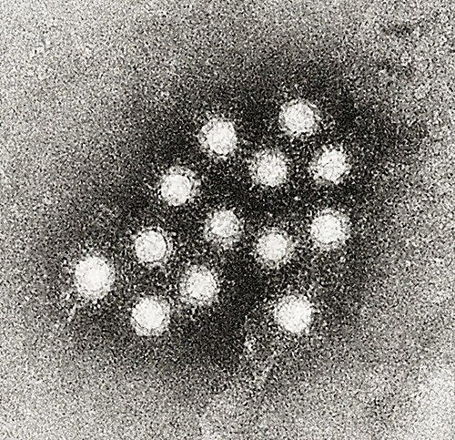

# HEPATITES VIRAIS

Quando falamos de hepatites virais para a residência médica, você precisa dividir seu cérebro em dois compartimentos. O primeiro é o das hepatites de transmissão entérica (A e E), que costumam cair em provas de Pediatria e Preventiva, focando em saneamento e vacinação. O segundo é o das hepatites de transmissão parenteral (B, C e D), as "queridinhas" da Clínica Médica e Infectologia, onde o foco é interpretação sorológica e critérios de tratamento.

O grande desafio aqui não é decorar nomes, mas entender a lógica da agressão hepática. O vírus, na maioria das vezes, não é diretamente citopático (ele não "explode" o hepatócito). O dano ocorre pela resposta do nosso sistema imune tentando eliminar a célula infectada. É por isso que, na fase de imunotolerância da Hepatite B, o paciente tem carga viral altíssima, mas o fígado está intacto: o corpo ainda não "percebeu" o inimigo.

*Figura 1 - Micrografia eletrônica do vírus da Hepatite A (HAV), um vírus RNA de transmissão fecal-oral, causa comum de hepatite aguda autolimitada especialmente em crianças e viajantes. Fonte: CDC/Betty Partin, Domínio Público | Wikimedia Commons*

## Hepatite A (HAV): O Protótipo da Transmissão Fecal-Oral

A Hepatite A é causada por um vírus RNA. No Brasil, a transição epidemiológica mudou o perfil da doença. Antes, quase 100% das crianças tinham contato precoce e eram imunes. Hoje, com a melhora do saneamento, temos mais adultos suscetíveis, o que aumenta o risco de surtos e de casos mais graves, já que a gravidade da HAV aumenta com a idade.

### Quadro Clínico e Diagnóstico

A fase prodrômica é marcada por sintomas inespecíficos: fadiga, náuseas, vômitos e dor abdominal em hipocôndrio direito. Logo após, surge a fase ictérica. Um detalhe que as bancas adoram: a Hepatite A pode cursar com uma forma colestática prolongada, onde a icterícia dura mais de 10 semanas, mas o prognóstico continua sendo bom.

Para o diagnóstico, não há segredo:

- **Anti-HAV IgM:** Indica infecção aguda (fica positivo por cerca de 4 a 6 meses).

- **Anti-HAV IgG:** Indica imunidade (seja por infecção prévia ou vacina).

Lembre-se: a Hepatite A **NUNCA** cronifica. Se a prova trouxer um paciente com Hepatite A evoluindo com cirrose, a alternativa está errada ou ele tem outra doença associada. A única complicação temida aqui é a Hepatite Fulminante, que embora rara (<1%), é a principal causa de transplante hepático infantil em países sem vacinação universal.

### Profilaxia e Vacinação

No Programa Nacional de Imunizações (PNI), a vacina é aplicada em **dose única aos 15 meses** (pode ser feita até os 5 anos incompletos).

**Cenário de Prova:** "Criança de 2 anos, em creche, teve contato com colega que positivou para HAV. O que fazer?".
Se o contato foi há menos de 14 dias:

- Se a criança não for vacinada: Vacina imediata.

- Se for imunodeprimido ou < 1 ano: Imunoglobulina padrão.

*Figura 2 - Diagrama das fases da infecção crônica pelo vírus da Hepatite B, incluindo imunotolerância, imunoeliminação, portador inativo e reativação, com os respectivos marcadores sorológicos e níveis de ALT. Fonte: Offnfopt, CC BY-SA 2.0 | Wikimedia Commons*

## Hepatite B (HBV): O Labirinto Sorológico

A Hepatite B é o tema que mais reprova candidatos por falta de atenção aos detalhes. O HBV é um vírus DNA que se integra ao genoma do hospedeiro na forma de cccDNA (DNA circular fechado covalentemente), o que torna a cura completa (erradicação do vírus) extremamente difícil.

### Entendendo os Marcadores (O "Porquê" de cada um)

Para nunca mais esquecer, pense na estrutura do vírus:

- **HBsAg (Antígeno de superfície):** É a "capa" do vírus. Se ele está no sangue, o vírus está presente. Se persistir por > 6 meses = Hepatite Crônica.

- **Anti-HBs:** É o anticorpo protetor. Ele neutraliza a "capa". Se você tem Anti-HBs positivo e HBsAg negativo, você está imune.

- **Anti-HBc (Anticorpo do Core):** Indica que o vírus entrou na célula.

- **IgM:** Infecção aguda (janela imunológica).

- **IgG (ou Total):** Contato prévio. Ele é o marcador mais fiel de que alguém já teve o vírus na vida.

- **HBeAg:** Indica replicação viral ativa e alta infectividade. É um subproduto da replicação.

- **Anti-HBe:** Indica que a replicação baixou (soroconversão).

### Interpretando a Tabela Sorológica (Essencial para MedEvo)

| HBsAg | Anti-HBc Total | Anti-HBs | Interpretação |
| --- | --- | --- | --- |
| Negativo | Negativo | Negativo | Suscetível (Vacinar!) |
| Negativo | Negativo | **Positivo** | Imunizado por Vacina |
| Negativo | **Positivo** | **Positivo** | Infecção Curada/Resolvida |
| **Positivo** | **Positivo** | Negativo | Infecção Crônica (se > 6 meses) |
| Negativo | **Positivo** | Negativo | Janela Imunológica ou Infecção Oculta |

**Dica do Dr. Will:** Se a prova mostrar um **Anti-HBc Total reagente isolado**, o candidato deve ficar alerta. Isso pode ser uma infecção antiga onde o Anti-HBs caiu a níveis indetectáveis, ou uma infecção oculta. Na prática de bancos de sangue, esse doente é descartado porque o vírus pode ser transmitido.

### História Natural e Fases da Infecção Crônica

A chance de cronificação é inversamente proporcional à idade:

- **Perinatal:** > 90% de chance de cronificar (por isso a vacina e a imunoglobulina ao nascer são cruciais).

- **Adulto hígido:** < 5% de chance. O sistema imune do adulto costuma "resolver" a parada, mas faz uma hepatite aguda muito mais sintomática e exuberante.

As fases da Hepatite B Crônica foram renomeadas recentemente, mas as provas ainda usam os termos clássicos:

- **Imunotolerância:** HBsAg+, HBeAg+, HBV-DNA altíssimo, mas **TGP normal**. O corpo não ataca o vírus. Não tratamos aqui (geralmente crianças/jovens).

- **Imunorreativa (HBeAg+):** O corpo começa a atacar. HBeAg+, HBV-DNA alto e **TGP elevada**. Aqui há risco de fibrose.

- **Portador Inativo:** HBsAg+, HBeAg negativo, Anti-HBe positivo, **HBV-DNA baixo (< 2.000)** e TGP normal. Baixo risco de progressão.

- **Hepatite Crônica HBeAg Negativo (Mutante pré-core):** É a pegadinha! O vírus sofreu mutação e não produz HBeAg, mas continua replicando. HBsAg+, HBeAg-, **HBV-DNA alto** e TGP elevada.

### Quando tratar a Hepatite B?

Segundo o PCDT do Ministério da Saúde, não tratamos todos. O objetivo é evitar cirrose e hepatocarcinoma (CHC). Lembre-se: o HBV pode causar CHC mesmo **sem cirrose**, pois ele integra seu DNA ao DNA do hepatócito.

**Indicações principais de tratamento:**

- HBeAg positivo com TGP > 2x o limite superior da normalidade.

- Cirróticos (qualquer HBV-DNA detectável).

- Prevenção de reativação em pacientes que vão usar imunossupressores (ex: Rituximabe) ou quimioterapia.

- Coinfecção HIV/HBV (o esquema da TARV já deve incluir Tenofovir + Lamivudina).

**Drogas de escolha:**

- **Tenofovir (TDF):** Primeira linha. Cuidado com nefrotoxicidade e perda de massa óssea.

- **Entecavir:** Escolha se o paciente tiver insuficiência renal, osteoporose ou se for usar quimioterapia/imunossupressão.

## Hepatite C (HCV): A Revolução Terapêutica

A Hepatite C é causada por um vírus RNA com alta taxa de mutação, o que explica por que não temos vacina. Diferente da B, a C é a "mestra da cronicidade": cerca de 80% dos infectados evoluirão para a forma crônica.

### Diagnóstico: O Fluxograma que cai na prova

O rastreio é feito com **Anti-HCV**. Se vier positivo, significa apenas que o paciente teve contato. Ele pode ter tido uma cura espontânea (20% dos casos) ou estar infectado.

- **Próximo passo obrigatório:** Solicitar **HCV-RNA** (Carga Viral).

- Se HCV-RNA detectável = Infecção ativa.

- Se HCV-RNA não detectável = Infecção pregressa/curada.

**Exemplo Clínico:** Paciente de 50 anos, ex-usuário de drogas, Anti-HCV positivo e HCV-RNA indetectável. Conduta? Apenas orientar. Ele não tem a doença ativa e não transmite.

### Tratamento da Hepatite C

Esqueça o Interferon. Hoje vivemos a era dos **Antivirais de Ação Direta (DAAs)**. O tratamento é por via oral, dura geralmente 8 a 12 semanas, tem pouquíssimos efeitos colaterais e cura mais de 95% dos pacientes.

**Esquemas principais (PCDT):**

- **Sofosbuvir + Daclatasvir:** O "arroz com feijão" por muito tempo.

- **Glecaprevir + Pibrentasvir:** Esquema pangenotípico (serve para todos os genótipos).

- **Sofosbuvir + Velpatasvir:** Também pangenotípico.

**Interação Medicamentosa Crítica:** Nunca use **Sofosbuvir com Amiodarona**. O risco é de bradicardia grave e bloqueio atrioventricular. Se cair na prova um paciente com arritmia e Hepatite C, essa é a pegadinha.

## Hepatite D (Delta) e E

A **Hepatite D** é um vírus "incompleto". Ele precisa do envelope do HBsAg para infectar. Portanto, só existe Hepatite D onde existe Hepatite B.

- **Coinfecção:** B e D ao mesmo tempo. O risco de cronificação é o mesmo da B isolada.

- **Superinfecção:** Paciente já tinha B crônica e "pega" a D por cima. Isso é gravíssimo, acelera a cirrose e aumenta o risco de hepatite fulminante. No Brasil, é endêmica na região Amazônica.

A **Hepatite E** é similar à A (fecal-oral), mas tem uma particularidade: é extremamente grave em **gestantes**, com alta taxa de mortalidade por hepatite fulminante no terceiro trimestre.

## Hepatite Fulminante: A Emergência Médica

Definição de prova: Insuficiência hepática aguda que cursa com **Encefalopatia Hepática** e **Coagulopatia (TAP prolongado ou INR ≥ 1,5)** em um paciente sem cirrose prévia, ocorrendo em até 26 semanas após o início dos sintomas.

O sinal mais precoce de gravidade não é a icterícia, mas a queda do tempo de protrombina (elevação do INR). Se o fígado para de produzir fatores de coagulação, o tempo de vida média deles é curto, refletindo o dano agudo rapidamente. O tratamento definitivo é o transplante de fígado.

## Diagnóstico Diferencial e Enzimas Hepáticas

Nas hepatites virais agudas, o padrão é de **lesão hepatocelular**:

- TGP (ALT) e TGO (AST) > 1.000 U/L.

- TGP costuma ser maior que a TGO (diferente da hepatite alcoólica, onde TGO > 2x TGP).

- Bilirrubina Direta elevada (padrão colestático intra-hepático).

**Diferenciais importantes:**

- **Leptospirose:** Também dá icterícia, mas cursa com CPK elevada, insuficiência renal (creatinina sobe) e hipocalemia. A icterícia é "rubínica" (alaranjada).

- **Hepatite Medicamentosa:** História de uso de paracetamol, amoxicilina-clavulanato ou isoniazida.

- **Febre Amarela:** Icterícia + Sinal de Faget (dissociação pulso-temperatura) + Insuficiência Renal.

## Comparativo das Hepatites Virais

| Característica | Hepatite A | Hepatite B | Hepatite C |
| --- | --- | --- | --- |
| **Vírus** | RNA | DNA | RNA |
| **Transmissão** | Fecal-oral | Parenteral/Sexual | Parenteral (principal) |
| **Cronificação** | Nunca | 5% (adultos) / 90% (RN) | 80% |
| **Vacina** | Sim (PNI) | Sim (PNI) | Não |
| **Marcador Agudo** | Anti-HAV IgM | HBsAg / Anti-HBc IgM | HCV-RNA |
| **Tratamento Agudo** | Suporte | Raramente (só se grave) | Sim (DAAs) |

## Situações Especiais e Acidentes Biológicos

Em caso de acidente perfurocortante com fonte HBsAg positivo:

- **Se o profissional é vacinado com Anti-HBs conhecido ≥ 10:** Nada a fazer.

- **Se o profissional não é vacinado ou é "não respondedor":** Fazer Vacina + Imunoglobulina específica (IGHB) preferencialmente nas primeiras 24h (até 7 dias).

Para Hepatite C, não existe profilaxia pós-exposição (nem vacina, nem imunoglobulina, nem antiviral). A conduta é monitorar o profissional com Anti-HCV e HCV-RNA e, se ele positivar, tratar a infecção aguda.

## Pontos-Chave para Prova

- **Hepatite B Aguda no Adulto:** A maioria é assintomática, mas quando há sintomas, a chance de cura é maior. O risco de cronificação é baixo (< 5%).

- **Hepatite B Perinatal:** O risco de cronificação é altíssimo (> 90%). Conduta no RN de mãe HBsAg+: Vacina + IGHB nas primeiras 12h de vida em membros diferentes.

- **Marcador de Vacinação HBV:** Anti-HBs positivo isolado (≥ 10 mUI/mL). Se for < 10, considera-se não protegido.

- **Hepatite C e Crioglobulinemia:** É a manifestação extra-hepática mais cobrada. Pode causar vasculite e glomerulonefrite.

- **Hepatite C Diagnóstico:** Anti-HCV é triagem; HCV-RNA é confirmação. Não se usa Anti-HCV para controle de cura, pois ele pode ficar positivo para sempre ("cicatriz sorológica").

- **Hepatite A Fulminante:** Principal causa de transplante hepático agudo em crianças no mundo (onde não há vacina).

- **Coagulopatia:** O melhor marcador de prognóstico na hepatite aguda é o INR, não as transaminases. Transaminases caindo com INR subindo e icterícia piorando indica **falência hepática** (necrose maciça), e não melhora.

- **Tenofovir vs Entecavir:** TDF é a regra. Entecavir é a exceção para renais, idosos com osteoporose ou pacientes em quimioterapia.

- **Hepatite B e HIV:** O tratamento deve conter Tenofovir (TDF) + Lamivudina (3TC) ou Entricitabina (FTC) para tratar os dois vírus simultaneamente.

- **Contraindicação Absoluta:** Sofosbuvir + Amiodarona (risco de bradicardia fatal).

- **Hepatite E:** Pense sempre em gestante com hepatite fulminante vinda de área endêmica ou viagem internacional.

- **Notificação:** Todas as hepatites virais são de notificação compulsória semanal. Casos de surtos ou hepatite fulminante devem ser notificados imediatamente.

- **Anti-HBc Total:** Se positivo, o paciente não pode doar sangue, mesmo que o HBsAg seja negativo, pelo risco de transmissão de hepatite oculta.

- **Células de Downey:** São linfócitos atípicos que podem aparecer em qualquer hepatite viral aguda (e também na mononucleose). 💉

Lembre-se: na prova, o examinador quer saber se você sabe quem tratar e como interpretar o painel de anticorpos. Se você dominar a lógica do HBsAg, Anti-HBc e Anti-HBs, você já garantiu 70% das questões de hepatites.

 Cópia offline para consulta pessoal.
 Fonte original:
 [https://www.medevo.com.br/material-apoio/ler/bbeedd6c-5b6f-4ec6-b172-1f104549e2ac](https://www.medevo.com.br/material-apoio/ler/bbeedd6c-5b6f-4ec6-b172-1f104549e2ac)
