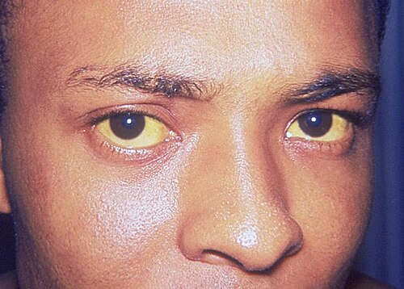
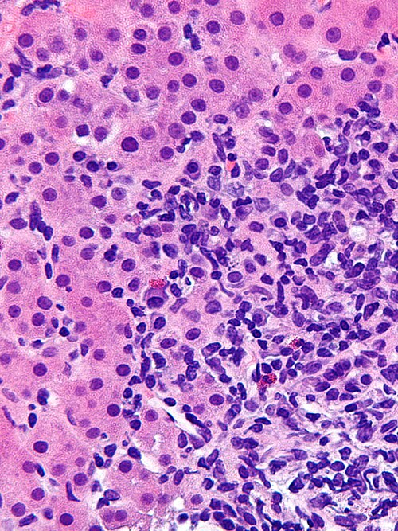

# HEPATITES VIRAIS E AUTOIMUNE

Entender o fígado é, antes de tudo, entender como interpretar seus sinais laboratoriais. Nas provas de residência, você raramente encontrará uma questão que te dê o diagnóstico de bandeja. O examinador vai te dar um padrão de enzimas e esperar que você saiba se o problema é no "filtro" (hepatócito) ou no "encanamento" (vias biliares).

*Figura 1 - Icterícia conjuntival (escleral) em paciente com hepatite viral aguda. A coloração amarelada da esclera é um dos sinais clínicos mais importantes nas hepatites, refletindo hiperbilirrubinemia. Fonte: CDC, Domínio Público | Wikimedia Commons*

## Marcadores Bioquímicos: O Ponto de Partida

Antes de falarmos dos vírus, precisamos dominar a interpretação dos exames. É aqui que muitos alunos perdem pontos preciosos por não diferenciarem um padrão hepatocelular de um padrão colestático.

### Aminotransferases (ALT e AST)

A **ALT (TGP)** é mais específica para o fígado, enquanto a **AST (TGO)** também está presente nos músculos e coração.

- **Aumento discreto (< 5x o limite):** Pense em esteatose (DHGM), hepatites crônicas ou álcool.

- **Aumento maciço (> 10-20x o limite):** Pense em hepatites agudas (virais, DILI ou autoimune) ou isquemia ("fígado de choque").

- **Relação AST/ALT > 2:** Sugere fortemente etiologia alcoólica. Na maioria das outras causas, a ALT é maior que a AST.

### Marcadores de Colestase (FA e GGT)

A **Fosfatase Alcalina (FA)** e a **Gama-GT (GGT)** indicam lesão ou obstrução das vias biliares. Se ambas estão altas, a origem é biliar. Se apenas a FA está alta, pode ser osso (crescimento, fraturas, Paget).

- **Dica de Prova:** O uso de álcool e certos suplementos pode elevar a GGT isoladamente. Se o paciente usa Clopidogrel, lembre-se: a principal alteração hepática descrita é a colestase.

### Metabolismo da Bilirrubina

A icterícia é o sinal clínico clássico. Mas cuidado: nem toda icterícia é hepatite.

- **Bilirrubina Indireta (BI) aumentada:** Hemólise ou falha na conjugação (Síndrome de Gilbert). Na Síndrome de Gilbert, o paciente é assintomático, tem exames normais e a icterícia flutua com estresse ou jejum.

- **Bilirrubina Direta (BD) aumentada:** Colestase ou lesão hepatocelular grave. Se houver colúria (urina escura) e acolia (fezes claras), o problema é pós-hepático (obstrução).

## Hepatite A (HAV): A Doença da Infância e das Viagens

A Hepatite A é o protótipo da transmissão fecal-oral. No Brasil, com a melhora do saneamento, estamos vendo mais adultos jovens se infectarem, o que é um problema, pois a gravidade aumenta com a idade.

### Diagnóstico e Clínica

O quadro clássico é: febre, mialgia, náuseas e icterícia após consumo de água ou alimentos contaminados.

- **Marcador agudo:** Anti-HVA IgM (surge na fase aguda e dura cerca de 4-6 meses).

- **Marcador de imunidade:** Anti-HVA IgG (indica cura ou vacinação).

**Cuidado:** A Hepatite A **NUNCA** cronifica. Se a questão disser que o paciente tem HAV há 1 ano, a alternativa está errada. A única complicação temida é a hepatite fulminante (rara, mas grave).

## Hepatite B (HBV): O "Rei" das Sorologias

Se existe um tema que define quem passa na residência, é a interpretação da sorologia da Hepatite B. O Dr. Will sempre reforça: não decore a tabela, entenda o que cada proteína representa.

### Entendendo os Marcadores

- **HBsAg (Antígeno de superfície):** É o "RG" do vírus. Se está positivo, o vírus está no corpo. Se persistir por > 6 meses, define **Hepatite B Crônica**.

- **Anti-HBs:** É o anticorpo de proteção. Indica cura ou vacinação.

- **Anti-HBc Total:** Indica que o paciente teve contato com o vírus.

- **Anti-HBc IgM:** Infecção aguda (janela imunológica).

- **Anti-HBc IgG:** Infecção antiga (curada ou crônica).

- **HBeAg:** Indica replicação viral ativa e alta infectividade.

- **Anti-HBe:** Indica que a replicação baixou (soroconversão).

### Tabela de Interpretação Sorológica

| HBsAg | Anti-HBc Total | Anti-HBs | Interpretação |
| --- | --- | --- | --- |
| Negativo | Negativo | Positivo | Vacinação prévia |
| Negativo | Positivo | Positivo | Infecção curada (Imunidade natural) |
| Positivo | Positivo (IgM) | Negativo | Hepatite B Aguda |
| Positivo | Positivo (IgG) | Negativo | Hepatite B Crônica |
| Negativo | Positivo (IgM) | Negativo | Janela Imunológica (fase aguda) |

**Pegadinha clássica:** HBsAg pode, sim, estar positivo na hepatite B aguda. Ele só ajuda a definir cronicidade quando permanece reagente por mais de 6 meses.

### Tratamento (Segundo PCDT 2023/2024)

Por que tratamos? Para evitar cirrose e Hepatocarcinoma (CHC). Diferente do HCV, o HBV pode causar câncer mesmo sem cirrose!

**Primeira escolha:** Tenofovir (TDF) 300mg/dia.

- **Quando usar Entecavir (ETV)?** Se o paciente tiver insuficiência renal, osteoporose ou uso de quimioterapia/imunossupressão.

- **Tenofovir Alafenamida (TAF):** Recentemente incorporado para pacientes com contraindicação ao TDF (problemas renais ou ósseos) em cenários específicos.

**Gestantes:** Se a carga viral (HBV-DNA) for alta (> 200.000 UI/mL), iniciamos TDF no 3º trimestre para reduzir a transmissão vertical. A vacina e a imunoglobulina (IGHB) devem ser feitas no RN nas primeiras 12-24h.

## Hepatite C (HCV): A Cura é Possível

A Hepatite C é a principal causa de transplante hepático no Brasil. Ela é silenciosa e, em 80% dos casos, torna-se crônica.

### Diagnóstico

O rastreio é feito com **Anti-HCV**. Se positivo, você **OBRIGATORIAMENTE** deve solicitar o **HCV-RNA (PCR)** para confirmar infecção ativa.

- **Pegadinha:** Anti-HCV positivo com RNA negativo significa cura espontânea ou tratamento prévio bem-sucedido. Esse paciente NÃO tem imunidade e pode se reinfectar.

### Tratamento com DAAs (Drogas de Ação Direta)

Hoje tratamos quase todos os pacientes com esquemas "pangenotípicos" (funcionam para todos os tipos de vírus) por 12 semanas.

- **Esquema padrão:** Sofosbuvir + Daclatasvir ou Sofosbuvir/Velpatasvir.

- **Insuficiência Renal Grave (ClCr < 30):** O uso de Sofosbuvir deve ser cauteloso. Esquemas como Glecaprevir/Pibrentasvir (Maviret) são opções seguras, mas o PCDT brasileiro vem atualizando o uso de DAAs em dialíticos.

### Manifestações Extra-hepáticas

Bancas adoram associar o HCV a:

- **Crioglobulinemia Mista:** Vasculite, púrpura, glomerulonefrite.

- **Porfiria Cutânea Tarda:** Bolhas em áreas expostas ao sol. O tratamento envolve tratar o HCV e, às vezes, doses baixas de **Hidroxicloroquina**.

- **Líquen Plano.**

*Figura 2 - Micrografia em alta magnificação de hepatite autoimune (coloração H&E), mostrando hepatite de interface linfoplasmocitária com plasmócitos e linfócitos no espaço portal, achado histopatológico característico. Fonte: Nephron, CC BY-SA 3.0 | Wikimedia Commons*

## Hepatite Autoimune (HAI)

Imagine uma mulher jovem com fadiga, icterícia flutuante e outras doenças autoimunes (tireoidite, vitiligo). Se as sorologias virais são negativas e as transaminases estão no teto, pense em HAI.

### Diagnóstico

Baseia-se nos **Critérios Simplificados**:

- **Autoanticorpos:** FAN e Anti-músculo liso (Tipo 1 - mais comum) ou Anti-LKM1 (Tipo 2 - mais em crianças).

- **Hipergamaglobulinemia:** Elevação de IgG.

- **Histologia (Biópsia):** Hepatite de interface (obrigatória para o diagnóstico definitivo).

- **Exclusão de hepatites virais.**

### Tratamento

O objetivo é a remissão clínica e bioquímica.

- **Indução:** Prednisona (30-60mg/dia).

- **Manutenção:** Prednisona em dose baixa + Azatioprina (1-2mg/kg/dia). A Azatioprina ajuda a "poupar" corticoide e evitar efeitos colaterais.

## Diagnóstico Diferencial e Patologias Biliares

Muitas questões de "Hepatite" na verdade testam seu conhecimento sobre obstrução biliar. Aqui entram as pérolas clínicas que você não pode esquecer.

### Colangite Aguda

É a infecção da bile por obstrução (geralmente cálculo).

- **Tríade de Charcot:** Dor abdominal + Febre com calafrios + Icterícia.

- **Pêntade de Reynold:** Charcot + Choque séptico + Alteração do nível de consciência. Indica gravidade extrema e necessidade de descompressão biliar imediata (CPRE).

### Doenças Colestáticas Crônicas

- **Colangite Biliar Primária (CBP):** Mulher de meia-idade, prurido intenso, FA muito alta. Marcador: **Anticorpo Antimitocôndria (AMA)**.

- **Colangite Esclerosante Primária (CEP):** Homem jovem, associada à Retocolite Ulcerativa (RCU). Imagem em "colar de contas" na colangiorressonância.

### Doenças Metabólicas

- **Doença de Wilson:** Acúmulo de cobre. Jovem com hepatite + sintomas neuropsiquiátricos + Anéis de Kayser-Fleischer. Tratamento: Penicilamina.

- **Hemocromatose:** Acúmulo de ferro. Saturação de transferrina > 45%.

## Pontos-Chave para Prova 💡

- **Anti-HBs isolado:** Paciente vacinado.

- **Anti-HBc total isolado:** Pode ser falso positivo, infecção muito antiga ou "janela" (se IgM+). Na dúvida, peça o HBV-DNA.

- **Hepatite B e C:** São doenças de notificação compulsória regular (até 7 dias).

- **Cura da Hepatite C:** Definida pela Resposta Virológica Sustentada (RVS) — RNA indetectável 12 semanas após o fim do tratamento.

- **Biópsia na HAI:** Essencial para diagnóstico e estadiamento. O achado clássico é a **hepatite de interface** (antiga necrose em saca-bocados).

- **Sinal de Courvoisier-Terrier:** Vesícula biliar palpável e indolor em paciente ictérico. Sugere neoplasia periampular (câncer de cabeça de pâncreas), não cálculo.

- **Cintilografia HIDA:** Exame mais sensível para Colecistite Aguda (mostra exclusão da vesícula).

- **Linha de Cantlie:** Divide o fígado em lobos funcionais direito e esquerdo (vai da vesícula à veia cava inferior).

- **Tratamento da Hepatite B Crônica:** Não tem cura definitiva (o vírus fica no núcleo como cccDNA), o objetivo é o controle. Já a C tem cura!

- **Erro comum:** Achar que transaminases de 2000 U/L sempre significam pior prognóstico. O que define gravidade na hepatite aguda é o **TAP/RNI** (função de síntese) e o nível de consciência (encefalopatia).

- **Vacinação HBV:** Esquema 0-1-6 meses. Se o paciente for imunodeprimido ou renal crônico, a dose é dobrada.

- **HCV e Diálise:** Pacientes em diálise têm maior prevalência de HCV. O tratamento hoje é seguro e essencial para quem pretende transplantar o rim.

Lembre-se: no MedEvo, focamos no que realmente cai. Se você encontrar um paciente com icterícia flutuante e BI aumentada, não peça sorologia de imediato; pense em Gilbert primeiro. Se a icterícia for obstrutiva, o primeiro exame é sempre a Ultrassonografia de abdome para ver dilatação de vias biliares.

 Cópia offline para consulta pessoal.
 Fonte original:
 [https://www.medevo.com.br/material-apoio/ler/f899d152-b8a0-41a0-a0d5-3f526997790c](https://www.medevo.com.br/material-apoio/ler/f899d152-b8a0-41a0-a0d5-3f526997790c)
