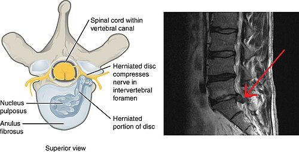
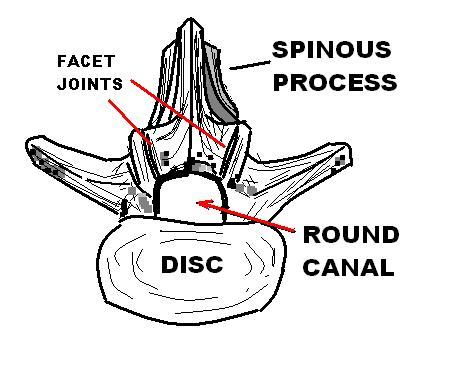

# HÉRNIA DE DISCO

Para entender a hérnia de disco, você precisa visualizar a coluna não como uma pilha de ossos estáticos, mas como uma estrutura dinâmica onde o disco intervertebral funciona como um amortecedor hidráulico. Esse "amortecedor" tem duas partes: o **núcleo pulposo** (gelatinoso, no centro) e o **ânulo fibroso** (anéis concêntricos de colágeno, na periferia).

A hérnia acontece quando o ânulo se rompe e o núcleo "vaza" ou se desloca. Mas aqui está o primeiro segredo que as bancas adoram: a dor não vem apenas da compressão mecânica (o disco apertando o nervo). Ela vem, principalmente, de um processo inflamatório químico. O núcleo pulposo é imunologicamente isolado; quando ele entra em contato com o espaço epidural, o corpo o reconhece como um corpo estranho e libera mediadores inflamatórios (como a fosfolipase A2). É por isso que um paciente pode ter uma dor excruciante com uma hérnia pequena e outro ser assintomático com uma hérnia maior.

*Figura 1 - Ilustração anatômica de uma hérnia de disco, mostrando o núcleo pulposo herniado comprimindo a raiz nervosa adjacente, mecanismo responsável pela dor radicular e ciatalgia. Fonte: OpenStax College, CC BY 3.0 | Wikimedia Commons*

## Fisiopatologia e Mecanismos de Lesão

Por que a maioria das hérnias ocorre em L4-L5 e L5-S1? Porque essas são as zonas de maior mobilidade e carga da coluna lombar. O disco sofre um processo de desidratação natural com a idade (proteoglicanos diminuem), tornando o ânulo fibroso mais frágil e propenso a fissuras.

Quando o conteúdo do disco sai, ele geralmente busca o caminho de menor resistência, que é a região **posterolateral**. Por que não central? Porque o Ligamento Longitudinal Posterior é mais forte e espesso no centro, empurrando o material herniado para os lados, justamente onde passam as raízes nervosas.

### Classificação das Hérnias

- **Abaulamento Discal:** O disco "estufa" além dos limites da vértebra, mas o ânulo está íntegro. (Cuidado: isso raramente é causa de radiculopatia real em provas).

- **Protrusão:** A base da hérnia é maior que o fragmento deslocado.

- **Extrusão:** A base é mais estreita que o fragmento. Aqui o material rompeu o ânulo.

- **Sequestro:** Um pedaço do disco se desprende e "viaja" pelo canal vertebral.

## Quadro Clínico: A Arte de Localizar a Raiz

Em uma prova de residência, você não precisa de uma Ressonância Magnética (RM) para saber qual é o nível da hérnia. O exame físico te dá essa resposta. O padrão-ouro das questões é a **Lombociatalgia**: dor lombar que irradia para o membro inferior, seguindo o trajeto de um dermátomo.

### Radiculopatias Lombares (O Coração da Prova)

Aqui o examinador vai testar se você sabe correlacionar o nível da hérnia com o déficit neurológico. Lembre-se da regra de ouro: na coluna lombar, a hérnia posterolateral (mais comum) comprime a **raiz de baixo**. Exemplo: Hérnia L4-L5 comprime a raiz de L5.

| Raiz | Miótomo (Ação Motora) | Dermátomo (Sensibilidade) | Reflexo |
| --- | --- | --- | --- |
| **L3** | Extensão do joelho (Quadríceps) | Face anterior da coxa | Patelar (L2-L4) |
| **L4** | Dorsiflexão do pé (Tibial Anterior) | Face medial da perna/pé | Patelar |
| **L5** | Extensão do Hálux / Caminhar com calcanhares | Dorso do pé e 1º espaço interdigital | Nenhum específico |
| **S1** | Flexão plantar / Caminhar na ponta dos pés | Borda lateral do pé e planta | Aquileu |

**Exemplo Clínico:** Paciente com dor irradiada para a face lateral da perna, fraqueza para estender o hálux e sensibilidade diminuída no dorso do pé. Onde está a lesão? Raiz de L5. Qual o nível provável da hérnia? L4-L5.

### Radiculopatias Cervicais

Menos frequentes que as lombares, mas caem muito. O raciocínio é o mesmo, mas os reflexos mudam.

- **C6:** Fraqueza na flexão do cotovelo e extensão do punho. Hipoestesia no polegar e face lateral do antebraço. Reflexo: **Bicipital** e Braquiorradial.

- **C7:** Fraqueza na extensão do cotovelo (Tríceps) e flexão do punho. Hipoestesia no dedo médio. Reflexo: **Tricipital**.

## Manobras Especiais e Sinais de Alarme

Você está no ambulatório e o paciente reclama de dor. Como confirmar que a dor é radicular (raiz nervosa) e não apenas muscular?

### Teste de Lasègue

É o teste de elevação da perna estendida. Ele é considerado positivo se o paciente sente dor irradiada abaixo do joelho entre **30 e 70 graus**.

- **Atenção:** Se o paciente sente dor apenas na lombar, o teste é negativo para radiculopatia.

- **Lasègue Invertido:** Estiramento da coxa com o paciente em decúbito ventral. Indica compressão de raízes altas (L2-L4).

- **Sinal de Lasègue Contralateral:** Você levanta a perna "boa" e o paciente sente dor na perna "ruim". Isso é altamente específico para hérnia de disco extrusa.

### Manobra de Spurling (Cervical)

Inclinação lateral da cabeça com compressão axial. Se reproduzir a dor irradiada para o braço, sugere radiculopatia cervical.

### Síndrome da Cauda Equina: A Emergência Médica

Se você errar isso na prova ou na vida, as consequências são graves. A cauda equina ocorre quando há uma compressão maciça das raízes sacrais e lombares baixas.

- **Tríade Clássica:** Anestesia em sela (perda de sensibilidade no períneo), disfunção esfincteriana (retenção urinária ou incontinência fecal) e déficit motor grave/bilateral nos membros inferiores.

- **Conduta:** RM de urgência e descompressão cirúrgica imediata (idealmente em < 24-48h).

*Figura 2 - Imagem anatômica do canal vertebral lombar normal. A hérnia de disco pode causar estenose do canal, comprimindo as raízes nervosas e gerando os sintomas radiculares típicos como ciatalgia. Fonte: A E Francis, Domínio Público | Wikimedia Commons*

## Diagnóstico por Imagem

Como o Dr. Will sempre reforça em suas discussões no MedEvo, "imagem não é tudo". Muitos pacientes assintomáticos têm hérnias na RM. Portanto, só peça exame de imagem se o resultado for mudar sua conduta.

- **Radiografia (Raio-X):** Não vê a hérnia. Serve para ver fraturas, desalinhamentos (espondilolistese) ou tumores ósseos.

- **Ressonância Magnética (RM):** Exame de escolha. Excelente para ver partes moles, disco e nervos.

- **Tomografia (TC):** Útil se a RM for contraindicada ou para avaliar melhor a parte óssea (calcificações da hérnia).

**Quando pedir imagem de imediato?** Quando houver "Red Flags" (Sinais de Alarme):

- Idade > 50 ou < 20 anos.

- História de câncer.

- Febre, perda de peso ou uso de drogas IV (suspeita de discite/abscesso).

- Trauma importante.

- Déficit neurológico progressivo ou Síndrome da Cauda Equina.

## Tratamento: O Caminho da Recuperação

Aqui está o maior erro dos alunos: achar que hérnia de disco é igual a cirurgia. **90% dos pacientes melhoram com tratamento conservador em 4 a 6 semanas.**

### Tratamento Conservador (Primeira Escolha)

- **Repouso Relativo:** Cuidado! Repouso absoluto no leito por mais de 48 horas é PREJUDICIAL. O paciente deve manter-se ativo dentro do limite da dor.

- **Analgesia:** AINEs (como Naproxeno 500mg 12/12h) por curto período, analgésicos comuns e, se dor neuropática intensa, adjuvantes como Gabapentina ou Pregabalina.

- **Fisioterapia:** Fundamental para estabilização segmentar e reabilitação funcional.

### Tratamento Cirúrgico

Por que operamos? Não é para "curar" a coluna, mas para descomprimir o nervo.

- **Indicações Absolutas:** Síndrome da Cauda Equina ou déficit motor progressivo (ex: o pé está ficando cada vez mais fraco).

- **Indicação Relativa:** Falha do tratamento conservador bem feito por 6 a 12 semanas com dor intratável que limita a vida do paciente.

A técnica mais comum é a **Microdiscectomia**, onde removemos apenas o fragmento que está comprimindo a raiz.

## Medicina do Trabalho e Aspectos Previdenciários

Este tópico é figurinha carimbada em provas de Medicina Preventiva e do Trabalho. A hérnia de disco pode ser uma doença relacionada ao trabalho (nexo causal ou concausal).

- **Nexo Causal:** Se o trabalhador faz esforço repetitivo, levantamento de peso ou vibração de corpo inteiro, a patologia pode ser considerada ocupacional.

- **CAT (Comunicação de Acidente de Trabalho):** Deve ser emitida pela empresa em caso de acidente ou doença profissional. Se a empresa não emitir, o próprio médico, o sindicato ou o trabalhador podem fazê-lo.

- **SINAN:** Casos de LER/DORT (onde a hérnia pode se enquadrar) devem ser notificados no Sistema de Informação de Agravos de Notificação.

- **Benefícios do INSS:**

- **Auxílio-Doença Comum (B31):** Doença sem relação com o trabalho.

- **Auxílio-Doença Acidentário (B91):** Doença com nexo causal ocupacional. Dá estabilidade de 12 meses após o retorno.

- **Auxílio-Acidente:** Pago quando a lesão deixa uma sequela definitiva que reduz a capacidade laboral, mas não impede o trabalho.

O médico assistente emite o relatório, mas quem estabelece o **nexo causal previdenciário** final é o perito do INSS.

*Figura 2 - Imagem anatômica do canal vertebral lombar normal. A hérnia de disco pode causar estenose do canal, comprimindo as raízes nervosas e gerando os sintomas radiculares típicos como ciatalgia. Fonte: A E Francis, Domínio Público | Wikimedia Commons*

## Diagnóstico Diferencial: Não confunda!

Muitas vezes a dor parece hérnia, mas não é.

- **Síndrome do Piriforme:** O músculo piriforme (na nádega) comprime o nervo ciático. O Lasègue pode ser positivo, mas não há alterações nos reflexos ou fraqueza de miótomos específicos da coluna.

- **Estenose de Canal:** Comum em idosos. A dor melhora ao inclinar o corpo para frente (sinal do carrinho de compras) e piora ao estender a coluna.

- **Lesão do Nervo Fibular Comum:** Causa "pé caído" (fraqueza na dorsiflexão), mas a sensibilidade é alterada na face lateral da perna e não há dor lombar. Diferente da raiz de L5, o reflexo patelar e aquileu estão normais, mas a fraqueza é distal.

- **Lesão do Nervo Radial:** Causa "mão caída". Não confunda com radiculopatia cervical C7 (que causa fraqueza no tríceps, o que não ocorre na lesão isolada do radial no braço).

## Tabelas Comparativas para Revisão Rápida

### Tabela 1: Diferenciação Clínica das Raízes Lombares

| Raiz | Teste Motor Principal | Local da Hipoestesia | Reflexo Alterado |
| --- | --- | --- | --- |
| **L3** | Extensão do joelho | Coxa anterior | Patelar |
| **L4** | Dorsiflexão do pé | Maléolo medial | Patelar |
| **L5** | Extensão do hálux | Dorso do pé | Nenhum |
| **S1** | Flexão plantar | Borda lateral do pé | Aquileu |

### Tabela 2: Sinais de Alarme (Red Flags) na Dor Lombar

| Categoria | Achados Clínicos | Suspeita Diagnóstica |
| --- | --- | --- |
| **Sistêmicos** | Febre, perda de peso, calafrios | Infecção ou Malignidade |
| **Neurológicos** | Anestesia em sela, retenção urinária | Síndrome da Cauda Equina |
| **Histórico** | Trauma grave, uso de corticoide | Fratura vertebral |
| **Idade** | Início < 20 anos ou > 50 anos | Espondilolise ou Metástase |

### Tabela 3: Tipos de Auxílio Previdenciário

| Tipo | Sigla | Característica |
| --- | --- | --- |
| **Previdenciário** | B31 | Doença comum, sem nexo com trabalho. |
| **Acidentário** | B91 | Doença ocupacional ou acidente de trabalho. |
| **Indenizatório** | Auxílio-Acidente | Sequela que reduz capacidade, mas permite trabalhar. |

## Pontos-Chave para Prova 💡

- **Tratamento Inicial:** Para lombociatalgia aguda sem déficit neurológico grave, a conduta é SEMPRE conservadora (analgesia + orientações). Não peça RM na primeira consulta se não houver Red Flags.

- **Pé Caído:** Pode ser compressão de L5 (hérnia L4-L5) ou lesão do nervo fibular comum. A diferença é que na lesão de L5 costuma haver dor lombar e fraqueza associada da inversão do pé.

- **Mão Caída:** Clássico de lesão do nervo radial (frequentemente por fratura de úmero ou "paralisia de sábado à noite").

- **Reflexo Aquileu:** Sua abolição ou diminuição aponta diretamente para a raiz de **S1**.

- **Reflexo Patelar:** Avalia principalmente as raízes de **L3 e L4**.

- **Síndrome da Cauda Equina:** É uma emergência cirúrgica. O sintoma mais precoce e sensível costuma ser a retenção urinária por denervação da bexiga.

- **Manobra de Valsalva:** Aumenta a pressão intratecal e piora a dor da hérnia de disco (ajuda no diagnóstico clínico).

- **Nexo Causal:** Quem define se a doença é do trabalho para fins de benefício é o perito do INSS, mas o médico assistente deve notificar o SINAN se suspeitar de doença ocupacional.

- **Repouso:** O repouso absoluto é contraindicado. O paciente deve ser estimulado a deambular conforme tolerado.

- **Epidemiologia:** A hérnia de disco é a causa mais comum de cirurgia de coluna na população adulta jovem.

- **LR+ (Likelihood Ratio):** Se uma questão mencionar que o teste de Spurling tem um LR+ de 30, isso significa que um teste positivo aumenta drasticamente a probabilidade de o paciente ter radiculopatia cervical.

- **Dorsiflexão do pé:** Depende do nervo fibular profundo (ramo do fibular comum) e das raízes L4-L5.

- **Hérnia L5-S1:** É a causa mais comum de compressão da raiz de S1, levando a dor na panturrilha e planta do pé.

- **Cirurgia:** A principal indicação para cirurgia eletiva é a falha do tratamento conservador após 6-12 semanas em pacientes com dor persistente e radicular.

- **O que NÃO fazer:** Não prescrever repouso absoluto por 2 semanas; não solicitar RM para todo paciente com dor lombar simples; não indicar cirurgia apenas com base em achados de imagem sem correlação clínica.

 Cópia offline para consulta pessoal.
 Fonte original:
 [https://www.medevo.com.br/material-apoio/ler/22e9354a-5086-4ee6-bba5-10a6622351f3](https://www.medevo.com.br/material-apoio/ler/22e9354a-5086-4ee6-bba5-10a6622351f3)
