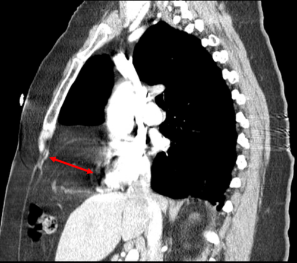

# HÉRNIA DIAFRAGMÁTICA CONGÊNITA

A Hérnia Diafragmática Congênita (HDC) é um daqueles temas que separa o aluno que decorou o livro do médico que entende a fisiologia. Nas provas de residência, a banca não quer apenas que você saiba que existe um "buraco no diafragma". Ela quer saber se você entende que o problema real não é o buraco, mas o que ele faz com o pulmão.

Para começar, entenda o conceito: a HDC é um defeito na formação do diafragma que permite a herniação de vísceras abdominais para a cavidade torácica durante o período fetal. Isso acontece precocemente, geralmente entre a 8ª e a 10ª semana de gestação.

*Figura 1 - Ultrassonografia obstétrica coronal mostrando hérnia diafragmática congênita, com estômago e coração deslocados para dentro do tórax fetal. O diagnóstico pré-natal permite planejamento do parto em centro especializado. Fonte: Dr Laughlin Dawes, CC BY 3.0 | Wikimedia Commons*

## Anatomia e Embriologia: Onde Tudo Começa

O diafragma se forma a partir de quatro estruturas: o septo transverso, as membranas pleuroperitoneais, o mesentério dorsal do esôfago e o crescimento muscular das paredes corporais laterais.

O erro clássico de formação ocorre quando as membranas pleuroperitoneais falham em se fundir com o septo transverso e o mesentério esofágico. Esse fechamento deveria ocorrer primeiro à direita e depois à esquerda. Como a esquerda demora mais para fechar, é lá que a maioria das hérnias acontece.

### Hérnia de Bochdalek

Esta é a "estrela" das provas. Representa cerca de 90% a 95% dos casos de HDC.

- **Localização:** Póstero-lateral.

- **Lado:** 80% a 85% ocorrem à esquerda.

- **Por que cai tanto?** Porque é a principal causa de insuficiência respiratória grave no recém-nascido por defeito diafragmático.

### Hérnia de Morgagni

Muito menos comum e com comportamento clínico completamente diferente.

- **Localização:** Ântero-medial (retroesternal ou paraesternal), através do espaço de Larrey.

- **Características:** Frequentemente é um defeito esternocondral. Muitas vezes é assintomática no período neonatal, sendo descoberta mais tarde na infância ou até na vida adulta como um achado incidental de raio-X.

### Hérnia de Hiato (Tipo II - Paraesofágica)

Embora não seja o foco principal da HDC neonatal, as bancas adoram misturar os conceitos. Na hérnia paraesofágica (Tipo II), a cárdia permanece em sua posição anatômica normal, mas o fundo gástrico hernia-se para o tórax ao lado do esôfago. Isso é diferente da Tipo I (deslizamento), onde a junção esofagogástrica sobe.

**Tabela 1: Comparativo entre os principais defeitos diafragmáticos**

| Característica | Hérnia de Bochdalek | Hérnia de Morgagni | Eventração Diafragmática |
| --- | --- | --- | --- |
| **Localização** | Póstero-lateral | Ântero-medial | Global ou segmentar |
| **Frequência** | 90-95% (Mais comum) | Rara | Incomum |
| **Lado predominante** | Esquerdo (80-85%) | Direito | Variável |
| **Saco herniário** | Geralmente ausente | Geralmente presente | Presente (o próprio diafragma) |
| **Clínica Neonatal** | Insuficiência respiratória grave | Frequentemente assintomática | Variável (pode ser leve) |

## Fisiopatologia: O Pulmão é a Vítima

Aqui está o segredo para você nunca mais errar uma questão de conduta: a HDC não é uma doença cirúrgica de emergência; é uma doença médica de manejo ventilatório.

Quando as alças intestinais, o estômago e, às vezes, o fígado sobem para o tórax na 10ª semana de vida fetal, eles ocupam o espaço onde o pulmão deveria estar crescendo. Isso gera duas consequências fatais se não manejadas:

### 1. Hipoplasia Pulmonar

O pulmão não apenas "murcha", ele não se desenvolve. Há uma redução no número de gerações brônquicas e, principalmente, no número de alvéolos. O pulmão ipsilateral (do mesmo lado da hérnia) é o mais afetado, mas o contralateral também sofre hipoplasia devido ao desvio do mediastino.

*Cuidado:* Uma pegadinha comum em provas é dizer que a HDC causa "hipotonia pulmonar". Isso está tecnicamente incorreto. O termo correto é **hipoplasia**.

### 2. Hipertensão Pulmonar Persistente (HPPRN)

As arteríolas pulmonares nesses bebês têm uma camada muscular muito mais espessa e reativa. Como há menos vasos (devido à hipoplasia) e os que existem são hiper-reativos, a resistência vascular pulmonar (RVP) fica altíssima.

Isso mantém a circulação fetal (shunt direita-esquerda pelo canal arterial e forame oval), impedindo a oxigenação adequada. Como o Dr. Will sempre enfatiza em nossas discussões no MedEvo, o sucesso do tratamento depende quase inteiramente de como controlamos essa hipertensão pulmonar, e não da rapidez com que fechamos o buraco no diafragma.

*Figura 2 - Tomografia computadorizada sagital de tórax mostrando hérnia de Morgagni (seta vermelha) contendo gordura abdominal. A hérnia de Morgagni é o segundo tipo mais comum de HDC, localizada na porção anterior do diafragma. Fonte: JasonRobertYoungMD, CC BY-SA 4.0 | Wikimedia Commons*

## Diagnóstico Pré-Natal: Antecipando o Caos

Atualmente, mais de 50% a 60% dos casos são detectados no ultrassom morfológico de rotina (segundo trimestre).

**O que o ultrassonografista vê?**

- Presença de órgãos abdominais no tórax (estômago é o marcador clássico).

- Desvio do mediastino para o lado oposto.

- Polidrâmnio (porque o estômago herniado ou a compressão esofágica impedem o bebê de deglutir o líquido amniótico).

**Fatores de Prognóstico Pré-natal:**
A relação pulmão-cabeça (LHR - *Lung-to-Head Ratio*) medida pelo USG é o principal preditor.

- LHR < 1.0: Prognóstico muito reservado (alta mortalidade).

- LHR > 1.4: Prognóstico favorável.

- Posição do fígado: Se o fígado estiver "para cima" (intratorácico), o prognóstico é pior.

## Quadro Clínico e Exame Físico

Imagine que você é o plantonista da sala de parto. O bebê nasce, respira uma ou duas vezes e começa a apresentar um desconforto respiratório progressivo e grave.

**A Tríade Clássica:**

- **Cianose e Insuficiência Respiratória:** Logo após o nascimento.

- **Abdome Escavado (em barca):** O abdome está vazio porque as vísceras estão no tórax.

- **Dextrocardia (aparente):** Na hérnia à esquerda, o coração é empurrado para a direita. Você vai auscultar as bulhas cardíacas no hemitórax direito.

**Outros achados:**

- Murmúrio vesicular abolido ou muito diminuído no lado afetado.

- Presença de ruídos hidroaéreos no tórax (nem sempre audíveis, não espere por isso para suspeitar).

## Diagnóstico Pós-Natal: O Raio-X é Soberano

O diagnóstico é confirmado por uma radiografia de tórax e abdome.

**O que você vai encontrar no RX:**

- Imagens radiolúcidas circulares (alças intestinais) preenchendo o hemitórax.

- Desvio do mediastino para o lado contralateral.

- Silhueta cardíaca deslocada.

- Pouco ou nenhum gás no abdome inferior.

- A ponta da sonda nasogástrica pode ser vista dentro do tórax (se o estômago estiver herniado).

*Figura 2 - Tomografia computadorizada sagital de tórax mostrando hérnia de Morgagni (seta vermelha) contendo gordura abdominal. A hérnia de Morgagni é o segundo tipo mais comum de HDC, localizada na porção anterior do diafragma. Fonte: JasonRobertYoungMD, CC BY-SA 4.0 | Wikimedia Commons*

## Diagnóstico Diferencial

Aqui a banca tenta te confundir com outras patologias neonatais.

- **Malformação Adenomatoide Cística (CPAM):** Também apresenta cistos no tórax, mas o abdome NÃO é escavado (as vísceras estão no lugar certo).

- **Eventração Diafragmática:** O diafragma está lá, mas é fino e fraco (aponeurótico), subindo para o tórax. No RX, você vê uma linha contínua (o diafragma) separando o intestino do pulmão. Na HDC, essa linha não existe.

- **Pneumotórax:** Pode causar desvio de mediastino, mas não apresenta as imagens de alças intestinais.

**Tabela 2: Diagnóstico Diferencial Radiológico**

| Patologia | Achado no Tórax | Achado no Abdome |
| --- | --- | --- |
| **HDC (Bochdalek)** | Alças intestinais, desvio de mediastino | Escavado, sem gases |
| **CPAM** | Cistos pulmonares (multiloculados) | Normal, com gases |
| **Eventração** | Elevação da cúpula diafragmática (íntegra) | Normal |
| **Hérnia de Morgagni** | Massa/alça em região anterior/medial | Geralmente normal |

## Manejo Inicial: Onde se Ganha ou Perde o Jogo

Este é o ponto mais cobrado em provas. Se você decorar apenas uma coisa hoje, que seja esta: **NUNCA use ventilação com máscara e balão (AMBU) em um paciente com suspeita de HDC.**

**Por que?** Porque o AMBU joga ar para o pulmão, mas também para o estômago e intestinos. Como essas alças estão dentro do tórax, elas vão inflar e comprimir ainda mais o pouco pulmão que o bebê tem. Você vai causar um colapso respiratório imediato.

### Passos da Estabilização (A Regra de Ouro)

- **Intubação Orotraqueal Imediata:** Garanta a via aérea sem insuflar o trato gastrointestinal.

- **Sonda Nasogástrica de Grosso Calibre em Aspiração Contínua:** Essencial para descompressão do estômago e alças intestinais no tórax.

- **Ventilação Protetora:**

- Evite pressões de pico (PIP) altas (> 25 cmH2O).

- Use a estratégia de **Hipercapnia Permissiva**: Aceitamos um pCO2 mais alto (45-65 mmHg) para evitar o barotrauma no pulmão hipoplásico.

- Mantenha a saturação pré-ductal (mão direita) entre 85-95%.

- **Acesso Vascular:** Cateterismo umbilical (venoso e arterial) para monitorização de gases e pressão arterial.

### Tratamento da Hipertensão Pulmonar

Se o bebê não melhora com a ventilação convencional, precisamos tratar a vasculatura pulmonar.

- **Óxido Nítrico Inalatório (NOi):** É um vasodilatador pulmonar seletivo. Ele reduz a resistência vascular pulmonar e a sobrecarga do ventrículo direito.

- **Drogas Inotrópicas:** Milrinone é frequentemente usado por seu efeito inodilatador (melhora a função cardíaca e ajuda na vasodilatação pulmonar).

- **ECMO (Oxigenação por Membrana Extracorpórea):** É o último recurso. Funciona como um "pulmão artificial" para dar tempo ao pulmão do bebê se recuperar da hipertensão pulmonar aguda.

## O Tratamento Cirúrgico: A Calma após a Tempestade

Antigamente, a HDC era uma emergência cirúrgica. O bebê nascia e ia direto para a mesa de operação. O resultado? Mortalidade altíssima.

Hoje, aprendemos que a cirurgia deve ser feita apenas após a **estabilização clínica**. Isso geralmente leva de 24 a 48 horas, mas pode levar dias.

**Critérios de Estabilização para Cirurgia:**

- Estabilidade hemodinâmica (PAM normal para a idade gestacional).

- Melhora da hipertensão pulmonar (estimada pelo ecocardiograma).

- FiO2 < 50% para manter saturação adequada.

- Ausência de shunt direita-esquerda importante.

**A Técnica:**

- A via de escolha clássica é a **subcostal ipsilateral** (laparotomia).

- As vísceras são reduzidas para a cavidade abdominal.

- O defeito diafragmático é fechado. Se o buraco for muito grande e não houver tecido diafragmático suficiente, usamos uma **prótese (tela)** de material sintético (Gore-Tex).

- Em casos selecionados e pacientes muito estáveis, pode-se tentar a via toracoscópica, mas isso é raro no neonato agudo.

## Situações Especiais e Complicações

### Cirurgia Fetal

Existe uma intervenção chamada **FETO (Fetoscopic Endoluminal Tracheal Occlusion)**.

- **Como funciona?** Coloca-se um balão dentro da traqueia do feto via endoscopia.

- **Por que?** O pulmão produz fluido. Se a traqueia estiver ocluída, esse fluido se acumula e "infla" o pulmão de dentro para fora, estimulando o crescimento e combatendo a hipoplasia. O balão é retirado antes do nascimento.

- **Indicação:** Apenas em casos graves (LHR muito baixo).

### Complicações a Longo Prazo

O sobrevivente de HDC não é um bebê "curado" após a cirurgia. Ele precisa de acompanhamento multidisciplinar:

- **Doença Pulmonar Crônica:** Devido à hipoplasia e ao tempo de ventilação mecânica.

- **Refluxo Gastroesofágico (DRGE):** Extremamente comum (até 80% dos casos) devido à alteração da anatomia do hiato e do ângulo de His.

- **Escoliose:** Devido à assimetria torácica e cicatrizes cirúrgicas.

- **Déficits de Desenvolvimento Neuropsicomotor:** Relacionados à hipóxia e períodos de baixa perfusão neonatal.

**Tabela 3: Metas de Estabilização Neonatal (Protocolo Típico)**

| Parâmetro | Meta Recomendada |
| --- | --- |
| **Saturação Pré-ductal (Mão Direita)** | 85% - 95% |
| **Saturação Pós-ductal (Membros Inferiores)** | > 70% |
| **PaCO2 (Hipercapnia Permissiva)** | 45 - 65 mmHg |
| **Pressão Inspiratória de Pico (PIP)** | < 25 cmH2O |
| **pH Arterial** | > 7.25 |
| **Lactato Sérico** | < 3.0 mmol/L |

## Hérnias de Hiato: Um Breve Adendo

Embora o foco seja a HDC de Bochdalek, as bancas de cirurgia geral e pediátrica gostam de cobrar a classificação das hérnias de hiato.

- **Tipo I (Deslizamento):** A mais comum. A junção esofagogástrica (JEG) sobe para o tórax. Tratamento é clínico (DRGE), a menos que haja complicações.

- **Tipo II (Paraesofágica):** A JEG está no lugar, mas o fundo gástrico sobe. **Risco de encarceramento e volvo gástrico.** Frequentemente cirúrgica.

- **Tipo III (Mista):** Componentes da I e II.

- **Tipo IV:** Outros órgãos (cólon, baço) estão no saco herniário junto com o estômago.

## Pontos-Chave para Prova

- **Hérnia de Bochdalek:** Defeito póstero-lateral, mais comum à esquerda (85%), causa clássica de insuficiência respiratória neonatal.

- **Hérnia de Morgagni:** Defeito ântero-medial (paraesternal), frequentemente assintomática no RN, diagnóstico tardio.

- **A Tríade Clínica:** Desconforto respiratório + Abdome escavado + Bulhas cardíacas desviadas para a direita (na hérnia à esquerda).

- **O Grande Erro:** Ventilar com máscara e balão (AMBU). Isso piora a compressão pulmonar ao insuflar o intestino.

- **Conduta Imediata:** Intubação orotraqueal + Sonda nasogástrica em aspiração.

- **Fisiopatologia Real:** O problema não é o defeito anatômico, mas a **Hipoplasia Pulmonar** e a **Hipertensão Pulmonar Persistente**.

- **Momento da Cirurgia:** Nunca é emergência. Deve ser feita após estabilização clínica (geralmente após 24-48h).

- **Óxido Nítrico (NOi):** Usado para reduzir a resistência vascular pulmonar e tratar a hipertensão pulmonar.

- **Diagnóstico Diferencial:** Na Malformação Adenomatoide Cística (CPAM), o abdome tem gases e não é escavado.

- **Hérnia Paraesofágica (Tipo II):** O fundo gástrico sobe, mas a cárdia (JEG) permanece na posição normal.

- **Prognóstico Pré-natal:** Avaliado pela relação pulmão-cabeça (LHR) e posição do fígado (fígado intratorácico = pior prognóstico).

- **Hipercapnia Permissiva:** Estratégia ventilatória para evitar barotrauma, aceitando pCO2 entre 45-65 mmHg.

- **Equipamentos Essenciais em VPM:** Umidificador, cânula de traqueostomia (se prolongado) e dispositivos de sucção. Capnografia é importante, mas não é o item de "manutenção básica" mais cobrado como essencial absoluto.

- **Complicação Tardia mais Comum:** Refluxo Gastroesofágico (DRGE). 🩺

Lembre-se: em qualquer questão de prova sobre HDC, se a alternativa sugerir "cirurgia imediata" ou "ventilação com máscara", ela está errada. O foco é estabilizar o pulmão hipoplásico e manejar a hipertensão pulmonar antes de qualquer incisão.

 Cópia offline para consulta pessoal.
 Fonte original:
 [https://www.medevo.com.br/material-apoio/ler/4563c16d-3e6c-4bf1-baa8-1d4c912ed509](https://www.medevo.com.br/material-apoio/ler/4563c16d-3e6c-4bf1-baa8-1d4c912ed509)
