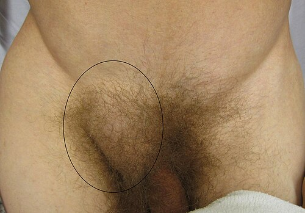

# HÉRNIA ENCARCERADA E ESTRANGULADA: URGÊNCIA CIRÚRGICA

Para entender as complicações das hérnias, você precisa primeiro visualizar o que é uma hérnia: um defeito (buraco) na musculatura por onde passa um conteúdo que não deveria estar ali. Enquanto esse conteúdo entra e sai livremente, temos uma hérnia redutível. O problema começa quando o conteúdo "fica preso".

Aqui no MedEvo, sempre batemos na tecla: o examinador não quer apenas que você saiba operar; ele quer saber se você identifica o momento exato em que a conduta deixa de ser eletiva e passa a ser uma emergência de vida ou morte.

*Figura 1 - Grande hérnia inguinal direita. Quando o conteúdo herniário não pode ser reduzido para a cavidade abdominal, constitui-se a hérnia encarcerada, que pode evoluir para estrangulamento com isquemia intestinal. Fonte: James Heilman, MD, CC BY-SA 3.0 | Wikimedia Commons*

## Definições e a Fisiopatologia do Desastre

Muitos alunos confundem os termos, mas para a sua prova e para a sua vida no plantão, a distinção deve ser cristalina.

### Hérnia Encarcerada (Irredutível)

É a hérnia cujo conteúdo não retorna à cavidade abdominal, seja espontaneamente ou por meio de manobras manuais. O encarceramento é uma questão mecânica. O conteúdo está "preso", mas o suprimento sanguíneo ainda está preservado.

Por que isso acontece? Geralmente, o anel herniário é estreito ou houve formação de aderências entre o saco herniário e o conteúdo (geralmente omento ou alça intestinal).

**Atenção:** Toda hérnia encarcerada é uma urgência em potencial, pois o encarceramento é o primeiro passo para o estrangulamento.

### Hérnia Estrangulada (Isquêmica)

Aqui o cenário muda. Além de presa, a alça sofreu comprometimento vascular.
O "porquê" é puramente físico:

- O conteúdo fica preso no anel.

- A compressão inicial obstrui o retorno venoso e linfático.

- A alça começa a edemanciar (inchar) dentro de um anel rígido que não expande.

- O edema aumenta a pressão até que ela supere a pressão de perfusão arterial.

- Resultado: Isquemia, necrose e, eventualmente, perfuração.

**Dica de Prova:** Se a questão mencionar sinais inflamatórios locais (hiperemia, calor, edema de pele) ou sinais sistêmicos (febre, leucocitose, taquicardia), ela está gritando "ESTRANGULAMENTO".

### Tabela 1: Diferenciação Clínica Crucial

| Característica | Hérnia Encarcerada | Hérnia Estrangulada |
| --- | --- | --- |
| **Redutibilidade** | Irredutível | Irredutível |
| **Dor** | Leve a moderada, localizada | Intensa, contínua, desproporcional |
| **Sinais Inflamatórios** | Ausentes | Presentes (hiperemia, calor) |
| **Estado Geral** | Preservado | Toxemia, febre, taquicardia |
| **Obstrução Intestinal** | Pode estar presente | Frequentemente presente e grave |
| **Conduta** | Urgência (tentar redução se < 6h) | Emergência Cirúrgica Imediata |

## Epidemiologia e Fatores de Risco

As hérnias da parede abdominal são extremamente comuns, mas nem todas complicam da mesma forma.

As hérnias inguinais são as mais frequentes no geral (a indireta é a campeã absoluta em ambos os sexos). No entanto, se a pergunta for "qual hérnia tem o maior risco proporcional de encarcerar?", a resposta é a **Hérnia Femoral**.

Por que a femoral encarcera tanto? Porque o anel femoral é delimitado por estruturas rígidas e inelásticas (ligamento inguinal superiormente, ligamento lacunar medialmente e ligamento pectíneo inferiormente). Não há espaço para o erro.

**Perfil clássico de prova:** Mulher, idosa, com dor inguinal e quadro de obstrução intestinal. Suspeite imediatamente de hérnia femoral encarcerada.

## Anatomia Aplicada à Urgência

Você não precisa ser um anatomista, mas precisa dominar os vasos epigástricos inferiores. Eles são o seu GPS na região inguinal:

- **Hérnia Inguinal Indireta:** Sai lateralmente aos vasos epigástricos inferiores (pelo anel inguinal profundo). É a que mais encarcera em jovens e crianças.

- **Hérnia Inguinal Direta:** Sai medialmente aos vasos epigástricos inferiores (pelo trígono de Hesselbach). Por ter uma base mais larga, encarcera com menos frequência que a indireta.

**O Trígono de Hesselbach é formado por:**

- Borda lateral do músculo reto abdominal.

- Vasos epigástricos inferiores.

- Ligamento inguinal.

## Quadro Clínico: O Diagnóstico é Visual e Palpável

O diagnóstico das hérnias complicadas é essencialmente clínico. O paciente chega com uma queixa de "caroço na virilha" que não volta mais e que começou a doer intensamente.

### Sinais de Obstrução Intestinal

Se o conteúdo da hérnia for uma alça de intestino delgado, o paciente apresentará a clássica tétrade da obstrução:

- Dor abdominal em cólica.

- Vômitos (inicialmente alimentares, depois biliosos ou fecaloides).

- Distensão abdominal.

- Parada de eliminação de gases e fezes.

**Pérola Clínica:** Se o paciente tem obstrução intestinal e nunca operou o abdome (não tem bridas), você é OBRIGADO a palpar os canais inguinais. Muitas vezes a causa da obstrução é uma pequena hérnia femoral que o paciente nem sabia que tinha.

### O Exame Físico

Ao examinar, você encontrará uma massa tensa, dolorosa e irredutível.

- Se houver **crepitação** ao toque, cuidado: pode haver gás no tecido subcutâneo por perfuração de alça.

- O **Sinal de Carnett** ajuda a diferenciar dor da parede abdominal de dor visceral, mas na hérnia encarcerada, a massa é óbvia.

*Figura 2 - Radiografia abdominal em ortostase demonstrando obstrução intestinal com múltiplos níveis hidroaéreos, complicação frequente da hérnia encarcerada com sofrimento de alça. Fonte: James Heilman, MD, CC BY-SA 3.0 | Wikimedia Commons*

## Diagnóstico por Imagem: Quando solicitar?

Como disse o Dr. Will em suas discussões de caso, "a imagem não deve atrasar a cirurgia no paciente com sinais claros de estrangulamento".

No entanto, em casos de dúvida (pacientes obesos, diagnósticos diferenciais de dor inguinal), a imagem ajuda:

- **Ultrassonografia (USG):** Excelente para diferenciar hérnia de linfonodomegalias ou abscessos. Tem alta sensibilidade para identificar o conteúdo do saco herniário.

- **Tomografia Computadorizada (TC):** É o padrão-ouro. Mostra o local exato da obstrução, o tipo de hérnia e, o mais importante, sinais de sofrimento de alça (espessamento da parede, realce reduzido pelo contraste, líquido livre, pneumatose intestinal).

- **Radiografia de Abdome:** Útil apenas para confirmar a obstrução intestinal (níveis hidroaéreos, empilhamento de moedas), mas não define a causa tão bem quanto a TC.

*Figura 2 - Radiografia abdominal em ortostase demonstrando obstrução intestinal com múltiplos níveis hidroaéreos, complicação frequente da hérnia encarcerada com sofrimento de alça. Fonte: James Heilman, MD, CC BY-SA 3.0 | Wikimedia Commons*

## Diagnóstico Diferencial

Nem tudo que dói na virilha é hérnia. Pense em:

- **Linfonodomegalia Inguinal (Íngua):** Geralmente múltiplos nódulos, menos dolorosos, sem sinais obstrutivos.

- **Abscesso de Psoas:** Dor à extensão da coxa, febre, história de infecção prévia.

- **Torção Testicular:** Dor súbita, testículo elevado e horizontalizado, reflexo cremastérico ausente.

- **Hidrocele Aguda:** Transiluminação positiva (a luz passa pelo escroto).

## Manejo Terapêutico: O Passo a Passo da Decisão

Aqui é onde a maioria dos alunos erra em provas de residência. A conduta depende do tempo de evolução e dos sinais clínicos.

### A Manobra de Taxis (Redução Manual)

Pode ser tentada? Sim, mas com critérios rigorosos.

- **Indicação:** Hérnia encarcerada há pouco tempo (< 6-8 horas), sem sinais de estrangulamento (sem febre, sem leucocitose, sem vermelhidão local).

- **Técnica:** Colocar o paciente em **Posição de Trendelenburg** (cabeça mais baixa que os pés), oferecer analgesia e sedação leve, e realizar a compressão suave e contínua do conteúdo em direção ao anel herniário.

**CONTRAINDICAÇÃO ABSOLUTA ao Taxis:** Sinais de estrangulamento ou peritonite. Se você reduzir uma alça necrótica, você estará jogando pus e fezes para dentro da cavidade peritoneal (redução em bloco ou redução de alça isquêmica).

### A Armadilha da Redução Espontânea

Imagine que você está preparando o paciente para a cirurgia e, após a indução anestésica, a hérnia "some" (reduz sozinha devido ao relaxamento muscular).
**O que fazer?** Você NÃO pode simplesmente cancelar a cirurgia. Você é obrigado a explorar a cavidade (seja por laparoscopia ou por uma pequena laparotomia) para verificar a viabilidade daquela alça que estava presa. Ela pode estar necrótica lá dentro.

### Tratamento Cirúrgico de Urgência

O objetivo é duplo: tratar a complicação (alça) e corrigir o defeito (hérnia).

-

**Via de Acesso:**

- Geralmente, inicia-se pela **inguinotomia** (incisão sobre a hérnia).

- Se ao abrir o saco herniário houver líquido fétido ou hemorrágico, ou se a alça estiver claramente necrótica, pode ser necessária uma **laparotomia mediana** auxiliar para realizar a ressecção intestinal e anastomose com segurança.

-

**Avaliação da Viabilidade da Alça:**
Após liberar o anel herniário (que é o que está "enforcando" a alça), coloque compressas mornas e aguarde 10 a 15 minutos.

- **Sinais de Viabilidade:** Retorno da cor rósea, presença de peristaltismo, pulsação dos vasos mesentéricos e sangramento nas bordas.

- **Sinais de Necrose:** Cor negra ou esverdeada, ausência de brilho, ausência de pulso e de movimentos. Se necrótica -> Ressecção e anastomose primária.

-

**Uso de Tela (Prótese):**

- **Hérnia Encarcerada (Limpa):** Uso de tela é a regra (Técnica de Lichtenstein).

- **Hérnia Estrangulada com Necrose/Contaminação:** Aqui há debate. A tendência moderna permite o uso de tela em ambiente "limpo-contaminado" se a contaminação for mínima. No entanto, para fins de prova, se houver **contaminação fecal ou pus**, a conduta clássica é o reparo primário **sem tela** (ex: Técnica de Shouldice ou McVay) para evitar a infecção da prótese.

### Tabela 2: Classificação de Nyhus (Ainda muito cobrada)

| Tipo | Descrição |
| --- | --- |
| **I** | Hérnia Inguinal Indireta; anel inguinal interno normal (comum em crianças) |
| **II** | Hérnia Inguinal Indireta; anel inguinal interno dilatado, mas parede posterior íntegra |
| **III** | Defeitos da parede posterior: IIIa: Direta IIIb: Indireta com destruição da parede posterior (mista/em pantufa) IIIc: Femoral |
| **IV** | Hérnias Recidivantes |

## Situações Especiais e Hérnias Raras

As bancas adoram nomes próprios. Memorize estes quatro:

- **Hérnia de Amyand:** Presença do apêndice cecal dentro do saco herniário **inguinal**. Pode ou não estar com apendicite.

- **Hérnia de De Garengeot:** Presença do apêndice cecal dentro de um saco herniário **femoral**.

- **Hérnia de Richter:** É a "hérnia da borda antimesentérica". Apenas uma parte da circunferência da alça fica presa.

- **Perigo:** Ela pode estrangular e perfurar SEM causar obstrução intestinal completa, o que retarda o diagnóstico.

- **Hérnia de Littre:** Presença de um Divertículo de Meckel no saco herniário.

### Cirurgia Pediátrica

Na criança, a causa da hérnia inguinal é quase sempre a persistência do conduto peritônio-vaginal (hérnia indireta).

- O risco de encarceramento é maior nos primeiros meses de vida.

- Se encarcerar, tenta-se a redução manual. Se reduzir, a cirurgia deve ser feita em 24-48 horas (após o edema diminuir). Se não reduzir, cirurgia imediata.

## Complicações Pós-Operatórias

Além das complicações gerais (infecção de sítio cirúrgico, hematoma), fique atento a:

- **Dor Crônica (Inguinodinia):** Geralmente por aprisionamento de nervos (ilioinguinal, ilio-hipogástrico ou ramo genital do genitofemoral) pela tela ou sutura.

- **Orquite Isquêmica:** Por manipulação excessiva do cordão espermático ou garroteamento venoso, podendo levar à atrofia testicular.

- **Bexigoma:** Muito comum no pós-operatório imediato, especialmente em idosos com prostatismo. O paciente tem dor em hipogástrio e não urina. Conduta: Sondagem vesical de alívio.

## Resumo do Manejo de Urgência

- **Estabilização Clínica:** Jejum, hidratação venosa vigorosa (pacientes com vômitos perdem muito líquido), sonda nasogástrica se houver vômitos incoercíveis e antibioticoterapia (geralmente cefalosporina de 2ª ou 3ª geração).

- **Avaliação de Risco:** Sinais de peritonite ou instabilidade hemodinâmica indicam cirurgia imediata sem tentativas de redução.

- **Laboratório:** Hemograma (leucocitose com desvio?), Lactato (marcador de isquemia tecidual), Eletrólitos (hipocalemia e alcalose metabólica por vômitos?).

### Tabela 3: Resumo de Condutas

| Cenário Clínico | Conduta Imediata |
| --- | --- |
| Encarcerada < 6h, estável, sem sinais inflamatórios | Analgesia + Manobra de Taxis |
| Taxis com sucesso | Observação + Cirurgia eletiva na mesma internação |
| Taxis sem sucesso | Cirurgia de Urgência (Inguinotomia) |
| Sinais de Estrangulamento (Febre, Hiperemia, Peritonite) | Cirurgia de Emergência (NÃO tentar Taxis) |
| Redução espontânea na indução anestésica | Laparoscopia ou Laparotomia exploradora obrigatória |
| Hérnia com necrose intestinal e pus | Ressecção + Reparo primário SEM tela (Shouldice) |

## Pontos-Chave para Prova 💡

- **Hérnia Femoral:** É a que mais encarcera proporcionalmente. Comum em mulheres idosas. O defeito é abaixo do ligamento inguinal.

- **Hérnia Inguinal Indireta:** É a mais comum no geral e a que mais encarcera em números absolutos (por ser muito frequente).

- **Manobra de Taxis:** Proibida se houver sinais de estrangulamento (flogose, febre, leucocitose).

- **Redução em Bloco:** É o perigo de reduzir a hérnia "à força" e o saco herniário retornar para a cavidade ainda estrangulando a alça internamente.

- **Hérnia de Richter:** Pode sofrer isquemia e perfurar sem dar sinais de obstrução intestinal.

- **Sinais de Viabilidade:** Cor, pulso, peristaltismo e sangramento. O peristaltismo sozinho NÃO é o sinal mais confiável.

- **Uso de Tela:** Contraindicado em casos de contaminação grosseira (peritonite fecal). Em casos de isquemia sem perfuração, o uso é individualizado.

- **Hérnia de Amyand:** Apêndice na hérnia inguinal.

- **Hérnia de Garengeot:** Apêndice na hérnia femoral.

- **Diagnóstico:** Essencialmente clínico. TC é o melhor exame se houver dúvida.

- **Lactato Elevado:** Sugere sofrimento de alça e pior prognóstico.

- **Conduta na Redução Espontânea:** Se a hérnia reduzir durante a anestesia, você DEVE explorar a cavidade para ver a alça.

- **Trígono de Hesselbach:** Local das hérnias diretas. Limites: Vasos epigástricos inferiores, reto abdominal e ligamento inguinal.

- **Hérnia por Deslizamento:** Quando uma parte da parede do saco herniário é formada por uma víscera (cólon ou bexiga). Cuidado para não abrir a víscera achando que é o saco!

- **Íleo Biliar:** Diagnóstico diferencial de obstrução. Tríade de Rigler: Obstrução, aerobilia e cálculo ectópico.

- **Bexigoma no Pós-Op:** Sempre suspeitar se houver dor em hipogástrio e anúria após cirurgia de hérnia.

- **Técnica de Lichtenstein:** Padrão-ouro para reparo inguinal eletivo e urgências sem contaminação (reparo sem tensão com tela).

 Cópia offline para consulta pessoal.
 Fonte original:
 [https://www.medevo.com.br/material-apoio/ler/7c118603-1907-44d5-afe7-0c82269b9e4c](https://www.medevo.com.br/material-apoio/ler/7c118603-1907-44d5-afe7-0c82269b9e4c)
