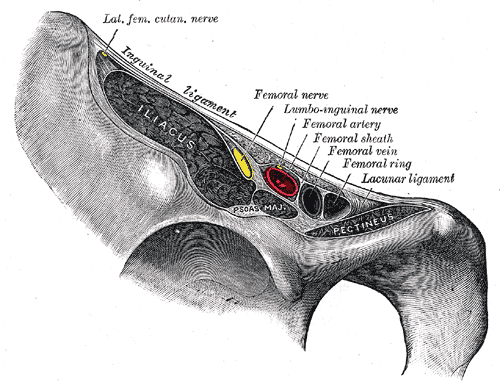
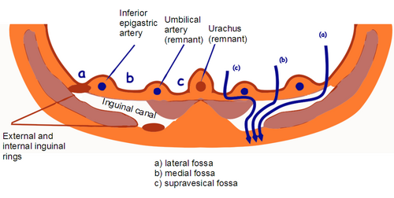

# HÉRNIA FEMORAL

A hérnia femoral, também conhecida como hérnia crural, é um dos temas mais "traiçoeiros" da cirurgia geral em provas de residência. Por que? Porque ela é menos frequente que a inguinal, mas proporcionalmente muito mais perigosa. Se você entender a anatomia do canal femoral, você mata 90% das questões. O restante é saber indicar a cirurgia (que, spoiler: é quase sempre).

Como costumamos discutir no MedEvo, o segredo aqui não é decorar nomes de ligamentos, mas entender como eles formam uma "moldura" rígida que não aceita desaforo.

*Figura 1 - Ilustração anatômica de Gray mostrando a região inguinal e o canal femoral, com os vasos femorais e estruturas adjacentes. O canal femoral é limitado por estruturas rígidas, explicando a alta taxa de encarceramento das hérnias femorais. Fonte: Henry Vandyke Carter, Domínio Público | Wikimedia Commons*

## Anatomia do Canal Femoral: O Coração do Problema

Para entender a hérnia femoral, você precisa visualizar o **Espaço Miopectíneo de Fruchaud**. Imagine um portal na região da virilha por onde passam os vasos e nervos para a perna. Esse portal é dividido pelo ligamento inguinal. Acima dele, temos as hérnias inguinais; abaixo dele, no canal femoral, temos a nossa protagonista de hoje.

O canal femoral é um espaço virtual, pequeno e, acima de tudo, **inelástico**. É aqui que mora o perigo. Diferente do anel inguinal profundo, que tem certa complacência, os limites do canal femoral são estruturas fibrosas e ósseas.

### Os Limites do Canal Femoral (Decore isso!)

As bancas amam cobrar os limites do anel femoral. Se você fechar os olhos agora, precisa visualizar esta moldura:

- **Anterior:** Ligamento Inguinal (ou o trato iliopúbico, dependendo da visão cirúrgica).

- **Posterior:** Ligamento Pectíneo (também chamado de **Ligamento de Cooper**). Guarde esse nome: Cooper é o "chão" onde fixamos os pontos na cirurgia.

- **Medial:** Ligamento Lacunar (ou Ligamento de Gimbernat). É uma expansão do ligamento inguinal.

- **Lateral:** Veia Femoral.

**Cuidado:** Um erro clássico de prova é dizer que a artéria femoral é o limite lateral. Não é! A veia femoral está imediatamente lateral ao canal. A artéria está mais lateral ainda. Portanto, a hérnia femoral protrui **medial aos vasos femorais**.

### A "Corona Mortis"

Durante a dissecção do canal femoral, o cirurgião deve ter pavor de uma estrutura: a *Corona Mortis*. Trata-se de uma anastomose arterial ou venosa entre os vasos epigástricos inferiores e os vasos obturadores. Ela passa por cima do ligamento de Cooper. Se você "passar o ponto" de forma inadvertida ou lesionar essa região sem cautela, terá um sangramento de difícil controle. Lembre-se disso para questões sobre complicações intraoperatórias.

## Epidemiologia e Fatores de Risco

Aqui reside a primeira grande pegadinha das bancas. Preste atenção na frase abaixo:

> "A hérnia femoral é mais comum em mulheres do que em homens, mas a hérnia mais comum em mulheres ainda é a inguinal indireta."

Se a questão perguntar: "Qual a hérnia mais comum no sexo feminino?", a resposta é **Hérnia Inguinal Indireta**.
Se a questão perguntar: "Em qual sexo a hérnia femoral é mais prevalente?", a resposta é **Sexo Feminino**.

### Por que as mulheres?

A bacia feminina é mais larga, o que aumenta o diâmetro do canal femoral. Além disso, a multiparidade (várias gestações) e a obesidade aumentam a pressão intra-abdominal, empurrando o conteúdo peritoneal para dentro desse canal estreito. O envelhecimento também é um fator crucial, devido à perda de colágeno e enfraquecimento das fáscias.

| Fator de Risco | Por que aumenta o risco? |
| --- | --- |
| **Sexo Feminino** | Pelve mais larga e canal femoral mais amplo. |
| **Idade Avançada** | Degradação do colágeno e fraqueza da fáscia transversalis. |
| **Multiparidade** | Aumento crônico da pressão intra-abdominal e frouxidão ligamentar. |
| **Obesidade** | Aumento da pressão intra-abdominal. |
| **Tosse Crônica/Constipação** | Manobras de Valsalva repetitivas. |

## Fisiopatologia: O Risco de Estrangulamento

Por que somos tão agressivos no tratamento da hérnia femoral? Pense comigo: o anel femoral é delimitado pelo ligamento de Cooper (osso/fibra), ligamento lacunar (fibra rígida) e ligamento inguinal (fibra tensa).

Quando uma alça intestinal entra ali, ela entra "apertada". Se houver um pequeno edema, a alça não consegue mais voltar. O risco de encarceramento e, consequentemente, de **estrangulamento** (isquemia) é altíssimo, chegando a 40% em algumas séries.

Comparativamente, uma hérnia inguinal tem um risco de estrangulamento muito menor (cerca de 5%). Por isso, como dizemos no MedEvo, "Hérnia femoral diagnosticada é hérnia femoral operada", mesmo que seja assintomática.

## Quadro Clínico e Exame Físico

O paciente clássico de prova é uma **mulher idosa, magra ou obesa**, que se queixa de um "caroço" na virilha.

### Onde está o abaulamento?

Esta é a chave do diagnóstico diferencial.

- **Hérnia Inguinal:** O abaulamento ocorre **acima** do ligamento inguinal.

- **Hérnia Femoral:** O abaulamento ocorre **abaixo** do ligamento inguinal e **lateral** ao tubérculo púbico.

Muitas vezes, a hérnia femoral é pequena e o paciente é obeso, o que dificulta a palpação. Não raramente, o diagnóstico só é feito quando a paciente abre um quadro de **abdome agudo obstrutivo**.

**Dica de Prova:** Se a questão trouxer uma idosa com vômitos, distensão abdominal e uma "massa dolorosa" na região crural, não perca tempo: é uma hérnia femoral estrangulada.

*Figura 2 - Diagrama anatômico das fossas inguinais vistas pelo aspecto posterior da parede abdominal, mostrando as relações entre as fossas inguinais medial, lateral e o canal femoral, fundamental para o diagnóstico diferencial entre hérnias inguinais e femorais. Fonte: Rocco Cusari, Domínio Público | Wikimedia Commons*

## Diagnóstico Diferencial

Nem tudo que "abala" na região crural é hérnia. As bancas gostam de colocar estas opções:

- **Linfonodo de Cloquet infartado:** Um linfonodo que fica dentro do canal femoral. Pode simular uma hérnia encarcerada.

- **Varize da veia safena:** Um "bolo" de varizes na junção safeno-femoral. O diferencial é que a varize desaparece ao deitar e tem um "frêmito" à tosse (sinal de Cruveilhier).

- **Abscesso de Psoas:** Geralmente associado a quadros infecciosos ou tuberculose, com dor à extensão da coxa.

- **Aneurisma de artéria femoral:** Massa pulsátil (fácil diferenciar, mas cai em prova).

| Característica | Hérnia Femoral | Hérnia Inguinal |
| --- | --- | --- |
| **Localização** | Abaixo do ligamento inguinal | Acima do ligamento inguinal |
| **Relação com Vasos** | Medial à veia femoral | Superior aos vasos |
| **Sexo Predominante** | Feminino | Masculino |
| **Risco de Estrangulamento** | Muito Alto (40%) | Baixo (5%) |
| **Conduta Inicial** | Cirurgia sempre | Observação possível (se assintomática) |

## Classificação de Nyhus

Você não pode ir para a prova sem saber a Classificação de Nyhus. Ela é o padrão-ouro das questões de cirurgia de hérnia.

- **Tipo I:** Inguinal indireta (anel inguinal profundo normal). Comum em crianças.

- **Tipo II:** Inguinal indireta (anel inguinal profundo dilatado, mas parede posterior preservada).

- **Tipo III:** Defeitos na parede posterior.

- IIIa: Inguinal Direta.

- IIIb: Inguinal Indireta com destruição da parede posterior (mista ou "em calça").

- **IIIc: Hérnia Femoral.** (ESTA É A NOSSA!)

- **Tipo IV:** Hérnias Recidivadas.

- IVa: Direta.

- IVb: Indireta.

- **IVc: Femoral.**

- IVd: Mista.

**Memorize:** Femoral é sempre Nyhus IIIc (se primária) ou IVc (se recidivada).

## Variantes Especiais: Richter, Littré e De Garengeot

As bancas adoram nomes próprios. Aqui estão os três que você precisa conhecer para a hérnia femoral:

### 1. Hérnia de Richter (Pinçamento Lateral)

Esta é a favorita dos examinadores. Ocorre quando apenas uma **parte da circunferência da alça intestinal** (borda antimesentérica) fica presa no anel herniário.

- **O "Pulo do Gato":** Como a luz do intestino não está totalmente obstruída, o paciente **não apresenta sinais de obstrução intestinal** (passa gases e fezes). No entanto, a parte presa sofre isquemia e pode perfurar.

- **Resultado:** O diagnóstico é tardio e o paciente chega com peritonite grave sem nunca ter tido uma "parada de eliminação de gases".

### 2. Hérnia de De Garengeot

É quando o conteúdo do saco herniário da **hérnia femoral** é o **apêndice cecal**. Se o apêndice inflamar ali dentro, temos uma apendicite dentro da hérnia femoral.

- **Tratamento:** Apendicectomia + Reparo da hérnia. (Não confunda com Hérnia de Amyand, que é o apêndice na hérnia *inguinal*).

### 3. Hérnia de Littré

É a presença do **Divertículo de Meckel** dentro do saco herniário (seja ele inguinal ou femoral).

## Tratamento Cirúrgico

Como já estabelecemos, o tratamento é cirúrgico ao diagnóstico. A dúvida na prova geralmente é: "Qual técnica usar?".

### 1. Acesso Inguinal vs. Acesso Femoral

Existem três vias clássicas:

- **Via Crural (Técnica de Bassini/Plug):** Incisão direta sobre o abaulamento na coxa. É simples, mas o espaço é limitado.

- **Via Inguinal (Técnica de McVay):** Acesso pelo canal inguinal (como se fosse operar uma inguinal). Permite tratar tanto uma inguinal associada quanto a femoral.

- **Via Pré-peritoneal (Nyhus/Stoppa/Laparoscopia):** Acesso por trás da parede abdominal. Excelente para hérnias recidivadas (Nyhus IVc).

### 2. Técnica de McVay (A queridinha das provas)

Se a questão perguntar qual a técnica clássica para tratar hérnia femoral **sem tela** (ou quando há contraindicação ao uso de tela, como em infecções graves), a resposta é **McVay**.

- **Como funciona:** O cirurgião sutura o **tendão conjunto** (músculo transverso + oblíquo interno) no **ligamento de Cooper**.

- **Por que funciona:** Ao fazer isso, você "fecha" o canal femoral por cima.

- **Detalhe técnico:** Como o ligamento de Cooper é rígido, essa sutura gera muita tensão. Por isso, é obrigatório fazer uma **incisão de relaxamento** na aponeurose do músculo reto abdominal para que os tecidos consigam chegar até o Cooper sem rasgar.

### 3. Uso de Telas (Hernioplastia)

Hoje, o padrão-ouro é o uso de telas.

- **Técnica de Lichtenstein modificada:** Pode-se usar a tela de Lichtenstein, mas fixando a borda inferior no ligamento de Cooper para obliterar o canal femoral.

- **Plug e Patch (Técnica de Rutkow-Robbins):** Coloca-se um "cone" de tela (plug) dentro do canal femoral. É muito eficaz e rápido.

- **Laparoscopia (TAPP ou TEP):** É excelente para hérnias femorais porque a tela cobre todo o espaço miopectíneo de Fruchaud, selando os orifícios inguinal direto, indireto e femoral de uma só vez.

### O que fazer na Hérnia Encarcerada/Estrangulada?

Se você estiver operando uma hérnia femoral e não conseguir reduzir a alça porque o anel é muito apertado, o que você deve cortar?

- **Resposta:** O **ligamento lacunar (Gimbernat)**. Ele é o limite medial e é "cortável". Nunca corte lateralmente (veia femoral) ou posteriormente (osso/Cooper).

- **Cuidado:** Se houver suspeita de necrose, você deve abrir o saco herniário, avaliar a alça e, se necessário, realizar a ressecção intestinal. Se a alça "fugir" para dentro do abdome antes de você avaliá-la, você será obrigado a fazer uma laparotomia para achá-la.

## Complicações Pós-Operatórias

Além das complicações comuns a qualquer cirurgia (infecção de sítio cirúrgico, seroma, hematoma), a cirurgia de hérnia femoral tem algumas particularidades:

- **Lesão da Veia Femoral:** Por estar imediatamente lateral ao canal, pode ser atingida por agulhas ou comprimida por plugs de tela muito grandes (causando edema na perna).

- **Dor Crônica:** Menos comum que na inguinal, mas pode ocorrer por lesão de ramos nervosos (nervo genitofemoral).

- **Atelectasia Pulmonar:** Como mencionado nas pérolas clínicas, em pacientes idosos (perfil clássico da femoral) submetidos a cirurgia abdominal, a atelectasia é a principal causa de febre e dispneia no 1º dia pós-operatório (DPO). Isso ocorre pela dor ao respirar e imobilidade.

## 📊 Tabelas Comparativas para Revisão Rápida

### Tabela 1: Anatomia do Canal Femoral

| Limite | Estrutura Anatômica | Importância Cirúrgica |
| --- | --- | --- |
| **Anterior** | Ligamento Inguinal | Referência para diferenciar de inguinal |
| **Posterior** | Ligamento de Cooper | Local de fixação da técnica de McVay |
| **Medial** | Ligamento Lacunar | Deve ser seccionado para reduzir hérnias presas |
| **Lateral** | Veia Femoral | Risco de lesão e trombose |

### Tabela 2: Classificação de Nyhus (Foco em Femoral)

| Tipo | Descrição | Conduta Sugerida |
| --- | --- | --- |
| **IIIc** | Hérnia Femoral Primária | Cirurgia eletiva (McVay ou Tela) |
| **IVc** | Hérnia Femoral Recidivada | Acesso pré-peritoneal ou Laparoscopia |

### Tabela 3: Epônimos em Hérnias

| Nome | Conteúdo do Saco Herniário | Localização |
| --- | --- | --- |
| **Richter** | Parte da borda antimesentérica da alça | Qualquer anel (comum na femoral) |
| **De Garengeot** | Apêndice Cecal | Canal Femoral |
| **Amyand** | Apêndice Cecal | Canal Inguinal |
| **Littré** | Divertículo de Meckel | Qualquer anel |

## 💡 Pontos-Chave para Prova

- **Localização Exata:** A hérnia femoral protrui **abaixo** do ligamento inguinal e **medial** aos vasos femorais.

- **Epidemiologia:** Mais comum em mulheres idosas e multíparas. No entanto, a hérnia inguinal ainda é a mais comum no sexo feminino em números absolutos.

- **Risco de Estrangulamento:** É o mais alto entre todas as hérnias da parede abdominal (cerca de 40%).

- **Conduta:** Sempre cirúrgica ao diagnóstico, mesmo se assintomática.

- **Hérnia de Richter:** Pinçamento lateral da alça. Causa isquemia e perfuração **sem** causar obstrução intestinal completa. Pegadinha clássica!

- **Técnica de McVay:** Técnica sem tela que usa o ligamento de Cooper. Exige incisão de relaxamento no reto abdominal.

- **Nyhus IIIc:** É o código da hérnia femoral primária na classificação de Nyhus.

- **Diagnóstico Diferencial:** Varize de safena (tem frêmito à tosse) e Linfonodo de Cloquet (massa fixa, sem relação com Valsalva).

- **Manobra de Redução:** Se estiver difícil reduzir, seccione o ligamento lacunar (medial).

- **Corona Mortis:** Anastomose entre vasos epigástricos e obturadores que passa sobre o ligamento de Cooper. Risco de sangramento grave.

- **Hérnia de De Garengeot:** Apêndice inflamado dentro do canal femoral.

- **Acesso Preferencial na Recidiva:** Pré-peritoneal (Nyhus posterior ou Laparoscopia TAPP/TEP).

- **Erro a evitar:** Nunca dizer que a técnica de Bassini trata hérnia femoral. Bassini é para inguinal (sutura no ligamento inguinal, não no Cooper).

- **Atelectasia:** Principal complicação pulmonar em idosos no 1º DPO de cirurgias de hérnia.

- **Espaço de Fruchaud:** O "buraco" anatômico que permite a ocorrência de hérnias inguinais e femorais.

- **Trato Iliopúbico:** É a estrutura que o cirurgião vê como limite anterior quando opera por via posterior (laparoscopia).

Lembre-se: na prova de residência, se a paciente é uma senhora com uma "bolinha" dolorosa na coxa, a banca está gritando "Hérnia Femoral". Não procure chifre em cabeça de cavalo. Aplique os conceitos de McVay, Nyhus IIIc e o risco de estrangulamento, e você garantirá esses pontos. Como sempre reforçamos no MedEvo, a anatomia dita a regra e a clínica confirma a conduta.

 Cópia offline para consulta pessoal.
 Fonte original:
 [https://www.medevo.com.br/material-apoio/ler/7e52e6ae-a0d5-4602-98f1-f7a254f9d633](https://www.medevo.com.br/material-apoio/ler/7e52e6ae-a0d5-4602-98f1-f7a254f9d633)
