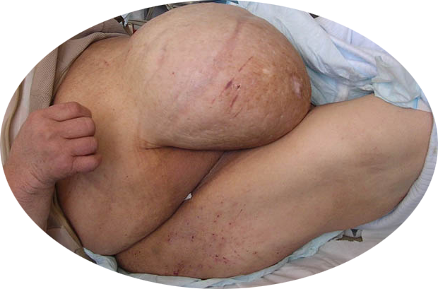

# HÉRNIA INCISIONAL E VENTRAL: DIAGNÓSTICO E TRATAMENTO

Para entender as hérnias da parede abdominal, você precisa parar de pensar nelas apenas como "um buraco que precisa ser tapado". Como cirurgião, eu te digo: a hérnia é o estágio final de uma falência mecânica e biológica da parede abdominal. Se você não entender por que ela abriu, você não vai saber como fechá-la de forma que ela não volte.

Nas provas de residência, o foco mudou. Antigamente, cobrava-se apenas o nome das técnicas. Hoje, a cobrança é sobre o **planejamento**: quando pedir TC? Como preparar o paciente obeso? Como evitar a temida Síndrome Compartimental no pós-operatório? Vamos dissecar isso agora.

*Figura 1 - Fotografia clínica de volumosa hérnia incisional (laparocele), demonstrando a protrusão de conteúdo abdominal através de defeito na parede abdominal anterior sobre cicatriz cirúrgica prévia. Fonte: Rocco Cusari, CC BY-SA 3.0 | Wikimedia Commons*

## O que define uma Hérnia Ventral e Incisional?

Hérnia ventral é um termo genérico que engloba todas as protrusões de conteúdo intra-abdominal através de um defeito na parede anterior do abdome. Elas podem ser:

- **Primárias:** Umbilicais, epigástricas, de Spiegel ou lombares.

- **Incisionais:** Aquelas que ocorrem sobre uma cicatriz cirúrgica prévia.

A hérnia incisional é, na verdade, uma **deiscência aponeurótica crônica**. É o resultado de uma cicatrização que falhou. Guarde este dado: cerca de 10% a 15% das laparotomias evoluem para hérnia incisional. Se houver infecção do sítio cirúrgico, esse número salta para mais de 30%.

## Fisiopatologia: Por que a parede abre?

Muitos alunos acham que a hérnia acontece porque o paciente "fez força" no pós-operatório. Isso é um mito de beira de leito. A hérnia acontece por uma combinação de **tensão excessiva** na linha de sutura e **biologia tecidual pobre**.

### O papel da técnica de fechamento

Aqui entra um conceito que despenca em provas recentes: a técnica de **"Small Bites"**.
Estudos (como o STITCH trial) mostraram que fechar a aponeurose com pontos pequenos (5 a 8 mm de distância da borda e entre os pontos), usando uma proporção de fio:ferida de 4:1, reduz drasticamente a incidência de hérnia incisional.

**Por que isso funciona?** Porque "large bites" (pontos grandes e distantes) causam isquemia do tecido entre os pontos. Tecido isquêmico não cicatriza; ele necrosa e o fio "serra" a aponeurose, criando o defeito.

### Fatores de Risco: O que realmente importa?

As bancas adoram colocar "anemia" ou "idade avançada" como fatores de risco principais. Cuidado! A **anemia isolada não é fator de risco direto**. Os verdadeiros vilões são:

- **Infecção do Sítio Cirúrgico (IFO):** É o principal fator isolado.

- **Obesidade (IMC > 35):** Aumenta a pressão intra-abdominal e a taxa de infecção.

- **Diabetes Mellitus:** Especialmente se mal controlado (HbA1c elevada). É o fator metabólico mais relevante.

- **Tabagismo:** Altera a síntese de colágeno.

- **Tipo de Incisão:** Incisões longitudinais (linha média) têm maior risco que transversas (como a Pfannenstiel), devido à biomecânica das fibras musculares e à tração lateral dos músculos largos do abdome.

## Diagnóstico: Além do "Abaulamento"

O diagnóstico é eminentemente clínico. O paciente queixa-se de um abaulamento que surge ou piora com o esforço (Valsalva).

### Exame Físico e Manobras

Ao examinar, você deve palpar o anel herniário e avaliar o conteúdo.

- **Sinal de Fothergill:** Peça para o paciente realizar a manobra de Smith-Bates (elevar as pernas ou o tronco na maca). Se a massa continuar palpável e fixa, ela é da parede abdominal (como um hematoma de bainha de reto ou tumor desmoide). Se ela "sumir" ou diminuir, é intra-abdominal.

- **Hérnia de Spiegel:** Atenção aqui! Ela ocorre na **linha semilunar**, na borda lateral do músculo reto abdominal, geralmente abaixo da linha arqueada de Douglas. É difícil de palpar porque fica "escondida" sob a aponeurose do oblíquo externo.

### Quando a Tomografia (TC) é obrigatória?

Não pedimos TC para toda hérnia umbilical de 1 cm. No MedEvo, ensinamos que a TC de abdome com contraste é fundamental para o **planejamento cirúrgico** em:

- Hérnias volumosas ou gigantes (> 10-15 cm).

- Suspeita de perda de domicílio.

- Pacientes com múltiplas cirurgias prévias (para ver a anatomia dos músculos).

- Dúvida diagnóstica em obesos mórbidos.

A TC permite medir o **diâmetro do defeito** e o **volume do saco herniário** em relação à cavidade abdominal. Isso define se o paciente vai precisar de técnicas complexas de reconstrução.

## Classificação de Chevrel e Rath

Para falar a mesma língua que o examinador, você precisa conhecer essa classificação para hérnias incisionais:

- **M (Medial):** M1 (supraumbilical), M2 (justa-umbilical), M3 (infraumbilical), M4 (xifopubiana).

- **L (Lateral):** Subcostal, flanco, ilíaca.

- **W (Width/Largura):**

- W1: < 5 cm.

- W2: 5 a 10 cm.

- W3: 10 a 15 cm.

- W4: > 15 cm.

| Classificação W (Largura) | Tamanho do Defeito | Conduta Sugerida |
| --- | --- | --- |
| **W1** | < 5 cm | Fechamento primário + Tela |
| **W2** | 5 - 10 cm | Técnica de Rives-Stoppa (Sublay) |
| **W3** | 10 - 15 cm | Separação de Componentes (Ramirez) |
| **W4** | > 15 cm | Reconstrução complexa / Perda de domicílio |

*Figura 2 - Ilustração anatômica demonstrando o mecanismo da hérnia inguinal, com protrusão do conteúdo abdominal através do defeito da parede. O mesmo princípio se aplica às hérnias incisionais e ventrais, onde a tela (mesh) é fundamental para o reparo. Fonte: BruceBlaus, CC BY 3.0 | Wikimedia Commons*

## Tratamento: A Era das Telas

O dogma atual é: **Hérnia incisional > 2 cm deve ser corrigida com tela.**
Por que? Porque a taxa de recidiva apenas com sutura (fechamento primário) em defeitos maiores que 2-3 cm é inaceitavelmente alta (acima de 30-50%).

### Biomateriais: A Tela de Polipropileno

É a "rainha" das telas.

- **Características:** Monofilamentar, macroporosa, resistente e barata.

- **Vantagem:** Os poros grandes permitem que os macrófagos entrem e combatam bactérias, por isso ela é **resistente à infecção**.

- **Cuidado:** Ela NUNCA deve entrar em contato direto com as alças intestinais, pois causa aderências firmes e fístulas. Para contato com alças, usamos telas de dupla face (PTFE ou revestidas).

### Técnicas Cirúrgicas: Onde colocar a tela?

Este é o tópico que mais gera questões. A posição da tela em relação à aponeurose muda tudo:

- **Onlay:** Tela sobre a aponeurose (no tecido subcutâneo).

- *Problema:* Muita dissecção de subcutâneo, alto índice de seroma e infecção. Maior taxa de recidiva.

- **Inlay:** Tela "tapando" o buraco, sem aproximar a aponeurose.

- *Problema:* Não restaura a função da parede. Quase abandonada.

- **Sublay (Retromuscular - Técnica de Rives-Stoppa):** A tela fica atrás do músculo reto abdominal e à frente da bainha posterior/peritônio.

- *Por que é a melhor?* A própria pressão intra-abdominal empurra a tela contra a musculatura, ajudando a fixá-la (Princípio de Pascal). É o padrão-ouro para hérnias complexas.

- **IPOM (Intraperitoneal Onlay Mesh):** Usada na laparoscopia. A tela fica dentro do abdome, encostada nas alças (precisa ser tela especial).

### Hérnias Gigantes e a Técnica de Ramirez

Quando o defeito é muito largo (W3 ou W4), os músculos retos estão muito lateralizados. Se você tentar puxá-los para o meio à força, a sutura vai romper ou o paciente não vai conseguir respirar.

A **Separação Anterior de Componentes (Técnica de Ramirez)** consiste em incisar a aponeurose do músculo **oblíquo externo** lateralmente ao músculo reto. Isso "solta" a parede e permite que o músculo reto deslize em direção à linha média (ganho de até 10 cm de cada lado).

## Complicações Pós-Operatórias e Manejo

### Seroma: O "Susto" Comum

Paciente volta 15 dias após cirurgia de hérnia incisional com um abaulamento indolor, sem febre, no local da cirurgia.
**Conduta:** Conservadora. Uso de cintas abdominais e observação. Só puncionamos se houver suspeita de infecção ou se for muito volumoso/sintomático. Puncionar um seroma sobre uma tela é pedir para infectar a prótese.

### Síndrome Compartimental Abdominal (SCA)

Isso cai muito! Imagine uma hérnia com **perda de domicílio** (mais de 25-50% do conteúdo abdominal está "morando" no saco herniário). Quando o cirurgião coloca tudo para dentro e fecha a parede, o volume da cavidade fica pequeno para tanto conteúdo.

- **Fisiopatologia:** ↑ Pressão Intra-Abdominal (PIA) → Compressão da veia cava (↓ retorno venoso) → Compressão do diafragma (↓ complacência pulmonar) → Isquemia renal.

- **Quadro Clínico:** Abdome tenso, oligúria, aumento da pressão inspiratória no ventilador, hipotensão e hipercapnia.

- **Diagnóstico:** Medida da **Pressão Intra-Vesical (PIV)** com sonda de Foley.

- HIA (Hipertensão Intra-abdominal): PIA > 12 mmHg.

- SCA: PIA > 20 mmHg + Disfunção de órgãos.

- **Tratamento da SCA:** Reabrir o abdome (Laparostomia/Peritoneostomia).

## Situações Especiais e Pegadinhas

### O Paciente Diabético e Obeso

Muitas questões perguntam a conduta inicial para um paciente com IMC 42 e HbA1c de 9% com hérnia incisional redutível.
**Resposta:** Adiar a cirurgia eletiva. O risco de recidiva e infecção é gigante. A conduta é perda ponderal e controle glicêmico rigoroso antes de operar. Dr. Will sempre lembra: "Não se opera eletivamente uma falência biológica sem antes otimizar o hospedeiro".

### Evisceração vs. Eventração

- **Evisceração:** Emergência! Saída de vísceras através da ferida operatória no pós-operatório imediato (deiscência aguda de todas as camadas). Requer reoperação imediata.

- **Eventração:** É a própria hérnia incisional. A pele está íntegra, mas a aponeurose abriu. O tratamento é eletivo.

### Hérnia de Spiegel

Localizada na "Zona de Spiegel", entre a linha semilunar (borda lateral do reto) e a linha semicircular (arqueada). O defeito ocorre na aponeurose do transverso e oblíquo interno. Como o oblíquo externo costuma estar íntegro por cima, o diagnóstico clínico é difícil, sendo a TC muito útil aqui.

| Diferencial | Características Chave |
| --- | --- |
| **Hérnia Incisional** | Ocorre sobre cicatriz prévia; IFO é o maior risco. |
| **Hérnia de Spiegel** | Lateral ao reto abdominal; alto risco de encarceramento. |
| **Hérnia Epigástrica** | Linha média, entre xifoide e umbigo; geralmente gordura pré-peritoneal. |
| **Hematoma de Bainha** | Sinal de Fothergill positivo; trauma ou anticoagulação. |

## Pontos-Chave para Prova 💡

- **Principal fator de risco para recidiva:** Infecção do sítio cirúrgico (IFO).

- **Técnica de Small Bites:** Proporção fio:ferida de 4:1, pontos a cada 5-8 mm. Reduz hérnia incisional.

- **Tela de Polipropileno:** Monofilamentar e macroporosa. Pode ser usada em meios contaminados (com cautela), mas nunca em contato com alça.

- **Técnica de Rives-Stoppa:** Posição retromuscular (sublay). Considerada padrão-ouro para grandes hérnias.

- **Técnica de Ramirez:** Separação anterior de componentes (incisão do oblíquo externo). Usada para fechar a linha média em grandes defeitos.

- **Sinal de Fothergill:** Diferencia massa da parede (positivo) de massa intra-abdominal (negativo).

- **Hérnia de Spiegel:** Ocorre na linha semilunar, lateral ao músculo reto.

- **Síndrome Compartimental Abdominal:** PIA > 20 mmHg + Disfunção orgânica (Oligúria é o sinal precoce). Diagnóstico por pressão vesical.

- **Perda de Domicílio:** Quando > 25-50% do conteúdo abdominal está no saco herniário. Risco altíssimo de SCA no pós-op.

- **Preparo Pré-operatório:** Perda de peso (IMC < 35) e cessação do tabagismo (4 semanas) são fundamentais.

- **Anemia:** NÃO é fator de risco independente para hérnia incisional (pegadinha clássica).

- **Incisão de Pfannenstiel:** Tem menor taxa de hérnia que a infraumbilical mediana.

- **Seroma pós-op:** Conduta inicial é sempre conservadora (cinta abdominal).

- **Hérnia Incisional < 2 cm:** Pode-se considerar fechamento primário, mas a tendência moderna é tela para quase todos.

- **Diabetes:** HbA1c elevada é o fator metabólico que mais prediz falha na cicatrização e infecção.

- **Fio de escolha para fechamento:** Absorção lenta (Polidioxanona - PDS) ou inabsorvível monofilamentar (Prolene).

Lembre-se: na prova, se o paciente tem uma hérnia gigante e está evoluindo com queda de diurese e dificuldade respiratória no pós-operatório, não perca tempo. A resposta é **medir a pressão intra-vesical**. Este é o conceito que separa quem passa de quem fica no MedEvo.

 Cópia offline para consulta pessoal.
 Fonte original:
 [https://www.medevo.com.br/material-apoio/ler/783f6861-15ec-4c45-9e3d-7852c52d4c13](https://www.medevo.com.br/material-apoio/ler/783f6861-15ec-4c45-9e3d-7852c52d4c13)
