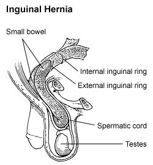
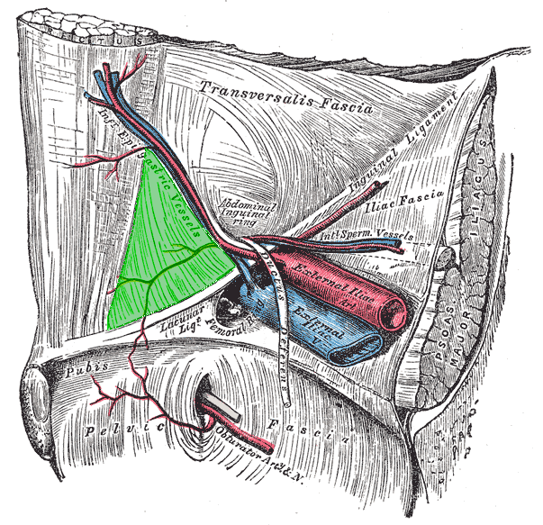
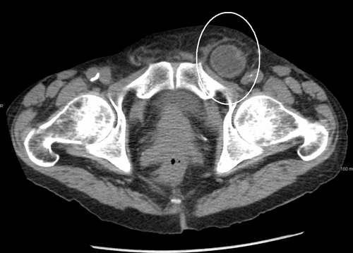

# HÉRNIA INGUINAL: DIRETA VS INDIRETA

Para entender hérnias, você não precisa decorar uma lista de nomes; você precisa visualizar a anatomia. Se você entender como a parede abdominal é construída, a diferença entre uma hérnia direta e uma indireta deixa de ser um "decoreba" e passa a ser uma consequência lógica. Nas provas de residência, as bancas não querem apenas que você saiba o nome da técnica, mas que você saiba por que escolheu aquela abordagem para aquele paciente específico.

## O Cenário Epidemiológico: Quem é o seu paciente?

A primeira coisa que você deve ter em mente é que a hérnia inguinal é a hérnia mais comum da parede abdominal. E aqui já vem a primeira pegadinha de prova: a hérnia inguinal **indireta** é a mais comum em **ambos os sexos** e em todas as faixas etárias.

Muitos alunos erram achando que, por a hérnia femoral ser mais comum em mulheres do que em homens, ela seria a mais comum no sexo feminino. Errado. A mais comum na mulher ainda é a inguinal indireta, embora a femoral tenha uma incidência proporcionalmente maior nelas do que neles.

Outro ponto: o lado direito é mais acometido que o esquerdo. Por quê? Porque o testículo direito costuma descer mais tarde que o esquerdo, e o conduto peritoniovaginal demora mais para obliterar desse lado. Guarde isso: se a questão fala de uma criança com abaulamento inguinal, 99% de chance de ser uma indireta por persistência do conduto peritoniovaginal.

*Figura 1 - Diagrama anatômico de hérnia inguinal, mostrando a protrusão do conteúdo abdominal através do canal inguinal. A diferenciação entre hérnia direta (medial aos vasos epigástricos) e indireta (lateral, pelo anel profundo) é fundamental. Fonte: NIH, Domínio Público | Wikimedia Commons*

## Anatomia: O "GPS" da Região Inguinal

Para diferenciar a direta da indireta, você precisa de um ponto de referência. Esse ponto são os **vasos epigástricos inferiores**. Eles são o divisor de águas.

### O Canal Inguinal e seus Limites

Imagine o canal inguinal como um túnel. Ele tem uma entrada (anel inguinal profundo), um trajeto e uma saída (anel inguinal superficial).

- **Teto:** Músculo oblíquo interno e transverso (músculo cremaster).

- **Chão:** Ligamento inguinal e ligamento lacunar.

- **Parede Anterior:** Aponeurose do músculo oblíquo externo.

- **Parede Posterior:** Fáscia transversalis e tendão conjunto.

Aqui está o segredo: a **hérnia indireta** entra pelo "buraco da fechadura" (anel inguinal profundo), que fica **lateral** aos vasos epigástricos inferiores. Já a **hérnia direta** não respeita o túnel; ela "atropela" a parede posterior, que está enfraquecida, em uma região chamada **Trígono de Hesselbach**, que fica **medial** aos vasos epigástricos inferiores.

### O Trígono de Hesselbach

Este é o território da hérnia direta. Seus limites caem direto em prova:

- **Lateral:** Vasos epigástricos inferiores.

- **Medial:** Borda lateral do músculo reto abdominal.

- **Inferior:** Ligamento inguinal (ou ligamento de Poupart).

*Figura 2 - Desenho anatômico demonstrando a vista interna do triângulo inguinal em verde. Fonte: Mikael Häggström, Domínio Público | Wikimedia Commons*

Se o conteúdo herniário protrui por dentro desse triângulo, ela é **Direta**. Se protrui lateralmente aos vasos, é **Indireta**. No MedEvo, sempre reforçamos: "Direta é no Defeito (da parede posterior), Indireta é no Início (pelo anel profundo)".

## Fisiopatologia: Por que a hérnia acontece?

### Hérnia Inguinal Indireta (Congênita)

A causa é a falha na obliteração do **processo vaginal** (ou conduto peritoniovaginal). Nas provas, isso é sinônimo de hérnia indireta. Como o saco herniário acompanha o cordão espermático, essa hérnia tem uma tendência muito maior de descer para o escroto (hérnia inguino-escrotal).

### Hérnia Inguinal Direta (Adquirida)

Aqui o problema é fraqueza tecidual. É o paciente idoso, tabagista, com DPOC (tosse crônica) ou com hiperplasia prostática benigna (esforço miccional). O aumento crônico da pressão intra-abdominal associado à degradação do colágeno faz com que a fáscia transversalis ceda. Por ser um defeito difuso da parede, a hérnia direta raramente encarcera ou desce para o escroto; ela é um abaulamento mais "espalhado".

| Característica | Hérnia Indireta | Hérnia Direta |
| --- | --- | --- |
| **Origem** | Congênita (Processo vaginal patente) | Adquirida (Fraqueza da parede posterior) |
| **Relação com Vasos Epigástricos** | Lateral | Medial (Trígono de Hesselbach) |
| **Local de Saída** | Anel Inguinal Profundo | Parede Posterior (Fáscia Transversalis) |
| **Risco de Encarceramento** | Maior | Menor |
| **Acometimento Escrotal** | Comum | Raro |
| **Manobra de Landivar** | Impulso na ponta do dedo | Impulso na polpa (lateral) do dedo |

## O Exame Físico e as Manobras Clássicas

O diagnóstico da hérnia inguinal é eminentemente **clínico**. Se a questão de prova te der um paciente com história típica e exame físico claro, e perguntar qual o próximo exame, a resposta é: nenhum. Vamos para a cirurgia (ou observação).

### Manobra de Landivar (ou Manobra do Dedo no Canal)

Você introduz o dedo indicador através do anel inguinal superficial, invaginando o escroto. Pede para o paciente tossir ou fazer Valsalva.

- Se você sentir a ponta do dedo ser tocada pelo conteúdo herniário: **Indireta**. (O conteúdo vem de cima, pelo canal).

- Se você sentir a lateral (polpa) do dedo ser tocada: **Direta**. (O conteúdo vem de trás, empurrando a parede posterior).

### Manobra de Taxe

É a tentativa de redução manual da hérnia. Cuidado: nunca faça manobra de Taxe em hérnias com sinais de estrangulamento (dor intensa, vermelhidão, febre, sinais de obstrução intestinal). Você pode reduzir uma alça isquêmica para dentro da cavidade e causar uma peritonite generalizada.

## Classificação de Nyhus: O Pesadelo que vamos simplificar

As bancas amam a Classificação de Nyhus. Para não errar, pense em uma escada de gravidade e anatomia:

- **Tipo I:** Indireta com anel inguinal profundo normal (comum em crianças).

- **Tipo II:** Indireta com anel inguinal profundo dilatado, mas a parede posterior está preservada.

- **Tipo III:** Defeito na parede posterior (O "A" de "Atrás", o "B" de "Bagunça" e o "C" de "Crural").

- **IIIa:** Direta (defeito na parede posterior).

- **IIIb:** Indireta que destruiu a parede posterior (mista, em pantalona ou anel muito dilatado).

- **IIIc:** Femoral (abaixo do ligamento inguinal).

- **Tipo IV:** Recidivada (A = direta, B = indireta, C = femoral, D = mista).

**Dica do Dr. Will:** Se a questão fala em "hérnia em pantalona", ela está descrevendo um paciente que tem uma hérnia direta e uma indireta simultaneamente, uma de cada lado dos vasos epigástricos. Isso é automaticamente um Nyhus IIIb.

*Figura 3 - Tomografia computadorizada de abdome demonstrando hérnia inguinal encarcerada, com alça intestinal herniada através do canal inguinal, achado importante para o diagnóstico e indicação cirúrgica. Fonte: James Heilman, MD, CC BY-SA 3.0 | Wikimedia Commons*

## Diagnóstico Diferencial: A Hérnia Femoral

A hérnia femoral (ou crural) é a grande "pegadinha". Ela ocorre através do canal femoral, **abaixo do ligamento inguinal**.

- É mais comum em mulheres multíparas e idosas.

- Tem o maior risco de estrangulamento de todas (o anel femoral é rígido e estreito).

- Na classificação de Nyhus, é a **IIIc**.

- Ao exame físico, o abaulamento é abaixo da linha da virilha e lateral ao tubérculo púbico.

## Tratamento: Quando e como operar?

### Estratégia Vigilante (Watchful Waiting)

Podemos apenas observar um paciente com hérnia inguinal? Sim, segundo a Diretriz Brasileira de Hérnia, isso é aceitável em pacientes **homens, idosos, com hérnias minimamente sintomáticas ou assintomáticas**. Por que? Porque o risco de uma hérnia inguinal direta encarcerar em um idoso é muito baixo, às vezes menor que o risco cirúrgico de um paciente com muitas comorbidades. Mas atenção: se for mulher ou se for hérnia femoral, **sempre opera**.

### Técnicas Cirúrgicas: O que cai na prova?

As técnicas se dividem em com tensão (usando apenas sutura) e sem tensão (usando tela).

#### 1. Técnica de Lichtenstein (Padrão-Ouro)

É a técnica "tension-free" mais realizada no mundo. Consiste na colocação de uma tela de polipropileno sobre a fáscia transversalis, reforçando a parede posterior.

- **Vantagem:** Menor taxa de recidiva e menos dor pós-operatória comparada às técnicas com tensão.

- **Indicação:** Praticamente todas as hérnias inguinais primárias no adulto.

#### 2. Técnica de Shouldice

É a melhor técnica **sem tela**. Consiste em uma imbricação de quatro camadas da fáscia transversalis e músculos.

- **Dica de Prova:** Se a questão pedir a técnica com menor taxa de recidiva entre as que **não usam tela**, a resposta é Shouldice. É muito usada em casos de infecção onde a tela é contraindicada.

#### 3. Técnica de McVay

É a técnica clássica para **hérnia femoral**. Ela sutura o tendão conjunto ao **ligamento de Cooper**. Como o ligamento de Cooper é muito profundo, essa técnica gera muita tensão, mas é eficaz para fechar o canal femoral.

#### 4. Técnica de Bassini

A "mãe" das cirurgias de hérnia. Sutura o tendão conjunto ao ligamento inguinal. Hoje é pouco usada devido à alta tensão, mas ainda é citada como base histórica.

#### 5. Técnica de Stoppa

Utiliza uma tela gigante no espaço **pré-peritoneal**. É excelente para hérnias bilaterais complexas ou recidivadas. Lembre-se: a tela fica atrás da fáscia transversalis, não na frente.

### Laparoscopia (TAPP vs TEP)

A cirurgia minimamente invasiva ganhou muito espaço. As duas principais vias são:

- **TAPP (Transabdominal Pré-Peritoneal):** Você entra na cavidade abdominal, corta o peritônio e coloca a tela.

- **TEP (Totalmente Extraperitoneal):** Você não entra na cavidade abdominal; trabalha apenas no espaço entre o músculo e o peritônio.

**Quando preferir laparoscopia?**

- Hérnias Bilaterais.

- Hérnias Recidivadas (se a primeira foi aberta).

- Desejo de retorno precoce às atividades.

## Complicações: O que pode dar errado?

### Encarceramento vs Estrangulamento

- **Encarcerada:** A hérnia está "presa", não reduz, mas o suprimento sanguíneo está preservado. Conduta: Tentar redução manual (Taxe) se não houver sinais inflamatórios. Se não reduzir, cirurgia de urgência.

- **Estrangulada:** Há isquemia. O paciente tem dor desproporcional, febre, leucocitose e a pele sobre a hérnia pode estar hiperemiada. Conduta: **Cirurgia de emergência**. Não tente reduzir!

### Hérnia de Richter

É uma variante perigosa onde apenas uma parte da borda antimesentérica da alça intestinal fica presa. O perigo é que o paciente pode ter isquemia e perfuração sem apresentar sinais de obstrução intestinal completa, já que o lúmen continua pérvio.

### Hérnia de Amyand

É quando o **apêndice vermiforme** está dentro do saco herniário inguinal. Se o apêndice estiver inflamado (apendicite), o tratamento envolve a apendicectomia e o reparo da hérnia (geralmente sem tela se houver contaminação).

### Dor Crônica (Inguinodinia)

É a complicação mais comum a longo prazo. Ocorre por lesão ou aprisionamento de nervos durante a cirurgia. Os nervos envolvidos são:

- **Ilioinguinal:** Inerva a base do pênis/monte de vênus e a face interna da coxa.

- **Ilio-hipogástrico:** Inerva a região suprapúbica.

- **Ramo genital do genitofemoral:** Inerva o cremaster e o escroto/grandes lábios.

## Casos Especiais e Tomada de Decisão

Imagine um paciente de 75 anos, hipertenso e diabético, com um abaulamento inguinal indolor que aparece apenas quando ele faz muito esforço e reduz espontaneamente. Ele tem medo de operar. Segundo os estudos de "Vigilant Strategy", você pode tranquilizá-lo e oferecer o acompanhamento clínico. O risco de ele ter uma complicação aguda é de cerca de 0,2% ao ano.

Agora, mude o cenário: uma mulher de 45 anos com uma "bolinha" dolorosa logo abaixo da prega inguinal. Isso é uma hérnia femoral até que se prove o contrário. O risco de estrangulamento aqui chega a 40% em alguns estudos. Conduta? Cirurgia eletiva o mais breve possível, preferencialmente com técnica de McVay ou plug de tela.

## Tabelas Comparativas para Revisão Rápida

### Tabela 1: Classificação de Nyhus Simplificada

| Tipo | Descrição | Detalhes Importantes |
| --- | --- | --- |
| **I** | Indireta | Anel profundo normal; comum em crianças. |
| **II** | Indireta | Anel profundo dilatado (>2cm); parede posterior OK. |
| **IIIa** | **Direta** | Defeito na parede posterior (fáscia transversalis). |
| **IIIb** | **Mista/Grande** | Indireta com destruição da parede posterior ou pantalona. |
| **IIIc** | **Femoral** | Abaixo do ligamento inguinal. |
| **IV** | **Recidivada** | A (direta), B (indireta), C (femoral), D (mista). |

### Tabela 2: Técnicas Cirúrgicas e suas Indicações

| Técnica | Tipo | Principal Indicação |
| --- | --- | --- |
| **Lichtenstein** | Sem tensão (Tela) | Padrão-ouro para hérnias inguinais no adulto. |
| **Shouldice** | Com tensão (Sutura) | Melhor opção quando não se pode usar tela (infecção). |
| **McVay** | Com tensão (Sutura) | Hérnia Femoral (usa o ligamento de Cooper). |
| **Stoppa** | Sem tensão (Tela) | Hérnias bilaterais ou recidivadas complexas. |
| **TAPP / TEP** | Laparoscopia | Bilaterais, recidivadas ou atletas. |

### Tabela 3: Nervos da Região Inguinal e Clínica de Lesão

| Nervo | Território Sensitivo | Sintoma de Lesão/Compressão |
| --- | --- | --- |
| **Ilioinguinal** | Base do pênis, escroto anterior, face interna da coxa. | Dor/parestesia na raiz da coxa e escroto. |
| **Ilio-hipogástrico** | Pele sobre o púbis e região inguinal lateral. | Dor referida no hipogástrio. |
| **Genitofemoral** | Escroto/grandes lábios e reflexo cremastérico. | Perda do reflexo cremastérico; dor escrotal. |

## Pontos-Chave para Prova 💡

- **Hérnia Indireta:** É a mais comum em todos, lateral aos vasos epigástricos, causada por persistência do conduto peritoniovaginal.

- **Hérnia Direta:** Medial aos vasos epigástricos (Trígono de Hesselbach), causada por fraqueza da fáscia transversalis.

- **Hérnia Femoral (Nyhus IIIc):** Mais comum em mulheres idosas, alto risco de estrangulamento, tratada com técnica de McVay.

- **Vasos Epigástricos Inferiores:** São o marco anatômico para diferenciar direta (medial) de indireta (lateral).

- **Manobra de Landivar:** Ponta do dedo = Indireta; Polpa do dedo = Direta.

- **Lichtenstein:** Técnica de escolha (sem tensão com tela) para a maioria dos casos.

- **Shouldice:** Técnica de escolha se houver contraindicação ao uso de tela (ex: campo infectado).

- **Hérnia de Amyand:** Apêndice no saco herniário.

- **Hérnia de Richter:** Pinçamento da borda antimesentérica; pode necrosar sem obstruir o intestino.

- **Conduta Expectante:** Válida apenas para homens idosos assintomáticos ou minimamente sintomáticos com hérnia inguinal.

- **Hérnia por Deslizamento:** Quando uma víscera (bexiga ou cólon) faz parte da parede do saco herniário. Mais comum em hérnias indiretas grandes.

- **Técnica de Stoppa:** Tela no espaço pré-peritoneal, ideal para recidivas e bilaterais.

- **Contraindicação Absoluta à Redução Manual:** Sinais de estrangulamento (isquemia, peritonite, instabilidade).

- **Hérnia em Pantalona (Nyhus IIIb):** Presença simultânea de componente direto e indireto no mesmo lado.

- **Nervo mais lesado:** O nervo ilioinguinal é frequentemente citado como o mais vulnerável na técnica aberta de Lichtenstein.

- **Recidiva:** O principal fator de risco para recidiva é a falha técnica (tamanho inadequado da tela ou fixação insuficiente).

Lembre-se: na prova, se o enunciado descrever uma tumoração que "toca a ponta do dedo" no exame do canal inguinal, não perca tempo. É indireta. Se o paciente for um idoso "tosse-tosse" com abaulamento que não desce para o escroto, pense em direta. E se for uma senhora com dor e massa abaixo do ligamento inguinal, corra para marcar hérnia femoral e cirurgia de McVay.

 Cópia offline para consulta pessoal.
 Fonte original:
 [https://www.medevo.com.br/material-apoio/ler/4f6e9221-8ec6-4481-a9c0-4834c88c4f70](https://www.medevo.com.br/material-apoio/ler/4f6e9221-8ec6-4481-a9c0-4834c88c4f70)
